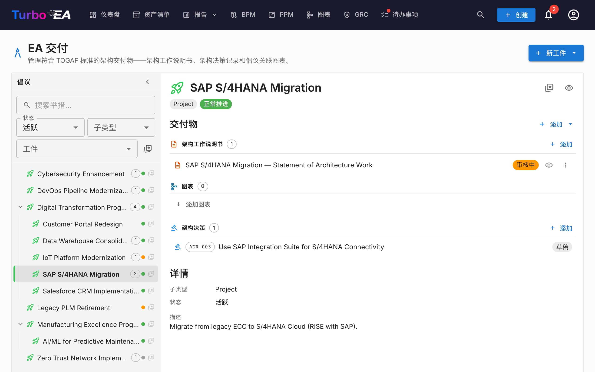
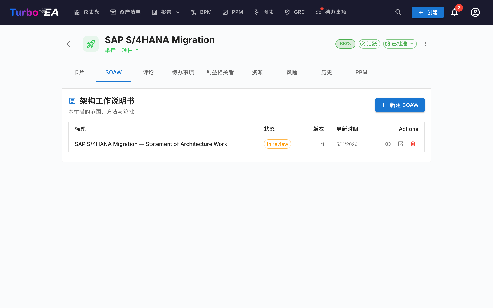
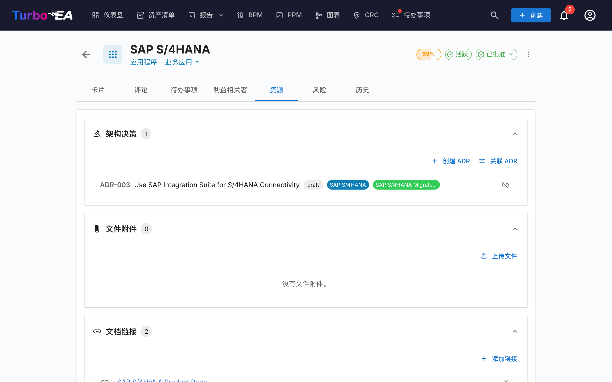

# EA 交付

**EA 交付**模块管理**架构项目及其工件** —— 图表、架构工作说明书（SoAW）和架构决策记录（ADR）。它提供所有正在进行的架构项目及其交付物的统一视图。

当启用 PPM（典型配置）时，EA 交付**位于 PPM 模块内**：在顶部导航中打开 **PPM**，并切换到 **EA Delivery** 标签页（`/ppm?tab=ea-delivery`）。当禁用 PPM 时，**EA 交付**会作为一个独立的顶级导航项出现，链接到 `/reports/ea-delivery`。无论哪种情况，旧的 `/ea-delivery` 链接都仍以重定向方式工作，因此现有书签仍可解析。

!!! tip
    正在规划版图变更（替换应用、退役系统、引入平台）？[过渡规划](transition-planning.md)工具可生成变更前/后对比视图，可附加到举措并一步提交。

## 举措工作区

EA 交付是一个**双栏工作区**（无内部标签页）：

- **左侧边栏** — 所有举措的可筛选缩进树（包括嵌套的子举措）。可以按名称搜索、按状态/子类型/工件筛选，或标记收藏。
- **右侧工作区** — 在左侧选中的举措对应的交付物、子举措和详情。选择其他行时，工作区会重新渲染。

选中状态会写入 URL（`?initiative=<id>`），因此您可以分享指向特定举措的直接链接，或刷新页面而不丢失上下文。

页面顶部有一个统一的主操作按钮 **+ 新工件 ▾**，用于创建新的 SoAW、图表或 ADR — 自动关联到所选举措（若没有选择，则保持未关联）。工作区中空的交付物分组也提供 **+ 添加 …** 按钮，确保创建始终一击可达。

每行显示：

| 元素 | 含义 |
|------|------|
| **名称** | 举措名称 |
| **数量徽标** | 关联工件总数（SoAW + 图表 + ADR） |
| **状态点** | 用于「正常 / 有风险 / 偏离 / 暂停 / 已完成」的彩色圆点 |
| **星标** | 收藏切换按钮 — 收藏会浮到顶部 |

当存在尚未关联到任何举措的 SoAW、图表或 ADR 时，树顶部会出现「未关联的工件」合成行。打开它即可重新关联。

## 架构工作说明书（SoAW）

**架构工作说明书（SoAW）** 是 [TOGAF 标准](https://pubs.opengroup.org/togaf-standard/)（开放组架构框架）定义的正式文档。它确定了架构参与的范围、方法、交付物和治理。在 TOGAF 中，SoAW 在**准备阶段**和**阶段 A（架构愿景）** 期间产生，作为架构团队与其干系人之间的协议。

Turbo EA 提供内置的 SoAW 编辑器，具有 TOGAF 对齐的章节模板、富文本编辑和导出功能 —— 因此您可以直接在架构数据旁边编写和管理 SoAW 文档。

### 创建 SoAW

1. 在左侧选中举措（可选 — 也可以创建未关联的 SoAW）。
2. 点击页面顶部的 **+ 新工件 ▾**（或在「交付物」分组中的 **+ 添加** 按钮），然后选择「新建架构工作说明书」。
3. 输入文档标题。
4. 编辑器打开并显示基于 TOGAF 标准的**预构建章节模板**。

### SoAW 编辑器

编辑器提供：

- **富文本编辑** —— 完整的格式工具栏（标题、粗体、斜体、列表、链接）由 TipTap 编辑器驱动
- **章节模板** —— 遵循 TOGAF 标准的预定义章节（例如问题描述、目标、方法、干系人、约束、工作计划）
- **行内可编辑表格** —— 在任何章节中添加和编辑表格
- **状态工作流** —— 文档通过定义的阶段进展：

| 状态 | 含义 |
|------|------|
| **草稿** | 正在编写，尚未准备好审核 |
| **审核中** | 已提交供干系人审核 |
| **已批准** | 已审核并接受 |
| **已签署** | 正式签署确认 |

### 签署工作流

SoAW 被批准后，您可以请求干系人签署。点击**请求签名**，然后使用搜索字段按姓名或电子邮件查找并添加签署人。系统跟踪谁已签署并向待签署人发送通知。

### 预览和导出

- **预览模式** —— 完整 SoAW 文档的只读视图
- **DOCX 导出** —— 将 SoAW 下载为格式化的 Word 文档，用于离线共享或打印

### 举措卡片上的 SoAW 标签页

举措还会在其卡片详情页上直接显示一个专属的 **SoAW** 标签页。该标签页列出与该举措关联的每个 SoAW（标题、状态徽标、修订号、最后修改日期），并提供一个 **+ 新建 SoAW** 按钮，预先选中当前举措——这样你可以在不离开当前卡片的情况下编写或跳转到某个 SoAW。创建复用 EA 交付页面相同的对话框，新文档会在两处同时出现。标签页的可见性遵循标准卡片权限规则。

## 架构决策记录（ADR）

**架构决策记录（ADR）** 记录重要的架构决策及其背景、后果和已考虑的替代方案。EA 交付工作区会在所选举措下的*架构决策*交付物分组中以内联方式列出**与该举措关联的 ADR**——您可以在不离开举措视图的情况下阅读和打开它们。使用页面顶部的拆分按钮 **+ 新工件 ▾**（或分组中的 **+ 添加** 按钮）创建一个预先关联到所选举措的新 ADR。

**ADR 主登记册**——可在其中跨整个景观对所有 ADR 进行筛选、搜索、签署、修订与预览——位于 GRC 模块下的 **GRC → 治理 → [决策](grc.md#governance)**。完整的 ADR 生命周期（网格列、筛选侧栏、签署工作流、修订、预览）请参见 GRC 指南。

## 资源选项卡

卡片现在包含一个**资源**选项卡，整合了以下内容：

- **架构决策** —— 与此卡片关联的 ADR，以与卡片类型颜色匹配的彩色胶囊显示。您可以关联现有的 ADR，也可以直接从资源选项卡创建新的 ADR —— 新 ADR 会自动关联到该卡片。
- **文件附件** —— 上传和管理文件（PDF、DOCX、XLSX、图片，最大 10 MB）。上传时，从以下选项中选择**文档类别**：架构、安全、合规、运维、会议纪要、设计或其他。类别以标签形式显示在每个文件旁边。
- **文档链接** —— 基于 URL 的文档引用。添加链接时，从以下选项中选择**链接类型**：文档、安全、合规、架构、运维、支持或其他。链接类型以标签形式显示在每个链接旁边，图标会根据所选类型变化。
