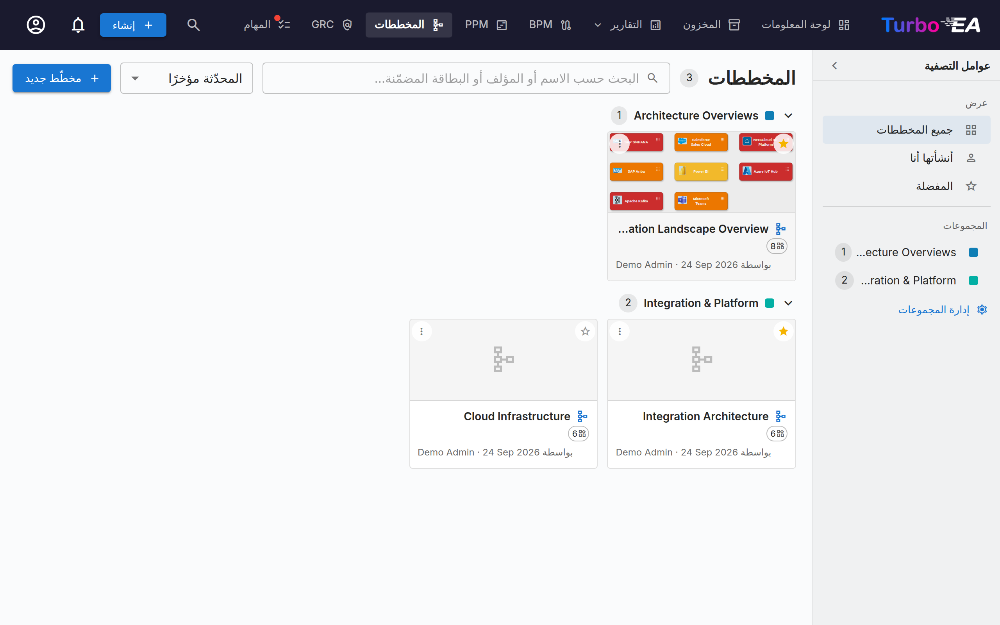

# المخططات

تتيح لك وحدة **المخططات** إنشاء **مخططات هندسة معمارية بصرية** باستخدام محرّر [DrawIO](https://www.drawio.com/) المدمج — متكاملة بالكامل مع مخزون بطاقاتك. اسحب البطاقات إلى لوحة الرسم، واربطها بعلاقات، وتعمّق في التسلسلات الهرمية، وأعِد التلوين حسب أي سمة — ويبقى المخطط متزامنًا مع بيانات هندسة المؤسسة لديك.



## معرض المخططات

يعرض المعرض كل مخطط كبطاقة مدمجة تتضمّن صورة مصغّرة واسمًا ومؤلفًا وعدد البطاقات التي يشير إليها. يمكنك **إنشاء** أي مخطط أو **فتحه** أو **تعديل تفاصيله** أو تنظيمه أو **حذفه**.

### العثور على المخططات

- **الشريط الجانبي للتصفية** — يحصر الشريط الأيمن المعرض في **جميع المخططات** أو **أنشأتها أنا** أو **المفضلة** لديك. اطوِه إلى شريط ضيّق باستخدام السهم؛ وعلى الشاشات الصغيرة يفتحه زر **عوامل التصفية** كلوحة منزلقة.
- **البحث** — يطابق مربع البحث اسم المخطط ومؤلفه وأسماء البطاقات المرسومة بداخله، لتتمكّن من العثور على مخطط حسب محتواه.
- **الترتيب** — حسب المحدّث مؤخرًا أو المنشأ مؤخرًا أو الاسم.
- **المفضلة** — انقر على النجمة في أي بطاقة لإضافتها إلى مفضلتك الشخصية؛ ويعرض مرشّح **المفضلة** جميعها.

### المجموعات

جمّع المخططات ذات الصلة في **مجموعات** — وهي تسميات مشتركة على مستوى مساحة العمل. يمكن أن ينتمي المخطط إلى عدة مجموعات في آنٍ واحد. في عرض البطاقات يعرض المعرض كل مجموعة كعنوان قابل للطي؛ وتظهر العناصر غير المعيّنة ضمن **غير مجمّع**.

- استخدم **إدارة المجموعات** في الشريط الجانبي لإنشاء المجموعات أو إعادة تسميتها أو تغيير ألوانها أو حذفها.
- استخدم **إضافة إلى المجموعات…** من قائمة المخطط لوضعه في مجموعة واحدة أو أكثر (يمكنك إنشاء مجموعة جديدة مباشرةً).
- يؤدي اختيار مجموعة في الشريط الجانبي إلى تصفية المعرض إلى تلك المجموعة فقط.


## محرّر المخططات

فتح مخطط يُطلق محرّر DrawIO بملء الشاشة في iframe من المصدر نفسه. يتوفّر شريط أدوات DrawIO الأصلي للأشكال والموصّلات والنص والتخطيط — وكل إجراء في Turbo EA مكشوف عبر قائمة سياق النقر بالزر الأيمن، وزر Sync في شريط الأدوات، وتراكب السهم الذي يجلس فوق كل بطاقة.

### إدراج البطاقات

استخدم نافذة **Insert Cards** (تُفتح من شريط الأدوات أو قائمة النقر بالزر الأيمن) لإضافة بطاقات إلى لوحة الرسم:

- تُرشّح **شرائح الأنواع ذات الأعداد الحية** في المسار الأيسر النتائج.
- ابحث بالاسم في المسار الأيمن؛ كل صف يحمل مربع اختيار.
- يضيف **Insert selected** البطاقات المختارة في شبكة؛ ويضيف **Insert all** كل بطاقة تطابق المرشّح الحالي (مع خطوة تأكيد عند تجاوز 50 نتيجة).

تفتح النافذة نفسها في وضع التحديد الفردي لـ **Change Linked Card** و**Link to Existing Card**.

تُظهر كل بطاقة على لوحة الرسم **أيقونة نوع بطاقتها** برمزًا أبيض صغيرًا في الزاوية العلوية اليسرى، بجوار لون النوع — فيُنقَل نوع البطاقة بالأيقونة واللون معًا. يطابق هذا الأيقونات المستخدمة عبر التطبيق ويحسّن الوضوح لمستخدمي عمى الألوان. تظهر الأيقونة على البطاقات المُدرَجة من الآن فصاعدًا. لإضافة أيقونات إلى بطاقات موجودة بالفعل على مخطط أقدم، انقر **Apply card-type icons** في شريط أدوات المحرّر.

### إجراءات النقر بالزر الأيمن

- **البطاقات المتزامنة**: *Open Card*، *Change Linked Card*، *Unlink Card*، *Remove from diagram*.
- **الأشكال العادية / الخلايا غير المربوطة**: *Link to Existing Card*، *Convert to Card* (يحتفظ بهندسة الشكل، ويحوّله إلى بطاقة معلّقة مزروعة بتسمية الشكل)، *Convert to Container* (يحوّل الشكل إلى مسار سباحة كي تتمكن بطاقات أخرى من التداخل داخله).

### قائمة التوسعة

تحمل كل بطاقة متزامنة تراكب سهم صغير. يفتح النقر عليه قائمة بثلاثة أقسام، كلٌّ مملوء في جولة ذهاب وإياب واحدة:

- **Show Dependency** — الجيران عبر العلاقات الصادرة أو الواردة، مجمّعين حسب نوع العلاقة مع الأعداد. كل صف مربع اختيار؛ التزم بـ **Insert (N)**.
- **Drill-Down** — يحوّل البطاقة الحالية إلى حاوية مسار سباحة مع أبناء `parent_id` متداخلين داخلها. اختر أي أبناء تُدرج أو *Drill into all*.
- **Roll-Up** — يلفّ البطاقة الحالية + الأشقّاء المختارين (البطاقات التي تتشارك `parent_id` نفسه) داخل حاوية أم جديدة.

تُعتَّم الصفوف ذات العدد = 0، وتُتخطّى تلقائيًا الجيران / الأبناء الموجودون بالفعل على لوحة الرسم.

تعرض البطاقة الموسّعة أيقونة `−` لطيّها مجدداً. يؤدي الطي إلى إزالة البطاقات الموسّعة من لوحة الرسم، لذلك يطلب Turbo EA تأكيداً أولاً إذا كنت قد نقلت أياً منها أو غيّرت تنسيقها؛ وعند التوسيع مجدداً تعود تماماً إلى حيث تركتها.

### التسلسل الهرمي على لوحة الرسم

تقابل الحاويات `parent_id` للبطاقة:

- **سحب بطاقة إلى داخل** حاوية من النوع نفسه يفتح *"Add «child» as a child of «parent»?"*. **Yes** يضع تغيير تسلسل هرمي في الطابور؛ و**No** يُرجع البطاقة بالقفز إلى مكانها.
- **سحب بطاقة إلى خارج** حاوية يطالب بالفصل (ضبط `parent_id = null`).
- **الإفلات عبر الأنواع** يُرجع البطاقة بالقفز صامتًا — فالتسلسل الهرمي مقيّد ببطاقات النوع نفسه.
- تصل كل التحركات المؤكَّدة إلى دلو **Hierarchy Changes** في درج Sync بإجراءَي *Apply* و*Discard*.

### إزالة البطاقات من المخطط

يُعامَل حذف بطاقة من لوحة الرسم بوصفه إيماءة **بصرية فقط** — *"لا أريد رؤية هذا هنا"*. تبقى البطاقة في المخزون؛ وتختفي معها صامتةً حواف العلاقات المتصلة بها. ولا تُزال تلقائيًا أبدًا الأسهم المرسومة يدويًا التي ليست علاقات هندسة مؤسسة مسجّلة. **الأرشفة مهمة صفحة المخزون**، لا المخطط.

### حذف الحواف

إزالة حافة تحمل علاقة حقيقية يفتح *"Delete the relation between SOURCE and TARGET?"*:

- **Yes** يضع الحذف في طابور درج Sync؛ و**Sync All** يُصدر `DELETE /relations/{id}` على جانب الخادم.
- **No** يستعيد الحافة في مكانها (مع الحفاظ على النمط ونقاط النهاية).

### منظورات العرض

تعيد القائمة المنسدلة **View** في شريط الأدوات تلوين كل بطاقة على لوحة الرسم حسب سمة:

- **Card colors** (افتراضي) — تستخدم كل بطاقة لون نوع بطاقتها.
- **Approval status** — يعيد التلوين حسب `approved` / `pending` / `broken`.
- **Field values** — اختر أي حقل تحديد فردي على أنواع البطاقات الموجودة حاليًا على لوحة الرسم (مثل *Lifecycle* أو *Status*). تعود الخلايا التي لا قيمة لها إلى رمادي محايد.

يُظهر مفتاح تفسير عائم في أسفل يسار لوحة الرسم التعيين النشط. ويُحفظ العرض المختار مع المخطط.

### كيف تُرسم خطوط العلاقات

تبدو كل علاقة في Turbo EA على لوحة الرسم بالشكل نفسه مهما كانت طريقة وصولها — سواء رسمتها يدوياً عبر منتقي العلاقات أو جلبتها من المخزون بزر **+** أو قائمة التوسعة:

- **خط واحد بلون رمادي داكن محايد**، لا بلون البطاقة في الطرف الآخر. فالخط *هو* العلاقة؛ وتلوينه حسب نوع البطاقة يكرّر ما تقوله العقدة أصلاً.
- **رأس سهم عند طرف الهدف**، فتُقرأ الوجهة بنظرة واحدة دون قراءة الفعل. وإذا جلبت علاقة تشير *إلى* البطاقة التي وسّعتها، انتقل رأس السهم إلى الطرف الآخر.
- **يُقرأ الفعل في اتجاه السهم.** فلمّا كان رأس السهم يحدّد هدف العلاقة، تُكمل التسمية دائماً جملة «البداية ← الفعل ← النهاية». ومن ثمّ تُقرأ الصلة الواحدة بالطريقة نفسها مهما كانت البطاقة التي وسّعتها: وسّع مؤسسة فترى *يستخدم*؛ ووسّع أحد تطبيقاتها فتظهر المؤسسات العائدة بالفعل *يستخدم* نفسه، وإنما بسهم موجّه في الاتجاه المعاكس.
- **خط متقطع** ما دامت العلاقة معلّقة، ويصبح متصلاً بمجرد دفعها إلى المخزون.

#### المزوّد والمستهلك

تحمل بعض العلاقات **اتجاه تدفّق** — وأبرزها الرابط بين التطبيق والواجهة، حيث *يوفّر* أحد التطبيقات الواجهة و*يستهلكها* غيره. حدّده في نافذة العلاقة عند رسم الرابط (أو لاحقاً من قسم العلاقات في البطاقة)، فيتبع رأس السهم عندئذٍ البيانات بدل العلاقة:

| اتجاه التدفّق | رأس السهم |
|---|---|
| **المزوّد** (المصدر ← الهدف) | يشير إلى الواجهة |
| **المستهلك** (الهدف ← المصدر) | يشير رجوعاً إلى التطبيق |
| **ثنائي الاتجاه** | رأسا سهم في الطرفين |

يطابق ذلك ما ترسمه [Layered Dependency View](reports.md) أصلاً، فيتوافق المخطط مع تقرير الاعتماديات. أما الروابط التي لم يُحدَّد اتجاه تدفّقها فتحتفظ بسهم اتجاه العلاقة المعتاد — إذ يجب أن تكون المعلومة في النموذج قبل أن يعرضها المخطط.

### إخفاء تسميات العلاقات

يحمل كل خط علاقة الفعل الخاص به — *يوفّر*، *يستهلك*، *يدعم*. وفي مشهد كثيف يتحول ذلك سريعاً إلى ضجيج بدل المعلومة، لذا تتيح قائمة **⋮** الخيار **إخفاء تسميات العلاقات** (و**إظهار تسميات العلاقات** لاستعادتها).

يقتصر الأمر على العرض: لا تتغير العلاقة نفسها، لذا يمكن التراجع عن الإخفاء دائماً. ويُحفظ الإعداد مع المخطط، فيطابق عارض القراءة فقط وأي مخطط منشور وعمليات التصدير إلى PNG/SVG ما رتّبته أنت. أما الخطوط التي ترسمها بعد ذلك فتتبع الإعداد الحالي. وتبقى خطوط التعليقات التي سمّيتها بنفسك دون تغيير — إذ تتأثر خطوط علاقات Turbo EA وحدها.

### درج Sync

يفتح زر **Sync** في شريط الأدوات الدرج الجانبي بكل شيء موضوع في طابور المزامنة التالية:

- **New Cards** — أشكال مُحوَّلة إلى بطاقات معلّقة، جاهزة للدفع إلى المخزون.
- **New Relations** — حواف مرسومة بين البطاقات، جاهزة للإنشاء في المخزون.
- **Removed Relations** — حواف علاقات محذوفة من لوحة الرسم، موضوعة في طابور `DELETE /relations/{id}`. يعيد *Keep in inventory* إدراج الحافة.
- **Hierarchy Changes** — تحركات السحب إلى الداخل / إلى الخارج للحاويات المؤكَّدة، موضوعة في طابور كتحديثات `parent_id`.
- **Inventory Changed** — بطاقات حُدِّثت في المخزون منذ فتح المخطط، جاهزة للسحب مجددًا إلى لوحة الرسم.

يُظهر زر Sync في شريط الأدوات كبسولة نابضة "N unsynced" كلما وُجد عمل معلّق. مغادرة علامة التبويب مع تغييرات غير متزامنة تطلق تحذير متصفح، وتحفظ لوحة الرسم تلقائيًا في التخزين المحلي كل خمس ثوانٍ كي يُستعاد تحديث عَرَضي عند إعادة الفتح.

### ربط المخططات بالبطاقات

يمكن ربط المخططات بـ**أي بطاقة** من علامة تبويب **Resources** للبطاقة (انظر [تفاصيل البطاقة](card-details.md#resources-tab)). وعند الربط ببطاقة **مبادرة**، يظهر المخطط أيضًا في وحدة [تسليم هندسة المؤسسة](delivery.md) إلى جانب مستندات SoAW.

## مشاركة مخطط خارج Turbo EA

يمكن نشر المخطط بوصفه **رابطاً للقراءة فقط يُفتح دون تسجيل الدخول**، بحيث يمكن تضمينه في صفحة ويكي مثل Confluence.

افتح قائمة **⋮** الخاصة بالمخطط في المعرض واختر **مشاركة / تضمين…**. يتطلب النشر صلاحية *نشر المخططات*، وهي منفصلة عن صلاحية تحريرها — يمنحها المسؤول عن قصد.

يوفّر مربع الحوار خيارين وسلسلتين للنسخ:

- **أي شخص لديه الرابط** — بدون تسجيل دخول. تعامل مع الرابط ككلمة مرور: أي شخص يُعاد توجيهه إليه يمكنه رؤية المخطط.
- **من يسجّلون الدخول فقط** — يتحقق الزوار من هويتهم لدى موفّر الهوية لديك، مع إمكانية التقييد بنطاقات بريد محددة. ولا يُنشأ لهم أي حساب في Turbo EA.

تعرض الصفحة المنشورة الصورة فقط. يمكن تحريكها وتكبيرها، لكن لا يوجد انتقال إلى تفاصيل البطاقات، كما تُزال معرّفات البطاقات خلف الأشكال قبل أن يغادر المخطط الخادم. يسري إيقاف النشر فوراً، حتى على من يشاهده في تلك اللحظة. وإعادة النشر لاحقاً تستعيد الرابط نفسه، فتظل الروابط الملصقة سابقاً تعمل.

!!! warning "يتطلب التضمين خطوة واحدة من المسؤول"
    لأسباب أمنية، لا يجوز لأي موقع آخر وضع Turbo EA داخل إطار ما لم يسمح المسؤول بذلك. اضبط `TURBO_EA_EMBED_ALLOWED_ORIGINS` في ملف `.env` على المواقع المسموح لها بتضمين المخططات، ثم أعد تشغيل الحزمة:

    ```dotenv
    TURBO_EA_EMBED_ALLOWED_ORIGINS=https://yourcompany.atlassian.net
    ```

    وإلى أن يتم ذلك، تظل الروابط المنشورة تعمل عند فتحها مباشرةً — غير أنه لا يمكن تضمينها في موقع آخر.

### التضمين في Confluence

1. انشر المخطط وانسخ **كود التضمين** من مربع حوار المشاركة.
2. اطلب من المسؤول إضافة عنوان Confluence الأساسي إلى `TURBO_EA_EMBED_ALLOWED_ORIGINS`.
3. في Confluence، أدرج ماكرو **HTML** (أو *Iframe* / *HTML include* بحسب ما تسمح به نسختك) ثم الصق الكود.

إذا كان Confluence لديك لا يسمح بماكرو HTML، فالصق **الرابط** العادي بدلاً من ذلك — فهو يفتح العرض نفسه في تبويب جديد.
