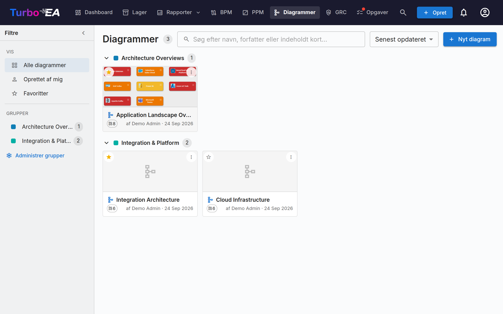

# Diagrammer

**Diagrammer**-modulet lader dig oprette **visuelle arkitekturdiagrammer** ved hjælp af en indlejret [DrawIO](https://www.drawio.com/)-editor — fuldt integreret med dit kortlager. Træk kort ind på lærredet, forbind dem med relationer, dril dig ned i hierarkier, og farv dem efter en hvilken som helst egenskab — diagrammet forbliver synkroniseret med dine EA-data.



## Diagramgalleri

Galleriet viser hvert diagram som et kompakt kort med et miniaturebillede, navn, forfatter og antallet af kort, det refererer til. **Opret**, **Åbn**, **Rediger detaljer**, organisér eller **Slet** ethvert diagram.

### Find diagrammer

- **Filtersidebjælke** — panelet til venstre indsnævrer galleriet til **Alle diagrammer**, **Oprettet af mig** eller dine **Favoritter**. Klap den sammen til en smal bjælke med pilen; på små skærme åbner knappen **Filtre** den som et glidepanel.
- **Søgning** — søgefeltet matcher et diagrams navn, dets forfatter og navnene på de kort, der er tegnet i det, så du kan finde et diagram ud fra dets indhold.
- **Sortering** — efter senest opdateret, senest oprettet eller navn.
- **Favoritter** — klik på stjernen på et kort for at føje det til dine personlige favoritter; filteret **Favoritter** viser dem alle.

### Grupper

Gruppér relaterede diagrammer i **grupper** — delte etiketter på tværs af arbejdsområdet. Et diagram kan tilhøre flere grupper på én gang. I kortvisning viser galleriet hver gruppe som en sammenklappelig overskrift; det ikke-tildelte vises under **Ugrupperet**.

- Brug **Administrer grupper** i sidebjælken til at oprette, omdøbe, omfarve eller slette grupper.
- Brug **Tilføj til grupper…** fra et diagrams menu for at placere det i en eller flere grupper (du kan oprette en ny gruppe undervejs).
- Vælges en gruppe i sidebjælken, filtreres galleriet til kun den gruppe.


## Diagramredaktøren

Når du åbner et diagram, starter den fuldskærms DrawIO-editor i en same-origin iframe. Den oprindelige DrawIO-værktøjslinje er tilgængelig for figurer, forbindelser, tekst og layout — hver Turbo EA-handling eksponeres via højrekliks-kontekstmenuen, synkroniseringsknappen i værktøjslinjen og chevron-overlejringen, der ligger oven på hvert kort.

### Indsættelse af kort

Brug dialogen **Insert Cards** (åbnes fra værktøjslinjen eller højrekliks-menuen) til at føje kort til lærredet:

- Type-**chips med live-tællere** på venstre skinne filtrerer resultaterne.
- Søg efter navn på højre skinne; hver række har et afkrydsningsfelt.
- **Insert selected** tilføjer de valgte kort i et gitter; **Insert all** tilføjer hvert kort, der matcher det aktuelle filter (med et bekræftelsestrin ud over 50 resultater).

Den samme dialog åbnes i enkeltvalgstilstand for **Change Linked Card** og **Link to Existing Card**.

Hvert kort på lærredet viser sit **korttype-ikon** som en lille hvid glyf i øverste venstre hjørne, ved siden af typefarven — så et korts type formidles af både ikon og farve. Det svarer til de ikoner, der bruges i hele appen, og forbedrer læsbarheden for farveblinde brugere. Ikonet vises på kort, der indsættes fra nu af. For at tilføje ikoner til kort, der allerede er på et ældre diagram, skal du klikke på **Anvend korttype-ikoner** på editorens værktøjslinje.

### Højrekliks-handlinger

- **Synkroniserede kort**: *Open Card*, *Change Linked Card*, *Unlink Card*, *Remove from diagram*.
- **Almindelige figurer / ulinkede celler**: *Link to Existing Card*, *Convert to Card* (bevarer figurens geometri, omdanner den til et afventende kort med figurens etikette som udgangspunkt), *Convert to Container* (omdanner figuren til en bane, så andre kort kan indlejres indeni).

### Expand-menuen

Hvert synkroniseret kort bærer en lille chevron-overlejring. Når du klikker på den, åbnes en menu med tre sektioner, hver fyldt på én rundtur:

- **Show Dependency** — naboer via udgående eller indgående relationer, grupperet efter relationstype med tællere. Hver række er et afkrydsningsfelt; bekræft med **Insert (N)**.
- **Drill-Down** — omdanner det aktuelle kort til en banecontainer med dets `parent_id`-børn indlejret indeni. Vælg hvilke børn der skal inkluderes, eller *Drill into all*.
- **Roll-Up** — pakker det aktuelle kort + udvalgte søskende (kort, der deler det samme `parent_id`) ind i en ny forældrecontainer.

Rækker med tæller = 0 er nedtonede, og naboer / børn, der allerede er på lærredet, springes automatisk over.

Et udfoldet kort viser et `−`-ikon, som klapper det sammen igen. Sammenklapning fjerner de udfoldede kort fra lærredet, så Turbo EA spørger først, hvis du har flyttet eller omformateret nogen af dem; udfolder du igen, står de præcis, hvor du forlod dem.

### Hierarki på lærredet

Containere svarer til et korts `parent_id`:

- **At trække et kort ind i** en container af samme type åbner *"Add «child» as a child of «parent»?"*. **Ja** kø-stiller en hierarkiændring; **Nej** snapper kortet tilbage.
- **At trække et kort ud af** en container beder om at afkoble (sætte `parent_id = null`).
- **Cross-type drops** snapper tilbage stille — hierarkiet er begrænset til kort af samme type.
- Alle bekræftede flytninger lander i **Hierarchy Changes**-spanden i synkroniseringsskuffen med *Apply*- og *Discard*-handlinger.

### Fjernelse af kort fra diagrammet

At slette et kort fra lærredet behandles som en **kun visuel** gestus — *"Jeg vil ikke se dette her"*. Kortet bliver i lageret; dets tilknyttede relationskanter forsvinder stille med det. Håndtegnede pile, der ikke er registrerede EA-relationer, fjernes aldrig automatisk. **Arkivering er en opgave for lagersiden**, ikke for diagrammet.

### Sletninger af kanter

At fjerne en kant, der bærer en rigtig relation, åbner *"Delete the relation between SOURCE and TARGET?"*:

- **Ja** kø-stiller sletningen i synkroniseringsskuffen; **Sync All** udsteder backend-kaldet `DELETE /relations/{id}`.
- **Nej** gendanner kanten på plads (stil og endepunkter bevares).

### Visningsperspektiver

Dropdownen **View** i værktøjslinjen omfarver hvert kort på lærredet efter en egenskab:

- **Card colors** (standard) — hvert kort bruger sin korttype-farve.
- **Approval status** — omfarver efter `approved` / `pending` / `broken`.
- **Field values** — vælg et hvilket som helst single-select-felt på de korttyper, der aktuelt er på lærredet (f.eks. *Lifecycle*, *Status*). Celler uden værdi falder tilbage til en neutral grå.

En flydende forklaring nederst til venstre på lærredet viser den aktive tilknytning. Den valgte visning gemmes med diagrammet.

### Hvordan relationskanter tegnes

Enhver Turbo EA-relation ser ens ud på lærredet, uanset hvordan den kom derhen — tegnet i hånden med relationsvælgeren eller hentet ind fra inventaret med **+** / Expand-menuen:

- **Én neutral mørkegrå linje**, ikke farven på kortet i den anden ende. En kant *er* en relation; at farve den efter korttype gentager blot det, noden allerede siger.
- **En pilespids i målenden**, så retningen kan aflæses på et øjeblik uden at læse udsagnsordet. Henter du en relation, der peger *mod* det kort, du udvidede, sidder pilespidsen i den anden ende.
- **Udsagnsordet læses i pilens retning.** Da pilespidsen markerer relationens mål, fuldender etiketten altid sætningen *start → udsagnsord → slut*. En forbindelse læses derfor ens, uanset hvilket kort du udvidede fra: udvid en Organisation, og du ser *bruger*; udvid en af dens Applikationer, og organisationerne, der kommer tilbage, viser stadig *bruger* — blot med pilen den anden vej.
- **En stiplet linje**, så længe relationen endnu ikke er sendt til inventaret; den bliver massiv, når den er.

#### Leverandør og forbruger

Nogle relationer bærer en **flowretning** — først og fremmest forbindelsen mellem en Applikation og en Grænseflade, hvor én applikation *leverer* grænsefladen, og andre *forbruger* den. Angiv den i relationsdialogen, når du tegner forbindelsen (eller bagefter fra kortets Relationer-sektion), så følger pilespidsen data i stedet for relationen:

| Flowretning | Pilespids |
|---|---|
| **Leverandør** (kilde → mål) | peger på Grænsefladen |
| **Forbruger** (mål → kilde) | peger tilbage på Applikationen |
| **Bidirektional** | pilespidser i begge ender |

Det svarer til det, [Layered Dependency View](reports.md) allerede tegner, så diagrammet og afhængighedsrapporten stemmer overens. Forbindelser uden angivet flowretning beholder den almindelige relationspil — informationen skal findes i modellen, før et diagram kan vise den.

### Skjul relationsetiketter

Hver relationskant viser sit udsagnsord — *leverer*, *forbruger*, *understøtter*. På et tæt landskab bliver det hurtigt mere støj end information, så **⋮**-menuen tilbyder **Skjul relationsetiketter** (og **Vis relationsetiketter** for at hente dem tilbage).

Det gælder kun visningen: selve relationen røres ikke, så det kan altid fortrydes. Indstillingen gemmes sammen med diagrammet, så den skrivebeskyttede fremviser, ethvert udgivet diagram og PNG-/SVG-eksport svarer til det, du har arrangeret. Kanter, du tegner bagefter, følger den aktuelle indstilling. Annoteringskanter, du selv har mærket, lades i fred — kun Turbo EA's relationskanter berøres.

### Synkroniseringsskuffe

Knappen **Sync** i værktøjslinjen åbner sideskuffen med alt, der er kø-stillet til næste synkronisering:

- **New Cards** — figurer konverteret til afventende kort, klar til at blive skubbet til lageret.
- **New Relations** — kanter tegnet mellem kort, klar til at blive oprettet i lageret.
- **Removed Relations** — relationskanter slettet fra lærredet, kø-stillet til `DELETE /relations/{id}`. *Keep in inventory* genindsætter kanten.
- **Hierarchy Changes** — bekræftede træk-ind / træk-ud container-flytninger, kø-stillet som `parent_id`-opdateringer.
- **Inventory Changed** — kort opdateret i lageret, siden diagrammet blev åbnet, klar til at blive trukket tilbage på lærredet.

Synkroniseringsknappen i værktøjslinjen viser en pulserende "N usynkroniseret"-pille, når der findes afventende arbejde. At forlade fanen med usynkroniserede ændringer udløser en browseradvarsel, og lærredet gemmes automatisk i lokalt lager hvert femte sekund, så en utilsigtet opdatering kan gendannes ved genåbning.

### Linke diagrammer til kort

Diagrammer kan linkes til **et hvilket som helst kort** fra kortets fane **Resources** (se [Kortdetaljer](card-details.md#resources-tab)). Når et diagram er linket til et **Initiative**-kort, vises det også i [EA Delivery](delivery.md)-modulet sammen med SoAW-dokumenter.

## Del et diagram uden for Turbo EA

Et diagram kan udgives som et **skrivebeskyttet link, der åbnes uden login**, så det kan indlejres på en wiki-side som Confluence.

Åbn diagrammets **⋮**-menu i galleriet, og vælg **Del / indlejr…**. Udgivelse kræver rettigheden *Udgiv diagrammer*, som er adskilt fra rettigheden til at redigere dem — en administrator tildeler den bevidst.

Dialogen giver dig to valg og to strenge at kopiere:

- **Alle med linket** — intet login. Behandl linket som en adgangskode: alle, det videresendes til, kan se diagrammet.
- **Kun personer, der logger ind** — besøgende godkendes hos din identitetsudbyder, eventuelt begrænset til bestemte e-maildomæner. Der oprettes ingen Turbo EA-konto til dem.

Den udgivne side viser kun billedet. Du kan panorere og zoome, men der er ingen adgang til kortdetaljer, og kort-id'erne bag figurerne fjernes, før diagrammet forlader serveren. At slå udgivelsen fra virker med det samme, også for dem der er i gang med at se. Udgiver du igen senere, gendannes det samme link, så URL'er, der allerede er indsat, bliver ved med at virke.

!!! warning "Indlejring kræver ét administratortrin"
    Af sikkerhedshensyn må ingen andre websteder placere Turbo EA i en ramme, medmindre en administrator tillader det. Sæt `TURBO_EA_EMBED_ALLOWED_ORIGINS` i `.env` til de websteder, der må indlejre diagrammer, og genstart stakken:

    ```dotenv
    TURBO_EA_EMBED_ALLOWED_ORIGINS=https://dinvirksomhed.atlassian.net
    ```

    Indtil da virker udgivne links stadig, når de åbnes direkte — de kan bare ikke indlejres af et andet websted.

### Indlejring i Confluence

1. Udgiv diagrammet, og kopiér **indlejringskoden** fra deledialogen.
2. Bed en administrator om at tilføje din Confluence-basis-URL til `TURBO_EA_EMBED_ALLOWED_ORIGINS`.
3. Indsæt en **HTML**-makro i Confluence (eller *Iframe* / *HTML include*, afhængigt af hvad din instans tillader), og indsæt koden.

Hvis dit Confluence ikke tillader HTML-makroer, kan du i stedet indsætte det almindelige **link** — det åbner den samme visning i en ny fane.
