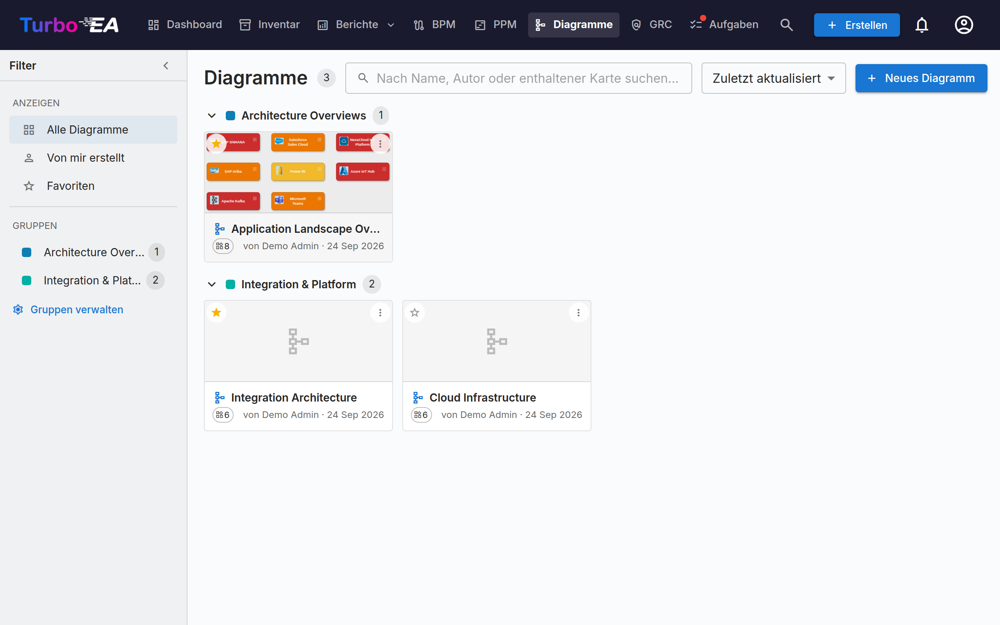

# Diagramme

Das Modul **Diagramme** ermöglicht es Ihnen, **visuelle Architekturdiagramme** mit einem eingebetteten [DrawIO](https://www.drawio.com/)-Editor zu erstellen -- vollständig integriert mit Ihrem Karteninventar. Ziehen Sie Karten auf die Leinwand, verbinden Sie sie mit Beziehungen, navigieren Sie durch Hierarchien und färben Sie nach beliebigen Attributen ein -- das Diagramm bleibt mit Ihren EA-Daten synchronisiert.



## Diagramm-Galerie

Die Galerie listet jedes Diagramm als kompakte Karte mit Vorschaubild, Name, Autor und der Anzahl der referenzierten Karten auf. **Erstellen**, **Öffnen**, **Details bearbeiten**, organisieren oder **Löschen** Sie jedes Diagramm.

### Diagramme finden

- **Filter-Seitenleiste** — die linke Leiste schränkt die Galerie auf **Alle Diagramme**, **Von mir erstellt** oder Ihre **Favoriten** ein. Mit dem Pfeil lässt sie sich zu einer schmalen Leiste einklappen; auf kleinen Bildschirmen öffnet die Schaltfläche **Filter** sie als eingeblendetes Panel.
- **Suche** — das Suchfeld findet Diagramme anhand ihres Namens, ihres Autors und der Namen der darin gezeichneten Karten, sodass Sie ein Diagramm anhand seines Inhalts finden können.
- **Sortierung** — nach zuletzt aktualisiert, zuletzt erstellt oder Name.
- **Favoriten** — klicken Sie auf den Stern einer Karte, um sie zu Ihren persönlichen Favoriten hinzuzufügen; der Filter **Favoriten** zeigt sie alle an.

### Gruppen

Gruppieren Sie zusammengehörige Diagramme in **Gruppen** — gemeinsame, arbeitsbereichsweite Etiketten. Ein Diagramm kann gleichzeitig zu mehreren Gruppen gehören. In der Kartenansicht zeigt die Galerie jede Gruppe als einklappbare Überschrift; nicht zugeordnete Diagramme erscheinen unter **Nicht gruppiert**.

- Verwenden Sie **Gruppen verwalten** in der Seitenleiste, um Gruppen zu erstellen, umzubenennen, umzufärben oder zu löschen.
- Verwenden Sie **Zu Gruppen hinzufügen…** im Menü eines Diagramms, um es in eine oder mehrere Gruppen einzuordnen (Sie können dabei direkt eine neue Gruppe erstellen).
- Die Auswahl einer Gruppe in der Seitenleiste filtert die Galerie auf genau diese Gruppe.


## Der Diagramm-Editor

Beim Öffnen eines Diagramms startet der DrawIO-Editor im Vollbildmodus in einem Same-Origin-iframe. Die native DrawIO-Symbolleiste steht für Formen, Verbinder, Text und Layout zur Verfügung -- jede Turbo-EA-Aktion ist über das Rechtsklick-Kontextmenü, die Sync-Schaltfläche in der Symbolleiste und das Chevron-Overlay über jeder Karte erreichbar.

### Karten einfügen

Verwenden Sie den Dialog **Karten einfügen** (aus der Symbolleiste oder dem Kontextmenü), um Karten zur Leinwand hinzuzufügen:

- **Typen-Chips mit Live-Zählern** in der linken Spalte filtern die Ergebnisse.
- Suchen Sie rechts nach Namen; jede Zeile hat ein Kontrollkästchen.
- **Ausgewählte einfügen** fügt die markierten Karten als Raster ein; **Alle einfügen** fügt jede Karte ein, die dem aktuellen Filter entspricht (mit Bestätigung ab 50 Ergebnissen).

Derselbe Dialog öffnet sich im Einzelauswahlmodus für **Verknüpfte Karte ändern** und **Mit bestehender Karte verknüpfen**.

Jede Karte auf der Arbeitsfläche zeigt ihr **Kartentyp-Symbol** als kleines weißes Glyph in der oberen linken Ecke, neben der Typfarbe — der Typ einer Karte wird also sowohl durch Symbol als auch durch Farbe vermittelt. Das entspricht den in der gesamten Anwendung verwendeten Symbolen und verbessert die Lesbarkeit für farbenblinde Benutzer. Das Symbol erscheint auf ab jetzt eingefügten Karten. Um Symbole zu Karten hinzuzufügen, die bereits auf einem älteren Diagramm liegen, klicken Sie in der Editor-Symbolleiste auf **Kartentyp-Symbole anwenden**. Trägt eine Karte ein eigenes **Logo**, wird stattdessen dieses angezeigt; das Kartentyp-Symbol bleibt als kleines Abzeichen in der Ecke erhalten — so zeigt die Form sowohl, um welches Produkt es sich handelt, als auch um welchen Kartentyp. Logos erscheinen beim Öffnen des Diagramms und werden bei einer Änderung aktualisiert; eine Karte ohne Logo und jede Karte eines Typs, für den ein Administrator Logos deaktiviert hat, wird genau wie zuvor gezeichnet.

### Rechtsklick-Aktionen

- **Synchronisierte Karten**: *Karte öffnen*, *Verknüpfte Karte ändern*, *Karte trennen*, *Aus Diagramm entfernen*.
- **Einfache Formen / nicht verknüpfte Zellen**: *Mit bestehender Karte verknüpfen*, *In Karte umwandeln* (behält die Geometrie und macht aus der Form eine ausstehende Karte mit dem Form-Label), *In Container umwandeln* (verwandelt die Form in ein Swimlane, in dem andere Karten verschachtelt werden können).

### Das Erweiterungsmenü

Jede synchronisierte Karte trägt ein kleines Chevron-Overlay. Ein Klick öffnet ein Menü mit drei Abschnitten, die jeweils in einem einzigen Roundtrip geladen werden:

- **Abhängigkeiten anzeigen** -- Nachbarn über ausgehende oder eingehende Beziehungen, gruppiert nach Beziehungstyp mit Zählern. Jede Zeile ist ein Kontrollkästchen; bestätigen Sie mit **Einfügen (N)**.
- **Drill-Down** -- macht die aktuelle Karte zu einem Swimlane-Container mit ihren `parent_id`-Kindern verschachtelt. Wählen Sie welche Kinder einbezogen werden sollen oder *Alle Kinder einbeziehen*.
- **Roll-Up** -- umschließt die aktuelle Karte und ausgewählte Geschwister (Karten mit gleicher `parent_id`) in einem neuen übergeordneten Container.

Zeilen mit Zähler = 0 sind ausgegraut, und Nachbarn oder Kinder, die bereits auf der Leinwand sind, werden automatisch übersprungen.

Eine ausgeklappte Karte zeigt ein `−`-Symbol zum erneuten Einklappen. Beim Einklappen werden die ausgeklappten Karten von der Leinwand entfernt — Turbo EA fragt daher vorher nach, wenn Sie eine davon verschoben oder umgestaltet haben; beim erneuten Ausklappen erscheinen sie genau dort wieder, wo Sie sie gelassen haben.

### Hierarchie auf der Leinwand

Container entsprechen der `parent_id` einer Karte:

- **Eine Karte in** einen gleichtypigen Container ziehen öffnet «Kind» als Kind von «Eltern» hinzufügen?. **Ja** stellt eine Hierarchie-Änderung in die Warteschlange; **Nein** lässt die Karte zurückspringen.
- **Eine Karte aus** einem Container ziehen fragt nach dem Lösen (Setzen von `parent_id = null`).
- **Typenübergreifende Drops** springen still zurück -- die Hierarchie ist auf Karten desselben Typs beschränkt.
- Alle bestätigten Bewegungen landen im Bucket **Hierarchie-Änderungen** im Sync-Drawer mit *Anwenden*- und *Verwerfen*-Aktionen.

### Karten aus dem Diagramm entfernen

Das Löschen einer Karte von der Leinwand wird als rein **visuelle Geste** behandelt -- «Ich möchte sie hier nicht sehen». Die Karte bleibt im Inventar; ihre verbundenen Beziehungs-Kanten verschwinden still mit ihr. Handgezeichnete Pfeile, die keine registrierten EA-Beziehungen sind, werden niemals automatisch entfernt. **Die Archivierung ist Aufgabe der Inventar-Seite**, nicht des Diagramms.

### Kanten löschen

Das Entfernen einer Kante, die eine echte Beziehung trägt, öffnet «Beziehung zwischen QUELLE und ZIEL löschen?»:

- **Ja** stellt die Löschung in den Sync-Drawer; **Alle synchronisieren** sendet das Backend-`DELETE /relations/{id}`.
- **Nein** stellt die Kante an Ort und Stelle wieder her (Stil und Endpunkte erhalten).

### Ansichts-Perspektiven

Das Dropdown **Färben nach** in der Symbolleiste färbt die Karten auf der Leinwand ein:

- **Kartenfarben** (Standard) -- jede Karte nutzt ihre Kartentyp-Farbe.
- **Genehmigungsstatus** -- färbt nach `genehmigt` / `ausstehend` / `defekt`.
- **Feldwerte** -- haken Sie ein Einzelauswahl-Feld unter einem beliebigen Kartentyp auf der Leinwand an. **Mehrere Kartentypen können gleichzeitig je eine Regel tragen** -- Anwendungen nach Kritikalität *und* IT-Komponenten nach Hosting-Modell. Ein Kartentyp ohne Regel behält seine bisherige Farbe, auch eine von Hand gesetzte Füllung; grau wird nur eine Karte, deren eigene Regel keinen Wert findet. Ein zweites Feld innerhalb eines Kartentyps ersetzt das erste, denn eine Karte hat eine Füllung.

Eine schwebende Legende unten links zeigt eine Skala je aktiver Regel. Feldregeln und **Genehmigungsstatus** sind Alternativen, keine Ebenen: die Wahl der einen löscht die andere. Werden alle Regeln abgewählt, kehrt die Leinwand zu den Kartenfarben zurück. Die Wahl wird mit dem Diagramm gespeichert.

#### Auf Karte anzeigen

Eine zweite Schaltfläche in der Symbolleiste, **Auf Karte anzeigen**, bestimmt, **was jede Form aussagt**. Wählen Sie den **Kartentyp**, den **Untertyp** oder ein beliebiges Attribut der aktuell auf der Leinwand vorhandenen Kartentypen — jede Form erhält dann kleine Detailzeilen unter ihrem Namen. Die Felder stehen unter dem Kartentyp, zu dem sie gehören; ein Feld, das mehrere dieser Typen teilen, steht unter **Gemeinsam**. Eine eigene Schaltfläche neben **Färben nach**, damit für keine der beiden Listen an der anderen vorbeigescrollt werden muss. **Alle löschen** entfernt sämtliche Häkchen auf einmal.

Jede Auswahl wird auf der Form gezeichnet, und die Form **wächst mit**. Zwei Zeilen passen ohnehin in eine Karte, es ändert sich also nichts, bis Sie eine dritte anhaken; ab dann wird jede Karte pro Auswahl etwas höher und schrumpft wieder, wenn Sie eine wegnehmen. Eine von Hand vergrößerte Karte behält Ihre Höhe: sie gewinnt oder gibt lediglich den Platz einer Zeile.

Diese Zeilen werden mit dem Diagramm gespeichert, sodass alle Lesenden — auch beim Öffnen eines veröffentlichten Links — dieselben Formen sehen. Karten, die über **Ausklappen** auf die Leinwand kommen, tragen dieselben Zeilen wie jede andere Karte und wachsen genauso. Karten in einem **Drill-Down**- oder **Roll-Up**-Container zeigen, was in ihre Kachel passt: eine höhere Karte würde die Zeile darunter überdecken. Die Titelleiste des Containers selbst wächst dagegen mit ihren Zeilen — und sein Inhalt rückt mit nach unten —, sodass die Umwandlung einer Karte in einen Container nie kostet, was sie ausgesagt hat.

Die Schaltfläche **Diagramm erstellen** im [Abhängigkeitsbericht](reports.md) überträgt ihre eigenen Kartenanzeige-Einstellungen, sodass ein aus einem Bericht erzeugtes Diagramm genau die Zeilen zeigt, die der Bericht zeigte — und zwar alle, auch die, für die der Bericht selbst keinen Platz hatte.

### Wie Beziehungskanten gezeichnet werden

Jede Turbo-EA-Beziehung sieht auf der Leinwand gleich aus, unabhängig davon, wie sie dorthin gelangt ist — von Hand mit der Beziehungsauswahl gezeichnet oder über **+** / das Erweiterungsmenü aus dem Inventar geholt:

- **Eine neutrale dunkelgraue Linie**, nicht die Farbe der Karte am anderen Ende. Eine Kante *ist* eine Beziehung; sie nach Kartentyp einzufärben wiederholt nur, was der Knoten ohnehin schon sagt.
- **Eine Pfeilspitze am Zielende**, sodass die Richtung auf einen Blick erkennbar ist, ohne das Verb zu lesen. Holen Sie eine Beziehung herein, die *auf* die erweiterte Karte zeigt, sitzt die Pfeilspitze am anderen Ende.
- **Das Verb liest sich in Pfeilrichtung.** Da die Pfeilspitze das Ziel der Beziehung markiert, vervollständigt die Beschriftung stets den Satz *Anfang → Verb → Ende*. Eine Verbindung liest sich damit gleich, von welcher Karte aus Sie auch erweitert haben: Erweitern Sie eine Organisation, sehen Sie *nutzt*; erweitern Sie eine ihrer Anwendungen, steht bei den zurückkommenden Organisationen ebenfalls *nutzt* — nur zeigt der Pfeil in die andere Richtung.
- **Eine gestrichelte Linie**, solange die Beziehung noch aussteht; sie wird durchgezogen, sobald sie ins Inventar übertragen wurde.

#### Anbieter und Konsument

Manche Beziehungen tragen eine **Flussrichtung** — allen voran die Verbindung zwischen einer Anwendung und einer Schnittstelle, bei der eine Anwendung die Schnittstelle *bereitstellt* und andere sie *konsumieren*. Legen Sie sie beim Zeichnen im Beziehungsdialog fest (oder nachträglich im Abschnitt Beziehungen der Karte), und die Pfeilspitze folgt dann den Daten statt der Beziehung:

| Flussrichtung | Pfeilspitze |
|---|---|
| **Anbieter** (Quelle → Ziel) | zeigt auf die Schnittstelle |
| **Konsument** (Ziel → Quelle) | zeigt zurück auf die Anwendung |
| **Bidirektional** | Pfeilspitzen an beiden Enden |

Das entspricht dem, was die [Layered Dependency View](reports.md) bereits zeichnet, sodass Diagramm und Abhängigkeitsbericht übereinstimmen. Verbindungen ohne gesetzte Flussrichtung behalten den einfachen Beziehungspfeil — die Information muss im Modell stehen, bevor ein Diagramm sie zeigen kann.

### Beziehungsbeschriftungen ausblenden

Jede Beziehungskante trägt ihr Verb — *stellt bereit*, *nutzt*, *unterstützt*. In einer dichten Landschaft wird das schnell mehr Rauschen als Information, daher bietet das Überlaufmenü **⋮** die Option **Beziehungsbeschriftungen ausblenden** (und **einblenden**, um sie zurückzuholen).

Das betrifft nur die Anzeige: Die Beziehung selbst bleibt unverändert, das Ausblenden ist also jederzeit rückgängig zu machen. Die Einstellung wird mit dem Diagramm gespeichert, sodass der schreibgeschützte Viewer, jedes veröffentlichte Diagramm sowie PNG-/SVG-Exporte genau dem entsprechen, was Sie eingerichtet haben. Danach gezeichnete Kanten folgen der aktuellen Einstellung. Selbst beschriftete Anmerkungskanten bleiben unberührt — betroffen sind nur Turbo-EA-Beziehungskanten.

### Sync-Drawer

Die **Sync**-Schaltfläche in der Symbolleiste öffnet den Seiten-Drawer mit allem, was für die nächste Synchronisierung in der Warteschlange steht:

- **Neue Karten** -- in ausstehende Karten umgewandelte Formen, bereit zum Push ins Inventar.
- **Neue Beziehungen** -- zwischen Karten gezeichnete Kanten, bereit zur Anlage im Inventar.
- **Entfernte Beziehungen** -- von der Leinwand gelöschte Beziehungs-Kanten, in der Warteschlange für `DELETE /relations/{id}`. *Im Inventar behalten* setzt die Kante wieder ein.
- **Hierarchie-Änderungen** -- bestätigte Drag-In- / Drag-Out-Container-Bewegungen, in der Warteschlange als `parent_id`-Aktualisierungen.
- **Inventar geändert** -- Änderungen, die seit dem Speichern des Diagramms im Inventar vorgenommen wurden, bereit zur Übernahme auf die Leinwand. Jede Zeile bietet die passende Aktion, und **Alle übernehmen** löst alle Zeilen auf einmal:
    - eine **umbenannte** Karte -- *Update übernehmen* schreibt die Zellbeschriftung neu;
    - eine **gelöschte** oder **archivierte** Karte -- *Vom Diagramm entfernen* nimmt die Zelle (samt ihrer Kanten) von der Leinwand;
    - eine **gelöschte Relation** -- *Kante vom Diagramm entfernen* nimmt die veraltete Kante von der Leinwand;
    - eine Relation mit geänderter **Flussrichtung** -- *Update übernehmen* richtet die Pfeilspitze nach dem Inventar aus.

Turbo EA **prüft bei jedem Öffnen eines Diagramms automatisch auf Inventaränderungen** -- ein blaues Badge auf der Sync-Schaltfläche der Symbolleiste zählt die zu prüfenden Änderungen. Nichts wird ohne Ihre Bestätigung angewendet; das Badge lädt nur in die Seitenleiste ein. Die Schaltfläche **Updates prüfen** in der Seitenleiste führt dieselbe Prüfung bei Bedarf erneut aus.

Die Sync-Schaltfläche der Symbolleiste zeigt eine pulsierende «N unsynchron»-Pille, sobald ausstehende Arbeit existiert. Das Verlassen des Tabs mit nicht synchronisierten Änderungen löst eine Browser-Warnung aus, und die Leinwand wird alle fünf Sekunden im lokalen Speicher gespeichert, damit ein versehentlicher Refresh beim erneuten Öffnen wiederhergestellt werden kann.

### Diagramme mit Karten verknüpfen

Diagramme können von der Registerkarte **Ressourcen** einer Karte aus mit **jeder beliebigen Karte** verknüpft werden (siehe [Karten-Details](card-details.de.md#registerkarte-ressourcen)). Wenn ein Diagramm mit einer **Initiative**-Karte verknüpft ist, erscheint es auch im Modul [EA Delivery](delivery.md) zusammen mit SoAW-Dokumenten.

## Ein Diagramm außerhalb von Turbo EA teilen

Ein Diagramm kann als **schreibgeschützter Link veröffentlicht werden, der sich ohne Anmeldung öffnet** — so lässt es sich in eine Wiki-Seite wie Confluence einbetten.

Öffnen Sie in der Galerie das **⋮**-Menü des Diagramms und wählen Sie **Teilen / einbetten…**. Das Veröffentlichen erfordert die Berechtigung *Diagramme veröffentlichen*, die getrennt von der Bearbeitungsberechtigung vergeben wird — eine Administratorin erteilt sie bewusst.

Der Dialog bietet zwei Optionen und zwei Zeichenfolgen zum Kopieren:

- **Jeder mit dem Link** — keine Anmeldung. Behandeln Sie den Link wie ein Passwort: Wer ihn weitergeleitet bekommt, kann das Diagramm sehen.
- **Nur angemeldete Personen** — Besucher authentifizieren sich über Ihren Identitätsanbieter, optional beschränkt auf bestimmte E-Mail-Domains. Es wird kein Turbo-EA-Konto für sie angelegt.

Die veröffentlichte Seite zeigt nur das Bild. Sie lässt sich verschieben und zoomen, es gibt jedoch keinen Absprung zu Kartendetails, und die Kartenkennungen hinter den Formen werden entfernt, bevor das Diagramm den Server verlässt. Das Deaktivieren der Veröffentlichung wirkt sofort, auch für Personen, die gerade zusehen. Ein späteres erneutes Veröffentlichen stellt denselben Link wieder her, sodass bereits eingefügte URLs weiter funktionieren.

!!! warning "Für das Einbetten ist ein Administrationsschritt nötig"
    Aus Sicherheitsgründen darf keine andere Website Turbo EA in einen Frame einbetten, sofern eine Administratorin es nicht erlaubt. Setzen Sie `TURBO_EA_EMBED_ALLOWED_ORIGINS` in `.env` auf die Websites, die Diagramme einbetten dürfen, und starten Sie den Stack neu:

    ```dotenv
    TURBO_EA_EMBED_ALLOWED_ORIGINS=https://ihrunternehmen.atlassian.net
    ```

    Bis dahin funktionieren veröffentlichte Links weiterhin beim direkten Aufruf — sie können lediglich nicht von einer anderen Website eingebettet werden.

### In Confluence einbetten

1. Veröffentlichen Sie das Diagramm und kopieren Sie den **Einbettungscode** aus dem Teilen-Dialog.
2. Bitten Sie eine Administratorin, Ihre Confluence-Basis-URL zu `TURBO_EA_EMBED_ALLOWED_ORIGINS` hinzuzufügen.
3. Fügen Sie in Confluence ein **HTML**-Makro ein (oder *Iframe* / *HTML include*, je nachdem, was Ihre Instanz zulässt) und setzen Sie den Einbettungscode ein.

Erlaubt Ihr Confluence keine HTML-Makros, fügen Sie stattdessen den einfachen **Link** ein — er öffnet dieselbe Ansicht in einem neuen Tab.
