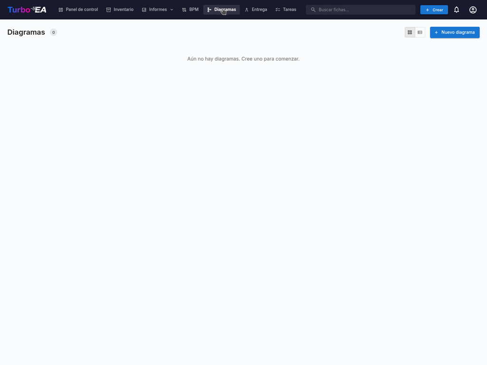

# Diagramas

El módulo de **Diagramas** permite crear **representaciones visuales** de la arquitectura empresarial. Funcionalidades: arrastrar y soltar componentes, conexiones automáticas entre fichas, colores y formas personalizables, exportar como imagen y sincronización de datos.
