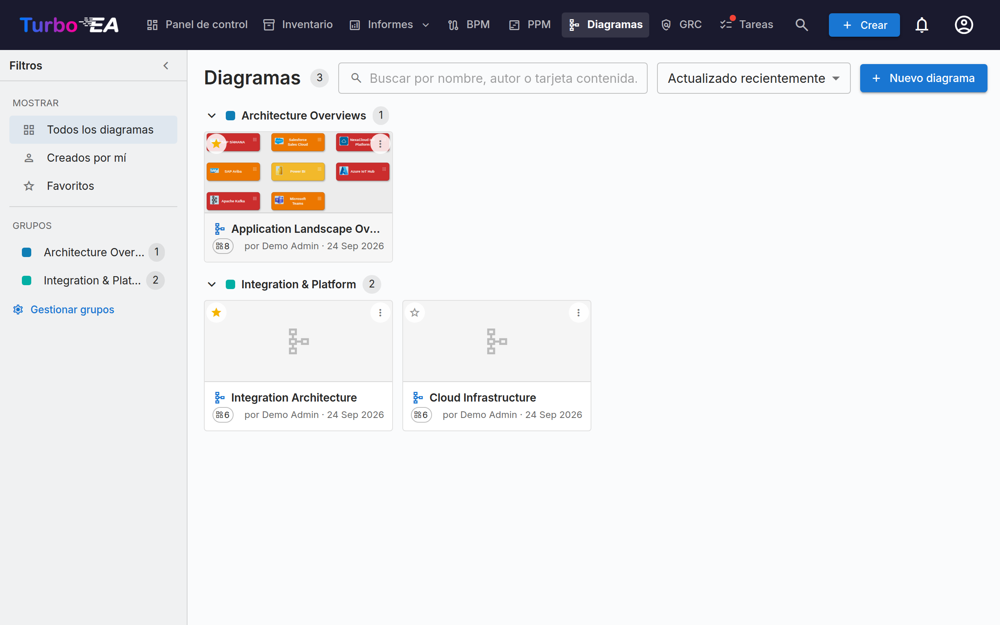

# Diagramas

El módulo **Diagramas** permite crear **diagramas visuales de arquitectura** usando un editor [DrawIO](https://www.drawio.com/) integrado -- totalmente conectado a su inventario de tarjetas. Arrastre tarjetas al lienzo, conéctelas con relaciones, navegue por jerarquías y recoloréelas según cualquier atributo -- el diagrama permanece sincronizado con sus datos EA.



## Galería de diagramas

La galería muestra cada diagrama como una tarjeta compacta con una miniatura, un nombre, un autor y el número de tarjetas que referencia. **Cree**, **Abra**, **Edite detalles**, organice o **Elimine** cualquier diagrama.

### Encontrar diagramas

- **Barra lateral de filtros** — el panel izquierdo limita la galería a **Todos los diagramas**, **Creados por mí** o sus **Favoritos**. Contráigala a una barra estrecha con el chevrón; en pantallas pequeñas el botón **Filtros** la abre como un panel deslizante.
- **Búsqueda** — el cuadro de búsqueda coincide con el nombre de un diagrama, su autor y los nombres de las tarjetas dibujadas en él, para que pueda encontrar un diagrama por su contenido.
- **Orden** — por actualizado recientemente, creado recientemente o nombre.
- **Favoritos** — haga clic en la estrella de cualquier tarjeta para añadirla a sus favoritos personales; el filtro **Favoritos** los muestra todos.

### Grupos

Agrupe diagramas relacionados en **grupos**: etiquetas compartidas en todo el espacio de trabajo. Un diagrama puede pertenecer a varios grupos a la vez. En la vista de tarjeta, la galería muestra cada grupo como un encabezado plegable; lo no asignado aparece en **Sin agrupar**.

- Use **Gestionar grupos** en la barra lateral para crear, renombrar, recolorear o eliminar grupos.
- Use **Añadir a grupos…** desde el menú de un diagrama para colocarlo en uno o varios grupos (puede crear un nuevo grupo sobre la marcha).
- Seleccionar un grupo en la barra lateral filtra la galería solo a ese grupo.


## El editor de diagramas

Abrir un diagrama lanza el editor DrawIO a pantalla completa en un iframe del mismo origen. La barra de herramientas nativa de DrawIO está disponible para formas, conectores, texto y diseño -- cada acción propia de Turbo EA está expuesta vía el menú contextual del clic derecho, el botón Sync de la barra de herramientas y el chevrón que aparece encima de cada tarjeta.

### Insertar tarjetas

Use el diálogo **Insertar tarjetas** (desde la barra de herramientas o el menú contextual) para añadir tarjetas al lienzo:

- Las **fichas de tipo con contadores en directo** en la columna izquierda filtran los resultados.
- Busque por nombre en la columna derecha; cada fila lleva una casilla.
- **Insertar seleccionadas** añade las tarjetas elegidas en una cuadrícula; **Insertar todas** añade cada tarjeta que coincida con el filtro actual (con confirmación si supera 50 resultados).

El mismo diálogo se abre en modo de selección única para **Cambiar tarjeta vinculada** y **Vincular a tarjeta existente**.

Cada tarjeta en el lienzo muestra su **icono de tipo de tarjeta** como un pequeño glifo blanco en la esquina superior izquierda, junto al color del tipo — de modo que el tipo de una tarjeta se transmite tanto por el icono como por el color. Esto coincide con los iconos usados en toda la aplicación y mejora la legibilidad para usuarios daltónicos. El icono aparece en las tarjetas insertadas a partir de ahora. Para añadir iconos a las tarjetas que ya están en un diagrama anterior, haz clic en **Aplicar iconos de tipo de tarjeta** en la barra de herramientas del editor.

### Acciones del clic derecho

- **Tarjetas sincronizadas**: *Abrir tarjeta*, *Cambiar tarjeta vinculada*, *Desvincular tarjeta*, *Quitar del diagrama*.
- **Formas simples / celdas no vinculadas**: *Vincular a tarjeta existente*, *Convertir en tarjeta* (conserva la geometría y convierte la forma en una tarjeta pendiente con su etiqueta), *Convertir en contenedor* (transforma la forma en un swimlane para anidar otras tarjetas).

### El menú de expansión

Cada tarjeta sincronizada lleva un pequeño chevrón. Un clic abre un menú con tres secciones, cada una cargada en un único viaje de ida y vuelta:

- **Mostrar dependencias** -- vecinos vía relaciones salientes o entrantes, agrupados por tipo de relación con contadores. Cada fila es una casilla; confirme con **Insertar (N)**.
- **Drill-Down** -- convierte la tarjeta actual en un contenedor swimlane con sus hijos por `parent_id` anidados. Elija qué hijos incluir o *Profundizar en todos*.
- **Roll-Up** -- envuelve la tarjeta actual y los hermanos seleccionados (tarjetas que comparten el mismo `parent_id`) en un nuevo contenedor padre.

Las filas con contador a cero aparecen en gris, y los vecinos / hijos ya presentes en el lienzo se omiten automáticamente.

Una tarjeta desplegada muestra un icono `−` para volver a contraerla. Al contraer se quitan del lienzo las tarjetas desplegadas, así que Turbo EA pide confirmación si has movido o cambiado el formato de alguna; al volver a desplegarlas aparecen exactamente donde las dejaste.

### La jerarquía en el lienzo

Los contenedores corresponden al `parent_id` de una tarjeta:

- **Arrastrar una tarjeta dentro de** un contenedor del mismo tipo abre «¿Añadir «hijo» como hijo de «padre»?». **Sí** pone en cola un cambio jerárquico; **No** devuelve la tarjeta a su posición.
- **Arrastrar una tarjeta fuera de** un contenedor solicita la separación (poner `parent_id = null`).
- **Arrastres entre tipos** vuelven en silencio a su posición -- la jerarquía está restringida a tarjetas del mismo tipo.
- Todos los movimientos confirmados aterrizan en el cubo **Cambios de jerarquía** del panel de Sync con acciones *Aplicar* y *Descartar*.

### Quitar tarjetas del diagrama

Eliminar una tarjeta del lienzo se trata como un gesto **puramente visual** -- «No quiero verla aquí». La tarjeta permanece en el inventario; sus aristas de relación conectadas desaparecen en silencio con ella. Las flechas dibujadas a mano que no sean relaciones EA registradas nunca se eliminan automáticamente. **El archivado es tarea de la página Inventario**, no del diagrama.

### Borrado de aristas

Eliminar una arista que lleva una relación real abre «¿Eliminar la relación entre ORIGEN y DESTINO?»:

- **Sí** pone la eliminación en cola en el panel de Sync; **Sincronizar todo** emite el `DELETE /relations/{id}` del backend.
- **No** restaura la arista en su sitio (estilo y extremos preservados).

### Perspectivas de vista

El desplegable **Vista** de la barra de herramientas recolorea cada tarjeta del lienzo según un atributo:

- **Colores de tarjetas** (predeterminado) -- cada tarjeta usa el color de su tipo.
- **Estado de aprobación** -- recolorea por `aprobada` / `pendiente` / `rota`.
- **Valores de campo** -- elija cualquier campo de selección única en los tipos de tarjeta presentes en el lienzo (p. ej. *Ciclo de vida*, *Estado*). Las celdas sin valor caen a un gris neutro.

Una leyenda flotante en la esquina inferior izquierda del lienzo muestra la asignación activa. La vista elegida se guarda con el diagrama.

### Cómo se dibujan las aristas de relación

Toda relación de Turbo EA se ve igual en el lienzo, sin importar cómo llegó allí — dibujada a mano con el selector de relaciones o traída del inventario con **+** / el menú de expansión:

- **Una única línea gris oscuro neutra**, no el color de la tarjeta del otro extremo. Una arista *es* una relación; teñirla por tipo de tarjeta solo repite lo que el nodo ya dice.
- **Una punta de flecha en el extremo destino**, para que la dirección se lea de un vistazo sin leer el verbo. Si traes una relación que apunta *hacia* la tarjeta expandida, la punta se sitúa en el otro extremo.
- **El verbo se lee en el sentido de la flecha.** Como la punta marca el destino de la relación, la etiqueta siempre completa la frase *origen → verbo → destino*. Así, un vínculo se lee igual sea cual sea la tarjeta que hayas expandido: expande una Organización y verás *usa*; expande una de sus Aplicaciones y las organizaciones que aparecen siguen mostrando *usa*, con la flecha apuntando al revés.
- **Una línea discontinua** mientras la relación sigue pendiente; pasa a continua en cuanto se envía al inventario.

#### Proveedor y consumidor

Algunas relaciones llevan un **sentido de flujo** — sobre todo el vínculo entre una Aplicación y una Interfaz, donde una aplicación *provee* la interfaz y otras la *consumen*. Indícalo en el diálogo de relación al trazar el vínculo (o después desde la sección Relaciones de la tarjeta), y la punta de flecha seguirá los datos en lugar de la relación:

| Sentido de flujo | Punta de flecha |
|---|---|
| **Proveedor** (origen → destino) | apunta a la Interfaz |
| **Consumidor** (destino → origen) | apunta de vuelta a la Aplicación |
| **Bidireccional** | puntas en ambos extremos |

Coincide con lo que la [Layered Dependency View](reports.md) ya dibuja, así que el diagrama y el informe de dependencias concuerdan. Los vínculos sin sentido de flujo definido conservan la flecha de dirección de la relación: la información debe estar en el modelo antes de que un diagrama pueda mostrarla.

### Ocultar las etiquetas de relación

Cada arista de relación lleva su verbo — *proporciona*, *consume*, *da soporte*. En un paisaje denso eso se convierte enseguida en más ruido que información, así que el menú **⋮** ofrece **Ocultar etiquetas de relación** (y **Mostrar** para recuperarlas).

Solo afecta a la visualización: la relación en sí no se modifica, así que ocultarla es reversible. El ajuste se guarda con el diagrama, de modo que el visor de solo lectura, cualquier diagrama publicado y las exportaciones PNG/SVG coinciden con lo que has preparado. Las aristas que dibujes después siguen el ajuste actual. Las aristas de anotación que hayas etiquetado tú quedan intactas: solo se ven afectadas las de relación de Turbo EA.

### Panel de Sync

El botón **Sync** de la barra de herramientas abre el panel lateral con todo lo que está en cola para la próxima sincronización:

- **Nuevas tarjetas** -- formas convertidas en tarjetas pendientes, listas para enviarse al inventario.
- **Nuevas relaciones** -- aristas dibujadas entre tarjetas, listas para crearse en el inventario.
- **Relaciones eliminadas** -- aristas de relación borradas del lienzo, en cola para `DELETE /relations/{id}`. *Mantener en inventario* reinserta la arista.
- **Cambios de jerarquía** -- movimientos arrastrar-dentro / arrastrar-fuera de contenedores confirmados, en cola como actualizaciones de `parent_id`.
- **Inventario cambiado** -- tarjetas actualizadas en el inventario desde la apertura del diagrama, listas para volver al lienzo.

El botón Sync de la barra de herramientas muestra una pastilla pulsante «N sin sincronizar» mientras haya trabajo pendiente. Salir de la pestaña con cambios sin sincronizar dispara un aviso del navegador, y el lienzo se autoguarda en almacenamiento local cada cinco segundos para poder restaurarse tras un refresco accidental.

### Vincular diagramas a tarjetas

Los diagramas pueden vincularse a **cualquier tarjeta** desde la pestaña **Recursos** de la tarjeta (ver [Detalle de tarjetas](card-details.es.md#pestaña-recursos)). Cuando un diagrama está vinculado a una tarjeta **Iniciativa**, también aparece en el módulo [EA Delivery](delivery.md) junto a los documentos SoAW.

## Compartir un diagrama fuera de Turbo EA

Un diagrama puede publicarse como un **enlace de solo lectura que se abre sin iniciar sesión**, para insertarlo en una página wiki como Confluence.

Abre el menú **⋮** del diagrama en la galería y elige **Compartir / insertar…**. Publicar requiere el permiso *Publicar diagramas*, distinto del permiso para editarlos: un administrador lo concede de forma deliberada.

El diálogo ofrece dos opciones y dos cadenas para copiar:

- **Cualquiera con el enlace** — sin inicio de sesión. Trata el enlace como una contraseña: cualquiera a quien se le reenvíe podrá ver el diagrama.
- **Solo personas que inicien sesión** — los visitantes se autentican con tu proveedor de identidad, opcionalmente restringido a dominios de correo concretos. No se crea ninguna cuenta de Turbo EA para ellos.

La página publicada muestra solo la imagen. Permite desplazarse y hacer zoom, pero no hay acceso a los detalles de las tarjetas, y los identificadores de las tarjetas tras las formas se eliminan antes de que el diagrama salga del servidor. Dejar de publicar surte efecto de inmediato, incluso para quien lo esté viendo. Volver a publicarlo más tarde restaura el mismo enlace, así que las URL ya pegadas siguen funcionando.

!!! warning "La inserción requiere un paso del administrador"
    Por seguridad, ningún otro sitio web puede colocar Turbo EA en un marco salvo que lo autorice un administrador. Define `TURBO_EA_EMBED_ALLOWED_ORIGINS` en `.env` con los sitios autorizados a insertar diagramas y reinicia la pila:

    ```dotenv
    TURBO_EA_EMBED_ALLOWED_ORIGINS=https://tuempresa.atlassian.net
    ```

    Hasta entonces, los enlaces publicados siguen funcionando al abrirlos directamente; simplemente no pueden insertarse en otro sitio.

### Insertar en Confluence

1. Publica el diagrama y copia el **código de inserción** del diálogo de compartir.
2. Pide a un administrador que añada la URL base de tu Confluence a `TURBO_EA_EMBED_ALLOWED_ORIGINS`.
3. En Confluence, inserta una macro **HTML** (o *Iframe* / *HTML include*, según lo que permita tu instancia) y pega el código.

Si tu Confluence no permite macros HTML, pega en su lugar el **enlace** simple: abre la misma vista en una pestaña nueva.
