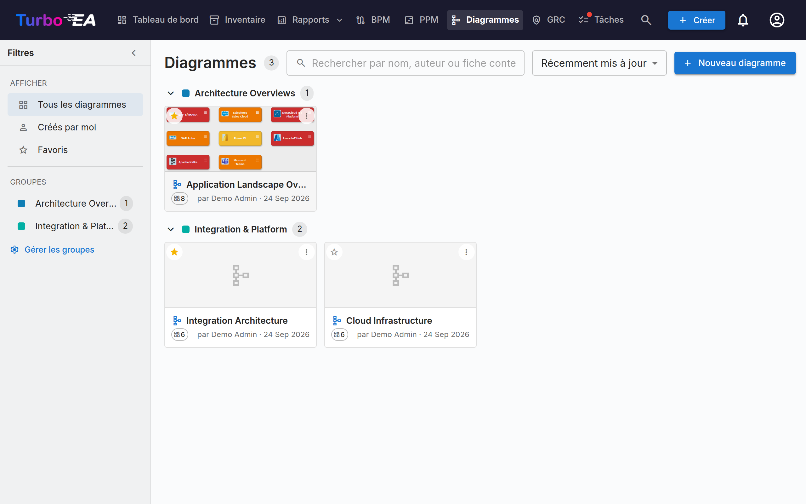

# Diagrammes

Le module **Diagrammes** vous permet de créer des **diagrammes d'architecture visuels** en utilisant un éditeur [DrawIO](https://www.drawio.com/) intégré -- entièrement connecté à votre inventaire de fiches. Glissez des fiches sur le canevas, reliez-les par des relations, descendez dans les hiérarchies, et recolorez selon n'importe quel attribut -- le diagramme reste synchronisé avec vos données EA.



## Galerie de diagrammes

La galerie présente chaque diagramme sous forme de carte compacte avec une miniature, un nom, un auteur et le nombre de cartes référencées. **Créez**, **Ouvrez**, **Modifiez les détails**, organisez ou **Supprimez** n'importe quel diagramme.

### Trouver des diagrammes

- **Barre latérale de filtres** — le volet de gauche restreint la galerie à **Tous les diagrammes**, **Créés par moi** ou vos **Favoris**. Le chevron permet de la réduire en une fine barre ; sur petits écrans, le bouton **Filtres** l'ouvre en panneau coulissant.
- **Recherche** — le champ de recherche correspond au nom d'un diagramme, à son auteur et aux noms des cartes qui y sont dessinées, afin de retrouver un diagramme par son contenu.
- **Tri** — par récemment mis à jour, récemment créé ou nom.
- **Favoris** — cliquez sur l'étoile d'une carte pour l'ajouter à vos favoris personnels ; le filtre **Favoris** les affiche tous.

### Groupes

Regroupez les diagrammes associés dans des **groupes** — des étiquettes partagées à l'échelle de l'espace de travail. Un diagramme peut appartenir à plusieurs groupes à la fois. En vue carte, la galerie affiche chaque groupe sous forme d'en-tête repliable ; les diagrammes non affectés apparaissent sous **Non groupé**.

- Utilisez **Gérer les groupes** dans la barre latérale pour créer, renommer, recolorer ou supprimer des groupes.
- Utilisez **Ajouter à des groupes…** depuis le menu d'un diagramme pour le placer dans un ou plusieurs groupes (vous pouvez créer un nouveau groupe au passage).
- Sélectionner un groupe dans la barre latérale filtre la galerie sur ce seul groupe.


## L'éditeur de diagrammes

Ouvrir un diagramme lance l'éditeur DrawIO plein écran dans une iframe de même origine. La barre d'outils native de DrawIO est disponible pour les formes, connecteurs, texte et mise en page -- chaque action propre à Turbo EA est exposée via le menu contextuel (clic droit), le bouton Sync de la barre d'outils, et la pastille en chevron qui surmonte chaque fiche.

### Insertion de fiches

Utilisez le dialogue **Insérer des fiches** (depuis la barre d'outils ou le menu contextuel) pour ajouter des fiches au canevas :

- Les **puces de types avec compteurs en direct** dans le rail gauche filtrent les résultats.
- Recherchez par nom dans le rail droit ; chaque ligne porte une case à cocher. Limitez le filtre à un seul type hiérarchique et la liste devient un arbre indenté, pour retrouver une fiche par sa branche.
- Les fiches cochées apparaissent en puces au-dessus de la liste et restent sélectionnées pendant que vous changez de filtre ou de recherche — retirez-en une avec son ×.
- **Sélectionner tout l'affichage** coche tout ce que laisse le filtre actif ; **Insérer la sélection** ajoute les fiches choisies au canevas en grille.

Le même dialogue s'ouvre en mode sélection unique pour **Changer la fiche liée** et **Lier à une fiche existante**.

Chaque fiche sur le canevas affiche son **icône de type de fiche** sous la forme d'un petit glyphe blanc dans le coin supérieur gauche, à côté de la couleur du type — le type d'une fiche est ainsi indiqué à la fois par l'icône et par la couleur. Cela correspond aux icônes utilisées dans toute l'application et améliore la lisibilité pour les utilisateurs daltoniens. L'icône apparaît sur les fiches insérées à partir de maintenant. Pour ajouter des icônes aux fiches déjà présentes sur un diagramme plus ancien, cliquez sur **Appliquer les icônes de type de fiche** dans la barre d'outils de l'éditeur. Si une carte possède son propre **logo**, c'est lui qui s'affiche, l'icône du type de carte étant conservée comme petit badge dans un coin : la forme indique ainsi à la fois de quel produit et de quel type de carte il s'agit. Les logos apparaissent à l'ouverture du diagramme et se rafraîchissent lorsqu'un logo change ; une carte sans logo, comme toute carte d'un type pour lequel un administrateur a désactivé les logos, est dessinée exactement comme avant. Une case **Logos des cartes** dans le même menu les désactive si vous voulez un diagramme sans ornement ; elle est cochée par défaut.

### Actions du clic droit

- **Fiches synchronisées** : *Ouvrir la fiche*, *Changer la fiche liée*, *Délier la fiche*, *Retirer du diagramme*.
- **Formes simples / cellules déliées** : *Lier à une fiche existante*, *Convertir en fiche* (conserve la géométrie, transforme la forme en fiche en attente avec son libellé), *Convertir en conteneur* (transforme la forme en swimlane pour y imbriquer d'autres fiches).

### Le menu d'expansion

Chaque fiche synchronisée porte une petite pastille en chevron. Un clic ouvre un menu avec trois sections, chacune chargée en un seul aller-retour :

- **Afficher les dépendances** -- voisins via relations sortantes ou entrantes, groupés par type de relation avec compteurs. Chaque ligne est une case à cocher ; validez avec **Insérer (N)**.
- **Descente (Drill-Down)** -- transforme la fiche courante en conteneur swimlane avec ses enfants `parent_id` imbriqués. Choisissez les enfants à inclure ou *Descendre dans tous*.
- **Remontée (Roll-Up)** -- englobe la fiche courante + les frères sélectionnés (fiches partageant le même `parent_id`) dans un nouveau conteneur parent.

Les lignes avec un compteur à zéro sont grisées, et les voisins / enfants déjà présents sur le canevas sont automatiquement ignorés.

Une fiche déployée affiche une pastille `−` pour la réduire. La réduction retire les fiches déployées du canevas : Turbo EA demande donc confirmation si vous en avez déplacé ou remis en forme une ; un nouveau déploiement les replace exactement où vous les aviez laissées.

### La hiérarchie sur le canevas

Les conteneurs correspondent au `parent_id` d'une fiche :

- **Glisser une fiche dans** un conteneur de même type ouvre *« Ajouter «enfant» comme enfant de «parent» ? »*. **Oui** met en file une modification hiérarchique ; **Non** ramène la fiche à sa position.
- **Glisser une fiche hors** d'un conteneur propose le détachement (mise à `parent_id = null`).
- Les **glisser-déposer entre types** retournent silencieusement à la position d'origine -- la hiérarchie est restreinte aux fiches du même type.
- Tous les mouvements confirmés atterrissent dans le bucket **Modifications hiérarchiques** du tiroir de synchronisation avec les actions *Appliquer* et *Annuler*.

### Retirer une fiche du diagramme

Supprimer une fiche du canevas est traité comme un geste **purement visuel** -- *« Je ne veux plus la voir ici »*. La fiche reste dans l'inventaire ; ses arêtes de relation connectées disparaissent silencieusement avec elle. Les flèches dessinées à la main qui ne sont pas des relations EA enregistrées ne sont jamais supprimées automatiquement. **L'archivage est une tâche de la page Inventaire**, pas du diagramme.

### Suppression d'arêtes

Supprimer une arête portant une vraie relation ouvre *« Supprimer la relation entre SOURCE et CIBLE ? »* :

- **Oui** met la suppression en file dans le tiroir Sync ; **Tout synchroniser** émet le `DELETE /relations/{id}` côté backend.
- **Non** restaure l'arête en place (style et extrémités préservés).

### Perspectives de vue

Le menu déroulant **Colorer par** dans la barre d'outils recolore les fiches du canevas :

- **Couleurs des fiches** (par défaut) -- chaque fiche utilise la couleur de son type.
- **Statut d'approbation** -- recolore par `approuvée` / `en attente` / `cassée`.
- **Valeurs de champ** -- cochez un champ à sélection unique sous n'importe quel type de fiche présent sur le canevas. **Plusieurs types de fiches peuvent porter chacun une règle en même temps** -- les Applications par criticité *et* les Composants IT par modèle d'hébergement. Un type sans règle conserve sa couleur actuelle, y compris un remplissage défini à la main ; seule une fiche dont la règle ne trouve aucune valeur devient grise. Un second champ au sein d'un même type remplace le premier, car une fiche n'a qu'un remplissage.

Une légende flottante en bas à gauche affiche une échelle par règle active. Les règles de champ et le **Statut d'approbation** sont des alternatives, pas des couches : choisir l'un efface l'autre. Décochez toutes les règles et le canevas revient aux couleurs des fiches. Le choix est enregistré avec le diagramme.

#### Afficher sur la fiche

Un second bouton de la barre d'outils, **Afficher sur la fiche**, détermine **ce que dit chaque forme**. Cochez le **type de fiche**, le **sous-type** ou n'importe quel attribut des types de fiches présents sur le canevas : chaque forme reçoit alors de petites lignes de détail sous son nom. Les champs sont classés sous le type de fiche auquel ils appartiennent ; un champ partagé par plusieurs de ces types est regroupé sous **Communs**. C'est un bouton distinct de **Colorer par**, afin qu'aucune des deux listes n'oblige à faire défiler l'autre. **Tout effacer** décoche l'ensemble en une fois.

Chaque sélection est dessinée sur la forme, et la forme **s'agrandit pour la contenir**. Deux lignes tiennent déjà dans une fiche : rien ne bouge tant que vous n'en cochez pas une troisième ; au-delà, chaque fiche grandit un peu par sélection et rétrécit d'autant quand vous en décochez une. Une fiche que vous avez redimensionnée à la main garde votre hauteur : elle ne gagne ou ne rend que la place d'une ligne.

Ces lignes sont enregistrées avec le diagramme, si bien que tous les lecteurs — y compris via un lien publié — voient les mêmes formes. Les fiches amenées sur le canevas par **Déplier** portent les mêmes lignes que n'importe quelle autre fiche et s'agrandissent de la même façon. Les fiches disposées dans un conteneur **Drill-Down** ou **Roll-Up** affichent ce qui tient dans leur case : les agrandir les ferait déborder sur la rangée du dessous. La barre de titre du conteneur, elle, s'agrandit pour contenir ses lignes — et son contenu descend avec elle —, si bien que transformer une fiche en conteneur ne coûte jamais ce qu'elle disait.

Le bouton **Créer un diagramme** du [rapport de dépendances](reports.md) transmet ses propres réglages d'affichage, de sorte qu'un diagramme généré depuis un rapport affiche exactement les lignes que le rapport affichait — toutes, même celles que le rapport lui-même n'avait pas la place de dessiner.

### Comment les arêtes de relation sont dessinées

Toute relation Turbo EA a la même apparence sur le canevas, quelle que soit la façon dont elle y est arrivée — tracée à la main avec le sélecteur de relation, ou ramenée de l'inventaire avec **+** / le menu d'expansion :

- **Une seule ligne gris foncé neutre**, et non la couleur de la fiche à l'autre extrémité. Une arête *est* une relation ; la teinter par type de fiche ne fait que répéter ce que le nœud indique déjà.
- **Une pointe de flèche du côté cible**, pour que la direction se lise d'un coup d'œil sans lire le verbe. Ramenez une relation qui pointe *vers* la fiche développée et la pointe se place à l'autre extrémité.
- **Le verbe se lit dans le sens de la flèche.** La pointe marquant la cible de la relation, le libellé complète toujours la phrase *départ → verbe → arrivée*. Un lien se lit donc de la même façon quelle que soit la fiche développée : développez une Organisation et vous voyez *utilise* ; développez l'une de ses Applications et les organisations qui remontent affichent toujours *utilise*, la flèche pointant dans l'autre sens.
- **Une ligne pointillée** tant que la relation est en attente ; elle devient pleine une fois poussée dans l'inventaire.

#### Fournisseur et consommateur

Certaines relations portent un **sens de flux** — au premier chef le lien entre une Application et une Interface, où une application *fournit* l'interface et d'autres la *consomment*. Renseignez-le dans la boîte de dialogue de relation au moment du tracé (ou depuis la section Relations de la fiche ensuite), et la pointe de flèche suit alors les données plutôt que la relation :

| Sens de flux | Pointe de flèche |
|---|---|
| **Fournisseur** (source → cible) | pointe vers l'Interface |
| **Consommateur** (cible → source) | pointe vers l'Application |
| **Bidirectionnel** | pointes aux deux extrémités |

Cela correspond à ce que la [Layered Dependency View](reports.md) dessine déjà, si bien que le diagramme et le rapport de dépendances concordent. Les liens dont le sens de flux n'a jamais été renseigné conservent la flèche de direction de relation — l'information doit exister dans le modèle avant qu'un diagramme puisse l'afficher.

### Masquer les libellés de relation

Chaque lien de relation porte son verbe — *fournit*, *consomme*, *soutient*. Sur un paysage dense, cela devient vite plus du bruit que de l'information : le menu **⋮** propose donc **Masquer les libellés de relation** (et **Afficher** pour les rétablir).

Il s'agit uniquement de l'affichage : la relation elle-même n'est pas modifiée, le masquage est donc réversible. Le réglage est enregistré avec le diagramme, de sorte que la visionneuse en lecture seule, tout diagramme publié et les exports PNG/SVG correspondent à ce que vous avez arrangé. Les liens tracés ensuite suivent le réglage courant. Les liens d'annotation que vous avez libellés vous-même ne sont pas touchés — seuls les liens de relation Turbo EA le sont.

### Tiroir de synchronisation

Le bouton **Sync** de la barre d'outils ouvre le tiroir latéral avec tout ce qui est en file pour la prochaine synchronisation :

- **Nouvelles fiches** -- formes converties en fiches en attente, prêtes à être poussées vers l'inventaire.
- **Nouvelles relations** -- arêtes dessinées entre fiches, prêtes à être créées dans l'inventaire.
- **Relations supprimées** -- arêtes de relation supprimées du canevas, en file pour `DELETE /relations/{id}`. *Conserver dans l'inventaire* réinsère l'arête.
- **Modifications hiérarchiques** -- déplacements glisser-dans / glisser-hors confirmés, en file comme mises à jour de `parent_id`.
- **Inventaire modifié** -- changements effectués dans l'inventaire depuis l'enregistrement du diagramme, prêts à être ramenés sur le canevas. Chaque ligne propose l'action correspondante, et **Tout accepter** résout toutes les lignes d'un coup :
    - une fiche **renommée** -- *Accepter la mise à jour* réécrit le libellé de la cellule ;
    - une fiche **supprimée** ou **archivée** -- *Retirer du diagramme* enlève la cellule (et ses arêtes) du canevas ;
    - une **relation supprimée** -- *Retirer l'arête du diagramme* enlève l'arête obsolète du canevas ;
    - une relation dont le **sens du flux** a changé -- *Accepter la mise à jour* aligne la flèche sur l'inventaire.

Turbo EA **vérifie automatiquement les changements d'inventaire à chaque ouverture d'un diagramme** -- un badge bleu sur le bouton Sync de la barre d'outils compte les changements à examiner. Rien n'est appliqué sans votre confirmation ; le badge ne fait que vous inviter dans le panneau. Le bouton **Vérifier les mises à jour** du panneau relance la même vérification à la demande.

Le bouton Sync de la barre d'outils affiche une pastille pulsée « N non synchronisé(s) » dès qu'un travail est en attente. Quitter l'onglet avec des changements non synchronisés déclenche un avertissement navigateur, et le canevas est sauvegardé localement toutes les cinq secondes pour pouvoir être restauré après un rafraîchissement accidentel.

### Lier des diagrammes aux fiches

Les diagrammes peuvent être liés à **n'importe quelle fiche** depuis l'onglet **Ressources** de la fiche (voir [Détail des fiches](card-details.fr.md#onglet-ressources)). Lorsqu'un diagramme est lié à une fiche **Initiative**, il apparaît également dans le module [EA Delivery](delivery.md) aux côtés des documents SoAW.

## Partager un diagramme en dehors de Turbo EA

Un diagramme peut être publié sous forme de **lien en lecture seule qui s'ouvre sans connexion**, afin d'être intégré dans une page de wiki telle que Confluence.

Dans la galerie, ouvrez le menu **⋮** du diagramme et choisissez **Partager / intégrer…**. La publication requiert la permission *Publier des diagrammes*, distincte de celle permettant de les modifier : un administrateur l'accorde délibérément.

La boîte de dialogue propose deux choix et deux chaînes à copier :

- **Toute personne disposant du lien** — aucune connexion. Traitez le lien comme un mot de passe : toute personne à qui il est transféré peut voir le diagramme.
- **Uniquement les personnes connectées** — les visiteurs s'authentifient auprès de votre fournisseur d'identité, éventuellement restreint à certains domaines de messagerie. Aucun compte Turbo EA n'est créé pour eux.

La page publiée n'affiche que l'image. Elle permet le déplacement et le zoom, mais aucun accès aux détails des fiches, et les identifiants des fiches derrière les formes sont retirés avant que le diagramme ne quitte le serveur. Dépublier prend effet immédiatement, y compris pour les personnes en train de consulter. Republier ultérieurement restaure le même lien, de sorte que les URL déjà collées continuent de fonctionner.

!!! warning "L'intégration nécessite une étape administrateur"
    Par sécurité, aucun autre site web ne peut placer Turbo EA dans un cadre sans l'accord d'un administrateur. Définissez `TURBO_EA_EMBED_ALLOWED_ORIGINS` dans `.env` avec les sites autorisés à intégrer des diagrammes, puis redémarrez la pile :

    ```dotenv
    TURBO_EA_EMBED_ALLOWED_ORIGINS=https://votreentreprise.atlassian.net
    ```

    Tant que ce n'est pas fait, les liens publiés fonctionnent toujours lorsqu'ils sont ouverts directement — ils ne peuvent simplement pas être intégrés par un autre site.

### Intégrer dans Confluence

1. Publiez le diagramme et copiez le **code d'intégration** depuis la boîte de dialogue de partage.
2. Demandez à un administrateur d'ajouter l'URL de base de votre Confluence à `TURBO_EA_EMBED_ALLOWED_ORIGINS`.
3. Dans Confluence, insérez une macro **HTML** (ou *Iframe* / *HTML include*, selon ce que votre instance autorise) et collez le code d'intégration.

Si votre Confluence n'autorise pas les macros HTML, collez plutôt le **lien** simple : il ouvre la même vue dans un nouvel onglet.
