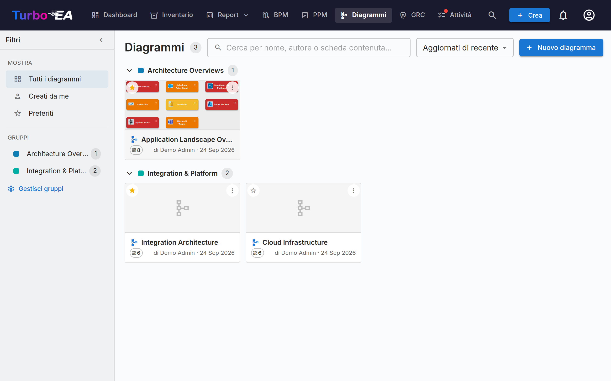

# Diagrammi

Il modulo **Diagrammi** consente di creare **diagrammi di architettura visivi** utilizzando un editor [DrawIO](https://www.drawio.com/) integrato -- completamente collegato all'inventario delle schede. Trascinate le schede sulla tela, collegatele con relazioni, scendete nelle gerarchie e ricolorate per qualsiasi attributo -- il diagramma resta sincronizzato con i dati EA.



## Galleria diagrammi

La galleria elenca ogni diagramma come una scheda compatta con miniatura, nome, autore e il numero di schede a cui fa riferimento. **Crea**, **Apri**, **Modifica dettagli**, organizza o **Elimina** qualsiasi diagramma.

### Trovare i diagrammi

- **Barra laterale dei filtri** — il pannello a sinistra restringe la galleria a **Tutti i diagrammi**, **Creati da me** o i tuoi **Preferiti**. Comprimila in una barra sottile con il chevron; su schermi piccoli il pulsante **Filtri** la apre come pannello a scomparsa.
- **Ricerca** — la casella di ricerca corrisponde al nome di un diagramma, al suo autore e ai nomi delle schede disegnate al suo interno, così puoi trovare un diagramma in base al suo contenuto.
- **Ordinamento** — per aggiornati di recente, creati di recente o nome.
- **Preferiti** — fai clic sulla stella di una scheda per aggiungerla ai tuoi preferiti personali; il filtro **Preferiti** li mostra tutti.

### Gruppi

Raggruppa i diagrammi correlati in **gruppi** — etichette condivise a livello di area di lavoro. Un diagramma può appartenere a più gruppi contemporaneamente. Nella vista a schede la galleria mostra ogni gruppo come intestazione comprimibile; gli elementi non assegnati compaiono in **Non raggruppati**.

- Usa **Gestisci gruppi** nella barra laterale per creare, rinominare, ricolorare o eliminare i gruppi.
- Usa **Aggiungi a gruppi…** dal menu di un diagramma per inserirlo in uno o più gruppi (puoi creare un nuovo gruppo al volo).
- La selezione di un gruppo nella barra laterale filtra la galleria solo su quel gruppo.


## L'editor di diagrammi

Aprire un diagramma avvia l'editor DrawIO a schermo intero in un iframe della stessa origine. La barra degli strumenti nativa di DrawIO è disponibile per forme, connettori, testo e layout -- ogni azione propria di Turbo EA è esposta tramite il menu contestuale del clic destro, il pulsante Sync della barra strumenti e il chevron sopra ogni scheda.

### Inserire schede

Usate la finestra **Inserisci schede** (dalla barra strumenti o dal menu contestuale) per aggiungere schede alla tela:

- I **chip di tipo con contatori in tempo reale** nella colonna sinistra filtrano i risultati.
- Cercate per nome nella colonna destra; ogni riga ha una casella di selezione. Restringete il filtro a un solo tipo gerarchico e la lista diventa un albero rientrato, così trovate una scheda dal suo ramo.
- Le schede selezionate compaiono come chip sopra la lista e restano selezionate mentre cambiate filtro o ricerca — rimuovetene una con la sua ×.
- **Seleziona tutti i visibili** seleziona tutto ciò che il filtro corrente lascia a schermo; **Inserisci selezionate** aggiunge le schede scelte alla tela in una griglia.

La stessa finestra si apre in modalità a selezione singola per **Cambia scheda collegata** e **Collega a scheda esistente**.

Ogni scheda sull'area di lavoro mostra la sua **icona del tipo di scheda** come un piccolo glifo bianco nell'angolo in alto a sinistra, accanto al colore del tipo — così il tipo di una scheda è indicato sia dall'icona sia dal colore. Questo corrisponde alle icone usate in tutta l'applicazione e migliora la leggibilità per gli utenti daltonici. L'icona compare sulle schede inserite d'ora in poi. Per aggiungere le icone alle schede già presenti su un diagramma più vecchio, fai clic su **Applica icone del tipo di scheda** nella barra degli strumenti dell'editor. Se una scheda possiede un proprio **logo**, viene mostrato quello, mantenendo l'icona del tipo di scheda come piccolo badge nell'angolo: la forma indica così sia il prodotto sia il tipo di scheda. I logo compaiono all'apertura del diagramma e si aggiornano quando uno viene sostituito; una scheda senza logo, e ogni scheda di un tipo per cui un amministratore ha disattivato i logo, viene disegnata esattamente come prima. Una casella **Logo delle schede** nello stesso menu li disattiva se preferisci un diagramma essenziale; è attiva per impostazione predefinita.

### Azioni del clic destro

- **Schede sincronizzate**: *Apri scheda*, *Cambia scheda collegata*, *Scollega scheda*, *Rimuovi dal diagramma*.
- **Forme semplici / celle non collegate**: *Collega a scheda esistente*, *Converti in scheda* (mantiene la geometria e trasforma la forma in una scheda in sospeso con la sua etichetta), *Converti in contenitore* (trasforma la forma in uno swimlane in cui annidare altre schede).

### Il menu di espansione

Ogni scheda sincronizzata porta un piccolo chevron. Un clic apre un menu con tre sezioni, ciascuna caricata in un unico round-trip:

- **Mostra dipendenze** -- vicini tramite relazioni uscenti o entranti, raggruppati per tipo di relazione con contatori. Ogni riga è una casella; confermate con **Inserisci (N)**.
- **Drill-Down** -- trasforma la scheda corrente in un contenitore swimlane con i suoi figli `parent_id` annidati. Scegliete quali figli includere o *Approfondisci tutti*.
- **Roll-Up** -- racchiude la scheda corrente e i fratelli selezionati (schede che condividono lo stesso `parent_id`) in un nuovo contenitore padre.

Le righe con contatore = 0 sono in grigio, e i vicini / figli già presenti sulla tela sono saltati automaticamente.

Una scheda espansa mostra un'icona `−` per comprimerla di nuovo. La compressione rimuove le schede espanse dalla tela, quindi Turbo EA chiede conferma se ne hai spostata o riformattata qualcuna; espandendo di nuovo tornano esattamente dove le avevi lasciate.

### La gerarchia sulla tela

I contenitori corrispondono al `parent_id` di una scheda:

- **Trascinare una scheda dentro** un contenitore dello stesso tipo apre «Aggiungere «figlio» come figlio di «genitore»?». **Sì** mette in coda una modifica gerarchica; **No** riporta la scheda alla posizione precedente.
- **Trascinare una scheda fuori** da un contenitore richiede il distacco (impostare `parent_id = null`).
- I **rilasci tra tipi diversi** tornano silenziosamente alla posizione -- la gerarchia è limitata a schede dello stesso tipo.
- Tutti i movimenti confermati finiscono nel bucket **Modifiche gerarchiche** del pannello Sync con azioni *Applica* e *Scarta*.

### Rimuovere schede dal diagramma

Eliminare una scheda dalla tela è trattato come un gesto **puramente visivo** -- «Non voglio vederla qui». La scheda resta nell'inventario; i suoi archi di relazione connessi scompaiono silenziosamente con essa. Le frecce disegnate a mano che non sono relazioni EA registrate non vengono mai rimosse automaticamente. **L'archiviazione è compito della pagina Inventario**, non del diagramma.

### Cancellazione di archi

Rimuovere un arco che porta una relazione reale apre «Eliminare la relazione tra ORIGINE e DESTINAZIONE?»:

- **Sì** mette in coda l'eliminazione nel pannello Sync; **Sincronizza tutto** invia il `DELETE /relations/{id}` al backend.
- **No** ripristina l'arco al suo posto (stile ed estremità preservati).

### Prospettive di visualizzazione

Il menu a tendina **Colora per** nella barra strumenti ricolora le schede sulla tela:

- **Colori delle schede** (predefinito) -- ogni scheda usa il colore del proprio tipo.
- **Stato di approvazione** -- ricolora per `approvata` / `in attesa` / `rotta`.
- **Valori di campo** -- spuntate un campo a selezione singola sotto qualsiasi tipo di scheda presente sulla tela. **Più tipi di scheda possono portare una regola ciascuno nello stesso momento**: le Applicazioni per criticità *e* i Componenti IT per modello di hosting. Un tipo senza regola mantiene il colore che ha già, compreso un riempimento impostato a mano; diventa grigia solo una scheda la cui regola non trova alcun valore. Un secondo campo all'interno di uno stesso tipo sostituisce il primo, perché una scheda ha un solo riempimento.

Una legenda fluttuante in basso a sinistra mostra una scala per ogni regola attiva. Le regole di campo e lo **Stato di approvazione** sono alternative, non livelli: sceglierne una cancella l'altra. Togliendo ogni regola la tela torna ai colori delle schede. La scelta viene salvata col diagramma.

#### Mostra sulla scheda

Un secondo pulsante nella barra strumenti, **Mostra sulla scheda**, decide **cosa dice ogni forma**. Spuntate il **tipo di scheda**, il **sottotipo** o qualsiasi attributo dei tipi di scheda presenti sulla tela: ogni forma acquisirà piccole righe di dettaglio sotto il proprio nome. I campi sono elencati sotto il tipo di scheda a cui appartengono; un campo condiviso da più di questi tipi è raggruppato sotto **Comuni**. È un pulsante distinto da **Colora per**, così nessuna delle due liste costringe a scorrere l'altra. **Cancella tutto** toglie tutte le spunte in una volta.

Ogni selezione viene disegnata sulla forma, e la forma **cresce per contenerla**. Due righe entrano già in una scheda, quindi nulla si muove finché non ne spuntate una terza; da lì ogni scheda diventa un po' più alta per selezione e si riduce quando ne togliete una. Una scheda che avete ridimensionato a mano mantiene la vostra altezza: guadagna o restituisce soltanto lo spazio di una riga.

Queste righe vengono salvate col diagramma, così ogni lettore — anche chi apre un link pubblicato — vede le stesse forme. Le schede portate sulla tela da **Espandi** riportano le stesse righe di qualsiasi altra scheda e crescono allo stesso modo. Le schede disposte dentro un contenitore **Drill-Down** o **Roll-Up** mostrano ciò che entra nella loro cella: ingrandirle le farebbe sconfinare sulla riga sottostante. La barra del titolo del contenitore, invece, cresce per contenere le sue righe — e il contenuto scende con lei — così trasformare una scheda in contenitore non costa mai ciò che diceva.

Il pulsante **Crea diagramma** del [rapporto sulle dipendenze](reports.md) trasferisce le proprie impostazioni di visualizzazione, così un diagramma generato da un rapporto mostra esattamente le righe che il rapporto mostrava — tutte, comprese quelle per cui il rapporto stesso non aveva spazio.

### Come vengono disegnati gli archi di relazione

Ogni relazione di Turbo EA appare uguale sulla tela, comunque vi sia arrivata — disegnata a mano con il selettore di relazioni oppure richiamata dall'inventario con **+** / il menu di espansione:

- **Un'unica linea grigio scuro neutra**, non il colore della scheda all'altro capo. Un arco *è* una relazione; colorarlo per tipo di scheda ripete soltanto ciò che il nodo già dice.
- **Una punta di freccia sull'estremità di destinazione**, così la direzione si legge a colpo d'occhio senza leggere il verbo. Se richiami una relazione che punta *verso* la scheda espansa, la punta si sposta sull'altra estremità.
- **Il verbo si legge nel senso della freccia.** Poiché la punta indica la destinazione della relazione, l'etichetta completa sempre la frase *partenza → verbo → arrivo*. Un collegamento si legge quindi allo stesso modo da qualunque scheda tu sia partito: espandi un'Organizzazione e vedi *usa*; espandi una delle sue Applicazioni e le organizzazioni che compaiono mostrano ancora *usa*, con la freccia rivolta dall'altra parte.
- **Una linea tratteggiata** finché la relazione è ancora in sospeso; diventa continua una volta inviata all'inventario.

#### Fornitore e consumatore

Alcune relazioni portano una **direzione di flusso** — in primo luogo il collegamento tra un'Applicazione e un'Interfaccia, dove un'applicazione *fornisce* l'interfaccia e altre la *consumano*. Impostala nella finestra di dialogo della relazione mentre disegni il collegamento (o in seguito dalla sezione Relazioni della scheda), e la punta di freccia seguirà i dati anziché la relazione:

| Direzione di flusso | Punta di freccia |
|---|---|
| **Fornitore** (sorgente → destinazione) | punta all'Interfaccia |
| **Consumatore** (destinazione → sorgente) | punta all'Applicazione |
| **Bidirezionale** | punte a entrambe le estremità |

Corrisponde a ciò che la [Layered Dependency View](reports.md) disegna già, così diagramma e report delle dipendenze concordano. I collegamenti senza direzione di flusso impostata mantengono la freccia di direzione della relazione: l'informazione deve esistere nel modello prima che un diagramma possa mostrarla.

### Nascondere le etichette delle relazioni

Ogni arco di relazione porta il proprio verbo — *fornisce*, *consuma*, *supporta*. In un panorama denso diventa presto più rumore che informazione, perciò il menu **⋮** offre **Nascondi le etichette delle relazioni** (e **Mostra** per riportarle).

Riguarda solo la visualizzazione: la relazione in sé non viene toccata, quindi nascondere è reversibile. L'impostazione viene salvata con il diagramma, così il visualizzatore in sola lettura, qualsiasi diagramma pubblicato e le esportazioni PNG/SVG corrispondono a ciò che hai preparato. Gli archi disegnati in seguito seguono l'impostazione corrente. Gli archi di annotazione che hai etichettato tu restano intatti: sono interessati solo quelli di relazione di Turbo EA.

### Pannello Sync

Il pulsante **Sync** della barra strumenti apre il pannello laterale con tutto ciò che è in coda per la prossima sincronizzazione:

- **Nuove schede** -- forme convertite in schede in sospeso, pronte per essere inviate all'inventario.
- **Nuove relazioni** -- archi disegnati tra schede, pronti per essere creati nell'inventario.
- **Relazioni rimosse** -- archi di relazione cancellati dalla tela, in coda per `DELETE /relations/{id}`. *Mantieni in inventario* reinserisce l'arco.
- **Modifiche gerarchiche** -- spostamenti di trascinamento dentro / fuori dai contenitori confermati, in coda come aggiornamenti di `parent_id`.
- **Inventario modificato** -- modifiche apportate all'inventario dopo il salvataggio del diagramma, pronte per essere riportate sulla tela. Ogni riga offre l'azione corrispondente, e **Accetta tutto** risolve tutte le righe in una volta:
    - una scheda **rinominata** -- *Accetta aggiornamento* riscrive l'etichetta della cella;
    - una scheda **eliminata** o **archiviata** -- *Rimuovi dal diagramma* toglie la cella (e i suoi collegamenti) dalla tela;
    - una **relazione eliminata** -- *Rimuovi il collegamento dal diagramma* toglie il collegamento obsoleto dalla tela;
    - una relazione con **direzione del flusso** cambiata -- *Accetta aggiornamento* allinea la freccia all'inventario.

Turbo EA **controlla automaticamente le modifiche dell'inventario a ogni apertura di un diagramma** -- un badge blu sul pulsante Sync della barra strumenti conta le modifiche da rivedere. Nulla viene applicato senza la vostra conferma; il badge vi invita solo ad aprire il pannello. Il pulsante **Verifica aggiornamenti** nel pannello riesegue lo stesso controllo su richiesta.

Il pulsante Sync della barra strumenti mostra una pillola pulsante «N non sincronizzate» finché esiste lavoro in sospeso. Lasciare la scheda con modifiche non sincronizzate attiva un avviso del browser, e la tela viene salvata automaticamente nello storage locale ogni cinque secondi per poter essere ripristinata dopo un aggiornamento accidentale.

### Collegare diagrammi alle schede

I diagrammi possono essere collegati a **qualsiasi scheda** dalla scheda **Risorse** della scheda stessa (vedi [Dettaglio scheda](card-details.it.md#scheda-risorse)). Quando un diagramma è collegato a una scheda **Iniziativa**, appare anche nel modulo [EA Delivery](delivery.md) accanto ai documenti SoAW.

## Condividere un diagramma fuori da Turbo EA

Un diagramma può essere pubblicato come **collegamento in sola lettura che si apre senza accedere**, così da poter essere incorporato in una pagina wiki come Confluence.

Apri il menu **⋮** del diagramma nella galleria e scegli **Condividi / incorpora…**. La pubblicazione richiede il permesso *Pubblicare diagrammi*, distinto da quello per modificarli: un amministratore lo concede deliberatamente.

La finestra offre due scelte e due stringhe da copiare:

- **Chiunque abbia il collegamento** — nessun accesso richiesto. Tratta il collegamento come una password: chiunque lo riceva può vedere il diagramma.
- **Solo chi effettua l'accesso** — i visitatori si autenticano con il tuo provider di identità, eventualmente limitato a domini email specifici. Non viene creato alcun account Turbo EA per loro.

La pagina pubblicata mostra solo l'immagine. È possibile spostarla e ingrandirla, ma non si accede ai dettagli delle schede, e gli identificatori delle schede dietro le forme vengono rimossi prima che il diagramma lasci il server. Annullare la pubblicazione ha effetto immediato, anche per chi lo sta guardando. Ripubblicandolo in seguito si ottiene lo stesso collegamento, quindi gli URL già incollati continuano a funzionare.

!!! warning "L'incorporamento richiede un passaggio dell'amministratore"
    Per sicurezza, nessun altro sito web può inserire Turbo EA in un frame senza l'autorizzazione di un amministratore. Imposta `TURBO_EA_EMBED_ALLOWED_ORIGINS` in `.env` con i siti autorizzati a incorporare i diagrammi e riavvia lo stack:

    ```dotenv
    TURBO_EA_EMBED_ALLOWED_ORIGINS=https://tuaazienda.atlassian.net
    ```

    Fino ad allora i collegamenti pubblicati funzionano comunque se aperti direttamente: semplicemente non possono essere incorporati da un altro sito.

### Incorporare in Confluence

1. Pubblica il diagramma e copia il **codice di incorporamento** dalla finestra di condivisione.
2. Chiedi a un amministratore di aggiungere l'URL di base del tuo Confluence a `TURBO_EA_EMBED_ALLOWED_ORIGINS`.
3. In Confluence inserisci una macro **HTML** (oppure *Iframe* / *HTML include*, a seconda di ciò che la tua istanza consente) e incolla il codice.

Se il tuo Confluence non consente le macro HTML, incolla invece il **collegamento** semplice: apre la stessa vista in una nuova scheda.
