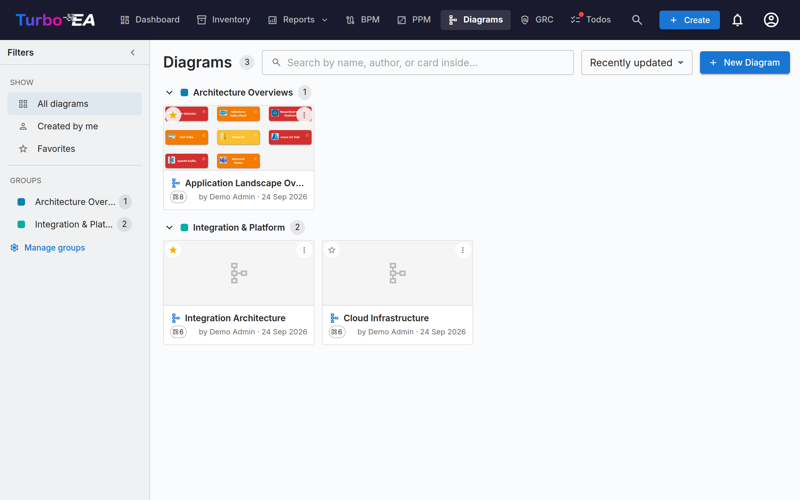

# Diagrams

The **Diagrams** module lets you create **visual architecture diagrams** using an embedded [DrawIO](https://www.drawio.com/) editor — fully integrated with your card inventory. Drag cards onto the canvas, connect them with relations, drill into hierarchies, and recolor by any attribute — the diagram stays in sync with your EA data.



## Diagram Gallery

The gallery lists every diagram as a compact card with a thumbnail, name, author, and the number of cards it references. **Create**, **Open**, **Edit details**, organise, or **Delete** any diagram.

### Finding diagrams

- **Filter sidebar** — the left rail narrows the gallery to **All diagrams**, **Created by me**, or your **Favorites**. Collapse it to a slim rail with the chevron; on small screens the **Filters** button opens it as a slide-in panel.
- **Search** — the search box matches a diagram's name, its author, and the names of the cards drawn inside it, so you can find a diagram by what it contains.
- **Sort** — order by recently updated, recently created, or name.
- **Favorites** — click the star on any card to add it to your personal favorites; the **Favorites** filter then shows them all.

### Groups

Organize related diagrams into **groups** — shared, workspace-wide labels. A diagram can belong to several groups at once. In card view the gallery shows each group as a collapsible heading, with anything unassigned under **Ungrouped**.

- Use **Manage groups** in the sidebar to create, rename, recolour, or delete groups.
- Use **Add to groups…** from a diagram's menu to place it in one or more groups (you can create a new group inline).
- Selecting a group in the sidebar filters the gallery to just that group.


## The Diagram Editor

Opening a diagram launches the full-screen DrawIO editor in a same-origin iframe. The native DrawIO toolbar is available for shapes, connectors, text, and layout — every Turbo EA action is exposed via the right-click context menu, the toolbar Sync button, and the chevron overlay that sits on top of each card.

### Inserting cards

Use the **Insert Cards** dialog (opened from the toolbar or the right-click menu) to add cards to the canvas:

- Type **chips with live counts** on the left rail filter the results.
- Search by name on the right rail; each row carries a checkbox.
- **Insert selected** adds the picked cards in a grid; **Insert all** adds every card matching the current filter (with a confirm step past 50 results).

The same dialog opens in single-select mode for **Change Linked Card** and **Link to Existing Card**.

Each card on the canvas shows its **card-type icon** as a small white glyph in the top-left corner, next to the type colour — so a card's type is conveyed by both icon and colour. This matches the icons used across the app and improves readability for colour-blind users. The icon appears on cards inserted from now on. To add icons to cards already on an older diagram, click **Apply card-type icons** in the editor toolbar.

### Right-click actions

- **Synced cards**: *Open Card*, *Change Linked Card*, *Unlink Card*, *Remove from diagram*.
- **Plain shapes / unlinked cells**: *Link to Existing Card*, *Convert to Card* (keeps the shape's geometry, turns it into a pending card seeded with the shape's label), *Convert to Container* (turns the shape into a swimlane so other cards can be nested inside).

### The Expand menu

Every synced card carries a small chevron overlay. Clicking it opens a menu with three sections, each populated in one round-trip:

- **Show Dependency** — neighbours via outgoing or incoming relations, grouped by relation type with counts. Each row is a checkbox; commit with **Insert (N)**.
- **Drill-Down** — turns the current card into a swimlane container with its `parent_id` children nested inside. Pick which children to include or *Drill into all*.
- **Roll-Up** — wraps the current card + selected siblings (cards sharing the same `parent_id`) inside a new parent container.

Rows with count = 0 are greyed out, and neighbours / children already on the canvas are skipped automatically.

An expanded card shows a `−` overlay to collapse it again. Collapsing removes the expanded cards from the canvas, so Turbo EA asks for confirmation first if you have moved or restyled any of them; expanding again puts them back exactly where you left them.

### Hierarchy on the canvas

Containers correspond to a card's `parent_id`:

- **Dragging a card into** a same-type container opens *"Add «child» as a child of «parent»?"*. **Yes** queues a hierarchy change; **No** snaps the card back.
- **Dragging a card out** of a container prompts to detach (set `parent_id = null`).
- **Cross-type drops** snap back silently — the hierarchy is restricted to cards of the same type.
- All confirmed moves land in the **Hierarchy Changes** bucket in the Sync drawer with *Apply* and *Discard* actions.

### Removing cards from the diagram

Deleting a card from the canvas is treated as a **visual-only** gesture — *"I don't want to see this here"*. The card stays in inventory; its connected relation-edges silently disappear with it. Hand-drawn arrows that aren't registered EA relations are never auto-removed. **Archival is a job for the Inventory page**, not the diagram.

### Edge deletions

Removing an edge that carries a real relation opens *"Delete the relation between SOURCE and TARGET?"*:

- **Yes** queues the deletion in the Sync drawer; **Sync All** issues the backend `DELETE /relations/{id}`.
- **No** restores the edge in place (style and endpoints preserved).

### View perspectives

The **View** dropdown in the toolbar recolors every card on the canvas by an attribute:

- **Card colors** (default) — each card uses its card-type color.
- **Approval status** — recolors by `approved` / `pending` / `broken`.
- **Field values** — pick any single-select field on the card types currently on the canvas (e.g., *Lifecycle*, *Status*). Cells with no value fall back to a neutral grey.

A floating legend in the bottom-left of the canvas shows the active mapping. The chosen view is saved with the diagram.

### How relation edges are drawn

Every Turbo EA relation looks the same on the canvas however it got there — drawn by hand with the relation picker, or pulled in from the inventory with the **+** / Expand menu:

- **One neutral dark-grey line**, not the colour of the card at the other end. An edge *is* a relation; tinting it by card type only restates what the node already says.
- **An arrowhead on the target end**, so the direction reads at a glance without reading the verb. Pull in a relation that points *at* the card you expanded and the arrowhead sits on the other end.
- **The verb reads in the arrow's direction.** Since the arrowhead marks the relation's target, the label always completes the sentence *tail → verb → head*. That means a link reads the same whichever card you expanded from: expand an Organization and you see *uses*; expand one of its Applications and the organisations coming back still read *uses*, with the arrow pointing the other way.
- **A dashed line** while the relation is still pending, turning solid once it has been pushed to the inventory.

#### Provider and consumer

Some relations carry a **flow direction** — most importantly the link between an Application and an Interface, where one application *provides* the interface and others *consume* it. Set it in the relation dialog when you draw the link (or from the card's Relations section afterwards), and the arrowhead follows the data rather than the relation:

| Flow direction | Arrowhead |
|---|---|
| **Provider** (source → target) | points at the Interface |
| **Consumer** (target → source) | points back at the Application |
| **Bidirectional** | arrowheads at both ends |

This matches what the [Layered Dependency View](reports.md) already draws, so a diagram and a dependency report agree. Links where the flow direction was never set keep the plain relation-direction arrow — the information has to be in the model before a diagram can show it.

### Hiding relation labels

Every relation edge carries its verb — *provides*, *consumes*, *supports*. On a dense landscape that quickly becomes more noise than information, so the **⋮** overflow menu offers **Hide relation labels** (and **Show relation labels** to bring them back).

This is display-only: the relation itself is untouched, so hiding is free to undo. The setting is saved with the diagram, so the read-only viewer, any [published diagram](#sharing-a-diagram-outside-turbo-ea) and PNG/SVG exports all match what you arranged. Edges you draw afterwards follow the current setting. Annotation edges you labelled yourself are left alone — only Turbo EA relation edges are affected.

### Sync drawer

The **Sync** button in the toolbar opens the side drawer with everything queued for the next sync:

- **New Cards** — shapes converted to pending cards, ready to be pushed to inventory.
- **New Relations** — edges drawn between cards, ready to be created in inventory.
- **Removed Relations** — relation-edges deleted from the canvas, queued for `DELETE /relations/{id}`. *Keep in inventory* re-inserts the edge.
- **Hierarchy Changes** — confirmed drag-into / drag-out container moves, queued as `parent_id` updates.
- **Inventory Changed** — cards updated in inventory since the diagram was opened, ready to be pulled back into the canvas.

The toolbar Sync button shows a pulsing "N unsynced" pill whenever pending work exists. Leaving the tab with unsynced changes triggers a browser warning, and the canvas autosaves to local storage every five seconds so an accidental refresh can be restored on reopen.

### Linking diagrams to cards

Diagrams can be linked to **any card** from the card's **Resources** tab (see [Card Details](card-details.md#resources-tab)). When linked to an **Initiative** card, the diagram also appears in the [EA Delivery](delivery.md) module alongside SoAW documents.

## Sharing a diagram outside Turbo EA

A diagram can be published as a **read-only link that opens without signing in**, so it can be embedded in a wiki page such as Confluence.

Open the diagram's **⋮** menu in the gallery and choose **Share / embed…**. Publishing requires the *Publish diagrams* permission, which is separate from the permission to edit them — an administrator grants it deliberately.

The dialog gives you two choices and two strings to copy:

- **Anyone with the link** — no sign-in. Treat the link like a password: anyone it is forwarded to can view the diagram.
- **Only people who sign in** — visitors authenticate with your identity provider, optionally restricted to named email domains. No Turbo EA account is created for them.

The published page shows the picture only. It is pannable and zoomable, but there is no click-through to card details, and the card identifiers behind the shapes are stripped before the diagram leaves the server. Turning publishing off takes effect immediately, including for anyone already viewing. Re-publishing later restores the same link, so URLs already pasted into a wiki keep working.

!!! warning "Embedding needs one administrator step"
    For security, no other website may place Turbo EA in a frame unless an administrator says so. Set `TURBO_EA_EMBED_ALLOWED_ORIGINS` in `.env` to the sites allowed to embed diagrams and restart the stack:

    ```dotenv
    TURBO_EA_EMBED_ALLOWED_ORIGINS=https://yourcompany.atlassian.net
    ```

    Until that is set, published links still work when opened directly — they just cannot be framed by another site.

### Embedding in Confluence

1. Publish the diagram and copy the **Embed code** from the Share dialog.
2. Ask an administrator to add your Confluence base URL to `TURBO_EA_EMBED_ALLOWED_ORIGINS`.
3. In Confluence, insert an **HTML** macro (or *Iframe* / *HTML include*, depending on what your instance allows) and paste the embed code.

If your Confluence does not allow HTML macros, paste the plain **Link** instead — it opens the same view in a new tab.
