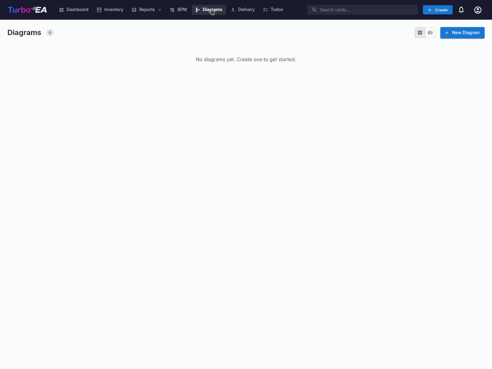

# Diagramas

O módulo de **Diagramas** permite criar **diagramas visuais de arquitetura** usando um editor [DrawIO](https://www.drawio.com/) integrado — totalmente integrado com seu inventário de cards. Você pode arrastar cards para a tela, conectá-los com relacionamentos e manter o diagrama sincronizado com seus dados de EA.

## Galeria de Diagramas

A galeria mostra todos os diagramas como **cartões com miniatura** ou em uma **visualização em lista** (alterne pelo ícone de visualização na barra de ferramentas). Cada diagrama exibe seu nome, tipo e uma pré-visualização visual do seu conteúdo.

**Ações a partir da galeria:**

- **Criar** — Clique em **+ Novo Diagrama** para criar um diagrama com nome, descrição opcional e um link opcional para um card de Iniciativa
- **Abrir** — Clique em qualquer diagrama para abrir o editor
- **Editar detalhes** — Renomear, atualizar a descrição ou reatribuir a iniciativa vinculada
- **Excluir** — Remover um diagrama (com confirmação)

## O Editor de Diagramas

Abrir um diagrama inicia um **editor DrawIO** em tela cheia em um iframe de mesma origem. A barra de ferramentas padrão do DrawIO está disponível para formas, conectores, texto, formatação e layout.

### Inserindo Cards

Use a **Barra Lateral de Cards** (alterne pelo ícone de barra lateral) para navegar pelo seu inventário. Você pode:

- **Pesquisar** cards por nome
- **Filtrar** por tipo de card
- **Arrastar um card** para a tela — ele aparece como uma forma estilizada com o nome e ícone do tipo do card
- Usar o **Diálogo de Seleção de Cards** para busca avançada e seleção múltipla

### Criando Cards a partir do Diagrama

Se você desenhar uma forma que não corresponde a um card existente, pode criar um diretamente:

1. Selecione a forma não vinculada
2. Clique em **Criar Card** no painel de sincronização
3. Preencha o tipo, nome e campos opcionais
4. A forma é automaticamente vinculada ao novo card

### Criando Relacionamentos a partir de Arestas

Quando você desenha um conector entre duas formas de cards:

1. Selecione a aresta
2. O diálogo do **Seletor de Relacionamentos** aparece
3. Escolha o tipo de relacionamento (apenas tipos válidos para os tipos de cards conectados são mostrados)
4. O relacionamento é criado no inventário e a aresta é marcada como sincronizada

### Sincronização de Cards

O **Painel de Sincronização** mantém seu diagrama e inventário em sincronia:

- **Cards sincronizados** — Formas vinculadas a cards do inventário mostram um indicador verde de sincronia
- **Formas não sincronizadas** — Formas ainda não vinculadas a cards são sinalizadas para ação
- **Expandir/recolher grupos** — Navegue por grupos hierárquicos de cards diretamente na tela

### Vinculação a Iniciativas

Diagramas podem ser vinculados a cards de **Iniciativa**, fazendo-os aparecer no módulo de [Entregas de EA](delivery.md) junto com documentos SoAW. Isso fornece uma visualização completa de todos os artefatos de arquitetura para uma determinada iniciativa.
