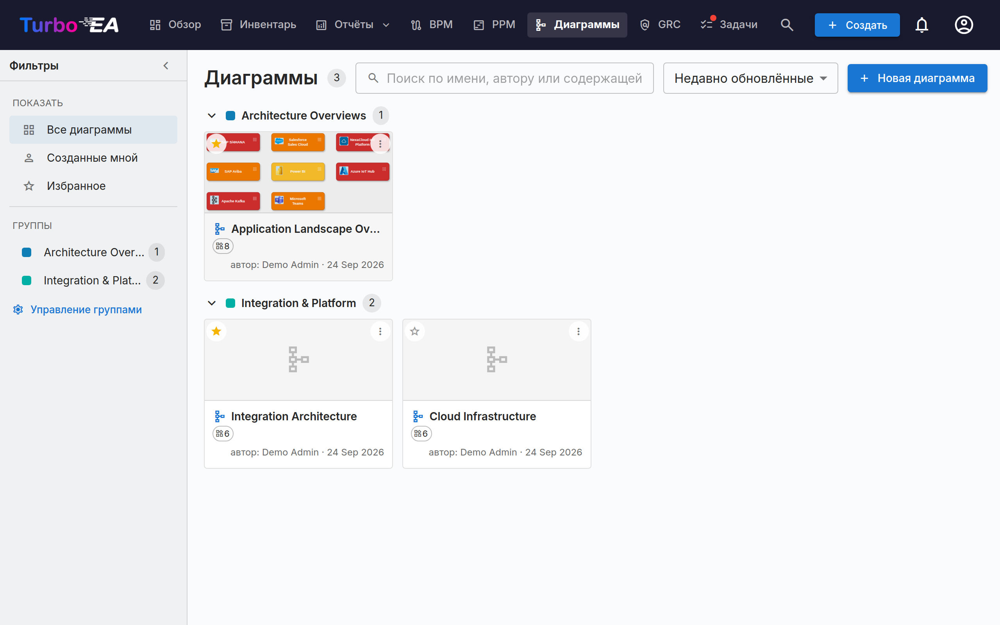

# Диаграммы

Модуль **Диаграммы** позволяет создавать **визуальные архитектурные диаграммы** во встроенном редакторе [DrawIO](https://www.drawio.com/) -- полностью интегрированном с инвентаризацией карточек. Перетаскивайте карточки на холст, соединяйте их связями, погружайтесь в иерархии и перекрашивайте по любому атрибуту -- диаграмма остаётся синхронизированной с вашими данными EA.



## Галерея диаграмм

Галерея отображает каждую диаграмму в виде компактной карточки с миниатюрой, именем, автором и числом карточек, на которые она ссылается. **Создавайте**, **Открывайте**, **Изменяйте сведения**, упорядочивайте или **Удаляйте** любую диаграмму.

### Поиск диаграмм

- **Боковая панель фильтров** — левая панель сужает галерею до **Всех диаграмм**, **Созданных мной** или вашего **Избранного**. Стрелка сворачивает её в узкую полосу; на маленьких экранах кнопка **Фильтры** открывает её как выдвижную панель.
- **Поиск** — поле поиска сопоставляет имя диаграммы, её автора и имена нарисованных в ней карточек, так что диаграмму можно найти по её содержимому.
- **Сортировка** — по недавно обновлённым, недавно созданным или имени.
- **Избранное** — нажмите звёздочку на любой карточке, чтобы добавить её в личное избранное; фильтр **Избранное** покажет их все.

### Группы

Группируйте связанные диаграммы в **группы** — общие метки уровня рабочей области. Диаграмма может одновременно принадлежать нескольким группам. В виде карточек галерея показывает каждую группу как сворачиваемый заголовок; неназначенные диаграммы отображаются в группе **Без группы**.

- Используйте **Управление группами** на боковой панели, чтобы создавать, переименовывать, перекрашивать или удалять группы.
- Используйте **Добавить в группы…** из меню диаграммы, чтобы поместить её в одну или несколько групп (новую группу можно создать тут же).
- Выбор группы на боковой панели фильтрует галерею только по этой группе.


## Редактор диаграмм

Открытие диаграммы запускает полноэкранный редактор DrawIO во вложенном iframe того же источника. Стандартная панель инструментов DrawIO доступна для фигур, соединителей, текста и компоновки -- все действия Turbo EA доступны через контекстное меню правой кнопки, кнопку Sync на панели инструментов и шеврон-оверлей над каждой карточкой.

### Вставка карточек

Используйте диалог **Вставить карточки** (открывается с панели инструментов или из контекстного меню), чтобы добавить карточки на холст:

- **Чипы типов с живыми счётчиками** в левой колонке фильтруют результаты.
- Поиск по имени в правой колонке; в каждой строке есть флажок. Оставьте в фильтре один иерархический тип — и список станет деревом с отступами, чтобы находить карточку по её ветви.
- Отмеченные карточки показываются чипами над списком и остаются выбранными, пока вы меняете фильтр или запрос: удалите нужную крестиком ×.
- **Выбрать все показанные** отмечает всё, что оставил текущий фильтр; **Вставить выбранные** добавляет отмеченные карточки на холст сеткой.

Тот же диалог открывается в режиме одиночного выбора для **Сменить связанную карточку** и **Связать с существующей карточкой**.

Каждая карточка на холсте показывает свой **значок типа карточки** в виде небольшого белого глифа в верхнем левом углу, рядом с цветом типа — таким образом тип карточки передаётся как значком, так и цветом. Это соответствует значкам, используемым во всём приложении, и улучшает читаемость для пользователей с дальтонизмом. Значок появляется на карточках, вставленных с этого момента. Чтобы добавить значки к карточкам, уже находящимся на более старой диаграмме, нажмите **Применить значки типов карточек** на панели инструментов редактора. Если у карточки есть собственный **логотип**, показывается он, а значок типа карточки остаётся небольшим бейджем в углу — так фигура сообщает и о том, какой это продукт, и о том, какого типа карточка. Логотипы появляются при открытии диаграммы и обновляются при замене; карточка без логотипа, как и любая карточка типа, для которого администратор отключил логотипы, рисуется точно так же, как раньше. Флажок **Логотипы карточек** в том же меню отключает их, если нужна диаграмма без украшений; по умолчанию он включён.

### Действия правой кнопки

- **Синхронизированные карточки**: «Открыть карточку», «Сменить связанную карточку», «Отвязать карточку», «Удалить из диаграммы».
- **Простые фигуры / несвязанные ячейки**: «Связать с существующей карточкой», «Преобразовать в карточку» (сохраняет геометрию, превращает фигуру в ожидающую карточку с её меткой), «Преобразовать в контейнер» (превращает фигуру в swimlane, в котором можно вкладывать другие карточки).

### Меню расширения

На каждой синхронизированной карточке есть небольшой шеврон-оверлей. Щелчок открывает меню из трёх разделов, каждый из которых загружается за один запрос:

- **Показать зависимости** -- соседи по исходящим или входящим связям, сгруппированные по типу связи со счётчиками. Каждая строка -- флажок; подтверждайте кнопкой **Вставить (N)**.
- **Drill-Down** -- превращает текущую карточку в swimlane-контейнер с вложенными в него её детьми по `parent_id`. Выберите, каких детей включить, или *Углубиться во все*.
- **Roll-Up** -- оборачивает текущую карточку и выбранных братьев (карточки с тем же `parent_id`) в новый родительский контейнер.

Строки со счётчиком 0 становятся серыми, а соседи и дети, уже находящиеся на холсте, пропускаются автоматически.

Развёрнутая карточка показывает значок `−` для повторного сворачивания. Сворачивание удаляет развёрнутые карточки с холста, поэтому Turbo EA сначала запрашивает подтверждение, если вы перемещали или переоформляли какую-либо из них; при повторном развёртывании они появятся ровно там, где вы их оставили.

### Иерархия на холсте

Контейнеры соответствуют `parent_id` карточки:

- **Перетаскивание карточки в** контейнер того же типа открывает «Добавить «потомка» как ребёнка «родителя»?». **Да** ставит изменение иерархии в очередь; **Нет** возвращает карточку на место.
- **Перетаскивание карточки из** контейнера предлагает отсоединить (установить `parent_id = null`).
- **Перетаскивание между разными типами** молча возвращается обратно -- иерархия ограничена карточками одного типа.
- Все подтверждённые перемещения попадают в раздел **Изменения иерархии** в панели Sync с действиями «Применить» и «Отменить».

### Удаление карточек из диаграммы

Удаление карточки с холста трактуется как чисто **визуальное действие** -- «Я не хочу видеть её здесь». Карточка остаётся в инвентаре; её связанные рёбра-отношения молча исчезают вместе с ней. Нарисованные от руки стрелки, не являющиеся зарегистрированными EA-отношениями, никогда не удаляются автоматически. **Архивация -- это задача страницы Инвентарь**, а не диаграммы.

### Удаление рёбер

Удаление ребра, несущего реальную связь, открывает «Удалить связь между ИСТОЧНИКОМ и ЦЕЛЬЮ?»:

- **Да** ставит удаление в очередь Sync; **Синхронизировать все** отправляет на бэкенд `DELETE /relations/{id}`.
- **Нет** восстанавливает ребро на месте (стиль и концы сохранены).

### Перспективы вида

Выпадающее меню **Цвет по** на панели инструментов перекрашивает карточки на холсте:

- **Цвета карточек** (по умолчанию) -- каждая карточка использует цвет своего типа.
- **Статус одобрения** -- перекрашивает по «одобрено» / «ожидает» / «нарушено».
- **Значения полей** -- отметьте поле с одиночным выбором под любым типом карточек на холсте. **Несколько типов карточек могут одновременно нести по одному правилу**: Приложения по критичности *и* ИТ-компоненты по модели размещения. Тип без правила сохраняет свой прежний цвет, включая заливку, заданную вручную; серой становится только карточка, для которой её собственное правило не нашло значения. Второе поле внутри одного типа заменяет первое, ведь у карточки одна заливка.

Плавающая легенда в левом нижнем углу показывает по одной шкале на каждое активное правило. Правила по полям и **Статус одобрения** — альтернативы, а не слои: выбор одного очищает другое. Если снять все правила, холст вернётся к цветам карточек. Выбор сохраняется вместе с диаграммой.

#### Показывать на карточке

Вторая кнопка на панели инструментов, **Показывать на карточке**, определяет, **что говорит каждая фигура**. Отметьте **тип карточки**, **подтип** или любой атрибут типов карточек, присутствующих на холсте, — и каждая фигура получит небольшие строки подробностей под своим именем. Поля перечислены под тем типом карточки, которому принадлежат; поле, общее для нескольких таких типов, собрано под заголовком **Общие**. Это отдельная кнопка от **Цвет по**, чтобы ни один из двух списков не приходилось прокручивать мимо другого. **Очистить всё** снимает все флажки разом.

На фигуре рисуется каждый выбранный пункт, и фигура **растёт, чтобы вместить его**. Две строки помещаются в карточку и так, поэтому ничего не меняется, пока вы не отметите третью; дальше каждая карточка становится чуть выше на каждый пункт и уменьшается обратно, когда вы снимаете отметку. Карточка, размер которой вы изменили вручную, сохраняет вашу высоту: она лишь получает или возвращает место под одну строку.

Эти строки сохраняются вместе с диаграммой, поэтому все читатели — включая тех, кто открывает опубликованную ссылку, — видят одни и те же фигуры. Карточки, попавшие на холст через **Раскрыть**, несут те же строки, что и любая другая карточка, и растут так же. Карточки, уложенные внутрь контейнера **Drill-Down** или **Roll-Up**, показывают то, что помещается в их ячейке: увеличение наехало бы на строку ниже. А вот заголовок самого контейнера растёт под свои строки — и его содержимое сдвигается вниз вместе с ним, — так что превращение карточки в контейнер никогда не стоит того, что она говорила.

Кнопка **Создать диаграмму** в [отчёте о зависимостях](reports.md) переносит собственные настройки отображения карточек, поэтому диаграмма, созданная из отчёта, открывается ровно с теми строками, которые были выбраны в отчёте, — со всеми, включая те, для которых у самого отчёта не было места.

### Как рисуются рёбра связей

Любая связь Turbo EA выглядит на холсте одинаково, независимо от того, как она туда попала — нарисована вручную через выбор связи или подтянута из реестра кнопкой **+** / меню расширения:

- **Одна нейтральная тёмно-серая линия**, а не цвет карточки на другом конце. Ребро *и есть* связь; окрашивать его по типу карточки — значит повторять то, что и так сказано узлом.
- **Стрелка на стороне цели**, чтобы направление считывалось с первого взгляда, без чтения глагола. Если подтянуть связь, направленную *на* раскрытую карточку, стрелка окажется на другом конце.
- **Глагол читается по направлению стрелки.** Поскольку остриё указывает на цель связи, подпись всегда достраивает фразу «начало → глагол → конец». Поэтому связь читается одинаково, с какой бы карточки вы её ни раскрыли: раскройте Организацию — увидите *использует*; раскройте одно из её Приложений — возвращающиеся организации по-прежнему показывают *использует*, только стрелка направлена в другую сторону.
- **Пунктирная линия**, пока связь ещё не отправлена в реестр; после отправки она становится сплошной.

#### Поставщик и потребитель

У некоторых связей есть **направление потока** — прежде всего у связи между Приложением и Интерфейсом, где одно приложение *предоставляет* интерфейс, а другие его *потребляют*. Задайте его в диалоге связи при рисовании (или позже в разделе «Связи» карточки), и стрелка будет следовать за данными, а не за связью:

| Направление потока | Стрелка |
|---|---|
| **Поставщик** (источник → цель) | указывает на Интерфейс |
| **Потребитель** (цель → источник) | указывает обратно на Приложение |
| **Двунаправленное** | стрелки с обеих сторон |

Это совпадает с тем, что уже рисует [Layered Dependency View](reports.md), поэтому диаграмма и отчёт о зависимостях согласуются. Связи, у которых направление потока не задано, сохраняют обычную стрелку направления связи — информация должна быть в модели, прежде чем диаграмма сможет её показать.

### Скрытие подписей связей

На каждом ребре связи показан его предикат — *предоставляет*, *использует*, *поддерживает*. На плотной схеме это быстро становится шумом, а не информацией, поэтому в меню **⋮** есть пункт **Скрыть подписи связей** (и **Показать подписи связей**, чтобы вернуть их).

Это касается только отображения: сама связь не изменяется, поэтому скрытие обратимо. Настройка сохраняется вместе с диаграммой, так что режим просмотра, любая опубликованная диаграмма и экспорт в PNG/SVG соответствуют тому, что вы настроили. Рёбра, нарисованные позже, следуют текущей настройке. Аннотационные рёбра, подписанные вами вручную, не затрагиваются — только рёбра связей Turbo EA.

### Панель Sync

Кнопка **Sync** на панели инструментов открывает боковую панель со всем, что стоит в очереди на следующую синхронизацию:

- **Новые карточки** -- фигуры, преобразованные в ожидающие карточки, готовые к выгрузке в инвентарь.
- **Новые связи** -- рёбра, нарисованные между карточками, готовые к созданию в инвентаре.
- **Удалённые связи** -- рёбра-связи, удалённые с холста, в очереди на `DELETE /relations/{id}`. «Оставить в инвентаре» возвращает ребро.
- **Изменения иерархии** -- подтверждённые перемещения внутри / из контейнеров, в очереди как обновления `parent_id`.
- **Инвентарь изменён** -- изменения, внесённые в инвентарь после сохранения диаграммы, готовые к подтягиванию на холст. Каждая строка предлагает соответствующее действие, а «Принять все» разрешает все строки разом:
    - **переименованная** карточка -- «Принять обновление» переписывает подпись ячейки;
    - **удалённая** или **архивированная** карточка -- «Убрать со схемы» удаляет ячейку (и её рёбра) с холста;
    - **удалённая связь** -- «Убрать ребро со схемы» удаляет устаревшее ребро с холста;
    - связь с изменённым **направлением потока** -- «Принять обновление» выравнивает стрелку по инвентарю.

Turbo EA **автоматически проверяет изменения инвентаря при каждом открытии диаграммы** -- синий значок на кнопке Sync панели инструментов показывает число изменений, ожидающих проверки. Ничего не применяется без вашего подтверждения; значок лишь приглашает открыть панель. Кнопка «Проверить обновления» в панели повторяет ту же проверку по запросу.

Кнопка Sync на панели показывает пульсирующую плашку «N не синхронизировано», пока существуют ожидающие правки. Уход со вкладки с несинхронизированными изменениями вызывает предупреждение браузера, а холст автоматически сохраняется в локальное хранилище каждые пять секунд, чтобы случайное обновление можно было восстановить при повторном открытии.

### Привязка диаграмм к карточкам

Диаграммы можно привязать к **любой карточке** на вкладке **Ресурсы** карточки (см. [Детали карточки](card-details.ru.md#вкладка-ресурсы)). Когда диаграмма привязана к карточке **Инициатива**, она также отображается в модуле [EA Delivery](delivery.md) рядом с документами SoAW.

## Публикация диаграммы за пределами Turbo EA

Диаграмму можно опубликовать как **ссылку только для чтения, которая открывается без входа в систему**, чтобы встроить её в вики-страницу, например в Confluence.

Откройте меню **⋮** диаграммы в галерее и выберите **Поделиться / встроить…**. Публикация требует разрешения *Публиковать диаграммы*, отдельного от разрешения на их редактирование, — администратор выдаёт его осознанно.

Диалог предлагает два варианта и две строки для копирования:

- **Любой, у кого есть ссылка** — без входа. Считайте ссылку паролем: любой, кому её перешлют, увидит диаграмму.
- **Только вошедшие в систему** — посетители проходят проверку у вашего поставщика удостоверений, при желании с ограничением по почтовым доменам. Учётная запись Turbo EA для них не создаётся.

Опубликованная страница показывает только изображение. Её можно перемещать и масштабировать, но перехода к деталям карточек нет, а идентификаторы карточек, стоящие за фигурами, удаляются до того, как диаграмма покинет сервер. Отмена публикации действует немедленно, в том числе для тех, кто уже просматривает. Повторная публикация восстанавливает ту же ссылку, поэтому уже вставленные URL продолжают работать.

!!! warning "Для встраивания нужен один шаг администратора"
    В целях безопасности ни один сторонний сайт не может поместить Turbo EA во фрейм без разрешения администратора. Задайте `TURBO_EA_EMBED_ALLOWED_ORIGINS` в `.env`, перечислив сайты, которым разрешено встраивать диаграммы, и перезапустите стек:

    ```dotenv
    TURBO_EA_EMBED_ALLOWED_ORIGINS=https://yourcompany.atlassian.net
    ```

    До этого опубликованные ссылки продолжают работать при прямом открытии — их просто нельзя встроить на другом сайте.

### Встраивание в Confluence

1. Опубликуйте диаграмму и скопируйте **код встраивания** из диалога.
2. Попросите администратора добавить базовый URL вашего Confluence в `TURBO_EA_EMBED_ALLOWED_ORIGINS`.
3. В Confluence вставьте макрос **HTML** (или *Iframe* / *HTML include* — в зависимости от того, что разрешает ваш экземпляр) и вставьте код.

Если ваш Confluence не допускает HTML-макросы, вставьте обычную **ссылку** — она откроет то же представление в новой вкладке.
