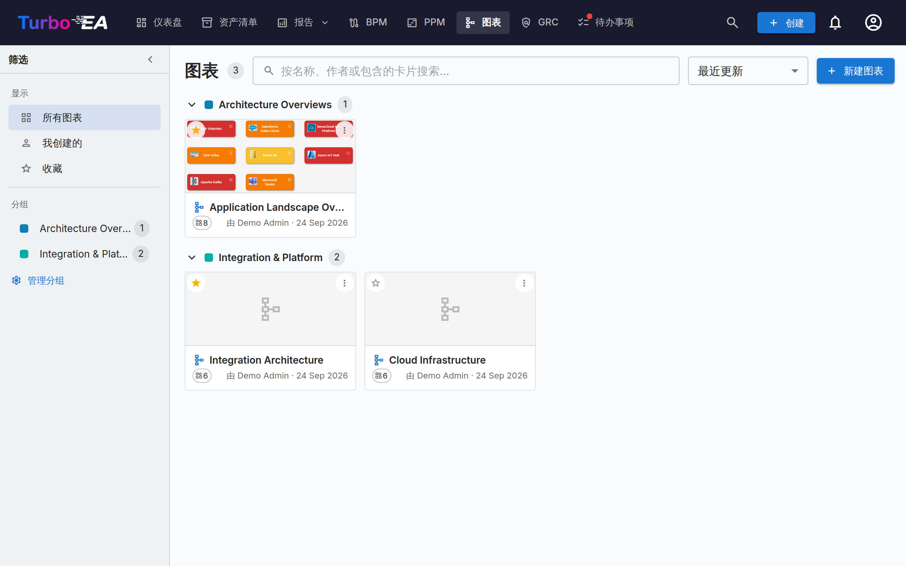

# 图表

**图表**模块允许您使用嵌入式 [DrawIO](https://www.drawio.com/) 编辑器创建**可视化架构图**——与您的卡片库完全集成。将卡片拖到画布上，用关系连接它们，深入层级，并按任何属性重新着色——图表始终与您的 EA 数据保持同步。



## 图表库

图表库将每个图表显示为一张紧凑的卡片，包含缩略图、名称、作者以及它引用的卡片数量。可对任意图表进行**创建**、**打开**、**编辑详情**、整理或**删除**。

### 查找图表

- **筛选侧边栏** — 左侧栏可将图表库限定为**所有图表**、**我创建的**或您的**收藏**。使用箭头可将其折叠为窄栏；在小屏幕上，**筛选**按钮会以滑出面板的形式打开它。
- **搜索** — 搜索框可匹配图表的名称、作者以及其中绘制的卡片名称，因此您可以按内容查找图表。
- **排序** — 按最近更新、最近创建或名称排序。
- **收藏** — 点击任意卡片上的星形即可将其加入您的个人收藏；**收藏**筛选项会显示全部收藏。

### 分组

将相关图表归入**分组**——工作区范围内共享的标签。一个图表可以同时属于多个分组。在卡片视图中，图表库将每个分组显示为可折叠的标题；未分配的图表显示在**未分组**下。

- 使用侧边栏中的**管理分组**来创建、重命名、改色或删除分组。
- 使用图表菜单中的**添加到分组…**将其放入一个或多个分组（可以即时创建新分组）。
- 在侧边栏中选择某个分组会将图表库筛选为仅该分组。


## 图表编辑器

打开图表会在同源 iframe 中以全屏方式启动 DrawIO 编辑器。原生 DrawIO 工具栏可用于形状、连接器、文本和布局——每个 Turbo EA 专有操作都可通过右键菜单、工具栏 Sync 按钮和每张卡片顶部的箭头叠加层访问。

### 插入卡片

使用**插入卡片**对话框（从工具栏或右键菜单打开）将卡片添加到画布：

- 左侧栏的**带实时计数的类型徽章**可过滤结果。
- 在右侧栏按名称搜索；每行都有一个复选框。
- **插入所选项**以网格形式添加选中的卡片；**全部插入**添加所有符合当前筛选的卡片（超过 50 条结果时会有确认步骤）。

同一对话框在单选模式下用于**更改链接的卡片**和**链接到现有卡片**。

画布上的每张卡片都会在左上角显示其**卡片类型图标**（一个白色小字形），紧邻类型颜色——因此卡片的类型同时通过图标和颜色来传达。这与整个应用中使用的图标一致，并改善了色盲用户的可读性。该图标会出现在此后插入的卡片上。若要为已在较早图表中的卡片添加图标，请在编辑器工具栏中点击**应用卡片类型图标**。

### 右键菜单操作

- **已同步的卡片**：「打开卡片」、「更改链接的卡片」、「取消链接卡片」、「从图表中移除」。
- **普通形状 / 未链接的单元**：「链接到现有卡片」、「转换为卡片」（保留几何形状，将形状变成以其标签命名的待同步卡片）、「转换为容器」（将形状变成可嵌入其他卡片的泳道容器）。

### 展开菜单

每张已同步卡片上都有一个小箭头叠加层。点击会打开一个包含三个区段的菜单，每个区段都通过单次往返加载：

- **显示依赖**——通过出入向关系获取邻居，按关系类型分组并显示计数。每行都是复选框；用**插入 (N)** 提交。
- **下钻 (Drill-Down)**——将当前卡片变成一个泳道容器，其 `parent_id` 子项嵌套在内。选择要包含的子项，或选择「下钻全部」。
- **上卷 (Roll-Up)**——将当前卡片 + 选定的兄弟（共享相同 `parent_id` 的卡片）包装在一个新的父容器中。

计数为 0 的行会变灰，已存在于画布上的邻居 / 子项会被自动跳过。

已展开的卡片会显示 `−` 图标用于重新折叠。折叠会将展开的卡片从画布上移除，因此如果你移动或重新设置过其中任何一张的格式，Turbo EA 会先请求确认；再次展开时，它们会回到你离开时的位置。

### 画布上的层级

容器对应于卡片的 `parent_id`：

- **将卡片拖入**同类型容器会打开「将「子」添加为「父」的子项？」。**是**会将层级变更排入队列；**否**会让卡片回到原位。
- **将卡片拖出**容器会提示分离（设置 `parent_id = null`）。
- **跨类型拖放**会静默回到原位——层级被严格限制为同类型的卡片。
- 所有已确认的移动都会进入同步抽屉的「层级变更」桶，包含「应用」和「丢弃」操作。

### 从图表中移除卡片

从画布上删除卡片被视为纯**视觉操作**——「我不想在这里看到它」。卡片仍保留在库存中；其连接的关系边会随其静默消失。手绘的、未注册为 EA 关系的箭头永远不会被自动移除。**归档是库存页面的工作**，而不是图表的工作。

### 边删除

删除带有真实关系的边会打开「删除 源 与 目标 之间的关系？」：

- **是**将删除排入同步抽屉队列；**全部同步**会发出后端 `DELETE /relations/{id}`。
- **否**会就地恢复该边（保留样式和端点）。

### 视图视角

工具栏中的**视图**下拉菜单根据属性重新着色画布上的每张卡片：

- **卡片颜色**（默认）——每张卡片使用其卡片类型的颜色。
- **审批状态**——按「已批准」/「待审」/「已破损」重新着色。
- **字段值**——选择画布上当前出现的卡片类型上的任何单选字段（如「生命周期」、「状态」）。没有值的单元会回退到中性灰色。

画布左下角的浮动图例显示当前映射。所选视图会与图表一起保存。

### 关系连线如何绘制

无论关系是怎样出现在画布上的——用关系选择器手动绘制，还是通过 **+** / 展开菜单从清单中引入——每条 Turbo EA 关系的外观都完全一致：

- **统一的中性深灰色线条**，而不是另一端卡片的颜色。连线本身*就是*关系；按卡片类型着色只是重复节点已经表达的信息。
- **箭头位于目标端**，无需阅读谓词即可一眼看清方向。若引入的关系指*向*你所展开的卡片，箭头就落在另一端。
- **谓词按箭头方向阅读。** 由于箭头指向关系的目标端，标签始终构成「起点 → 谓词 → 终点」这一完整语句。因此无论从哪张卡片展开，同一条连接的读法都一致：展开一个组织会看到*使用*；展开它的某个应用，返回的组织同样显示*使用*，只是箭头指向相反。
- **关系尚未同步时为虚线**，推送到清单后变为实线。

#### 提供方与消费方

某些关系带有**流向**——最典型的是应用与接口之间的连接：一个应用*提供*该接口，其他应用则*消费*它。在绘制连接时于关系对话框中设置流向（或事后从卡片的关系区设置），箭头便会跟随数据流而非关系方向：

| 流向 | 箭头 |
|---|---|
| **提供方**（源 → 目标） | 指向接口 |
| **消费方**（目标 → 源） | 指回应用 |
| **双向** | 两端各有箭头 |

这与 [Layered Dependency View](reports.md) 已有的画法一致，因此图表与依赖报告彼此吻合。从未设置流向的连接仍保留普通的关系方向箭头——信息必须先存在于模型中，图表才能呈现。

### 隐藏关系标签

每条关系连线都带有其谓词——*提供*、*消费*、*支撑*。在密集的全景图中，这很快就会变成噪音而非信息，因此 **⋮** 溢出菜单提供了**隐藏关系标签**（以及**显示关系标签**以恢复）。

这仅影响显示：关系本身不受影响，因此隐藏可随时撤销。该设置会随图表一起保存，所以只读查看器、任何已发布的图表以及 PNG/SVG 导出都与你的设置一致。之后绘制的连线会沿用当前设置。你自己标注的注释连线不受影响——只有 Turbo EA 的关系连线会受影响。

### 同步抽屉

工具栏的 **Sync** 按钮会打开侧边抽屉，显示下次同步排队的所有内容：

- **新卡片**——已转换为待同步卡片的形状，准备推送到库存。
- **新关系**——在卡片之间绘制的边，准备在库存中创建。
- **已删除的关系**——从画布上删除的关系边，已排入 `DELETE /relations/{id}` 队列。「保留在库存中」会重新插入该边。
- **层级变更**——已确认的拖入 / 拖出容器移动，已排入 `parent_id` 更新队列。
- **库存已变更**——自打开图表以来在库存中已更新的卡片，准备拉回画布。

只要存在待处理的工作，工具栏的 Sync 按钮就会显示一个脉动的「N 未同步」徽章。当存在未同步的更改时离开标签页会触发浏览器警告，画布每五秒自动保存到本地存储，因此意外刷新后可以在重新打开时恢复。

### 将图表链接到卡片

可以从卡片的**资源**标签页（参见[卡片详情](card-details.zh.md#资源标签页)）将图表链接到**任何卡片**。当图表链接到**举措**卡片时，它也会出现在 [EA 交付](delivery.md) 模块中，与 SoAW 文档并列。

## 在 Turbo EA 之外共享图表

图表可以发布为**无需登录即可打开的只读链接**，以便嵌入 Confluence 等 wiki 页面。

在图库中打开图表的 **⋮** 菜单并选择**共享 / 嵌入…**。发布需要「发布图表」权限，它与编辑图表的权限是分开的——由管理员有意授予。

对话框提供两个选项和两段可复制的内容：

- **任何拥有链接的人**——无需登录。请将链接视为密码：任何收到转发链接的人都能查看该图表。
- **仅限登录的人员**——访问者通过你的身份提供商进行验证，可选择限制为指定的邮箱域。系统不会为他们创建 Turbo EA 账户。

发布页面只显示图像。可以平移和缩放，但无法跳转到卡片详情，并且形状背后的卡片标识符在图表离开服务器前已被移除。取消发布会立即生效，对正在查看的人也是如此。之后重新发布会恢复同一链接，因此已粘贴的 URL 仍然有效。

!!! warning "嵌入需要管理员操作一步"
    出于安全考虑，除非管理员允许，否则任何其他网站都不能将 Turbo EA 放入框架中。在 `.env` 中将 `TURBO_EA_EMBED_ALLOWED_ORIGINS` 设置为允许嵌入图表的站点，然后重启服务：

    ```dotenv
    TURBO_EA_EMBED_ALLOWED_ORIGINS=https://yourcompany.atlassian.net
    ```

    在此之前，已发布的链接直接打开仍然可用，只是无法被其他站点嵌入。

### 嵌入到 Confluence

1. 发布图表，并从共享对话框复制**嵌入代码**。
2. 请管理员将你的 Confluence 基础 URL 添加到 `TURBO_EA_EMBED_ALLOWED_ORIGINS`。
3. 在 Confluence 中插入 **HTML** 宏（或 *Iframe* / *HTML include*，取决于你的实例允许哪一种），然后粘贴嵌入代码。

如果你的 Confluence 不允许 HTML 宏，可改为粘贴普通**链接**——它会在新标签页中打开同一视图。
