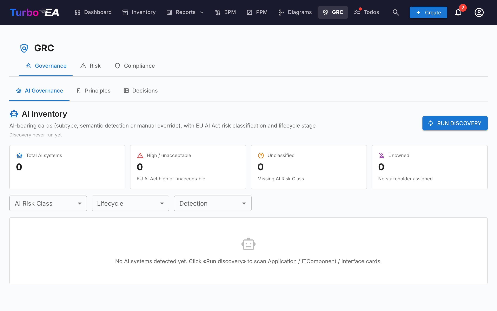
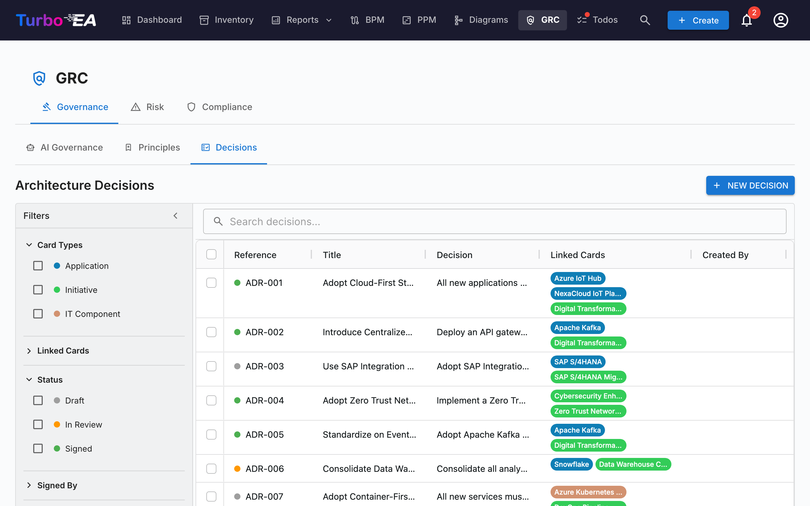
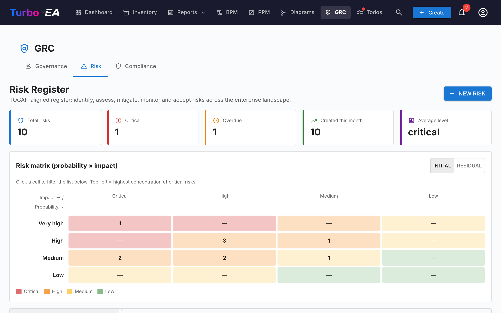
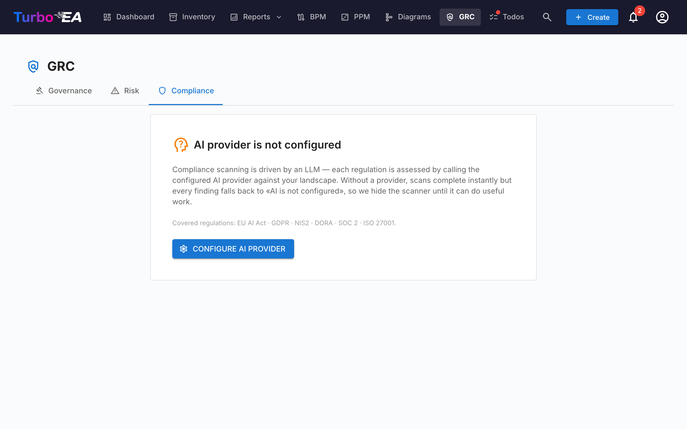

# GRC

**GRC**-modulet samler Governance, Risk og Compliance i ét arbejdsområde på `/grc`. Det konsoliderer arbejde, der tidligere var spredt på tværs af EA Delivery og TurboLens, så en arkitekt, en risikoejer og en compliance-reviewer kan stå på fælles grund.

!!! note
    GRC-modulet kan slås til eller fra af en administrator i [Indstillinger](../admin/settings.md). Når det er slået fra, skjules GRC-navigation og -funktioner.

GRC har tre faner:

- **Governance** — EA-principper og Architecture Decision Records (ADR'er).
- **Risk** — TOGAF Fase G [Risikoregistret](risks.md).
- **Compliance** — den on-demand regulerings-mangelanalyse-scanner, der tidligere lå i TurboLens.

Du kan deep-linke en hvilken som helst fane via `/grc?tab=governance`, `/grc?tab=risk` eller `/grc?tab=compliance`.

## Governance

Governance-fanen er opdelt i to **underfaner**, deep-linkbar via `/grc?tab=governance&sub=principles` (standard) og `/grc?tab=governance&sub=decisions`:

### Principles

Skrivebeskyttet browser over EA-principper offentliggjort i metamodellen (statement, rationale, implications). Rediger kataloget fra **Administration → Metamodel → Principles**.

### Decisions

Decisions-underfanen er **hovedregistret over Architecture Decision Records (ADR'er)** — hver ADR på tværs af landskabet, uanset hvilket initiativ den er linket til. Den erstatter den gamle EA Delivery → Decisions-fane, der blev opløst, da GRC blev introduceret.

ADR'er dokumenterer vigtige arkitekturbeslutninger sammen med deres kontekst, konsekvenser og overvejede alternativer. Beslutninger udsendt af TurboLens Architect-guiden lander her som kladder, så reviewere kan underskrive.

#### Gitterkolonner

ADR-gitteret afspejler Inventar-gitter-layoutet:

| Kolonne | Beskrivelse |
|---------|-------------|
| **Reference #** | Autogenereret referencenummer (ADR-001, ADR-002, …) med en statusprik |
| **Status** | Farvet chip — Draft, In Review eller Signed |
| **Title** | ADR-titel |
| **Decision** | Uddrag af beslutningen i ren tekst |
| **Linked Cards** | Farvede piller, der matcher hver linket korts type-farve |
| **Created By** | ADR'ens forfatter |
| **Created** | Oprettelsesdato |
| **Modified** | Sidst-ændret-dato |
| **Signed** | Datoen ADR'en blev underskrevet |
| **Signed By** | Én pille pr. underskriver, der har underskrevet |

Hver kolonne har et **kolonnefilter** — tekstfiltre på tekstkolonner, datofiltre på datokolonnerne — hver med sin egen **Reset**-knap. Så snart et kolonnefilter er aktivt, vises knappen **Ryd kolonnefiltre** i gitterets værktøjslinje, som rydder dem alle på én gang. Kolonnebredder, rækkefølge, sortering og aktive filtre huskes pr. browser.

#### Filtersidepanel

Det vedvarende sidepanel til venstre har to faner:

- **Filtre** — facetfiltre over ADR-listen:
    - **Card Types** — afkrydsningsfelter med farvede prikker, der filtrerer efter linkede korttyper
    - **Linked Cards** — filtrér efter specifikke linkede kort
    - **Status** — Draft / In Review / Signed
    - **Signed By** — filtrér efter underskriver
    - **Date Created** / **Date Modified** / **Date Signed** — fra/til-datointervaller
- **Kolonner** — vælg, hvilke gitterkolonner der er synlige. **Reference #** og **Title** vises altid; **Nulstil** gendanner standardsættet. Dit valg huskes pr. browser.

Brug **quick filter**-søgelinjen til fuldtekstsøgning på tværs af alle ADR'er. Højreklik på enhver række for en kontekstmenu (**Edit**, **Preview**, **Duplicate**, **Delete**).

#### Oprettelse af en ADR

ADR'er kan oprettes fra tre steder — alle åbner den samme editor og fodrer det samme register:

1. **GRC → Governance → Decisions**: klik på **+ New ADR**, udfyld titlen og link eventuelt kort (inklusive initiativer).
2. **EA Delivery-arbejdsområde**: vælg et initiativ, klik derefter på **+ New artefact ▾** i sidehovedet (eller **+ Add** i leverancesektionen *Architecture Decisions*), og vælg **New Architecture Decision** — initiativet er på forhånd linket.
3. **Card → Resources-fane**: klik på **Create ADR** — det aktuelle kort er på forhånd linket.

I alle tilfælde kan du søge og linke yderligere kort under oprettelsen. Initiativer linkes via samme kort-linking-mekanisme som ethvert andet kort, så en ADR kan referere til flere initiativer. Editoren åbnes med sektioner for **Context**, **Decision**, **Consequences** og **Alternatives Considered**.

#### ADR-editoren

Editoren tilbyder:

- Rich text-redigering for hver sektion (Context, Decision, Consequences, Alternatives Considered)
- Kort-linking — forbind ADR'en til relevante kort (applikationer, IT-komponenter, initiativer, …). Initiativer linkes via standard kort-linking-funktionen, ikke et dedikeret felt, så en ADR kan referere til flere initiativer
- Relaterede beslutninger — refer til andre ADR'er

#### Underskrifts­arbejdsproces

ADR'er understøtter en formel underskriftsproces:

1. Opret ADR'en med status **Draft**.
2. Klik på **Request Signatures**, og søg efter underskrivere efter navn eller e-mail.
3. ADR'en flyttes til **In Review** — hver underskriver modtager en notifikation og en opgave.
4. Underskrivere gennemgår og klikker på **Sign**.
5. Når hver underskriver har underskrevet, flytter ADR'en automatisk til **Signed**.

Underskrevne ADR'er er låst og kan ikke redigeres — for at lave ændringer skal du oprette en ny revision.

#### Revisioner

Åbn en underskrevet ADR, og klik på **Revise** for at oprette en ny kladde baseret på den underskrevne version. Den nye revision arver indhold og kort-links og får et stigende revisionsnummer. Hver revision har sit eget underskriftsspor.

#### Preview

Klik på preview-ikonet for at se en skrivebeskyttet, formateret version af ADR'en — nyttig til gennemgang før underskrift.

## Risk

Indlejrer TOGAF Fase G **Risikoregistret**. Den fulde livscyklus, status­arbejdsproces, matrix-skifter og ejerskabsadfærd er dokumenteret i [Risikoregister-guiden](risks.md). De mest relevante punkter:

- Registret lever på `/grc?tab=risk` (det plejede at bo under EA Delivery).
- Risici kan oprettes manuelt eller **promoveres** fra et compliance-fund under Compliance-fanen.
- Promovering er idempotent — når et fund er blevet promoveret, skifter dets knap til **Open risk R-000123**.

## Compliance

Compliance-fanen er et dobbelt-kilde-register — fund kan **forfattes manuelt** af en reviewer **eller** produceres af en on-demand **AI-scanning** mod en hvilken som helst af de aktiverede reguleringer (EU AI Act, GDPR, NIS2, DORA, SOC 2, ISO 27001 leveres aktiveret som standard). Begge typer fund deler samme livscyklus, kan promoveres til en risiko og er masse-handlingsbare fra gitteret. Se [Compliance-guiden](compliance.md) for den fulde livscyklus, dialogen til manuel oprettelse, scanningsarbejdsprocessen, EU AI Act's semantiske detektor og promovering-til-risiko-løkken.

Den samme Compliance-fane vises også på Kortdetalje (auto-skjules, når kortet ikke har linkede fund), så en Application-ejer kan triagere sine egne fund uden at forlade kortet.

## Tilladelser

| Tilladelse | Standardroller |
|------------|----------------|
| `grc.view` | admin, bpm_admin, member, viewer |
| `grc.manage` | admin, bpm_admin, member |
| `risks.view` / `risks.manage` | se [Risikoregister § Tilladelser](risks.md) |
| `compliance.view` / `compliance.manage` | se [TurboLens § Security & Compliance](turbolens.md) |

`grc.view` styrer synligheden af selve GRC-ruten — uden den er topnavigations­elementet skjult. Hver fane håndhæver desuden sin domænespecifikke tilladelse, så en viewer kan læse registret uden at kunne udløse en LLM-scanning, for eksempel.
