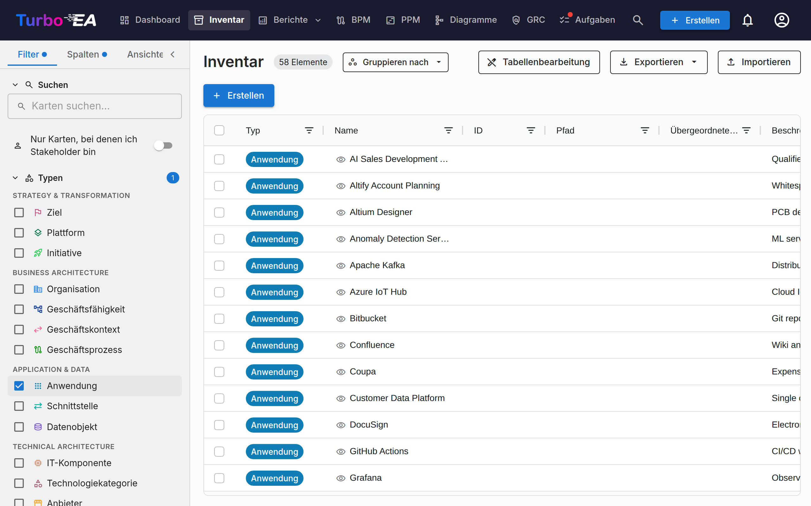
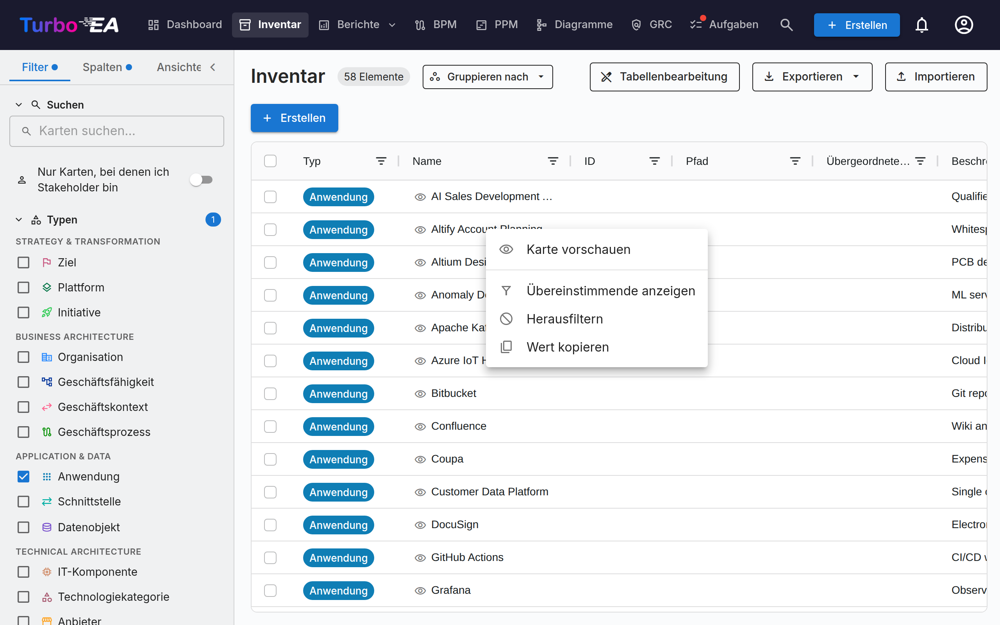
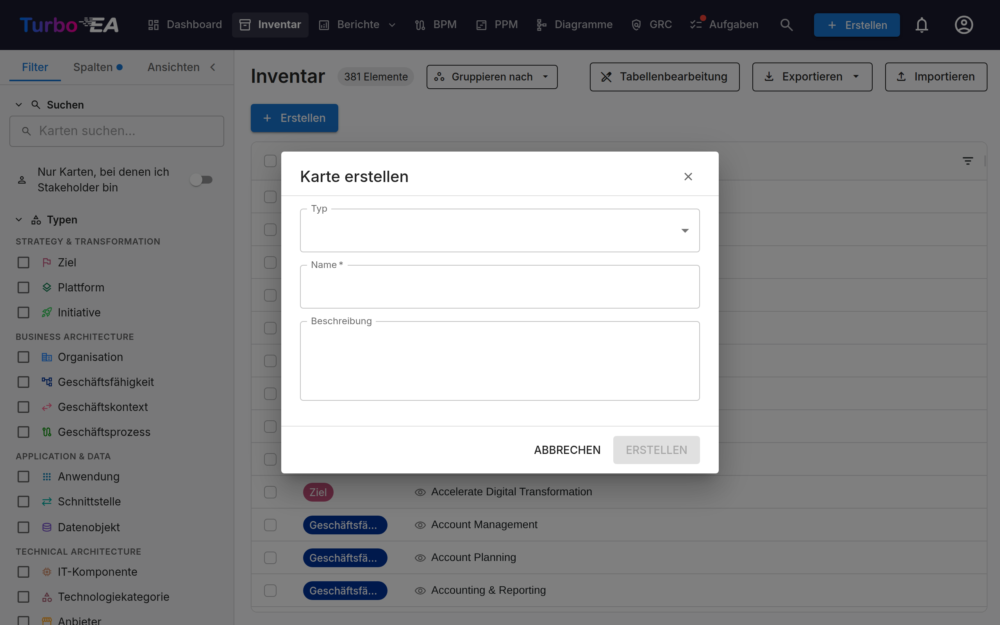

# Inventar

Das **Inventar** ist das Herzstück von Turbo EA. Hier werden alle **Karten** (Komponenten) der Unternehmensarchitektur aufgelistet: Anwendungen, Prozesse, Geschäftsfähigkeiten, Organisationen, Anbieter, Schnittstellen und mehr.

## Aufbau des Inventarbildschirms

### Linkes Filterpanel

Das linke Seitenpanel ermöglicht es Ihnen, Karten nach verschiedenen Kriterien zu **filtern**:

- **Suche** — Freitextsuche über Kartennamen, schon ab dem ersten Buchstaben. Die besten Treffer stehen oben: exakte Namen, dann Namen, die mit Ihrer Eingabe beginnen, dann Namen, in denen sie ein Wort beginnt, dann der Rest. Jedes Suchfeld in Turbo EA sortiert so — die globale Suche (**Strg+K** / **⌘K**), jede Kartenauswahl, das Risikoregister, Entscheidungen und veröffentlichte Portale — sofern Sie keine eigene Sortierung gewählt haben, die immer Vorrang hat
- **Typen** — Filtern nach einem oder mehreren Kartentypen: Ziel, Plattform, Initiative, Organisation, Geschäftsfähigkeit, Geschäftskontext, Geschäftsprozess, Anwendung, Schnittstelle, Datenobjekt, IT-Komponente, Technologiekategorie, Anbieter, System
- **Subtypen** — Wenn ein Typ ausgewählt ist, können Sie weiter nach Subtyp filtern (z.B. Anwendung -> Geschäftsanwendung, Microservice, AI Agent, Deployment)
- **Genehmigungsstatus** — Entwurf, Genehmigt, Ungültig oder Abgelehnt
- **Lebenszyklus** — Filtern nach Lebenszyklusphase: Planung, Einführung, Aktiv, Auslauf, Lebensende
- **Datenqualität** — Filtern nach Band (Mehrfachauswahl): Vollständig (≥80%), Teilweise (40–79%), Minimal (unter 40%). Dieselben Bänder wie im [Datenqualitätsbericht](reports.md#data-quality-report) — ein Klick auf ein Balkensegment dort führt hierher.
- **Verwaist** — Nur Karten ohne Beziehung in beide Richtungen. Serverseitig ausgewertet und daher auch ohne ausgewählten Kartentyp nutzbar.
- **Veraltet** — Nur Karten, die seit 90 Tagen nicht aktualisiert wurden. Beide entsprechen den KPI-Kacheln des [Datenqualitätsberichts](reports.md#data-quality-report) — ein Klick auf eine Kachel führt hierher.
- **Tags** — Filtern nach Tags aus beliebigen Tag-Gruppen
- **Beziehungen** — Filtern nach verwandten Karten über Beziehungstypen
- **Benutzerdefinierte Attribute** — Filtern nach Werten in benutzerdefinierten Feldern (Textsuche, Auswahloptionen)
- **Nur archivierte anzeigen** — Umschalter zur Anzeige archivierter (weich gelöschter) Karten
- **Alle zurücksetzen** — Alle aktiven Filter auf einmal zurücksetzen

> **Karten ohne Wert finden.** Die Filter für Untertyp, Lebenszyklus, Tags, Beziehungen und Auswahl-Attribute bieten jeweils eine Option **(leer)**. Wählen Sie sie, um nur Karten anzuzeigen, die für dieses Feld *keinen* Wert haben – zum Beispiel alle Karten ohne festgelegten Lebenszyklus. Sie lässt sich mit normalen Werten (Treffer bei einem davon) und über mehrere Filter hinweg (Treffer bei allen) kombinieren.

Ein **Badge mit der Anzahl aktiver Filter** zeigt an, wie viele Filter derzeit angewendet werden.

### Zellenaktionen

Klicken Sie mit der rechten Maustaste auf eine beliebige Zelle im Raster (langes Drücken auf Touch-Geräten), um ein Kontextmenü mit Schnellaktionen für das zu öffnen, was sich unter dem Mauszeiger befindet, ähnlich wie in ServiceNow:

- **Karte vorschauen** — die Karte, die die Zelle benennt, im Seitenbereich öffnen, ohne das Raster zu verlassen
- **Übereinstimmende anzeigen** — nur die Zeilen behalten, deren Wert dem der angeklickten Zelle entspricht
- **Herausfiltern** — die Zeilen ausblenden, deren Wert dem der angeklickten Zelle entspricht
- **Wert kopieren** — den Zellentext in die Zwischenablage kopieren
- **Spaltenfilter löschen** — den Filter dieser Spalte entfernen (nur sichtbar, solange einer aktiv ist)

Bei mehrwertigen Zellen (Tags, Relationen, Stakeholder, Mehrfachauswahl-Attribute) listet das Menü zunächst die einzelnen Werte auf, sodass Sie nach einem davon oder nach der gesamten Zelle filtern können. **Karte vorschauen** erscheint bei jeder Zelle, die eine Karte benennt — der Spalte **Name** (die Karte der Zeile selbst), der Spalte **Übergeordnet** und den Relationsspalten — und wenn die Zelle mehrere Karten benennt, listet das Menü sie genauso auf, sodass Sie die zu öffnende auswählen. Diese Filter landen in den Spaltenfiltern des Rasters: Sie kombinieren sich mit den Seitenleistenfiltern, zählen in die Schaltfläche **Filter löschen** der Werkzeugleiste und werden mit Ihrer Ansicht gespeichert. Dasselbe Menü ist in jedem Raster von Turbo EA verfügbar — Entscheidungen, Risikoregister, Compliance und die Admin-Raster. Wenn die Spalte einen passenden Filter im linken Panel hat — Kartentyp, Subtyp, Lebenszyklus, Genehmigungsstatus oder ein Einfachauswahl-Attribut —, wählt **Übereinstimmende anzeigen** diesen Wert auch im Panel aus, und **Löschen** löscht beides, sodass eine gespeicherte Ansicht nie einen Panel-Filter und einen Spaltenfilter enthalten kann, die sich widersprechen. Wird der Filter danach im Panel bearbeitet, übernimmt dieser einfach.

### Registerkarte Spalten

Die Registerkarte **Spalten** im Seitenbereich ermöglicht es Ihnen, zusätzliche Spalten im Raster ein- und auszublenden. Die verfügbaren Spalten ändern sich dynamisch basierend auf den ausgewählten Kartentypen:

- **Ein Typ ausgewählt** — Alle für diesen Typ definierten Attributfelder sind verfügbar, plus Beziehungsspalten und Metadatenspalten
- **Mehrere Typen ausgewählt** — Nur Felder, die **allen ausgewählten Typen gemeinsam** sind, stehen zur Verfügung
- **Kein Typ ausgewählt** — Ein Hinweis fordert Sie auf, zuerst einen Kartentyp auszuwählen

Spalten sind in fünf Kategorien gruppiert:

| Kategorie | Beschreibung |
|-----------|-------------|
| **Standardspalten** | Immer aktive Spalten: Typ, Name, Pfad, Beschreibung, Untertyp, Lebenszyklus, Genehmigungsstatus, Datenqualität. Heben Sie eine davon ab, um sie aus dem Raster auszublenden — nützlich, um eine gespeicherte Ansicht auf genau die Spalten zu reduzieren, die Sie wirklich verwenden. |
| **Metadaten** | Erstellt, Geändert, Erstellt von, Geändert von |
| **Attribute** | Im Metamodell definierte benutzerdefinierte Felder (Text, Zahl, Kosten, Datum, Auswahl usw.) |
| **Beziehungen** | Verknüpfte Kartentypen (z. B. Anwendungen, die mit einer Geschäftsfähigkeit verknüpft sind) |
| **Stakeholder** | Eine Spalte pro Stakeholder-Rolle des ausgewählten Kartentyps (z. B. *Stakeholder: Responsible*) mit den zugewiesenen Benutzern als Chips. Im Raster-Bearbeitungsmodus können Sie per Doppelklick Benutzer für die Rolle direkt im Raster zuweisen oder entfernen (erfordert die Berechtigung zum Verwalten von Stakeholdern). |

Die Spalte **Übergeordnetes Element** zeigt nur die direkt darüberliegende Karte, während **Pfad** die gesamte Kette anzeigt. Doppelklicken Sie im Tabellenbearbeitungsmodus auf eine solche Zelle, um die Karte zu verschieben, oder leeren Sie das Feld, um sie auf die oberste Ebene zu setzen. Die Spalte ist nur bearbeitbar, wenn die Tabelle auf einen einzelnen Kartentyp mit Hierarchie gefiltert ist. Wird eine Verschiebung abgelehnt — weil sie eine Schleife erzeugen würde, mit einer gleichnamigen Karte unter dem Ziel kollidiert oder die maximale Hierarchietiefe überschreitet —, erscheint die Begründung am unteren Bildschirmrand und die Zelle wird zurückgesetzt.

Die Spalte **Pfad** zeigt den Hierarchie-Pfad der Karte (z. B. `Nordamerika / Vertrieb / Innendienst`) ohne den Namen der Karte selbst, sodass Sie Name und Pfad gleichzeitig anzeigen können.

Jede Kategorie hat ein Kontrollkästchen **Alle auswählen**, um alle Spalten in dieser Gruppe schnell umzuschalten. Ein Suchfeld oben ermöglicht es, bestimmte Spalten nach Namen zu finden. Das Badge in jeder Abschnittsüberschrift zeigt an, wie viele Spalten aus dieser Gruppe derzeit sichtbar sind.

Wenn ein Kartentyp zum ersten Mal ausgewählt wird, werden **alle Attribut- und Beziehungsspalten standardmäßig aktiviert**. Sie können dann nicht benötigte Spalten abwählen. Eine Schaltfläche **Zurücksetzen** am unteren Rand der Registerkarte «Spalten» stellt die Standard-Spaltenauswahl wieder her.

Ein **Änderungsindikator-Punkt** erscheint auf der Überschrift der Registerkarte «Spalten», wenn die Spaltenauswahl von den Standardeinstellungen abweicht. Der gleiche Indikator erscheint auf der Registerkarte **Filter**, wenn Filter aktiv sind, sodass Sie auf einen Blick erkennen können, welche Einstellungen geändert wurden.

Ihre Spaltenauswahl, das **Spaltenlayout** (Reihenfolge von links nach rechts, Breiten und angeheftete Spalten), aktiven Filter und die Sortierreihenfolge werden **automatisch im Browser gespeichert**. Wenn Sie zur Inventarseite zurückkehren, wird Ihre vorherige Konfiguration wiederhergestellt. Gespeicherte Ansichten (Lesezeichen) bewahren dieses vollständige Layout ebenfalls, sodass beim Wechseln zwischen Ansichten genau die von Ihnen konfigurierten Spalten — und in derselben Anordnung — wiederhergestellt werden, was beim Teilen einer aufgeräumten Ansicht mit Stakeholdern wichtig ist.

### Haupttabelle

Das Inventar verwendet eine **AG Grid**-Datentabelle mit leistungsstarken Funktionen:

| Spalte | Beschreibung |
|--------|-------------|
| **Typ** | Kartentyp mit farbcodiertem Symbol |
| **Name** | Komponentenname (klicken zum Öffnen der Kartendetails) |
| **Beschreibung** | Kurzbeschreibung |
| **Lebenszyklus** | Aktueller Lebenszyklusstatus |
| **Genehmigungsstatus** | Badge des Prüfstatus |
| **Datenqualität** | Vollständigkeitsprozentsatz mit visuellem Ring |
| **Beziehungen** | Namen der verwandten Karten, alphabetisch sortiert, mit klickbarem Popover zum Hinzufügen oder Entfernen von Beziehungen — bereits verknüpfte Karten werden in dessen Auswahlliste ausgeblendet |

**Tabellenfunktionen:**

- **Sortierung** — Klicken Sie auf eine Spaltenüberschrift zum auf-/absteigenden Sortieren
- **Inline-Bearbeitung** — Im Rasterbearbeitungsmodus können Feldwerte direkt in der Tabelle bearbeitet werden
- **Spalte nach unten füllen** — Klicken Sie im Rasterbearbeitungsmodus auf eine Zelle und ziehen Sie das kleine Quadrat an ihrer Ecke nach oben oder unten, um den Wert in alle überstrichenen Zeilen zu kopieren. Vor dem Speichern nennt eine Bestätigung Spalte, Wert und Zeilenanzahl; lehnt der Server eine Zeile ab, wird sie mit Begründung und Link aufgeführt, und die erfolgreichen Zeilen bleiben gespeichert. Die Geste funktioniert mit dem Finger ebenso wie mit der Maus und mit der Tastatur — Quadrat fokussieren, mit den Pfeiltasten erweitern, mit Eingabe bestätigen. Gefüllt werden nur die nach Filtern und Sortierung sichtbaren Zeilen; die Spalte Name ist bewusst ausgenommen, damit keine Karten denselben Namen erhalten.
- **Mehrfachauswahl** — Mehrere Zeilen für Massenoperationen auswählen
- **Hierarchieanzeige** — Eltern-/Kind-Beziehungen werden als Brotkrumenpfade dargestellt
- **Spaltenkonfiguration** — Spalten ein-/ausblenden und neu anordnen
- **Spalte fixieren** — Fahren Sie mit der Maus über eine Spaltenüberschrift und klicken Sie auf das Pin-Symbol, um die Spalte am linken Rand zu fixieren, sodass sie beim seitlichen Scrollen sichtbar bleibt. Ein erneuter Klick auf den Pin löst sie wieder. Jede Spalte trägt denselben Pin auch im Tab **Spalten** des Filterbereichs, sodass Sie eine Spalte fixieren können, ohne ihre Überschrift zu suchen. Fixierte Spalten werden pro Tabelle gespeichert, und dasselbe Bedienelement steht in jeder Datentabelle von Turbo EA zur Verfügung (Risikoregister, Entscheidungen, Compliance-Befunde, Benutzer, Ressourcen, Audit-Log).
- **Spalten neu anordnen** — Ziehen Sie eine Spaltenüberschrift, um die Spalte zu verschieben, oder öffnen Sie den Abschnitt **Spaltenreihenfolge** oben im Tab **Spalten** und ziehen Sie eine Zeile an ihrem Griff. Diese Liste *ist* die Reihenfolge der Tabelle, beide stimmen also immer überein, und fixierte Spalten stehen als eigene Gruppe voran, weil sie stets am Anfang angezeigt werden — lösen Sie dort den Pin einer Spalte, wenn Sie sie aus dieser Gruppe herausbewegen möchten. Der Griff funktioniert auch mit der Tastatur (Leertaste zum Aufnehmen, Pfeiltasten zum Verschieben, Leertaste zum Ablegen) und per Touch, sodass sich die Reihenfolge auch am Smartphone ändern lässt. Ihre Spaltenreihenfolge wird pro Tabelle gespeichert, in jeder Datentabelle von Turbo EA.

### Werkzeugleiste

- **Rasterbearbeitung** — Inline-Bearbeitungsmodus zum Bearbeiten mehrerer Karten in der Tabelle umschalten
- **Export** — Daten als Excel-Datei (.xlsx) herunterladen
- **Import** — Daten aus Excel-Dateien massenweise hochladen
- **+ Erstellen** — Eine neue Karte erstellen

## Wie man eine neue Karte erstellt

1. Klicken Sie auf die Schaltfläche **+ Erstellen** (blau, rechte obere Ecke)
2. Im angezeigten Dialog:
   - Wählen Sie den **Typ** der Karte (Anwendung, Prozess, Ziel usw.)
   - Geben Sie den **Namen** der Komponente ein
   - Optional: Fügen Sie eine **Beschreibung** hinzu
3. Optional: Klicken Sie auf **Mit KI vorschlagen**, um automatisch eine Beschreibung zu generieren (siehe [KI-Beschreibungsvorschläge](#ki-beschreibungsvorschläge) unten)
4. Klicken Sie auf **ERSTELLEN**

## Massenbearbeitung { #mass-edit }

Wählen Sie über die Kontrollkästchen in der linken Spalte zwei oder mehr Zeilen aus und klicken Sie dann in der Auswahlleiste auf **Massenbearbeitung**. Der Dialog wendet eine Änderung auf jede ausgewählte Karte an.

Das Dropdown **Feld** gruppiert die Änderungsmöglichkeiten:

- **Allgemein** — Freigabestatus, Untertyp, Tags und übergeordnetes Element
- **Attribute** — jedes bearbeitbare Feld des ausgewählten Kartentyps
- **Beziehungen** — ein Eintrag je Beziehungstyp und Richtung (zum Beispiel *läuft auf → IT-Komponente*)

Tags, Beziehungen und das übergeordnete Element bieten jeweils einen Umschalter **Hinzufügen / Entfernen**, sodass Sie vorhandene Werte ergänzen oder reduzieren, statt sie zu ersetzen.

Das Eingabeelement richtet sich nach dem Feldtyp: Ein Mehrfachauswahlfeld zeigt seine Optionen mit Kontrollkästchen, ein Ja/Nein-Feld einen Schalter, ein Datumsfeld eine Datumsauswahl. Bleibt der Wert leer, wird das Feld auf allen ausgewählten Karten geleert. Per Formel berechnete Felder sowie Kostenfelder, für die Ihnen die Leseberechtigung fehlt, werden nicht angeboten.

### Hierarchie umstrukturieren { #mass-edit-parent }

Das Feld **Übergeordnetes Element** erscheint, sobald Sie die Tabelle auf einen einzelnen Kartentyp mit Hierarchie gefiltert haben. Eine Karte hat genau ein übergeordnetes Element, daher deckt dieses eine Feld beide Richtungen einer Umstrukturierung ab:

- **Übergeordnetes Element festlegen** — wählen Sie eine Karte desselben Typs; alle ausgewählten Karten werden darunter eingeordnet. So machen Sie viele Karten zu untergeordneten Elementen einer Karte.
- **Übergeordnetes Element entfernen** — alle ausgewählten Karten werden auf die oberste Ebene verschoben.

Die Karten werden einzeln verschoben; ein unzulässiger Vorgang blockiert daher nur die betroffene Karte. Der Dialog bleibt geöffnet und listet auf, welche Karten blockiert wurden und warum. Die häufigsten Gründe sind:

- Unter dem Zielelement existiert bereits eine Karte mit demselben Namen.
- Das gewählte übergeordnete Element ist ein Nachfahre einer der verschobenen Karten, was eine Schleife erzeugen würde.
- Der Vorgang würde eine Geschäftsfähigkeit über die maximal fünf Ebenen hinaus verschieben.

Eine Karte nimmt ihre untergeordneten Elemente mit, und freigegebene Karten fallen auf **Ungültig** zurück, damit die Änderung erneut geprüft wird.

## Inventar gruppieren { #group-by }

Klicken Sie in der Symbolleiste auf **Gruppieren nach** (neben der Trefferanzahl), um das Raster in ein- und ausklappbare Gruppen zu gliedern. Lebenszyklusphase und Genehmigungsstatus sind immer verfügbar; ist das Raster auf einen einzelnen Kartentyp gefiltert, kommen dessen Untertyp und alle Einfachauswahl-Attribute hinzu.

- Karten ohne Wert im gewählten Feld landen in einer Gruppe **Nicht gesetzt** ganz oben — dem natürlichen Sammelbecken für noch nicht klassifizierte Karten.
- Ein Klick auf eine Gruppenüberschrift klappt die Gruppe ein oder aus. Die Überschrift zeigt die Anzahl der Karten der Gruppe.
- Beim Scrollen durch eine lange Gruppe bleibt deren Überschrift direkt unter den Spaltenköpfen stehen, sodass immer klar ist, welche Gruppe man gerade liest; die Überschrift der nächsten Gruppe schiebt sie beim Erreichen zur Seite. Es ist die vollständige Überschrift samt Kontrollkästchen — eine lange Gruppe lässt sich also auswählen, ohne an ihren Anfang zurückzuscrollen.
- Das Kontrollkästchen in der Überschrift wählt alle Karten der Gruppe aus. Eine Neuklassifizierung im Stapel ist damit: **Nicht gesetzt** aufklappen, Überschrift anhaken, dann den Wert per [Massenbearbeitung](#mass-edit) setzen. Auf Drag-and-drop wurde bewusst verzichtet — Auswählen und Setzen funktioniert auf Desktop, Tablet und Smartphone gleich.
- Die Sortierung wirkt innerhalb jeder Gruppe; die Gruppierung bleibt über Neuladen erhalten, wird in gespeicherten Ansichten abgelegt und lässt sich über den URL-Parameter `group_by` teilen.

## KI-Beschreibungsvorschläge { #ai-description-suggestions }

Turbo EA kann **KI verwenden, um eine Beschreibung** für jede Karte zu generieren. Dies funktioniert sowohl im Karte-erstellen-Dialog als auch auf bestehenden Kartendetailseiten.

**So funktioniert es:**

1. Geben Sie einen Kartennamen ein und wählen Sie einen Typ
2. Klicken Sie auf das **Funkensymbol** in der Kartenüberschrift oder auf die Schaltfläche **Mit KI vorschlagen** im Karte-erstellen-Dialog
3. Das System führt eine **Websuche** nach dem Elementnamen durch (mit typbezogenem Kontext — z.B. «SAP S/4HANA Softwareanwendung»), sendet die Ergebnisse dann an ein **LLM**, um eine prägnante, sachliche Beschreibung zu generieren
4. Ein Vorschlagspanel erscheint mit:
   - **Bearbeitbarer Beschreibung** — Text vor dem Anwenden überprüfen und ändern
   - **Konfidenzwert** — zeigt an, wie sicher die KI ist (Hoch / Mittel / Niedrig)
   - **Klickbare Quellenlinks** — die Webseiten, aus denen die Beschreibung abgeleitet wurde
   - **Modellname** — welches LLM den Vorschlag generiert hat
5. Klicken Sie auf **Beschreibung übernehmen** zum Speichern oder **Verwerfen** zum Ablehnen

**Wesentliche Eigenschaften:**

- **Typbezogen**: Die KI versteht den Kartentyp-Kontext. Eine «Anwendung»-Suche fügt «Softwareanwendung» hinzu, eine «Anbieter»-Suche fügt «Technologieanbieter» hinzu usw.
- **Datenschutz zuerst**: Bei Verwendung von Ollama läuft das LLM lokal — Ihre Daten verlassen nie Ihre Infrastruktur. Kommerzielle Anbieter (OpenAI, Google Gemini, Anthropic Claude usw.) werden ebenfalls unterstützt
- **Vom Administrator gesteuert**: KI-Vorschläge müssen von einem Administrator in [Einstellungen > KI-Vorschläge](../admin/ai.md) aktiviert werden. Administratoren wählen, welche Kartentypen die Vorschlagsschaltfläche anzeigen, konfigurieren den LLM-Anbieter und wählen den Websuchanbieter
- **Berechtigungsbasiert**: Nur Benutzer mit der Berechtigung `ai.suggest` können diese Funktion nutzen (standardmäßig für Admin-, BPM-Admin- und Mitglieder-Rollen aktiviert)

## Gespeicherte Ansichten (Lesezeichen)

Sie können Ihre aktuelle Filter-, Spalten- und Sortierkonfiguration als **benannte Ansicht** zur schnellen Wiederverwendung speichern.

### Eine gespeicherte Ansicht erstellen

1. Konfigurieren Sie das Inventar mit Ihren gewünschten Filtern, Spalten und Sortierungen
2. Klicken Sie auf das **Lesezeichen**-Symbol im Filterpanel
3. Geben Sie einen **Namen** für die Ansicht ein
4. Wählen Sie die **Sichtbarkeit**:
   - **Privat** — Nur Sie können sie sehen
   - **Geteilt** — Sichtbar für bestimmte Benutzer (mit optionalen Bearbeitungsrechten)
   - **Öffentlich** — Sichtbar für alle Benutzer

### Gespeicherte Ansichten verwenden

Gespeicherte Ansichten erscheinen in der Seitenleiste des Filterpanels. Klicken Sie auf eine beliebige Ansicht, um deren Konfiguration sofort anzuwenden. Ansichten sind unterteilt in:

- **Meine Ansichten** — Von Ihnen erstellte Ansichten
- **Mit mir geteilt** — Ansichten, die andere mit Ihnen geteilt haben
- **Öffentliche Ansichten** — Ansichten, die für alle verfügbar sind

## Excel-Import / -Export { #excel-import }

Inventar-Exporte und -Importe nutzen eine **mehrblättrige Excel-Arbeitsmappe**, die Ihre Landschaft samt Beziehungen vollständig zurück- und wieder einlesen kann — ohne dass Sie jemals eine UUID kopieren müssen.

### Aufbau der Arbeitsmappe

- **Ein Blatt pro Kartentyp** (Application, Business Capability, IT Component, …) mit Kernspalten, `attr_<feld>`-Spalten, Lebenszyklusspalten und `rel:<beziehungstyp>`-Beziehungsspalten sowie `stakeholder:<rollen_key>`-Stakeholder-Spalten.
- **Ein `Relations`-Blatt** für Beziehungstypen, die Attribute tragen (z. B. Kosten, Beschreibung). Einfache Beziehungen werden inline auf dem Kartenblatt abgebildet.
- **Ein `_Meta`-Blatt** mit der Formatversion der Arbeitsmappe.

### Karten ohne GUIDs identifizieren

Karten werden über den **Namen** identifiziert, sofern dieser innerhalb des Typs eindeutig ist, ansonsten über den vollen **`parent_path`**. Eine Beziehungszelle kann z. B. `NexaCore ERP` direkt enthalten, wenn nur eine Application diesen Namen trägt; bei mehrdeutigem Namen verwenden Sie `Sales / Customer Mgmt / CRM`.

#### Eindeutigkeit unter Geschwistern

Da Karten über Name + Pfad identifiziert werden, **dürfen zwei Karten desselben Typs nicht gleichzeitig denselben Elternknoten und denselben Namen haben**. Neue Karten, die eine solche Kollision erzeugen würden, werden bei der Erstellung abgelehnt (im Dialog "Karte erstellen", beim Inline-Umbenennen und beim Tabellenkalkulations-Import). Bereits in der Datenbank vorhandene Duplikate aus früheren Seeds oder Importen bleiben unberührt — Sie können alle ihre Felder bearbeiten, aber das erneute Erzeugen oder Zurückbenennen in den Kollisionszustand wird blockiert. Die Prüfung ist groß-/kleinschreibungs- und whitespace-unempfindlich, passend zum Resolver des Importers. Lehnt der Dialog "Karte erstellen" ein Duplikat ab, nennt die Warnung die vorhandene Karte und enthält einen Link **Vorhandene Karte anzeigen**, der Sie direkt dorthin führt.

### Inline-Beziehungszellen

Auf jedem Kartenblatt drücken `rel:<beziehungstyp>`-Spalten ausgehende Beziehungen als **semikolongetrennte** Zielreferenzen aus (z. B. `NexaCore ERP; BillingApp`). Semikolons statt Kommas, weil Kartennamen häufig Kommas enthalten (etwa `Acme, Inc.`). `/` und `\` innerhalb eines Namens werden als `\/` bzw. `\\` maskiert — der Exporter erledigt das automatisch (z. B. `SAP S/4HANA` → `SAP S\/4HANA`). Zellen sind **deklarativ**: Der Inhalt ersetzt die vollständige Menge ausgehender Beziehungen dieses Typs vom Quellobjekt. Wird ein Ziel aus der Liste entfernt, wird die Beziehung gelöscht; eine leere Zelle löscht alle. Aus Kompatibilitätsgründen werden auch kommagetrennte Zellen (älteres Format) akzeptiert.

### Stakeholder-Zellen

Auf jedem Kartenblatt enthalten `stakeholder:<rollen_key>`-Spalten die den Stakeholder-Rollen zugewiesenen Benutzer als **semikolongetrennte E-Mail-Adressen** (dieselbe Konvention wie LeanIX' `subscriptions:<RoleType>`-Spalten), z. B. `ada@corp.com; bob@corp.com`. Die **E-Mail-Adresse ist die einzige akzeptierte Benutzerreferenz** — Anzeigenamen können kollidieren und werden nie zum Abgleich verwendet; ein Eintrag der Form `Name <email>` wird toleriert (die E-Mail in spitzen Klammern zählt), ein bloßer Anzeigename erzeugt eine Warnung und wird übersprungen. Wie Beziehungszellen sind Stakeholder-Zellen **deklarativ pro Rolle**: Die aufgeführten Benutzer werden nach dem Import zur vollständigen Zuweisungsmenge dieser Rolle. Das Entfernen eines Benutzers hebt die Zuweisung auf; eine leere Zelle leert die Rolle; das Weglassen der Spalte lässt die Zuweisungen unberührt. Einträge ohne passenden Benutzer erzeugen eine Warnung und werden übersprungen — sie blockieren den Import nie.

!!! note "Vor der camelCase-Umstellung exportierte Tabellen"
    Stakeholder-Rollenschlüssel folgen derselben camelCase-Konvention wie alle anderen Metamodell-Schlüssel. Eine zuvor exportierte Tabelle enthält Spalten wie `stakeholder:technical_application_owner`; diese lassen sich weiterhin importieren — der Spaltenkopf wird der camelCase-Rolle zugeordnet, wenn keine Rolle wörtlich passt. Neu exportierte Tabellen verwenden die camelCase-Form.

### `Relations`-Blatt

Für Beziehungen mit Attributen (z. B. jährliche Kosten) verwenden Sie das dedizierte `Relations`-Blatt mit den Spalten `relation_type`, `source_ref`, `target_ref`, `action` (Standard `upsert`, alternativ `delete`), `attr_<feld>` und `description`.

### Importieren

Klicken Sie in der Werkzeugleiste auf **Import**, ziehen Sie die Arbeitsmappe in den Dialog und prüfen Sie die Vorschau, bevor Sie anwenden. Sie sehen sowohl die zu erzeugenden/aktualisierenden Karten als auch die hinzuzufügenden/zu entfernenden Beziehungen. Fehler (z. B. mehrdeutige Beziehungsziele mit Kandidatenpfaden) blockieren das Anwenden.

Ein paar Hinweise zum Importieren:

- **Zum Anlegen einer Karte sind nur `name` und `type` erforderlich.** Im Metamodell als *erforderlich* markierte Felder (auch bei Provider oder jedem anderen Typ) blockieren den Import nicht — die Karte wird trotzdem erstellt, und Lücken schlagen sich in der Datenqualitätsbewertung nieder, statt zu einem stillen Überspringen zu führen.
- **Ein `/` in der `name`-Spalte einer Karte muss nicht maskiert werden.** Maskierung (`\/` für einen Schrägstrich, `\\` für einen Backslash) ist nur nötig, wenn Sie diese Karte aus einer `parent_path`-, `rel:<key>`-, `source_ref`- oder `target_ref`-Zelle *referenzieren*, wo `/` das Pfadtrennzeichen ist.

### Exportieren

Klicken Sie in der Werkzeugleiste auf **Export**. Der aktuelle Grid-Filter bestimmt den Inhalt: Bei Einzeltyp-Filter ein Blatt für diesen Typ, sonst ein Blatt pro vorhandenem Typ, jeweils zusätzlich mit `Relations` und `_Meta`. Die Datei ist vollständig editierbar und kann ohne Verlust von typspezifischen Attributen wieder importiert werden.

Sie können im Export-Menü auch **Aktuelle Ansicht exportieren** wählen — eine flache Einzelblatt-Momentaufnahme, die genau das Angezeigte abbildet (nur die sichtbaren Spalten, in ihrer aktuellen Reihenfolge, für die gefilterten Zeilen). Sie ist zum Teilen gedacht und **nicht für den Reimport geeignet**. Wenn die Beziehungsspalten noch geladen werden, wartet der Export darauf – sie können also nie leer bleiben.
