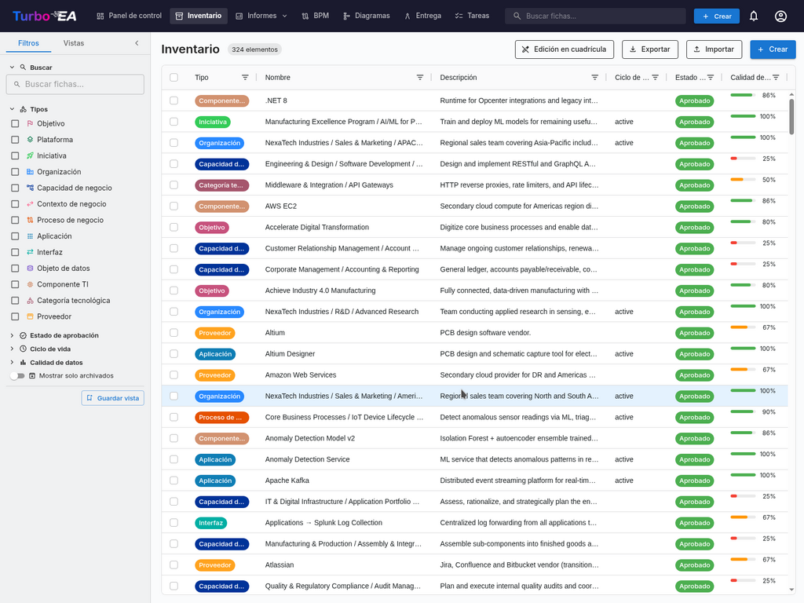
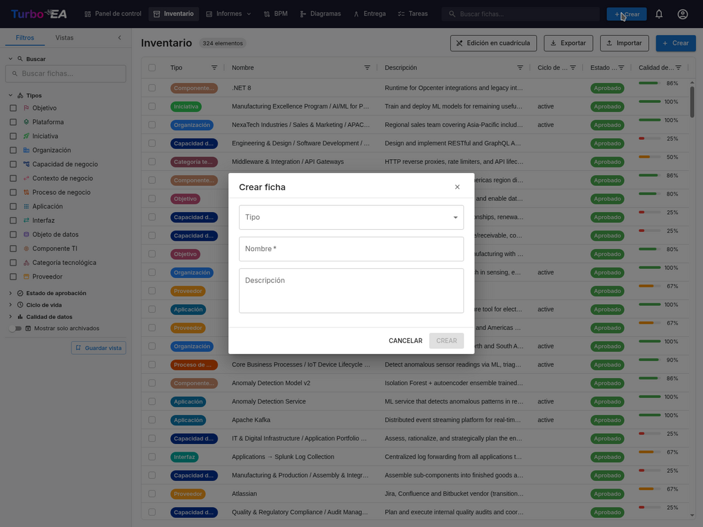

# Inventario

El **Inventario** es el corazón de Turbo EA. Aquí se listan todas las **fichas** (componentes) de la arquitectura empresarial: aplicaciones, procesos, capacidades de negocio, organizaciones, proveedores, interfaces y más.

### Estructura de la Pantalla de Inventario

#### Panel de Filtros (Izquierda)

El panel lateral izquierdo permite **filtrar** las fichas por diferentes criterios:

- **Buscar**: Campo de búsqueda por texto libre
- **Tipos**: Filtrar por tipo de ficha: Objetivo, Plataforma, Iniciativa, Organización, Capacidad de Negocio, Contexto de Negocio, Proceso de Negocio, Aplicación, Interfaz, Objeto de Datos, Componente TI, Categoría Tecnológica, Proveedor
- **Estado de Aprobación**: Filtrar por fichas aprobadas, pendientes o rechazadas
- **Ciclo de Vida**: Filtrar por estado del ciclo de vida (Activo, En Desarrollo, Retirado, etc.)
- **Calidad de Datos**: Filtrar por nivel de completitud de datos
- **Mostrar solo archivados**: Opción para ver fichas archivadas
- **Guardar vista**: Guardar configuraciones de filtros para reutilizarlas

#### Tabla Principal (Centro)

| Columna | Descripción |
|---------|-------------|
| **Tipo** | Categoría de la ficha (con código de color) |
| **Nombre** | Nombre del componente |
| **Descripción** | Descripción breve del componente |
| **Ciclo de vida** | Estado actual (activo, retirado, etc.) |
| **Estado de aprobación** | Si ha sido aprobado por los responsables |
| **Calidad de datos** | Porcentaje de completitud (barra de progreso) |

#### Barra de Herramientas (Superior Derecha)

- **Edición en cuadrícula**: Editar múltiples fichas simultáneamente en modo tabla
- **Exportar**: Descargar datos en formato Excel
- **Importar**: Carga masiva de datos desde archivos Excel
- **+ Crear**: Crear una nueva ficha

### Cómo Crear una Nueva Ficha

1. Haga clic en el botón **+ Crear** (azul, esquina superior derecha)
2. En el diálogo que aparece:
   - Seleccione el **Tipo** de ficha (Aplicación, Proceso, Objetivo, etc.)
   - Ingrese el **Nombre** del componente
   - Opcionalmente, agregue una **Descripción**
3. Opcionalmente, haga clic en **Sugerir con IA** para generar una descripción automáticamente (consulte [Sugerencias de Descripción con IA](#sugerencias-de-descripcion-con-ia) a continuación)
4. Haga clic en **CREAR**

### Sugerencias de Descripción con IA

Turbo EA puede usar **IA para generar una descripción** para cualquier ficha. Esto funciona tanto en el diálogo de creación como en las páginas de detalle de fichas existentes.

**Cómo funciona:**

1. Ingrese un nombre de ficha y seleccione un tipo
2. Haga clic en el **icono de destello** (✨) en el encabezado de la ficha, o en el botón **Sugerir con IA** en el diálogo de creación
3. El sistema realiza una **búsqueda web** del nombre del elemento (usando contexto según el tipo — por ejemplo, «SAP S/4HANA software application»), y luego envía los resultados a un **LLM local** (Ollama) para generar una descripción concisa y factual
4. Aparece un panel de sugerencias con:
   - **Descripción editable** — revise y modifique el texto antes de aplicarlo
   - **Puntuación de confianza** — indica qué tan segura está la IA (Alta / Media / Baja)
   - **Enlaces a fuentes** — las páginas web de las que se extrajo la descripción
   - **Nombre del modelo** — qué LLM generó la sugerencia
5. Haga clic en **Aplicar descripción** para guardar, o **Ignorar** para descartar

**Características principales:**

- **Consciente del tipo**: La IA entiende el contexto del tipo de ficha. Una búsqueda de «Aplicación» agrega «software application», un «Proveedor» agrega «technology vendor», una «Organización» agrega «company», etc.
- **Privacidad primero**: El LLM se ejecuta localmente vía Ollama — sus datos nunca salen de su infraestructura
- **Controlado por administradores**: Las sugerencias de IA deben ser habilitadas por un administrador en Configuración → IA Cards. Los administradores pueden elegir qué tipos de fichas muestran el botón de sugerencia, configurar la URL del proveedor de LLM y el modelo, y seleccionar el proveedor de búsqueda web (DuckDuckGo, Google Custom Search o SearXNG)
- **Basado en permisos**: Solo los usuarios con el permiso `ai.suggest` pueden usar esta función (habilitado por defecto para los roles Admin, BPM Admin y Miembro)
6. Haga clic en **CREAR**
