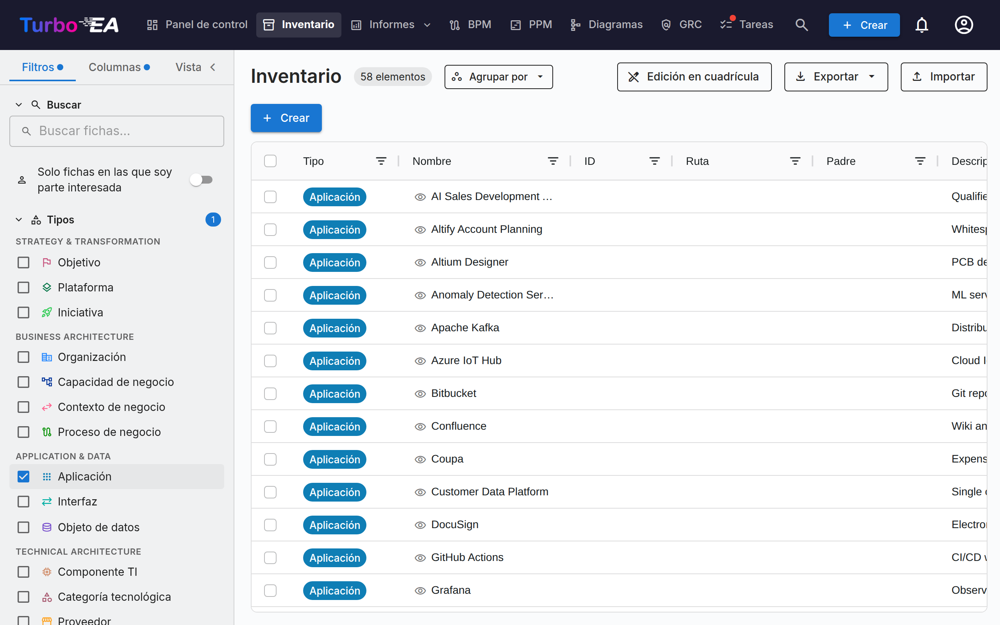
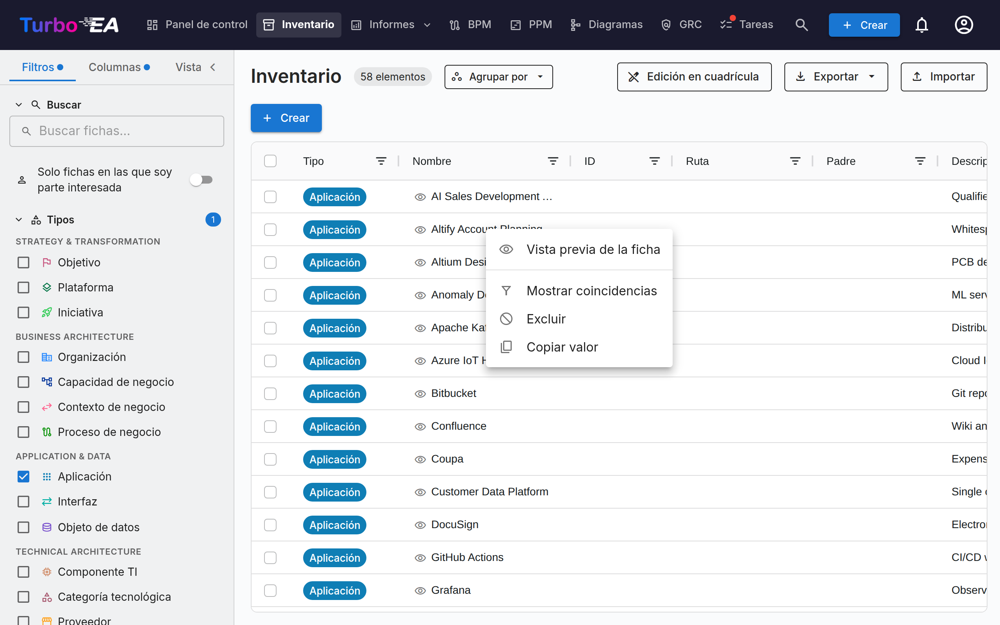
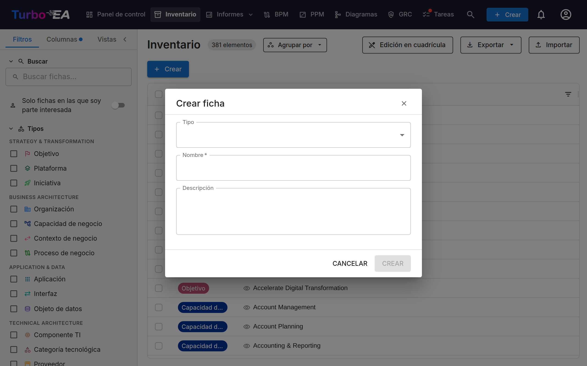

# Inventario

El **Inventario** es el corazón de Turbo EA. Aquí se listan todas las **fichas** (componentes) de la arquitectura empresarial: aplicaciones, procesos, capacidades de negocio, organizaciones, proveedores, interfaces y más.

## Estructura de la Pantalla de Inventario

### Panel de Filtros (Izquierda)

El panel lateral izquierdo permite **filtrar** las fichas por diferentes criterios:

- **Buscar** — Búsqueda de texto libre en los nombres de las tarjetas, desde la primera letra. Las mejores coincidencias aparecen primero: nombres exactos, luego los que empiezan por lo que escribió, luego aquellos donde inicia una palabra y después el resto. Todos los campos de búsqueda de Turbo EA ordenan así — la búsqueda global (**Ctrl+K** / **⌘K**), cada selector de tarjetas, el registro de riesgos, las decisiones y los portales publicados — salvo que haya elegido un orden propio, que siempre prevalece
- **Tipos** — Filtrar por uno o más tipos de ficha: Objetivo, Plataforma, Iniciativa, Organización, Capacidad de Negocio, Contexto de Negocio, Proceso de Negocio, Aplicación, Interfaz, Objeto de Datos, Componente TI, Categoría Tecnológica, Proveedor, Sistema
- **Subtipos** — Cuando se selecciona un tipo, permite filtrar por subtipo (por ejemplo, Aplicación → Aplicación de Negocio, Microservicio, Agente IA, Despliegue)
- **Estado de Aprobación** — Borrador, Aprobado, Roto o Rechazado
- **Ciclo de Vida** — Filtrar por fase del ciclo de vida: Plan, Fase de Entrada, Activo, Fase de Salida, Fin de Vida
- **Calidad de Datos** — Filtrado por banda (selección múltiple): Completo (≥80%), Parcial (40–79%), Mínimo (menos del 40%). Son las bandas del [informe de Calidad de datos](reports.md#data-quality-report): al hacer clic en un segmento de barra allí se llega aquí.
- **Huérfanas** — Solo fichas sin ninguna relación, en ningún sentido. Se evalúa en el servidor, por lo que funciona sin seleccionar un tipo de ficha.
- **Desactualizadas** — Solo fichas sin actualizar en los últimos 90 días. Ambas reflejan los mosaicos del [informe de Calidad de datos](reports.md#data-quality-report): al hacer clic en uno se llega aquí.
- **Etiquetas** — Filtrar por etiquetas de cualquier grupo de etiquetas
- **Relaciones** — Filtrar por fichas relacionadas a través de tipos de relación
- **Atributos personalizados** — Filtrar por valores en campos personalizados (búsqueda de texto, opciones de selección)
- **Mostrar solo archivados** — Alternar para ver fichas archivadas (eliminadas temporalmente)
- **Limpiar todo** — Restablecer todos los filtros activos de una vez

> **Encontrar fichas sin valor.** Los filtros de Subtipo, Ciclo de vida, Etiquetas, Relaciones y atributos personalizados de selección incluyen cada uno una opción **(vacío)**. Selecciónela para mostrar solo las fichas que *no* tienen valor en ese campo, por ejemplo todas las fichas sin ciclo de vida definido. Se puede combinar con valores normales (coincide con cualquiera) y entre varios filtros (coincide con todos).

Un **contador de filtros activos** muestra cuántos filtros están aplicados actualmente.

### Acciones de celda

Haga clic derecho en cualquier celda de la cuadrícula (pulsación larga en dispositivos táctiles) para abrir un menú contextual con acciones rápidas sobre lo que hay bajo el cursor, al estilo de ServiceNow:

- **Vista previa de la ficha** — abrir la ficha que nombra la celda en el panel lateral, sin salir de la cuadrícula
- **Mostrar coincidencias** — conservar solo las filas cuyo valor coincide con el de la celda pulsada
- **Excluir** — ocultar las filas cuyo valor coincide con el de la celda pulsada
- **Copiar valor** — copiar el texto de la celda al portapapeles
- **Borrar filtro de columna** — quitar el filtro de esa columna (visible solo mientras haya uno activo)

En una celda con varios valores (etiquetas, relaciones, partes interesadas, atributos de selección múltiple), el menú muestra primero los valores individuales, para filtrar por uno de ellos o por la celda completa. **Vista previa de la ficha** aparece en toda celda que nombra una ficha — la columna **Nombre** (la ficha de la propia fila), la columna **Padre** y las columnas de relaciones — y cuando la celda nombra varias, el menú las lista igual, para que elija cuál abrir. Estos filtros van a los filtros de columna de la cuadrícula: se combinan con los filtros de la barra lateral, cuentan en el botón **Borrar filtros** de la barra de herramientas y se conservan con su vista. El mismo menú está disponible en todas las cuadrículas de Turbo EA — Decisiones, Registro de riesgos, Cumplimiento y las cuadrículas de administración. Cuando la columna tiene un filtro equivalente en el panel izquierdo — tipo de tarjeta, subtipo, ciclo de vida, estado de aprobación o un atributo de selección única —, **Mostrar coincidencias** también selecciona ese valor en el panel, y **Borrar** borra ambos, de modo que una vista guardada nunca puede contener un filtro del panel y un filtro de columna contradictorios. Si después se edita el filtro en el panel, este simplemente toma el control.

### Pestaña Columnas

La pestaña **Columnas** en el panel lateral le permite elegir qué columnas adicionales mostrar en la cuadrícula. Las columnas disponibles cambian dinámicamente según los tipos de tarjetas seleccionados:

- **Un solo tipo seleccionado** — Todos los campos de atributos definidos para ese tipo están disponibles, además de columnas de relaciones y metadatos
- **Varios tipos seleccionados** — Solo los campos que son **comunes a todos los tipos seleccionados** están disponibles
- **Ningún tipo seleccionado** — Un mensaje de ayuda le solicita seleccionar primero un tipo de tarjeta

Las columnas se agrupan en cinco categorías:

| Categoría | Descripción |
|-----------|-------------|
| **Columnas predeterminadas** | Columnas siempre visibles: Tipo, Nombre, Ruta, Descripción, Subtipo, Ciclo de vida, Estado de aprobación, Calidad de datos. Desmárquelas para ocultarlas de la cuadrícula — útil para ajustar una vista guardada solo a las columnas que realmente utiliza. |
| **Metadatos** | Creado, Modificado, Creado por, Modificado por |
| **Atributos** | Campos personalizados definidos en el metamodelo (texto, número, coste, fecha, selección, etc.) |
| **Relaciones** | Tipos de tarjetas relacionados (p. ej., Aplicaciones vinculadas a una Capacidad de Negocio) |
| **Partes interesadas** | Una columna por cada rol de parte interesada definido para el tipo seleccionado (p. ej. *Partes interesadas: Responsible*), mostrando los usuarios asignados como chips. En el modo de edición de cuadrícula, haga doble clic en una celda para asignar o quitar usuarios de ese rol directamente desde la cuadrícula (requiere el permiso de gestión de partes interesadas). |

La columna **Padre** muestra solo la tarjeta situada directamente encima, mientras que **Ruta** muestra la cadena completa. En el modo de edición de la cuadrícula, haga doble clic en una celda Padre para mover la tarjeta, o vacíe el campo para llevarla al nivel superior. La columna solo es editable cuando la cuadrícula está filtrada a un único tipo de tarjeta que admite jerarquía. Si un movimiento se rechaza — porque crearía un bucle, chocaría con una tarjeta del mismo nombre bajo el destino o superaría la profundidad máxima —, el motivo aparece en la parte inferior de la pantalla y la celda se revierte.

La columna **Ruta** muestra la jerarquía de la ficha (p. ej. «América del Norte / Ventas / Ventas internas») sin incluir el nombre de la propia ficha, para que pueda ver Nombre y Ruta a la vez.

Cada categoría tiene una casilla **Seleccionar todo** para activar o desactivar rápidamente todas las columnas de ese grupo. Un campo de búsqueda en la parte superior permite encontrar columnas específicas por nombre. La insignia en cada encabezado de sección muestra cuántas columnas de ese grupo están actualmente visibles.

Cuando se selecciona un tipo de tarjeta por primera vez, **todas las columnas de atributos y relaciones se activan por defecto**. Luego puede desmarcar las columnas que no necesite. Un botón **Restablecer** en la parte inferior de la pestaña «Columnas» restaura la selección de columnas predeterminada.

Un **punto indicador de cambio** aparece en el encabezado de la pestaña «Columnas» cuando la selección de columnas difiere de los valores predeterminados. El mismo indicador aparece en la pestaña **Filtros** cuando hay filtros activos, lo que facilita ver de un vistazo qué configuraciones han sido modificadas.

Su selección de columnas, el **diseño de columnas** (orden de izquierda a derecha, anchos y columnas fijadas), los filtros activos y el orden de clasificación se **guardan automáticamente** en su navegador. Al volver a la página de inventario, se restaura su configuración anterior. Las vistas guardadas (marcadores) también conservan este diseño completo, de modo que al cambiar entre vistas se restauran exactamente las columnas que había configurado, y en la misma disposición, lo que importa al compartir una vista organizada con las partes interesadas.

### Tabla Principal

El inventario utiliza una tabla de datos **AG Grid** con funciones avanzadas:

| Columna | Descripción |
|---------|-------------|
| **Tipo** | Tipo de ficha con icono de color |
| **Nombre** | Nombre del componente (haga clic para abrir el detalle de la ficha) |
| **Descripción** | Descripción breve |
| **Ciclo de Vida** | Estado actual del ciclo de vida |
| **Estado de Aprobación** | Insignia de estado de revisión |
| **Calidad de Datos** | Porcentaje de completitud con anillo visual |
| **Relaciones** | Nombres de las tarjetas relacionadas, en orden alfabético, con un popover interactivo para añadir o quitar relaciones: las tarjetas ya vinculadas se ocultan de su selector |

**Funciones de la tabla:**

- **Ordenamiento** — Haga clic en cualquier encabezado de columna para ordenar de forma ascendente/descendente
- **Edición en línea** — En modo de edición en cuadrícula, edite los valores de los campos directamente en la tabla
- **Rellenar una columna** — En modo de edición en cuadrícula, haga clic en una celda y arrastre el pequeño cuadrado de su esquina hacia arriba o hacia abajo para copiar ese valor en todas las filas recorridas. Antes de guardar nada, una confirmación indica la columna, el valor y cuántas filas; si el servidor rechaza una fila, se muestra con el motivo y un enlace, y las filas que sí se guardaron permanecen. El gesto funciona con el dedo igual que con el ratón, y también con el teclado: enfoque el cuadrado, extienda con las flechas y confirme con Intro. Solo se rellenan las filas visibles tras sus filtros y su orden, y la columna Nombre queda excluida a propósito para que dos tarjetas no acaben compartiendo nombre.
- **Selección múltiple** — Seleccione múltiples filas para operaciones masivas
- **Vista jerárquica** — Las relaciones padre/hijo se muestran como rutas de navegación
- **Configuración de columnas** — Mostrar, ocultar y reordenar columnas
- **Fijar una columna** — Pase el ratón sobre el encabezado de una columna y haga clic en el icono de chincheta para fijar esa columna en el borde izquierdo, de modo que permanezca visible al desplazarse lateralmente. Haga clic de nuevo en la chincheta para liberarla. Cada columna lleva también esa chincheta en la pestaña **Columnas** del panel de filtros, así que puede fijar una columna sin buscar su encabezado. Las columnas fijadas se recuerdan por tabla, y el mismo control está disponible en todas las tablas de datos de Turbo EA (Registro de riesgos, Decisiones, Hallazgos de cumplimiento, Usuarios, Recursos, Registro de auditoría).
- **Reordenar columnas** — Arrastre el encabezado de una columna para moverla, o abra la sección **Orden de columnas** en la parte superior de la pestaña **Columnas** y arrastre una fila por su asa. Esa lista *es* el orden de la tabla, así que ambos coinciden siempre, y las columnas fijadas se agrupan al principio porque siempre se muestran al inicio: libere allí la chincheta de una columna si desea sacarla de ese grupo. El asa también funciona con el teclado (Espacio para tomar una columna, flechas para moverla, Espacio para soltarla) y de forma táctil, así que el orden se puede cambiar en un teléfono. Su orden de columnas se recuerda por tabla, en todas las tablas de datos de Turbo EA.

### Barra de Herramientas

- **Edición en Cuadrícula** — Alternar el modo de edición en línea para editar múltiples fichas en la tabla
- **Exportar** — Descargar datos como archivo Excel (.xlsx)
- **Importar** — Carga masiva de datos desde archivos Excel
- **+ Crear** — Crear una nueva ficha

## Cómo Crear una Nueva Ficha

1. Haga clic en el botón **+ Crear** (azul, esquina superior derecha)
2. En el diálogo que aparece:
   - Seleccione el **Tipo** de ficha (Aplicación, Proceso, Objetivo, etc.)
   - Ingrese el **Nombre** del componente
   - Opcionalmente, agregue una **Descripción**
3. Opcionalmente, haga clic en **Sugerir con IA** para generar una descripción automáticamente (consulte [Sugerencias de Descripción con IA](#sugerencias-de-descripcion-con-ia) a continuación)
4. Haga clic en **CREAR**

## Edición masiva { #mass-edit }

Marque dos o más filas con las casillas de la columna izquierda y haga clic en **Edición masiva** en la barra de selección. El cuadro de diálogo aplica un único cambio a todas las tarjetas seleccionadas.

La lista desplegable **Campo** agrupa lo que se puede modificar:

- **General** — estado de aprobación, subtipo, etiquetas y padre
- **Atributos** — cualquier campo editable definido para el tipo de tarjeta seleccionado
- **Relaciones** — una entrada por tipo de relación y dirección (por ejemplo *se ejecuta en → Componente de TI*)

Las etiquetas, las relaciones y el padre ofrecen un conmutador **añadir / quitar**, de modo que amplíe o reduzca los valores existentes en lugar de sustituirlos.

El control de valor se adapta al tipo de campo: un campo de selección múltiple muestra sus opciones con casillas, un campo de sí/no un interruptor y un campo de fecha un selector de fecha. Si deja el valor vacío, el campo se borra en todas las tarjetas seleccionadas. Los campos calculados por una fórmula, y los campos de coste que no tiene permiso para ver, no se ofrecen.

### Reestructurar la jerarquía { #mass-edit-parent }

El campo **Padre** aparece cuando ha filtrado la cuadrícula a un único tipo de tarjeta que admite jerarquía. Una tarjeta tiene exactamente un padre, así que este único campo cubre ambos sentidos de una reestructuración:

- **Establecer padre** — elija una tarjeta del mismo tipo; todas las tarjetas seleccionadas se mueven debajo de ella. Así se convierten muchas tarjetas en hijas de un mismo padre.
- **Quitar padre** — todas las tarjetas seleccionadas vuelven al nivel superior.

Las tarjetas se mueven de una en una, por lo que un movimiento no permitido solo bloquea esa tarjeta. El cuadro de diálogo permanece abierto e indica qué tarjetas se bloquearon y por qué. Los motivos habituales son:

- Ya existe una tarjeta con el mismo nombre bajo el padre de destino.
- El padre elegido es descendiente de una de las tarjetas que se mueven, lo que crearía un bucle.
- El movimiento llevaría una capacidad de negocio más allá del máximo de cinco niveles.

Una tarjeta arrastra consigo a sus hijas al moverse, y las tarjetas aprobadas vuelven a **Roto** para que el cambio se revise de nuevo.

## Agrupar el inventario { #group-by }

Haga clic en **Agrupar por** en la barra de herramientas (junto al recuento de elementos) para organizar la cuadrícula en grupos plegables. La fase del ciclo de vida y el estado de aprobación están siempre disponibles; al filtrar la cuadrícula a un único tipo de tarjeta se añaden su subtipo y todos sus atributos de selección única.

- Las tarjetas sin valor en el campo elegido se agrupan en **Sin definir**, al principio de la lista: el punto de partida natural para clasificar tarjetas pendientes.
- Haga clic en la cabecera de un grupo para plegarlo o desplegarlo. La cabecera muestra el número de tarjetas del grupo.
- Al desplazarse por un grupo largo, su cabecera permanece fijada justo debajo de las cabeceras de columna, de modo que siempre sabe qué grupo está leyendo; la cabecera del grupo siguiente la desplaza al llegar. Es la cabecera completa, casilla incluida, de modo que puede seleccionar un grupo largo sin volver a su principio.
- La casilla de la cabecera selecciona todas las tarjetas del grupo: para reclasificar un lote, despliegue **Sin definir**, marque la cabecera y establezca el valor con la [Edición masiva](#mass-edit). Deliberadamente no hay arrastrar y soltar: seleccionar y establecer funciona igual en escritorio, tableta y móvil.
- La ordenación se aplica dentro de cada grupo; la agrupación se conserva al recargar, se guarda en las vistas guardadas y puede compartirse mediante el parámetro de URL `group_by`.

## Sugerencias de Descripción con IA { #ai-description-suggestions }

Turbo EA puede usar **IA para generar una descripción** para cualquier ficha. Esto funciona tanto en el diálogo de creación de fichas como en las páginas de detalle de fichas existentes.

**Cómo funciona:**

1. Ingrese un nombre de ficha y seleccione un tipo
2. Haga clic en el **icono de destello** en el encabezado de la ficha, o en el botón **Sugerir con IA** en el diálogo de creación
3. El sistema realiza una **búsqueda web** del nombre del elemento (usando contexto según el tipo — por ejemplo, «SAP S/4HANA software application»), y luego envía los resultados a un **LLM** para generar una descripción concisa y factual
4. Aparece un panel de sugerencias con:
   - **Descripción editable** — revise y modifique el texto antes de aplicarlo
   - **Puntuación de confianza** — indica qué tan segura está la IA (Alta / Media / Baja)
   - **Enlaces a fuentes** — las páginas web de las que se extrajo la descripción
   - **Nombre del modelo** — qué LLM generó la sugerencia
5. Haga clic en **Aplicar descripción** para guardar, o **Ignorar** para descartar

**Características principales:**

- **Consciente del tipo**: La IA entiende el contexto del tipo de ficha. Una búsqueda de «Aplicación» agrega «software application», una búsqueda de «Proveedor» agrega «technology vendor», etc.
- **Privacidad primero**: Cuando se utiliza Ollama, el LLM se ejecuta localmente — sus datos nunca salen de su infraestructura. También se admiten proveedores comerciales (OpenAI, Google Gemini, Anthropic Claude, etc.)
- **Controlado por administradores**: Las sugerencias de IA deben ser habilitadas por un administrador en [Configuración > Sugerencias de IA](../admin/ai.es.md). Los administradores eligen qué tipos de fichas muestran el botón de sugerencia, configuran el proveedor de LLM y seleccionan el proveedor de búsqueda web
- **Basado en permisos**: Solo los usuarios con el permiso `ai.suggest` pueden usar esta función (habilitado por defecto para los roles Admin, BPM Admin y Miembro)

## Vistas Guardadas (Marcadores)

Puede guardar su configuración actual de filtros, columnas y ordenamiento como una **vista con nombre** para reutilizarla rápidamente.

### Crear una Vista Guardada

1. Configure el inventario con los filtros, columnas y ordenamiento deseados
2. Haga clic en el icono de **marcador** en el panel de filtros
3. Ingrese un **nombre** para la vista
4. Elija la **visibilidad**:
   - **Privada** — Solo usted puede verla
   - **Compartida** — Visible para usuarios específicos (con permisos de edición opcionales)
   - **Pública** — Visible para todos los usuarios

### Usar Vistas Guardadas

Las vistas guardadas aparecen en el panel lateral de filtros. Haga clic en cualquier vista para aplicar su configuración instantáneamente. Las vistas se organizan en:

- **Mis Vistas** — Vistas que usted creó
- **Compartidas conmigo** — Vistas que otros compartieron con usted
- **Vistas Públicas** — Vistas disponibles para todos

## Importación / Exportación Excel { #excel-import }

Las importaciones y exportaciones del inventario usan un **libro Excel multi-hoja** que restituye un sub-paisaje completo — fichas de cualquier número de tipos más las relaciones entre ellas — sin necesidad de copiar nunca un UUID.

### Estructura del libro

- **Una hoja por tipo de ficha** (Application, Business Capability, IT Component, …) con sus columnas principales, sus columnas `attr_<campo>`, las columnas de ciclo de vida las columnas de relaciones `rel:<tipo_de_relación>` y las columnas de partes interesadas `stakeholder:<clave_de_rol>`.
- **Una hoja `Relations`** para los tipos de relación que llevan atributos (coste, descripción…). Las relaciones simples permanecen en línea en la hoja de la ficha origen.
- **Una hoja `_Meta`** con la versión del formato del libro.

### Identificación sin GUIDs

Las fichas se identifican por **nombre** cuando es único dentro de su tipo, y en caso contrario por el **`parent_path`** completo. Una celda de relación puede contener `NexaCore ERP` directamente si solo una Application tiene ese nombre; en caso de ambigüedad se usa `Sales / Customer Mgmt / CRM`.

#### Unicidad entre hermanos

Como las fichas se identifican por nombre + ruta, **dos fichas del mismo tipo no pueden compartir a la vez el mismo padre y el mismo nombre**. Las fichas nuevas que provocarían una colisión se rechazan al crearse (en el diálogo Crear ficha, al renombrar en línea y durante la importación de Excel). Los duplicados ya existentes en la base de datos, heredados de importaciones o seeds antiguos, se mantienen intactos: puede editar cualquier campo, pero crear un tercer duplicado o renombrar una ficha de vuelta a la colisión está bloqueado. La comprobación es insensible a mayúsculas y espacios, igual que el resolutor del importador. Cuando el diálogo Crear ficha rechaza un duplicado, el aviso indica la ficha existente e incluye un enlace **Ver la ficha existente** que le lleva directamente a ella.

### Celdas de relación en línea

Cada columna `rel:<tipo_de_relación>` expresa las relaciones salientes como una lista **separada por punto y coma** (por ejemplo `NexaCore ERP; BillingApp`). Punto y coma en lugar de coma, porque los nombres de las fichas suelen contener comas (`Acme, Inc.`). Dentro de un nombre, `/` y `\` se escapan como `\/` y `\\` — el exportador lo hace automáticamente (p. ej. `SAP S/4HANA` → `SAP S\/4HANA`). Las celdas son **declarativas**: su contenido reemplaza el conjunto de relaciones salientes de ese tipo desde el origen. Eliminar un destino elimina la relación correspondiente; vaciar la celda elimina todas. Por compatibilidad, las celdas separadas por comas (formato antiguo) también se aceptan.

### Celdas de partes interesadas

En cada hoja de fichas, las columnas `stakeholder:<clave_de_rol>` llevan los usuarios asignados a cada rol de parte interesada, como **direcciones de correo separadas por punto y coma** (la misma convención que las columnas `subscriptions:<RoleType>` de LeanIX), p. ej. `ada@corp.com; bob@corp.com`. La **dirección de correo es la única referencia de usuario aceptada** — los nombres pueden coincidir entre personas y nunca se usan para la resolución; una entrada `Nombre <email>` se tolera (se usa el correo entre corchetes angulares), un nombre solo produce una advertencia y se omite. Como las celdas de relaciones, las celdas de partes interesadas son **declarativas por rol**: los usuarios listados se convierten en el conjunto completo de asignaciones de ese rol tras la importación. Quitar un usuario lo desasigna; vaciar la celda vacía el rol; omitir la columna deja las asignaciones intactas. Las entradas sin usuario coincidente producen una advertencia y se omiten — nunca bloquean la importación.

!!! note "Hojas exportadas antes de que las claves fueran camelCase"
    Las claves de los roles de partes interesadas siguen la misma convención camelCase que cualquier otra clave del metamodelo. Una hoja exportada antes de ese cambio contiene encabezados como `stakeholder:technical_application_owner`; siguen importándose — el encabezado se asocia a su rol en camelCase cuando ningún rol coincide literalmente. Las hojas nuevas usan la forma camelCase.

### Hoja `Relations`

Para relaciones con atributos, use la hoja dedicada con las columnas `relation_type`, `source_ref`, `target_ref`, `action` (por defecto `upsert`, alternativamente `delete`), `attr_<campo>` y `description`.

### Importar

Haga clic en **Importar** en la barra de herramientas, suelte el libro y revise la vista previa antes de aplicar. Verá tanto las fichas a crear / actualizar como las relaciones a añadir / eliminar. Los errores (por ejemplo, un destino ambiguo con sus rutas candidatas) bloquean la aplicación.

Algunas aclaraciones sobre la importación:

- **Solo `name` y `type` son obligatorios para crear una ficha.** Los campos marcados como *obligatorios* en el metamodelo (incluido Provider o cualquier otro tipo) no bloquean la importación: la ficha se crea igualmente y las carencias se reflejan en su puntuación de calidad de datos en lugar de provocar un salto silencioso.
- **Una `/` en la columna `name` de una ficha no necesita escaparse.** El escape (`\/` para una barra, `\\` para una barra invertida) solo es necesario cuando *referencia* esa ficha desde una celda `parent_path`, `rel:<clave>`, `source_ref` o `target_ref`, donde `/` es el separador de ruta.

### Exportar

Haga clic en **Exportar**. El filtro activo determina el contenido: con un filtro de tipo único, una hoja para ese tipo; sin filtro, una hoja por tipo presente. En todos los casos el libro incluye `Relations` y `_Meta` y puede reimportarse sin perder atributos específicos del tipo.

También puede elegir **Exportar vista actual** en el menú Exportar: una instantánea plana de una sola hoja que refleja lo que está en pantalla (solo las columnas visibles, en su orden actual, para las filas filtradas). Está pensada para compartir y **no es apta para reimportar**. Si las columnas de relaciones aún se están cargando, la exportación espera a que terminen, por lo que nunca pueden salir vacías.
