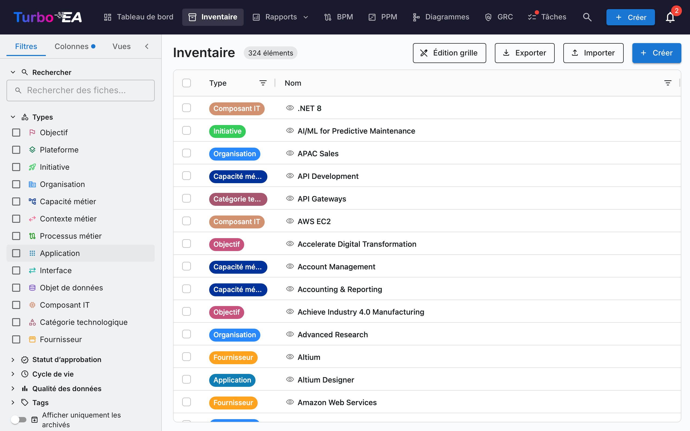
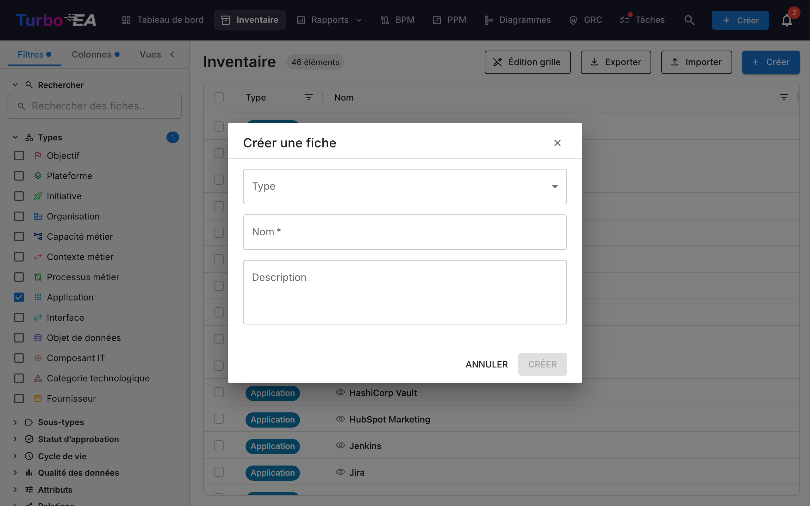

# Inventaire

L'**Inventaire** est le cœur de Turbo EA. Toutes les **fiches** (composants) de l'architecture d'entreprise y sont listées : applications, processus, capacités métier, organisations, fournisseurs, interfaces, et plus encore.

## Structure de l'écran d'inventaire

### Panneau de filtres à gauche

Le panneau latéral gauche permet de **filtrer** les fiches selon différents critères :

- **Recherche** -- Recherche en texte libre sur les noms de fiches
- **Types** -- Filtrer par un ou plusieurs types de fiches : Objectif, Plateforme, Initiative, Organisation, Capacité Métier, Contexte Métier, Processus Métier, Application, Interface, Objet de Données, Composant IT, Catégorie Technique, Fournisseur, Système
- **Sous-types** -- Lorsqu'un type est sélectionné, filtrer davantage par sous-type (par ex. Application -> Application Métier, Microservice, Agent IA, Déploiement)
- **Statut d'approbation** -- Brouillon, Approuvé, Cassé ou Rejeté
- **Cycle de vie** -- Filtrer par phase du cycle de vie : Planification, Mise en service, Actif, Retrait progressif, Fin de vie
- **Qualité des données** -- Filtrage par seuil : Bonne (80%+), Moyenne (50-79%), Faible (inférieure à 50%)
- **Tags** -- Filtrer par tags de n'importe quel groupe de tags
- **Relations** -- Filtrer par fiches liées à travers les types de relations
- **Attributs personnalisés** -- Filtrer par valeurs dans les champs personnalisés (recherche textuelle, options de sélection)
- **Afficher uniquement les archives** -- Basculer pour voir les fiches archivées (supprimées de manière logique)
- **Tout effacer** -- Réinitialiser tous les filtres actifs d'un coup

Un **badge de nombre de filtres actifs** indique combien de filtres sont actuellement appliqués.

### Onglet Colonnes

L'onglet **Colonnes** dans le panneau latéral vous permet de choisir les colonnes supplémentaires à afficher dans la grille. Les colonnes disponibles changent dynamiquement en fonction des types de cartes sélectionnés :

- **Un seul type sélectionné** — Tous les champs d'attributs définis pour ce type sont disponibles, ainsi que les colonnes de relations et de métadonnées
- **Plusieurs types sélectionnés** — Seuls les champs **communs à tous les types sélectionnés** sont disponibles
- **Aucun type sélectionné** — Un message d'indication vous invite à sélectionner d'abord un type de carte

Les colonnes sont regroupées en quatre catégories :

| Catégorie | Description |
|-----------|-------------|
| **Colonnes par défaut** | Colonnes toujours actives : Type, Nom, Chemin, Description, Sous-type, Cycle de vie, Statut d'approbation, Qualité des données. Décochez-les pour les masquer de la grille — utile pour resserrer une vue enregistrée aux seules colonnes que vous utilisez vraiment. |
| **Métadonnées** | Créé, Modifié, Créé par, Modifié par |
| **Attributs** | Champs personnalisés définis dans le métamodèle (texte, nombre, coût, date, sélection, etc.) |
| **Relations** | Types de cartes liés (par ex., Applications liées à une Capacité Métier) |

La colonne **Chemin** affiche le fil d'Ariane hiérarchique (par ex. « Amérique du Nord / Ventes / Ventes internes ») sans le nom de la fiche elle-même, ce qui vous permet d'afficher Nom et Chemin en même temps.

Chaque catégorie dispose d'une case à cocher **Tout sélectionner** pour activer ou désactiver rapidement toutes les colonnes du groupe. Un champ de recherche en haut permet de trouver des colonnes spécifiques par nom. Le badge sur chaque en-tête de section indique combien de colonnes de ce groupe sont actuellement visibles.

Lorsqu'un type de carte est sélectionné pour la première fois, **toutes les colonnes d'attributs et de relations sont activées par défaut**. Vous pouvez ensuite décocher les colonnes dont vous n'avez pas besoin. Un bouton **Réinitialiser** en bas de l'onglet « Colonnes » restaure la sélection de colonnes par défaut.

Un **point indicateur de modification** apparaît sur l'en-tête de l'onglet « Colonnes » lorsque la sélection de colonnes diffère des valeurs par défaut. Le même indicateur apparaît sur l'onglet **Filtres** lorsque des filtres sont actifs, permettant de voir d'un coup d'œil quels paramètres ont été modifiés.

Votre sélection de colonnes, vos filtres actifs et votre ordre de tri sont **automatiquement conservés** dans votre navigateur. Lorsque vous revenez à la page d'inventaire, votre configuration précédente est restaurée. Les vues enregistrées (signets) conservent également la sélection complète des colonnes, de sorte que le passage d'une vue à l'autre restaure exactement les colonnes que vous aviez configurées.

### Tableau principal

L'inventaire utilise un tableau de données **AG Grid** avec des fonctionnalités puissantes :

| Colonne | Description |
|---------|-------------|
| **Type** | Type de fiche avec icône colorée |
| **Nom** | Nom du composant (cliquer pour ouvrir le détail de la fiche) |
| **Description** | Description brève |
| **Cycle de vie** | État actuel du cycle de vie |
| **Statut d'approbation** | Badge de statut de révision |
| **Qualité des données** | Pourcentage de complétude avec anneau visuel |
| **Relations** | Nombre de relations avec popover cliquable affichant les fiches liées |

**Fonctionnalités du tableau :**

- **Tri** -- Cliquer sur l'en-tête de n'importe quelle colonne pour trier par ordre croissant/décroissant
- **Édition en ligne** -- En mode édition grille, modifiez les valeurs des champs directement dans le tableau
- **Sélection multiple** -- Sélectionnez plusieurs lignes pour des opérations en masse
- **Affichage hiérarchique** -- Les relations parent/enfant sont affichées sous forme de chemins de navigation
- **Configuration des colonnes** -- Afficher, masquer et réorganiser les colonnes

### Barre d'outils

- **Édition grille** -- Basculer le mode d'édition en ligne pour modifier plusieurs fiches dans le tableau
- **Exporter** -- Télécharger les données sous forme de fichier Excel (.xlsx)
- **Importer** -- Chargement en masse de données depuis des fichiers Excel
- **+ Créer** -- Créer une nouvelle fiche

## Comment créer une nouvelle fiche

1. Cliquez sur le bouton **+ Créer** (bleu, coin supérieur droit)
2. Dans la boîte de dialogue qui apparaît :
   - Sélectionnez le **Type** de fiche (Application, Processus, Objectif, etc.)
   - Entrez le **Nom** du composant
   - Optionnellement, ajoutez une **Description**
3. Optionnellement, cliquez sur **Suggérer avec l'IA** pour générer automatiquement une description (voir [Suggestions de description par IA](#suggestions-de-description-par-ia) ci-dessous)
4. Cliquez sur **CREER**

## Suggestions de description par IA { #ai-description-suggestions }

Turbo EA peut utiliser l'**IA pour générer une description** pour n'importe quelle fiche. Cela fonctionne aussi bien dans la boîte de dialogue de création de fiche que sur les pages de détail des fiches existantes.

**Comment ça marche :**

1. Entrez un nom de fiche et sélectionnez un type
2. Cliquez sur l'**icône étincelle** dans l'en-tête de la fiche, ou le bouton **Suggérer avec l'IA** dans la boîte de dialogue de création de fiche
3. Le système effectue une **recherche web** pour le nom de l'élément (en utilisant un contexte adapté au type -- par ex. « SAP S/4HANA software application »), puis envoie les résultats à un **LLM** pour générer une description concise et factuelle
4. Un panneau de suggestion apparaît avec :
   - **Description modifiable** -- examinez et modifiez le texte avant de l'appliquer
   - **Score de confiance** -- indique le degré de certitude de l'IA (Élevé / Moyen / Faible)
   - **Liens sources cliquables** -- les pages web d'où provient la description
   - **Nom du modèle** -- quel LLM a généré la suggestion
5. Cliquez sur **Appliquer la description** pour sauvegarder, ou **Ignorer** pour rejeter

**Caractéristiques clés :**

- **Adapté au type** : L'IA comprend le contexte du type de fiche. Une recherche « Application » ajoute « software application », une recherche « Fournisseur » ajoute « technology vendor », etc.
- **Confidentialité d'abord** : Lorsque vous utilisez Ollama, le LLM s'exécute localement -- vos données ne quittent jamais votre infrastructure. Les fournisseurs commerciaux (OpenAI, Google Gemini, Anthropic Claude, etc.) sont également pris en charge
- **Contrôle par l'administrateur** : Les suggestions IA doivent être activées par un administrateur dans [Paramètres > Suggestions IA](../admin/ai.md). Les administrateurs choisissent quels types de fiches affichent le bouton de suggestion, configurent le fournisseur LLM et sélectionnent le fournisseur de recherche web
- **Basé sur les permissions** : Seuls les utilisateurs disposant de la permission `ai.suggest` peuvent utiliser cette fonctionnalité (activée par défaut pour les rôles Admin, Admin BPM et Membre)

## Vues sauvegardées (Signets)

Vous pouvez sauvegarder votre configuration actuelle de filtres, colonnes et tri sous forme de **vue nommée** pour une réutilisation rapide.

### Créer une vue sauvegardée

1. Configurez l'inventaire avec les filtres, colonnes et tri souhaités
2. Cliquez sur l'icône **signet** dans le panneau de filtres
3. Entrez un **nom** pour la vue
4. Choisissez la **visibilité** :
   - **Privée** -- Seul vous pouvez la voir
   - **Partagée** -- Visible par des utilisateurs spécifiques (avec des permissions de modification optionnelles)
   - **Publique** -- Visible par tous les utilisateurs

### Utiliser les vues sauvegardées

Les vues sauvegardées apparaissent dans la barre latérale du panneau de filtres. Cliquez sur n'importe quelle vue pour appliquer instantanément sa configuration. Les vues sont organisées en :

- **Mes vues** -- Vues que vous avez créées
- **Partagées avec moi** -- Vues que d'autres ont partagées avec vous
- **Vues publiques** -- Vues disponibles pour tous

## Import Excel { #excel-import }

Cliquez sur **Importer** dans la barre d'outils pour créer ou mettre à jour des fiches en masse depuis un fichier Excel.

1. **Sélectionnez un fichier** -- Glissez-déposez un fichier `.xlsx` ou cliquez pour parcourir
2. **Choisissez le type de fiche** -- Optionnellement, restreignez l'import à un type spécifique
3. **Validation** -- Le système analyse le fichier et affiche un rapport de validation :
   - Lignes qui vont créer de nouvelles fiches
   - Lignes qui vont mettre à jour des fiches existantes (correspondance par nom ou ID)
   - Avertissements et erreurs
4. **Importer** -- Cliquez pour continuer. Une barre de progression affiche le statut en temps réel
5. **Résultats** -- Un résumé indique combien de fiches ont été créées, mises à jour ou ont échoué

## Export Excel

Cliquez sur **Exporter** pour télécharger la vue actuelle de l'inventaire sous forme de fichier Excel :

- **Export multi-types** -- Exporte toutes les fiches visibles avec les colonnes principales (nom, type, description, sous-type, cycle de vie, statut d'approbation)
- **Export mono-type** -- Lorsque filtré sur un seul type, l'export inclut les colonnes d'attributs personnalisés développées (une colonne par champ)
- **Développement du cycle de vie** -- Colonnes séparées pour chaque date de phase du cycle de vie (Planification, Mise en service, Actif, Retrait progressif, Fin de vie)
- **Nom de fichier daté** -- Le fichier est nommé avec la date d'export pour une organisation facile
