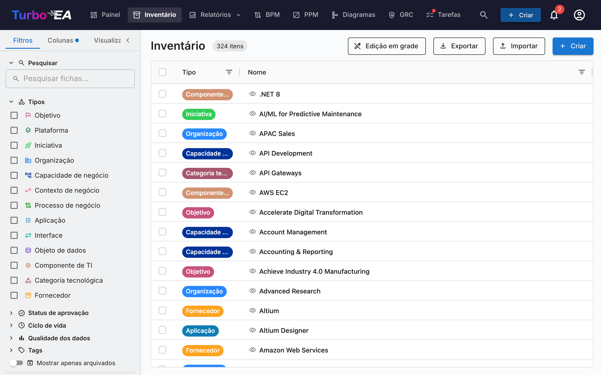
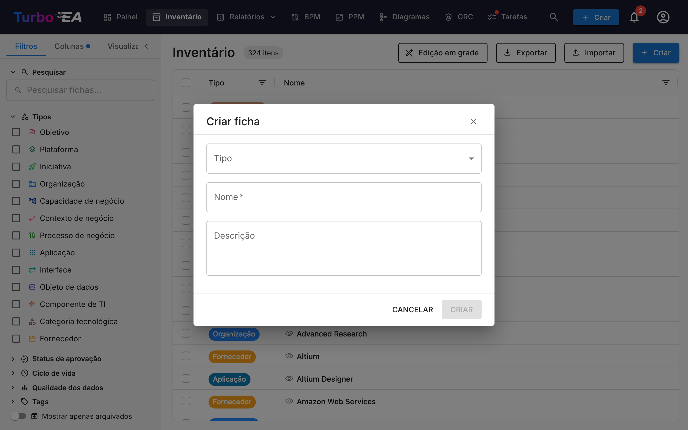

# Inventário

O **Inventário** é o coração do Turbo EA. Aqui todos os **cards** (componentes) da arquitetura empresarial são listados: aplicações, processos, capacidades de negócio, organizações, fornecedores, interfaces e mais.

## Estrutura da Tela do Inventário

### Painel de Filtros à Esquerda

O painel lateral esquerdo permite **filtrar** cards por diferentes critérios:

- **Pesquisa** — Busca de texto livre nos nomes dos cards
- **Tipos** — Filtrar por um ou mais tipos de card: Objetivo, Plataforma, Iniciativa, Organização, Capacidade de Negócio, Contexto de Negócio, Processo de Negócio, Aplicação, Interface, Objeto de Dados, Componente de TI, Categoria Tecnológica, Fornecedor, Sistema
- **Subtipos** — Quando um tipo é selecionado, filtre ainda mais por subtipo (ex.: Aplicação -> Aplicação de Negócio, Microsserviço, Agente de IA, Implantação)
- **Status de Aprovação** — Rascunho, Aprovado, Quebrado ou Rejeitado
- **Ciclo de Vida** — Filtrar por fase do ciclo de vida: Planejamento, Implantação, Ativo, Desativação, Fim de Vida
- **Qualidade dos Dados** — Filtragem por limite: Bom (80%+), Médio (50-79%), Ruim (abaixo de 50%)
- **Tags** — Filtrar por tags de qualquer grupo de tags
- **Relacionamentos** — Filtrar por cards relacionados através de tipos de relacionamento
- **Atributos personalizados** — Filtrar por valores em campos personalizados (busca de texto, opções de seleção)
- **Mostrar apenas arquivados** — Alternância para visualizar cards arquivados (excluídos temporariamente)
- **Limpar tudo** — Redefinir todos os filtros ativos de uma vez

Um **contador de filtros ativos** mostra quantos filtros estão atualmente aplicados.

### Aba Colunas

A aba **Colunas** no painel lateral permite escolher quais colunas adicionais exibir na grade. As colunas disponíveis mudam dinamicamente com base nos tipos de cartões selecionados:

- **Um único tipo selecionado** — Todos os campos de atributos definidos para esse tipo estão disponíveis, além de colunas de relações e metadados
- **Vários tipos selecionados** — Apenas os campos que são **comuns a todos os tipos selecionados** estão disponíveis
- **Nenhum tipo selecionado** — Uma mensagem de orientação solicita que você selecione primeiro um tipo de cartão

As colunas são agrupadas em quatro categorias:

| Categoria | Descrição |
|-----------|-----------|
| **Colunas padrão** | Colunas sempre ativas: Tipo, Nome, Caminho, Descrição, Subtipo, Ciclo de vida, Estado de aprovação, Qualidade dos dados. Desmarque-as para ocultá-las da grade — útil para ajustar uma visualização salva apenas às colunas que você realmente usa. |
| **Metadados** | Criado, Modificado, Criado por, Modificado por |
| **Atributos** | Campos personalizados definidos no metamodelo (texto, número, custo, data, seleção, etc.) |
| **Relações** | Tipos de cartões relacionados (por ex., Aplicações vinculadas a uma Capacidade de Negócio) |

A coluna **Caminho** mostra a hierarquia da ficha (por ex. «América do Norte / Vendas / Vendas internas») sem incluir o próprio nome da ficha, para que você possa exibir Nome e Caminho ao mesmo tempo.

Cada categoria tem uma caixa de seleção **Selecionar tudo** para ativar ou desativar rapidamente todas as colunas desse grupo. Um campo de pesquisa no topo permite encontrar colunas específicas por nome. O indicador em cada cabeçalho de seção mostra quantas colunas desse grupo estão atualmente visíveis.

Quando um tipo de cartão é selecionado pela primeira vez, **todas as colunas de atributos e relações são ativadas por padrão**. Você pode então desmarcar as colunas que não precisa. Um botão **Redefinir** na parte inferior da aba «Colunas» restaura a seleção de colunas padrão.

Um **ponto indicador de alteração** aparece no cabeçalho da aba «Colunas» quando a seleção de colunas difere dos padrões. O mesmo indicador aparece na aba **Filtros** quando há filtros ativos, facilitando ver rapidamente quais configurações foram modificadas.

Sua seleção de colunas, filtros ativos e ordem de classificação são **automaticamente salvos** no navegador. Ao retornar à página de inventário, sua configuração anterior é restaurada. As visualizações salvas (favoritos) também preservam a seleção completa de colunas, de modo que ao alternar entre visualizações, são restauradas exatamente as colunas que você havia configurado.

### Tabela Principal

O inventário usa uma tabela de dados **AG Grid** com recursos poderosos:

| Coluna | Descrição |
|--------|-----------|
| **Tipo** | Tipo do card com ícone colorido |
| **Nome** | Nome do componente (clique para abrir o detalhe do card) |
| **Descrição** | Breve descrição |
| **Ciclo de Vida** | Estado atual do ciclo de vida |
| **Status de Aprovação** | Badge de status de revisão |
| **Qualidade dos Dados** | Porcentagem de completude com anel visual |
| **Relacionamentos** | Contagem de relacionamentos com popover clicável mostrando cards relacionados |

**Recursos da tabela:**

- **Ordenação** — Clique em qualquer cabeçalho de coluna para ordenar em ascendente/descendente
- **Edição inline** — No modo de edição da grade, edite valores de campos diretamente na tabela
- **Seleção múltipla** — Selecione múltiplas linhas para operações em massa
- **Exibição de hierarquia** — Relacionamentos pai/filho mostrados como caminhos em breadcrumb
- **Configuração de colunas** — Mostrar, ocultar e reordenar colunas

### Barra de Ferramentas

- **Edição na Grade** — Alternar modo de edição inline para editar múltiplos cards na tabela
- **Exportar** — Baixar dados como arquivo Excel (.xlsx)
- **Importar** — Upload em massa de dados a partir de arquivos Excel
- **+ Criar** — Criar um novo card

## Como Criar um Novo Card

1. Clique no botão **+ Criar** (azul, canto superior direito)
2. No diálogo que aparece:
   - Selecione o **Tipo** de card (Aplicação, Processo, Objetivo, etc.)
   - Insira o **Nome** do componente
   - Opcionalmente, adicione uma **Descrição**
3. Opcionalmente, clique em **Sugerir com IA** para gerar uma descrição automaticamente (veja [Sugestões de Descrição com IA](#sugestoes-de-descricao-com-ia) abaixo)
4. Clique em **CRIAR**

## Sugestões de Descrição com IA { #ai-description-suggestions }

O Turbo EA pode usar **IA para gerar uma descrição** para qualquer card. Isso funciona tanto no diálogo de Criação de Card quanto nas páginas de detalhe de cards existentes.

**Como funciona:**

1. Insira um nome de card e selecione um tipo
2. Clique no **ícone de brilho** no cabeçalho do card, ou no botão **Sugerir com IA** no diálogo de Criação de Card
3. O sistema realiza uma **busca na web** pelo nome do item (usando contexto por tipo — ex.: "SAP S/4HANA software application"), então envia os resultados para um **LLM** para gerar uma descrição concisa e factual
4. Um painel de sugestão aparece com:
   - **Descrição editável** — revise e modifique o texto antes de aplicar
   - **Pontuação de confiança** — indica o quão certa a IA está (Alta / Média / Baixa)
   - **Links de fontes clicáveis** — as páginas web das quais a descrição foi derivada
   - **Nome do modelo** — qual LLM gerou a sugestão
5. Clique em **Aplicar descrição** para salvar, ou **Descartar** para ignorar

**Características principais:**

- **Contextual por tipo**: A IA entende o contexto do tipo de card. Uma busca de "Aplicação" adiciona "software application", uma busca de "Fornecedor" adiciona "technology vendor", etc.
- **Privacidade em primeiro lugar**: Ao usar Ollama, o LLM roda localmente — seus dados nunca saem da sua infraestrutura. Provedores comerciais (OpenAI, Google Gemini, Anthropic Claude, etc.) também são suportados
- **Controlado pelo administrador**: Sugestões de IA devem ser habilitadas por um administrador em [Configurações > Sugestões de IA](../admin/ai.md). Administradores escolhem quais tipos de card mostram o botão de sugestão, configuram o provedor de LLM e selecionam o provedor de busca web
- **Baseado em permissões**: Apenas usuários com a permissão `ai.suggest` podem usar este recurso (habilitado por padrão para os papéis Admin, BPM Admin e Membro)

## Visualizações Salvas (Favoritos)

Você pode salvar sua configuração atual de filtros, colunas e ordenação como uma **visualização nomeada** para reutilização rápida.

### Criando uma Visualização Salva

1. Configure o inventário com os filtros, colunas e ordenação desejados
2. Clique no ícone de **favorito** no painel de filtros
3. Insira um **nome** para a visualização
4. Escolha a **visibilidade**:
   - **Privada** — Apenas você pode ver
   - **Compartilhada** — Visível para usuários específicos (com permissões de edição opcionais)
   - **Pública** — Visível para todos os usuários

### Usando Visualizações Salvas

Visualizações salvas aparecem na barra lateral do painel de filtros. Clique em qualquer visualização para aplicar instantaneamente sua configuração. As visualizações são organizadas em:

- **Minhas Visualizações** — Visualizações que você criou
- **Compartilhadas Comigo** — Visualizações que outros compartilharam com você
- **Visualizações Públicas** — Visualizações disponíveis para todos

## Importação Excel { #excel-import }

Clique em **Importar** na barra de ferramentas para criar ou atualizar cards em massa a partir de um arquivo Excel.

1. **Selecione um arquivo** — Arraste e solte um arquivo `.xlsx` ou clique para navegar
2. **Escolha o tipo de card** — Opcionalmente restrinja a importação a um tipo específico
3. **Validação** — O sistema analisa o arquivo e mostra um relatório de validação:
   - Linhas que criarão novos cards
   - Linhas que atualizarão cards existentes (correspondidos por nome ou ID)
   - Avisos e erros
4. **Importar** — Clique para prosseguir. Uma barra de progresso mostra o status em tempo real
5. **Resultados** — Um resumo mostra quantos cards foram criados, atualizados ou falharam

## Exportação Excel

Clique em **Exportar** para baixar a visualização atual do inventário como arquivo Excel:

- **Exportação multi-tipo** — Exporta todos os cards visíveis com colunas principais (nome, tipo, descrição, subtipo, ciclo de vida, status de aprovação)
- **Exportação de tipo único** — Quando filtrado para um tipo, a exportação inclui colunas expandidas de atributos personalizados (uma coluna por campo)
- **Expansão do ciclo de vida** — Colunas separadas para cada data de fase do ciclo de vida (Planejamento, Implantação, Ativo, Desativação, Fim de Vida)
- **Nome do arquivo com data** — O arquivo é nomeado com a data de exportação para fácil organização
