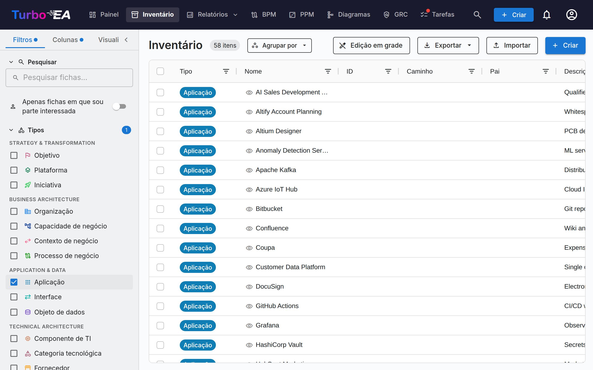
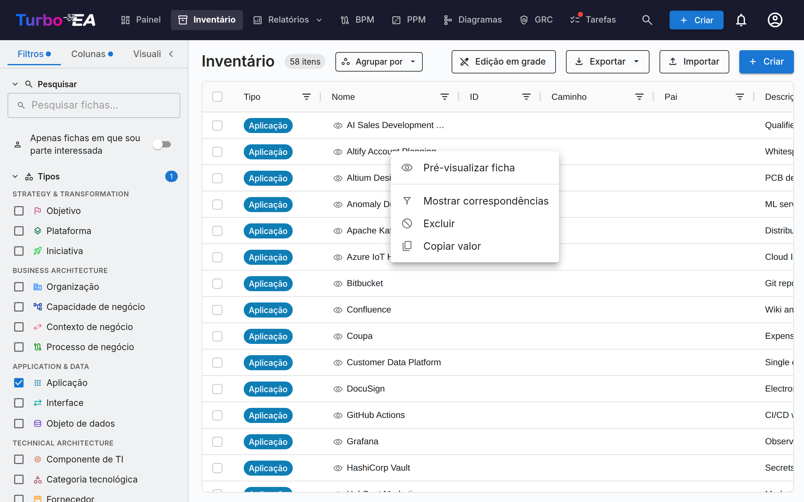
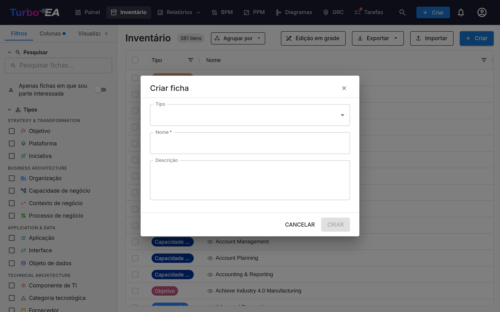

# Inventário

O **Inventário** é o coração do Turbo EA. Aqui todos os **cards** (componentes) da arquitetura empresarial são listados: aplicações, processos, capacidades de negócio, organizações, fornecedores, interfaces e mais.

## Estrutura da Tela do Inventário

### Painel de Filtros à Esquerda

O painel lateral esquerdo permite **filtrar** cards por diferentes critérios:

- **Pesquisa** — Busca de texto livre nos nomes dos cards, desde a primeira letra. As melhores correspondências aparecem primeiro: nomes exatos, depois os que começam pelo que você digitou, depois aqueles em que inicia uma palavra e então os restantes. Todos os campos de busca do Turbo EA ordenam assim — a busca global (**Ctrl+K** / **⌘K**), cada seletor de cards, o registo de riscos, as decisões e os portais publicados — a não ser que você tenha escolhido uma ordenação própria, que prevalece sempre
- **Tipos** — Filtrar por um ou mais tipos de card: Objetivo, Plataforma, Iniciativa, Organização, Capacidade de Negócio, Contexto de Negócio, Processo de Negócio, Aplicação, Interface, Objeto de Dados, Componente de TI, Categoria Tecnológica, Fornecedor, Sistema
- **Subtipos** — Quando um tipo é selecionado, filtre ainda mais por subtipo (ex.: Aplicação -> Aplicação de Negócio, Microsserviço, Agente de IA, Implantação)
- **Status de Aprovação** — Rascunho, Aprovado, Quebrado ou Rejeitado
- **Ciclo de Vida** — Filtrar por fase do ciclo de vida: Planejamento, Implantação, Ativo, Desativação, Fim de Vida
- **Qualidade dos Dados** — Filtragem por faixa (seleção múltipla): Completo (≥80%), Parcial (40-79%), Mínimo (abaixo de 40%). São as faixas do [relatório Qualidade dos dados](reports.md#data-quality-report): clicar num segmento de barra leva até aqui.
- **Órfãs** — Apenas fichas sem qualquer relação, em ambos os sentidos. Avaliado no servidor, pelo que funciona sem um tipo selecionado.
- **Desatualizadas** — Apenas fichas não atualizadas nos últimos 90 dias. Ambas espelham os blocos do [relatório Qualidade dos dados](reports.md#data-quality-report): clicar num bloco leva até aqui.
- **Tags** — Filtrar por tags de qualquer grupo de tags
- **Relacionamentos** — Filtrar por cards relacionados através de tipos de relacionamento
- **Atributos personalizados** — Filtrar por valores em campos personalizados (busca de texto, opções de seleção)
- **Mostrar apenas arquivados** — Alternância para visualizar cards arquivados (excluídos temporariamente)
- **Limpar tudo** — Redefinir todos os filtros ativos de uma vez

> **Encontrar cartões sem valor.** Os filtros de Subtipo, Ciclo de vida, Etiquetas, Relações e atributos personalizados de seleção incluem, cada um, uma opção **(vazio)**. Selecione-a para listar apenas os cartões que *não* têm valor nesse campo — por exemplo, todos os cartões sem ciclo de vida definido. Pode ser combinada com valores normais (corresponde a qualquer um) e entre vários filtros (corresponde a todos).

Um **contador de filtros ativos** mostra quantos filtros estão atualmente aplicados.

### Ações de célula

Clique com o botão direito em qualquer célula da grelha (toque longo em dispositivos táteis) para abrir um menu de contexto com ações rápidas sobre o que está sob o cursor, ao estilo do ServiceNow:

- **Pré-visualizar ficha** — abrir a ficha que a célula indica no painel lateral, sem sair da grelha
- **Mostrar correspondências** — manter apenas as linhas cujo valor é igual ao da célula clicada
- **Excluir** — ocultar as linhas cujo valor é igual ao da célula clicada
- **Copiar valor** — copiar o texto da célula para a área de transferência
- **Limpar filtro da coluna** — remover o filtro dessa coluna (visível apenas enquanto houver um ativo)

Numa célula com vários valores (etiquetas, relações, partes interessadas, atributos de seleção múltipla), o menu lista primeiro os valores individuais, para filtrar por um deles ou pela célula inteira. **Pré-visualizar ficha** aparece em todas as células que indicam uma ficha — a coluna **Nome** (a ficha da própria linha), a coluna **Pai** e as colunas de relações — e quando a célula indica várias, o menu lista-as da mesma forma, para escolher qual abrir. Estes filtros entram nos filtros de coluna da grelha: combinam-se com os filtros da barra lateral, contam para o botão **Limpar filtros** da barra de ferramentas e são preservados com a sua vista. O mesmo menu está disponível em todas as grelhas do Turbo EA — Decisões, Registo de riscos, Conformidade e as grelhas de administração. Quando a coluna tem um filtro correspondente no painel esquerdo — tipo de cartão, subtipo, ciclo de vida, estado de aprovação ou um atributo de seleção única —, **Mostrar correspondências** seleciona também esse valor no painel, e **Limpar** limpa ambos, pelo que uma vista guardada nunca pode conter um filtro do painel e um filtro de coluna contraditórios. Se o filtro for depois editado no painel, é esse que passa a mandar.

### Aba Colunas

A aba **Colunas** no painel lateral permite escolher quais colunas adicionais exibir na grade. As colunas disponíveis mudam dinamicamente com base nos tipos de cartões selecionados:

- **Um único tipo selecionado** — Todos os campos de atributos definidos para esse tipo estão disponíveis, além de colunas de relações e metadados
- **Vários tipos selecionados** — Apenas os campos que são **comuns a todos os tipos selecionados** estão disponíveis
- **Nenhum tipo selecionado** — Uma mensagem de orientação solicita que você selecione primeiro um tipo de cartão

As colunas são agrupadas em cinco categorias:

| Categoria | Descrição |
|-----------|-----------|
| **Colunas padrão** | Colunas sempre ativas: Tipo, Nome, Caminho, Descrição, Subtipo, Ciclo de vida, Estado de aprovação, Qualidade dos dados. Desmarque-as para ocultá-las da grade — útil para ajustar uma visualização salva apenas às colunas que você realmente usa. |
| **Metadados** | Criado, Modificado, Criado por, Modificado por |
| **Atributos** | Campos personalizados definidos no metamodelo (texto, número, custo, data, seleção, etc.) |
| **Relações** | Tipos de cartões relacionados (por ex., Aplicações vinculadas a uma Capacidade de Negócio) |
| **Partes interessadas** | Uma coluna por cada papel de parte interessada definido para o tipo selecionado (por ex. *Partes interessadas: Responsible*), mostrando os utilizadores atribuídos como chips. No modo de edição da grade, faça duplo clique numa célula para atribuir ou remover utilizadores desse papel diretamente na grade (requer a permissão de gestão de partes interessadas). |

A coluna **Pai** mostra apenas o cartão diretamente acima, enquanto **Caminho** mostra toda a cadeia. No modo de edição da grelha, faça duplo clique numa célula Pai para mover o cartão, ou esvazie o campo para o levar ao nível superior. A coluna só é editável quando a grelha está filtrada por um único tipo de cartão com suporte a hierarquia. Se um movimento for recusado — por criar um ciclo, colidir com um cartão do mesmo nome sob o destino ou exceder a profundidade máxima —, o motivo aparece no fundo do ecrã e a célula é revertida.

A coluna **Caminho** mostra a hierarquia da ficha (por ex. «América do Norte / Vendas / Vendas internas») sem incluir o próprio nome da ficha, para que você possa exibir Nome e Caminho ao mesmo tempo.

Cada categoria tem uma caixa de seleção **Selecionar tudo** para ativar ou desativar rapidamente todas as colunas desse grupo. Um campo de pesquisa no topo permite encontrar colunas específicas por nome. O indicador em cada cabeçalho de seção mostra quantas colunas desse grupo estão atualmente visíveis.

Quando um tipo de cartão é selecionado pela primeira vez, **todas as colunas de atributos e relações são ativadas por padrão**. Você pode então desmarcar as colunas que não precisa. Um botão **Redefinir** na parte inferior da aba «Colunas» restaura a seleção de colunas padrão.

Um **ponto indicador de alteração** aparece no cabeçalho da aba «Colunas» quando a seleção de colunas difere dos padrões. O mesmo indicador aparece na aba **Filtros** quando há filtros ativos, facilitando ver rapidamente quais configurações foram modificadas.

Sua seleção de colunas, o **layout das colunas** (ordem da esquerda para a direita, larguras e colunas fixadas), os filtros ativos e a ordem de classificação são **salvos automaticamente** no navegador. Ao retornar à página de inventário, sua configuração anterior é restaurada. As visualizações salvas (favoritos) também preservam esse layout completo, de modo que ao alternar entre visualizações são restauradas exatamente as colunas que você havia configurado, e na mesma disposição, o que importa ao compartilhar uma visualização organizada com as partes interessadas.

### Tabela Principal

O inventário usa uma tabela de dados **AG Grid** com recursos poderosos:

| Coluna | Descrição |
|--------|-----------|
| **Tipo** | Tipo do card com ícone colorido |
| **Nome** | Nome do componente (clique para abrir o detalhe do card) |
| **Descrição** | Breve descrição |
| **Ciclo de Vida** | Estado atual do ciclo de vida |
| **Status de Aprovação** | Badge de status de revisão |
| **Qualidade dos Dados** | Porcentagem de completude com anel visual |
| **Relacionamentos** | Nomes dos cartões relacionados, em ordem alfabética, com um popover clicável para adicionar ou remover relacionamentos — os cartões já ligados ficam ocultos do seu seletor |

**Recursos da tabela:**

- **Ordenação** — Clique em qualquer cabeçalho de coluna para ordenar em ascendente/descendente
- **Edição inline** — No modo de edição da grade, edite valores de campos diretamente na tabela
- **Preencher uma coluna** — No modo de edição da grade, clique numa célula e arraste o pequeno quadrado do seu canto para cima ou para baixo para copiar esse valor para todas as linhas percorridas. Antes de guardar seja o que for, uma confirmação indica a coluna, o valor e quantas linhas; se o servidor recusar uma linha, esta é listada com o motivo e uma ligação, e as linhas bem-sucedidas continuam guardadas. O gesto funciona com o dedo tal como com o rato, e também com o teclado: coloque o foco no quadrado, estenda com as setas e confirme com Enter. Só são preenchidas as linhas visíveis após os seus filtros e ordenação, e a coluna Nome fica propositadamente excluída para que dois cards não partilhem o mesmo nome.
- **Seleção múltipla** — Selecione múltiplas linhas para operações em massa
- **Exibição de hierarquia** — Relacionamentos pai/filho mostrados como caminhos em breadcrumb
- **Configuração de colunas** — Mostrar, ocultar e reordenar colunas
- **Fixar uma coluna** — Passe o rato sobre o cabeçalho de uma coluna e clique no ícone de pino para fixar essa coluna na margem esquerda, para que continue visível enquanto desloca a tabela lateralmente. Clique novamente no pino para a libertar. Cada coluna tem também esse pino no separador **Colunas** do painel de filtros, pelo que pode fixar uma coluna sem procurar o respetivo cabeçalho. As colunas fixadas são memorizadas por tabela e o mesmo controlo está disponível em todas as tabelas de dados do Turbo EA (Registo de riscos, Decisões, Constatações de conformidade, Utilizadores, Recursos, Registo de auditoria).
- **Reordenar colunas** — Arraste o cabeçalho de uma coluna para a mover, ou abra a secção **Ordem das colunas** no topo do separador **Colunas** e arraste uma linha pela respetiva pega. Essa lista *é* a ordem da tabela, pelo que as duas coincidem sempre, e as colunas fixadas são agrupadas à cabeça porque são sempre apresentadas no início — liberte aí o pino de uma coluna se quiser retirá-la desse grupo. A pega funciona também com o teclado (Espaço para agarrar uma coluna, setas para a mover, Espaço para a largar) e por toque, pelo que a ordem pode ser alterada num telemóvel. A sua ordem de colunas é memorizada por tabela, em todas as tabelas de dados do Turbo EA.

### Barra de Ferramentas

- **Edição na Grade** — Alternar modo de edição inline para editar múltiplos cards na tabela
- **Exportar** — Baixar dados como arquivo Excel (.xlsx)
- **Importar** — Upload em massa de dados a partir de arquivos Excel
- **+ Criar** — Criar um novo card

## Como Criar um Novo Card

1. Clique no botão **+ Criar** (azul, canto superior direito)
2. No diálogo que aparece:
   - Selecione o **Tipo** de card (Aplicação, Processo, Objetivo, etc.)
   - Insira o **Nome** do componente
   - Opcionalmente, adicione uma **Descrição**
3. Opcionalmente, clique em **Sugerir com IA** para gerar uma descrição automaticamente (veja [Sugestões de Descrição com IA](#sugestoes-de-descricao-com-ia) abaixo)
4. Clique em **CRIAR**

## Edição em massa { #mass-edit }

Marque duas ou mais linhas com as caixas de seleção da coluna à esquerda e clique em **Edição em massa** na barra de seleção. A caixa de diálogo aplica uma única alteração a todos os cartões selecionados.

A lista **Campo** agrupa o que pode ser alterado:

- **Geral** — estado de aprovação, subtipo, etiquetas e pai
- **Atributos** — qualquer campo editável definido para o tipo de cartão selecionado
- **Relações** — uma entrada por tipo de relação e direção (por exemplo *é executado em → Componente de TI*)

Etiquetas, relações e pai oferecem um botão **adicionar / remover**, para que amplie ou reduza os valores existentes em vez de os substituir.

O controlo de valor adapta-se ao tipo de campo: um campo de seleção múltipla mostra as suas opções com caixas de verificação, um campo sim/não um interruptor e um campo de data um seletor de data. Deixar o valor vazio limpa o campo em todos os cartões selecionados. Os campos calculados por uma fórmula, e os campos de custo que não tem permissão para ver, não são disponibilizados.

### Reestruturar a hierarquia { #mass-edit-parent }

O campo **Pai** aparece quando a grelha está filtrada por um único tipo de cartão com suporte a hierarquia. Um cartão tem exatamente um pai, por isso este único campo cobre os dois sentidos de uma reestruturação:

- **Definir pai** — escolha um cartão do mesmo tipo; todos os cartões selecionados passam para baixo dele. É assim que se tornam vários cartões filhos de um mesmo pai.
- **Remover pai** — todos os cartões selecionados voltam ao nível superior.

Os cartões são movidos um a um, pelo que um movimento não permitido bloqueia apenas esse cartão. A caixa de diálogo permanece aberta e indica quais os cartões bloqueados e porquê. Os motivos habituais são:

- Já existe um cartão com o mesmo nome sob o pai de destino.
- O pai escolhido é descendente de um dos cartões que estão a ser movidos, o que criaria um ciclo.
- O movimento levaria uma capacidade de negócio para além do máximo de cinco níveis.

Um cartão leva consigo os seus próprios filhos ao mover-se, e os cartões aprovados voltam a **Quebrado** para que a alteração seja revista.

## Agrupar o inventário { #group-by }

Clique em **Agrupar por** na barra de ferramentas (ao lado da contagem de itens) para organizar a grelha em grupos expansíveis. A fase do ciclo de vida e o estado de aprovação estão sempre disponíveis; ao filtrar a grelha para um único tipo de cartão, acrescentam-se o seu subtipo e todos os atributos de seleção única.

- Os cartões sem valor no campo escolhido caem num grupo **Não definido**, no topo: o ponto de partida natural para classificar cartões pendentes.
- Clique no cabeçalho de um grupo para o recolher ou expandir. O cabeçalho mostra o número de cartões do grupo.
- Ao percorrer um grupo longo, o seu cabeçalho permanece fixo logo abaixo dos cabeçalhos de coluna, para que saiba sempre que grupo está a ler; o cabeçalho do grupo seguinte empurra-o ao chegar. É o cabeçalho completo, incluindo a caixa de seleção, pelo que pode selecionar um grupo longo sem voltar ao seu início.
- A caixa de seleção do cabeçalho seleciona todos os cartões do grupo: para reclassificar um lote, expanda **Não definido**, marque o cabeçalho e defina o valor com a [Edição em massa](#mass-edit). Deliberadamente não há arrastar e largar: selecionar e definir funciona da mesma forma em computador, tablet e telemóvel.
- A ordenação aplica-se dentro de cada grupo; o agrupamento é mantido após recarregar, guardado nas vistas guardadas e partilhável através do parâmetro de URL `group_by`.

## Sugestões de Descrição com IA { #ai-description-suggestions }

O Turbo EA pode usar **IA para gerar uma descrição** para qualquer card. Isso funciona tanto no diálogo de Criação de Card quanto nas páginas de detalhe de cards existentes.

**Como funciona:**

1. Insira um nome de card e selecione um tipo
2. Clique no **ícone de brilho** no cabeçalho do card, ou no botão **Sugerir com IA** no diálogo de Criação de Card
3. O sistema realiza uma **busca na web** pelo nome do item (usando contexto por tipo — ex.: "SAP S/4HANA software application"), então envia os resultados para um **LLM** para gerar uma descrição concisa e factual
4. Um painel de sugestão aparece com:
   - **Descrição editável** — revise e modifique o texto antes de aplicar
   - **Pontuação de confiança** — indica o quão certa a IA está (Alta / Média / Baixa)
   - **Links de fontes clicáveis** — as páginas web das quais a descrição foi derivada
   - **Nome do modelo** — qual LLM gerou a sugestão
5. Clique em **Aplicar descrição** para salvar, ou **Descartar** para ignorar

**Características principais:**

- **Contextual por tipo**: A IA entende o contexto do tipo de card. Uma busca de "Aplicação" adiciona "software application", uma busca de "Fornecedor" adiciona "technology vendor", etc.
- **Privacidade em primeiro lugar**: Ao usar Ollama, o LLM roda localmente — seus dados nunca saem da sua infraestrutura. Provedores comerciais (OpenAI, Google Gemini, Anthropic Claude, etc.) também são suportados
- **Controlado pelo administrador**: Sugestões de IA devem ser habilitadas por um administrador em [Configurações > Sugestões de IA](../admin/ai.md). Administradores escolhem quais tipos de card mostram o botão de sugestão, configuram o provedor de LLM e selecionam o provedor de busca web
- **Baseado em permissões**: Apenas usuários com a permissão `ai.suggest` podem usar este recurso (habilitado por padrão para os papéis Admin, BPM Admin e Membro)

## Visualizações Salvas (Favoritos)

Você pode salvar sua configuração atual de filtros, colunas e ordenação como uma **visualização nomeada** para reutilização rápida.

### Criando uma Visualização Salva

1. Configure o inventário com os filtros, colunas e ordenação desejados
2. Clique no ícone de **favorito** no painel de filtros
3. Insira um **nome** para a visualização
4. Escolha a **visibilidade**:
   - **Privada** — Apenas você pode ver
   - **Compartilhada** — Visível para usuários específicos (com permissões de edição opcionais)
   - **Pública** — Visível para todos os usuários

### Usando Visualizações Salvas

Visualizações salvas aparecem na barra lateral do painel de filtros. Clique em qualquer visualização para aplicar instantaneamente sua configuração. As visualizações são organizadas em:

- **Minhas Visualizações** — Visualizações que você criou
- **Compartilhadas Comigo** — Visualizações que outros compartilharam com você
- **Visualizações Públicas** — Visualizações disponíveis para todos

## Importação / Exportação Excel { #excel-import }

As importações e exportações do inventário usam uma **pasta de trabalho Excel com várias planilhas** que reconstrói uma sub-paisagem inteira — cards de qualquer número de tipos e as relações entre eles — sem nunca exigir a cópia de um UUID.

### Estrutura da pasta de trabalho

- **Uma planilha por tipo de card** (Application, Business Capability, IT Component, …) com as colunas principais, as colunas `attr_<campo>`, as colunas de ciclo de vida as colunas de relação `rel:<tipo_de_relação>` e as colunas de partes interessadas `stakeholder:<chave_do_papel>`.
- **Uma planilha `Relations`** para tipos de relação com atributos (custo, descrição…). As relações simples permanecem em linha na planilha do card de origem.
- **Uma planilha `_Meta`** com a versão do formato da pasta de trabalho.

### Identificação sem GUIDs

Os cards são identificados pelo **nome** quando este é único dentro do tipo, e caso contrário pelo **`parent_path`** completo. Uma célula de relação pode conter `NexaCore ERP` diretamente se apenas uma Application tiver esse nome; em caso de ambiguidade, use `Sales / Customer Mgmt / CRM`.

#### Unicidade entre irmãos

Como os cards são identificados por nome + caminho, **dois cards do mesmo tipo não podem partilhar simultaneamente o mesmo pai e o mesmo nome**. Novos cards que provocariam uma colisão são rejeitados na criação (na caixa Criar card, no renomear em linha e durante a importação de Excel). Duplicados já presentes na base de dados — herdados de seeds ou imports anteriores — permanecem intactos: pode editar qualquer campo, mas criar um terceiro duplicado ou renomear um card de volta à colisão é bloqueado. A verificação é insensível a maiúsculas/minúsculas e espaços, igual ao resolvedor do importador. Quando a caixa Criar card rejeita um duplicado, o aviso indica o card existente e inclui uma ligação **Ver a ficha existente** que o leva diretamente até ele.

### Células de relação em linha

Cada coluna `rel:<tipo_de_relação>` expressa as relações de saída como uma lista **separada por ponto e vírgula** (por exemplo `NexaCore ERP; BillingApp`). Ponto e vírgula em vez de vírgula, porque os nomes de cards frequentemente contêm vírgulas (`Acme, Inc.`). Dentro de um nome, `/` e `\` são escapados como `\/` e `\\` — o exportador faz isso automaticamente (ex.: `SAP S/4HANA` → `SAP S\/4HANA`). As células são **declarativas**: o seu conteúdo substitui o conjunto de relações de saída desse tipo a partir da origem. Remover um destino elimina a relação correspondente; esvaziar a célula elimina todas. Por compatibilidade, células separadas por vírgulas (formato antigo) continuam a ser aceites.

### Células de partes interessadas

Em cada planilha de fichas, as colunas `stakeholder:<chave_do_papel>` carregam os utilizadores atribuídos a cada papel de parte interessada, como **endereços de email separados por ponto e vírgula** (a mesma convenção das colunas `subscriptions:<RoleType>` do LeanIX), por ex. `ada@corp.com; bob@corp.com`. O **endereço de email é a única referência de utilizador aceite** — os nomes podem colidir e nunca são usados na resolução; uma entrada `Nome <email>` é tolerada (usa-se o email entre parênteses angulares), um nome sozinho produz um aviso e é ignorado. Como as células de relação, as células de partes interessadas são **declarativas por papel**: os utilizadores listados tornam-se o conjunto completo de atribuições desse papel após a importação. Remover um utilizador retira a atribuição; esvaziar a célula limpa o papel; omitir a coluna deixa as atribuições intactas. Entradas sem utilizador correspondente produzem um aviso e são ignoradas — nunca bloqueiam a importação.

!!! note "Folhas exportadas antes de as chaves passarem a camelCase"
    As chaves dos papéis de partes interessadas seguem a mesma convenção camelCase de qualquer outra chave do metamodelo. Uma folha exportada antes dessa mudança contém cabeçalhos como `stakeholder:technical_application_owner`; continuam a ser importados — o cabeçalho é associado ao papel em camelCase quando nenhum papel corresponde literalmente. As folhas novas usam a forma camelCase.

### Planilha `Relations`

Para relações com atributos, use a planilha dedicada com as colunas `relation_type`, `source_ref`, `target_ref`, `action` (por defeito `upsert`, alternativamente `delete`), `attr_<campo>` e `description`.

### Importar

Clique em **Importar** na barra de ferramentas, solte a pasta de trabalho e verifique a pré-visualização antes de aplicar. Verá tanto os cards a criar / atualizar como as relações a adicionar / remover. Os erros (por exemplo, um destino ambíguo com os seus caminhos candidatos) bloqueiam a aplicação.

Algumas notas sobre a importação:

- **Apenas `name` e `type` são obrigatórios para criar um card.** Os campos marcados como *obrigatórios* no metamodelo (incluindo Provider ou qualquer outro tipo) não bloqueiam a importação — o card é criado na mesma, e as lacunas refletem-se na sua pontuação de qualidade de dados em vez de causarem um salto silencioso.
- **Uma `/` na coluna `name` de um card não precisa de ser escapada.** O escape (`\/` para uma barra, `\\` para uma barra invertida) só é necessário quando *referencia* esse card a partir de uma célula `parent_path`, `rel:<chave>`, `source_ref` ou `target_ref`, onde `/` é o separador de caminho.

### Exportar

Clique em **Exportar**. O filtro atual determina o conteúdo: com um filtro de tipo único, uma planilha para esse tipo; sem filtro, uma planilha por tipo presente. Em todos os casos a pasta de trabalho inclui `Relations` e `_Meta` e pode ser reimportada sem perder atributos específicos do tipo.

Você também pode escolher **Exportar vista atual** no menu Exportar — um instantâneo plano de uma única planilha que espelha o que está na tela (apenas as colunas visíveis, na ordem atual, para as linhas filtradas). Destina-se a compartilhamento e **não é adequado para reimportação**. Se as colunas de relações ainda estiverem a carregar, a exportação aguarda por elas, pelo que nunca podem sair vazias.
