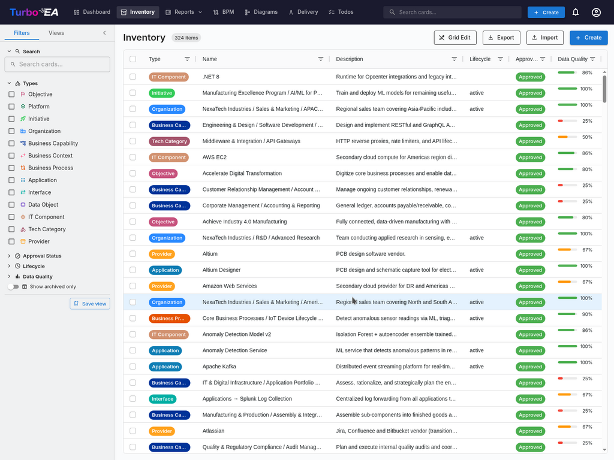
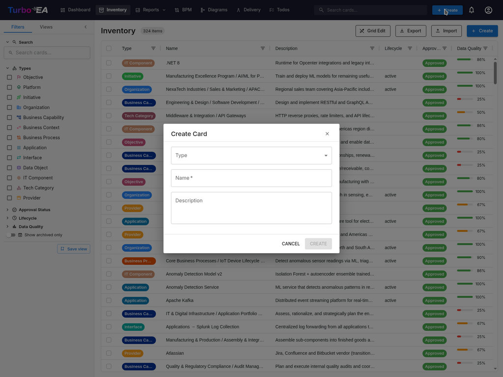

# Инвентарь

**Инвентарь** — это сердце Turbo EA. Здесь перечислены все **карточки** (компоненты) корпоративной архитектуры: приложения, процессы, бизнес-способности, организации, поставщики, интерфейсы и многое другое.

## Структура экрана инвентаря

### Левая панель фильтров

Левая боковая панель позволяет **фильтровать** карточки по различным критериям:

- **Поиск** — полнотекстовый поиск по названиям карточек
- **Типы** — фильтр по одному или нескольким типам карточек: Цель, Платформа, Инициатива, Организация, Бизнес-способность, Бизнес-контекст, Бизнес-процесс, Приложение, Интерфейс, Объект данных, ИТ-компонент, Техническая категория, Поставщик, Система
- **Подтипы** — при выборе типа можно дополнительно фильтровать по подтипу (например, Приложение → Бизнес-приложение, Микросервис, ИИ-агент, Развёртывание)
- **Статус утверждения** — Черновик, Утверждено, Нарушено или Отклонено
- **Жизненный цикл** — фильтр по фазе жизненного цикла: Планирование, Внедрение, Активный, Вывод, Конец жизни
- **Качество данных** — пороговая фильтрация: Хорошее (80%+), Среднее (50–79%), Низкое (ниже 50%)
- **Теги** — фильтр по тегам из любой группы тегов
- **Связи** — фильтр по связанным карточкам по типам связей
- **Пользовательские атрибуты** — фильтр по значениям пользовательских полей (текстовый поиск, варианты выбора)
- **Показать только архивные** — переключатель для просмотра архивированных (мягко удалённых) карточек
- **Очистить всё** — сброс всех активных фильтров одновременно

**Счётчик активных фильтров** в виде значка показывает количество применённых фильтров.

### Основная таблица

Инвентарь использует таблицу данных **AG Grid** с мощными возможностями:

| Столбец | Описание |
|---------|----------|
| **Тип** | Тип карточки с цветной иконкой |
| **Название** | Название компонента (нажмите, чтобы открыть детали карточки) |
| **Описание** | Краткое описание |
| **Жизненный цикл** | Текущая фаза жизненного цикла |
| **Статус утверждения** | Значок статуса проверки |
| **Качество данных** | Процент полноты с визуальным кольцом |
| **Связи** | Количество связей с всплывающим окном, показывающим связанные карточки |

**Возможности таблицы:**

- **Сортировка** — нажмите на заголовок любого столбца для сортировки по возрастанию/убыванию
- **Редактирование в таблице** — в режиме редактирования можно изменять значения полей прямо в таблице
- **Множественный выбор** — выберите несколько строк для массовых операций
- **Отображение иерархии** — отношения «родитель/потомок» показаны в виде цепочки навигации
- **Настройка столбцов** — отображение, скрытие и изменение порядка столбцов

### Панель инструментов

- **Редактирование в таблице** — переключение режима инлайн-редактирования для редактирования нескольких карточек в таблице
- **Экспорт** — скачать данные в виде файла Excel (.xlsx)
- **Импорт** — массовая загрузка данных из файлов Excel
- **+ Создать** — создать новую карточку

## Как создать новую карточку

1. Нажмите кнопку **+ Создать** (синяя, в правом верхнем углу)
2. В появившемся диалоге:
   - Выберите **Тип** карточки (Приложение, Процесс, Цель и т.д.)
   - Введите **Название** компонента
   - При желании добавьте **Описание**
3. При желании нажмите **Предложить с помощью ИИ**, чтобы автоматически сгенерировать описание (см. [ИИ-подсказки для описаний](#ии-подсказки-для-описаний) ниже)
4. Нажмите **СОЗДАТЬ**

## ИИ-подсказки для описаний

Turbo EA может использовать **ИИ для генерации описания** любой карточки. Это работает как в диалоге создания карточки, так и на страницах деталей существующих карточек.

**Как это работает:**

1. Введите название карточки и выберите тип
2. Нажмите на **иконку искры** в заголовке карточки или кнопку **Предложить с помощью ИИ** в диалоге создания карточки
3. Система выполняет **веб-поиск** по названию элемента (с учётом контекста типа — например, «SAP S/4HANA программное приложение»), затем отправляет результаты в **LLM** для генерации краткого фактологического описания
4. Появляется панель подсказки с:
   - **Редактируемым описанием** — просмотрите и измените текст перед применением
   - **Оценкой уверенности** — показывает степень уверенности ИИ (Высокая / Средняя / Низкая)
   - **Ссылками на источники** — веб-страницы, на основе которых составлено описание
   - **Названием модели** — какая LLM сгенерировала подсказку
5. Нажмите **Применить описание**, чтобы сохранить, или **Отклонить**, чтобы отбросить

**Основные характеристики:**

- **Учёт типа**: ИИ понимает контекст типа карточки. Поиск «Приложения» добавляет «программное приложение», поиск «Поставщика» добавляет «технологический вендор» и т.д.
- **Конфиденциальность**: при использовании Ollama модель LLM работает локально — ваши данные никогда не покидают вашу инфраструктуру. Коммерческие провайдеры (OpenAI, Google Gemini, Anthropic Claude и др.) также поддерживаются
- **Контроль администратора**: ИИ-подсказки должны быть включены администратором в [Настройки > ИИ-подсказки](../admin/ai.md). Администраторы выбирают, для каких типов карточек отображается кнопка подсказки, настраивают провайдера LLM и выбирают провайдера веб-поиска
- **На основе прав доступа**: только пользователи с разрешением `ai.suggest` могут использовать эту функцию (включено по умолчанию для ролей Администратор, Администратор BPM и Участник)

## Сохранённые представления (Закладки)

Вы можете сохранить текущую конфигурацию фильтров, столбцов и сортировки как **именованное представление** для быстрого повторного использования.

### Создание сохранённого представления

1. Настройте инвентарь с нужными фильтрами, столбцами и сортировкой
2. Нажмите иконку **закладки** на панели фильтров
3. Введите **название** представления
4. Выберите **видимость**:
   - **Личное** — видите только вы
   - **Общее** — видно определённым пользователям (с возможностью редактирования)
   - **Публичное** — видно всем пользователям

### Использование сохранённых представлений

Сохранённые представления отображаются в боковой панели фильтров. Нажмите на любое представление, чтобы мгновенно применить его конфигурацию. Представления организованы в разделы:

- **Мои представления** — созданные вами представления
- **Доступные мне** — представления, которыми с вами поделились другие
- **Публичные** — представления, доступные всем

## Импорт из Excel

Нажмите **Импорт** на панели инструментов для массового создания или обновления карточек из файла Excel.

1. **Выберите файл** — перетащите файл `.xlsx` или нажмите для выбора
2. **Выберите тип карточки** — при необходимости ограничьте импорт определённым типом
3. **Валидация** — система анализирует файл и показывает отчёт о валидации:
   - Строки, которые создадут новые карточки
   - Строки, которые обновят существующие карточки (по совпадению имени или ID)
   - Предупреждения и ошибки
4. **Импорт** — нажмите для продолжения. Индикатор прогресса показывает статус в реальном времени
5. **Результаты** — сводка показывает, сколько карточек было создано, обновлено или не удалось обработать

## Экспорт в Excel

Нажмите **Экспорт**, чтобы скачать текущее представление инвентаря в виде файла Excel:

- **Многотипный экспорт** — экспортирует все видимые карточки с основными столбцами (название, тип, описание, подтип, жизненный цикл, статус утверждения)
- **Однотипный экспорт** — при фильтрации по одному типу экспорт включает расширенные столбцы пользовательских атрибутов (один столбец на поле)
- **Раскрытие жизненного цикла** — отдельные столбцы для даты каждой фазы жизненного цикла (Планирование, Внедрение, Активный, Вывод, Конец жизни)
- **Имя файла с датой** — файл именуется с датой экспорта для удобства организации
