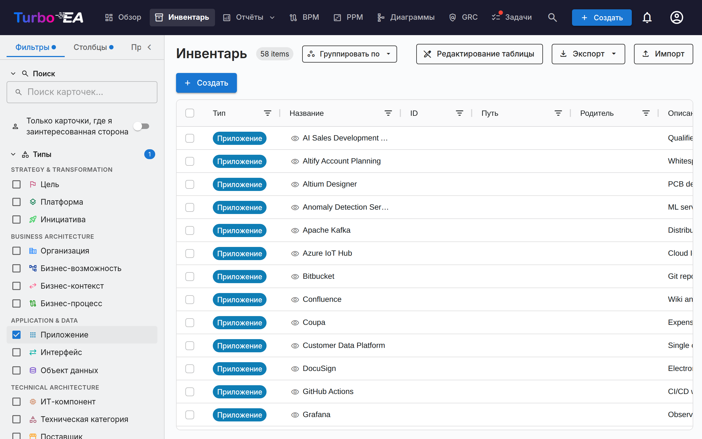
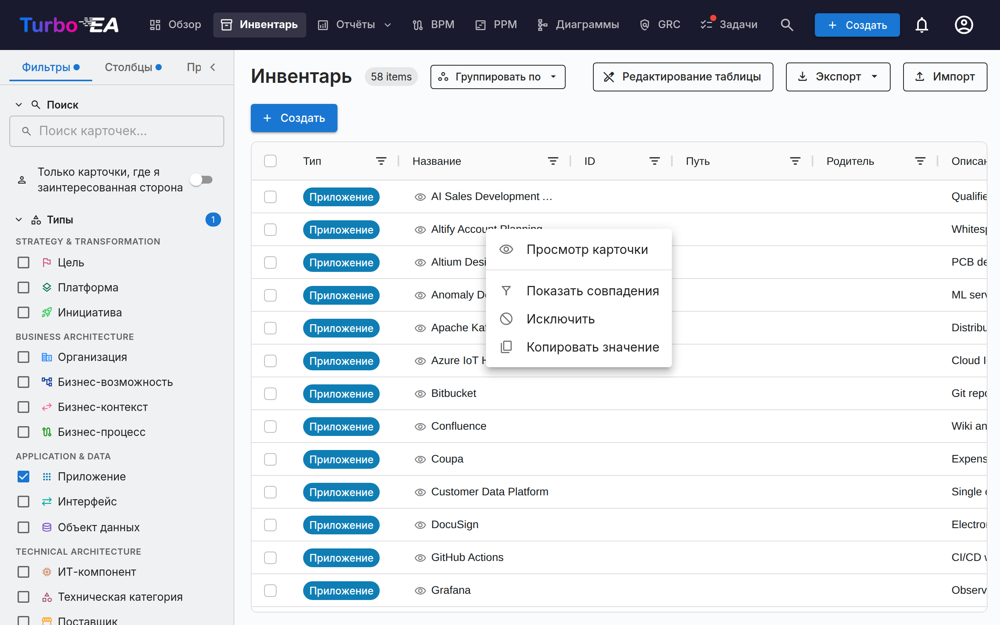
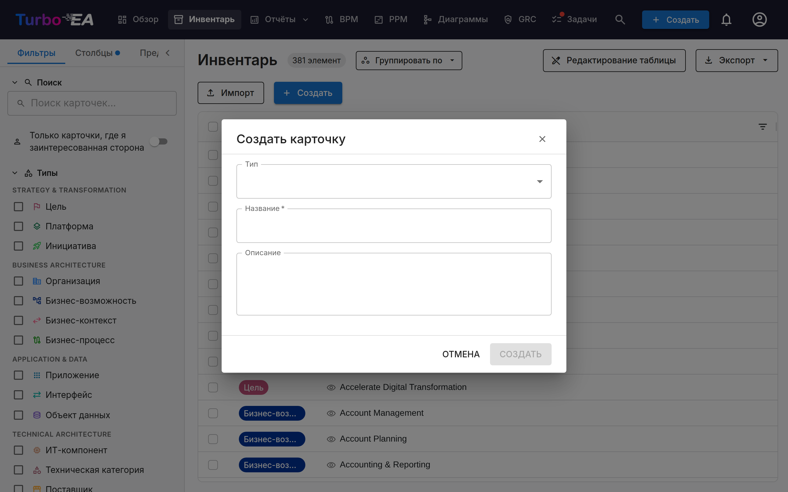

# Инвентарь

**Инвентарь** — это сердце Turbo EA. Здесь перечислены все **карточки** (компоненты) корпоративной архитектуры: приложения, процессы, бизнес-способности, организации, поставщики, интерфейсы и многое другое.

## Структура экрана инвентаря

### Левая панель фильтров

Левая боковая панель позволяет **фильтровать** карточки по различным критериям:

- **Поиск** — полнотекстовый поиск по названиям карточек, начиная с первой же буквы. Наиболее точные совпадения идут первыми: точные названия, затем начинающиеся с введённого текста, затем те, где он начинает слово, затем остальные. Так упорядочивает результаты каждое поле поиска в Turbo EA — глобальный поиск (**Ctrl+K** / **⌘K**), любой выбор карточек, реестр рисков, решения и опубликованные порталы — если только вы не выбрали собственную сортировку, которая всегда имеет приоритет
- **Типы** — фильтр по одному или нескольким типам карточек: Цель, Платформа, Инициатива, Организация, Бизнес-способность, Бизнес-контекст, Бизнес-процесс, Приложение, Интерфейс, Объект данных, ИТ-компонент, Техническая категория, Поставщик, Система
- **Подтипы** — при выборе типа можно дополнительно фильтровать по подтипу (например, Приложение → Бизнес-приложение, Микросервис, ИИ-агент, Развёртывание)
- **Статус утверждения** — Черновик, Утверждено, Нарушено или Отклонено
- **Жизненный цикл** — фильтр по фазе жизненного цикла: Планирование, Внедрение, Активный, Вывод, Конец жизни
- **Качество данных** — фильтрация по диапазонам (множественный выбор): Полный (≥80%), Частичный (40–79%), Минимальный (ниже 40%). Это те же диапазоны, что и в [отчёте о качестве данных](reports.md#data-quality-report), поэтому клик по сегменту столбца там ведёт сюда.
- **Без связей** — только карточки без связей в обоих направлениях. Вычисляется на сервере, поэтому работает и без выбранного типа карточки.
- **Устаревшие** — только карточки, не обновлявшиеся последние 90 дней. Оба фильтра соответствуют плиткам [отчёта о качестве данных](reports.md#data-quality-report): клик по плитке ведёт сюда.
- **Теги** — фильтр по тегам из любой группы тегов
- **Связи** — фильтр по связанным карточкам по типам связей
- **Пользовательские атрибуты** — фильтр по значениям пользовательских полей (текстовый поиск, варианты выбора)
- **Показать только архивные** — переключатель для просмотра архивированных (мягко удалённых) карточек
- **Очистить всё** — сброс всех активных фильтров одновременно

> **Поиск карточек без значения.** Фильтры «Подтип», «Жизненный цикл», «Теги», «Связи» и пользовательские атрибуты-списки содержат вариант **(пусто)**. Выберите его, чтобы показать только карточки, у которых *нет* значения в этом поле, — например, все карточки без заданного жизненного цикла. Его можно сочетать с обычными значениями (совпадение с любым) и между несколькими фильтрами (совпадение со всеми).

**Счётчик активных фильтров** в виде значка показывает количество применённых фильтров.

### Действия с ячейкой

Щёлкните правой кнопкой мыши по любой ячейке таблицы (долгое нажатие на сенсорных устройствах), чтобы открыть контекстное меню быстрых действий над тем, что находится под курсором, как в ServiceNow:

- **Просмотр карточки** — открыть карточку, на которую указывает ячейка, в боковой панели, не покидая таблицу
- **Показать совпадения** — оставить только строки, значение которых совпадает со значением выбранной ячейки
- **Исключить** — скрыть строки, значение которых совпадает со значением выбранной ячейки
- **Копировать значение** — скопировать текст ячейки в буфер обмена
- **Очистить фильтр столбца** — убрать фильтр этого столбца (отображается, только пока фильтр активен)

Для ячеек с несколькими значениями (теги, связи, заинтересованные стороны, атрибуты с множественным выбором) меню сначала показывает отдельные значения, чтобы можно было фильтровать по одному из них или по всей ячейке. **Просмотр карточки** доступен для любой ячейки, указывающей на карточку, — столбца «Название» (карточка самой строки), столбца «Родитель» и столбцов связей; если ячейка указывает на несколько карточек, меню перечисляет их так же, чтобы вы выбрали нужную. Эти фильтры попадают в собственные фильтры столбцов таблицы: они сочетаются с фильтрами боковой панели, учитываются кнопкой **Очистить фильтры** на панели инструментов и сохраняются вместе с вашим представлением. То же меню доступно во всех таблицах Turbo EA — «Решения», «Реестр рисков», «Соответствие» и административных таблицах. Если у столбца есть соответствующий фильтр на левой панели — тип карточки, подтип, жизненный цикл, статус утверждения или атрибут с одиночным выбором — **Показать совпадения** выбирает это значение и на панели, а **Очистить** очищает оба, поэтому сохранённое представление никогда не может содержать противоречащие друг другу фильтр панели и фильтр столбца. Если после этого изменить фильтр на панели, приоритет получает панель.

### Вкладка «Столбцы»

Вкладка **Столбцы** на боковой панели позволяет выбрать, какие дополнительные столбцы отображать в таблице. Доступные столбцы динамически меняются в зависимости от выбранных типов карточек:

- **Выбран один тип** — доступны все поля атрибутов, определённые для этого типа, а также столбцы связей и метаданных
- **Выбрано несколько типов** — доступны только поля, **общие для всех выбранных типов**
- **Тип не выбран** — отображается подсказка с предложением сначала выбрать тип карточки

Столбцы сгруппированы в пять категорий:

| Категория | Описание |
|-----------|----------|
| **Столбцы по умолчанию** | Постоянно отображаемые столбцы: Тип, Имя, Путь, Описание, Подтип, Жизненный цикл, Статус одобрения, Качество данных. Снимите флажок, чтобы скрыть любой из них — полезно для сужения сохранённого представления до нужных столбцов. |
| **Метаданные** | Создано, Изменено, Создал, Изменил |
| **Атрибуты** | Пользовательские поля, определённые в метамодели (текст, число, стоимость, дата, выбор и т. д.) |
| **Связи** | Связанные типы карточек (например, Приложения, связанные с Бизнес-способностью) |
| **Заинтересованные стороны** | По одному столбцу на каждую роль заинтересованной стороны выбранного типа карточки (например, «Заинтересованные стороны: Responsible») с назначенными пользователями в виде чипов. В режиме редактирования сетки дважды щёлкните ячейку, чтобы назначить или убрать пользователей этой роли прямо из сетки (требуется право управления заинтересованными сторонами). |

Столбец **Родитель** показывает только карточку непосредственно выше, тогда как **Путь** показывает всю цепочку. В режиме редактирования таблицы дважды щёлкните ячейку «Родитель», чтобы переместить карточку, или очистите поле, чтобы поднять её на верхний уровень. Столбец доступен для редактирования, только когда таблица отфильтрована по одному типу карточек с поддержкой иерархии. Если перемещение отклонено — потому что оно создало бы цикл, столкнулось бы с одноимённой карточкой под целевым родителем или превысило бы максимальную глубину, — причина появится внизу экрана, а ячейка вернётся к прежнему значению.

Столбец **Путь** показывает иерархическую цепочку карточки (например, «Северная Америка / Продажи / Внутренние продажи») без имени самой карточки — вы можете держать «Имя» и «Путь» на экране одновременно.

Каждая категория имеет флажок **Выбрать все** для быстрого переключения всех столбцов в группе. Поле поиска вверху позволяет найти конкретные столбцы по названию. Значок на заголовке каждого раздела показывает, сколько столбцов из этой группы в данный момент отображается.

При первом выборе типа карточки **все столбцы атрибутов и связей включены по умолчанию**. Затем вы можете снять отметку с ненужных столбцов. Кнопка **Сбросить** внизу вкладки «Столбцы» восстанавливает выбор столбцов по умолчанию.

**Точка-индикатор изменений** появляется на заголовке вкладки «Столбцы», когда выбор столбцов отличается от значений по умолчанию. Такой же индикатор появляется на вкладке **Фильтры**, когда активны какие-либо фильтры, что позволяет сразу увидеть, какие настройки были изменены.

Ваш выбор столбцов, **компоновка столбцов** (порядок слева направо, ширина и закреплённые столбцы), активные фильтры и порядок сортировки **автоматически сохраняются** в браузере. При возвращении на страницу инвентаря восстанавливается ваша предыдущая конфигурация. Сохранённые представления (закладки) также сохраняют эту полную компоновку, поэтому при переключении между представлениями восстанавливаются именно те столбцы, которые вы настроили, и в том же расположении, что важно при предоставлении упорядоченного представления заинтересованным сторонам.

### Основная таблица

Инвентарь использует таблицу данных **AG Grid** с мощными возможностями:

| Столбец | Описание |
|---------|----------|
| **Тип** | Тип карточки с цветной иконкой |
| **Название** | Название компонента (нажмите, чтобы открыть детали карточки) |
| **Описание** | Краткое описание |
| **Жизненный цикл** | Текущая фаза жизненного цикла |
| **Статус утверждения** | Значок статуса проверки |
| **Качество данных** | Процент полноты с визуальным кольцом |
| **Связи** | Имена связанных карточек в алфавитном порядке, с всплывающим окном для добавления или удаления связей — уже связанные карточки скрыты из его списка выбора |

**Возможности таблицы:**

- **Сортировка** — нажмите на заголовок любого столбца для сортировки по возрастанию/убыванию
- **Редактирование в таблице** — в режиме редактирования можно изменять значения полей прямо в таблице
- **Заполнение столбца** — в режиме редактирования нажмите на ячейку и потяните маленький квадрат в её углу вверх или вниз, чтобы скопировать это значение во все охваченные строки. Прежде чем что-либо будет сохранено, подтверждение сообщит столбец, значение и число строк; если сервер отклонит строку, она будет указана с причиной и ссылкой, а успешно записанные строки останутся сохранёнными. Жест работает и пальцем, и мышью, и с клавиатуры — установите фокус на квадрат, расширьте диапазон стрелками, подтвердите клавишей Enter. Заполняются только строки, отображаемые сейчас с учётом фильтров и сортировки, а столбец «Название» намеренно исключён, чтобы у карточек не совпали имена.
- **Множественный выбор** — выберите несколько строк для массовых операций
- **Отображение иерархии** — отношения «родитель/потомок» показаны в виде цепочки навигации
- **Настройка столбцов** — отображение, скрытие и изменение порядка столбцов
- **Закрепление столбца** — наведите указатель на заголовок столбца и нажмите значок булавки, чтобы закрепить столбец у левого края: он останется на виду при горизонтальной прокрутке. Повторное нажатие на булавку открепляет столбец. Такая же булавка есть у каждого столбца на вкладке **Столбцы** панели фильтров, поэтому закрепить столбец можно, не разыскивая его заголовок. Закреплённые столбцы запоминаются для каждой таблицы, и такой же элемент управления доступен в любой таблице Turbo EA (Реестр рисков, Решения, Результаты проверки соответствия, Пользователи, Ресурсы, Журнал аудита).
- **Изменение порядка столбцов** — перетащите заголовок столбца, чтобы переместить его, либо откройте раздел **Порядок столбцов** в верхней части вкладки **Столбцы** и перетащите строку за её маркер. Этот список *и есть* порядок таблицы, поэтому они всегда совпадают, а закреплённые столбцы вынесены в отдельную группу в начале, потому что всегда отображаются первыми: чтобы вывести столбец из этой группы, откепите его прямо там. Маркер работает и с клавиатурой (пробел — взять столбец, стрелки — переместить, пробел — отпустить), и при касании, поэтому порядок можно изменить с телефона. Порядок столбцов запоминается для каждой таблицы, во всех таблицах Turbo EA.

### Панель инструментов

- **Редактирование в таблице** — переключение режима инлайн-редактирования для редактирования нескольких карточек в таблице
- **Экспорт** — скачать данные в виде файла Excel (.xlsx)
- **Импорт** — массовая загрузка данных из файлов Excel
- **+ Создать** — создать новую карточку

## Как создать новую карточку

1. Нажмите кнопку **+ Создать** (синяя, в правом верхнем углу)
2. В появившемся диалоге:
   - Выберите **Тип** карточки (Приложение, Процесс, Цель и т.д.)
   - Введите **Название** компонента
   - При желании добавьте **Описание**
3. При желании нажмите **Предложить с помощью ИИ**, чтобы автоматически сгенерировать описание (см. [ИИ-подсказки для описаний](#ии-подсказки-для-описаний) ниже)
4. Нажмите **СОЗДАТЬ**

## Массовое редактирование { #mass-edit }

Отметьте две или более строк флажками в левом столбце, затем нажмите **Массовое редактирование** на панели выбора. Диалог применяет одно изменение ко всем выбранным карточкам.

Раскрывающийся список **Поле** группирует доступные изменения:

- **Общее** — статус утверждения, подтип, теги и родитель
- **Атрибуты** — любое редактируемое поле, определённое для выбранного типа карточки
- **Связи** — по одной записи на тип связи и направление (например, *выполняется на → ИТ-компонент*)

Для тегов, связей и родителя доступен переключатель **добавить / удалить**, поэтому вы дополняете или сокращаете существующие значения, а не заменяете их.

Элемент ввода соответствует типу поля: поле с множественным выбором показывает свои варианты с флажками, логическое поле — переключатель, поле даты — выбор даты. Если оставить значение пустым, поле будет очищено на всех выбранных карточках. Поля, вычисляемые по формуле, и поля стоимости, которые вам не разрешено просматривать, не предлагаются.

### Перестройка иерархии { #mass-edit-parent }

Поле **Родитель** появляется, когда таблица отфильтрована по одному типу карточек с поддержкой иерархии. У карточки ровно один родитель, поэтому это единственное поле охватывает оба направления перестройки:

- **Задать родителя** — выберите карточку того же типа; все выбранные карточки переместятся под неё. Именно так несколько карточек становятся дочерними для одного родителя.
- **Убрать родителя** — все выбранные карточки вернутся на верхний уровень.

Карточки перемещаются по одной, поэтому недопустимое перемещение блокирует только одну карточку. Диалог остаётся открытым и показывает, какие карточки заблокированы и почему. Обычные причины:

- Под целевым родителем уже есть карточка с таким же именем.
- Выбранный родитель является потомком одной из перемещаемых карточек, что создало бы цикл.
- Перемещение вывело бы бизнес-способность за предел в пять уровней.

При перемещении карточка забирает с собой свои дочерние карточки, а утверждённые карточки возвращаются в состояние **Нарушено**, чтобы изменение было проверено заново.

## Группировка инвентаря { #group-by }

Нажмите **Группировать по** на панели инструментов (рядом со счётчиком элементов), чтобы организовать таблицу в сворачиваемые группы. Фаза жизненного цикла и статус утверждения доступны всегда; если таблица отфильтрована по одному типу карточек, добавляются его подтип и все атрибуты с одиночным выбором.

- Карточки без значения в выбранном поле попадают в группу **Не задано** в самом верху — естественная точка входа для разбора неклассифицированных карточек.
- Щелчок по заголовку группы сворачивает или разворачивает её. Заголовок показывает количество карточек в группе.
- При прокрутке длинной группы её заголовок остаётся закреплённым сразу под заголовками столбцов, поэтому всегда видно, какую группу вы читаете; заголовок следующей группы вытесняет его, когда доходит до верха. Это полноценный заголовок вместе с флажком, поэтому длинную группу можно выделить, не прокручивая обратно к её началу.
- Флажок в заголовке выбирает все карточки группы: чтобы переклассифицировать партию, разверните **Не задано**, отметьте заголовок и задайте значение через [Массовое редактирование](#mass-edit). Перетаскивания намеренно нет — «выбрать и задать» одинаково работает на компьютере, планшете и телефоне.
- Сортировка действует внутри каждой группы; группировка сохраняется после перезагрузки, входит в сохранённые представления и передаётся через URL-параметр `group_by`.

## ИИ-подсказки для описаний { #ai-description-suggestions }

Turbo EA может использовать **ИИ для генерации описания** любой карточки. Это работает как в диалоге создания карточки, так и на страницах деталей существующих карточек.

**Как это работает:**

1. Введите название карточки и выберите тип
2. Нажмите на **иконку искры** в заголовке карточки или кнопку **Предложить с помощью ИИ** в диалоге создания карточки
3. Система выполняет **веб-поиск** по названию элемента (с учётом контекста типа — например, «SAP S/4HANA программное приложение»), затем отправляет результаты в **LLM** для генерации краткого фактологического описания
4. Появляется панель подсказки с:
   - **Редактируемым описанием** — просмотрите и измените текст перед применением
   - **Оценкой уверенности** — показывает степень уверенности ИИ (Высокая / Средняя / Низкая)
   - **Ссылками на источники** — веб-страницы, на основе которых составлено описание
   - **Названием модели** — какая LLM сгенерировала подсказку
5. Нажмите **Применить описание**, чтобы сохранить, или **Отклонить**, чтобы отбросить

**Основные характеристики:**

- **Учёт типа**: ИИ понимает контекст типа карточки. Поиск «Приложения» добавляет «программное приложение», поиск «Поставщика» добавляет «технологический вендор» и т.д.
- **Конфиденциальность**: при использовании Ollama модель LLM работает локально — ваши данные никогда не покидают вашу инфраструктуру. Коммерческие провайдеры (OpenAI, Google Gemini, Anthropic Claude и др.) также поддерживаются
- **Контроль администратора**: ИИ-подсказки должны быть включены администратором в [Настройки > ИИ-подсказки](../admin/ai.md). Администраторы выбирают, для каких типов карточек отображается кнопка подсказки, настраивают провайдера LLM и выбирают провайдера веб-поиска
- **На основе прав доступа**: только пользователи с разрешением `ai.suggest` могут использовать эту функцию (включено по умолчанию для ролей Администратор, Администратор BPM и Участник)

## Сохранённые представления (Закладки)

Вы можете сохранить текущую конфигурацию фильтров, столбцов и сортировки как **именованное представление** для быстрого повторного использования.

### Создание сохранённого представления

1. Настройте инвентарь с нужными фильтрами, столбцами и сортировкой
2. Нажмите иконку **закладки** на панели фильтров
3. Введите **название** представления
4. Выберите **видимость**:
   - **Личное** — видите только вы
   - **Общее** — видно определённым пользователям (с возможностью редактирования)
   - **Публичное** — видно всем пользователям

### Использование сохранённых представлений

Сохранённые представления отображаются в боковой панели фильтров. Нажмите на любое представление, чтобы мгновенно применить его конфигурацию. Представления организованы в разделы:

- **Мои представления** — созданные вами представления
- **Доступные мне** — представления, которыми с вами поделились другие
- **Публичные** — представления, доступные всем

## Импорт / Экспорт Excel { #excel-import }

Импорт и экспорт инвентаря используют **многолистовую книгу Excel**, которая полностью восстанавливает подкарту ландшафта — карточки любого числа типов и связи между ними — без необходимости копировать UUID.

### Структура книги

- **По одному листу на каждый тип карточки** (Application, Business Capability, IT Component, …) с основными столбцами, столбцами `attr_<поле>`, столбцами жизненного цикла столбцами связей `rel:<тип_связи>` и столбцами заинтересованных сторон `stakeholder:<ключ_роли>`.
- **Лист `Relations`** для типов связей, несущих атрибуты (стоимость, описание и т. п.). Простые связи остаются в строке исходной карточки.
- **Лист `_Meta`** с версией формата книги.

### Идентификация без GUID

Карточки идентифицируются по **имени**, если оно уникально внутри типа, иначе по полному **`parent_path`**. Если только одно Application носит имя `NexaCore ERP`, ячейку связи можно заполнить именно так; в случае неоднозначности используйте `Sales / Customer Mgmt / CRM`.

#### Уникальность среди соседей

Поскольку карточки идентифицируются по имени + пути, **две карточки одного типа не могут одновременно делить один родительский узел и одно имя**. Новые карточки, которые создали бы такую коллизию, отклоняются при создании (в диалоге «Создать карточку», при инлайн-переименовании и во время импорта Excel). Дубликаты, уже находящиеся в базе из ранних Seed-ов или импортов, остаются без изменений — вы можете редактировать любое поле, но создание третьего дубликата или возврат имени к коллизии заблокированы. Проверка не зависит от регистра и пробелов, в соответствии с резолвером импортера. Когда диалог «Создать карточку» отклоняет дубликат, предупреждение называет существующую карточку и содержит ссылку **Открыть существующую карточку**, ведущую прямо к ней.

### Связи внутри ячейки

Каждая колонка `rel:<тип_связи>` выражает исходящие связи в виде списка целей **через точку с запятой** (например `NexaCore ERP; BillingApp`). Точка с запятой, а не запятая, потому что имена карточек часто содержат запятую (`Acme, Inc.`). Внутри имени символы `/` и `\` экранируются как `\/` и `\\` — экспорт делает это автоматически (например `SAP S/4HANA` → `SAP S\/4HANA`). Ячейки **декларативны**: содержимое заменяет полный набор исходящих связей данного типа от источника. Удаление цели из списка удаляет связь; пустая ячейка удаляет все. Для обратной совместимости импорт также принимает ячейки, разделённые запятой (старый формат).

### Ячейки заинтересованных сторон

На каждом листе карточек столбцы `stakeholder:<ключ_роли>` содержат пользователей, назначенных на каждую роль заинтересованной стороны, в виде **адресов электронной почты через точку с запятой** (та же конвенция, что и в столбцах `subscriptions:<RoleType>` LeanIX), например `ada@corp.com; bob@corp.com`. **Адрес электронной почты — единственная принимаемая ссылка на пользователя**: отображаемые имена могут совпадать и никогда не используются для сопоставления; запись вида `Имя <email>` допускается (используется адрес в угловых скобках), а одно лишь имя вызывает предупреждение и пропускается. Как и ячейки связей, ячейки заинтересованных сторон **декларативны для каждой роли**: перечисленные пользователи становятся полным набором назначений этой роли после импорта. Удаление пользователя из списка снимает назначение; пустая ячейка очищает роль; отсутствие столбца оставляет назначения без изменений. Записи без подходящего пользователя вызывают предупреждение и пропускаются — они никогда не блокируют импорт.

!!! note "Таблицы, экспортированные до перехода ключей на camelCase"
    Ключи ролей заинтересованных сторон следуют той же конвенции camelCase, что и все остальные ключи метамодели. Таблица, экспортированная до этого изменения, содержит заголовки вида `stakeholder:technical_application_owner`; они по-прежнему импортируются — заголовок сопоставляется с ролью в camelCase, если ни одна роль не совпадает буквально. Новые выгрузки используют форму camelCase.

### Лист `Relations`

Для связей с атрибутами используйте выделенный лист со столбцами `relation_type`, `source_ref`, `target_ref`, `action` (по умолчанию `upsert`, либо `delete`), `attr_<поле>` и `description`.

### Импорт

Нажмите **Импорт** на панели инструментов, перетащите книгу и просмотрите предпросмотр перед применением. Вы увидите как карточки на создание / обновление, так и связи на добавление / удаление. Ошибки (например, неоднозначная цель с кандидатами путей) блокируют применение.

Несколько замечаний об импорте:

- **Для создания карточки обязательны только `name` и `type`.** Поля, отмеченные как *обязательные* в метамодели (в том числе у Provider или любого другого типа), не блокируют импорт — карточка всё равно создаётся, а пробелы отражаются в её оценке качества данных, а не приводят к молчаливому пропуску.
- **`/` в столбце `name` карточки экранировать не нужно.** Экранирование (`\/` для косой черты, `\\` для обратной косой черты) требуется только тогда, когда вы *ссылаетесь* на эту карточку из ячейки `parent_path`, `rel:<ключ>`, `source_ref` или `target_ref`, где `/` — разделитель пути.

### Экспорт

Нажмите **Экспорт**. Текущий фильтр определяет содержимое: при фильтре по одному типу — один лист этого типа, без фильтра — по листу на каждый присутствующий тип. В любом случае книга включает `Relations` и `_Meta` и может быть импортирована обратно без потери специфических для типа атрибутов.

Также в меню «Экспорт» можно выбрать **Экспортировать текущий вид** — плоский снимок на одном листе, отражающий то, что на экране (только видимые столбцы, в текущем порядке, для отфильтрованных строк). Он предназначен для обмена и **не подходит для повторного импорта**. Если столбцы связей ещё загружаются, экспорт дождётся их, поэтому они никогда не окажутся пустыми.
