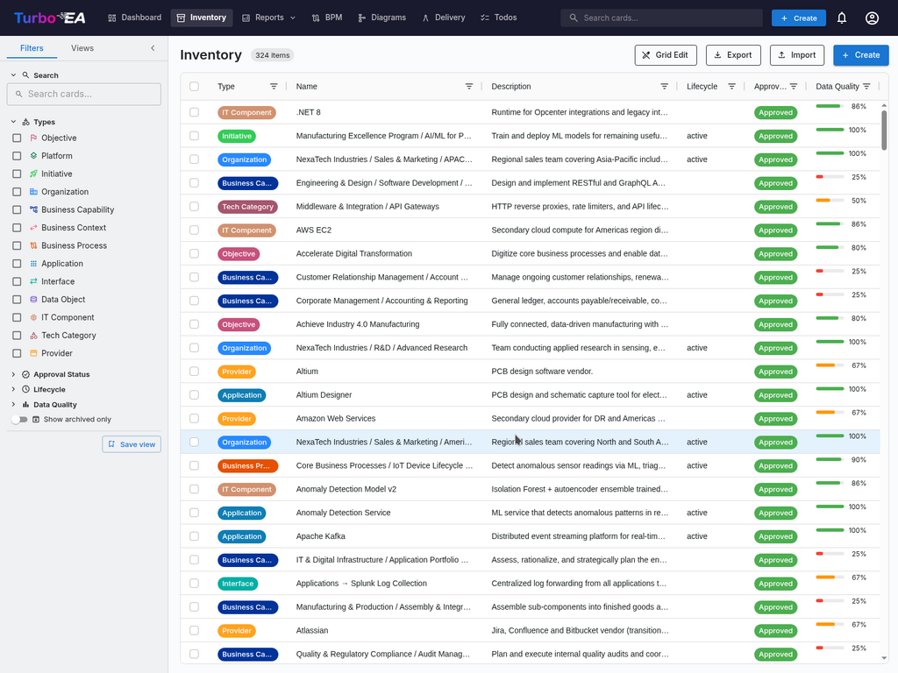
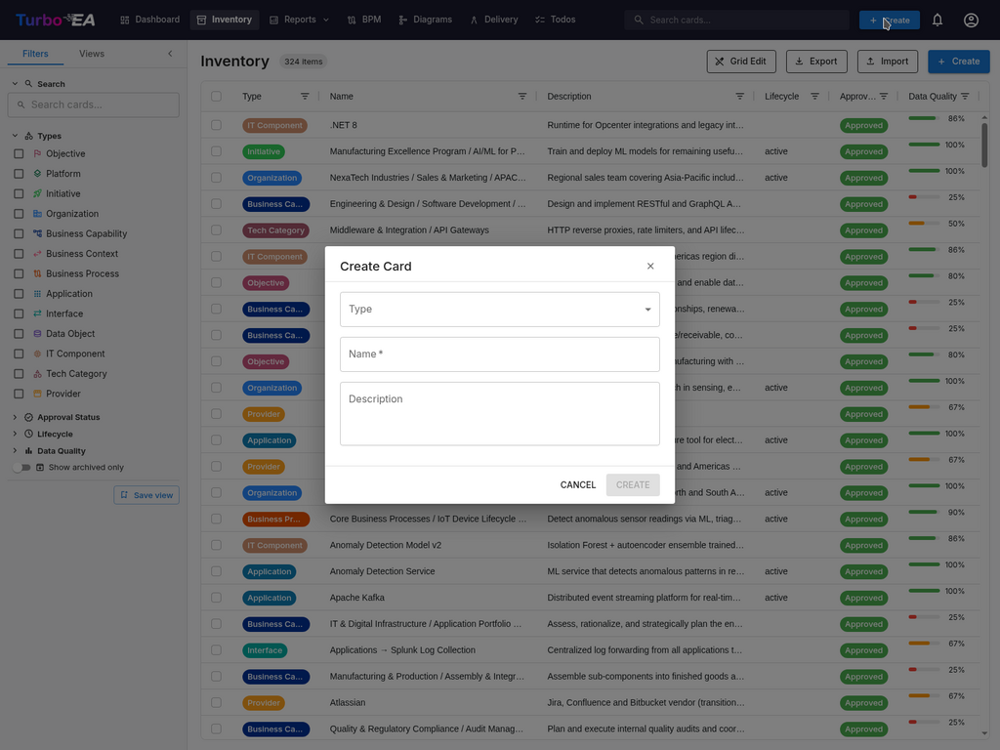

# 清单

**清单**是 Turbo EA 的核心。这里列出了企业架构的所有**卡片**（组件）：应用程序、流程、业务能力、组织、供应商、接口等等。

## 清单界面结构

### 左侧筛选面板

左侧边栏面板允许您按不同条件**筛选**卡片：

- **搜索** —— 按卡片名称进行自由文本搜索
- **类型** —— 按一种或多种卡片类型筛选：目标、平台、项目、组织、业务能力、业务上下文、业务流程、应用程序、接口、数据对象、IT 组件、技术类别、供应商、系统
- **子类型** —— 选择类型后，可进一步按子类型筛选（例如，应用程序 → 业务应用、微服务、AI 代理、部署）
- **审批状态** —— 草稿、已批准、已变更或已拒绝
- **生命周期** —— 按生命周期阶段筛选：规划、引入、活跃、淘汰、生命周期结束
- **数据质量** —— 基于阈值筛选：良好（80%+）、中等（50-79%）、较差（低于 50%）
- **标签** —— 按任何标签组的标签筛选
- **关系** —— 按跨关系类型的关联卡片筛选
- **自定义属性** —— 按自定义字段的值筛选（文本搜索、选择选项）
- **仅显示已归档** —— 切换查看已归档（软删除）的卡片
- **清除全部** —— 一次性重置所有活跃筛选条件

**活跃筛选数量**徽章显示当前应用了多少个筛选条件。

### 主表格

清单使用 **AG Grid** 数据表格，具有强大的功能：

| 列 | 描述 |
|----|------|
| **类型** | 带颜色编码图标的卡片类型 |
| **名称** | 组件名称（点击打开卡片详情） |
| **描述** | 简要描述 |
| **生命周期** | 当前生命周期状态 |
| **审批状态** | 审核状态徽章 |
| **数据质量** | 带可视化圆环的完整度百分比 |
| **关系** | 关系数量，可点击弹出窗口显示关联卡片 |

**表格功能：**

- **排序** —— 点击任何列标题进行升序/降序排序
- **行内编辑** —— 在网格编辑模式下，直接在表格中编辑字段值
- **多选** —— 选择多行进行批量操作
- **层级显示** —— 父子关系以面包屑路径显示
- **列配置** —— 显示、隐藏和重新排列列

### 工具栏

- **网格编辑** —— 切换行内编辑模式以在表格中编辑多张卡片
- **导出** —— 以 Excel (.xlsx) 文件下载数据
- **导入** —— 从 Excel 文件批量上传数据
- **+ 创建** —— 创建新卡片

## 如何创建新卡片

1. 点击**+ 创建**按钮（蓝色，右上角）
2. 在弹出的对话框中：
   - 选择卡片的**类型**（应用程序、流程、目标等）
   - 输入组件的**名称**
   - 可选填写**描述**
3. 可选点击**AI 建议**自动生成描述（参见下方 [AI 描述建议](#ai-描述建议)）
4. 点击**创建**

## AI 描述建议

Turbo EA 可以使用 **AI 为任何卡片生成描述**。此功能适用于创建卡片对话框和现有卡片详情页面。

**工作原理：**

1. 输入卡片名称并选择类型
2. 点击卡片标题中的**星光图标**，或在创建卡片对话框中点击**AI 建议**按钮
3. 系统执行**网络搜索**（使用类型感知的上下文 —— 例如「SAP S/4HANA 软件应用程序」），然后将结果发送给 **LLM** 生成简洁、事实性的描述
4. 建议面板显示：
   - **可编辑的描述** —— 在应用前查看和修改文本
   - **置信度评分** —— 表示 AI 的确定程度（高 / 中 / 低）
   - **可点击的来源链接** —— 描述所引用的网页
   - **模型名称** —— 生成建议的 LLM
5. 点击**应用描述**保存，或点击**取消**放弃

**主要特点：**

- **类型感知**：AI 理解卡片类型上下文。「应用程序」搜索会添加「软件应用程序」，「供应商」搜索会添加「技术供应商」等。
- **隐私优先**：使用 Ollama 时，LLM 在本地运行 —— 您的数据永远不会离开您的基础设施。也支持商业提供商（OpenAI、Google Gemini、Anthropic Claude 等）
- **管理员控制**：AI 建议必须由管理员在[设置 > AI 建议](../admin/ai.md)中启用。管理员选择哪些卡片类型显示建议按钮，配置 LLM 提供商，以及选择网络搜索提供商
- **基于权限**：只有拥有 `ai.suggest` 权限的用户才能使用此功能（默认对管理员、BPM 管理员和成员角色启用）

## 已保存视图（书签）

您可以将当前的筛选、列和排序配置保存为**命名视图**以便快速复用。

### 创建已保存视图

1. 按您期望的筛选条件、列和排序配置清单
2. 点击筛选面板中的**书签**图标
3. 输入视图的**名称**
4. 选择**可见性**：
   - **私有** —— 仅您可见
   - **共享** —— 对特定用户可见（可选编辑权限）
   - **公开** —— 对所有用户可见

### 使用已保存视图

已保存视图显示在筛选面板侧边栏中。点击任何视图可立即应用其配置。视图按以下类别组织：

- **我的视图** —— 您创建的视图
- **与我共享** —— 他人与您共享的视图
- **公开视图** —— 所有人可用的视图

## Excel 导入

点击工具栏中的**导入**可从 Excel 文件批量创建或更新卡片。

1. **选择文件** —— 拖放 `.xlsx` 文件或点击浏览
2. **选择卡片类型** —— 可选择将导入限制为特定类型
3. **验证** —— 系统分析文件并显示验证报告：
   - 将创建新卡片的行
   - 将更新现有卡片的行（按名称或 ID 匹配）
   - 警告和错误
4. **导入** —— 点击继续。进度条显示实时状态
5. **结果** —— 摘要显示创建、更新或失败的卡片数量

## Excel 导出

点击**导出**将当前清单视图下载为 Excel 文件：

- **多类型导出** —— 导出所有可见卡片的核心列（名称、类型、描述、子类型、生命周期、审批状态）
- **单类型导出** —— 筛选到单一类型时，导出包含展开的自定义属性列（每个字段一列）
- **生命周期展开** —— 每个生命周期阶段日期有单独的列（规划、引入、活跃、淘汰、生命周期结束）
- **带日期的文件名** —— 文件以导出日期命名，便于组织管理
