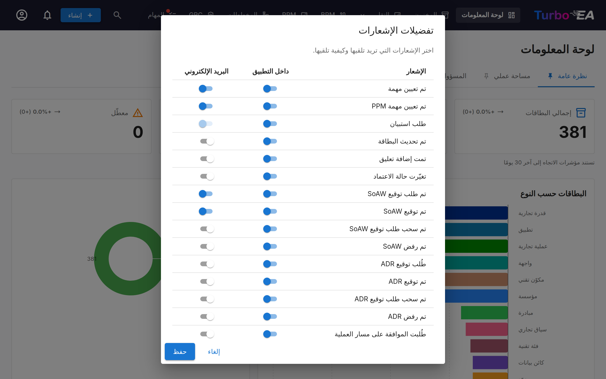

# الإشعارات

يُبقيك Turbo EA على اطّلاع بالتغييرات التي تطرأ على البطاقات والمهام والمستندات التي تهمّك. تُسلَّم الإشعارات **داخل التطبيق** (عبر جرس الإشعارات) واختياريًا **عبر البريد الإلكتروني** إذا كان إرسال البريد الإلكتروني مهيّأً.

## جرس الإشعارات

تُظهِر **أيقونة الجرس** في شريط التنقّل العلوي شارة بعدد الإشعارات غير المقروءة. انقر عليها لفتح قائمة منسدلة تحتوي على آخر 20 إشعارًا لديك.

يعرض كل إشعار:

- **أيقونة** تشير إلى نوع الإشعار
- **ملخّصًا** لما حدث (مثل "تم إسناد مهمة إليك على SAP S/4HANA")
- **الوقت** المنقضي منذ إنشاء الإشعار (مثل "قبل 5 دقائق")

انقر على أي إشعار للانتقال مباشرةً إلى البطاقة أو المستند ذي الصلة. تُعلَّم الإشعارات تلقائيًا كمقروءة عند عرضها.

## أنواع الإشعارات

| النوع | المُحفِّز |
|------|---------|
| **إسناد مهمة** | تُسنَد مهمة إليك |
| **تحديث بطاقة** | يتم تحديث بطاقة أنت صاحب مصلحة فيها |
| **إضافة تعليق** | يُنشَر تعليق جديد على بطاقة أنت صاحب مصلحة فيها |
| **تغيّر حالة الموافقة** | تتغيّر حالة موافقة بطاقة (مُعتمدة، مرفوضة، مكسورة) |
| **طلب توقيع SoAW** | يُطلَب منك توقيع Statement of Architecture Work |
| **توقيع SoAW** | تتلقّى وثيقة SoAW التي تتتبّعها توقيعًا |
| **طلب استبيان** | يُرسَل استبيان يتطلّب ردّك |

يشمل **تغيّر حالة الموافقة** الحالة التلقائية أيضًا. تنتقل البطاقة المُعتمدة إلى
**مكسورة** بمجرّد أن يعدّلها أحدهم، أو عندما تؤدّي أرشفة البطاقة الأصل إلى نقلها
داخل التسلسل الهرمي — ويصلك إشعار في الحالتين، وتُسجَّل التغييرات في تبويب
**السجلّ** الخاص بالبطاقة. وعندما يكسر إجراء واحد عدّة بطاقات تخصّك في الوقت نفسه،
كالتحرير الجماعي، تتلقّى ملخّصًا واحدًا بدلًا من إشعار لكل بطاقة.

## التسليم في الوقت الفعلي

تُسلَّم الإشعارات في الوقت الفعلي باستخدام Server-Sent Events (SSE). لست بحاجة إلى تحديث الصفحة — تظهر الإشعارات الجديدة تلقائيًا ويُحدَّث عدّاد الشارة على الفور.

## تفضيلات الإشعارات

انقر على **أيقونة الترس** في القائمة المنسدلة للإشعارات (أو انتقل إلى قائمة ملفك الشخصي) لتهيئة تفضيلات الإشعارات الخاصة بك.

لكل نوع إشعار، يمكنك التبديل بشكل مستقل:

- **داخل التطبيق** — ما إذا كان يظهر في جرس الإشعارات
- **البريد الإلكتروني** — ما إذا كان يُرسَل بريد إلكتروني أيضًا (يتطلّب تهيئة إرسال البريد الإلكتروني من قِبل مسؤول)

قد تفرض بعض أنواع الإشعارات (مثل طلبات الاستبيان) التسليم عبر البريد الإلكتروني من قِبل النظام ولا يمكن تعطيلها.

كل قناة مستقلة: إيقاف نوع في الجرس لا يوقف بريده الإلكتروني، والعكس صحيح. وهناك
أنواع قليلة تمرّ عبر الجرس فقط — مثل إعلان الترقية الذي يصل إلى كل حساب — وتبقى
بقية مفاتيحها مطفأة بشكل ثابت.

وإذا كان هناك امتداد مثبَّت ومرخَّص يسلّم الإشعارات في مكان آخر (رسالة محادثة على
سبيل المثال)، فإنه يضيف عمودًا خاصًا به إلى جانب «داخل التطبيق» و«البريد
الإلكتروني»، وتختار لكل نوع ما إذا كان يُرسَل إلى هناك. تبدأ هذه الأعمدة دائمًا
**مطفأة**. وتعطيل الامتداد أو انتهاء ترخيصه يُخفي العمود ويوقف التسليم مؤقتًا،
لكنه يحتفظ بكل ما اخترته — ويعود كل شيء مع عودة الامتداد. و[Slack Notifications](../extensions/slack-notify.md) واحد من هذه الامتدادات.

يمكن للامتداد أيضاً أن يعلن عن أنواع إشعارات خاصة به — مثل **إشعارات الأتمتة** — تظهر هنا كصفوف مستقلة (داخل التطبيق مفعّل، والبريد معطّل افتراضياً) لتضبطها بمعزل عن الصف العام **تنبيه الامتداد**. إذا عُطّل الامتداد أو انتهت رخصته تختفي صفوفه حتى يعود؛ وتُحفظ اختياراتك. تفتح بعض إشعارات الامتدادات **تفاصيلها** داخل التطبيق عند النقر بدلاً من نقلك إلى صفحة: الرسالة الكاملة، مع أزرار لفتح البطاقة المرتبطة أو صفحة الامتداد عندما يُسمح لك بذلك.
