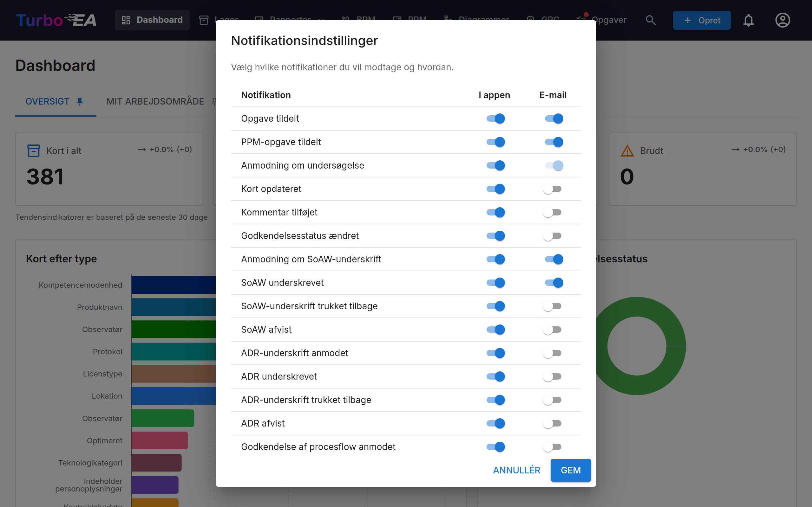

# Notifikationer

Turbo EA holder dig informeret om ændringer i kort, opgaver og dokumenter, der betyder noget for dig. Notifikationer leveres **i appen** (via notifikationsklokken) og valgfrit **via e-mail**, hvis e-mail-afsendelse er konfigureret.

## Notifikationsklokke

**Klokkeikonet** i topnavigationslinjen viser et mærke med antallet af ulæste notifikationer. Klik på det for at åbne en dropdown med dine 20 seneste notifikationer.

Hver notifikation viser:

- **Ikon**, der angiver notifikationstypen
- **Sammendrag** af hvad der skete (f.eks. "En opgave blev tildelt dig på SAP S/4HANA")
- **Tid** siden notifikationen blev oprettet (f.eks. "5 minutter siden")

Klik på en hvilken som helst notifikation for at navigere direkte til det relevante kort eller dokument. Notifikationer markeres automatisk som læst, når du ser dem.

## Notifikationstyper

| Type | Udløser |
|------|---------|
| **Opgave tildelt** | En opgave er tildelt dig |
| **Kort opdateret** | Et kort, du er interessent på, opdateres |
| **Kommentar tilføjet** | En ny kommentar postes på et kort, du er interessent på |
| **Godkendelsesstatus ændret** | Et korts godkendelsesstatus ændres (godkendt, afvist, brudt) |
| **SoAW-signatur anmodet** | Du bliver bedt om at underskrive en Statement of Architecture Work |
| **SoAW underskrevet** | En SoAW, du sporer, modtager en underskrift |
| **Undersøgelsesanmodning** | En undersøgelse sendes, der kræver dit svar |

## Levering i realtid

Notifikationer leveres i realtid ved hjælp af Server-Sent Events (SSE). Du behøver ikke at opdatere siden — nye notifikationer vises automatisk, og mærkeantallet opdateres øjeblikkeligt.

## Notifikationspræferencer

Klik på **tandhjulsikonet** i notifikationsdropdownen (eller gå til din profilmenu) for at konfigurere dine notifikationspræferencer.

For hver notifikationstype kan du uafhængigt slå til/fra:

- **I appen** — Om den vises i notifikationsklokken
- **E-mail** — Om en e-mail også sendes (kræver, at e-mail-afsendelse er konfigureret af en administrator)

Nogle notifikationstyper (f.eks. undersøgelsesanmodninger) kan have e-maillevering håndhævet af systemet og kan ikke deaktiveres.

Hver kanal er uafhængig: at slå en type fra i klokken stopper ikke dens e-mail,
og omvendt. Nogle få typer går kun via klokken — for eksempel
opgraderingsmeddelelsen, der når alle konti — og deres øvrige kontakter er låst
fra.

Hvis en udvidelse, der leverer notifikationer et andet sted (for eksempel som en
chatbesked), er installeret og licenseret, tilføjer den sin egen kolonne ved
siden af «I appen» og «E-mail», og du vælger pr. type, om notifikationen sendes
dertil. De kolonner starter altid **fra**. Deaktiveres udvidelsen, eller udløber
dens licens, skjules kolonnen og leveringen sættes på pause, men alt hvad du
valgte, bevares — det kommer tilbage sammen med udvidelsen. [Slack Notifications](../extensions/slack-notify.md) er en sådan udvidelse.