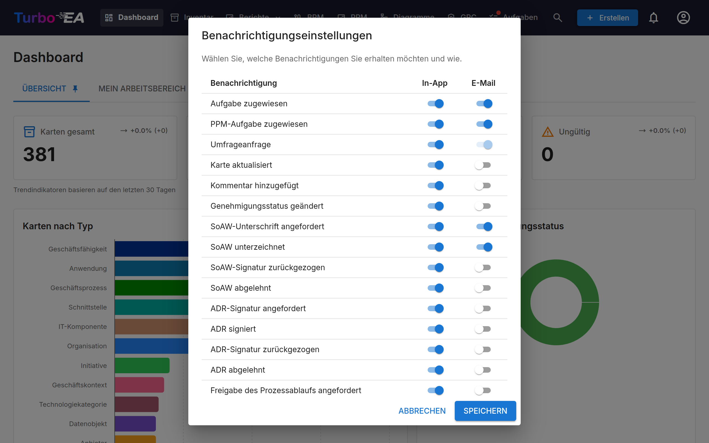

# Benachrichtigungen

Turbo EA hält Sie über Änderungen an Karten, Aufgaben und Dokumenten, die für Sie relevant sind, auf dem Laufenden. Benachrichtigungen werden **in der Anwendung** (über die Benachrichtigungsglocke) und optional **per E-Mail** zugestellt, sofern der E-Mail-Versand konfiguriert ist.

## Benachrichtigungsglocke

Das **Glockensymbol** in der oberen Navigationsleiste zeigt ein Badge mit der Anzahl ungelesener Benachrichtigungen. Klicken Sie darauf, um ein Dropdown mit Ihren 20 neuesten Benachrichtigungen zu öffnen.

Jede Benachrichtigung zeigt:

- **Symbol**, das den Benachrichtigungstyp anzeigt
- **Zusammenfassung** des Geschehens (z.B. «Eine Aufgabe wurde Ihnen für SAP S/4HANA zugewiesen»)
- **Zeitangabe** seit der Erstellung der Benachrichtigung (z.B. «vor 5 Minuten»)

Klicken Sie auf eine beliebige Benachrichtigung, um direkt zur relevanten Karte oder zum Dokument zu navigieren. Benachrichtigungen werden automatisch als gelesen markiert, wenn Sie sie anzeigen.

## Benachrichtigungstypen

| Typ | Auslöser |
|-----|----------|
| **Aufgabe zugewiesen** | Eine Aufgabe wird Ihnen zugewiesen |
| **Karte aktualisiert** | Eine Karte, bei der Sie Stakeholder sind, wird aktualisiert |
| **Kommentar hinzugefügt** | Ein neuer Kommentar wird auf einer Karte gepostet, bei der Sie Stakeholder sind |
| **Genehmigungsstatus geändert** | Der Genehmigungsstatus einer Karte ändert sich (genehmigt, abgelehnt, ungültig) |
| **SoAW-Unterschrift angefordert** | Sie werden gebeten, ein Statement of Architecture Work zu unterschreiben |
| **SoAW unterschrieben** | Ein SoAW, das Sie verfolgen, erhält eine Unterschrift |
| **Umfrageanfrage** | Eine Umfrage wurde gesendet, die Ihre Antwort erfordert |

**Genehmigungsstatus geändert** deckt auch den automatischen Fall ab. Eine
genehmigte Karte wird auf **Ungültig** gesetzt, sobald sie jemand bearbeitet oder
wenn das Archivieren ihrer übergeordneten Karte sie in der Hierarchie verschiebt
— Sie werden in beiden Fällen benachrichtigt, und die Änderung wird auf dem Tab
**Verlauf** der Karte festgehalten. Wenn eine Aktion mehrere Ihrer Karten
gleichzeitig betrifft, etwa eine Massenbearbeitung, erhalten Sie eine einzige
Zusammenfassung statt einer Benachrichtigung pro Karte.

## Echtzeit-Zustellung

Benachrichtigungen werden in Echtzeit über Server-Sent Events (SSE) zugestellt. Sie müssen die Seite nicht aktualisieren — neue Benachrichtigungen erscheinen automatisch und die Badge-Anzahl wird sofort aktualisiert.

## Benachrichtigungseinstellungen

Klicken Sie auf das **Zahnradsymbol** im Benachrichtigungs-Dropdown (oder gehen Sie zu Ihrem Profilmenü), um Ihre Benachrichtigungseinstellungen zu konfigurieren.

Für jeden Benachrichtigungstyp können Sie unabhängig umschalten:

- **In der App** — Ob sie in der Benachrichtigungsglocke erscheint
- **E-Mail** — Ob zusätzlich eine E-Mail gesendet wird (erfordert einen von einem Administrator konfigurierten E-Mail-Versand)

Einige Benachrichtigungstypen (z.B. Umfrageanfragen) können eine vom System erzwungene E-Mail-Zustellung haben und können nicht deaktiviert werden.

Jeder Kanal ist unabhängig: Einen Typ in der Glocke abzuschalten stoppt nicht
seine E-Mail und umgekehrt. Einige wenige Typen sind reine Glocken-Typen — etwa
die Upgrade-Ankündigung, die jedes Konto erreicht — und ihre übrigen Schalter
sind fest aus.

Ist eine Erweiterung installiert und lizenziert, die Benachrichtigungen anderswo
zustellt (etwa als Chat-Nachricht), fügt sie neben «In der App» und «E-Mail»
eine eigene Spalte hinzu, und Sie wählen pro Typ, ob er dorthin geht. Diese
Spalten sind immer zunächst **aus**. Wird die Erweiterung deaktiviert oder läuft
ihre Lizenz ab, verschwindet die Spalte und die Zustellung pausiert — Ihre
Einstellungen bleiben jedoch erhalten und kehren mit der Erweiterung zurück. [Slack Notifications](../extensions/slack-notify.md) ist eine solche Erweiterung.

Eine Erweiterung kann außerdem eigene Benachrichtigungstypen deklarieren — etwa **Automatisierungs-Benachrichtigungen** —, die hier als eigene Zeilen erscheinen (In-App standardmäßig an, E-Mail aus), sodass Sie sie getrennt von der allgemeinen Zeile **Erweiterungshinweis** einstellen. Wird die Erweiterung deaktiviert oder läuft ihre Lizenz ab, verschwinden ihre Zeilen, bis sie zurückkehrt; Ihre Auswahl bleibt erhalten. Manche Erweiterungsbenachrichtigungen öffnen beim Klick ihre **Details** in der App statt zu einer Seite zu führen: die vollständige Nachricht sowie Schaltflächen, um die zugehörige Karte oder die Seite der Erweiterung zu öffnen, sofern Sie dazu berechtigt sind.