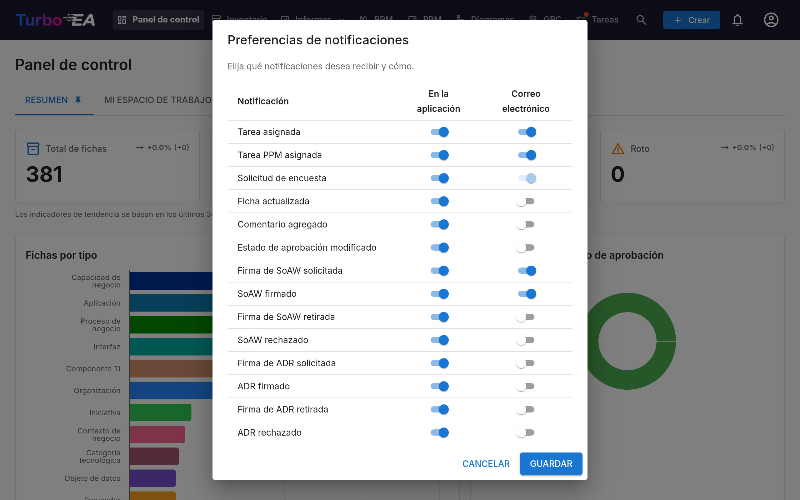

# Notificaciones

Turbo EA le mantiene informado sobre cambios en fichas, tareas y documentos que le importan. Las notificaciones se entregan **en la aplicación** (mediante la campana de notificaciones) y opcionalmente **por correo electrónico** si el envío de correo está configurado.

## Campana de Notificaciones

El **icono de campana** en la barra de navegación superior muestra una insignia con la cantidad de notificaciones no leídas. Haga clic para abrir un menú desplegable con las 20 notificaciones más recientes.

Cada notificación muestra:

- **Icono** que indica el tipo de notificación
- **Resumen** de lo que sucedió (ej., «Se le asignó una tarea en SAP S/4HANA»)
- **Tiempo** desde que se creó la notificación (ej., «hace 5 minutos»)

Haga clic en cualquier notificación para navegar directamente a la ficha o documento relevante. Las notificaciones se marcan como leídas automáticamente cuando las visualiza.

## Tipos de Notificaciones

| Tipo | Evento |
|------|--------|
| **Tarea asignada** | Se le asigna una tarea |
| **Ficha actualizada** | Se actualiza una ficha en la que es parte interesada |
| **Comentario agregado** | Se publica un nuevo comentario en una ficha en la que es parte interesada |
| **Estado de aprobación cambiado** | Cambia el estado de aprobación de una ficha (aprobada, rechazada, rota) |
| **Solicitud de firma SoAW** | Se le solicita firmar una Declaración de Trabajo de Arquitectura |
| **SoAW firmado** | Un SoAW que está siguiendo recibe una firma |
| **Solicitud de encuesta** | Se envía una encuesta que requiere su respuesta |

**Estado de aprobación cambiado** también cubre el caso automático. Una ficha
aprobada pasa a **Rota** en cuanto alguien la edita, o cuando archivar su ficha
principal la desplaza en la jerarquía: se le notifica en ambos casos y el cambio
queda registrado en la pestaña **Historial** de la ficha. Cuando una sola acción
rompe varias de sus fichas a la vez, como una edición masiva, recibe un único
resumen en lugar de una notificación por ficha.

## Entrega en Tiempo Real

Las notificaciones se entregan en tiempo real utilizando Server-Sent Events (SSE). No necesita actualizar la página — las nuevas notificaciones aparecen automáticamente y el contador de la insignia se actualiza al instante.

## Preferencias de Notificaciones

Haga clic en el **icono de engranaje** en el menú desplegable de notificaciones (o vaya al menú de su perfil) para configurar sus preferencias de notificaciones.

Para cada tipo de notificación, puede alternar de forma independiente:

- **En la aplicación** — Si aparece en la campana de notificaciones
- **Correo electrónico** — Si también se envía un correo electrónico (requiere que un administrador configure el envío de correo)

Algunos tipos de notificaciones (ej., solicitudes de encuesta) pueden tener la entrega por correo electrónico obligatoria por el sistema y no pueden desactivarse.

Cada canal es independiente: desactivar un tipo en la campana no detiene su
correo, ni al revés. Unos pocos tipos solo pasan por la campana —el aviso de
actualización que llega a todas las cuentas, por ejemplo— y sus demás
interruptores quedan fijos en «desactivado».

Si hay instalada y con licencia una extensión que entrega las notificaciones en
otro sitio (un mensaje de chat, por ejemplo), esta añade su propia columna junto
a «En la aplicación» y «Correo», y usted elige tipo por tipo si la notificación
va allí. Esas columnas empiezan siempre **desactivadas**. Desactivar la extensión
o dejar que caduque su licencia oculta la columna y pausa la entrega, pero
conserva todo lo que eligió: vuelve con la extensión. [Slack Notifications](../extensions/slack-notify.md) es una de esas extensiones.

Una extensión también puede declarar sus propios tipos de notificación — por ejemplo **Notificaciones de automatizaciones** —, que aparecen aquí como filas propias (en la aplicación activado, correo desactivado por defecto), para ajustarlas por separado de la fila genérica **Aviso de extensión**. Si la extensión se desactiva o su licencia caduca, sus filas desaparecen hasta que vuelva; lo que eligió se conserva. Algunas notificaciones de extensiones abren sus **detalles** en la aplicación al hacer clic en lugar de llevarle a una página: el mensaje completo, más botones para abrir la ficha relacionada o la página de la extensión cuando tiene permiso.