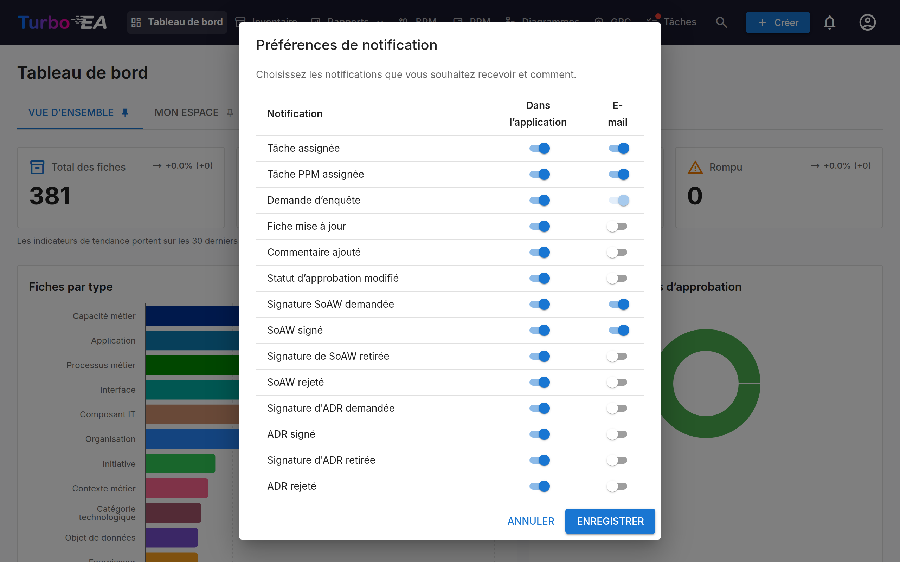

# Notifications

Turbo EA vous tient informé des modifications apportées aux fiches, tâches et documents qui vous concernent. Les notifications sont délivrées **dans l'application** (via la cloche de notification) et optionnellement **par e-mail** si l'envoi d'e-mails est configuré.

## Cloche de notification

L'**icône de cloche** dans la barre de navigation supérieure affiche un badge avec le nombre de notifications non lues. Cliquez dessus pour ouvrir un menu déroulant avec vos 20 notifications les plus récentes.

Chaque notification affiche :

- **Icône** indiquant le type de notification
- **Résumé** de ce qui s'est passé (par ex. « Une tâche vous a été assignée sur SAP S/4HANA »)
- **Temps** écoulé depuis la création de la notification (par ex. « il y a 5 minutes »)

Cliquez sur n'importe quelle notification pour naviguer directement vers la fiche ou le document correspondant. Les notifications sont automatiquement marquées comme lues lorsque vous les consultez.

## Types de notifications

| Type | Déclencheur |
|------|-------------|
| **Tâche assignée** | Une tâche vous est assignée |
| **Fiche mise à jour** | Une fiche sur laquelle vous êtes partie prenante est mise à jour |
| **Commentaire ajouté** | Un nouveau commentaire est publié sur une fiche sur laquelle vous êtes partie prenante |
| **Statut d'approbation modifié** | Le statut d'approbation d'une fiche change (approuvé, rejeté, cassé) |
| **Demande de signature SoAW** | On vous demande de signer un Statement of Architecture Work |
| **SoAW signé** | Un SoAW que vous suivez reçoit une signature |
| **Demande d'enquête** | Une enquête vous est envoyée et nécessite votre réponse |

**Statut d'approbation modifié** couvre également le cas automatique. Une fiche
approuvée passe à **Cassé** dès que quelqu'un la modifie, ou lorsque l'archivage
de sa fiche parente la déplace dans la hiérarchie — vous êtes averti dans les deux
cas, et le changement est consigné dans l'onglet **Historique** de la fiche.
Lorsqu'une seule action casse plusieurs de vos fiches à la fois, comme une
modification en masse, vous recevez un récapitulatif unique plutôt qu'une
notification par fiche.

## Livraison en temps réel

Les notifications sont délivrées en temps réel via Server-Sent Events (SSE). Vous n'avez pas besoin de rafraîchir la page -- les nouvelles notifications apparaissent automatiquement et le badge se met à jour instantanément.

## Préférences de notification

Cliquez sur l'**icône d'engrenage** dans le menu déroulant des notifications (ou allez dans votre menu de profil) pour configurer vos préférences de notification.

Pour chaque type de notification, vous pouvez activer/désactiver indépendamment :

- **Dans l'application** -- Si elle apparaît dans la cloche de notification
- **E-mail** -- Si un e-mail est également envoyé (nécessite que l'envoi d'e-mails soit configuré par un administrateur)

Certains types de notifications (par ex. demandes d'enquête) peuvent avoir la livraison par e-mail imposée par le système et ne peuvent pas être désactivés.

Chaque canal est indépendant : désactiver un type dans la cloche n'arrête pas son
e-mail, et inversement. Quelques types ne passent que par la cloche — l'annonce
de mise à jour qui atteint tous les comptes, par exemple — et leurs autres
interrupteurs sont figés sur «désactivé».

Si une extension qui remet les notifications ailleurs (un message de chat, par
exemple) est installée et sous licence, elle ajoute sa propre colonne à côté de
«Dans l'application» et «E-mail», et vous choisissez type par type si la
notification y est envoyée. Ces colonnes démarrent toujours **désactivées**.
Désactiver l'extension ou laisser sa licence expirer masque la colonne et met la
remise en pause, mais conserve tous vos choix : ils reviennent avec
l'extension. [Slack Notifications](../extensions/slack-notify.md) est l'une de ces extensions.