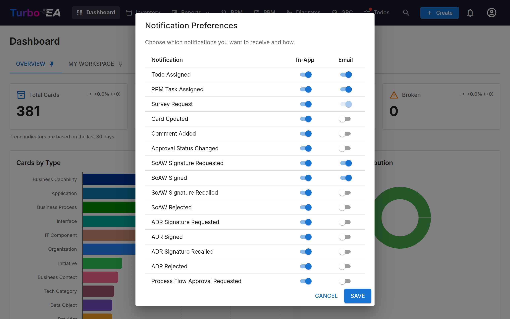

# Notifications

Turbo EA keeps you informed about changes to cards, tasks, and documents that matter to you. Notifications are delivered **in-app** (via the notification bell) and optionally **by email** if email delivery is configured.

## Notification Bell

The **bell icon** in the top navigation bar shows a badge with the count of unread notifications. Click it to open a dropdown with your 20 most recent notifications.

Each notification shows:

- **Icon** indicating the notification type
- **Summary** of what happened (e.g., "A todo was assigned to you on SAP S/4HANA")
- **Time** since the notification was created (e.g., "5 minutes ago")

Click any notification to navigate directly to the relevant card or document. Notifications are automatically marked as read when you view them.

## Notification Types

| Type | Trigger |
|------|---------|
| **Todo assigned** | A todo is assigned to you |
| **Card updated** | A card you are a stakeholder on is updated |
| **Comment added** | A new comment is posted on a card you are a stakeholder on |
| **Approval status changed** | A card's approval status changes (approved, rejected, broken) |
| **SoAW sign requested** | You are asked to sign a Statement of Architecture Work |
| **SoAW signed** | A SoAW you are tracking receives a signature |
| **Survey request** | A survey is sent that requires your response |

**Approval status changed** also covers the automatic case. An approved card
drops to **Broken** whenever somebody edits it, or when archiving its parent
moves it in the hierarchy — you are told either way, and the change is recorded
on the card's **History** tab. Where one action breaks several of your cards at
once, such as a mass edit, you receive a single summary rather than one
notification per card.

## Real-Time Delivery

Notifications are delivered in real time using Server-Sent Events (SSE). You do not need to refresh the page — new notifications appear automatically and the badge count updates instantly.

## Notification Preferences

Click the **gear icon** in the notification dropdown (or go to your profile menu) to configure your notification preferences.

For each notification type, you can independently toggle:

- **In-app** — Whether it appears in the notification bell
- **Email** — Whether an email is also sent (requires email delivery to be configured by an admin)

Some notification types (e.g., survey requests) may have email delivery enforced by the system and cannot be disabled.

Each channel is independent: switching a type off in the bell does not stop its
email, and vice versa. A few types are bell-only — the upgrade announcement that
reaches every account, for example — and their other switches are fixed off.

If an extension that delivers notifications elsewhere (a chat message, for
instance) is installed and licensed, it adds its own column next to In-app and
Email, and you choose per type whether it goes there. Those columns always start
switched **off**. Disabling the extension or letting its licence lapse hides the
column and pauses delivery, but keeps everything you chose — it all comes back if
the extension does. [Slack Notifications](../extensions/slack-notify.md) is one such extension.