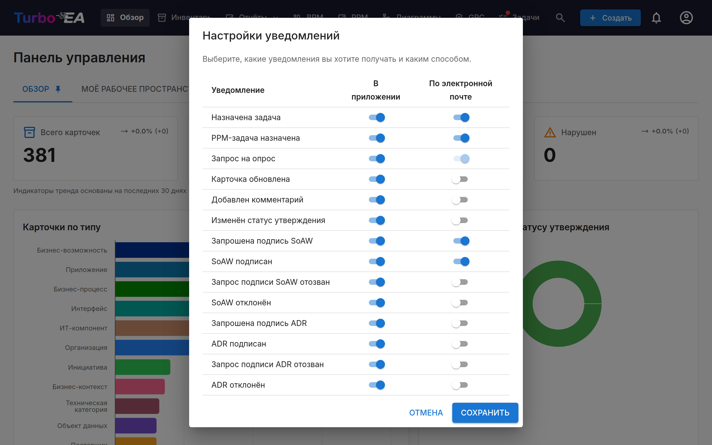

# Уведомления

Turbo EA информирует вас об изменениях в карточках, задачах и документах, которые вам важны. Уведомления доставляются **в приложении** (через колокольчик уведомлений) и по желанию **по электронной почте**, если настроена отправка электронной почты.

## Колокольчик уведомлений

**Иконка колокольчика** в верхней навигационной панели показывает значок с количеством непрочитанных уведомлений. Нажмите на неё, чтобы открыть выпадающий список с 20 последними уведомлениями.

Каждое уведомление показывает:

- **Иконку**, указывающую тип уведомления
- **Краткое описание** произошедшего (например, «Вам назначена задача в SAP S/4HANA»)
- **Время** с момента создания уведомления (например, «5 минут назад»)

Нажмите на любое уведомление, чтобы перейти непосредственно к соответствующей карточке или документу. Уведомления автоматически помечаются как прочитанные при просмотре.

## Типы уведомлений

| Тип | Событие-триггер |
|-----|-----------------|
| **Задача назначена** | Вам назначена задача |
| **Карточка обновлена** | Обновлена карточка, в которой вы являетесь заинтересованной стороной |
| **Добавлен комментарий** | Новый комментарий опубликован к карточке, в которой вы являетесь заинтересованной стороной |
| **Статус утверждения изменён** | Изменился статус утверждения карточки (утверждена, отклонена, нарушена) |
| **Запрошена подпись SoAW** | Вас просят подписать Заявление об архитектурной работе |
| **SoAW подписан** | Отслеживаемый вами SoAW получил подпись |
| **Запрос на опрос** | Отправлен опрос, требующий вашего ответа |

## Доставка в реальном времени

Уведомления доставляются в реальном времени с помощью Server-Sent Events (SSE). Вам не нужно обновлять страницу — новые уведомления появляются автоматически, а счётчик значка обновляется мгновенно.

## Настройки уведомлений

Нажмите **иконку шестерёнки** в выпадающем списке уведомлений (или перейдите в меню профиля), чтобы настроить предпочтения уведомлений.

Для каждого типа уведомлений вы можете независимо переключать:

- **В приложении** — отображать ли уведомление в колокольчике
- **По электронной почте** — отправлять ли также письмо (требуется, чтобы администратор настроил отправку электронной почты)

Некоторые типы уведомлений (например, запросы на опросы) могут иметь принудительную доставку по электронной почте, которую нельзя отключить.

Каждый канал независим: отключение типа в колокольчике не останавливает его
письмо, и наоборот. Несколько типов доступны только в колокольчике — например,
объявление об обновлении, которое получают все учётные записи, — и остальные их
переключатели зафиксированы в положении «выключено».

Если установлено и лицензировано расширение, доставляющее уведомления в другое
место (например, сообщением в чат), оно добавляет собственный столбец рядом с
«В приложении» и «Электронная почта», и вы для каждого типа выбираете, отправлять
ли его туда. Такие столбцы всегда изначально **выключены**. Отключение расширения
или истечение его лицензии скрывает столбец и приостанавливает доставку, но
сохраняет все ваши настройки — они вернутся вместе с расширением. [Slack Notifications](../extensions/slack-notify.md) — одно из таких расширений.