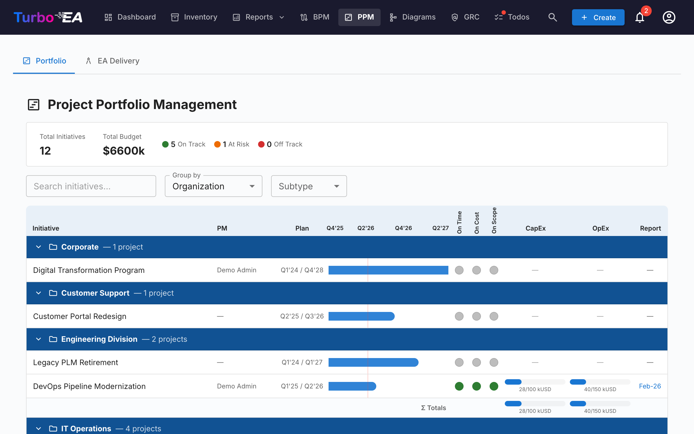
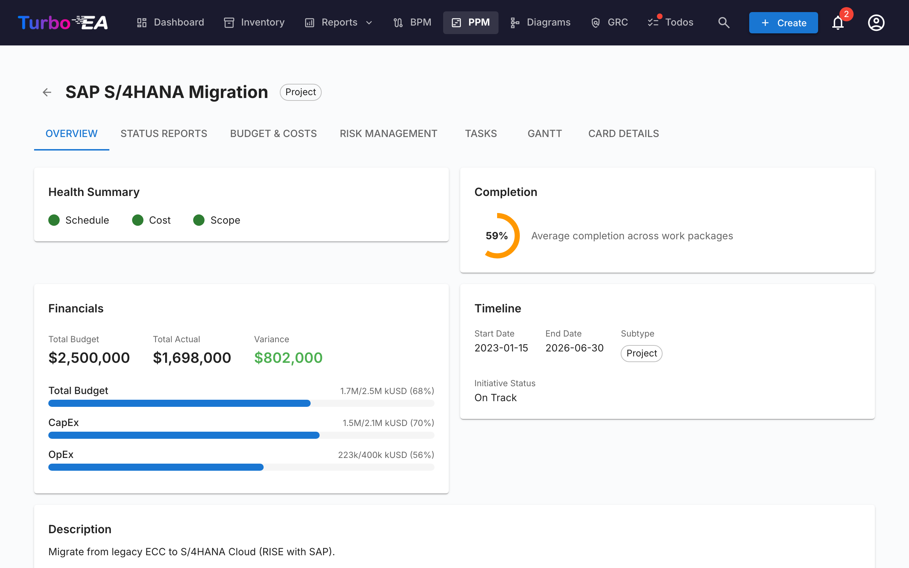
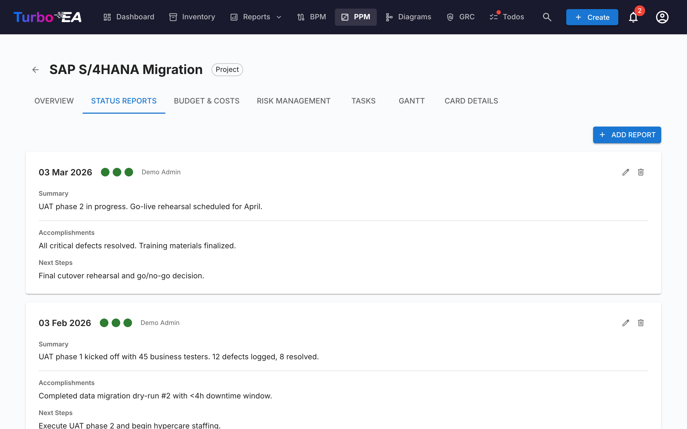
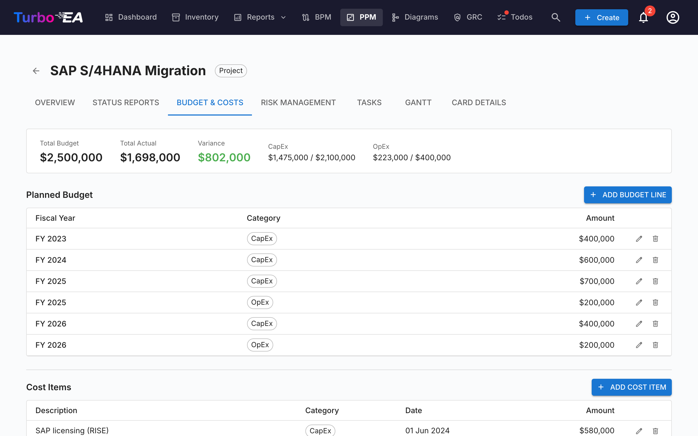
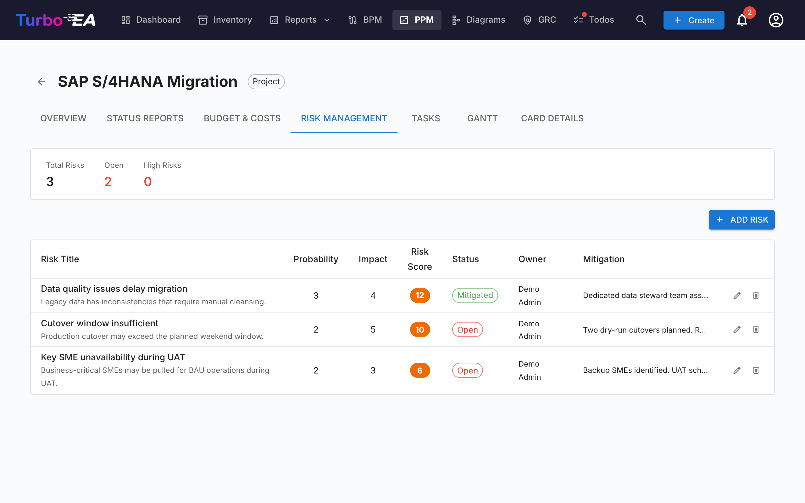
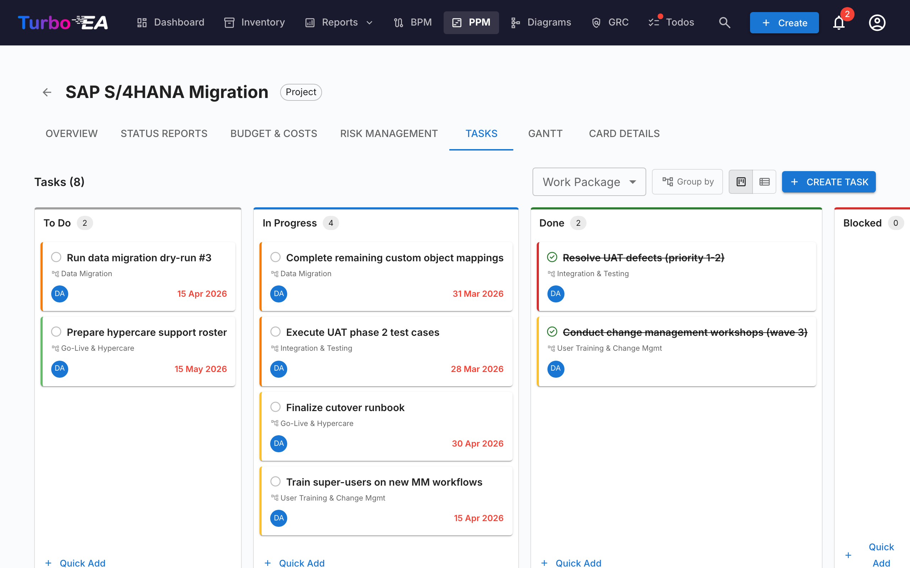
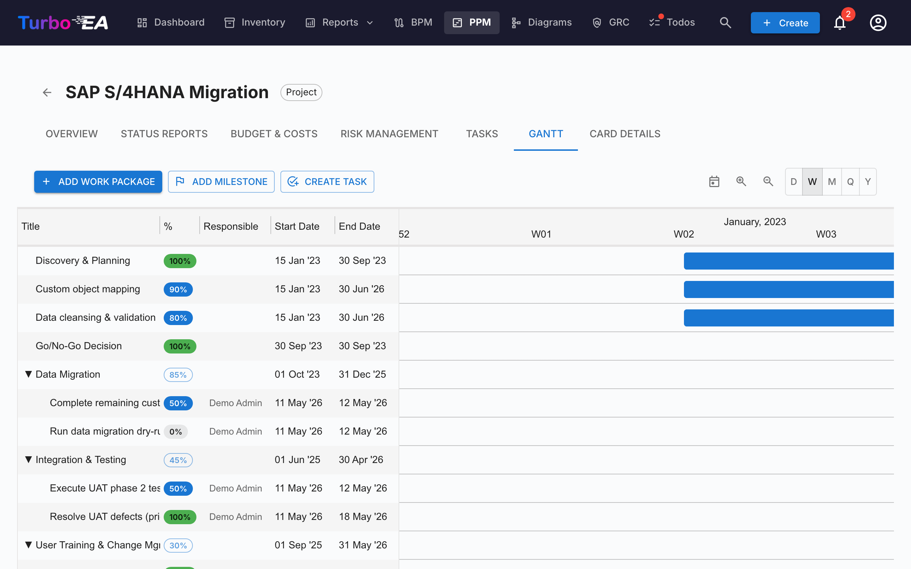

# Project Portfolio Management (PPM)

**PPM**-modulet tilbyder en komplet projekt­porteføljestyringsløsning til at spore initiativer, budgetter, risici, opgaver og tidslinjer. Det integrerer direkte med Initiative-korttypen for at berige hvert projekt med statusrapportering, omkostningssporing og Gantt-visualisering.

!!! note
    PPM-modulet kan slås til eller fra af en administrator i [Indstillinger](../admin/settings.md). Når det er slået fra, skjules PPM-navigation og -funktioner.

## Portefølje-dashboard

**Portefølje-dashboardet** er hovedindgangspunktet for PPM. Det tilbyder:

- **KPI-kort** — Samlede initiativer, samlet budget, samlede faktiske omkostninger og oversigt over sundhedsstatus
- **Sundheds-cirkeldiagrammer** — Fordeling af tidsplan-, omkostnings- og scope-sundhed (On Track / At Risk / Off Track)
- **Status-fordeling** — Opdeling efter initiativ-undertype og status
- **Gantt-oversigt** — Tidslinjebjælker, der viser hvert initiativs start- og slutdatoer, med RAG-sundhedsindikatorer

### Gruppering og filtrering

Brug værktøjslinjen til at:

- **Gruppere efter** en hvilken som helst relateret korttype (f.eks. Organization, Platform) for at se initiativer grupperet efter forretningsenhed eller teknologiplatform
- **Filtrere efter undertype** (Idea, Program, Project, Epic)
- **Søge** efter initiativnavn

Disse filtre vedvarer i URL'en, så opdatering af siden bibeholder din nuværende visning.

## Initiativ-detaljevisning

Klik på et initiativ for at åbne dets detaljeside med syv faner:

### Overview-fane

Overblikket viser et resumé af initiativets sundhed og økonomi:

- **Sundhedsresumé** — Tidsplan-, omkostnings- og scope-indikatorer fra den seneste statusrapport
- **Budget vs. faktisk** — Kombineret KPI-kort, der viser samlet budget og faktisk forbrug med varians
- **Seneste aktivitet** — Resumé af seneste statusrapport

### Statusrapporter-fane

Månedlige statusrapporter sporer projektsundhed over tid. Hver rapport indeholder:

| Felt | Beskrivelse |
|------|-------------|
| **Rapport-dato** | Datoen for rapporteringsperioden |
| **Tidsplan-sundhed** | On Track, At Risk eller Off Track |
| **Omkostnings-sundhed** | On Track, At Risk eller Off Track |
| **Scope-sundhed** | On Track, At Risk eller Off Track |
| **Resumé** | Ledelsesresumé af aktuel status |
| **Resultater** | Hvad der blev opnået i denne periode |
| **Næste skridt** | Planlagte aktiviteter for næste periode |

### Budget og omkostninger-fane

Spor finansielle data med to typer af linjeposter:

- **Budgetlinjer** — Planlagt budget pr. regnskabsår og kategori (CapEx / OpEx). Budgetlinjer grupperes efter den **startmåned for regnskabsåret**, der er konfigureret i [Indstillinger](../admin/settings.md#fiscal-year-start). For eksempel, hvis regnskabsåret begynder i april, tilhører en budgetlinje dateret juni 2026 FY 2026–2027
- **Omkostningslinjer** — Faktiske udgifter med dato, beskrivelse og kategori

Budget- og omkostnings­totaler rulles automatisk op til Initiative-kortets egenskaber `costBudget` og `costActual`. Når PPM-omkostningslinjer findes, markeres disse kort-felter som auto-beregnet og bliver skrivebeskyttede i kortdetaljevisningen.

### Risikostyring-fane

Risikoregistret sporer projektrisici med:

| Felt | Beskrivelse |
|------|-------------|
| **Titel** | Kort beskrivelse af risikoen |
| **Sandsynlighed** | Sandsynlighedsscore (1–5) |
| **Virkning** | Virkningsscore (1–5) |
| **Risikoscore** | Auto-beregnet som sandsynlighed × virkning |
| **Status** | Open, Mitigating, Mitigated, Closed eller Accepted |
| **Afhjælpning** | Planlagte afhjælpningshandlinger |
| **Ejer** | Bruger ansvarlig for at håndtere risikoen |

### Tasks-fane

Opgavestyringen understøtter både **Kanban-tavle**- og **liste**-visninger med fire status-kolonner:

- **To Do** — Opgaver, der endnu ikke er startet
- **In Progress** — Opgaver der aktuelt arbejdes på
- **Done** — Fuldførte opgaver
- **Blocked** — Opgaver der ikke kan fortsætte

Opgaver kan filtreres og grupperes efter Work Breakdown Structure (WBS)-element. Træk og slip kort mellem kolonner for at opdatere status. Hver opgave understøtter:

- Prioritetsniveauer (Critical, High, Medium, Low)
- Tildelt (med notifikation ved tildeling)
- Start- og forfaldsdatoer
- Tags til kategorisering
- Kommentarer til diskussion

Visningsfiltre (visningstilstand, WBS-filter, gruppér-efter-skifter) vedvarer i URL'en på tværs af sideopdateringer.

### Gantt-fane

Gantt-diagrammet visualiserer projekttidslinjen med:

- **Arbejdspakker (WBS)** — Hierarkiske arbejdsbrydningsstruktur-elementer med start-/slutdatoer
- **Opgaver** — Individuelle opgavebjælker linket til arbejdspakker
- **Milepæle** — Nøgledatoer markeret med diamant-indikatorer
- **Fremgangsbjælker** — Visuel fuldførelsesprocent. Klik på procent-chippen på en opgave eller blad-arbejdspakke for at åbne en skyder, der snapper til **0%, 50% eller 100%** — matchende de tre opgavetilstande (To Do, In Progress, Done). Forældre-arbejdspakker med børn viser en skrivebeskyttet chip, hvis værdi rulles automatisk op fra undertræet.
- **Kvartals-mærker** — Tidslinjegitter til orientering

Interager med Gantt-diagrammet ved hjælp af:

- **Træk** bjælker for at om-planlægge elementer
- **Skift størrelse** af bjælkeenderne for at ændre varighed (1-dags granularitet)
- **Højreklik** for kontekstmenu (rediger, tilføj opgave, markér udført, slet)
- **Today-knap** for at rulle til den aktuelle dato
- **View scale-vælger** — vælg mellem Day, Week, Month, Quarter og Year-skalaer; valget huskes i din browser
- **Zoom ind / Zoom ud-knapper** — gå gennem de samme fem skalaer ét hak ad gangen
- **Træk prikken på højre kant af én bjælke over på prikken på venstre kant af en anden** for at oprette en finish-to-start-afhængighedspil. Afhængigheder virker mellem enhver kombination af arbejdspakker og opgaver. Cyklusser afvises automatisk. **Dobbeltklik på en pil** for at fjerne den.

### Card Details-fane

Den sidste fane viser den fulde kortdetaljevisning, inklusive alle standardsektioner (beskrivelse, livscyklus, egenskaber, relationer, interessenter, kommentarer, historik).

## Work Breakdown Structure (WBS)

WBS'en tilbyder en hierarkisk nedbrydning af projektets scope:

- **Arbejdspakker** — Logiske grupperinger af opgaver med start-/slutdatoer og fuldførelses­sporing
- **Milepæle** — Betydelige hændelser eller fuldførelsespunkter
- **Hierarki** — Forældre-barn-relationer mellem WBS-elementer
- **Auto-fuldførelse** — Fuldførelsesprocent beregnes automatisk fra barn-opgavers udført/total-forhold, hvorefter den rulles rekursivt op gennem WBS-hierarkiet til forældre-elementer. Topniveau-fuldførelse repræsenterer det samlede initiativ-fremskridt

## Kortdetalje-integration

Når PPM er aktiveret, viser **Initiative**-kort en **PPM**-fane som den sidste fane i [kortdetaljevisningen](card-details.md). Klikker du på denne fane, navigeres direkte til PPM Initiativ-detaljevisningen (Overview-fane). Dette giver et hurtigt indgangspunkt fra ethvert Initiative-kort til dets fulde PPM-projektside.

Omvendt viser **Card Details**-fanen inden i PPM Initiativ-detaljevisningen standardkortdetaljesektionerne uden PPM-fanen, hvilket undgår cirkulær navigation.

## Tilladelser

| Tilladelse | Beskrivelse |
|------------|-------------|
| `ppm.view` | Se PPM-dashboardet, Gantt-diagram og initiativrapporter. Givet til alle roller som standard |
| `ppm.manage` | Opret og administrer statusrapporter, opgaver, omkostninger, risici og WBS-elementer. Givet til Admin-, BPM Admin- og Member-roller |
| `reports.ppm_dashboard` | Se PPM-portefølje-dashboardet. Givet til alle roller som standard |
