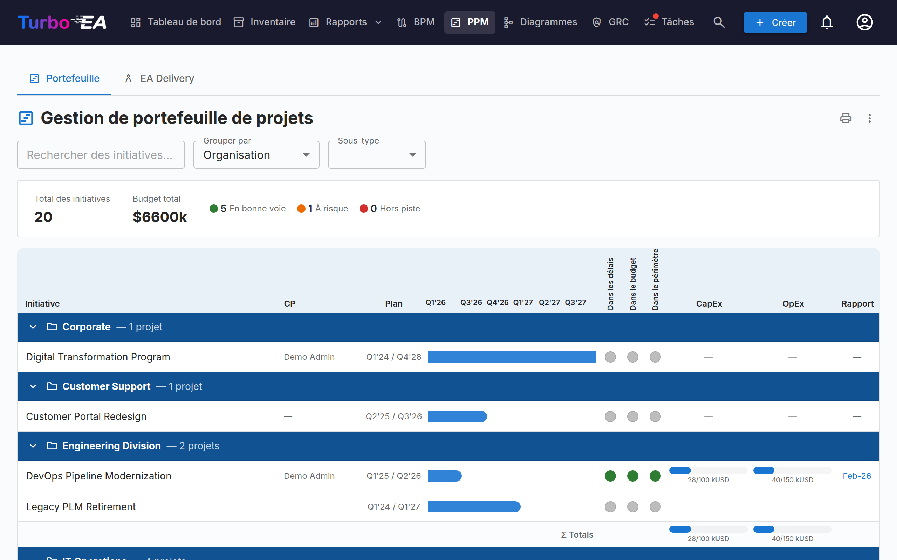
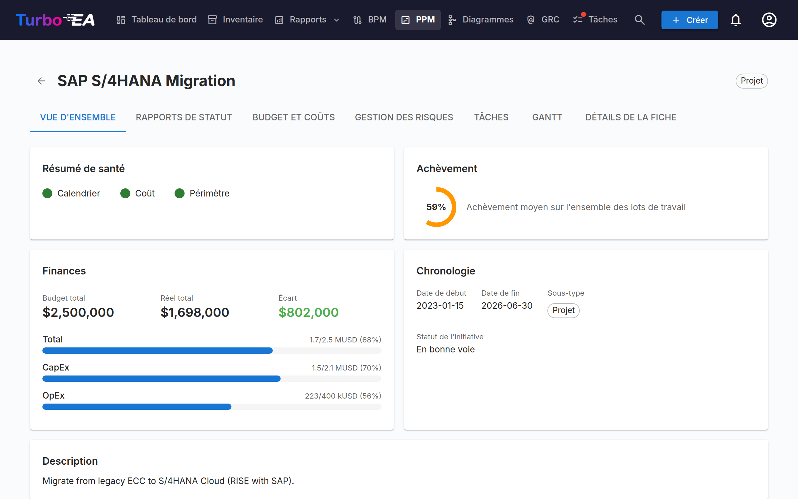
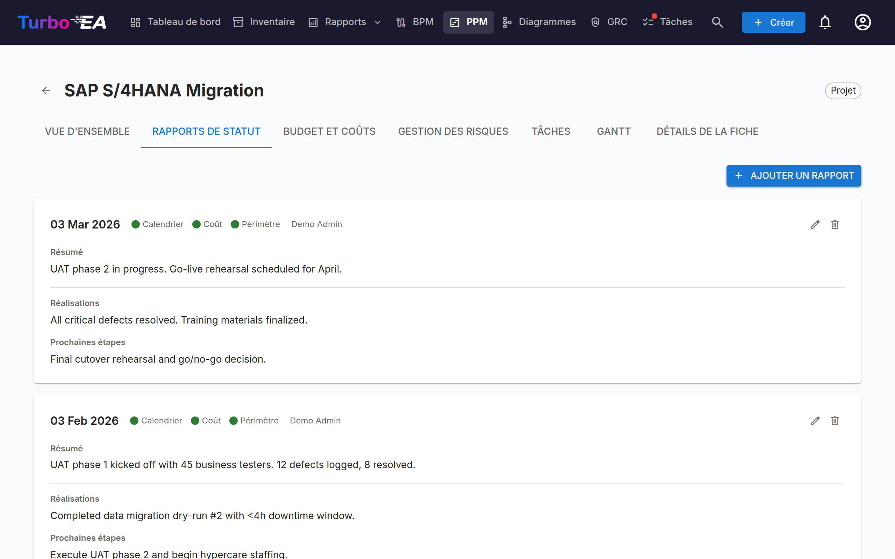
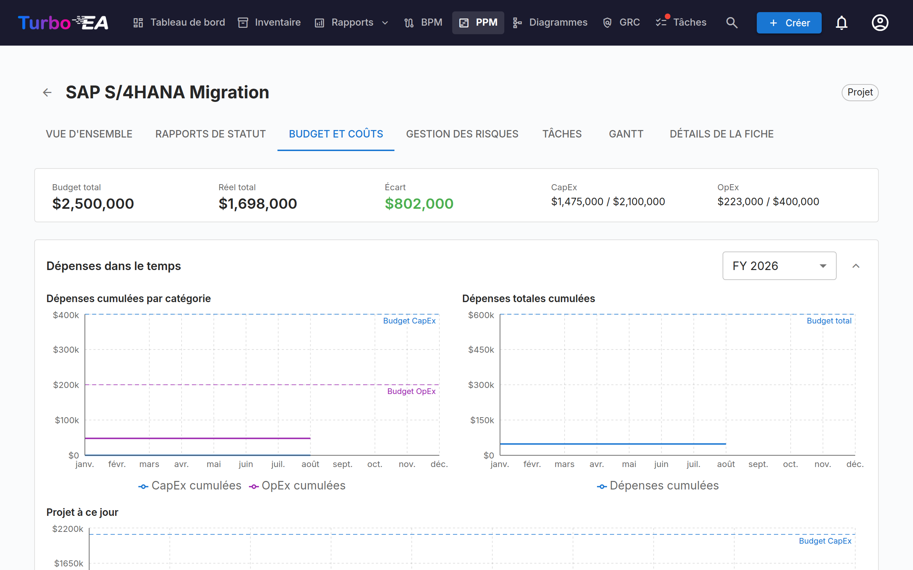
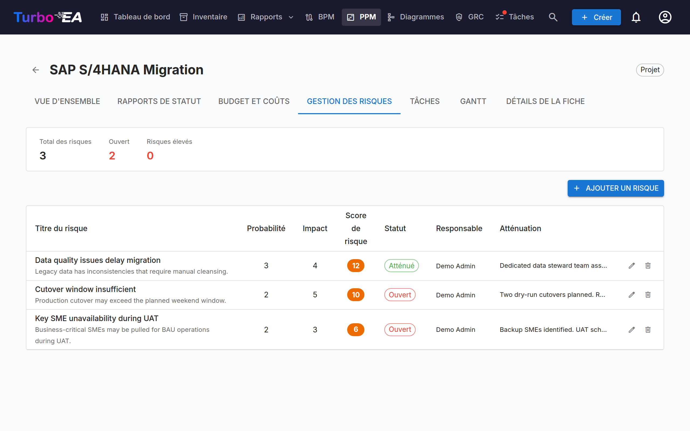
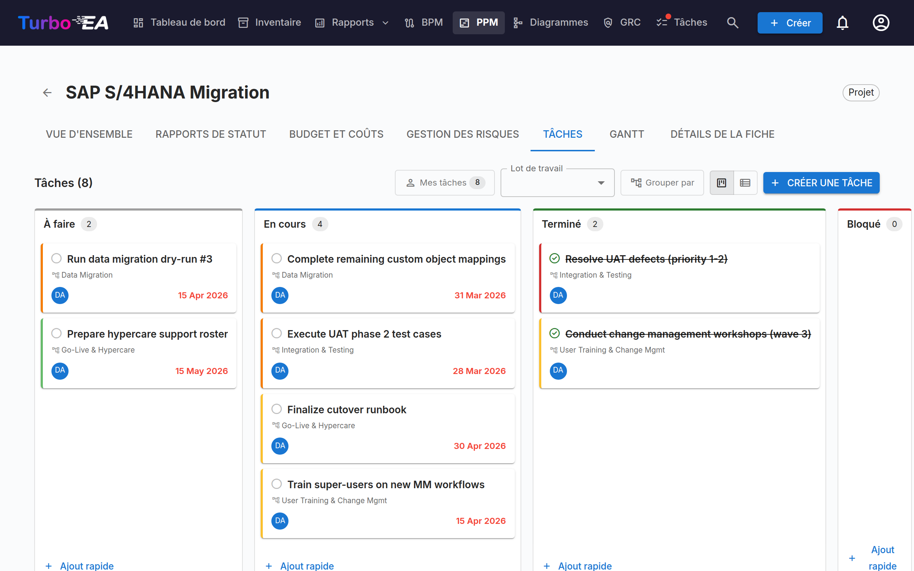
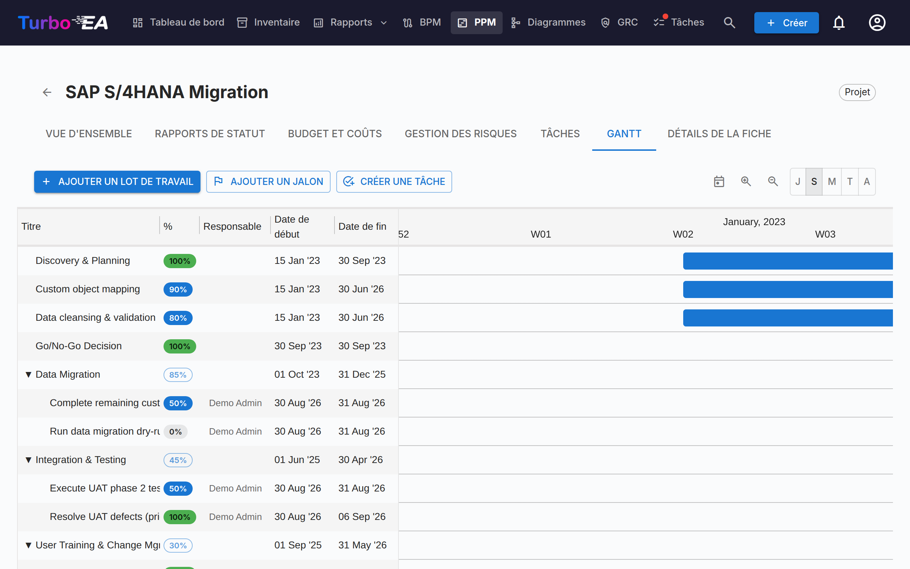

# Gestion de Portefeuille de Projets (PPM)

Le module **PPM** fournit une solution complète de gestion de portefeuille de projets pour le suivi des initiatives, budgets, risques, tâches et calendriers. Il s'intègre directement avec le type de fiche Initiative pour enrichir chaque projet avec des rapports de statut, un suivi des coûts et une visualisation Gantt.

!!! note
    Le module PPM peut être activé ou désactivé par un administrateur dans les [Paramètres](../admin/settings.md). Lorsqu'il est désactivé, la navigation et les fonctionnalités PPM sont masquées.

## Tableau de Bord du Portefeuille

Le **Tableau de Bord du Portefeuille** est le point d'entrée principal pour PPM. Il fournit :

- **Cartes KPI** — Total des initiatives, budget total, coût réel total et résumés de l'état de santé
- **Graphiques circulaires de santé** — Distribution de la santé du calendrier, des coûts et du périmètre (En cours / À risque / Hors piste)
- **Distribution des statuts** — Répartition par sous-type d'initiative et statut
- **Aperçu Gantt** — Barres de chronologie montrant les dates de début et de fin de chaque initiative, avec des indicateurs de santé RAG

### Regroupement et filtrage

Utilisez la barre d'outils pour :

- **Regrouper par** tout type de fiche lié (p. ex., Organisation, Plateforme)
- **Filtrer par sous-type** (Idée, Programme, Projet, Épique)
- **Rechercher** par nom d'initiative

Ces filtres sont conservés dans l'URL, donc l'actualisation de la page conserve votre vue actuelle.

### Impression et export

Le portefeuille propose les mêmes actions de barre de titre que les rapports :

- **Imprimer / Enregistrer en PDF** — l'icône d'imprimante imprime le portefeuille tel qu'il apparaît à l'écran. La barre d'onglets, la barre de filtres et les fenêtres contextuelles de survol sont masquées, le regroupement, le sous-type et la recherche actifs sont imprimés sous forme de ligne de paramètres compacte, et la grille chronologique n'est plus rognée : toutes les colonnes tiennent dans la page.
- **Exporter vers PowerPoint (.pptx)** — depuis le menu **⋮**. La première diapositive porte le titre, l'horodatage de génération et les filtres actifs, accompagnés du portefeuille en qualité de présentation ; les portefeuilles longs se poursuivent sur d'autres diapositives, découpées uniquement entre initiatives — jamais au milieu d'une ligne, d'un en-tête de groupe ou d'une ligne de totaux.
- **Exporter vers Excel (.xlsx)** — également depuis le menu **⋮**. Une ligne par initiative avec son groupe, son sous-type, son chef de projet, ses dates de début et de fin, les trois indicateurs de santé, le CapEx / OpEx prévu et réel, et la date du dernier rapport d'avancement.

## Vue Détaillée de l'Initiative

Cliquez sur n'importe quelle initiative pour ouvrir sa page de détail avec sept onglets :

### Onglet Vue d'Ensemble

La vue d'ensemble montre un résumé de la santé et des finances de l'initiative :

- **Résumé de santé** — Indicateurs de calendrier, coût et périmètre du dernier rapport de statut
- **Budget vs. Réel** — Carte KPI combinée montrant le budget total et les dépenses réelles avec écart
- **Activité récente** — Résumé du dernier rapport de statut

### Onglet Rapports de Statut

Les rapports de statut mensuels suivent la santé du projet au fil du temps. Chaque rapport comprend :

| Champ | Description |
|-------|-------------|
| **Date du rapport** | La date de la période de rapport |
| **Santé du calendrier** | En cours, À risque ou Hors piste |
| **Santé des coûts** | En cours, À risque ou Hors piste |
| **Santé du périmètre** | En cours, À risque ou Hors piste |
| **Résumé** | Résumé exécutif du statut actuel |
| **Réalisations** | Ce qui a été accompli pendant cette période |
| **Prochaines étapes** | Activités planifiées pour la prochaine période |

### Onglet Budget et Coûts

Suivi des données financières avec deux types de lignes :

- **Lignes de budget** — Budget planifié par année fiscale et catégorie (CapEx / OpEx). Les lignes budgétaires sont regroupées selon le **mois de début de l'exercice fiscal** configuré dans les [Paramètres](../admin/settings.md#début-de-lexercice-fiscal). Par exemple, si l'exercice fiscal commence en avril, une ligne budgétaire de juin 2026 appartient à l'EF 2026–2027
- **Lignes de coût** — Dépenses réelles avec date, description et catégorie

Les totaux de budget et de coûts sont automatiquement agrégés dans les attributs `costBudget` et `costActual` de la fiche Initiative.

#### Dépenses dans le temps

Au-dessus des tableaux de budget et de coûts, trois graphiques montrent comment les dépenses se cumulent mois après mois :

- **Dépenses cumulées par catégorie** — CapEx et OpEx cumulées pour l'exercice sélectionné, avec des lignes horizontales pointillées marquant le budget CapEx et OpEx de cet exercice
- **Dépenses totales cumulées** — le même exercice avec les deux catégories combinées, face à une ligne pointillée de budget total
- **Projet à ce jour** — CapEx et OpEx cumulées sur tous les mois du projet, face au budget total de tous les exercices

Le sélecteur d'exercice s'applique aux deux premiers graphiques et propose l'exercice en cours, tout autre exercice comportant des données, ainsi que **Tous les exercices**. Vos choix d'exercice et d'affichage replié ou déplié sont mémorisés d'une visite à l'autre.

Deux points à garder à l'esprit :

- Les courbes s'arrêtent au mois en cours au lieu de se prolonger à plat jusqu'à la fin de l'exercice, afin qu'un exercice en cours ne soit pas confondu avec un exercice où les dépenses se sont arrêtées
- Les postes de coût sans date ne peuvent pas être placés sur une chronologie et sont exclus. Une note sous les graphiques indique combien ont été exclus, ce qui permet de rapprocher les totaux des graphiques de la barre de synthèse

### Onglet Gestion des Risques

Le registre des risques suit les risques du projet avec :

| Champ | Description |
|-------|-------------|
| **Titre** | Brève description du risque |
| **Probabilité** | Score de probabilité (1–5) |
| **Impact** | Score d'impact (1–5) |
| **Score de risque** | Calculé automatiquement comme probabilité x impact |
| **Statut** | Ouvert, En atténuation, Atténué, Fermé ou Accepté |
| **Atténuation** | Actions d'atténuation planifiées |
| **Responsable** | Utilisateur responsable de la gestion du risque |

### Onglet Tâches

Le gestionnaire de tâches prend en charge les vues **tableau Kanban** et **liste** avec quatre colonnes de statut :

- **À faire** — Tâches pas encore commencées
- **En cours** — Tâches en cours de réalisation
- **Terminé** — Tâches terminées
- **Bloqué** — Tâches qui ne peuvent pas progresser

Les tâches peuvent être filtrées et regroupées par élément de Structure de Découpage du Travail (WBS). En mode regroupé, chaque lot de travaux apparaît comme un groupe — y compris un lot qui ne contient encore aucune tâche, qui affiche une indication et un bouton **Ajouter une tâche** ouvrant la boîte de dialogue de tâche avec ce lot présélectionné. Les jalons n'apparaissent qu'une fois qu'ils contiennent une tâche. Glissez-déposez les tâches entre les colonnes pour mettre à jour le statut.

Les filtres d'affichage (mode de vue, filtre WBS, bascule de regroupement) sont conservés dans l'URL entre les actualisations de page.

### Onglet Gantt

Le diagramme de Gantt visualise le calendrier du projet avec :

- **Lots de travaux (WBS)** — Éléments hiérarchiques de structure de découpage du travail avec dates de début/fin
- **Tâches** — Barres de tâches individuelles liées aux lots de travaux
- **Jalons** — Dates clés marquées par des indicateurs en losange
- **Barres de progression** — Pourcentage d'achèvement visuel. Une tâche n'a pas de pourcentage propre : son remplissage suit son statut — **À faire (0%)**, **En cours (50%)**, **Terminé (100%)**. Cliquez sur la pastille de pourcentage d'une tâche pour ouvrir un curseur dont les trois crans portent le nom de ces statuts ; choisir un cran change le statut, et faire glisser le remplissage sur la barre de la tâche fait de même. Un lot de travaux feuille dispose d'un curseur libre par pas de 5%. Les lots de travaux qui ont des lots de travaux enfants **ou des tâches** affichent une pastille en lecture seule dont la valeur est calculée automatiquement à partir du sous-arbre.
- **Repères trimestriels** — Grille de chronologie pour l'orientation

Interagir avec le diagramme de Gantt :

- **Sélecteur d'échelle** — Choisissez entre Jour, Semaine, Mois, Trimestre et Année ; le choix est mémorisé dans votre navigateur
- **Boutons +/− de zoom** — Naviguez d'un cran à la fois dans la même série de cinq échelles
- **Points aux extrémités des barres** — Glissez du point droit d'une barre vers le point gauche d'une autre pour créer une dépendance « finish-to-start ». Fonctionne entre lots de travaux et tâches dans toutes les combinaisons. Les cycles sont rejetés automatiquement. **Double-cliquez sur une flèche** pour la supprimer.
- **La ligne +** en bas de la liste demande quoi créer — un lot de travaux, un jalon ou une tâche — de sorte qu'une tâche saisie là atterrit dans l'onglet Tâches.

### Onglet Détails de la Carte

Le dernier onglet affiche la vue complète des détails de la fiche, y compris toutes les sections standard.

## Structure de Découpage du Travail (WBS)

La WBS fournit une décomposition hiérarchique du périmètre du projet :

- **Lots de travaux** — Regroupements logiques de tâches avec dates de début/fin et suivi de l'achèvement
- **Jalons** — Événements significatifs ou points d'achèvement
- **Hiérarchie** — Relations parent-enfant entre les éléments WBS
- **Auto-achèvement** — L'achèvement est calculé automatiquement à partir des tâches du sous-arbre d'un lot de travaux : chaque tâche compte pour 0% (À faire, Bloqué), 50% (En cours) ou 100% (Terminé), pondérée par sa durée en jours (un jour lorsqu'une date manque), puis cumulé récursivement jusqu'aux éléments parents. Un lot de travaux sans aucune tâche en dessous conserve la valeur saisie à la main. La moyenne des lots de travaux de premier niveau est la progression globale de l'initiative — le chiffre de l'onglet Vue d'ensemble, et la variable `ppm.completion` qu'un [champ calculé](../admin/calculations.md#ppm-data-on-initiative-cards) peut afficher sur la fiche et dans un portail

## Intégration avec les détails de la fiche

Lorsque le PPM est activé, les fiches **Initiative** affichent un onglet **PPM** en dernière position dans la [vue détaillée de la fiche](card-details.md). Cliquer sur cet onglet ouvre directement la vue détaillée PPM de l'initiative (onglet Aperçu). Cela offre un point d'accès rapide depuis n'importe quelle fiche Initiative vers sa page de projet PPM complète.

Inversement, l'onglet **Détails de la fiche** dans la vue détaillée PPM de l'initiative affiche les sections standard sans l'onglet PPM, évitant ainsi une navigation circulaire.

## Permissions

| Permission | Description |
|-----------|-------------|
| `ppm.view` | Voir le tableau de bord PPM, le diagramme de Gantt et les rapports d'initiatives, et lire les fiches d'initiative. Accordé à tous les rôles par défaut |
| `ppm.manage` | Créer et gérer les rapports de statut, tâches, coûts, risques et éléments WBS. Accordé aux rôles Admin, Admin BPM et Membre |
| `reports.ppm_dashboard` | Voir le tableau de bord du portefeuille PPM. Accordé à tous les rôles par défaut |
