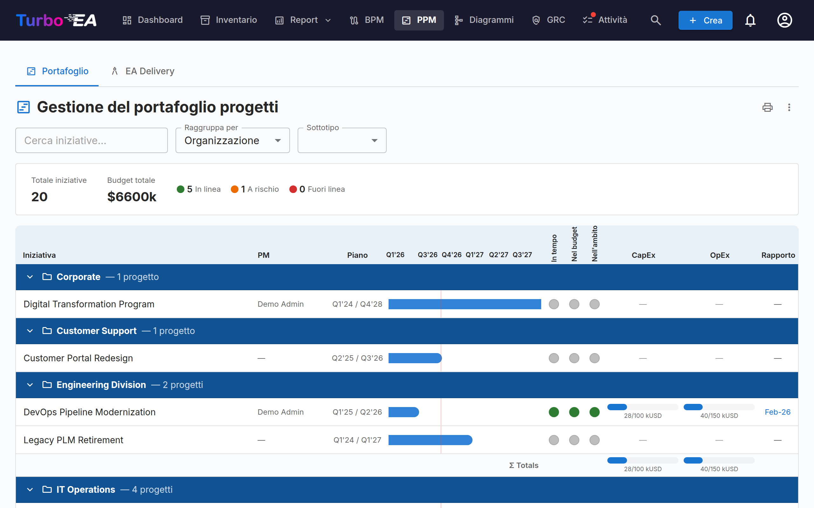
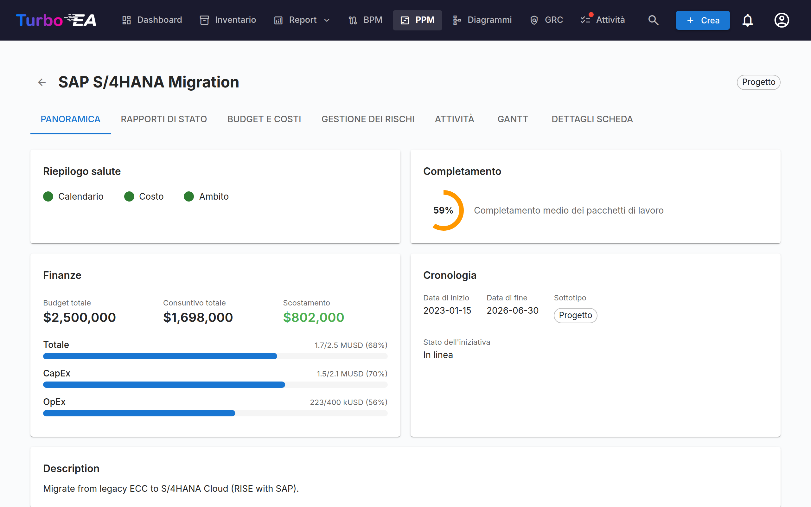
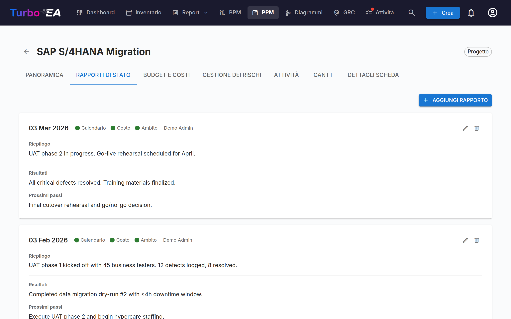
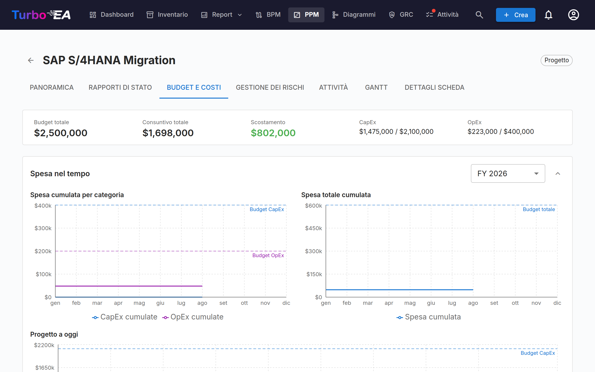
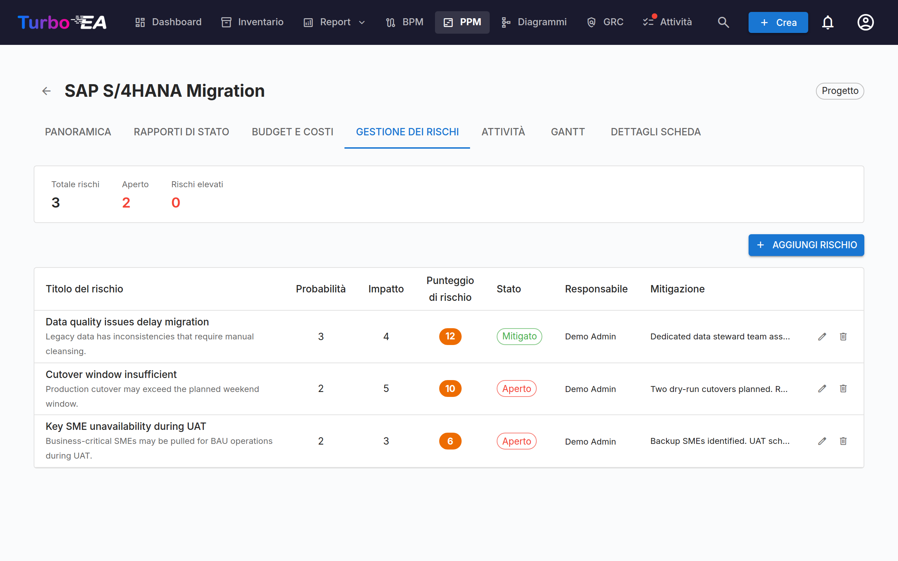
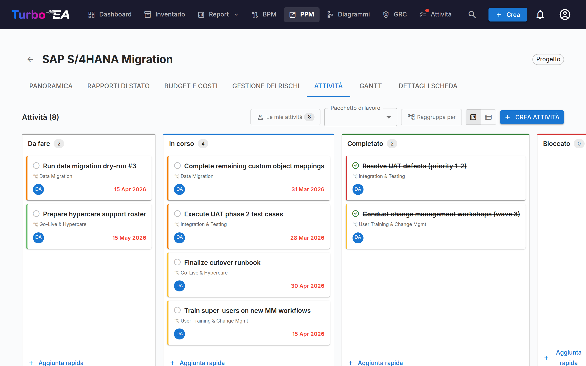
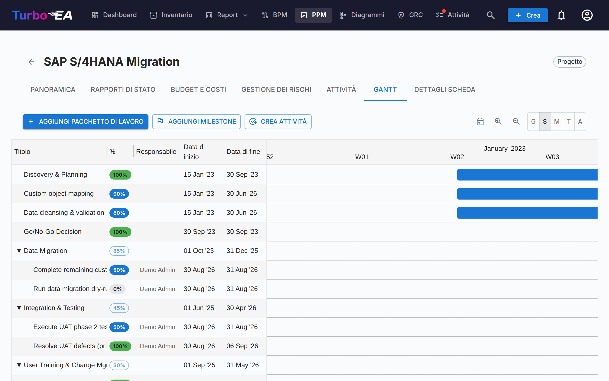

# Gestione del Portafoglio Progetti (PPM)

Il modulo **PPM** fornisce una soluzione completa di gestione del portafoglio progetti per il monitoraggio di iniziative, budget, rischi, attività e tempistiche. Si integra direttamente con il tipo di card Iniziativa per arricchire ogni progetto con report di stato, monitoraggio dei costi e visualizzazione Gantt.

!!! note
    Il modulo PPM può essere abilitato o disabilitato da un amministratore nelle [Impostazioni](../admin/settings.md). Quando disabilitato, la navigazione e le funzionalità PPM sono nascoste.

## Dashboard del Portafoglio

Il **Dashboard del Portafoglio** è il punto di ingresso principale per PPM. Fornisce:

- **Card KPI** — Totale iniziative, budget totale, costo effettivo totale e riepiloghi dello stato di salute
- **Grafici a torta della salute** — Distribuzione della salute di calendario, costi e ambito (In corso / A rischio / Fuori rotta)
- **Distribuzione dello stato** — Ripartizione per sottotipo di iniziativa e stato
- **Panoramica Gantt** — Barre temporali che mostrano le date di inizio e fine di ogni iniziativa, con indicatori di salute RAG

### Raggruppamento e filtri

Utilizzare la barra degli strumenti per:

- **Raggruppare per** qualsiasi tipo di card correlato (es. Organizzazione, Piattaforma)
- **Filtrare per sottotipo** (Idea, Programma, Progetto, Epic)
- **Cercare** per nome dell'iniziativa

Questi filtri vengono mantenuti nell'URL, quindi l'aggiornamento della pagina conserva la vista corrente.

### Stampa ed esportazione

Il portafoglio offre le stesse azioni nella barra del titolo dei report:

- **Stampa / Salva come PDF** — l'icona della stampante stampa il portafoglio così come appare a schermo. La barra delle schede, la barra dei filtri e i popover al passaggio del mouse vengono nascosti, il raggruppamento, il sottotipo e la ricerca attivi vengono stampati come una riga compatta di parametri e la griglia della timeline non viene più ritagliata, così tutte le colonne entrano nella pagina.
- **Esporta in PowerPoint (.pptx)** — dal menu **⋮**. La prima diapositiva riporta titolo, data e ora di generazione e filtri attivi insieme al portafoglio in qualità da presentazione; i portafogli lunghi proseguono su altre diapositive, tagliate solo tra le iniziative — mai attraverso una riga, un'intestazione di gruppo o una riga dei totali.
- **Esporta in Excel (.xlsx)** — anch'esso dal menu **⋮**. Una riga per iniziativa con gruppo, sottotipo, project manager, date di inizio e fine, i tre indicatori di salute, CapEx/OpEx pianificato ed effettivo e la data dell'ultimo report di stato.

## Vista Dettagliata dell'Iniziativa

Cliccare su qualsiasi iniziativa per aprire la sua pagina di dettaglio con sette schede:

### Scheda Panoramica

La panoramica mostra un riepilogo della salute e delle finanze dell'iniziativa:

- **Riepilogo salute** — Indicatori di calendario, costi e ambito dall'ultimo report di stato
- **Budget vs. Effettivo** — Card KPI combinata che mostra budget totale e spesa effettiva con varianza
- **Attività recente** — Riepilogo dell'ultimo report di stato

### Scheda Report di Stato

I report di stato mensili monitorano la salute del progetto nel tempo. Ogni report include:

| Campo | Descrizione |
|-------|-------------|
| **Data del report** | La data del periodo di reportistica |
| **Salute del calendario** | In corso, A rischio o Fuori rotta |
| **Salute dei costi** | In corso, A rischio o Fuori rotta |
| **Salute dell'ambito** | In corso, A rischio o Fuori rotta |
| **Riepilogo** | Riepilogo esecutivo dello stato attuale |
| **Risultati** | Cosa è stato raggiunto in questo periodo |
| **Prossimi passi** | Attività pianificate per il prossimo periodo |

### Scheda Budget e Costi

Monitoraggio dei dati finanziari con due tipi di voci:

- **Voci di budget** — Budget pianificato per anno fiscale e categoria (CapEx / OpEx). Le linee di budget sono raggruppate in base al **mese di inizio dell'anno fiscale** configurato nelle [Impostazioni](../admin/settings.md#inizio-dellanno-fiscale). Ad esempio, se l'anno fiscale inizia ad aprile, una linea di budget di giugno 2026 appartiene all'AF 2026–2027
- **Voci di costo** — Spese effettive con data, descrizione e categoria

I totali di budget e costi vengono automaticamente aggregati negli attributi `costBudget` e `costActual` della card Iniziativa.

#### Spesa nel tempo

Sopra le tabelle di budget e costi, tre grafici mostrano come la spesa si accumula mese per mese:

- **Spesa cumulata per categoria** — CapEx e OpEx cumulate per l'esercizio selezionato, con linee orizzontali tratteggiate che indicano il budget CapEx e OpEx di quell'esercizio
- **Spesa totale cumulata** — lo stesso esercizio con entrambe le categorie combinate, rispetto a una linea tratteggiata di budget totale
- **Progetto a oggi** — CapEx e OpEx cumulate su tutti i mesi del progetto, rispetto al budget totale di tutti gli esercizi

Il selettore dell'esercizio si applica ai primi due grafici e propone l'esercizio corrente, qualsiasi altro esercizio con dati e **Tutti gli esercizi**. Le scelte di esercizio e stato aperto o chiuso vengono ricordate tra una visita e l'altra.

Due aspetti da tenere presenti nella lettura dei grafici:

- Le linee si fermano al mese corrente anziché proseguire piatte fino a fine esercizio, così un esercizio in corso non viene scambiato per uno in cui la spesa si è fermata
- Le voci di costo senza data non possono essere collocate su una linea temporale e vengono escluse. Una nota sotto i grafici riporta quante ne sono state escluse, per riconciliare i totali del grafico con la barra di riepilogo

### Scheda Gestione dei Rischi

Il registro dei rischi monitora i rischi del progetto con:

| Campo | Descrizione |
|-------|-------------|
| **Titolo** | Breve descrizione del rischio |
| **Probabilità** | Punteggio di probabilità (1–5) |
| **Impatto** | Punteggio di impatto (1–5) |
| **Punteggio di rischio** | Calcolato automaticamente come probabilità x impatto |
| **Stato** | Aperto, In mitigazione, Mitigato, Chiuso o Accettato |
| **Mitigazione** | Azioni di mitigazione pianificate |
| **Responsabile** | Utente responsabile della gestione del rischio |

### Scheda Attività

Il gestore delle attività supporta le viste **board Kanban** e **lista** con quattro colonne di stato:

- **Da fare** — Attività non ancora iniziate
- **In corso** — Attività attualmente in lavorazione
- **Completato** — Attività completate
- **Bloccato** — Attività che non possono procedere

Le attività possono essere filtrate e raggruppate per elemento della Struttura di Scomposizione del Lavoro (WBS).

I filtri di visualizzazione (modalità vista, filtro WBS, interruttore raggruppamento) vengono mantenuti nell'URL tra gli aggiornamenti della pagina.

### Scheda Gantt

Il diagramma di Gantt visualizza la tempistica del progetto con:

- **Pacchetti di lavoro (WBS)** — Elementi gerarchici della struttura di scomposizione del lavoro con date di inizio/fine
- **Attività** — Barre di attività individuali collegate ai pacchetti di lavoro
- **Milestone** — Date chiave contrassegnate con indicatori a diamante
- **Barre di avanzamento** — Percentuale di completamento visiva. Fai clic sul chip percentuale di un'attività o di un pacchetto di lavoro foglia per aprire un cursore che si aggancia a **0%, 50% o 100%** — corrispondente ai tre stati delle attività (Da fare, In corso, Completato). I pacchetti di lavoro padre con figli mostrano un chip in sola lettura il cui valore viene calcolato automaticamente dal sottoalbero.
- **Segni trimestrali** — Griglia temporale per orientamento

Interagisci con il diagramma di Gantt:

- **Selettore della scala** — Scegli tra Giorno, Settimana, Mese, Trimestre e Anno; la scelta viene memorizzata nel browser
- **Pulsanti di zoom +/−** — Naviga di un livello alla volta lungo le stesse cinque scale
- **Punti alle estremità delle barre** — Trascina dal punto destro di una barra al punto sinistro di un'altra per creare una dipendenza finish-to-start. Funziona tra pacchetti di lavoro e attività in qualsiasi combinazione. I cicli vengono rifiutati automaticamente. **Fai doppio clic su una freccia** per rimuoverla.

### Scheda Dettagli della Card

L'ultima scheda mostra la vista completa dei dettagli della card, incluse tutte le sezioni standard.

## Struttura di Scomposizione del Lavoro (WBS)

La WBS fornisce una scomposizione gerarchica dell'ambito del progetto:

- **Pacchetti di lavoro** — Raggruppamenti logici di attività con date di inizio/fine e monitoraggio del completamento
- **Milestone** — Eventi significativi o punti di completamento
- **Gerarchia** — Relazioni genitore-figlio tra elementi WBS
- **Auto-completamento** — La percentuale di completamento viene calcolata automaticamente dai rapporti attività completate/totali, cumulato ricorsivamente attraverso la gerarchia WBS fino agli elementi padre. Il completamento al livello superiore rappresenta il progresso complessivo dell'iniziativa

## Integrazione con i dettagli della card

Quando il PPM è attivato, le card **Iniziativa** mostrano una scheda **PPM** come ultima scheda nella [vista dettagli della card](card-details.md). Cliccando su questa scheda si accede direttamente alla vista dettagliata PPM dell'iniziativa (scheda Panoramica). Questo offre un punto di accesso rapido da qualsiasi card Iniziativa alla sua pagina completa del progetto PPM.

Al contrario, la scheda **Dettagli della card** all'interno della vista dettagliata PPM dell'iniziativa mostra le sezioni standard senza la scheda PPM, evitando la navigazione circolare.

## Permessi

| Permesso | Descrizione |
|----------|-------------|
| `ppm.view` | Visualizzare il dashboard PPM, il diagramma di Gantt e i report delle iniziative. Concesso a tutti i ruoli per impostazione predefinita |
| `ppm.manage` | Creare e gestire report di stato, attività, costi, rischi ed elementi WBS. Concesso ai ruoli Admin, Admin BPM e Membro |
| `reports.ppm_dashboard` | Visualizzare il dashboard del portafoglio PPM. Concesso a tutti i ruoli per impostazione predefinita |
