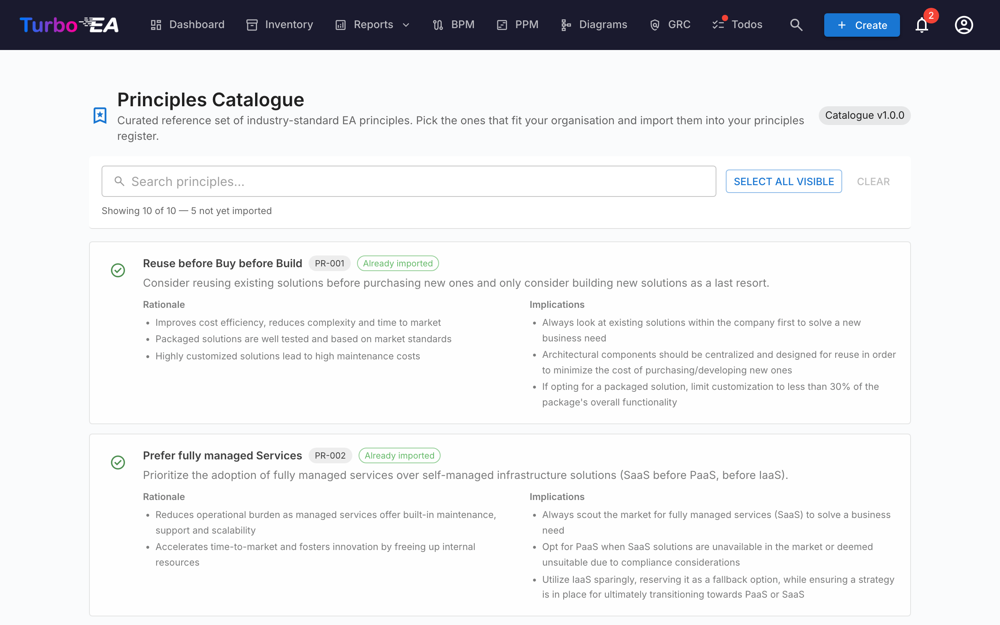

# Principkatalog

Turbo EA leveres med **EA Principles Reference Catalogue** — et kurateret sæt af arkitekturprincipper hentet fra TOGAF og tilstødende branchereferencer, vedligeholdt sammen med kompetence-, proces- og værdistrømskatalogerne på [github.com/vincentmakes/turbo-ea-capabilities](https://github.com/vincentmakes/turbo-ea-capabilities). Principkatalog-siden lader dig gennemse denne reference og importere matchende principper til din egen metamodel i bulk i stedet for at indtaste hver udtalelse, rationale og sæt af implikationer i hånden.

## Åbning af siden

Klik på brugerikonet øverst til højre i appen, udvid **Referencekataloger** i menuen (sektionen er sammenklappet som standard for at holde menuen kompakt), og klik derefter på **Principkatalog**. Siden er kun for administratorer — den kræver `admin.metamodel`-tilladelsen, den samme tilladelse, du har brug for til at administrere principper direkte fra Administration → Metamodel.

## Hvad du ser

- **Header** — den aktive katalogversionschip og sidetitlen.
- **Filterlinje** — fuldtekstsøgning på tværs af titel, beskrivelse, rationale og implikationer. En **Vælg synlige**-knap tilføjer hvert importerbart match til markeringen med ét klik; **Ryd markering** sletter den. En live-tæller nedenunder viser, hvor mange poster der er synlige, det samlede antal i kataloget, og hvor mange der stadig kan importeres (dvs. ikke allerede er i dit lager).
- **Principliste** — ét kort pr. princip, der viser titlen, en kort beskrivelse, en punktopstillet **rationale** og et punktopstillet sæt af **implikationer**. Kortene stables lodret, så den langform-tekst forbliver læselig.

## Valg af principper

Sæt flueben i afkrydsningsfeltet i et principkort for at tilføje det til markeringen. Markeringen er flad — der er ikke noget hierarki at kaskadere igennem, så hvert princip vælges eller springes over på dets egne meritter.

Principper, der **allerede findes** i din metamodel, vises med et **grønt fluebenikon** i stedet for et afkrydsningsfelt og kan ikke vælges — du kan aldrig importere det samme princip to gange gennem kataloget. Matching foretrækker `catalogue_id`-stemplet, der er efterladt af en tidligere import (så det grønne flueben overlever titelredigeringer) og falder tilbage til et case-uafhængigt titelmatch for principper, du indtastede i hånden.

## Masseimport af principper

Når du har et eller flere principper valgt, vises en klæbrig **Importer N principper**-knap nederst på siden. Den bruger den samme `admin.metamodel`-tilladelse som resten af siden.

Ved bekræftelse vil Turbo EA:

- Oprette én `EAPrinciple`-række pr. valgt katalogpost, der ordret kopierer titlen, beskrivelsen, rationalen og implikationerne.
- Stemple hvert nyt princip med `catalogue_id` og `catalogue_version`, så du kan spore, hvor det kom fra, og så det grønne-flueben-matching overlever senere redigeringer.
- **Springe eksisterende match over** stille. Resultatdialogen viser, hvor mange principper der blev oprettet, og hvor mange der blev sprunget over.

Genkørsel af den samme import er sikker — den er idempotent.

Efter import, rediger principperne fra **Administration → Metamodel → Principper** for at tilpasse formuleringen eller sorteringsrækkefølgen til din organisation. Den importerede tekst er et udgangspunkt; principlisten på den admin-side er det sted, hvor du vil fortsætte med at vedligeholde kataloget fremadrettet.

## Opdatering af kataloget (administratorer)

Kataloget leveres **bundet** som en Python-afhængighed, så siden fungerer offline / i airgapped-implementeringer. Administratorer kan hente en nyere version efter behov fra kompetence-, proces- eller værdistrømskatalogsiderne — den samme wheel-download hydrerer princip-cachen samtidigt, så opdatering af en hvilken som helst af de fire referencekataloger fra en hvilken som helst af de fire sider opdaterer dem alle.

PyPI-indeks-URL'en kan konfigureres via miljøvariablen `CAPABILITY_CATALOGUE_PYPI_URL` (variablens navn deles på tværs af alle fire kataloger — wheel dækker dem alle).
