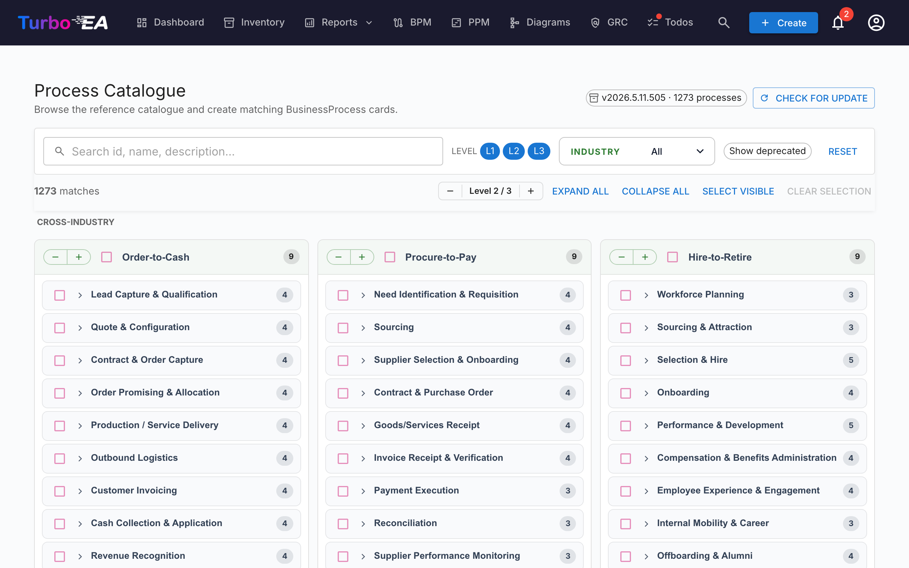

# Proceskatalog

Turbo EA leveres med **Business Process Reference Catalogue** — et APQC-PCF-forankret procestræ vedligeholdt sammen med kompetencekataloget på [github.com/vincentmakes/turbo-ea-capabilities](https://github.com/vincentmakes/turbo-ea-capabilities). Proceskatalog-siden lader dig gennemse denne reference og oprette matchende `BusinessProcess`-kort i bulk.

## Åbning af siden

Klik på brugerikonet øverst til højre i appen, udvid **Referencekataloger** i menuen (sektionen er sammenklappet som standard for at holde menuen kompakt), og klik derefter på **Proceskatalog**. Siden er tilgængelig for alle med `inventory.view`-tilladelsen.

## Hvad du ser

- **Header** — den aktive katalogversion, antallet af processer, den indeholder, og (for administratorer) kontroller til at tjekke for og hente opdateringer.
- **Filterlinje** — fuldtekstsøgning på tværs af id, navn, beskrivelse og aliaser, plus niveauchips (L1 → L4 — kategori → procesgruppe → proces → aktivitet, der spejler APQC PCF), et brancheflervælg og en "Vis udfasede"-skifter.
- **Handlingslinje** — match-tællere, det globale niveau-stepper, udvid/sammenklap alle, vælg synlige, ryd markering.
- **L1-gitter** — ét kort pr. L1-proceskategori, grupperet under brancheoverskrifter. **Tværindustrielle** processer pinnes øverst; andre brancher følger alfabetisk.

## Valg af processer

Sæt flueben i afkrydsningsfeltet ud for en hvilken som helst proces for at tilføje den til markeringen. Markering kaskaderer ned ad undertræet på samme måde som kompetencekataloget — at sætte flueben i en node tilføjer den plus enhver valgbar efterkommer; at fjerne fluebenet fjerner det samme undertræ. Forfædre berøres aldrig.

Processer, der **allerede findes** i dit lager, vises med et **grønt fluebenikon** i stedet for et afkrydsningsfelt. Matching foretrækker `attributes.catalogueId`-stemplet, der er efterladt af en tidligere import, og falder tilbage til et case-uafhængigt visningsnavnsmatch.

## Masseoprettelse af kort

Når du har en eller flere processer valgt, vises en klæbrig **Opret N processer**-knap nederst på siden. Den bruger den almindelige `inventory.create`-tilladelse.

Ved bekræftelse vil Turbo EA:

- Oprette ét `BusinessProcess`-kort pr. valgt post med **undertypen** valgt fra katalogniveauet: L1 → `Process Category`, L2 → `Process Group`, L3 / L4 → `Process`.
- Bevare kataloghierarkiet via `parent_id`.
- **Auto-oprette `relProcessToBC` (understøtter) relationer** til hvert eksisterende `BusinessCapability`-kort, der er listet i processens `realizes_capability_ids`. Resultatdialogen rapporterer, hvor mange auto-relationer der landede; mål, der endnu ikke findes i dit lager, springes stille over. Genkørsel af importen efter senere at have importeret de manglende kompetencer er sikker — disse kilde-ID'er gemmes på kortet, så du kan re-linke manuelt om nødvendigt.
- Stemple hvert nyt korts `attributes` med `catalogueId`, `catalogueVersion`, `catalogueImportedAt`, `processLevel` (`L1`..`L4`), og kilden `frameworkRefs`, `industry`, `references`, `inScope`, `outOfScope`, `realizesCapabilityIds` fra kataloget.

Tællinger af sprunget over, oprettet og re-linket rapporteres på samme måde som for kompetencekataloget. Importer er idempotente — genkørsel duplikerer ikke kort.

## Detaljevisning

Klik på et hvilket som helst procesnavn for at åbne en detaljedialog, der viser dets brødkrumme, beskrivelse, branche, aliaser, referencer og en fuldt udvidet visning af dets undertræ. Detaljepanelet i proceskataloget viser desuden:

- **Framework-referencer** — APQC-PCF / BIAN / eTOM / ITIL / SCOR-identifikatorer, der bæres i katalogets `framework_refs`.
- **Realiserer kompetencer** — de BC-ID'er, processen realiserer (en chip pr. id), så du kan se manglende kompetencekort med et øjeblik.

## Opdatering af kataloget (administratorer)

Kataloget leveres **bundet** som en Python-afhængighed, så siden fungerer offline / i airgapped-implementeringer. Administratorer (`admin.metamodel`) kan hente en nyere version efter behov via **Tjek efter opdatering** → **Hent v…**. Den samme wheel-download hydrerer kompetence- og værdistrøms-cachene samtidigt, så opdatering af en hvilken som helst af de tre referencekataloger fra en hvilken som helst af de tre sider opdaterer dem alle.

PyPI-indeks-URL'en kan konfigureres via miljøvariablen `CAPABILITY_CATALOGUE_PYPI_URL` (variablens navn deles på tværs af alle tre kataloger — wheel dækker dem alle).
