# التقارير

يتضمّن Turbo EA وحدة **تقارير بصرية** قوية تتيح تحليل هندسة المؤسسة من منظورات مختلفة. ويمكن [حفظ جميع التقارير لإعادة الاستخدام](saved-reports.md) مع تهيئة عوامل التصفية والمحاور الحالية.

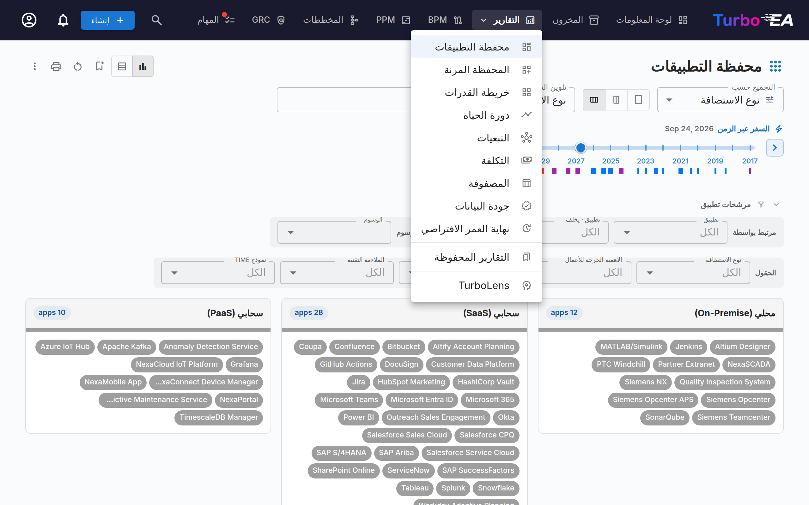

## تقرير المحفظة

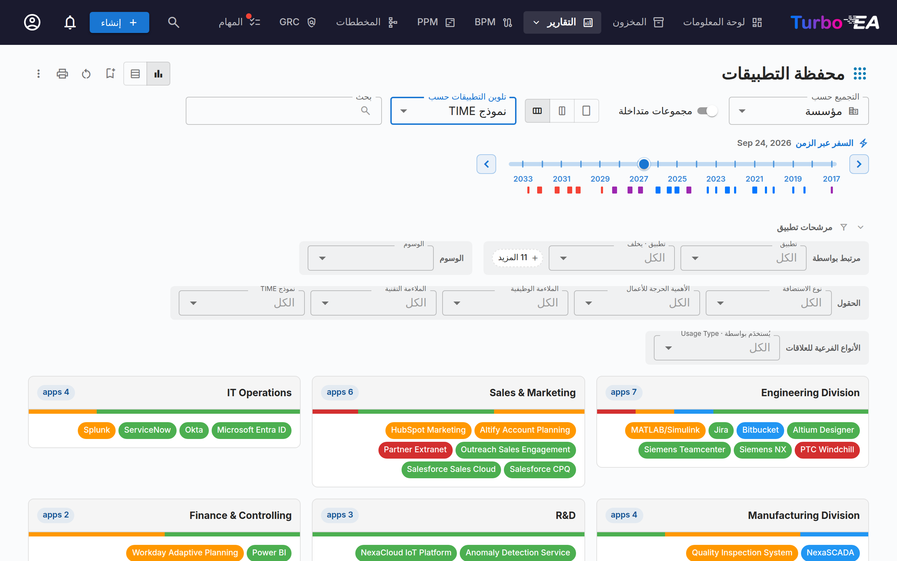

يعرض **تقرير المحفظة** **مخطّط فقاعات** قابلاً للتهيئة (أو مخطّط تشتّت) لبطاقاتك. تختار ما يمثّله كل محور:

- **المحور الأفقي (X)** — اختر أي حقل رقمي أو حقل تحديد (مثل الملاءمة التقنية)
- **المحور الرأسي (Y)** — اختر أي حقل رقمي أو حقل تحديد (مثل الأهمية التجارية)
- **حجم الفقاعة** — اربطه بحقل رقمي (مثل التكلفة السنوية)
- **لون الفقاعة** — اربطه بحقل تحديد أو حالة دورة الحياة

هذا مثالي لتحليل المحفظة — مثل رسم التطبيقات حسب القيمة التجارية مقابل الملاءمة التقنية لتحديد المرشّحين للاستثمار أو الاستبدال أو التقاعد.

### رؤى المحفظة بالذكاء الاصطناعي

عندما يكون الذكاء الاصطناعي مُهيّأً ورؤى المحفظة مُمكَّنة من المسؤول، يعرض تقرير المحفظة زر **رؤى الذكاء الاصطناعي**. يؤدّي النقر عليه إلى إرسال ملخّص لعرضك الحالي إلى مزوّد الذكاء الاصطناعي، الذي يعيد رؤى استراتيجية حول مخاطر التركّز، وفرص التحديث، ومخاوف دورة الحياة، وتوازن المحفظة. لوحة الرؤى قابلة للطي ويمكن إعادة إنشائها بعد تغيير عوامل التصفية أو التجميع.

### من التقرير إلى المخزون

يؤدي النقر على مجموعة إلى فتح لوحة تعرض بطاقات تلك المجموعة. يفتح زر **عرض في المخزون** المخزونَ على هذه الشريحة بالضبط. عندما يكون التقرير مجمّعًا حسب حقل من حقول نوع البطاقة نفسه، يصل المخزون مجمّعًا حسب الحقل ذاته: المجموعة التي نقرت عليها مفتوحة وبقية المجموعات مطوية (مع بقاء الأعداد ظاهرة)، وتُنقل معها عوامل تصفية التقرير للبحث والسمات والعلاقات والوسوم — جاهزًا «لتحديد الكل» ثم [التحرير الجماعي](inventory.md#mass-edit). أما عند التجميع حسب نوع بطاقات مرتبط (مثل المؤسسة) فيصل المخزون مصفّى على تلك البطاقة المرتبطة. يُخفى الزر عند تفعيل *المجموعات المتداخلة*: فالشجرة الفرعية المجمّعة لا تقابل عامل تصفية واحدًا في المخزون.

### طيّ المرشحات

يمكن طيّ صفّ **المرشحات**: انقر على ترويسته لإخفاء عناصر التصفية وإعادة المساحة الرأسية إلى المخطّط. ويُحفظ هذا الإعداد مع بقية تهيئة التقرير، فيُعاد فتح التقرير كما تركته تمامًا. وأثناء الطيّ تظل الترويسة تعرض عدد المرشحات النشطة، ويبقى **مسح الكل** في المتناول — فالقسم المطويّ لا يُخفي أبدًا أن البيانات مصفّاة.

### السفر عبر الزمن

يحمل شريط الخط الزمني أدوات التحوّل ذاتها الموجودة في **تقرير التبعيات**: علامات عند كل تاريخ يدخل فيه تطبيق الخدمة (أزرق) أو يتوقّف (أحمر)، وأقراصًا تسمّي التطبيقات المتغيّرة ما دام الشريط واقفًا على علامة، وزرّي سهم يتنقّلان من تغيير إلى آخر، وشارات تلخّص التحوّل عند النظر إلى المستقبل («+4 تُضاف · −7 تتوقّف» — وتُدرَج أيضًا في ترويسات الطباعة والتصدير). ويؤدّي النقر على علامة أو قرص إلى إبراز التطبيقات التي تتغيّر عندها — يخفت باقي العرض بينما تنبض تلك التطبيقات، ويظهر التطبيق الذي سبق توقّفه في التاريخ المحدّد أثناء النبض فقط ثم يُخفى من جديد.

## المحفظة المرنة

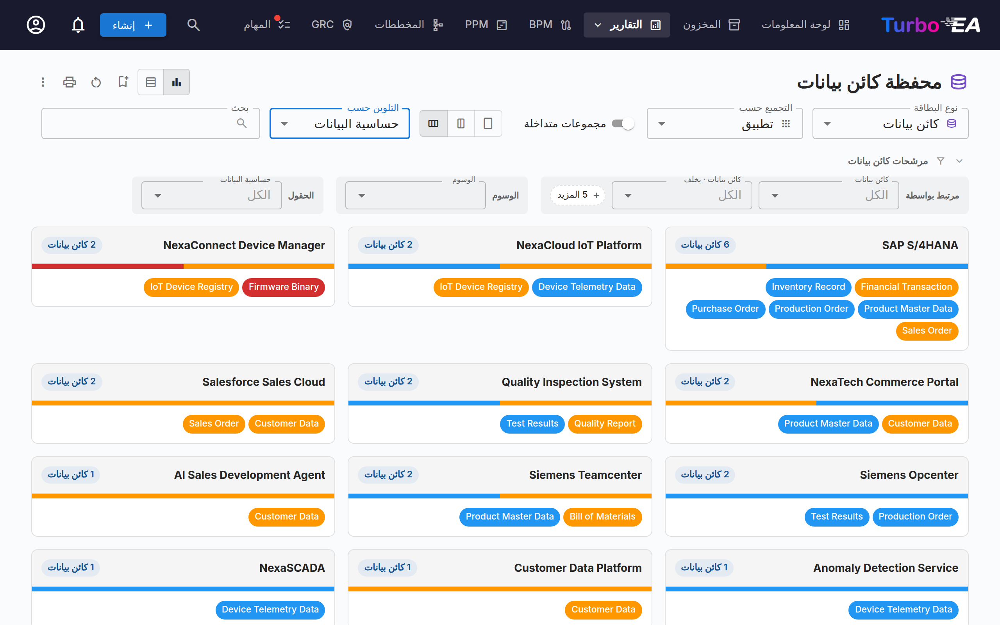

تستخدم **المحفظة المرنة** عناصر التحكّم ذاتها التي تستخدمها محفظة التطبيقات لكنها تضيف منتقي **نوع البطاقة** في أعلى شريط الأدوات. استخدمه لتحليل محفظة من قدرات الأعمال أو المبادرات أو المكوّنات التقنية أو أي نوع بطاقة مرئي آخر بتجربة التجميع والتلوين والتصفية ذاتها.

تُظهر لقطة الشاشة أعلاه حالة استخدام نموذجية: اختر **كائن بيانات** نوعًا للبطاقة، و**تجميع حسب ← التطبيق** لمعرفة أي التطبيقات تملك أي البيانات، و**تلوين حسب ← حساسية البيانات** لإبراز مكان وجود البيانات السرّية بنظرة سريعة.

يؤدّي تبديل نوع البطاقة إلى مسح تحديدات التجميع والتلوين وعوامل التصفية (لأنها تشير إلى مفاتيح حقول غير موجودة في النوع الجديد)، ويُعاد تحميل التقرير بالحقول والعلاقات والوسوم المنطبقة على النوع المختار. يتشارك التقرير الإذن ذاته مع محفظة التطبيقات (`reports.portfolio`) ويُحفظ بشكل مستقلّ عنها.

### الأنواع الفرعية للعلاقات

عندما تحمل علاقات بطاقة قيمة "type" — على سبيل المثال **نوع الاستخدام** (مالك / مستخدِم / صاحب مصلحة) في علاقات منظمة←تطبيق، أو **نوع الدعم** في علاقات تطبيق←قدرة الأعمال — يمكنك تلوين البطاقات بتلك القيمة والتصفية عليها. **جمِّع التقرير حسب نوع البطاقة المرتبط** لاستخدامها (مثل *تجميع حسب ← المنظمة* لفتح *نوع الاستخدام*): يظهر النوع الفرعي بعد ذلك ضمن مجموعة **الأنواع الفرعية للعلاقات** في القائمة المنسدلة *تلوين حسب* وكصفّ عامل تصفية خاص به. ولأن كل بطاقة تُعرض تحت بطاقة مرتبطة واحدة، فإنها تُلوَّن بـ *تلك* العلاقة — فالتطبيق الذي يكون *مستخدِمًا* لإحدى المنظمات يظهر مستخدِمًا هناك، حتى لو كانت تملكه منظمة أخرى.

### مجموعات متداخلة

عند التجميع حسب نوع بطاقة مرتبط يدعم التسلسل الهرمي (مثل القدرة التجارية أو المؤسسة)، يظهر مفتاح **مجموعات متداخلة** بجوار محدد *التجميع حسب*. فعّله لعرض المجموعات كصناديق متداخلة وفق التسلسل الهرمي (الأصل/الفرع) للنوع المرتبط — كما في خريطة القدرات. يتحكم محدد **عمق العرض** في عدد المستويات المعروضة: تظهر كل بطاقة ضمن أعمق مجموعة مرئية لها، وتُجمَّع بطاقات المجموعات الواقعة تحت حد العمق ضمن أقرب مجموعة أصلٍ مرئية. تُخفى الفروع التي لا تحتوي على بطاقات.

### اختيار عدد الأعمدة

تتضمّن شبكة البطاقات في تقارير **المحفظة** و**المحفظة المرنة** و**خريطة القدرات** و**خريطة العمليات** أداة **اختيار الأعمدة** في شريط الأدوات — ثلاثة أزرار لعمود واحد أو عمودين أو ثلاثة أعمدة. اختر عدداً أقل من الأعمدة عندما تكون البطاقات كثيفة وتحتاج إلى عرض كافٍ لقراءتها، واختر ثلاثة لرؤية قدر أكبر من المشهد دفعة واحدة. يُحفظ الاختيار لكل تقرير على حدة، ويُنقل مع [التقرير المحفوظ](saved-reports.md)، ويُستخدم عند الطباعة أو التصدير. أما الشاشات الضيقة فتعود تلقائياً إلى عمود واحد أو عمودين. ينتقل هذا الاختيار إلى المستويات الأدنى: يحصل كل مستوى تحت الأول على عمود أقل. فعند اختيار عمود واحد يُعرض المستوى الثاني في ثلاثة أعمدة والمستوى الثالث في عمودين، وعند اختيار ثلاثة أعمدة يبقى كل ما تحتها مكدّساً بعرض كامل. ولا يزال المستوى يقلّل أعمدته تلقائياً عندما تكون البطاقة ضيقة فعلاً.

## خريطة القدرات

يؤدي النقر على قدرة إلى فتح لوحة جانبية تسرد كل التطبيقات في شجرتها الفرعية. في المستوى الأدنى تعرض اللوحة **عرض في المخزون**، الذي يقود إلى التطبيقات المرتبطة بها.

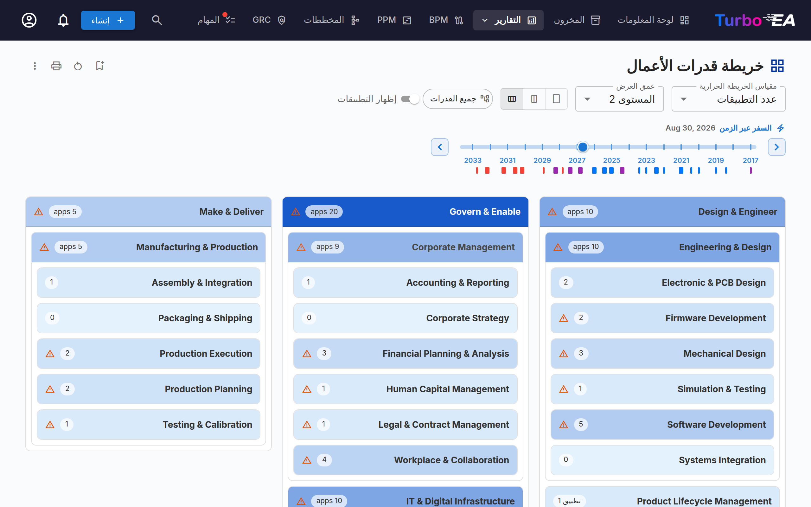

تُظهر **خريطة القدرات** **خريطة حرارية** هرمية لقدرات أعمال المنظمة. يمثّل كل بلوك قدرةً، مع:

- **التسلسل الهرمي** — تحتوي القدرات الرئيسية على قدراتها الفرعية
- **التلوين الحراري** — تُلوَّن البلوكات استنادًا إلى مقياس مختار (مثل عدد التطبيقات الداعمة، أو متوسّط جودة البيانات، أو مستوى الخطر)
- **انقر للاستكشاف** — انقر على أي قدرة للتعمّق في تفاصيلها وتطبيقاتها الداعمة

**تحديد النطاق بقدرات بعينها** — يرسم المخطط جميع القدرات افتراضيًا. استخدم شريحة القدرات في شريط الأدوات لفتح أداة الاختيار وتحديد قدرة واحدة أو أكثر؛ عندئذ يعرض المخطط تلك القدرات وكل ما يندرج تحتها فقط. تُضمَّن القدرات الفرعية تلقائيًا، لذا فإن اختيار قدرة من المستوى الأعلى يمنحك فرعها بالكامل. تُحسب **عمق العرض** ابتداءً من القدرات التي حددتها، لذا يعني «المستوى 2» دائمًا مستويين أسفل ما تنظر إليه. يُحفظ النطاق مع التقرير، فيُعاد فتح التقرير المحفوظ على الفرع نفسه.

**السفر عبر الزمن** — يحمل شريط الخط الزمني أدوات التحوّل ذاتها الموجودة في **تقرير التبعيات**: علامات عند كل تاريخ يدخل فيه تطبيق الخدمة (أزرق) أو يتوقّف (أحمر)، وأقراصًا تسمّي التطبيقات المتغيّرة ما دام الشريط واقفًا على علامة، وزرّي سهم يتنقّلان من تغيير إلى آخر، وشارات تلخّص التحوّل عند النظر إلى المستقبل (وتُدرَج أيضًا في ترويسات الطباعة والتصدير). ويُبرز النقر على علامة أو قرص التغييرَ: مع تفعيل **إظهار التطبيقات** تنبض شارات التطبيقات المتغيّرة بينما يخفت الباقي، ويظهر التطبيق الذي سبق توقّفه في التاريخ المحدّد أثناء النبض فقط؛ ومع إيقافه يقع الإبراز على بلوكات القدرات التي تحتوي التطبيقات المتغيّرة — زرقاء حيث تدخل التطبيقات الخدمة فقط، وحمراء حيث تتوقّف فقط، وأرجوانية حين يحدث الأمران معًا.

**طيّ المرشحات** — يمكن طيّ صفّ **مرشحات التطبيقات**؛ انقر على ترويسته لاستعادة المساحة. وتُحفظ الحالة مع التقرير، ويظل عدد المرشحات النشطة ظاهرًا على الترويسة المطويّة، ويبقى **مسح الكل** في المتناول دون الحاجة إلى فتح الصفّ أولاً.

## تقرير دورة الحياة

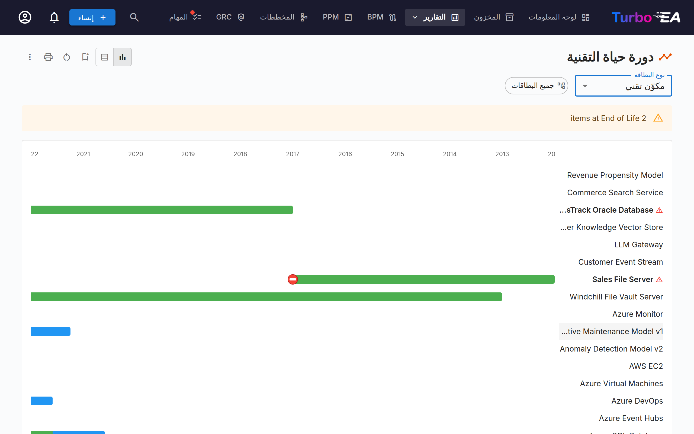

يُظهر **تقرير دورة الحياة** **تصورًا للجدول الزمني** لوقت إدخال المكوّنات التقنية ووقت التخطيط لتقاعدها. وهو حاسم لـ:

- **تخطيط التقاعد** — معرفة المكوّنات التي تقترب من نهاية العمر
- **تخطيط الاستثمار** — تحديد الفجوات حيث تلزم تقنية جديدة
- **تنسيق الترحيل** — تصور فترات الإدخال التدريجي والإخراج التدريجي المتداخلة

تُعرض المكوّنات كأشرطة أفقية تمتدّ عبر مراحل دورة حياتها: التخطيط، والإدخال التدريجي، والنشط، والإخراج التدريجي، ونهاية العمر.

**تحديد النطاق ببطاقات بعينها** — بعد اختيار نوع البطاقة، تفتح الشريحة المجاورة أداة اختيار: حدد بطاقة واحدة أو أكثر، فيعرض الجدول الزمني تلك البطاقات وكل ما يندرج تحتها فقط. تُضمَّن البطاقات الفرعية تلقائيًا. وتظل الشريحة معطَّلة ما دام المحدد على «جميع الأنواع»، لأن تحديد النطاق يحتاج إلى تسلسل هرمي واحد.

## تقرير التبعيات

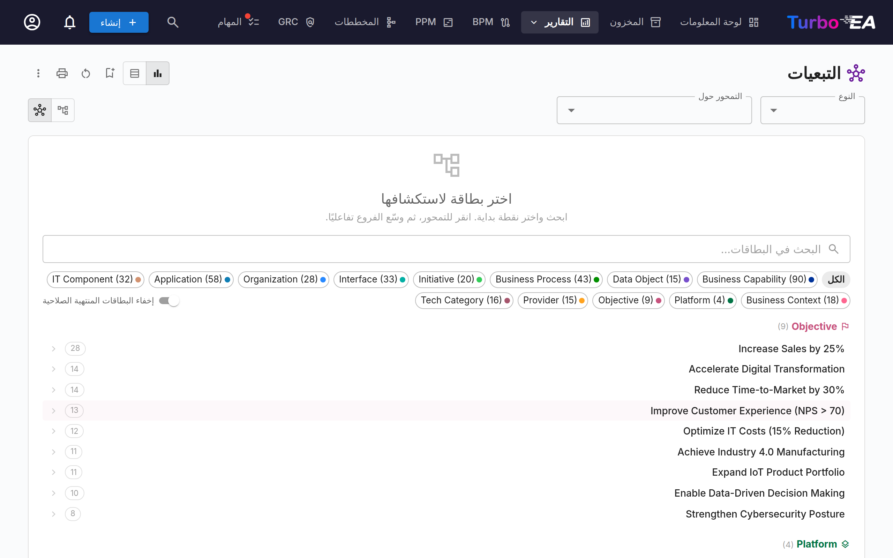

يصوّر **تقرير التبعيات** **الروابط بين المكوّنات** كرسم بياني شبكي. تمثّل العقد البطاقات وتمثّل الحوافّ العلاقات. الميزات:

- **التحكّم في العمق** — تحديد عدد القفزات من العقدة المركزية المراد عرضها (تحديد عمق BFS)
- **تصفية الأنواع** — عرض أنواع بطاقات وأنواع علاقات محدّدة فقط
- **استكشاف تفاعلي** — انقر على أي عقدة لإعادة تمركز الرسم البياني حول تلك البطاقة
- **تحليل التأثير** — فهم نطاق تأثير التغييرات على مكوّن محدّد
- **السفر عبر الزمن** — بعد التركيز على بطاقة (أو التبديل إلى عرض الجدول)، اسحب شريط الخط الزمني لعرض المشهد كما هو في أي تاريخ. تُخفى البطاقات التي لم تدخل الخدمة بعد: تدخل البطاقة إلى المشهد في تاريخ **التفعيل** الخاص بها، لذا فإن البطاقة التي لم يحن تاريخ تفعيلها بعد، أو التي لا تملك تاريخًا للتفعيل أصلًا، تبقى خارج العرض الافتراضي. تظهر البطاقات التي **تُضاف** بين اليوم وتاريخ مستقبلي هي ببساطة جزء من المشهد في ذلك التاريخ: تحمل إطاراً بنفسجياً دون أي وسم، لأن السفر عبر الزمن يعرض الحالة كما ستكون. وتبقى البطاقات **المتوقّفة** على الرسم البياني — باهتة وموسومة *متوقّفة* — في أي تاريخ بعد توقّفها، بحيث يُظهر التحوّل ما يزيله وما يبقيه معًا. ويُخفيها مفتاح **الإبقاء على البطاقات المتوقّفة** في شريط الأدوات لعرض البطاقات النشطة في التاريخ المحدّد فقط. أما نظيره **معاينة البطاقات المخطّطة** فيعرض البطاقات التي لم تبدأ بعد — باهتة وموسومة *قادمة* — في أي تاريخ قبل بدئها، بحيث تُظهر حتى طريقة العرض الحالية أو الماضية ما هو قادم. ويحمل الخط الزمني علامة عند كل تاريخ تدخل فيه بطاقات من الرسم البياني المعروض الخدمة (أزرق) أو تتوقّف (أحمر)؛ انقر على علامة لنقل الشريط مباشرةً إلى ذلك التغيير، أو تنقّل من تغيير إلى آخر بالسهمين بجوار الشريط. وطالما ظلّ الشريط على علامة، تُدرَج البطاقات التي تعدّها على هيئة أقراص أسفل العلامات، مجمَّعة خلف علامة **+** لتلك التي تدخل الخدمة وعلامة **−** لتلك التي تتوقّف — ويحمل كل قرص لون نوع بطاقته، والنقر عليه يُبرز تلك البطاقة وحدها. وتكون العلامة زرقاء حين تدخل البطاقات الخدمة فقط، وحمراء حين تتوقّف فقط، وأرجوانية حين يحدث الأمران معًا. وعندما تتقارب التغييرات، يدمجها الخط الزمني في علامة واحدة تُرسم أعرض مع بيان المدى الذي تغطيه؛ والبطاقة التي تدخل الخدمة وتتوقّف ضمن ذلك المدى تُذكر على الجانبين. ويتعامل السهمان مع العلامة المدمجة كمحطة واحدة: ضغطة واحدة تتجاوز كل ما تغطّيه بدلاً من المرور على التواريخ الكامنة خلفها واحداً تلو الآخر. وعندما يقف الشريط على علامة مدمجة، يُعرض المشهد كما هو في **نهاية** مداها — إذ وقع كل ما تغطّيه — ويذكر التاريخ المجاور للشريط ذلك المدى بدلاً من يوم واحد. كما يُبرز النقر — والانتقال بالسهمين كذلك — البطاقات المعنيّة: تخفت المساحة للحظة بينما تنبض تلك البطاقات بلون العلامة، وتظهر البطاقة المتوقّفة المخفيّة بسبب **الإبقاء على البطاقات المتوقّفة** أثناء النبض فقط. وعند النظر إلى المستقبل، تلخّص شارات فوق الشريط التحوّل (+4 تُضاف · −7 تتوقّف). تُعرض العلاقات مع البطاقات المتوقّفة بخطوط حمراء متقطّعة — وهي الاعتمادات التي يقطعها التحوّل — وما دام الشريط واقفاً على علامة، تبقى البطاقات المتوقّفة عندها على الرسم البياني — باهتة وموسومة *متوقّفة* — حتى مع إيقاف **الإبقاء على البطاقات المتوقّفة**. وتوسم البطاقات الباقية حيث تتغيّر اتصالاتها: أيقونة حمراء لرابط مقطوع حيث يتوقّف جار، وأيقونة زرقاء حيث يدخل جار الخدمة، وكلتاهما عند حدوث الأمرين معاً. والعلامة هي التي تحملها: بمجرد مغادرتها تختفي، فلم يعد إيقاف واحد يسم جيرانه في كل تاريخ لاحق. ينطبق الشريط على جميع طرق العرض، ويُحفظ التاريخ مع التقرير.

تحدّد البطاقة التي تضعها في المركز مقدار ما تراه، ولذلك يعرض المُحدِّد في كل نوع البطاقات الأكثر ارتباطًا أولًا. وعادةً ما تكون القدرة هي الخيار الأكثر إفادة، لأنها نوع البطاقة الوحيد الذي يصل في خطوة واحدة إلى الأهداف فوقها والتطبيقات تحتها. يعرض المُحدِّد **كل بطاقة في المخزون** — عدا المؤرشفة — أيًّا كان التاريخ الذي يقف عنده الخط الزمني: فهنا تختار ما تريد النظر إليه، والشريط مخفيّ في هذه المرحلة، ولذلك تبقى البطاقة التي توقّفت بالفعل، أو التي لم تدخل الخدمة بعد، قابلة للوضع في المركز. أمّا البطاقات التي انتهت صلاحيتها **حتى تاريخ اليوم** (لا حتى تاريخ الخط الزمني) فتحمل شارة *RETIRED* مع تاريخ انتهاء صلاحيتها؛ ويُخفيها مفتاح **إخفاء البطاقات المنتهية الصلاحية** بجوار أقراص الأنواع.

### عرض التبعيات المتعدّد الطبقات

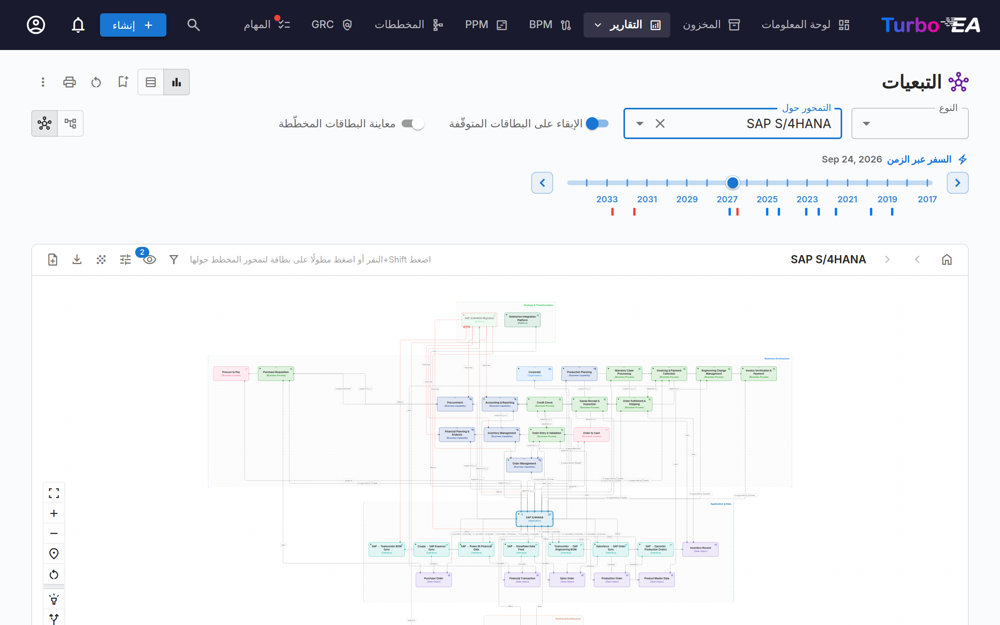

بدِّل إلى **عرض التبعيات المتعدّد الطبقات** باستخدام أزرار وضع العرض في شريط الأدوات. هذه هي تدوين Turbo EA الخاص لعرض التبعيات بين البطاقات عبر طبقات هندسة المؤسسة الأربع — مستوحى من تطبيق طبقات ArchiMate وفلسفة «الإعدادات الافتراضية الجيدة» لنموذج C4، لكنه متمايز عن كليهما. ويُعاد استخدام العرض ذاته في صفحة تفاصيل البطاقة (عارضًا جوار التبعيات المباشر للبطاقة) وفي معالج [TurboLens Architect](turbolens.md#architecture-ai)، فتبدو التبعيات متماثلة في كل مكان.

**قراءة المخطّط**

- **مسارات سباحة متعدّدة الطبقات** — تُجمَّع البطاقات حسب الطبقة المعمارية (الاستراتيجية والتحول، وهندسة الأعمال، والتطبيقات والبيانات، والهندسة التقنية) داخل مستطيلات حدّية متقطّعة، بترتيب ثابت.
- **عقد ملوّنة حسب النوع مع أيقونات** — تُلوَّن كل عقدة حسب نوع بطاقتها وتعرض أيقونة نوع البطاقة في زاويتها العلوية اليسرى، فتكون الأنواع قابلة للتمييز بنظرة سريعة حتى من دون اللون.
- **حوافّ موسومة اتجاهية** — تتبع الحوافّ اتجاه علاقة النموذج الفوقي (المصدر ← الهدف) وتحمل التسمية الأمامية للعلاقة (مثل *uses* و*supports* و*runs on*). وعندما تكون العلاقة مؤهَّلة بقيمة (مثل نوع الدعم *رئيسي*)، تظهر هذه القيمة بين قوسين معقوفين بعد التسمية — على سبيل المثال *supports [رئيسي]*.
- **البطاقات المقترحة** — في معالج TurboLens Architect، تحمل البطاقات غير المعتمَدة بعد حدًّا متقطّعًا وشارة **جديد** خضراء.

**الاستكشاف والتنقّل**

- **التحريك والتكبير والخريطة المصغّرة** — اسحب اللوحة للتحريك، ومرّر للتكبير، واستخدم الخريطة المصغّرة للتنقّل في المخطّطات الكبيرة.
- **انقر للفحص** — انقر على أي عقدة لفتح لوحة تفاصيل البطاقة الجانبية.
- **إعادة التمركز** — اضغط Shift+النقر أو اضغط مطولًا على بطاقة لتمحور المخطّط حولها؛ وتتيح أزرار شريط الأدوات **العودة إلى مُنتقي البطاقات** و**البطاقة السابقة** و**البطاقة التالية** التنقّل خطوة بخطوة عبر سجل تنقّلك.
- **وضع التمييز** — مرِّر المؤشّر فوق بطاقة لإبراز روابطها؛ وعلى الأجهزة اللمسية، فعِّل **وضع التمييز: انقر على بطاقة لتمييز اتصالاتها** في لوحة عناصر التحكّم للإبراز باللمس بدلاً من ذلك.
- **وضع التوسيع** — فعِّل **وضع التوسيع: انقر على بطاقة للكشف عن جميع علاقاتها** في لوحة عناصر التحكّم، ثم انقر على بطاقة للكشف عن جميع علاقاتها عند الطلب. وتحمل البطاقة التي يتمركز عليها الرسم البياني إطاراً مزدوجاً بلون نوعها، وتحمل كل بطاقة توسّعها إطاراً أرفع، بحيث تبقى نقاط استدلالك ظاهرة مع نمو الرسم.
- **إظهار الأصل / إظهار الفروع** — بديلان موجَّهان لوضع التوسيع. فعِّل **إظهار الأصل** (سهم لأعلى) أو **إظهار الفروع** (سهم لأسفل) في لوحة عناصر التحكّم، ثم انقر على بطاقة لإضافة عنصرها الأصل في التسلسل الهرمي أو فروعها المباشرة فقط إلى المخطط. تبقى البطاقات المعروضة على المخطط — لتتمكّن من الجمع بين الأصول والفروع — وتُزال عند إعادة توسيط العرض أو إعادة تعيينه.
- **لا حاجة إلى بطاقة مركزية** — في تقرير التبعيات، يعرض عرض التبعيات المتعدّد الطبقات جميع البطاقات المطابقة لعامل تصفية النوع الحالي، فلا يلزمك اختيار بطاقة بداية أولاً.

**تخصيص العرض** (من شريط الأدوات)

- **العرض على البطاقة** — زر مخصص في شريط الأدوات (رمز العين) يعرض على هيئة **مربعات اختيار** كل ما يمكن أن تعرضه البطاقة: تسمية **النوع**، و**النوع الفرعي**، و**نقطة حالة دورة الحياة**، وكل **حقل سمة** متاح، مصنّفًا تحت نوع البطاقة الذي ينتمي إليه. يظهر أول سطرين على البطاقة نفسها، وتظهر المجموعة الكاملة في التلميح. تُظهر شارة على الزر عدد الأسطر المعروضة حاليًا. تُحفظ الاختيارات بين الزيارات وتنتقل مع **إنشاء مخطط**: يفتح مخطط DrawIO المُنشأ من هذا التقرير بالأسطر نفسها، مختارةً من القائمة نفسها. على الهاتف تُفتح القائمة بملء الشاشة. يزيل **مسح الكل** جميع علامات الاختيار دفعةً واحدة.
- **إظهار البطاقات المنتهية الصلاحية** — تُخفى افتراضيًا البطاقات المرتبطة التي وصلت إلى نهاية العمر **بحلول التاريخ المحدّد على الخط الزمني** للحفاظ على تركيز الرسم البياني؛ فعِّل هذا الزر (في قائمة **خيارات العرض**) لإظهارها مجددًا. وتُعرض دائمًا البطاقة التي يتم التركيز عليها، حتى لو كانت هي نفسها منتهية الصلاحية.
- **إظهار تسميات العلاقات** — يُرسم فعل كل علاقة (*يدعم*، *يستخدم*، …) على خطها. مُفعّل افتراضيًا؛ أوقِفه من قائمة **خيارات العرض** للحصول على مساحة أوضح في المشهد المزدحم. فالخطوط ورؤوس أسهمها ما زالت تُظهر ما يرتبط بماذا وفي أي اتجاه.
- **إظهار قيم العلاقات** — يمكن تأهيل كثير من العلاقات بقيمة (مثلًا يَدعم تطبيقٌ قدرةً بوصفه *رئيسيًا* أو *داعمًا* أو *بلا دعم*). وعند التفعيل (الوضع الافتراضي)، تظهر هذه القيم بين قوسين معقوفين بجانب تسمية العلاقة (*supports [رئيسي]*) وتُضمَّن في عمليات تصدير الصور. أوقِف تشغيلها من قائمة **خيارات العرض** للحصول على عرض أنظف؛ وتبقى العلاقات بلا قيمة دون تغيير في جميع الأحوال.
- **نمط الخط** — اختر كيفية رسم خطوط الاتصال في الوضع العادي: **متصل** أو **منقّط** أو **متقطّع** (الافتراضي) أو **تقطيع طويل**، من قائمة **خيارات العرض**. عند تمرير المؤشر يُرسم الخط متصلاً دائماً، وتحتفظ التبعية المقطوعة بتقطيعها الخاص.
- **إعادة الترتيب** — اسحب بطاقة لتحريكها ضمن طبقتها، أو اسحب **صندوق طبقة** كاملًا لتحريكه مع جميع بطاقاته. ويستعيد **إعادة تعيين العرض** (في شريط الأدوات الأيسر) الترتيب التلقائي ويمحو أي استكشاف.
- **الخلفية** — بدِّل خلفية اللوحة بين الشبكة والنقاط وبلا.
- **التصدير وملء الشاشة** — صدِّر المخطّط بصيغة **PNG** أو **SVG**، أو افتحه في **ملء الشاشة**.
- **إنشاء مخطط** — حوِّل العرض الحالي إلى مخطط جديد قابل للتحرير في [وحدة المخططات](diagrams.md). تُعاد إنشاء البطاقات والعلاقات ومسارات طبقات البنية الأربع، ويظل كل شكل مرتبطًا ببطاقة المخزون الخاصة به. يُطلب منك اسم، ثم تُنقل مباشرة إلى المخطط الجديد. متاح للمستخدمين الذين يمكنهم إنشاء المخططات.

## تقرير التكلفة

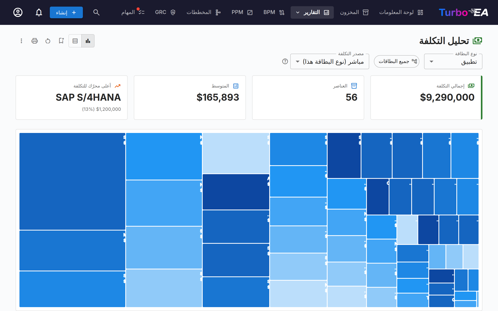

يوفّر **تقرير التكلفة** تحليلاً ماليًا لمشهدك التقني:

- **عرض الخريطة الشجرية** — مستطيلات متداخلة بحجم يتناسب مع التكلفة، مع تجميع اختياري (مثل التجميع حسب المنظمة أو القدرة)
- **عرض المخطّط الشريطي** — مقارنة التكلفة عبر المكوّنات
- **نوع البطاقة** — اختر نوع البطاقة الذي يُبنى حوله التقرير (تطبيق، مكوّن تقني، مزوّد، …).

### مصدر التكلفة

عندما يحمل نوع البطاقة المختار نوع علاقة واحدًا على الأقل يشير إلى نوع يملك حقل تكلفة، يظهر منتقي **مصدر التكلفة** بجوار **نوع البطاقة**. وهو يتيح لك اختيار مصدر الأرقام:

- **مباشر (نوع البطاقة هذا)** — افتراضي؛ يجمع حقل التكلفة على البطاقات المعروضة نفسها. استخدمه عند النظر في *التطبيقات* أو *المكوّنات التقنية* مباشرةً.
- **تجميع من البطاقات المرتبطة** — حدّد إدخالاً واحدًا أو أكثر من نوع `Type · Field` (مثل `Application · Total Annual Cost` و`IT Component · Total Annual Cost`). يصبح عندئذٍ رقم كل بطاقة أساسية مجموع ذلك الحقل عبر بطاقاتها المرتبطة.

المنتقي **متعدّد التحديد**، فيمكن أن يجمع تجميع واحد عدّة أنواع مرتبطة دفعة واحدة. على سبيل المثال، عند عرض **مزوّد** لـ *Microsoft*، يؤدّي تحديد كلٍّ من `Application · Total Annual Cost` و`IT Component · Total Annual Cost` إلى إظهار بصمة المزوّد الكاملة — Teams وM365 وAzure وأي مكوّنات أخرى يوفّرها Microsoft — كرقم واحد.

#### لماذا لا يُحسب أي شيء مرّتين

صُمِّم المنتقي بحيث يكون الحساب المزدوج مستحيلاً بالبنية:

- كل إدخال هو زوج `(target type, cost field)` فريد — تعرض القائمة المنسدلة كل زوج مرّة واحدة بالضبط، حتى عندما تصل عدّة أنواع علاقات إلى نوع الهدف ذاته.
- ضمن الزوج الواحد، تساهم بطاقتان مرتبطتان عبر عدّة أنواع علاقات بتكلفتهما مرّة واحدة فقط.
- عبر الإدخالات المختلفة، لا يمكن لأي بطاقة أن تساهم مرّتين: للبطاقة نوع واحد بالضبط، وحقول التكلفة المختلفة على البطاقة ذاتها قيم مستقلّة.

تكرّر **أيقونة مساعدة صغيرة (?)** بجوار المنتقي هذا الضمان عند تمرير المؤشّر.

تُنشأ قائمة الخيارات من نموذجك الفوقي — تُكتشف أنواع العلاقات وحقول التكلفة وقت العرض، فيصبح أي نوع بطاقة مخصّص أو علاقة تضيفها مصدر تكلفة صالحًا تلقائيًا.

### التعمّق في مستطيل

عندما يكون مصدر تكلفة واحد على الأقل نشطًا، تكون مستطيلات الخريطة الشجرية **قابلة للنقر**. يؤدّي النقر على أحدها إلى استبدال المخطّط بتفصيل تكلفة ذلك المستطيل — البطاقات المرتبطة التي ساهمت في تجميعه، بحجم يتناسب مع تكلفتها المباشرة. يظهر مسار تنقّل فوق المخطّط، مثل **All Applications › NexaCore ERP**؛ انقر على أي جزء للعودة لأعلى.

- **مصدر تكلفة واحد نشط** — يعرض التعمّق خريطة شجرية واحدة للبطاقات المرتبطة (مثل النقر على *NexaCore ERP* مع تحديد `IT Component · Total Annual Cost` يعرض المكوّنات التقنية المرتبطة بـ NexaCore ERP، بحجم يتناسب مع تكلفتها السنوية).
- **مصادر تكلفة متعدّدة نشطة** — يعرض التعمّق **خريطة شجرية واحدة لكل مصدر جنبًا إلى جنب** (عمود واحد على نوافذ العرض الضيّقة، وعمودان على الواسعة). لكل لوحة رأسها الخاص، وإجماليها الخاص، ونسبتها `% of total` لكل لوحة في التلميح — فتبقى أنواع البطاقات المختلفة على مقياسها الخاص بدلاً من ضغطها في مخطّط واحد.

يُحافَظ على شريط تمرير الجدول الزمني، وتحديد مصدر التكلفة، وعوامل التصفية الأخرى أثناء التعمّق، ويُعدّ المستوى المتعمَّق فيه جزءًا من تهيئة التقرير المحفوظ — فحفظ تقرير أثناء التعمّق يعيد فتحه مباشرةً عند ذلك المستوى. ومع عدم وجود مصدر تكلفة نشط، يفتح النقر على مستطيل لوحة البطاقة الجانبية بدلاً من ذلك (إذ لا شيء يُفصَّل).

**تحديد النطاق ببطاقات بعينها** — تفتح الشريحة المجاورة لمحدد نوع البطاقة أداة اختيار: حدد بطاقة واحدة أو أكثر، فتقتصر الخريطة الشجرية والإجماليات والجدول على تلك البطاقات وكل ما يندرج تحتها. وتُخفى الشريحة أثناء التعمق داخل مستطيل، لأن التعمق نقلك بالفعل إلى نوع بطاقة آخر؛ وبالخروج منه يبقى النطاق كما هو.

## تقرير المصفوفة

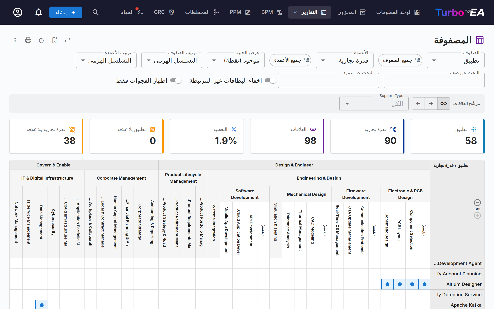

يُنشئ **تقرير المصفوفة** **شبكة مرجعية متقاطعة** بين نوعي بطاقة. على سبيل المثال:

- **الصفوف** — التطبيقات
- **الأعمدة** — قدرات الأعمال
- **الخلايا** — تشير إلى ما إذا كانت هناك علاقة (وكم عددها)

هذا مفيد لتحديد فجوات التغطية (القدرات التي لا تطبيقات داعمة لها) أو التكرارات (القدرات التي تدعمها تطبيقات أكثر من اللازم).

استخدم مفتاح **إخفاء البطاقات غير المرتبطة** لإخفاء الصفوف والأعمدة الخاصة بالبطاقات التي ليس لها أي علاقات، مع الاحتفاظ فقط بالبطاقات التي تشارك في علاقة واحدة على الأقل. يظل العرض الكامل الذي يعرض جميع البطاقات هو الإعداد الافتراضي.

### ما تعرضه كل خلية

يوفّر عنصر التحكم **عرض الخلية** أربعة خيارات:

- **موجودة (نقطة)** — نقطة أينما وُجدت علاقة.
- **العدد (خريطة حرارية)** — عدد العلاقات، مظلّلًا حسب الكثافة.
- **القيم (رموز)** — حرف ملوّن لكل قيمة علاقة، مع مفتاح فوق الشبكة. الأنسب للمصفوفات الكبيرة.
- **القيم (تسميات)** — أسماء القيم كاملة. تتّسع الأعمدة، لذا يناسب هذا الخيار المصفوفات الأصغر.

تأتي الحروف والأسماء من السمات التي تعلنها أنواع العلاقات لديك، وبلغتك أنت. تُقرأ علاقة CRUD على هيئة `C R U D`؛ وتعرض علاقة الملكية قيمها الخاصة. أضِف قيمة إلى نوع علاقة في [النموذج الوصفي](../admin/metamodel.md) فتظهر هنا دون أي إعداد إضافي. تعرض خلية المجموعة المطوية عددًا دائمًا، لأنها قد تشمل قيمًا مختلفة كثيرة — وسِّع مستوى لرؤيتها.

قد تحمل البطاقة التي لها بطاقات فرعية في التسلسل الهرمي علاقات خاصة بها أيضًا. وعندها تحصل على صف (أو عمود) خاص بها يحمل التسمية **(نفسه)** أسفل عنوان مجموعتها مباشرة، فتجد تلك العلاقات مكانًا تظهر فيه بدل أن تضيع بين الأصل وفروعه. وعند طي المستوى تُحتسب ضمن خلية المجموعة مع علاقات الفروع.

### التصفية حسب العلاقة

يضيّق شريط المرشّحات فوق الشبكة المصفوفة إلى العلاقات التي تهمّك:

- **نوع العلاقة** — عندما يكون نوعا البطاقة مرتبطين في كلا الاتجاهين.
- **الاتجاه** — هل بطاقة الصف هي مصدر العلاقة أم هدفها.
- **القيم** — مرشّح لكل سمة تعلنها أنواع العلاقات، بما في ذلك «(فارغ)» للعلاقات التي لم تُضبط قيمتها قط.

تُفرِغ التصفية خلايا البطاقات التي لم تعد مطابقة، لذا فإن تفعيل **إخفاء البطاقات غير المطابقة** يُبقي المطابقة وحدها. بعض الأمثلة:

- تطبيق × كائن بيانات، مع التصفية على *إنشاء* — أي التطبيقات هي النظام المرجعي لكل كائن بيانات.
- تطبيق × واجهة، مع التصفية حسب الاتجاه — من ينشر الواجهة ومن يستهلكها.
- مؤسسة × تطبيق، مع التصفية على *المالك* — خريطة الملكية دون أن يزدحمها المستخدمون.

### العثور على فجوات التغطية

تحسب بطاقتان عدد البطاقات على كل محور التي لا تملك أي علاقة على الإطلاق. يقلّص خيار **إظهار الفجوات فقط** الشبكة إلى هذه البطاقات بالضبط — القدرات التي لا يدعمها أحد، وكائنات البيانات التي لا يصونها أحد.

### التنقّل داخل مصفوفة كبيرة

يعمل **البحث عن صف** و**البحث عن عمود** على تصفية المحاور بالاسم؛ ويظل العنصر الأب ظاهرًا عندما يطابق أحد أبنائه. ويبدّل زر التبديل في شريط العنوان المحورين.

### التصدير

يُنتج التصدير إلى Excel ورقتين: الشبكة كما تظهر على الشاشة، وسطرًا لكل علاقة مع قيمها موزّعة على أعمدة — وهي الورقة التي تبني عليها جدولًا محوريًا. أما التصدير إلى PowerPoint فيلتقط الصورة.

**تحديد نطاق كل محور** — لكل محور شريحته الخاصة بجوار محدد نوعه، بحيث يمكنك طلب «هذه القدرات × هذه التطبيقات». وتتبع بطاقات المؤشرات أعلى الشبكة النطاقَ المحدد، فتصف الأرقام دائمًا ما تنظر إليه. ويؤدي تغيير نوع البطاقة لأحد المحورين إلى مسح نطاق ذلك المحور؛ وعند التبديل يتبادل النطاقان مواضعهما مع المحورين.

## تقرير جودة البيانات

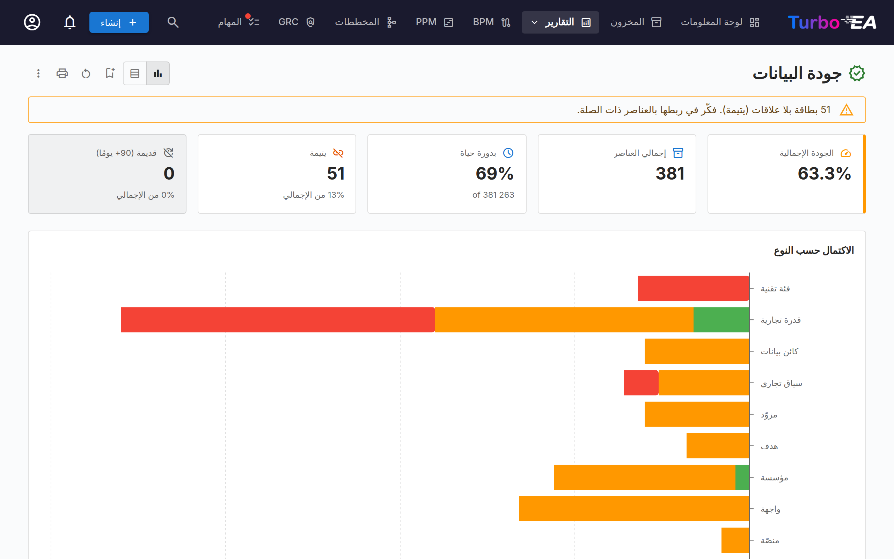

**تقرير جودة البيانات** هو **لوحة معلومات اكتمال** تُظهر مدى جودة تعبئة بيانات هندستك. استنادًا إلى أوزان الأهمية المُهيّأة في علامة تبويب **جودة البيانات** لكل نوع بطاقة (كل حقل إضافةً إلى عوامل الوصف ودورة الحياة والعلاقات الإلزامية والوسوم الإلزامية المُضمَّنة):

- **الدرجة الإجمالية** — متوسّط جودة البيانات عبر جميع البطاقات
- **حسب النوع** — تفصيل يُظهر أنواع البطاقات الأفضل/الأسوأ اكتمالاً
- **البطاقات الفردية** — قائمة بالبطاقات ذات أدنى جودة بيانات، مرتّبة بالأولوية للتحسين

البطاقات التي تحتوي على **حقل إلزامي** فارغ تحصل دائمًا على **0%** — ولا يُستأنف الحساب المرجّح إلا بعد تعبئة جميع الحقول الإلزامية — وبذلك تُظهر قائمة أدنى الدرجات بالضبط البطاقات التي لا تزال بياناتها الإلزامية ناقصة.

### التعمّق في رقم

كل رقم في التقرير هو مدخل، لا مجرّد قراءة:

- **انقر على جزء من شريط** في *الاكتمال حسب النوع* — تُفتح لوحة على اليمين تسرد بطاقات ذلك النوع ضمن ذلك النطاق (مكتمل أو جزئي أو أدنى).
- **انقر على شريط** في *متوسّط الاكتمال حسب النوع*، أو على صف في عرض الجدول، لسرد كل بطاقات ذلك النوع.
- **انقر على مربّع «يتيمة» أو «قديمة»** لسرد البطاقات وراء ذلك العدد.

من اللوحة، انقر على أي بطاقة لفتح لوحة تفاصيلها، أو اضغط **عرض في المخزون** للمتابعة في [المخزون](inventory.md) — الذي يُفتح مُجمَّعًا حسب جودة البيانات مع توسيع النطاق الذي نقرته وطيّ البقية بجانبه، لتبدأ تصحيح السجلات فورًا. تربط لوحتا «يتيمة» و«قديمة» بمرشّح المخزون المقابل عبر كل أنواع البطاقات.

## تقرير نهاية العمر (EOL)

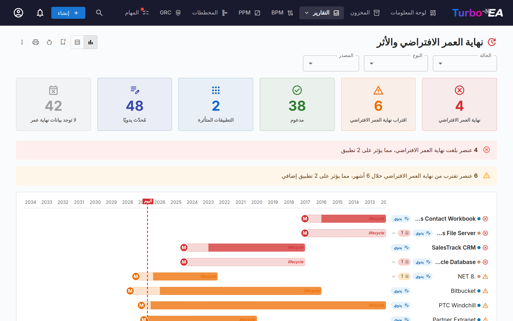

يُظهر **تقرير EOL** حالة دعم منتجات التقنية المرتبطة عبر ميزة [إدارة EOL](../admin/eol.md):

- **توزيع الحالة** — كم عدد المنتجات المدعومة، أو المقتربة من EOL، أو في نهاية العمر
- **الجدول الزمني** — متى ستفقد المنتجات الدعم
- **تحديد أولوية المخاطر** — التركيز على المكوّنات الحرجة المهمّة المقتربة من EOL

## التقارير المحفوظة

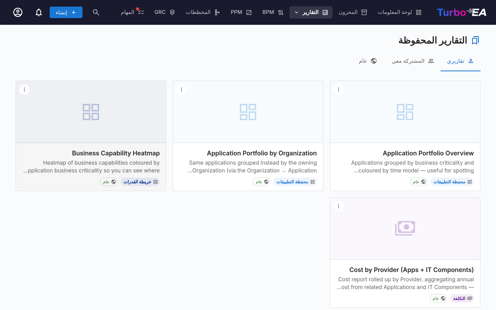

احفظ أي تهيئة تقرير للوصول السريع لاحقًا. تتضمّن التقارير المحفوظة معاينة مصغّرة ويمكن مشاركتها عبر المنظمة.

## تصدير التقارير

يدعم كل تقرير **التصدير إلى Excel‏ ‎(.xlsx)‎** و**التصدير إلى PowerPoint‏ ‎(.pptx)‎** من قائمة **⋮** في شريط العنوان (إلى جانب الطباعة ونسخ الرابط).

- **Excel** — ينتج ورقة واحدة لكل جدول بيانات معروض حاليًا، بأعمدة ذاتية الحجم مع الحفاظ على تنسيق العملة / الأرقام. بدِّل إلى **عرض الجدول** قبل التصدير لالتقاط الصفوف الأساسية.
- **PowerPoint** — يُنشئ عرضًا تقديميًا تجمع شريحته الأولى عنوان التقرير، وطابع وقت الإنشاء، وملخّص عوامل التصفية النشطة، والمخطّط الحيّ بجودة العرض التقديمي. تقسّم الشرائح اللاحقة جداول البيانات إلى صفحات لتكون نشرات جاهزة للمشاركة.

تُسجَّل عوامل التصفية النشطة وخيارات التجميع المطبّقة لحظة التصدير على شريحة العنوان / صفّ الرأس، فتبقى عمليات التصدير مفهومة ذاتيًا.

## خريطة العمليات

تصوّر **خريطة العمليات** مشهد عمليات أعمال المنظمة كخريطة منظَّمة، عارضةً فئات العمليات (الإدارة، الأساسية، الدعم) وعلاقاتها الهرمية.

**تحديد النطاق بعمليات بعينها** — تفتح الشريحة المجاورة لـ«عمق العرض» أداة اختيار: حدد عملية واحدة أو أكثر، فيعرض المخطط تلك العمليات وكل ما يندرج تحتها فقط. تُضمَّن العمليات الفرعية تلقائيًا، ويُحسب **عمق العرض** ابتداءً من اختيارك. ولا يزال التكبير بالنقر يعمل، وأصبح الآن ضمن النطاق المحدد. وهذا عنصر تحكم مختلف عن صف **النطاق** أدناه الذي يصفّي حسب المؤسسة أو سياق الأعمال المرتبط.
