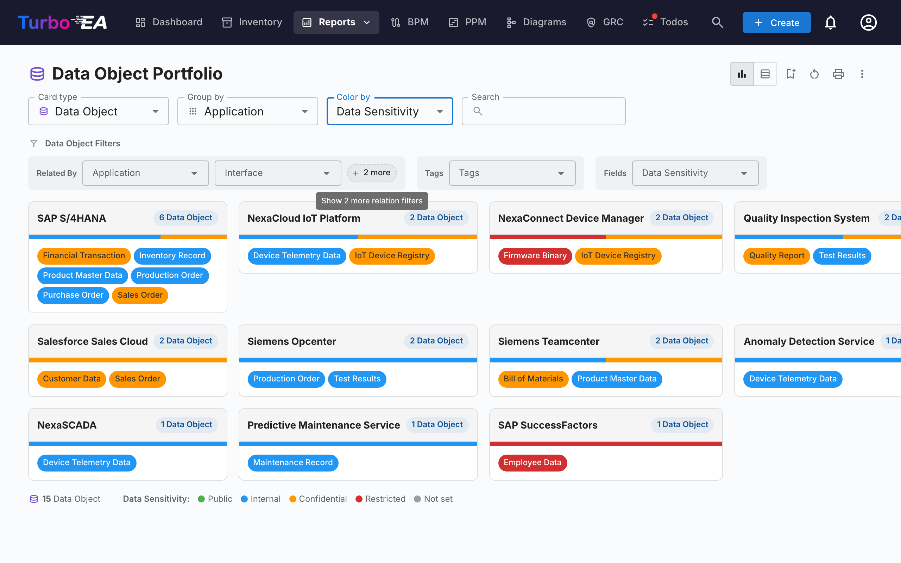

# Rapporter

Turbo EA indeholder et kraftfuldt **visuelt rapporteringsmodul**, der gør det muligt at analysere virksomheds­arkitekturen fra forskellige perspektiver. Alle rapporter kan [gemmes til genbrug](saved-reports.md) med deres aktuelle filter- og akse­konfiguration.

## Porteføljerapport

**Porteføljerapporten** viser et konfigurerbart **boblediagram** (eller scatter plot) over dine kort. Du vælger, hvad hver akse repræsenterer:

- **X-akse** — Vælg et hvilket som helst numerisk eller select-felt (f.eks. Technical Suitability)
- **Y-akse** — Vælg et hvilket som helst numerisk eller select-felt (f.eks. Business Criticality)
- **Boblestørrelse** — Tildel et numerisk felt (f.eks. Annual Cost)
- **Boblefarve** — Tildel et select-felt eller livscyklus­tilstand

Dette er ideelt til porteføljeanalyse — for eksempel at plotte applikationer efter forretningsværdi vs. teknisk egnethed for at identificere kandidater til investering, udskiftning eller pensionering.

### AI Portfolio Insights

Når AI er konfigureret, og porteføljeindsigter er aktiveret af en administrator, viser porteføljerapporten en **AI Insights**-knap. Klikker du på den, sendes et resumé af din aktuelle visning til AI-udbyderen, som returnerer strategiske indsigter om koncentrationsrisici, modernisations­muligheder, livscyklus­bekymringer og porteføljebalance. Indsigtspanelet kan foldes sammen og kan regenereres efter ændring af filtre eller gruppering.

## Fleksibel portefølje

**Fleksibel portefølje** bruger samme kontroller som Application Portfolio, men tilføjer en **Card type**-vælger øverst i værktøjslinjen. Brug den til at analysere en portefølje af Business Capabilities, Initiatives, IT Components eller en hvilken som helst anden synlig korttype med samme grupperings-, farvelægnings- og filteroplevelse.

Skærmbilledet ovenfor viser en typisk use case: vælg **Data Object** som korttype, **Group by → Application** for at se hvilke apps der ejer hvilke data, og **Color by → Data Sensitivity** for med et øjekast at fremhæve, hvor fortrolige data ligger.

Ved skift af korttype ryddes valg af gruppering, farvelægning og filtre (de refererer til feltnøgler, der ikke findes på den nye type), og rapporten genindlæses med de felter, relationer og tags, der gælder for den valgte type. Rapporten deler samme tilladelse som Application Portfolio (`reports.portfolio`) og gemmes uafhængigt af den.

### Relationsundertyper

Når et korts relationer bærer en «type»-værdi — for eksempel **anvendelsestypen** (Ejer / Bruger / Interessent) på Organisation→Applikation-relationer eller **supporttypen** på Applikation→Forretningskapabilitet-relationer — kan du farve kortene efter den værdi og filtrere på den. **Gruppér rapporten efter den relaterede korttype** for at bruge dem (f.eks. *Gruppér efter → Organisation* for at låse op for *anvendelsestype*): undertypen vises derefter under gruppen **Relationsundertyper** i *Farvelæg efter*-rullelisten og som sin egen filterrække. Da hvert kort vises under ét relateret kort, farves det efter *den* relation — en applikation, der er *Bruger* af én organisation, vises som Bruger der, selv om den ejes af en anden.

## Kompetencekort

**Kompetencekortet** viser et hierarkisk **heatmap** over organisationens forretningskompetencer. Hver blok repræsenterer en kompetence med:

- **Hierarki** — Hovedkompetencer indeholder deres underkompetencer
- **Heatmap-farvelægning** — Blokke er farvet baseret på en valgt metrik (f.eks. antal understøttende applikationer, gennemsnitlig datakvalitet eller risikoniveau)
- **Klik for at udforske** — Klik på en kompetence for at drille ned i dens detaljer og understøttende applikationer

## Livscyklusrapport

**Livscyklusrapporten** viser en **tidslinje­visualisering** af, hvornår teknologikomponenter blev introduceret, og hvornår de er planlagt til at blive pensioneret. Kritisk for:

- **Pensionerings­planlægning** — Se hvilke komponenter der nærmer sig end-of-life
- **Investerings­planlægning** — Identificer huller, hvor ny teknologi er nødvendig
- **Migrations­koordinering** — Visualiser overlappende phase-in- og phase-out-perioder

Komponenter vises som vandrette bjælker, der spænder over deres livscyklus-faser: Plan, Phase In, Active, Phase Out og End of Life.

## Afhængighedsrapport

**Afhængighedsrapporten** visualiserer **forbindelser mellem komponenter** som en netværksgraf. Noder repræsenterer kort, og kanter repræsenterer relationer. Funktioner:

- **Dybde-kontrol** — Begræns hvor mange hop fra centerknuden der skal vises (BFS-dybde­begrænsning)
- **Type-filtrering** — Vis kun specifikke korttyper og relations­typer
- **Interaktiv udforskning** — Klik på en node for at centrere grafen om det kort
- **Impact-analyse** — Forstå sprængradius af ændringer på en specifik komponent

### Lagdelt afhængighedsvisning

Skift til **lagdelt afhængighedsvisning** ved hjælp af view-mode-knapperne i værktøjslinjen. Dette er Turbo EA's husnotation til at vise afhængigheder mellem kort på tværs af de fire EA-lag — inspireret af ArchiMate's lagdeling og C4-modellens »good defaults«-filosofi, men adskilt fra begge. Den samme visning genbruges på Kortdetalje-siden (viser kortets umiddelbare afhængigheds­nabolag) og i [TurboLens Architect](turbolens.md#architecture-ai)-guiden, så afhængigheder ser ens ud overalt.

**Læsning af diagrammet**

- **Lagdelte svømmebaner** — Kort er grupperet efter arkitekturlag (Strategy & Transformation, Business Architecture, Application & Data, Technical Architecture) inden i stiplede grænse-rektangler, i fast rækkefølge.
- **Type-farvede noder med ikoner** — Hver node er farvet efter sin korttype og viser korttype-ikonet i sit øverste venstre hjørne, så typer er genkendelige med et øjekast, selv uden farve.
- **Retningsbestemte mærkede kanter** — Kanter følger metamodel-relations-retningen (source → target) og bærer relationens forward label (f.eks. *uses*, *supports*, *runs on*).
- **Foreslåede kort** — I TurboLens Architect-guiden har endnu-ikke-committede kort en stiplet kant og et grønt **NY**-badge.

**Udforskning og navigation**

- **Panorering, zoom, minimap** — Træk i lærredet for at panorere, scroll for at zoome, og brug minimappet til at navigere store diagrammer.
- **Klik for at inspicere** — Klik på en node for at åbne sidepanelet med kortdetaljer.
- **Re-centrér** — Shift-klik eller hold på et kort for at centrere diagrammet om det; værktøjslinjens knapper **Tilbage til kortvælger**, **Forrige kort** og **Næste kort** trinner gennem din navigationshistorik.
- **Fremhævningstilstand** — Hold musen over et kort for at fremhæve dets forbindelser; på touch-enheder slås **Fremhævningstilstand: klik på et kort for at fremhæve dets forbindelser** til i kontrolpanelet for at tap-fremhæve i stedet.
- **Udvidelsestilstand** — Slå **Udvidelsestilstand: klik på et kort for at afsløre alle dets relationer** til i kontrolpanelet, og klik derefter på et kort for at afsløre alle dets relationer efter behov.
- **Ingen centerkort påkrævet** — På Afhængighedsrapporten viser den lagdelte afhængighedsvisning alle kort, der matcher det aktuelle type-filter, så du behøver ikke at vælge et startkort først.

**Tilpasning af visningen** (fra værktøjslinjen)

- **Kortvisnings-menu** — Slå **type**-mærkatet og en **livscyklusstatus-prik** til, slå **overordnet hierarki** til (tilføjer hvert korts overordnede kort og tegner indeholdelsesforbindelsen *indeholder / del af*), og vælg **ekstra attributfelter** at vise på hvert kort — de første to gengives på kortet, og hele sættet vises i værktøjstippet ved hover. Valgene huskes mellem besøg.
- **Vis kort ved slutningen af deres levetid** — Relaterede kort, hvis livscyklus har nået slutningen af levetiden, skjules som standard for at holde grafen fokuseret; slå denne til/fra (i menuen **Kortvisning**) for at vise dem igen. Det kort, du er centreret om, vises altid, også hvis det selv er ved slutningen af sin levetid.
- **Omarrangér** — Træk et kort for at flytte det inden for dets lag, eller træk en hel **lag-boks** for at flytte den med alle dens kort. **Nulstil layout** gendanner den automatiske placering.
- **Baggrund** — Skift lærredsbaggrunden mellem gitter, prikker og ingen.
- **Eksport og fuldskærm** — Eksportér diagrammet til **PNG** eller **SVG**, eller åbn det i **fuldskærm**.

## Omkostningsrapport

**Omkostningsrapporten** giver finansiel analyse af dit teknologilandskab:

- **Treemap-visning** — Indlejrede rektangler størrelses-justeret efter omkostning, med valgfri gruppering (f.eks. efter organisation eller kompetence)
- **Bar chart-visning** — Omkostnings­sammenligning på tværs af komponenter
- **Card Type** — Vælg hvilken korttype rapporten er bygget omkring (Application, IT Component, Provider, …).

### Cost Source

Når den valgte korttype har mindst én relations­type, der peger på en type, der ejer et omkostningsfelt, vises en **Cost Source**-vælger ved siden af **Card Type**. Den lader dig vælge, hvor tallene kommer fra:

- **Direct (this card type)** — standard; summerer omkostningsfeltet på de viste kort selv. Brug dette, når du ser direkte på *Applications* eller *IT Components*.
- **Aggregate from related cards** — marker en eller flere `Type · Field`-poster (for eksempel `Application · Total Annual Cost`, `IT Component · Total Annual Cost`). Hvert primær-korts tal bliver så summen af det felt på tværs af dets relaterede kort.

Vælgeren er **multi-valg**, så en enkelt opsamling kan kombinere flere relaterede typer i én bevægelse. For eksempel, når du ser **Provider** for *Microsoft*, viser markering af både `Application · Total Annual Cost` og `IT Component · Total Annual Cost` leverandørens fulde fodaftryk — Teams, M365, Azure og enhver anden Microsoft-leveret komponent — som ét tal.

#### Hvorfor intet bliver talt to gange

Vælgeren er bygget, så dobbelttælling er umulig ved konstruktion:

- Hver post er et unikt `(target type, cost field)`-par — dropdownen tilbyder hvert par præcis én gang, selv når flere relations­typer når den samme target-type.
- Inden for et enkelt par bidrager to kort linket gennem flere relations­typer stadig kun med deres omkostning én gang.
- På tværs af forskellige poster kan intet kort bidrage to gange: et kort har præcis én type, og forskellige omkostningsfelter på samme kort er uafhængige værdier.

Et lille **hjælpe-ikon (?)** ved siden af vælgeren gentager denne garanti ved hover.

Listen over muligheder genereres fra din metamodel — relations­typer og omkostningsfelter opdages ved render-tid, så en hvilken som helst brugerdefineret korttype eller relation, du tilføjer, bliver automatisk en gyldig Cost Source.

### Dril ned i et rektangel

Når mindst én Cost Source er aktiv, er treemap-rektanglerne **klikbare**. Klik på et rektangel erstatter diagrammet med nedbrydningen af rektanglets omkostning — de relaterede kort, der bidrog til dens opsamling, størrelses-justeret efter deres direkte omkostning. En brødkrumme vises over diagrammet, f.eks. **All Applications › NexaCore ERP**; klik på et segment for at gå tilbage.

- **Enkelt Cost Source aktiv** — drill gengiver én treemap over de relaterede kort (f.eks. ved klik på *NexaCore ERP* med `IT Component · Total Annual Cost` markeret vises de IT Components, der er linket til NexaCore ERP, størrelses-justeret efter deres årlige omkostning).
- **Flere Cost Sources aktive** — drill gengiver **én treemap pr. kilde side om side** (1 kolonne på smalle viewports, 2 på brede). Hvert panel har sin egen overskrift, sit eget total og sit eget pr.-panel `% af total` i tooltip'en — så forskellige korttyper forbliver på deres egen skala i stedet for at blive presset ind i ét diagram.

Tidslinjeskyderen, Cost Source-valget og andre filtre bevares, mens du driller, og det drillede niveau er en del af den gemte rapports konfiguration — at gemme en rapport, mens du har drillet ind, genåbner direkte på det niveau. Uden **nogen** Cost Source aktiv åbner klik på et rektangel kort-sidepanelet i stedet (der er intet at bryde ned).

## Matrixrapport

**Matrixrapporten** opretter et **krydsreference­gitter** mellem to korttyper. For eksempel:

- **Rækker** — Applications
- **Kolonner** — Business Capabilities
- **Celler** — Indikerer om en relation eksisterer (og hvor mange)

Dette er nyttigt til at identificere dækningshuller (kompetencer uden understøttende applikationer) eller redundanser (kompetencer understøttet af for mange applikationer).

## Datakvalitetsrapport

**Datakvalitetsrapporten** er et **fuldstændigheds-dashboard**, der viser, hvor godt dine arkitekturdata er udfyldt. Baseret på de vigtighedsniveauer, der er konfigureret i fanen **Datakvalitet** for hver korttype (hvert felt plus de indbyggede faktorer Beskrivelse, Livscyklus, obligatoriske relationer og obligatoriske tags):

- **Samlet score** — Gennemsnitlig datakvalitet på tværs af alle kort
- **Efter type** — Nedbrydning, der viser hvilke korttyper der har den bedste/dårligste fuldstændighed
- **Individuelle kort** — Liste over kort med den laveste datakvalitet, prioriteret til forbedring

## End of Life (EOL)-rapport

**EOL-rapporten** viser support-status for teknologiprodukter linket via funktionen [EOL-administration](../admin/eol.md):

- **Status-fordeling** — Hvor mange produkter er Supported, Approaching EOL eller End of Life
- **Tidslinje** — Hvornår produkter mister support
- **Risiko­prioritering** — Fokuser på missionskritiske komponenter, der nærmer sig EOL

## Gemte rapporter

Gem en hvilken som helst rapportkonfiguration til hurtig adgang senere. Gemte rapporter inkluderer en miniature og kan deles på tværs af organisationen.

## Eksport af rapporter

Hver rapport understøtter **Export to Excel (.xlsx)** og **Export to PowerPoint (.pptx)** fra **⋮**-menuen i titellinjen (sammen med Print og Copy link).

- **Excel** — Producerer ét ark pr. datatabel, der aktuelt er gengivet, med auto-justerede kolonner og valuta- / talformatering bevaret. Skift til **Table view** før eksport for at fange de underliggende rækker.
- **PowerPoint** — Genererer et deck, hvis første slide kombinerer rapporttitlen, generationstidsstempel, aktivt filter-resumé og det levende diagram i præsentationskvalitet. Efterfølgende slides paginerer datatabellerne til dele-klar uddelingsmateriale.

Aktive filtre og grupperingsindstillinger, der er anvendt på eksporttidspunktet, registreres på titel-sliden / overskriftsrækken, så eksporter forbliver selvforklarende.

## Procesmap

**Procesmappet** visualiserer organisationens forretningsproces-landskab som et struktureret kort, der viser proceskategorier (Management, Core, Support) og deres hierarkiske relationer.
