# Rapporter

Turbo EA indeholder et kraftfuldt **visuelt rapporteringsmodul**, der gør det muligt at analysere virksomheds­arkitekturen fra forskellige perspektiver. Alle rapporter kan [gemmes til genbrug](saved-reports.md) med deres aktuelle filter- og akse­konfiguration.

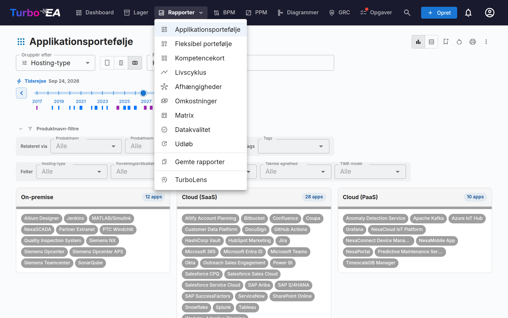

## Porteføljerapport

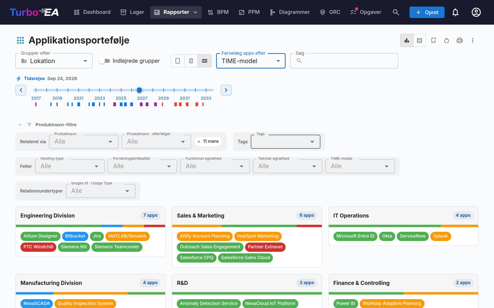

**Porteføljerapporten** viser et konfigurerbart **boblediagram** (eller scatter plot) over dine kort. Du vælger, hvad hver akse repræsenterer:

- **X-akse** — Vælg et hvilket som helst numerisk eller select-felt (f.eks. Technical Suitability)
- **Y-akse** — Vælg et hvilket som helst numerisk eller select-felt (f.eks. Business Criticality)
- **Boblestørrelse** — Tildel et numerisk felt (f.eks. Annual Cost)
- **Boblefarve** — Tildel et select-felt eller livscyklus­tilstand

Dette er ideelt til porteføljeanalyse — for eksempel at plotte applikationer efter forretningsværdi vs. teknisk egnethed for at identificere kandidater til investering, udskiftning eller pensionering.

### AI Portfolio Insights

Når AI er konfigureret, og porteføljeindsigter er aktiveret af en administrator, viser porteføljerapporten en **AI Insights**-knap. Klikker du på den, sendes et resumé af din aktuelle visning til AI-udbyderen, som returnerer strategiske indsigter om koncentrationsrisici, modernisations­muligheder, livscyklus­bekymringer og porteføljebalance. Indsigtspanelet kan foldes sammen og kan regenereres efter ændring af filtre eller gruppering.

### Fra rapport til lager

Et klik på en gruppe åbner et panel med gruppens kort. Panelets knap **Vis i lageret** åbner lageret på præcis dette udsnit. Når rapporten er grupperet efter et af korttypens egne felter, ankommer lageret grupperet efter samme felt: den valgte gruppe er foldet ud, alle andre er foldet sammen (antallene er stadig synlige), og rapportens søgning samt attribut-, relations- og tagfiltre følger med — klar til «vælg alle» og [masseredigering](inventory.md#mass-edit). Ved gruppering efter en relateret korttype (for eksempel Organisation) ankommer lageret i stedet filtreret til det relaterede kort. Knappen skjules, når *indlejrede grupper* er aktive: et sammenlagt undertræ svarer ikke til ét enkelt lagerfilter.

### Sammenfoldning af filtrene

Rækken **Filtre** kan foldes sammen: klik på dens overskrift for at skjule filterkontrollerne og give diagrammet den lodrette plads tilbage. Indstillingen huskes sammen med resten af rapportens konfiguration, så en rapport åbnes igen, præcis som du forlod den. Mens rækken er foldet sammen, viser overskriften stadig, hvor mange filtre der er aktive, og **Ryd alle** er stadig inden for rækkevidde — en sammenfoldet sektion skjuler aldrig, at data er filtreret.

### Tidsrejse

Tidslinje-skyderen bærer de samme transformationsinstrumenter som [Afhængighedsrapporten](#afhngighedsrapport): markeringer ved hver dato, hvor en applikation går i drift (blå) eller udfases (rød), piller, der navngiver de applikationer, der ændrer sig, mens skyderen står på en markering, pileknapper, der springer fra ændring til ændring, og chips, der opsummerer transformationen, når du kigger fremad («+4 kommer til · −7 udfases» — de indgår også i print- og eksportoverskrifter). Et klik på en markering eller en pille fremhæver de applikationer, der ændrer sig dér — resten af visningen nedtones, mens de pulserer, og en applikation, der allerede er væk på den valgte dato, vises kun under pulseringen og skjules derefter igen.

## Fleksibel portefølje

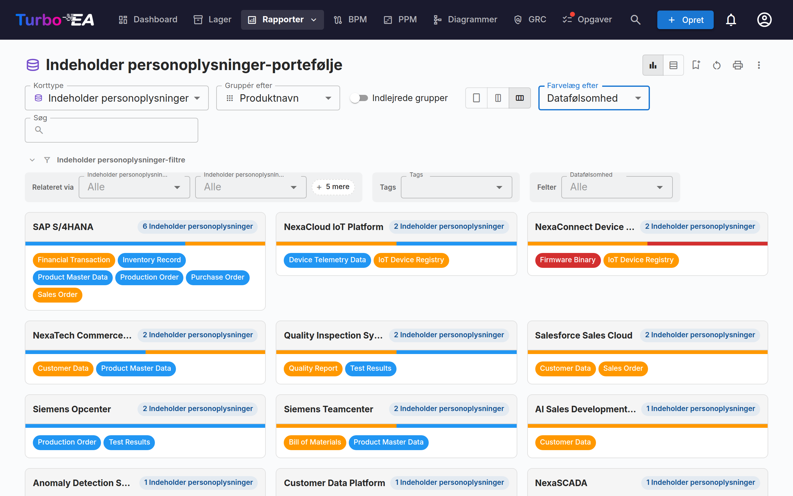

**Fleksibel portefølje** bruger samme kontroller som Application Portfolio, men tilføjer en **Card type**-vælger øverst i værktøjslinjen. Brug den til at analysere en portefølje af Business Capabilities, Initiatives, IT Components eller en hvilken som helst anden synlig korttype med samme grupperings-, farvelægnings- og filteroplevelse.

Skærmbilledet ovenfor viser en typisk use case: vælg **Data Object** som korttype, **Group by → Application** for at se hvilke apps der ejer hvilke data, og **Color by → Data Sensitivity** for med et øjekast at fremhæve, hvor fortrolige data ligger.

Ved skift af korttype ryddes valg af gruppering, farvelægning og filtre (de refererer til feltnøgler, der ikke findes på den nye type), og rapporten genindlæses med de felter, relationer og tags, der gælder for den valgte type. Rapporten deler samme tilladelse som Application Portfolio (`reports.portfolio`) og gemmes uafhængigt af den.

### Relationsundertyper

Når et korts relationer bærer en «type»-værdi — for eksempel **anvendelsestypen** (Ejer / Bruger / Interessent) på Organisation→Applikation-relationer eller **supporttypen** på Applikation→Forretningskapabilitet-relationer — kan du farve kortene efter den værdi og filtrere på den. **Gruppér rapporten efter den relaterede korttype** for at bruge dem (f.eks. *Gruppér efter → Organisation* for at låse op for *anvendelsestype*): undertypen vises derefter under gruppen **Relationsundertyper** i *Farvelæg efter*-rullelisten og som sin egen filterrække. Da hvert kort vises under ét relateret kort, farves det efter *den* relation — en applikation, der er *Bruger* af én organisation, vises som Bruger der, selv om den ejes af en anden.

### Indlejrede grupper

Når du grupperer efter en relateret korttype, der understøtter hierarki (såsom Forretningskompetence eller Organisation), vises en **Indlejrede grupper**-kontakt ved siden af *Gruppér efter*-vælgeren. Aktivér den for at vise grupperne som bokse i bokse efter den relaterede types forælder/barn-hierarki — ligesom kompetencekortet. Vælgeren **Visningsdybde** styrer, hvor mange niveauer der udfoldes: hvert kort vises under sin dybeste synlige gruppe, og grupper under dybdegrænsen ruller deres kort op i den nærmeste synlige forfader. Grene uden kort skjules.

### Vælg antal kolonner

Kortgitteret i rapporterne **Portefølje**, **Fleksibel portefølje**, **Kapabilitetskort** og **Proceskort** har en **kolonnevælger** i værktøjslinjen — tre knapper for én, to eller tre kolonner. Vælg færre kolonner, når kortene er tætpakkede og skal være brede nok til at læses; vælg tre for at se mere af landskabet på én gang. Valget huskes pr. rapport, følger med en [gemt rapport](saved-reports.md) og bruges ved udskrift og eksport. Smalle skærme falder fortsat af sig selv tilbage til én eller to kolonner. Valget forplanter sig nedad: hvert niveau under det første får én kolonne færre. Med én kolonne står niveau 2 i tre kolonner og niveau 3 i to; med tre kolonner forbliver alt derunder stablet i fuld bredde. Et niveau reducerer stadig sig selv, når et kort reelt er for smalt.

## Kompetencekort

Et klik på en kapabilitet åbner et sidepanel med alle applikationer i dens undertræ. På nederste niveau tilbyder panelet **Vis i inventar**, som fører til de applikationer, der er knyttet til den.

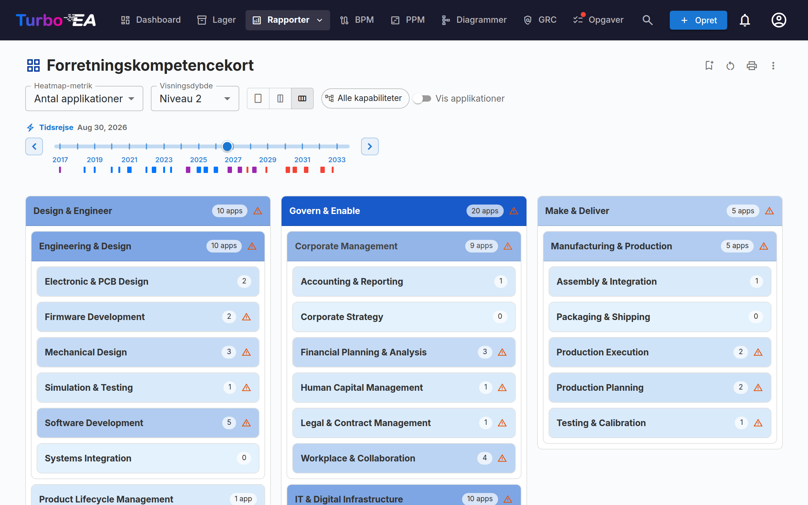

**Kompetencekortet** viser et hierarkisk **heatmap** over organisationens forretningskompetencer. Hver blok repræsenterer en kompetence med:

- **Hierarki** — Hovedkompetencer indeholder deres underkompetencer
- **Heatmap-farvelægning** — Blokke er farvet baseret på en valgt metrik (f.eks. antal understøttende applikationer, gennemsnitlig datakvalitet eller risikoniveau)
- **Klik for at udforske** — Klik på en kompetence for at drille ned i dens detaljer og understøttende applikationer

**Afgrænsning til bestemte kapabiliteter** — Som standard tegner kortet alle kapabiliteter. Brug kapabilitetschippen i værktøjslinjen til at åbne en vælger og markere en eller flere kapabiliteter; kortet viser derefter kun disse og alt under dem. Underkapabiliteter medtages automatisk, så hvis du vælger en kapabilitet på øverste niveau, får du hele dens gren. **Visningsdybde** tælles fra de valgte kapabiliteter, så *Niveau 2* altid betyder to niveauer under det, du kigger på. Omfanget gemmes sammen med rapporten, så en gemt rapport åbnes igen på den samme gren.

**Tidsrejse** — Tidslinje-skyderen bærer de samme transformationsinstrumenter som [Afhængighedsrapporten](#afhngighedsrapport): markeringer ved hver dato, hvor en applikation går i drift (blå) eller udfases (rød), piller, der navngiver de applikationer, der ændrer sig, mens skyderen står på en markering, pileknapper, der springer fra ændring til ændring, og chips, der opsummerer transformationen, når du kigger fremad (de indgår også i print- og eksportoverskrifter). Et klik på en markering eller en pille sætter spot på ændringen: med **Vis applikationer** slået til pulserer de ændrede applikationers chips, mens resten nedtones, og en applikation, der allerede er væk på den valgte dato, vises kun under pulseringen; med den slået fra falder fremhævningen på de kompetenceblokke, der indeholder de applikationer, der ændrer sig — blå hvor de kun kommer til, røde hvor de kun udfases, lilla hvor begge dele sker.

**Sammenfoldning af filtrene** — Rækken **Applikationsfiltre** kan foldes sammen; klik på dens overskrift for at få pladsen tilbage. Tilstanden gemmes sammen med rapporten, antallet af aktive filtre er stadig synligt på den sammenfoldede overskrift, og **Ryd alle** er stadig inden for rækkevidde uden først at folde ud.

## Livscyklusrapport

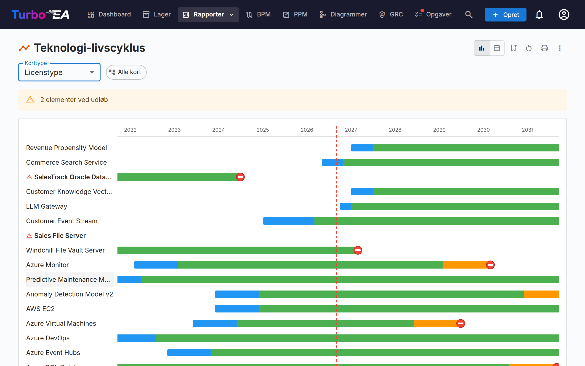

**Livscyklusrapporten** viser en **tidslinje­visualisering** af, hvornår teknologikomponenter blev introduceret, og hvornår de er planlagt til at blive pensioneret. Kritisk for:

- **Pensionerings­planlægning** — Se hvilke komponenter der nærmer sig end-of-life
- **Investerings­planlægning** — Identificer huller, hvor ny teknologi er nødvendig
- **Migrations­koordinering** — Visualiser overlappende phase-in- og phase-out-perioder

Komponenter vises som vandrette bjælker, der spænder over deres livscyklus-faser: Plan, Phase In, Active, Phase Out og End of Life.

**Afgrænsning til bestemte kort** — Når du har valgt en korttype, åbner chippen ved siden af en vælger: vælg et eller flere kort, og tidslinjen viser kun disse og alt under dem. Underkort medtages automatisk. Chippen er deaktiveret, så længe vælgeren står på *Alle typer*, fordi en afgrænsning kræver ét hierarki.

## Afhængighedsrapport

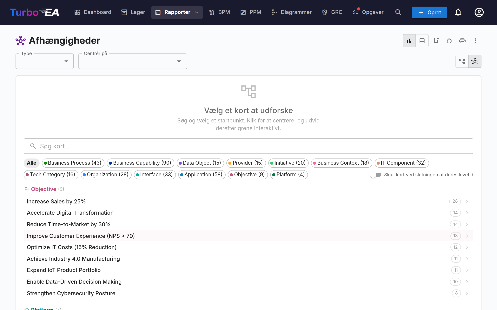

**Afhængighedsrapporten** visualiserer **forbindelser mellem komponenter** som en netværksgraf. Noder repræsenterer kort, og kanter repræsenterer relationer. Funktioner:

- **Dybde-kontrol** — Begræns hvor mange hop fra centerknuden der skal vises (BFS-dybde­begrænsning)
- **Type-filtrering** — Vis kun specifikke korttyper og relations­typer
- **Interaktiv udforskning** — Klik på en node for at centrere grafen om det kort
- **Impact-analyse** — Forstå sprængradius af ændringer på en specifik komponent
- **Tidsrejse** — Når du har centreret på et kort (eller skiftet til tabelvisning), kan du trække i tidslinje-skyderen for at se landskabet, som det ser ud på en vilkårlig dato. Kort, der endnu ikke er gået i drift, skjules — et kort træder ind i landskabet på sin **Aktiv**-dato, så et kort, hvis Aktiv-dato stadig ligger forude, eller som slet ikke har en, bliver uden for standardvisningen. Kort, der **kommer til** mellem i dag og en fremtidig dato, er ganske enkelt en del af landskabet på den dato: de har en lilla ramme og intet mærke, for tidsrejsen viser tilstanden, som den bliver. **Udfasede** kort bliver på diagrammet — nedtonede og mærket *UDFASET* — på enhver dato efter deres udfasning, så en transformation viser både, hvad den fjerner, og hvad den efterlader. Kontakten **Behold udfasede kort** i værktøjslinjen skjuler dem, så kun de kort, der er aktive på den valgte dato, vises. Dens modstykke, **Forhåndsvis planlagte kort**, viser kort, der endnu ikke er startet — nedtonede og mærket *PÅ VEJ* — på enhver dato før deres start, så selv en nutids- eller fortidsvisning viser, hvad der kommer. Tidslinjen er markeret ved hver dato, hvor kort på det viste diagram går i drift (blå) eller udfases (rød); klik på en markering for at flytte skyderen direkte til den ændring, eller spring fra ændring til ændring med pilene ved siden af skyderen. Så længe skyderen står på en markering, vises de kort, den tæller, som piller under markeringerne, grupperet bag et **+** for dem, der går i drift, og et **−** for dem, der udfases — hver pille bærer farven fra sin korttype, og et klik fremhæver kun det kort. En markering er blå, hvor kort kun går i drift, rød hvor de kun udfases, og lilla hvor begge dele sker. Når ændringer ligger tæt, samler tidslinjen dem i én markering, der tegnes bredere og mærkes med det interval, den dækker; et kort, der både går i drift og udfases inden for intervallet, nævnes på begge sider. Pilene behandler en samlet markering som ét stop: ét tryk fører hele vejen forbi det, den dækker, i stedet for at gå datoerne bag den igennem én ad gangen. Når skyderen står på en samlet markering, vises landskabet, som det ser ud ved **slutningen** af dens interval — alt, den dækker, er sket — og datoen ved siden af skyderen nævner det interval frem for én enkelt dag. Et klik — og et spring med pilene — fremhæver også de berørte kort: lærredet nedtones et øjeblik, mens de pulserer i markeringens farve, og et udfaset kort, der er skjult af **Behold udfasede kort**, vises kun under pulseringen. Når du kigger fremad, opsummerer chips over skyderen transformationen (+4 kommer til · −7 udfases). Relationer til udfasede kort vises med røde streger — de afhængigheder, transformationen kapper — og så længe skyderen står på en markering, bliver de kort, der udfases der, på diagrammet — nedtonede og mærket *UDFASET* — selv med **Behold udfasede kort** slået fra. De kort, der bliver, markeres dér, hvor deres forbindelser ændrer sig: et rødt ikon for en brudt forbindelse, hvor en nabo udfases, et blåt, hvor en nabo går i drift, og begge, når begge dele sker. Markeringen bærer dem: forlader du den, forsvinder de, så én udfasning ikke længere mærker sine naboer på enhver senere dato. Skyderen gælder alle visninger, og datoen gemmes sammen med rapporten.

Det kort, du sætter i centrum, afgør, hvor meget du ser, så vælgeren viser for hver type de bedst forbundne kort først. En kapabilitet er som regel det mest oplysende valg, fordi det er den eneste korttype, der i ét spring når både målene over den og applikationerne under den. Vælgeren viser **alle kort i beholdningen** — bortset fra arkiverede — uanset hvilken dato tidslinjen står på: det er her, du vælger, hvad du vil se, og skyderen er skjult på dette trin, så et kort, der allerede er udfaset, eller som endnu ikke er gået i drift, kan stadig sættes i centrum. Kort, der har nået slutningen af deres levetid **pr. i dag** (ikke pr. tidslinjens dato), bærer mærket *UDFASET* med deres slutdato; kontakten **Skjul kort ved slutningen af deres levetid** ved siden af typechipsene filtrerer dem fra.

### Lagdelt afhængighedsvisning

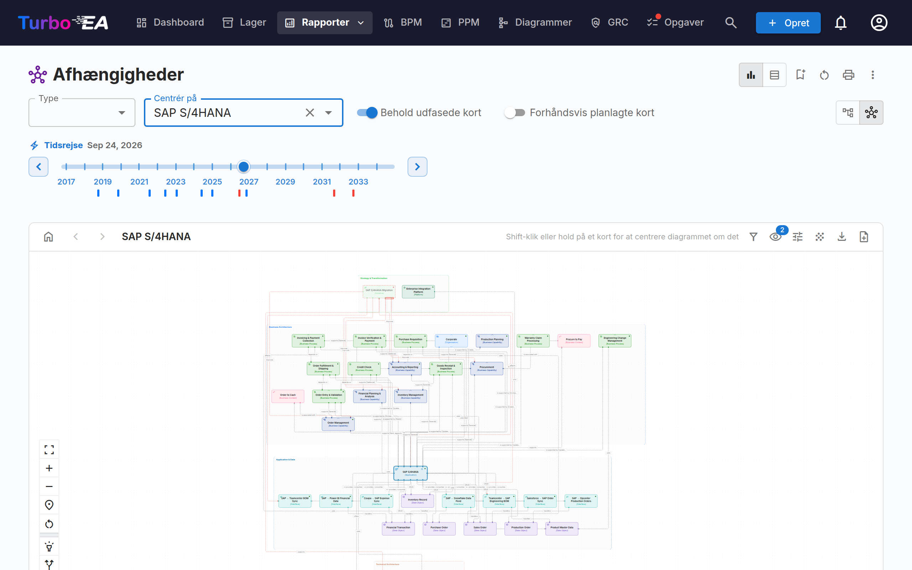

Skift til **lagdelt afhængighedsvisning** ved hjælp af view-mode-knapperne i værktøjslinjen. Dette er Turbo EA's husnotation til at vise afhængigheder mellem kort på tværs af de fire EA-lag — inspireret af ArchiMate's lagdeling og C4-modellens »good defaults«-filosofi, men adskilt fra begge. Den samme visning genbruges på Kortdetalje-siden (viser kortets umiddelbare afhængigheds­nabolag) og i [TurboLens Architect](turbolens.md#architecture-ai)-guiden, så afhængigheder ser ens ud overalt.

**Læsning af diagrammet**

- **Lagdelte svømmebaner** — Kort er grupperet efter arkitekturlag (Strategy & Transformation, Business Architecture, Application & Data, Technical Architecture) inden i stiplede grænse-rektangler, i fast rækkefølge.
- **Type-farvede noder med ikoner** — Hver node er farvet efter sin korttype og viser korttype-ikonet i sit øverste venstre hjørne, så typer er genkendelige med et øjekast, selv uden farve.
- **Retningsbestemte mærkede kanter** — Kanter følger metamodel-relations-retningen (source → target) og bærer relationens forward label (f.eks. *uses*, *supports*, *runs on*). Når en relation er kvalificeret med en værdi (såsom en Supporttype *Førende*), vises den i kantede parenteser efter etiketten — for eksempel *supports [Førende]*.
- **Foreslåede kort** — I TurboLens Architect-guiden har endnu-ikke-committede kort en stiplet kant og et grønt **NY**-badge.

**Udforskning og navigation**

- **Panorering, zoom, minimap** — Træk i lærredet for at panorere, scroll for at zoome, og brug minimappet til at navigere store diagrammer.
- **Klik for at inspicere** — Klik på en node for at åbne sidepanelet med kortdetaljer.
- **Re-centrér** — Shift-klik eller hold på et kort for at centrere diagrammet om det; værktøjslinjens knapper **Tilbage til kortvælger**, **Forrige kort** og **Næste kort** trinner gennem din navigationshistorik.
- **Fremhævningstilstand** — Hold musen over et kort for at fremhæve dets forbindelser; på touch-enheder slås **Fremhævningstilstand: klik på et kort for at fremhæve dets forbindelser** til i kontrolpanelet for at tap-fremhæve i stedet.
- **Udvidelsestilstand** — Slå **Udvidelsestilstand: klik på et kort for at afsløre alle dets relationer** til i kontrolpanelet, og klik derefter på et kort for at afsløre alle dets relationer efter behov. Det kort, diagrammet er centreret om, har en dobbelt ramme i sin korttypes farve, og hvert kort, du udvider, har en tyndere — så dine pejlemærker forbliver synlige, efterhånden som diagrammet vokser.
- **Vis forælder / Vis underordnede** — To målrettede alternativer til udvidelsestilstand. Slå **Vis forælder** (pil op) eller **Vis underordnede** (pil ned) til i kontrolpanelet, og klik derefter på et kort for kun at tilføje dets overordnede hierarkielement eller dets direkte underordnede til diagrammet. Viste kort bliver på diagrammet — så du kan kombinere forældre og underordnede — og fjernes, når du centrerer visningen igen eller nulstiller den.
- **Ingen centerkort påkrævet** — På Afhængighedsrapporten viser den lagdelte afhængighedsvisning alle kort, der matcher det aktuelle type-filter, så du behøver ikke at vælge et startkort først.

**Tilpasning af visningen** (fra værktøjslinjen)

- **Vis på kortet** — En dedikeret knap på værktøjslinjen (øje-ikonet) viser som **afkrydsningsfelter** alt, hvad et kort kan vise: **type**-etiketten, **undertypen**, en **livscyklusprik** og hvert tilgængeligt **attributfelt**, placeret under den korttype, det hører til. De første to linjer vises på selve kortet, og hele sættet i værktøjstippet. Et mærke på knappen tæller, hvad der vises nu. Valgene huskes mellem besøg og følger med **Opret diagram**: et DrawIO-diagram genereret fra denne rapport åbner med de samme linjer, valgt fra den samme menu — dér dem alle, for en diagramfigur vokser, så der er plads, mens en rapportknude ikke gør. På en telefon åbnes listen i fuld skærm. **Ryd alle** fjerner alle flueben på én gang.
- **Vis kortlogoer** — Et kort med sit eget logo viser det i øverste venstre hjørne med korttypeikonet som et lille mærke oven på, så både produktet og korttypen kan aflæses. Slået til som standard; slå det fra i menuen **Visningsindstillinger** for et udsmykningsfrit diagram. Kort uden logo — og alle kort af en type, hvor en administrator har slået logoer fra — ser uændrede ud i begge tilfælde. Logoer kommer med i billedeksporter.
- **Vis kort ved slutningen af deres levetid** — Relaterede kort, der har nået slutningen af levetiden **på den dato, der er valgt på tidslinjen**, skjules som standard for at holde grafen fokuseret; slå denne til/fra (i menuen **Visningsindstillinger**) for at vise dem igen. Det kort, du er centreret om, vises altid, også hvis det selv er ved slutningen af sin levetid.
- **Vis relationsetiketter** — Hver relations udsagnsord (*understøtter*, *bruger*, …) tegnes på dens linje. Slået til som standard; slå det fra i menuen **Visningsindstillinger** for et renere lærred i et tæt landskab. Linjerne og deres pilespidser viser stadig, hvad der er forbundet med hvad, og i hvilken retning.
- **Vis relationsværdier** — Mange relationer kan kvalificeres med en værdi (f.eks. understøtter en applikation en kapabilitet som *Førende*, *Understøttende* eller *Ingen understøttelse*). Når den er slået til (standard), vises disse værdier i kantede parenteser ved siden af relationsetiketten (*supports [Førende]*) og inkluderes i billedeksporter. Slå den fra i menuen **Visningsindstillinger** for en renere visning; relationer uden værdi er uændrede uanset hvad.
- **Linjestil** — Vælg, hvordan forbindelseslinjer tegnes i hvile: **massiv**, **prikket**, **stiplet** (standard) eller **lang stiplet**, fra menuen **Visningsindstillinger**. Når du holder markøren over en linje, tegnes den altid massiv, og en afbrudt afhængighed beholder sine egne streger.
- **Omarrangér** — Træk et kort for at flytte det inden for dets lag, eller træk en hel **lag-boks** for at flytte den med alle dens kort. **Nulstil visning** (i venstre værktøjslinje) gendanner den automatiske placering og rydder al udforskning.
- **Baggrund** — Skift lærredsbaggrunden mellem gitter, prikker og ingen.
- **Eksport og fuldskærm** — Eksportér diagrammet til **PNG** eller **SVG**, eller åbn det i **fuldskærm**.
- **Opret diagram** — Forvandl den aktuelle visning til et nyt, redigerbart diagram i [diagrammodulet](diagrams.md). Kort, relationer og de fire arkitekturlag genskabes, og hver figur forbliver knyttet til sit inventarkort. Du bliver bedt om et navn og føres derefter direkte til det nye diagram. Tilgængelig for brugere, der kan oprette diagrammer.

## Omkostningsrapport

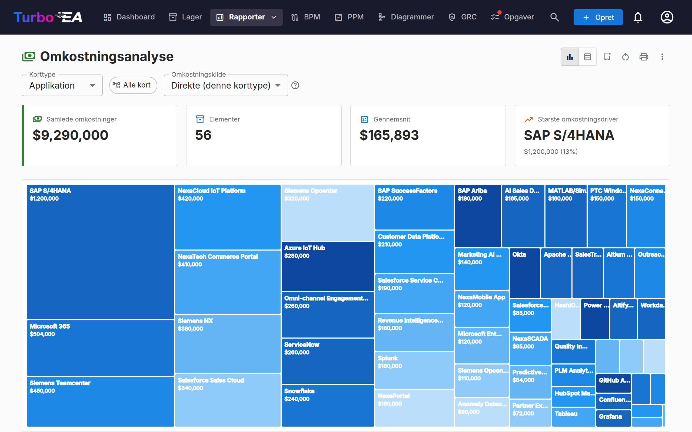

**Omkostningsrapporten** giver finansiel analyse af dit teknologilandskab:

- **Treemap-visning** — Indlejrede rektangler størrelses-justeret efter omkostning, med valgfri gruppering (f.eks. efter organisation eller kompetence)
- **Bar chart-visning** — Omkostnings­sammenligning på tværs af komponenter
- **Card Type** — Vælg hvilken korttype rapporten er bygget omkring (Application, IT Component, Provider, …).

### Cost Source

Når den valgte korttype har mindst én relations­type, der peger på en type, der ejer et omkostningsfelt, vises en **Cost Source**-vælger ved siden af **Card Type**. Den lader dig vælge, hvor tallene kommer fra:

- **Direct (this card type)** — standard; summerer omkostningsfeltet på de viste kort selv. Brug dette, når du ser direkte på *Applications* eller *IT Components*.
- **Aggregate from related cards** — marker en eller flere `Type · Field`-poster (for eksempel `Application · Total Annual Cost`, `IT Component · Total Annual Cost`). Hvert primær-korts tal bliver så summen af det felt på tværs af dets relaterede kort.

Vælgeren er **multi-valg**, så en enkelt opsamling kan kombinere flere relaterede typer i én bevægelse. For eksempel, når du ser **Provider** for *Microsoft*, viser markering af både `Application · Total Annual Cost` og `IT Component · Total Annual Cost` leverandørens fulde fodaftryk — Teams, M365, Azure og enhver anden Microsoft-leveret komponent — som ét tal.

#### Hvorfor intet bliver talt to gange

Vælgeren er bygget, så dobbelttælling er umulig ved konstruktion:

- Hver post er et unikt `(target type, cost field)`-par — dropdownen tilbyder hvert par præcis én gang, selv når flere relations­typer når den samme target-type.
- Inden for et enkelt par bidrager to kort linket gennem flere relations­typer stadig kun med deres omkostning én gang.
- På tværs af forskellige poster kan intet kort bidrage to gange: et kort har præcis én type, og forskellige omkostningsfelter på samme kort er uafhængige værdier.

Et lille **hjælpe-ikon (?)** ved siden af vælgeren gentager denne garanti ved hover.

Listen over muligheder genereres fra din metamodel — relations­typer og omkostningsfelter opdages ved render-tid, så en hvilken som helst brugerdefineret korttype eller relation, du tilføjer, bliver automatisk en gyldig Cost Source.

### Dril ned i et rektangel

Når mindst én Cost Source er aktiv, er treemap-rektanglerne **klikbare**. Klik på et rektangel erstatter diagrammet med nedbrydningen af rektanglets omkostning — de relaterede kort, der bidrog til dens opsamling, størrelses-justeret efter deres direkte omkostning. En brødkrumme vises over diagrammet, f.eks. **All Applications › NexaCore ERP**; klik på et segment for at gå tilbage.

- **Enkelt Cost Source aktiv** — drill gengiver én treemap over de relaterede kort (f.eks. ved klik på *NexaCore ERP* med `IT Component · Total Annual Cost` markeret vises de IT Components, der er linket til NexaCore ERP, størrelses-justeret efter deres årlige omkostning).
- **Flere Cost Sources aktive** — drill gengiver **én treemap pr. kilde side om side** (1 kolonne på smalle viewports, 2 på brede). Hvert panel har sin egen overskrift, sit eget total og sit eget pr.-panel `% af total` i tooltip'en — så forskellige korttyper forbliver på deres egen skala i stedet for at blive presset ind i ét diagram.

Tidslinjeskyderen, Cost Source-valget og andre filtre bevares, mens du driller, og det drillede niveau er en del af den gemte rapports konfiguration — at gemme en rapport, mens du har drillet ind, genåbner direkte på det niveau. Uden **nogen** Cost Source aktiv åbner klik på et rektangel kort-sidepanelet i stedet (der er intet at bryde ned).

**Afgrænsning til bestemte kort** — Chippen ved siden af korttypevælgeren åbner en vælger: vælg et eller flere kort, og træstrukturen, totalerne og tabellen afgrænses til disse og alt under dem. Chippen skjules, mens du er inde i et rektangel, da det allerede har flyttet dig til en anden korttype; forlad det, og afgrænsningen er der stadig.

## Matrixrapport

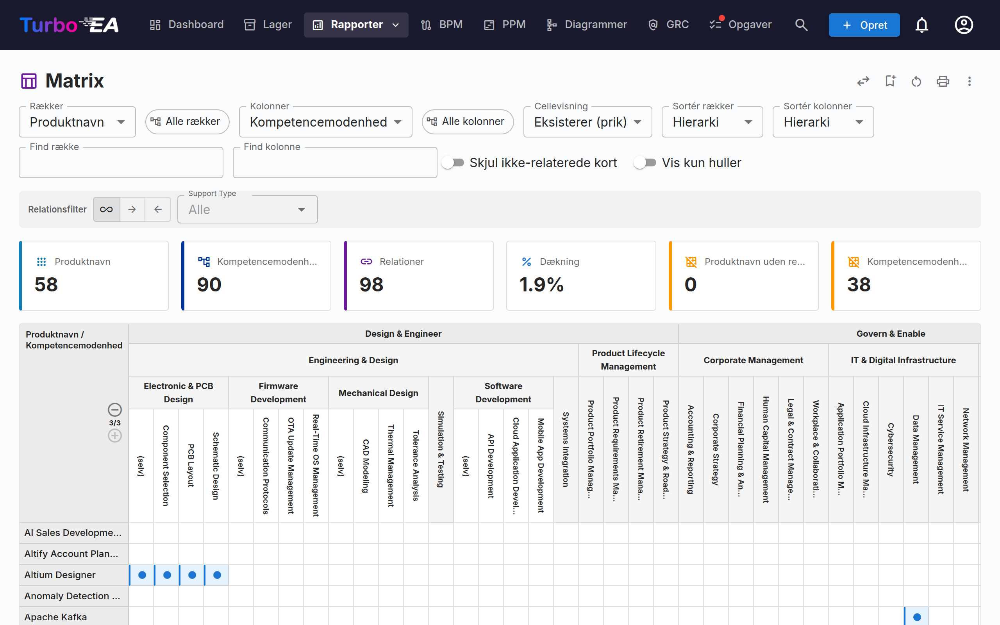

**Matrixrapporten** opretter et **krydsreference­gitter** mellem to korttyper. For eksempel:

- **Rækker** — Applications
- **Kolonner** — Business Capabilities
- **Celler** — Indikerer om en relation eksisterer (og hvor mange)

Dette er nyttigt til at identificere dækningshuller (kompetencer uden understøttende applikationer) eller redundanser (kompetencer understøttet af for mange applikationer).

Brug kontakten **Skjul ikke-relaterede kort** for at skjule rækker og kolonner for kort uden relationer, så kun kort, der indgår i mindst én relation, vises. Den fulde visning med alle kort forbliver standardindstillingen.

### Hvad hver celle viser

Kontrollen **Cellevisning** tilbyder fire muligheder:

- **Findes (prik)** — en prik alle steder, hvor der findes en relation.
- **Antal (heatmap)** — hvor mange relationer der er, tonet efter tæthed.
- **Værdier (koder)** — ét farvekodet bogstav pr. relationsværdi med en signaturforklaring over gitteret. Bedst til en stor matrix.
- **Værdier (etiketter)** — værdinavnene i fuld længde. Kolonnerne bliver bredere, så det passer til en mindre matrix.

Bogstaverne og navnene kommer fra de attributter, dine relationstyper erklærer, og vises på dit eget sprog. En CRUD-relation læses `C R U D`; en ejerskabsrelation viser sine egne værdier. Tilføj en værdi til en relationstype i [metamodellen](../admin/metamodel.md), så dukker den op her uden yderligere opsætning. En sammenklappet gruppecelle viser altid et antal, fordi den kan spænde over mange forskellige værdier — udvid et niveau for at se dem.

Et kort med underliggende kort i hierarkiet kan også bære sine egne relationer. Når det gør, får det sin egen række (eller kolonne) med etiketten **(selv)** lige under sin gruppeoverskrift, så de relationer har et sted at vise sig i stedet for at gå tabt mellem forælderen og dens børn. Klap niveauet sammen, og de tælles med i gruppens celle sammen med børnenes.

### Filtrering på relation

Filterlinjen over gitteret indsnævrer matricen til de relationer, du er interesseret i:

- **Relationstype** — når de to korttyper er forbundet i begge retninger.
- **Retning** — om rækkens kort er relationens kilde eller mål.
- **Værdier** — ét filter pr. attribut, som relationstyperne erklærer, inklusive «(tom)» for relationer, hvor værdien aldrig blev sat.

Filtrering tømmer cellerne for de kort, der ikke længere matcher, så **Skjul kort uden match** efterlader kun dem, der gør. Nogle eksempler:

- Applikation × Dataobjekt filtreret på *Opret* — hvilke applikationer der er kildesystem for hvert dataobjekt.
- Applikation × Grænseflade filtreret på retning — hvem der udstiller en grænseflade, og hvem der forbruger den.
- Organisation × Applikation filtreret på *Ejer* — ejerskabskortet, uden at brugerne fylder det op.

### At finde huller i dækningen

To felter tæller de kort på hver akse, der slet ingen relation har. **Vis kun huller** reducerer gitteret til netop dem — de kapabiliteter, ingen understøtter, og de dataobjekter, ingen vedligeholder.

### At finde rundt i en stor matrix

**Find række** og **Find kolonne** filtrerer akserne på navn; et overordnet element forbliver synligt, når et af dets underelementer matcher. Byt-knappen i titellinjen bytter om på de to akser.

### Eksport

Excel-eksport giver to ark: gitteret, som det ser ud på skærmen, og én række pr. relation med værdierne fordelt på kolonner — arket, du laver pivot på. PowerPoint-eksport fanger billedet.

**Afgrænsning af hver akse** — Hver akse har sin egen chip ved siden af typevælgeren, så du kan spørge om *disse kapabiliteter × disse applikationer*. Nøgletallene over gitteret følger afgrænsningen, så tallene altid beskriver det, du kigger på. Ændring af en akses korttype rydder den akses afgrænsning; ved transponering bytter de to afgrænsninger plads sammen med akserne.

## Datakvalitetsrapport

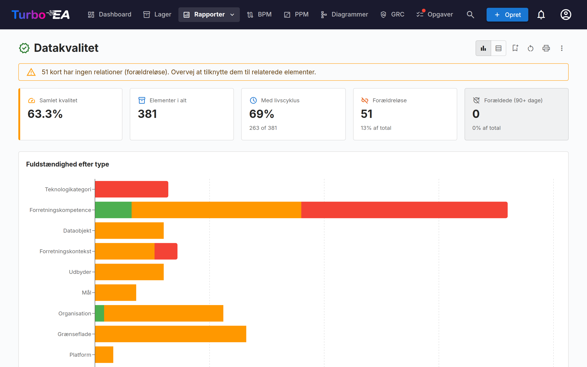

**Datakvalitetsrapporten** er et **fuldstændigheds-dashboard**, der viser, hvor godt dine arkitekturdata er udfyldt. Baseret på de vigtighedsniveauer, der er konfigureret i fanen **Datakvalitet** for hver korttype (hvert felt plus de indbyggede faktorer Beskrivelse, Livscyklus, obligatoriske relationer og obligatoriske tags):

- **Samlet score** — Gennemsnitlig datakvalitet på tværs af alle kort
- **Efter type** — Nedbrydning, der viser hvilke korttyper der har den bedste/dårligste fuldstændighed
- **Individuelle kort** — Liste over kort med den laveste datakvalitet, prioriteret til forbedring

Kort med et tomt **påkrævet felt** scorer altid **0 %** — den vægtede beregning genoptages først, når alle påkrævede felter er udfyldt — så listen med de laveste scorer viser præcis de kort, der stadig mangler påkrævede data.

### Bor ned i et tal

Hvert tal i rapporten er en indgang, ikke bare en aflæsning:

- **Klik på et bjælkesegment** i *Fuldstændighed efter type* — et panel åbner til højre med kortene af den type i det bånd (Komplet, Delvis eller Minimal).
- **Klik på en bjælke** i *Gennemsnitlig fuldstændighed efter type*, eller på en række i tabelvisningen, for at vise alle kort af den type.
- **Klik på feltet Forældreløse eller Forældede** for at vise kortene bag det tal.
- **Klik på feltet Manglende EOL** for at vise de applikationer og it-komponenter, ingen har registreret en end-of-life for.

Fra panelet kan du klikke på et kort for at åbne dets detaljepanel, eller trykke **Vis i inventar** for at fortsætte i [Inventaret](inventory.md) — som åbner grupperet efter datakvalitet med det valgte bånd foldet ud og de øvrige foldet sammen ved siden af, så du kan gå i gang med at rette poster med det samme. Panelerne Forældreløse og Forældede linker til inventarets tilsvarende filter på tværs af alle korttyper.

## End of Life (EOL)-rapport

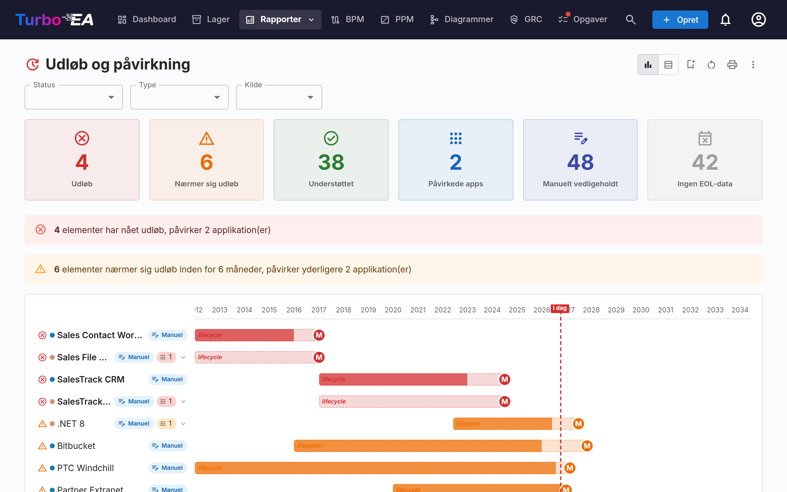

**EOL-rapporten** viser support-status for teknologiprodukter linket via funktionen [EOL-administration](../admin/eol.md):

- **Status-fordeling** — Hvor mange produkter er Supported, Approaching EOL eller End of Life
- **Tidslinje** — Hvornår produkter mister support
- **Risiko­prioritering** — Fokuser på missionskritiske komponenter, der nærmer sig EOL
- **Ingen EOL-data** — Applikationer og it-komponenter uden hverken et link til endoflife.date eller en selvangivet End of Life-dato. De vises med statussen **Ingen EOL-data**; tryk på feltet med samme navn for kun at vise dem, og tryk igen for at hente resten frem. En dato, du selv vedligeholder i livscyklussen, tæller som registreret, så en komponent, du allerede har vurderet, dukker ikke op igen her.

## Gemte rapporter

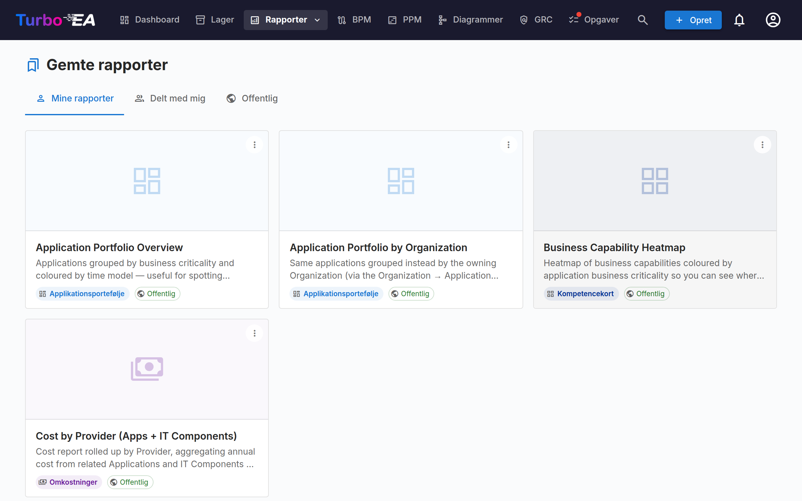

Gem en hvilken som helst rapportkonfiguration til hurtig adgang senere. Gemte rapporter inkluderer en miniature og kan deles på tværs af organisationen.

## Eksport af rapporter

Hver rapport understøtter **Export to Excel (.xlsx)** og **Export to PowerPoint (.pptx)** fra **⋮**-menuen i titellinjen (sammen med Print og Copy link).

- **Excel** — Producerer ét ark pr. datatabel, der aktuelt er gengivet, med auto-justerede kolonner og valuta- / talformatering bevaret. Skift til **Table view** før eksport for at fange de underliggende rækker.
- **PowerPoint** — Genererer et deck, hvis første slide kombinerer rapporttitlen, generationstidsstempel, aktivt filter-resumé og det levende diagram i præsentationskvalitet. Efterfølgende slides paginerer datatabellerne til dele-klar uddelingsmateriale.

Aktive filtre og grupperingsindstillinger, der er anvendt på eksporttidspunktet, registreres på titel-sliden / overskriftsrækken, så eksporter forbliver selvforklarende.

## Procesmap

**Procesmappet** visualiserer organisationens forretningsproces-landskab som et struktureret kort, der viser proceskategorier (Management, Core, Support) og deres hierarkiske relationer.

**Afgrænsning til bestemte processer** — Chippen ved siden af *Visningsdybde* åbner en vælger: vælg en eller flere processer, og kortet viser kun disse og alt under dem. Underprocesser medtages automatisk, og **Visningsdybde** tælles fra dit valg. Klik-zoom virker stadig, nu inden for afgrænsningen. Det er et andet element end rækken **Omfang** nedenfor, som filtrerer efter relateret organisation eller forretningskontekst.
