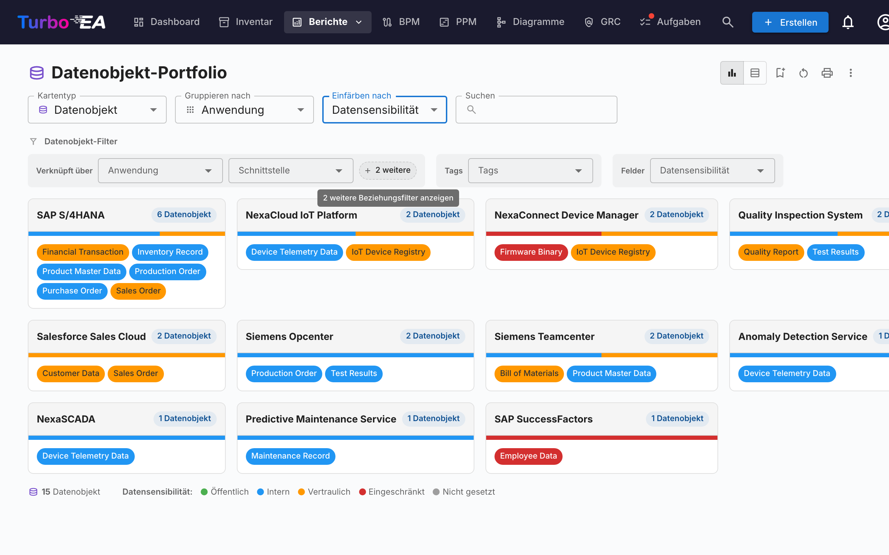

# Berichte

Turbo EA enthält ein leistungsstarkes **visuelles Berichtsmodul**, das die Analyse der Unternehmensarchitektur aus verschiedenen Perspektiven ermöglicht. Alle Berichte können mit ihrer aktuellen Filter- und Achsenkonfiguration [zur Wiederverwendung gespeichert](saved-reports.md) werden.

## Portfoliobericht

Der **Portfoliobericht** zeigt ein konfigurierbares **Blasendiagramm** (oder Streudiagramm) Ihrer Karten. Sie wählen, was jede Achse darstellt:

- **X-Achse** — Ein beliebiges numerisches oder Auswahlfeld wählen (z.B. Technische Eignung)
- **Y-Achse** — Ein beliebiges numerisches oder Auswahlfeld wählen (z.B. Geschäftskritikalität)
- **Blasengröße** — Einem numerischen Feld zuordnen (z.B. Jährliche Kosten)
- **Blasenfarbe** — Einem Auswahlfeld oder Lebenszyklusstatus zuordnen

Dies ist ideal für Portfolioanalysen — zum Beispiel Anwendungen nach Geschäftswert vs. technischer Eignung aufzutragen, um Kandidaten für Investition, Ablösung oder Stilllegung zu identifizieren.

### KI-Portfolio-Erkenntnisse

Wenn KI konfiguriert und Portfolio-Erkenntnisse von einem Administrator aktiviert sind, zeigt der Portfoliobericht eine Schaltfläche **KI-Erkenntnisse**. Ein Klick sendet eine Zusammenfassung der aktuellen Ansicht an den KI-Anbieter, der strategische Erkenntnisse über Konzentrationsrisiken, Modernisierungsmöglichkeiten, Lebenszyklus-Bedenken und Portfolio-Ausgewogenheit liefert. Das Erkenntnispanel ist zusammenklappbar und kann nach Änderung von Filtern oder Gruppierung neu generiert werden.

## Flexibles Portfolio

Das **Flexible Portfolio** verwendet dieselben Bedienelemente wie das Anwendungsportfolio, ergänzt um einen **Kartentyp**-Auswähler oben in der Symbolleiste. Damit lassen sich Portfolios aus Geschäftsfähigkeiten, Initiativen, IT-Komponenten oder jedem anderen sichtbaren Kartentyp mit derselben Gruppierungs-, Färbungs- und Filterlogik analysieren.

Der Screenshot oben zeigt einen typischen Anwendungsfall: Wählen Sie **Datenobjekt** als Kartentyp, **Gruppieren nach → Anwendung**, um zu sehen, welche Anwendung welche Daten besitzt, und **Färben nach → Datensensibilität**, um auf einen Blick zu erkennen, wo vertrauliche Daten liegen.

Beim Wechsel des Kartentyps werden die Auswahl für Gruppierung, Färbung und Filter zurückgesetzt (sie verweisen auf Feldschlüssel, die im neuen Typ nicht existieren), und der Bericht wird mit den Feldern, Beziehungen und Tags des gewählten Typs neu geladen. Der Bericht nutzt dieselbe Berechtigung wie das Anwendungsportfolio (`reports.portfolio`) und wird unabhängig davon gespeichert.

### Beziehungs-Untertypen

Wenn die Beziehungen einer Karte einen «Typ»-Wert tragen — etwa den **Verwendungstyp** (Eigentümer / Benutzer / Stakeholder) bei Beziehungen Organisation→Anwendung oder den **Unterstützungstyp** bei Beziehungen Anwendung→Geschäftsfähigkeit — können Sie die Karten danach einfärben und filtern. **Gruppieren Sie den Bericht nach dem verbundenen Kartentyp**, um sie zu nutzen (z. B. *Gruppieren nach → Organisation*, um den *Verwendungstyp* freizuschalten): Der Untertyp erscheint dann unter der Gruppe **Beziehungs-Untertypen** in der Auswahl *Einfärben nach* sowie als eigene Filterzeile. Da jede Karte unter einer verbundenen Karte angezeigt wird, wird sie nach *dieser* Beziehung eingefärbt — eine Anwendung, die *Benutzer* einer Organisation ist, erscheint dort als Benutzer, auch wenn sie einer anderen gehört.

### Verschachtelte Gruppen

Beim Gruppieren nach einem verknüpften Kartentyp mit Hierarchie (z. B. Geschäftsfähigkeit oder Organisation) erscheint neben der Auswahl *Gruppieren nach* ein Schalter **Verschachtelte Gruppen**. Aktivieren Sie ihn, um die Gruppen als ineinander verschachtelte Boxen entlang der Eltern-Kind-Hierarchie des verknüpften Typs darzustellen — wie in der Fähigkeitskarte. Die Auswahl **Anzeigetiefe** steuert, wie viele Ebenen aufgeklappt werden: Jede Karte erscheint unter ihrer tiefsten sichtbaren Gruppe, und Gruppen unterhalb der Tiefengrenze rollen ihre Karten in den nächsten sichtbaren Vorfahren hoch. Zweige ohne Karten werden ausgeblendet.

## Fähigkeitskarte

Die **Fähigkeitskarte** zeigt eine hierarchische **Heatmap** der Geschäftsfähigkeiten der Organisation. Jeder Block repräsentiert eine Fähigkeit, mit:

- **Hierarchie** — Hauptfähigkeiten enthalten ihre Unterfähigkeiten
- **Heatmap-Einfärbung** — Blöcke werden basierend auf einer ausgewählten Metrik eingefärbt (z.B. Anzahl unterstützender Anwendungen, durchschnittliche Datenqualität oder Risikoniveau)
- **Zum Erkunden klicken** — Klicken Sie auf eine beliebige Fähigkeit, um in deren Details und unterstützende Anwendungen einzutauchen

## Lebenszyklus-Bericht

Der **Lebenszyklus-Bericht** zeigt eine **Zeitleisten-Visualisierung** darüber, wann Technologiekomponenten eingeführt wurden und wann ihre Stilllegung geplant ist. Kritisch für:

- **Stilllegungsplanung** — Sehen, welche Komponenten sich dem Lebensende nähern
- **Investitionsplanung** — Lücken identifizieren, wo neue Technologie benötigt wird
- **Migrationskoordination** — Überlappende Einführungs- und Auslaufperioden visualisieren

Komponenten werden als horizontale Balken dargestellt, die ihre Lebenszyklusphasen umspannen: Planung, Einführung, Aktiv, Auslauf und Lebensende.

## Abhängigkeitsbericht

Der **Abhängigkeitsbericht** visualisiert **Verbindungen zwischen Komponenten** als Netzwerkgraph. Knoten repräsentieren Karten und Kanten repräsentieren Beziehungen. Funktionen:

- **Tiefensteuerung** — Begrenzen Sie, wie viele Sprünge vom Zentralknoten angezeigt werden (BFS-Tiefenbegrenzung)
- **Typfilterung** — Nur bestimmte Kartentypen und Beziehungstypen anzeigen
- **Interaktive Erkundung** — Klicken Sie auf einen beliebigen Knoten, um den Graph auf diese Karte zu zentrieren
- **Auswirkungsanalyse** — Den Wirkungsradius von Änderungen an einer bestimmten Komponente verstehen

### Layered Dependency View (geschichtete Abhängigkeitsansicht)

Wechseln Sie über die Ansichtsmodus-Schaltflächen in der Symbolleiste zur **Layered Dependency View**. Dies ist die hauseigene Notation von Turbo EA, um Abhängigkeiten zwischen Karten über die vier EA-Ebenen hinweg darzustellen — inspiriert vom Schichtenprinzip von ArchiMate und der „Good Defaults"-Philosophie des C4-Modells, aber von beiden zu unterscheiden. Dieselbe Ansicht wird auf der Kartendetailseite (zeigt die unmittelbare Abhängigkeits-Nachbarschaft der Karte) und im [TurboLens-Architect](turbolens.md#architecture-ai)-Wizard wiederverwendet, sodass Abhängigkeiten überall gleich aussehen.

**Das Diagramm lesen**

- **Geschichtete Swimlanes** — Karten werden nach Architekturebene (Strategie & Transformation, Geschäftsarchitektur, Anwendung & Daten, Technische Architektur) in gestrichelten Grenzrechtecken in fester Reihenfolge gruppiert.
- **Typ-farbige Knoten mit Symbolen** — Jeder Knoten ist nach seinem Kartentyp eingefärbt und zeigt das Symbol des Kartentyps in seiner oberen linken Ecke, sodass Typen auch ohne Farbe auf einen Blick erkennbar sind.
- **Gerichtete, beschriftete Kanten** — Kanten folgen der Beziehungsrichtung des Metamodells (Quelle → Ziel) und tragen die Vorwärtsbeschriftung der Beziehung (z. B. *verwendet*, *unterstützt*, *läuft auf*). Wenn eine Beziehung mit einem Wert qualifiziert ist (etwa einem Unterstützungstyp *Führend*), erscheint dieser in Klammern hinter der Beschriftung — zum Beispiel *unterstützt [Führend]*.
- **Vorgeschlagene Karten** — Im TurboLens-Architect-Wizard haben noch nicht festgeschriebene Karten einen gestrichelten Rand und ein grünes **NEU**-Abzeichen.

**Erkunden und navigieren**

- **Schwenken, Zoomen, Minimap** — Ziehen Sie die Leinwand zum Schwenken, scrollen Sie zum Zoomen und nutzen Sie die Minimap, um große Diagramme zu navigieren.
- **Klicken zum Inspizieren** — Klicken Sie auf einen beliebigen Knoten, um das Kartendetail-Seitenpanel zu öffnen.
- **Neu zentrieren** — Mit Umschalt+Klick oder langem Drücken auf eine Karte zentrieren Sie das Diagramm auf sie; die Symbolleisten-Schaltflächen **Zurück zur Kartenauswahl**, **Vorherige Karte** und **Nächste Karte** durchlaufen Ihren Navigationsverlauf.
- **Hervorhebungsmodus** — Fahren Sie mit der Maus über eine Karte, um ihre Verbindungen hervorzuheben; aktivieren Sie auf Touch-Geräten den **Hervorhebungsmodus** im Bedienfeld, um stattdessen per Tippen hervorzuheben.
- **Erweiterungsmodus** — Aktivieren Sie den **Erweiterungsmodus** im Bedienfeld und klicken Sie dann auf eine Karte, um bei Bedarf alle ihre Beziehungen anzuzeigen.
- **Übergeordnetes anzeigen / Untergeordnete anzeigen** — Zwei gezielte Alternativen zum Erweiterungsmodus. Aktivieren Sie **Übergeordnetes anzeigen** (Pfeil nach oben) oder **Untergeordnete anzeigen** (Pfeil nach unten) im Bedienfeld und klicken Sie dann auf eine Karte, um nur ihr übergeordnetes Hierarchieelement oder ihre direkten untergeordneten Elemente zum Diagramm hinzuzufügen. Angezeigte Karten bleiben im Diagramm — so können Sie übergeordnete und untergeordnete Elemente kombinieren — und werden beim erneuten Zentrieren oder Zurücksetzen der Ansicht entfernt.
- **Kein Zentralknoten erforderlich** — Im Abhängigkeitsbericht zeigt die Layered Dependency View alle Karten an, die dem aktuellen Typfilter entsprechen, sodass Sie nicht zuerst eine Startkarte auswählen müssen.

**Die Ansicht anpassen** (über die Symbolleiste)

- **Menü Kartenanzeige** — Aktivieren Sie das **Typ**-Label und einen **Lebenszyklus-Statuspunkt**, schalten Sie **Hierarchie-Markierungen** ein (ein kleiner Pfeil auf jeder Karte, die ein nicht angezeigtes übergeordnetes Element darüber oder untergeordnete Elemente darunter hat — ein Hinweis, die Anzeige-Werkzeuge zu verwenden) und wählen Sie **zusätzliche Attributfelder** für jede Karte — die ersten beiden erscheinen auf der Karte, der vollständige Satz im Tooltip beim Überfahren. Die Auswahl wird zwischen Besuchen gespeichert.
- **End-of-Life-Karten anzeigen** — Verbundene Karten, deren Lebenszyklus das Ende der Lebensdauer erreicht hat, werden standardmäßig ausgeblendet, damit das Diagramm fokussiert bleibt; aktivieren Sie diese Umschaltung (im Menü **Kartenanzeige**), um sie wieder einzublenden. Die zentrierte Karte wird immer angezeigt, auch wenn sie selbst End of Life ist.
- **Beziehungswerte anzeigen** — Viele Beziehungen lassen sich mit einem Wert qualifizieren (z. B. *unterstützt* eine Anwendung eine Fähigkeit als *Führend*, *Unterstützend* oder *Keine Unterstützung*). Ist die Option aktiv (Standard), erscheinen diese Werte in Klammern neben der Beziehungsbeschriftung (*unterstützt [Führend]*) und werden in Bildexporten mit ausgegeben. Schalten Sie sie im Menü **Kartenanzeige** aus, um die Ansicht aufzuräumen; Beziehungen ohne Wert bleiben so oder so unverändert.
- **Neu anordnen** — Ziehen Sie eine Karte, um sie innerhalb ihrer Ebene zu verschieben, oder ziehen Sie ein ganzes **Ebenen-Rechteck**, um es mit all seinen Karten zu verschieben. **Ansicht zurücksetzen** (in der linken Symbolleiste) stellt die automatische Anordnung wieder her und verwirft alle Erkundungen.
- **Hintergrund** — Wechseln Sie den Leinwandhintergrund zwischen Raster, Punkten und ohne.
- **Exportieren und Vollbild** — Exportieren Sie das Diagramm als **PNG** oder **SVG** oder öffnen Sie es im **Vollbild**.
- **Diagramm erstellen** — Wandeln Sie die aktuelle Ansicht in ein neues, bearbeitbares Diagramm im [Diagramm-Modul](diagrams.md) um. Karten, Beziehungen und die vier Architektur-Ebenen werden nachgebildet, und jede Form bleibt mit ihrer Inventarkarte verknüpft. Sie werden nach einem Namen gefragt und gelangen anschließend direkt zum neuen Diagramm. Verfügbar für Benutzer, die Diagramme erstellen dürfen.

## Kostenbericht

Der **Kostenbericht** bietet eine finanzielle Analyse Ihrer Technologielandschaft:

- **Treemap-Ansicht** — Verschachtelte Rechtecke, nach Kosten dimensioniert, mit optionaler Gruppierung (z.B. nach Organisation oder Fähigkeit)
- **Balkendiagramm-Ansicht** — Kostenvergleich über Komponenten hinweg
- **Kartentyp** — Wählen Sie, um welchen Kartentyp der Bericht aufgebaut wird (Anwendung, IT-Komponente, Anbieter, …).

### Kostenquelle

Sobald der gewählte Kartentyp mindestens eine Beziehung zu einem Typ besitzt, der ein Kostenfeld trägt, erscheint neben **Kartentyp** ein **Kostenquelle**-Auswahlfeld. Damit legen Sie fest, woher die Zahlen stammen:

- **Direkt (dieser Kartentyp)** — Standard; summiert das Kostenfeld auf den angezeigten Karten selbst. Verwenden Sie dies, wenn Sie *Anwendungen* oder *IT-Komponenten* unmittelbar betrachten möchten.
- **Aus verknüpften Karten aggregieren** — Wählen Sie einen oder mehrere Einträge der Form `Typ · Feld` (z. B. `Anwendung · Jährliche Gesamtkosten`, `IT-Komponente · Jährliche Gesamtkosten`). Der Wert pro Primärkarte ergibt sich dann als Summe dieses Feldes über alle verknüpften Karten.

Das Auswahlfeld ist eine **Mehrfachauswahl**, sodass eine einzige Auswertung mehrere verknüpfte Typen kombinieren kann. Beispiel: Beim Anbieter **Microsoft** zeigen `Anwendung · Jährliche Gesamtkosten` und `IT-Komponente · Jährliche Gesamtkosten` zusammen das Gesamtbild des Anbieters — Teams, M365, Azure und weitere von Microsoft bereitgestellte Komponenten — als eine einzige Zahl.

#### Warum nichts doppelt gezählt wird

Die Auswahl ist so konstruiert, dass Doppelzählungen ausgeschlossen sind:

- Jeder Eintrag ist ein eindeutiges Paar aus `(Zieltyp, Kostenfeld)` — die Liste bietet jedes Paar genau einmal an, auch wenn mehrere Beziehungstypen denselben Zieltyp erreichen.
- Innerhalb eines Paares tragen zwei Karten, die über mehrere Beziehungstypen verknüpft sind, ihre Kosten dennoch nur einmal bei.
- Über verschiedene Einträge hinweg kann keine Karte zweifach beitragen: Eine Karte besitzt genau einen Typ, und unterschiedliche Kostenfelder derselben Karte sind voneinander unabhängige Werte.

Ein kleines **Hilfesymbol (?)** neben dem Auswahlfeld wiederholt diese Garantie beim Überfahren mit der Maus.

Die Optionsliste wird aus Ihrem Metamodell erzeugt — Beziehungstypen und Kostenfelder werden zur Laufzeit ermittelt, sodass jeder neu angelegte benutzerdefinierte Kartentyp oder jede neue Beziehung automatisch zu einer gültigen Kostenquelle wird.

### In ein Rechteck hineinzoomen

Sobald mindestens eine Kostenquelle aktiv ist, sind die Treemap-Rechtecke **anklickbar**. Ein Klick ersetzt das Diagramm durch die Aufschlüsselung der Kosten dieses Rechtecks — die zugeordneten Karten, die zu seiner Aufrollung beigetragen haben, dimensioniert nach ihren direkten Kosten. Über dem Diagramm erscheint ein Breadcrumb, z. B. **Alle Anwendungen › NexaCore ERP**; klicken Sie auf ein beliebiges Segment, um nach oben zurückzunavigieren.

- **Eine Kostenquelle aktiv** — der Drilldown zeigt eine Treemap der verknüpften Karten (z. B. zeigt ein Klick auf *NexaCore ERP* mit angehakter `IT-Komponente · Jährliche Gesamtkosten` die mit NexaCore ERP verknüpften IT-Komponenten, dimensioniert nach ihren Jahreskosten).
- **Mehrere Kostenquellen aktiv** — der Drilldown zeigt **eine Treemap pro Quelle nebeneinander** (eine Spalte auf schmalen Anzeigen, zwei auf breiten). Jedes Panel hat seine eigene Überschrift, seinen eigenen Gesamtbetrag und seinen eigenen `% des Gesamtwerts` im Tooltip — so behalten unterschiedliche Kartentypen ihre eigene Skala, anstatt in ein einziges Diagramm gequetscht zu werden.

Der Zeitleisten-Schieberegler, die Kostenquellen-Auswahl und andere Filter bleiben beim Drilldown erhalten, und die Drilldown-Ebene ist Teil der gespeicherten Berichtskonfiguration — wer einen Bericht im hineingezoomten Zustand speichert, öffnet ihn direkt auf dieser Ebene wieder. Wenn **keine** Kostenquelle aktiv ist, öffnet ein Klick auf ein Rechteck stattdessen das Karten-Seitenpanel (es gibt nichts aufzuschlüsseln).

## Matrixbericht

Der **Matrixbericht** erstellt ein **Kreuzreferenzraster** zwischen zwei Kartentypen. Zum Beispiel:

- **Zeilen** — Anwendungen
- **Spalten** — Geschäftsfähigkeiten
- **Zellen** — Zeigen an, ob eine Beziehung besteht (und wie viele)

Dies ist nützlich zur Identifizierung von Abdeckungslücken (Fähigkeiten ohne unterstützende Anwendungen) oder Redundanzen (Fähigkeiten, die von zu vielen Anwendungen unterstützt werden).

Verwenden Sie den Schalter **Nicht verknüpfte Karten ausblenden**, um Zeilen und Spalten für Karten ohne Beziehungen auszublenden, sodass nur Karten angezeigt werden, die an mindestens einer Beziehung beteiligt sind. Die vollständige Ansicht mit allen Karten bleibt die Standardeinstellung.

## Datenqualitätsbericht

Der **Datenqualitätsbericht** ist ein **Vollständigkeits-Dashboard**, das zeigt, wie gut Ihre Architekturdaten ausgefüllt sind. Basierend auf den Wichtigkeiten, die in der Registerkarte **Datenqualität** jedes Kartentyps konfiguriert sind (jedes Feld sowie die integrierten Faktoren Beschreibung, Lebenszyklus, Pflichtbeziehungen und Pflicht-Tags):

- **Gesamtbewertung** — Durchschnittliche Datenqualität über alle Karten
- **Nach Typ** — Aufschlüsselung, die zeigt, welche Kartentypen die beste/schlechteste Vollständigkeit haben
- **Einzelne Karten** — Liste der Karten mit der niedrigsten Datenqualität, priorisiert zur Verbesserung

## End-of-Life-Bericht (EOL)

Der **EOL-Bericht** zeigt den Supportstatus von Technologieprodukten, die über die Funktion [EOL-Administration](../admin/eol.md) verknüpft sind:

- **Statusverteilung** — Wie viele Produkte Unterstützt, EOL nähert sich oder Lebensende sind
- **Zeitleiste** — Wann Produkte den Support verlieren werden
- **Risikopriorisierung** — Fokus auf geschäftskritische Komponenten, die sich dem EOL nähern

## Gespeicherte Berichte

Speichern Sie jede Berichtskonfiguration für schnellen späteren Zugriff. Gespeicherte Berichte enthalten eine Miniaturvorschau und können in der gesamten Organisation geteilt werden.

## Berichte exportieren

Jeder Bericht unterstützt **Als Excel exportieren (.xlsx)** und **Als PowerPoint exportieren (.pptx)** über das **⋮**-Menü in der Titelleiste (neben Drucken und Link kopieren).

- **Excel** — Erzeugt ein Arbeitsblatt pro aktuell angezeigter Datentabelle, mit automatisch dimensionierten Spalten sowie erhaltener Währungs- und Zahlenformatierung. Wechseln Sie vor dem Export zur **Tabellenansicht**, um die zugrunde liegenden Zeilen zu erfassen.
- **PowerPoint** — Erstellt eine Präsentation, deren erste Folie Berichtstitel, Erstellungszeitpunkt, aktiven Filterüberblick und das Live-Diagramm in Präsentationsqualität kombiniert. Folgefolien paginieren die Datentabellen für teilbare Handouts.

Beim Export aktive Filter- und Gruppierungseinstellungen werden auf der Titelfolie bzw. in der Kopfzeile festgehalten, sodass Exporte selbsterklärend bleiben.

## Prozesskarte

Die **Prozesskarte** visualisiert die Geschäftsprozesslandschaft der Organisation als strukturierte Karte und zeigt Prozesskategorien (Management, Kern, Unterstützung) und ihre hierarchischen Beziehungen.
