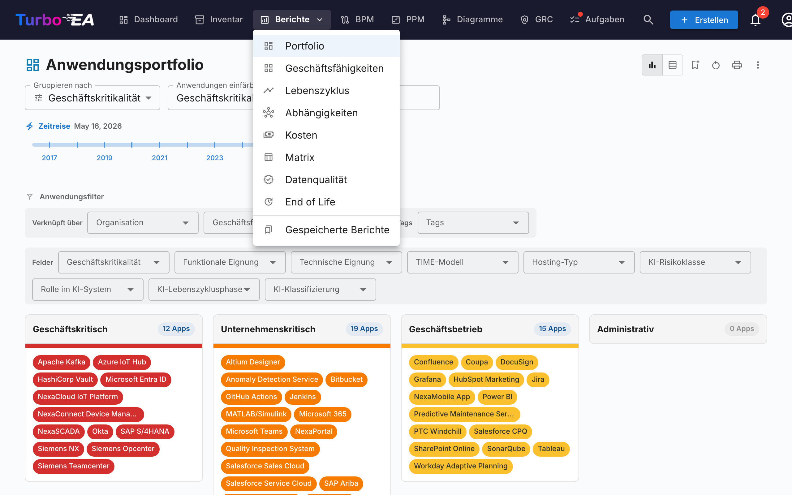
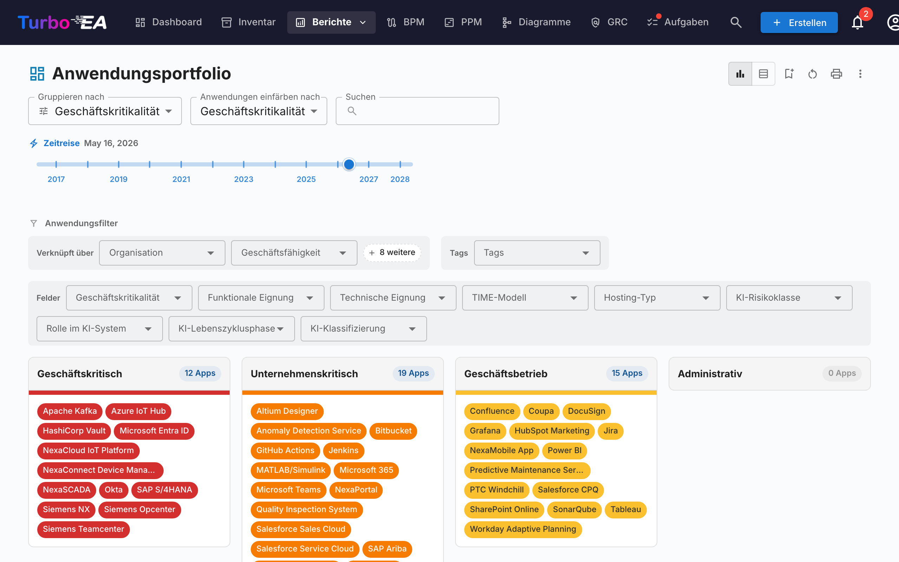
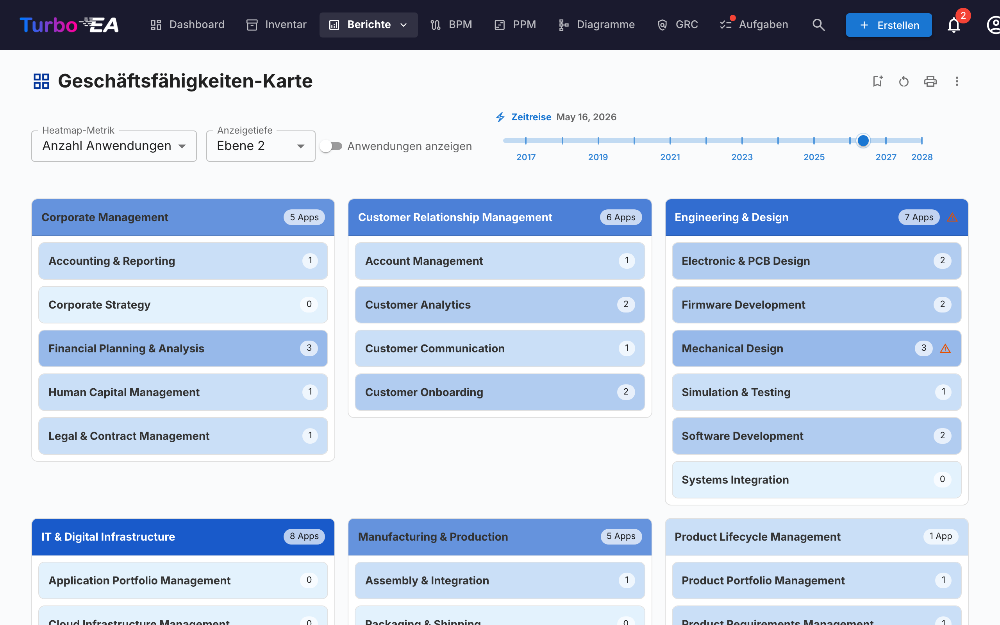
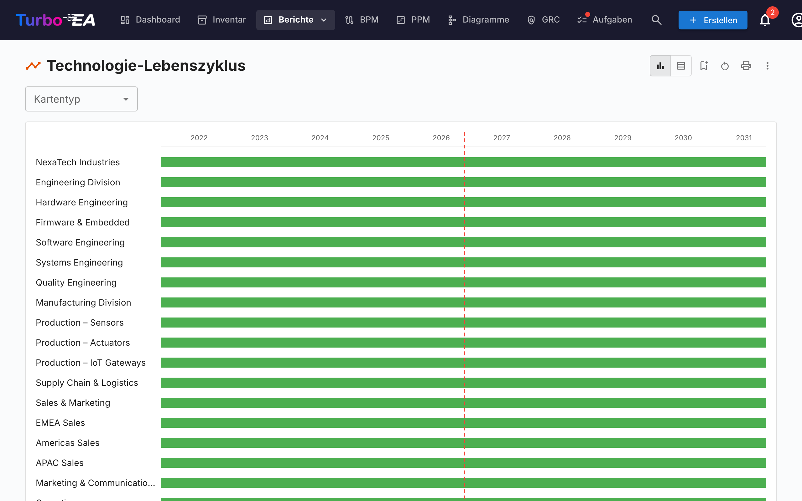
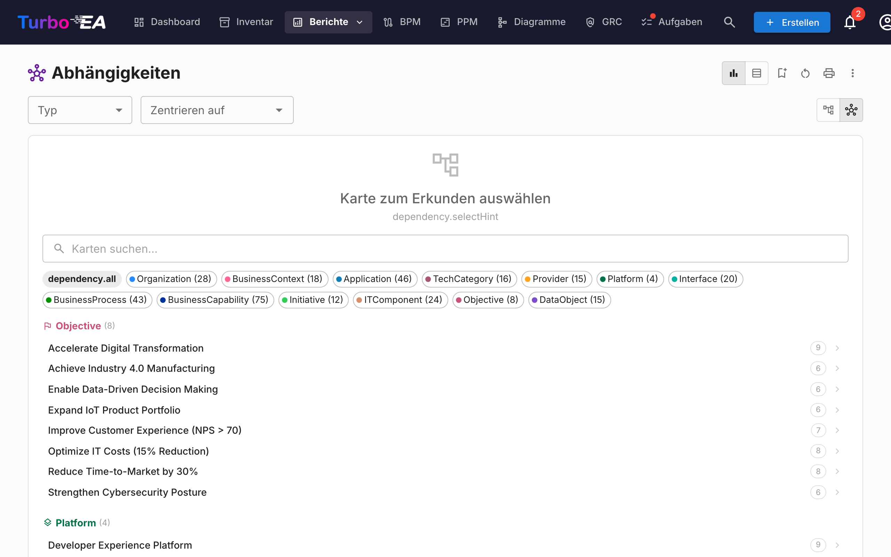
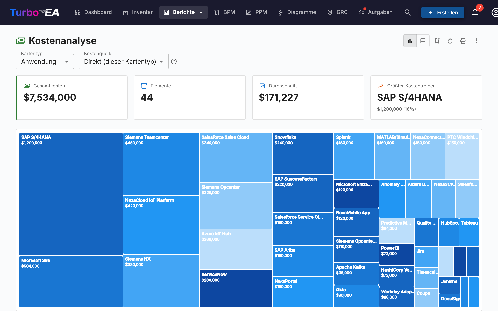
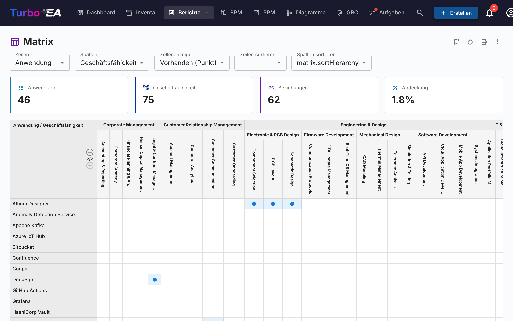
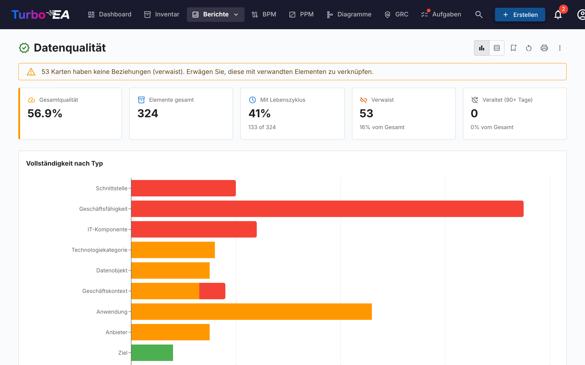
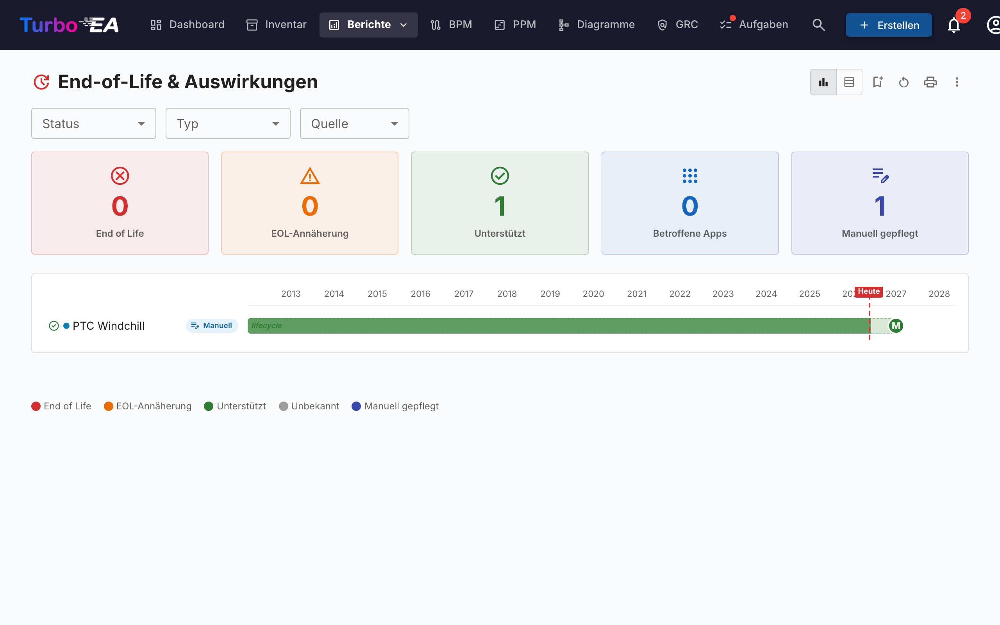
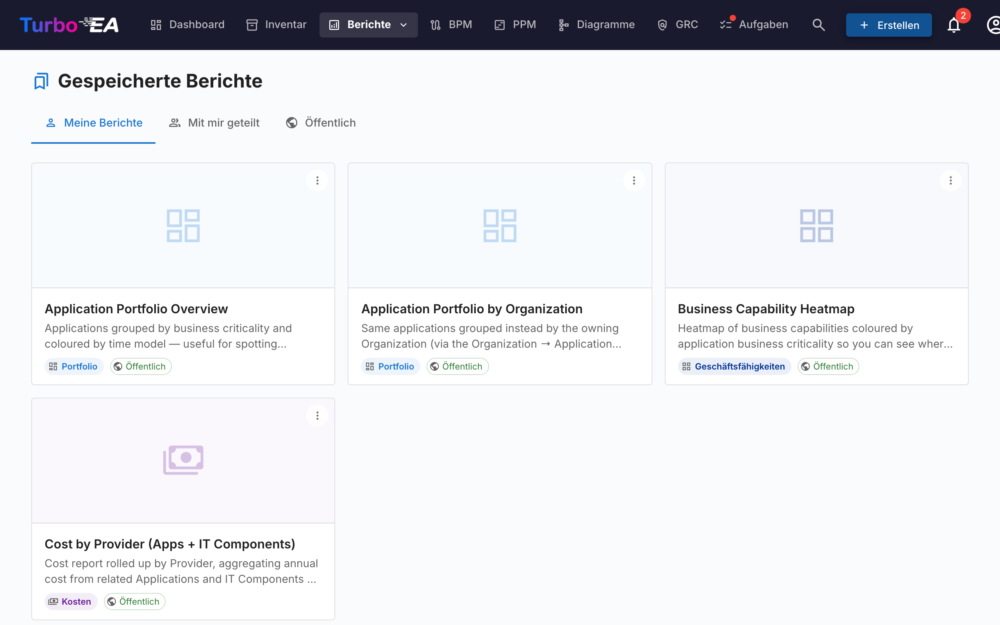

# Berichte

Turbo EA enthält ein leistungsstarkes **visuelles Berichtsmodul**, das die Analyse der Unternehmensarchitektur aus verschiedenen Perspektiven ermöglicht. Alle Berichte können mit ihrer aktuellen Filter- und Achsenkonfiguration [zur Wiederverwendung gespeichert](saved-reports.md) werden.

## Portfoliobericht

Der **Portfoliobericht** zeigt ein konfigurierbares **Blasendiagramm** (oder Streudiagramm) Ihrer Karten. Sie wählen, was jede Achse darstellt:

- **X-Achse** — Ein beliebiges numerisches oder Auswahlfeld wählen (z.B. Technische Eignung)
- **Y-Achse** — Ein beliebiges numerisches oder Auswahlfeld wählen (z.B. Geschäftskritikalität)
- **Blasengröße** — Einem numerischen Feld zuordnen (z.B. Jährliche Kosten)
- **Blasenfarbe** — Einem Auswahlfeld oder Lebenszyklusstatus zuordnen

Dies ist ideal für Portfolioanalysen — zum Beispiel Anwendungen nach Geschäftswert vs. technischer Eignung aufzutragen, um Kandidaten für Investition, Ablösung oder Stilllegung zu identifizieren.

### KI-Portfolio-Erkenntnisse

Wenn KI konfiguriert und Portfolio-Erkenntnisse von einem Administrator aktiviert sind, zeigt der Portfoliobericht eine Schaltfläche **KI-Erkenntnisse**. Ein Klick sendet eine Zusammenfassung der aktuellen Ansicht an den KI-Anbieter, der strategische Erkenntnisse über Konzentrationsrisiken, Modernisierungsmöglichkeiten, Lebenszyklus-Bedenken und Portfolio-Ausgewogenheit liefert. Das Erkenntnispanel ist zusammenklappbar und kann nach Änderung von Filtern oder Gruppierung neu generiert werden.

## Fähigkeitskarte

Die **Fähigkeitskarte** zeigt eine hierarchische **Heatmap** der Geschäftsfähigkeiten der Organisation. Jeder Block repräsentiert eine Fähigkeit, mit:

- **Hierarchie** — Hauptfähigkeiten enthalten ihre Unterfähigkeiten
- **Heatmap-Einfärbung** — Blöcke werden basierend auf einer ausgewählten Metrik eingefärbt (z.B. Anzahl unterstützender Anwendungen, durchschnittliche Datenqualität oder Risikoniveau)
- **Zum Erkunden klicken** — Klicken Sie auf eine beliebige Fähigkeit, um in deren Details und unterstützende Anwendungen einzutauchen

## Lebenszyklus-Bericht

Der **Lebenszyklus-Bericht** zeigt eine **Zeitleisten-Visualisierung** darüber, wann Technologiekomponenten eingeführt wurden und wann ihre Stilllegung geplant ist. Kritisch für:

- **Stilllegungsplanung** — Sehen, welche Komponenten sich dem Lebensende nähern
- **Investitionsplanung** — Lücken identifizieren, wo neue Technologie benötigt wird
- **Migrationskoordination** — Überlappende Einführungs- und Auslaufperioden visualisieren

Komponenten werden als horizontale Balken dargestellt, die ihre Lebenszyklusphasen umspannen: Planung, Einführung, Aktiv, Auslauf und Lebensende.

## Abhängigkeitsbericht

Der **Abhängigkeitsbericht** visualisiert **Verbindungen zwischen Komponenten** als Netzwerkgraph. Knoten repräsentieren Karten und Kanten repräsentieren Beziehungen. Funktionen:

- **Tiefensteuerung** — Begrenzen Sie, wie viele Sprünge vom Zentralknoten angezeigt werden (BFS-Tiefenbegrenzung)
- **Typfilterung** — Nur bestimmte Kartentypen und Beziehungstypen anzeigen
- **Interaktive Erkundung** — Klicken Sie auf einen beliebigen Knoten, um den Graph auf diese Karte zu zentrieren
- **Auswirkungsanalyse** — Den Wirkungsradius von Änderungen an einer bestimmten Komponente verstehen

### C4-Diagrammansicht

Wechseln Sie über die Ansichtsmodus-Schaltflächen in der Symbolleiste zur **C4-Diagramm**-Ansicht. Diese stellt die gleichen Abhängigkeitsdaten in C4-Notation dar:

- **Grenzrahmen** — Karten werden nach Architekturebene (Strategie, Business, Anwendung, Technologie) in gestrichelten Grenzrechtecken gruppiert
- **Interaktive Leinwand** — Schwenken, Zoomen und die Minimap nutzen, um große Diagramme zu navigieren
- **Klicken zum Inspizieren** — Klicken Sie auf einen beliebigen Knoten, um das Kartendetail-Seitenpanel zu öffnen
- **Kein Zentralknoten erforderlich** — Die C4-Ansicht zeigt alle Karten an, die dem aktuellen Typfilter entsprechen

## Kostenbericht

Der **Kostenbericht** bietet eine finanzielle Analyse Ihrer Technologielandschaft:

- **Treemap-Ansicht** — Verschachtelte Rechtecke, nach Kosten dimensioniert, mit optionaler Gruppierung (z.B. nach Organisation oder Fähigkeit)
- **Balkendiagramm-Ansicht** — Kostenvergleich über Komponenten hinweg
- **Aggregation** — Kosten können mithilfe berechneter Felder aus verwandten Karten summiert werden

## Matrixbericht

Der **Matrixbericht** erstellt ein **Kreuzreferenzraster** zwischen zwei Kartentypen. Zum Beispiel:

- **Zeilen** — Anwendungen
- **Spalten** — Geschäftsfähigkeiten
- **Zellen** — Zeigen an, ob eine Beziehung besteht (und wie viele)

Dies ist nützlich zur Identifizierung von Abdeckungslücken (Fähigkeiten ohne unterstützende Anwendungen) oder Redundanzen (Fähigkeiten, die von zu vielen Anwendungen unterstützt werden).

## Datenqualitätsbericht

Der **Datenqualitätsbericht** ist ein **Vollständigkeits-Dashboard**, das zeigt, wie gut Ihre Architekturdaten ausgefüllt sind. Basierend auf den im Metamodell konfigurierten Feldgewichtungen:

- **Gesamtbewertung** — Durchschnittliche Datenqualität über alle Karten
- **Nach Typ** — Aufschlüsselung, die zeigt, welche Kartentypen die beste/schlechteste Vollständigkeit haben
- **Einzelne Karten** — Liste der Karten mit der niedrigsten Datenqualität, priorisiert zur Verbesserung

## End-of-Life-Bericht (EOL)

Der **EOL-Bericht** zeigt den Supportstatus von Technologieprodukten, die über die Funktion [EOL-Administration](../admin/eol.md) verknüpft sind:

- **Statusverteilung** — Wie viele Produkte Unterstützt, EOL nähert sich oder Lebensende sind
- **Zeitleiste** — Wann Produkte den Support verlieren werden
- **Risikopriorisierung** — Fokus auf geschäftskritische Komponenten, die sich dem EOL nähern

## Gespeicherte Berichte

Speichern Sie jede Berichtskonfiguration für schnellen späteren Zugriff. Gespeicherte Berichte enthalten eine Miniaturvorschau und können in der gesamten Organisation geteilt werden.

## Prozesskarte

Die **Prozesskarte** visualisiert die Geschäftsprozesslandschaft der Organisation als strukturierte Karte und zeigt Prozesskategorien (Management, Kern, Unterstützung) und ihre hierarchischen Beziehungen.
