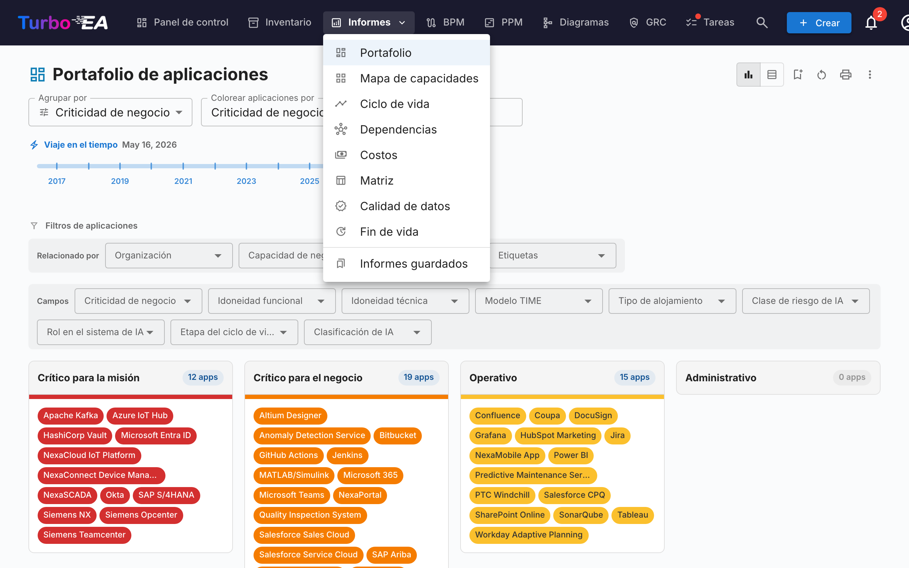
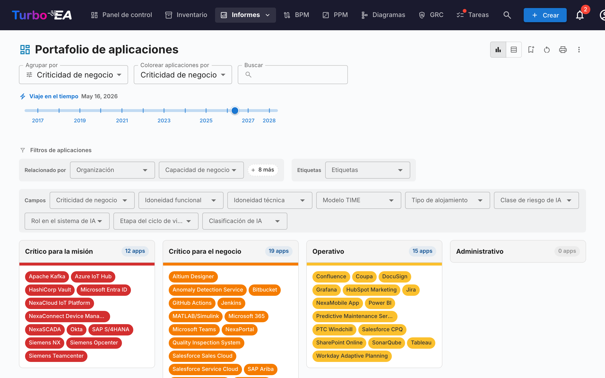
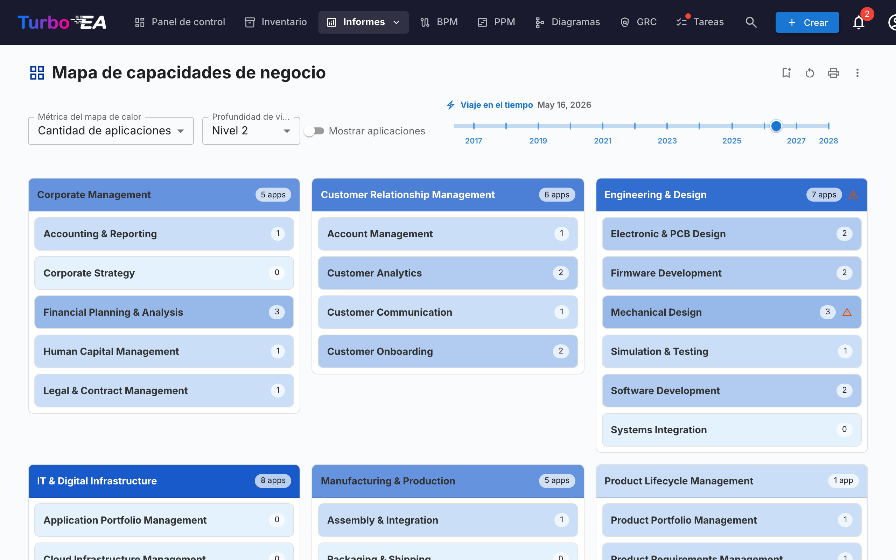
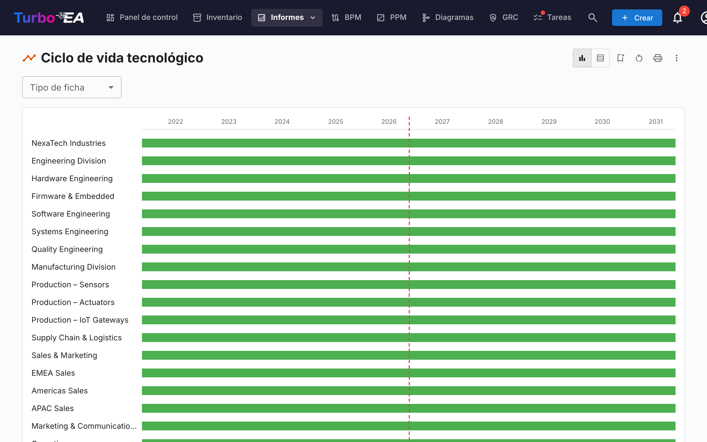
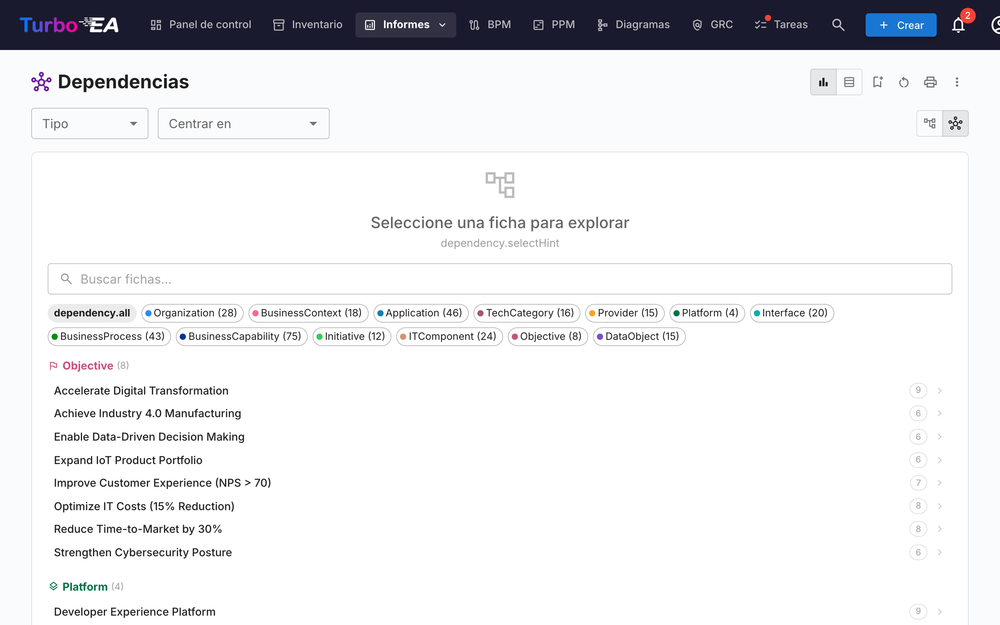
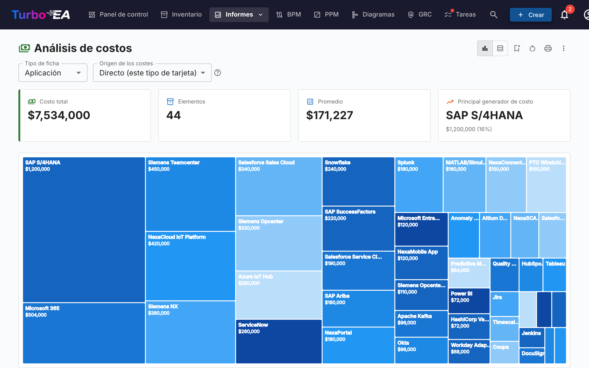
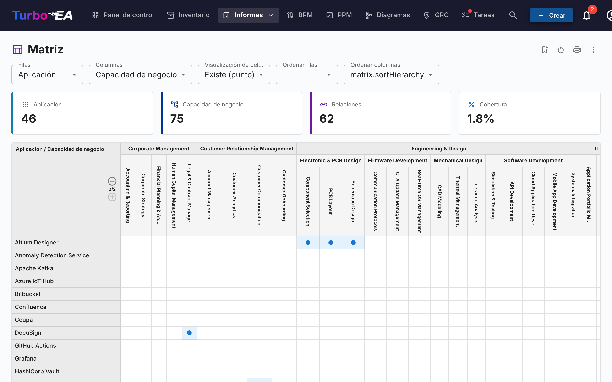
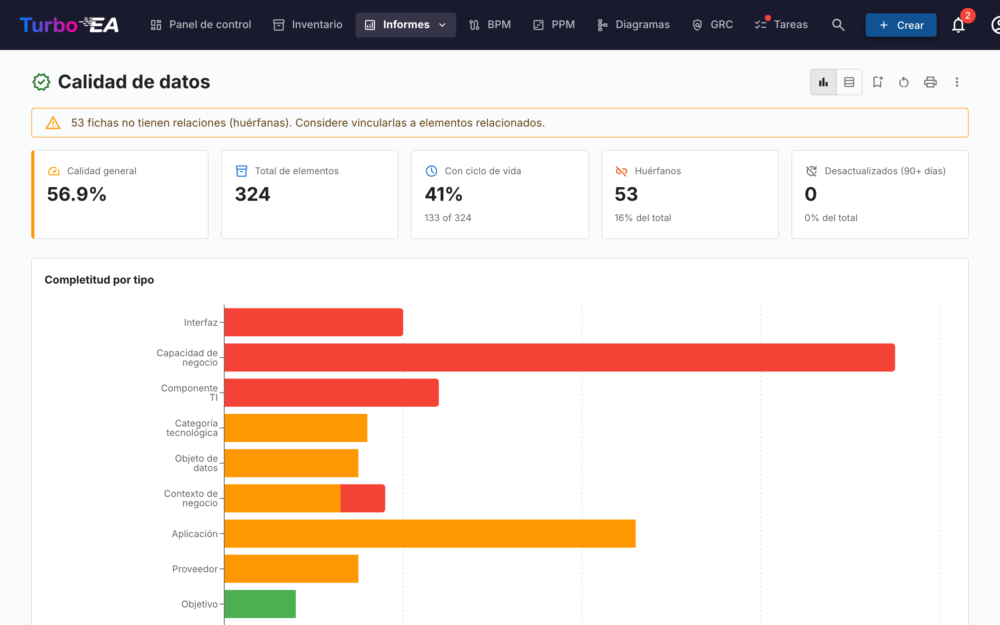
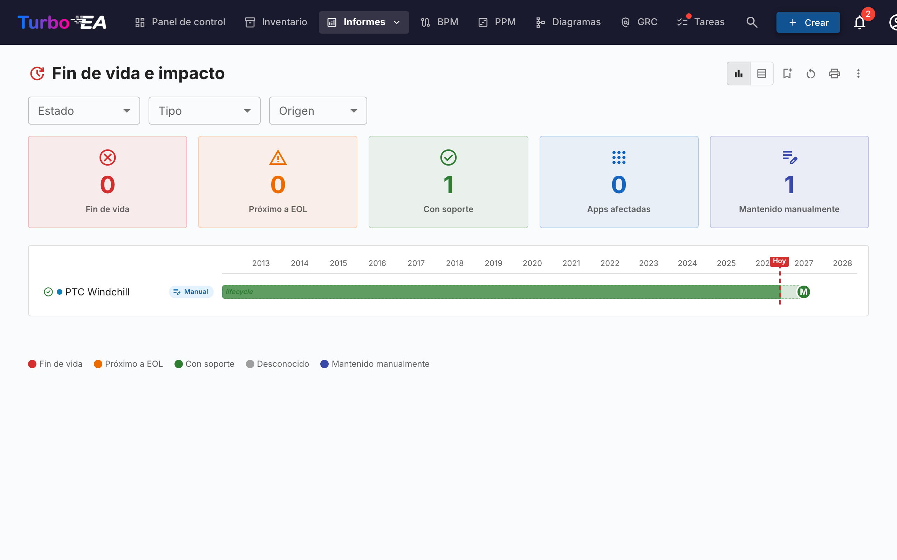
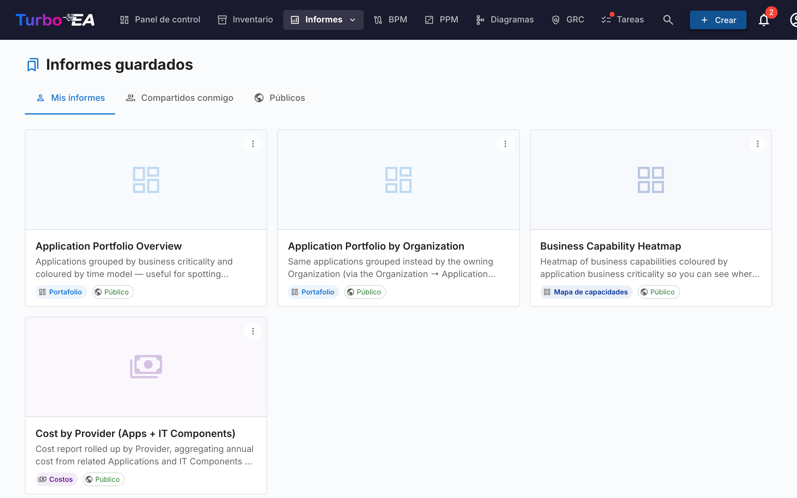

# Informes

Turbo EA incluye un potente módulo de **informes visuales** que permite analizar la arquitectura empresarial desde diferentes perspectivas. Todos los informes pueden ser [guardados para reutilización](saved-reports.es.md) con su configuración actual de filtros y ejes.

## Informe de Portafolio

El **Informe de Portafolio** muestra un **gráfico de burbujas** (o diagrama de dispersión) configurable de sus fichas. Usted elige qué representa cada eje:

- **Eje X** — Seleccione cualquier campo numérico o de selección (por ejemplo, Idoneidad Técnica)
- **Eje Y** — Seleccione cualquier campo numérico o de selección (por ejemplo, Criticidad de Negocio)
- **Tamaño de burbuja** — Asigne a un campo numérico (por ejemplo, Costo Anual)
- **Color de burbuja** — Asigne a un campo de selección o estado del ciclo de vida

Esto es ideal para el análisis de portafolio — por ejemplo, representar aplicaciones por valor de negocio vs. aptitud técnica para identificar candidatos para inversión, reemplazo o retiro.

### Análisis IA del portafolio

Cuando la IA está configurada y los análisis de portafolio están habilitados por un administrador, el informe de portafolio muestra un botón **Análisis IA**. Al hacer clic, se envía un resumen de la vista actual al proveedor de IA, que devuelve análisis estratégicos sobre riesgos de concentración, oportunidades de modernización, preocupaciones del ciclo de vida y equilibrio del portafolio. El panel de análisis es plegable y puede regenerarse después de cambiar filtros o agrupaciones.

## Mapa de Capacidades

El **Mapa de Capacidades** muestra un **mapa de calor** jerárquico de las capacidades de negocio de la organización. Cada bloque representa una capacidad, con:

- **Jerarquía** — Las capacidades principales contienen sus sub-capacidades
- **Coloración por mapa de calor** — Los bloques se colorean según una métrica seleccionada (por ejemplo, número de aplicaciones que las soportan, calidad de datos promedio o nivel de riesgo)
- **Clic para explorar** — Haga clic en cualquier capacidad para profundizar en sus detalles y aplicaciones de soporte

## Informe de Ciclo de Vida

El **Informe de Ciclo de Vida** muestra una **visualización de línea temporal** de cuándo se introdujeron los componentes tecnológicos y cuándo está planificado su retiro. Es crítico para:

- **Planificación de retiro** — Vea qué componentes se acercan al fin de vida
- **Planificación de inversión** — Identifique brechas donde se necesita nueva tecnología
- **Coordinación de migración** — Visualice períodos superpuestos de entrada y salida de fase

Los componentes se muestran como barras horizontales que abarcan sus fases de ciclo de vida: Plan, Fase de Entrada, Activo, Fase de Salida y Fin de Vida.

## Informe de Dependencias

El **Informe de Dependencias** visualiza las **conexiones entre componentes** como un grafo de red. Los nodos representan fichas y las aristas representan relaciones. Características:

- **Control de profundidad** — Limite cuántos saltos desde el nodo central se muestran (limitación de profundidad BFS)
- **Filtrado por tipo** — Muestre solo tipos de fichas y tipos de relaciones específicos
- **Exploración interactiva** — Haga clic en cualquier nodo para recentrar el grafo en esa ficha
- **Análisis de impacto** — Comprenda el radio de impacto de los cambios en un componente específico

## Informe de Costos

El **Informe de Costos** proporciona un análisis financiero de su panorama tecnológico:

- **Vista de mapa de árbol** — Rectángulos anidados dimensionados por costo, con agrupación opcional (por ejemplo, por organización o capacidad)
- **Vista de gráfico de barras** — Comparación de costos entre componentes
- **Agregación** — Los costos pueden sumarse desde fichas relacionadas usando campos calculados

## Informe de Matriz

El **Informe de Matriz** crea una **cuadrícula de referencias cruzadas** entre dos tipos de fichas. Por ejemplo:

- **Filas** — Aplicaciones
- **Columnas** — Capacidades de Negocio
- **Celdas** — Indican si existe una relación (y cuántas)

Esto es útil para identificar brechas de cobertura (capacidades sin aplicaciones de soporte) o redundancias (capacidades soportadas por demasiadas aplicaciones).

## Informe de Calidad de Datos

El **Informe de Calidad de Datos** es un **panel de completitud** que muestra qué tan bien están completados los datos de su arquitectura. Basado en los pesos de campos configurados en el metamodelo:

- **Puntuación general** — Calidad de datos promedio en todas las fichas
- **Por tipo** — Desglose que muestra qué tipos de fichas tienen la mejor/peor completitud
- **Fichas individuales** — Lista de fichas con la calidad de datos más baja, priorizadas para mejora

## Informe de Fin de Vida (EOL)

El **Informe de EOL** muestra el estado de soporte de los productos tecnológicos vinculados a través de la función de [Administración de EOL](../admin/eol.es.md):

- **Distribución de estados** — Cuántos productos tienen Soporte, se Acercan a EOL o están en Fin de Vida
- **Línea temporal** — Cuándo los productos perderán soporte
- **Priorización de riesgos** — Enfóquese en componentes de misión crítica que se acercan a EOL

## Informes Guardados

Guarde cualquier configuración de informe para acceso rápido. Los informes guardados incluyen una vista previa en miniatura y pueden compartirse en toda la organización.

## Mapa de Procesos

El **Mapa de Procesos** visualiza el panorama de procesos de negocio de la organización como un mapa estructurado, mostrando las categorías de procesos (Gestión, Principal, Soporte) y sus relaciones jerárquicas.
