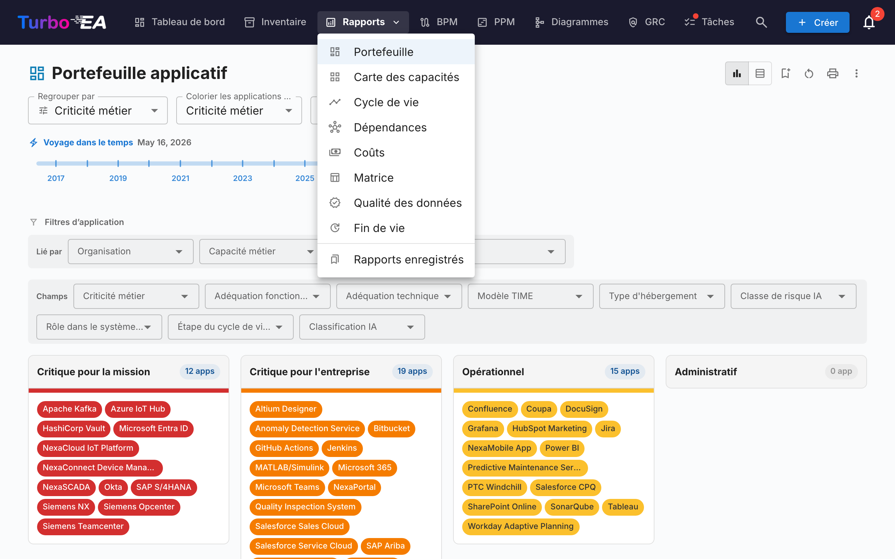
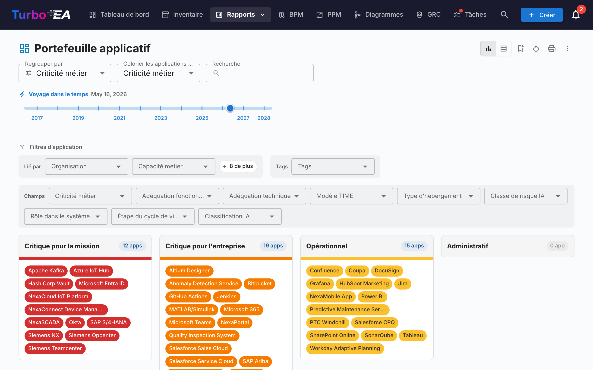
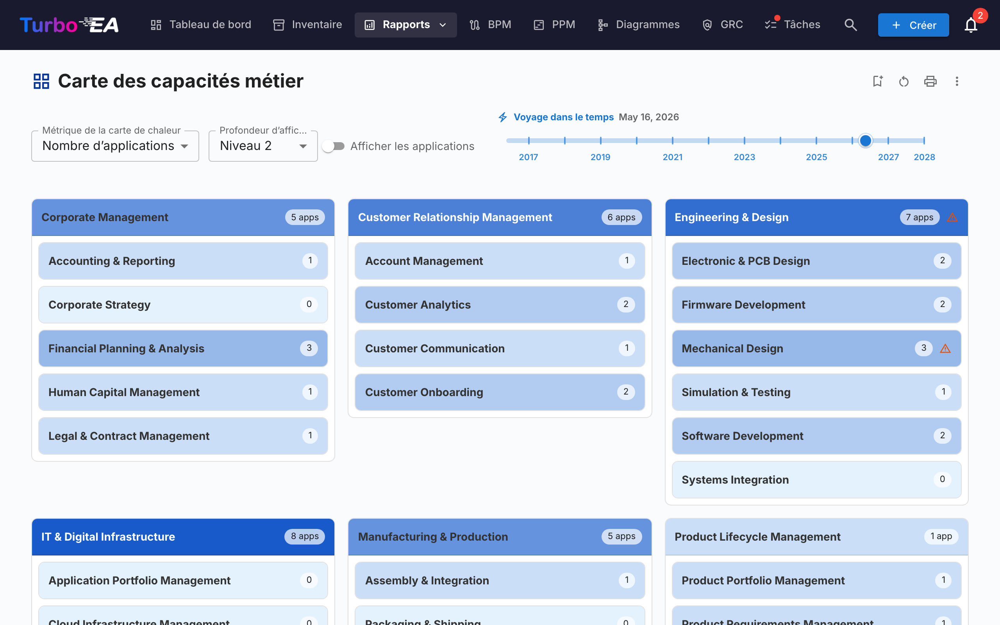
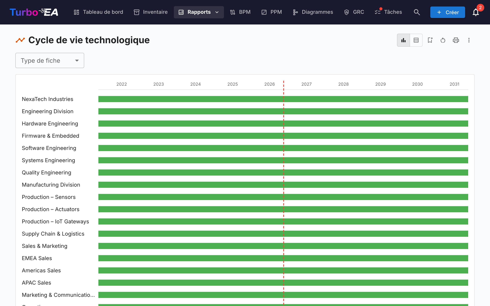
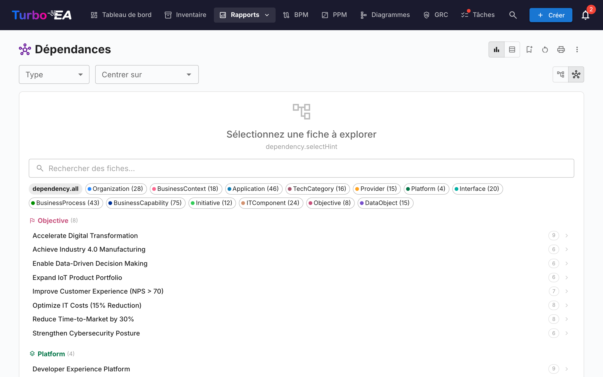
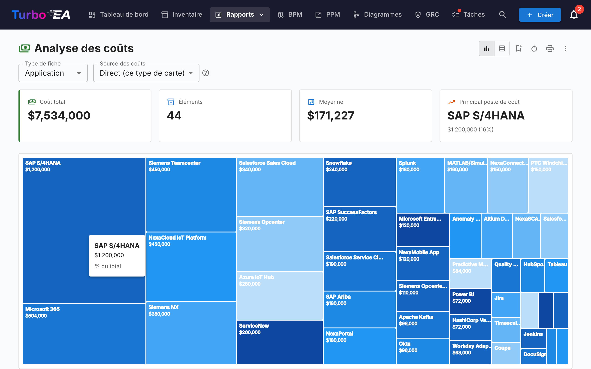
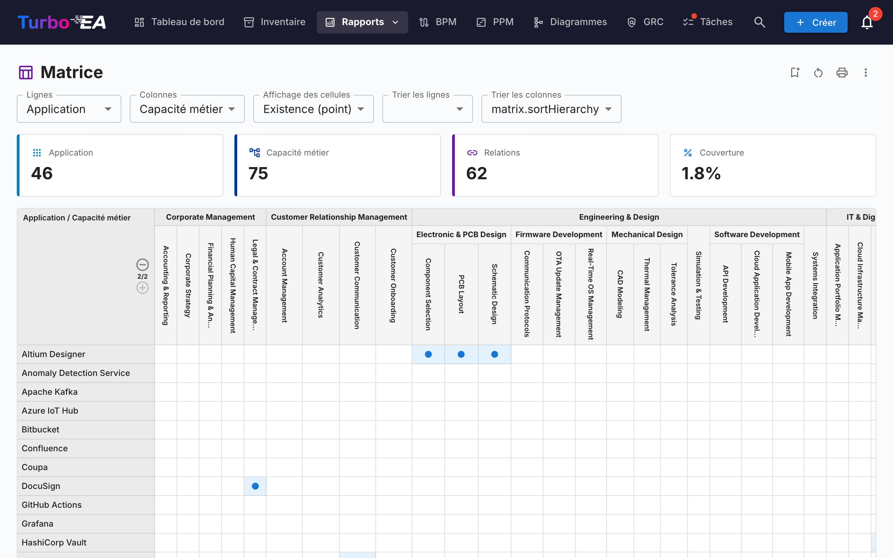
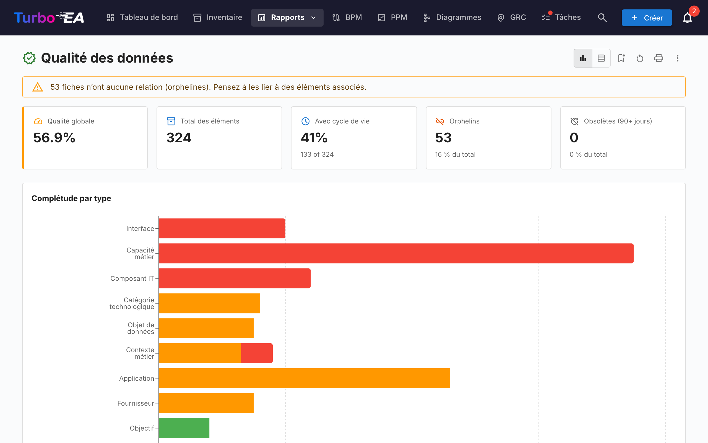
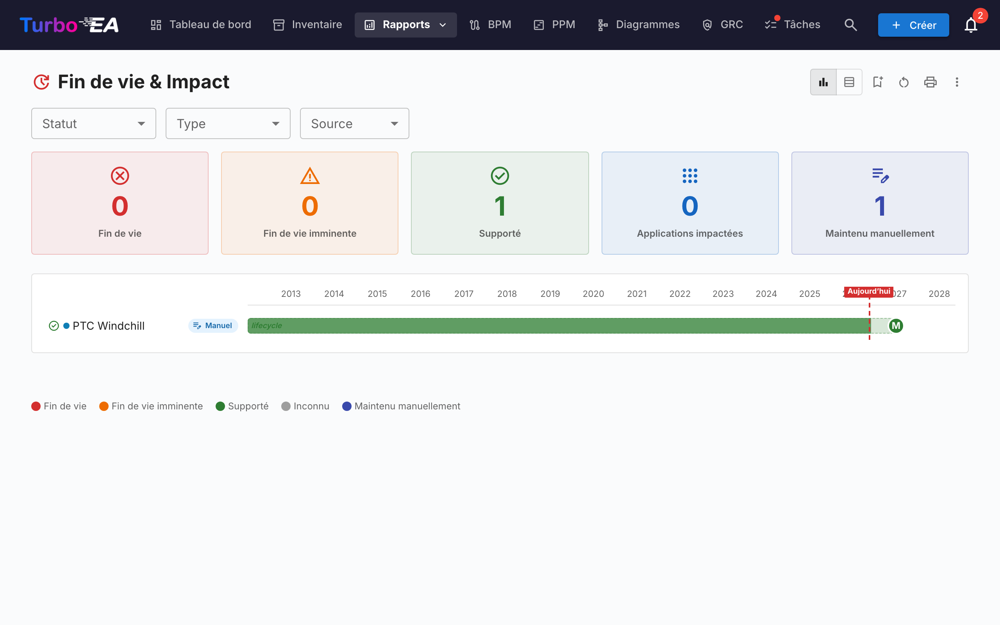
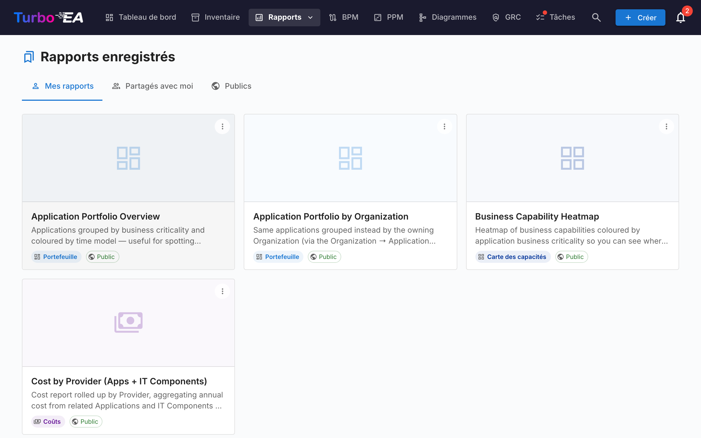

# Rapports

Turbo EA inclut un puissant module de **rapports visuels** permettant d'analyser l'architecture d'entreprise sous différents angles. Tous les rapports peuvent être [sauvegardés pour réutilisation](saved-reports.md) avec leur configuration actuelle de filtres et d'axes.

## Rapport Portefeuille

Le **Rapport Portefeuille** affiche un **graphique à bulles** (ou nuage de points) configurable de vos fiches. Vous choisissez ce que chaque axe représente :

- **Axe X** -- Sélectionnez n'importe quel champ numérique ou de sélection (par ex. Adéquation Technique)
- **Axe Y** -- Sélectionnez n'importe quel champ numérique ou de sélection (par ex. Criticité Métier)
- **Taille de la bulle** -- Associer à un champ numérique (par ex. Coût Annuel)
- **Couleur de la bulle** -- Associer à un champ de sélection ou à l'état du cycle de vie

C'est idéal pour l'analyse de portefeuille -- par exemple, positionner les applications par valeur métier vs adéquation technique pour identifier les candidats à l'investissement, au remplacement ou au retrait.

### Analyses IA du portefeuille

Lorsque l'IA est configurée et que les analyses de portefeuille sont activées par un administrateur, le rapport de portefeuille affiche un bouton **Analyses IA**. Un clic envoie un résumé de la vue actuelle au fournisseur IA, qui renvoie des analyses stratégiques sur les risques de concentration, les opportunités de modernisation, les préoccupations de cycle de vie et l'équilibre du portefeuille. Le panneau d'analyses est repliable et peut être régénéré après modification des filtres ou du regroupement.

## Carte de capacités

La **Carte de capacités** affiche une **carte thermique hiérarchique** des capacités métier de l'organisation. Chaque bloc représente une capacité, avec :

- **Hiérarchie** -- Les capacités principales contiennent leurs sous-capacités
- **Coloration thermique** -- Les blocs sont colorés en fonction d'une métrique sélectionnée (par ex. nombre d'applications de support, qualité moyenne des données, ou niveau de risque)
- **Cliquer pour explorer** -- Cliquez sur n'importe quelle capacité pour approfondir ses détails et ses applications de support

## Rapport Cycle de vie

Le **Rapport Cycle de vie** affiche une **visualisation chronologique** indiquant quand les composants technologiques ont été introduits et quand leur retrait est prévu. Essentiel pour :

- **Planification du retrait** -- Voir quels composants approchent de la fin de vie
- **Planification des investissements** -- Identifier les lacunes où une nouvelle technologie est nécessaire
- **Coordination des migrations** -- Visualiser les périodes de chevauchement entre mise en service et retrait progressif

Les composants sont affichés sous forme de barres horizontales couvrant leurs phases de cycle de vie : Planification, Mise en service, Actif, Retrait progressif et Fin de vie.

## Rapport Dépendances

Le **Rapport Dépendances** visualise les **connexions entre composants** sous forme de graphe réseau. Les nœuds représentent les fiches et les arêtes représentent les relations. Fonctionnalités :

- **Contrôle de profondeur** -- Limiter le nombre de sauts depuis le nœud central à afficher (limitation de profondeur BFS)
- **Filtrage par type** -- Afficher uniquement des types de fiches et types de relations spécifiques
- **Exploration interactive** -- Cliquer sur n'importe quel nœud pour recentrer le graphe sur cette fiche
- **Analyse d'impact** -- Comprendre le rayon d'impact des modifications sur un composant spécifique

### Vue Diagramme C4

Basculez vers la vue **Diagramme C4** à l'aide des boutons de mode d'affichage dans la barre d'outils. Celle-ci restitue les mêmes données de dépendances en notation C4 :

- **Cadres de périmètre** — Les fiches sont regroupées par couche architecturale (Stratégie, Métier, Application, Technique) dans des rectangles de périmètre en pointillés
- **Canevas interactif** — Déplacez, zoomez et utilisez la minimap pour naviguer dans les grands diagrammes
- **Cliquer pour inspecter** — Cliquez sur n'importe quel nœud pour ouvrir le panneau latéral de détail de la fiche
- **Pas de fiche centrale requise** — La vue C4 affiche toutes les fiches correspondant au filtre de type actuel
- **Mise en surbrillance des connexions** — Survolez une fiche pour mettre en surbrillance ses connexions ; sur les appareils tactiles, utilisez le bouton de surbrillance dans le panneau de contrôle pour mettre en surbrillance par toucher

## Rapport Coûts

Le **Rapport Coûts** fournit une analyse financière de votre paysage technologique :

- **Vue treemap** -- Rectangles imbriqués dimensionnés par coût, avec regroupement optionnel (par ex. par organisation ou capacité)
- **Vue graphique à barres** -- Comparaison des coûts entre composants
- **Agrégation** -- Les coûts peuvent être additionnés à partir de fiches liées en utilisant des champs calculés

## Rapport Matrice

Le **Rapport Matrice** crée une **grille de références croisées** entre deux types de fiches. Par exemple :

- **Lignes** -- Applications
- **Colonnes** -- Capacités Métier
- **Cellules** -- Indiquent si une relation existe (et combien)

Ceci est utile pour identifier les lacunes de couverture (capacités sans applications de support) ou les redondances (capacités supportées par trop d'applications).

## Rapport Qualité des données

Le **Rapport Qualité des données** est un **tableau de bord de complétude** qui montre à quel point vos données d'architecture sont bien renseignées. Basé sur les poids des champs configurés dans le métamodèle :

- **Score global** -- Qualité moyenne des données sur toutes les fiches
- **Par type** -- Ventilation montrant quels types de fiches ont la meilleure/pire complétude
- **Fiches individuelles** -- Liste des fiches avec la qualité de données la plus faible, priorisées pour amélioration

## Rapport Fin de vie (EOL)

Le **Rapport EOL** affiche le statut de support des produits technologiques liés via la fonctionnalité [Administration EOL](../admin/eol.md) :

- **Répartition des statuts** -- Combien de produits sont Supportés, Approchant la fin de vie, ou en Fin de vie
- **Chronologie** -- Quand les produits perdront leur support
- **Priorisation des risques** -- Se concentrer sur les composants critiques approchant la fin de vie

## Rapports sauvegardés

Sauvegardez n'importe quelle configuration de rapport pour un accès rapide ultérieur. Les rapports sauvegardés incluent un aperçu en miniature et peuvent être partagés dans toute l'organisation.

## Carte de processus

La **Carte de processus** visualise le paysage des processus métier de l'organisation sous forme de carte structurée, montrant les catégories de processus (Management, Cœur de métier, Support) et leurs relations hiérarchiques.
