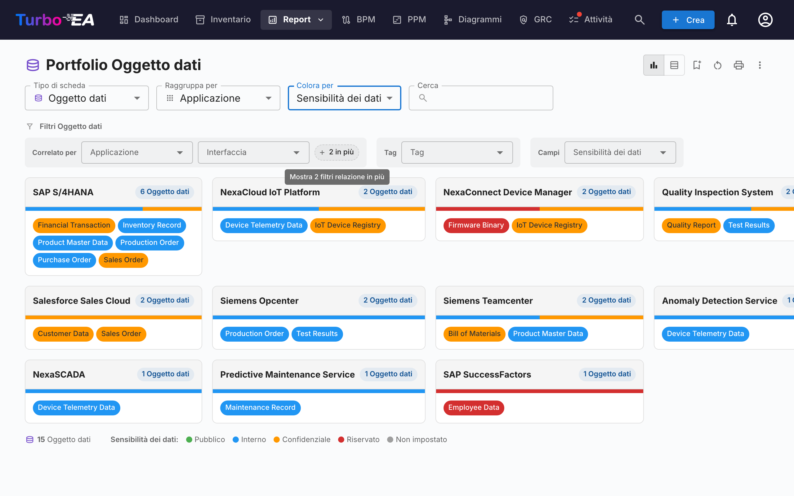

# Report

Turbo EA include un potente modulo di **reportistica visiva** che consente di analizzare l'enterprise architecture da diverse prospettive. Tutti i report possono essere [salvati per il riutilizzo](saved-reports.md) con la configurazione attuale di filtri e assi.

## Report Portfolio

Il **Report Portfolio** mostra un **grafico a bolle** (o scatter plot) configurabile delle vostre card. Scegliete cosa rappresenta ogni asse:

- **Asse X** — Selezionate qualsiasi campo numerico o di selezione (es. Idoneità Tecnica)
- **Asse Y** — Selezionate qualsiasi campo numerico o di selezione (es. Criticità Aziendale)
- **Dimensione bolla** — Mappate su un campo numerico (es. Costo Annuale)
- **Colore bolla** — Mappate su un campo di selezione o stato del ciclo di vita

Questo è ideale per l'analisi del portfolio — ad esempio, posizionare le applicazioni per valore aziendale vs. idoneità tecnica per identificare candidati per investimento, sostituzione o ritiro.

### Analisi IA del portafoglio

Quando l'IA è configurata e le analisi del portafoglio sono abilitate da un amministratore, il report del portafoglio mostra un pulsante **Analisi IA**. Cliccandolo viene inviato un riepilogo della vista corrente al provider IA, che restituisce analisi strategiche su rischi di concentrazione, opportunità di modernizzazione, problematiche del ciclo di vita e bilanciamento del portafoglio. Il pannello delle analisi è comprimibile e può essere rigenerato dopo aver modificato filtri o raggruppamenti.

## Portfolio flessibile

Il **Portfolio flessibile** utilizza gli stessi controlli del Portfolio applicazioni ma aggiunge un selettore **Tipo di scheda** in cima alla barra degli strumenti. Permette di analizzare portafogli di Capability di business, Iniziative, Componenti IT o qualsiasi altro tipo di scheda visibile con la stessa esperienza di raggruppamento, colorazione e filtri.

Lo screenshot mostra un caso d'uso tipico: scegli **Oggetto dati** come tipo di scheda, **Raggruppa per → Applicazione** per vedere quale applicazione possiede quali dati e **Colora per → Sensibilità dei dati** per individuare a colpo d'occhio dove risiedono i dati riservati.

Cambiare il tipo di scheda azzera le selezioni di raggruppamento, colore e filtri (referenziano chiavi di campo che non esistono nel nuovo tipo) e il report viene ricaricato con i campi, le relazioni e i tag applicabili al tipo scelto. Il report condivide lo stesso permesso del Portfolio applicazioni (`reports.portfolio`) e viene salvato in modo indipendente.

### Sottotipi di relazione

Quando le relazioni di una scheda portano un valore di «tipo» — ad esempio il **tipo di utilizzo** (Proprietario / Utente / Stakeholder) sulle relazioni Organizzazione→Applicazione, o il **tipo di supporto** sulle relazioni Applicazione→Capability di business — puoi colorare le schede in base a quel valore e filtrarle. **Raggruppa il report per il tipo di scheda correlato** per usarli (ad es. *Raggruppa per → Organizzazione* per abilitare il *tipo di utilizzo*): il sottotipo compare quindi sotto il gruppo **Sottotipi di relazione** nel menu *Colora per* e come riga di filtri dedicata. Poiché ogni scheda è mostrata sotto una scheda correlata, viene colorata in base a *quella* relazione: un'applicazione che è *Utente* di un'organizzazione appare come Utente lì, anche se appartiene a un'altra.

## Mappa delle Capability

La **Mappa delle Capability** mostra una **mappa di calore** gerarchica delle business capability dell'organizzazione. Ogni blocco rappresenta una capability, con:

- **Gerarchia** — Le capability principali contengono le loro sotto-capability
- **Colorazione a mappa di calore** — I blocchi sono colorati in base a una metrica selezionata (es. numero di applicazioni di supporto, qualità media dei dati o livello di rischio)
- **Cliccate per esplorare** — Cliccate su qualsiasi capability per approfondire i dettagli e le applicazioni di supporto

## Report Ciclo di vita

Il **Report Ciclo di vita** mostra una **visualizzazione temporale** di quando i componenti tecnologici sono stati introdotti e quando è previsto il loro ritiro. Fondamentale per:

- **Pianificazione del ritiro** — Vedete quali componenti si avvicinano alla fine del ciclo di vita
- **Pianificazione degli investimenti** — Identificate le lacune dove serve nuova tecnologia
- **Coordinamento delle migrazioni** — Visualizzate i periodi sovrapposti di phase-in e phase-out

I componenti sono visualizzati come barre orizzontali che attraversano le fasi del ciclo di vita: Plan, Phase In, Active, Phase Out e End of Life.

## Report Dipendenze

Il **Report Dipendenze** visualizza le **connessioni tra componenti** come un grafo a rete. I nodi rappresentano le card e gli archi rappresentano le relazioni. Funzionalità:

- **Controllo della profondità** — Limitate quanti salti dal nodo centrale visualizzare (limitazione della profondità BFS)
- **Filtro per tipo** — Mostrate solo specifici tipi di card e tipi di relazione
- **Esplorazione interattiva** — Cliccate su qualsiasi nodo per ricentrare il grafo su quella card
- **Analisi dell'impatto** — Comprendete il raggio d'azione delle modifiche a un componente specifico

### Layered Dependency View (vista delle dipendenze a livelli)

Passate alla **Layered Dependency View** usando i pulsanti di modalità di visualizzazione nella barra degli strumenti. È la notazione interna di Turbo EA per mostrare le dipendenze tra le card sui quattro livelli EA — ispirata al principio di stratificazione di ArchiMate e alla filosofia dei «buoni valori predefiniti» del modello C4, ma distinta da entrambi:

- **Corsie per livello** — Le card sono raggruppate per livello architetturale (Strategia e Trasformazione, Architettura di Business, Applicazione e Dati, Architettura Tecnica) all'interno di rettangoli di confine tratteggiati, in ordine fisso
- **Nodi colorati per tipo** — Ogni nodo è colorato in base al suo tipo di card ed etichettato con il nome e il tipo della card
- **Archi orientati ed etichettati** — Gli archi seguono la direzione della relazione del metamodello (origine → destinazione) e portano l'etichetta diretta della relazione (per es. *usa*, *supporta*, *gira su*)
- **Card proposte** — Nell'assistente TurboLens Architect, le card non ancora confermate hanno un bordo tratteggiato e un badge verde **NEW**
- **Canvas interattivo** — Spostate, zoomate e usate la minimappa per navigare diagrammi di grandi dimensioni
- **Cliccate per ispezionare** — Cliccate su qualsiasi nodo per aprire il pannello laterale di dettaglio della card
- **Nessuna card centrale richiesta** — La Layered Dependency View mostra tutte le card che corrispondono al filtro di tipo corrente
- **Evidenziazione delle connessioni** — Passate il mouse su una card per evidenziare le sue connessioni; sui dispositivi touch, usate il pulsante di evidenziazione nel pannello dei controlli per evidenziare con il tocco

La stessa vista viene riutilizzata nella pagina di dettaglio della card (mostrando il vicinato di dipendenze immediato della card) e nell'assistente [TurboLens Architect](turbolens.md#architecture-ai), così le dipendenze appaiono uguali ovunque.

## Report Costi

Il **Report Costi** fornisce un'analisi finanziaria del vostro panorama tecnologico:

- **Vista treemap** — Rettangoli annidati dimensionati per costo, con raggruppamento opzionale (es. per organizzazione o capability)
- **Vista grafico a barre** — Confronto dei costi tra componenti
- **Tipo di scheda** — Scegliete il tipo di scheda su cui costruire il report (Applicazione, Componente IT, Fornitore, …).

### Origine dei costi

Quando il tipo di scheda selezionato ha almeno un tipo di relazione che punta a un tipo dotato di un campo di costo, accanto a **Tipo di scheda** compare un selettore **Origine dei costi**. Permette di scegliere da dove provengono i numeri:

- **Diretto (questo tipo di scheda)** — opzione predefinita; somma il campo di costo sulle schede mostrate. Da usare quando si consultano direttamente *Applicazioni* o *Componenti IT*.
- **Aggregare dalle schede collegate** — selezionate una o più voci `Tipo · Campo` (per esempio `Applicazione · Costo annuo totale`, `Componente IT · Costo annuo totale`). Il valore di ogni scheda primaria diventa allora la somma di quel campo sulle sue schede collegate.

Il selettore è **a selezione multipla**, quindi un unico consolidamento può combinare più tipi correlati. Esempio: visualizzando il **Fornitore** *Microsoft*, selezionare insieme `Applicazione · Costo annuo totale` e `Componente IT · Costo annuo totale` mostra l'intera impronta del fornitore — Teams, M365, Azure e qualunque altro componente fornito da Microsoft — come un unico numero.

#### Perché nulla viene contato due volte

Il selettore è costruito in modo da rendere il doppio conteggio impossibile per costruzione:

- Ogni voce è una coppia unica `(tipo destinazione, campo di costo)`: l'elenco propone ogni coppia esattamente una volta, anche quando più tipi di relazione raggiungono lo stesso tipo destinazione.
- All'interno di una stessa coppia, due schede collegate tramite più tipi di relazione contribuiscono con il loro costo una sola volta.
- Tra voci diverse, nessuna scheda può contribuire due volte: una scheda ha esattamente un tipo, e campi di costo diversi sulla stessa scheda sono valori indipendenti.

Una piccola **icona di aiuto (?)** accanto al selettore ribadisce questa garanzia al passaggio del mouse.

L'elenco delle opzioni è generato dal vostro metamodello — i tipi di relazione e i campi di costo vengono individuati a runtime, quindi qualunque tipo di scheda o relazione personalizzata aggiunta diventa automaticamente un'Origine dei costi valida.

### Drill-down in un rettangolo

Quando almeno un'Origine costi è attiva, i rettangoli del treemap diventano **cliccabili**. Cliccando su uno, il grafico viene sostituito dalla scomposizione del costo di quel rettangolo: le card collegate che hanno contribuito al suo totale, dimensionate per il loro costo diretto. Sopra il grafico appare una briciola di pane, ad esempio **Tutte le Applicazioni › NexaCore ERP**; clicca su un segmento qualsiasi per risalire.

- **Singola Origine costi attiva** — il drill-down mostra un treemap delle card collegate (ad esempio, cliccando su *NexaCore ERP* con `Componente IT · Costo annuale totale` selezionato vengono mostrati i componenti IT collegati a NexaCore ERP, dimensionati per il loro costo annuale).
- **Più Origini costi attive** — il drill-down mostra **un treemap per origine affiancati** (1 colonna su schermi stretti, 2 su quelli ampi). Ogni pannello ha la propria intestazione, il proprio totale e la propria `% del totale` nel tooltip — così i diversi tipi di card mantengono la propria scala invece di essere compressi in un unico grafico.

Lo slider della linea temporale, la selezione dell'Origine costi e gli altri filtri vengono mantenuti durante il drill-down, e il livello di drill-down fa parte della configurazione del report salvato: salvando un report mentre si è in drill-down lo si riapre direttamente a quel livello. Senza un'Origine costi attiva, un clic su un rettangolo apre invece il pannello laterale della card (non c'è nulla da scomporre).

## Report Matrice

Il **Report Matrice** crea una **griglia di riferimento incrociato** tra due tipi di card. Ad esempio:

- **Righe** — Application
- **Colonne** — Business Capability
- **Celle** — Indicano se esiste una relazione (e quante)

Questo è utile per identificare lacune di copertura (capability senza applicazioni di supporto) o ridondanze (capability supportate da troppe applicazioni).

## Report Qualità dei Dati

Il **Report Qualità dei Dati** è una **dashboard di completezza** che mostra quanto bene i vostri dati architetturali sono compilati. Basato sui livelli di importanza configurati nella scheda **Qualità dei dati** di ogni tipo di card (ogni campo più i fattori integrati Descrizione, Ciclo di vita, Relazioni obbligatorie e Tag obbligatori):

- **Punteggio complessivo** — Qualità media dei dati su tutte le card
- **Per tipo** — Dettaglio che mostra quali tipi di card hanno la migliore/peggiore completezza
- **Card individuali** — Elenco delle card con la qualità dei dati più bassa, prioritizzate per il miglioramento

## Report End of Life (EOL)

Il **Report EOL** mostra lo stato di supporto dei prodotti tecnologici collegati tramite la funzionalità [Amministrazione EOL](../admin/eol.md):

- **Distribuzione degli stati** — Quanti prodotti sono Supportati, In avvicinamento a EOL o End of Life
- **Timeline** — Quando i prodotti perderanno il supporto
- **Prioritizzazione del rischio** — Concentratevi sui componenti mission-critical in avvicinamento a EOL

## Report salvati

Salvate qualsiasi configurazione di report per un accesso rapido successivo. I report salvati includono un'anteprima in miniatura e possono essere condivisi nell'organizzazione.

## Esportare i report

Ogni report supporta **Esporta in Excel (.xlsx)** e **Esporta in PowerPoint (.pptx)** dal menu **⋮** nella barra del titolo (accanto a Stampa e Copia link).

- **Excel** — Produce un foglio per ogni tabella di dati visualizzata al momento, con colonne dimensionate automaticamente e formattazione di valute / numeri preservata. Passate alla **vista tabella** prima di esportare per catturare le righe sottostanti.
- **PowerPoint** — Genera una presentazione la cui prima diapositiva combina titolo del report, timestamp di generazione, riepilogo dei filtri attivi e il grafico live in qualità presentazione. Le diapositive successive paginano le tabelle per dispense condivisibili.

Filtri e raggruppamenti attivi al momento dell'esportazione sono registrati sulla diapositiva di titolo o nell'intestazione, mantenendo le esportazioni autoesplicative.

## Mappa dei processi

La **Mappa dei processi** visualizza il panorama dei processi aziendali dell'organizzazione come una mappa strutturata, mostrando le categorie di processo (Gestione, Core, Supporto) e le loro relazioni gerarchiche.
