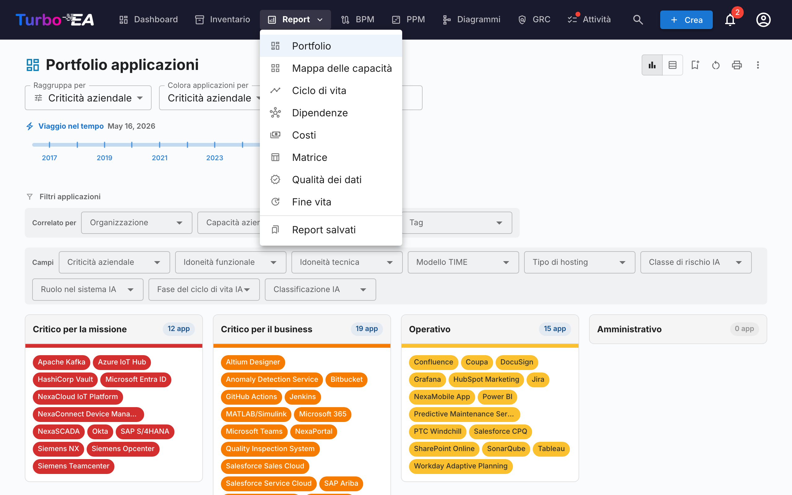
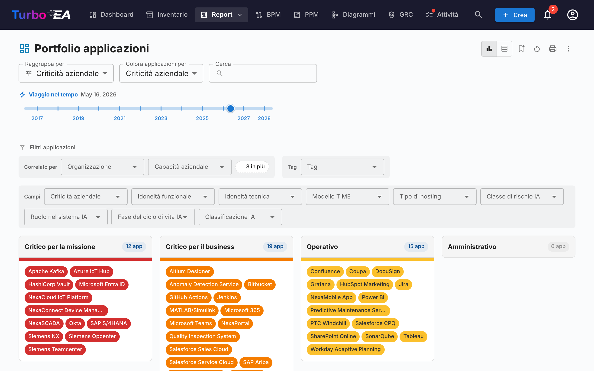
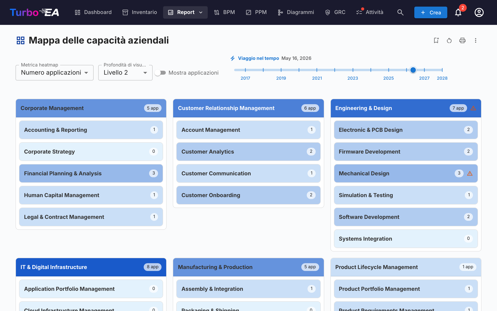
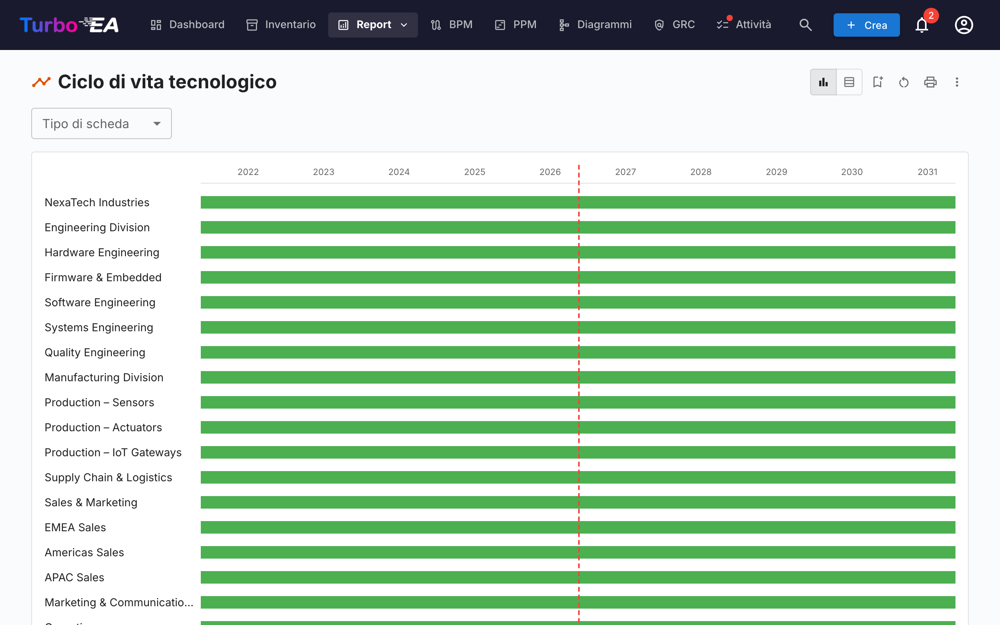
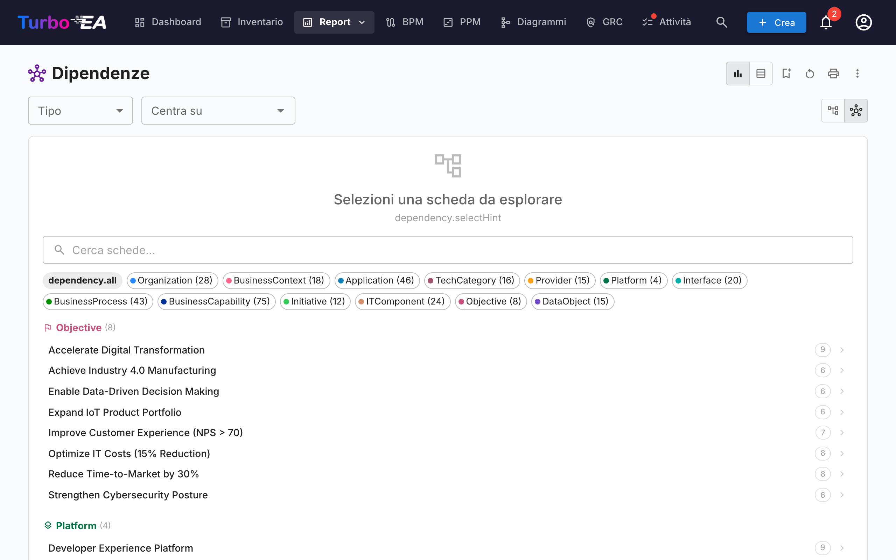
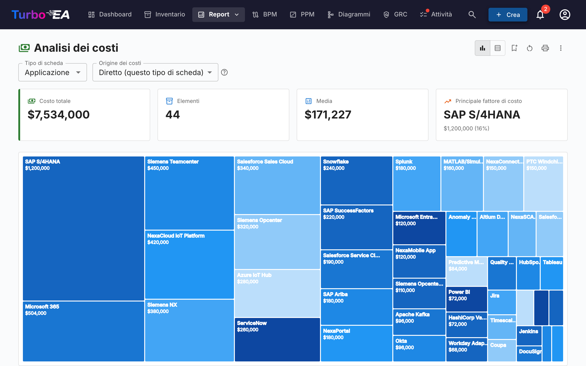
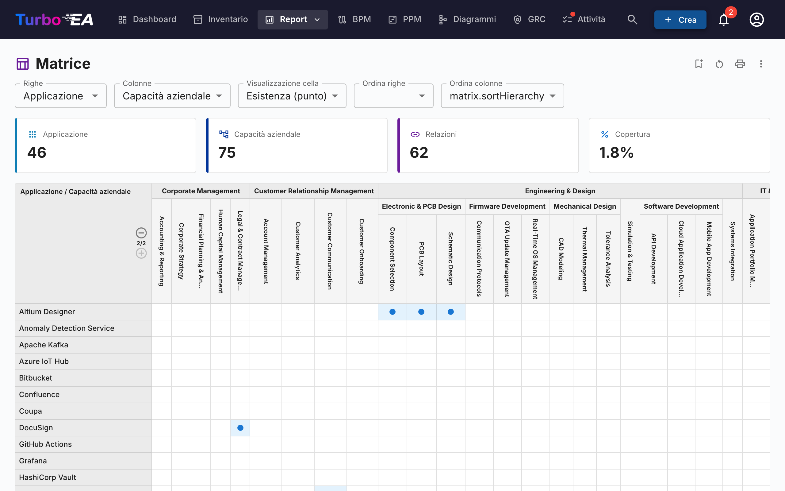
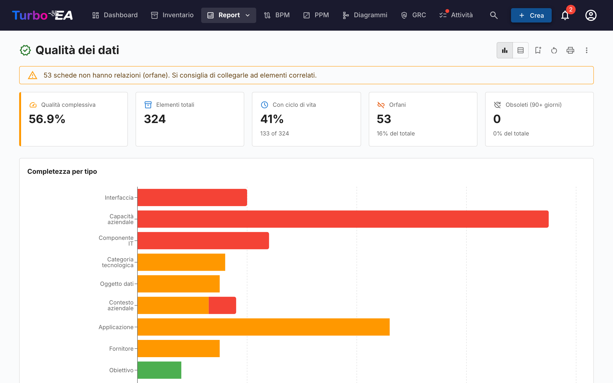
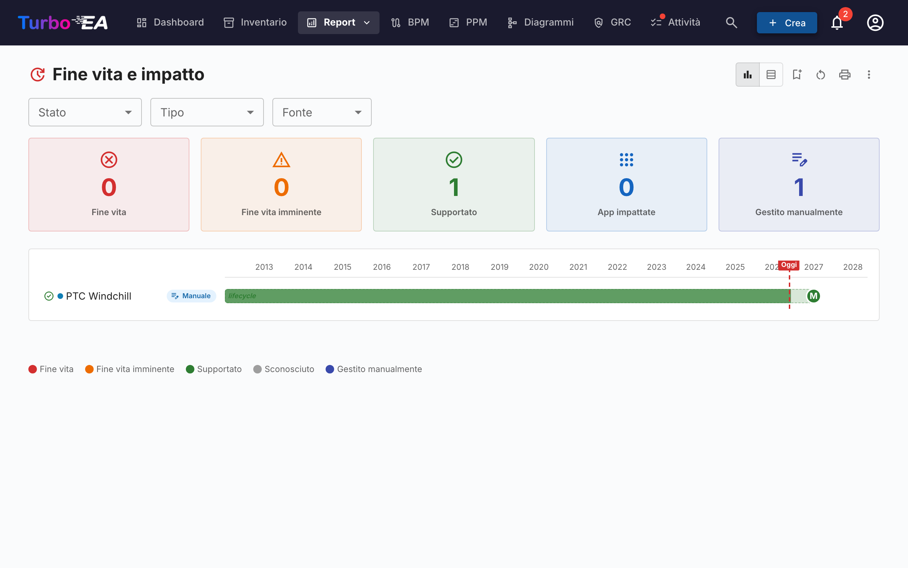
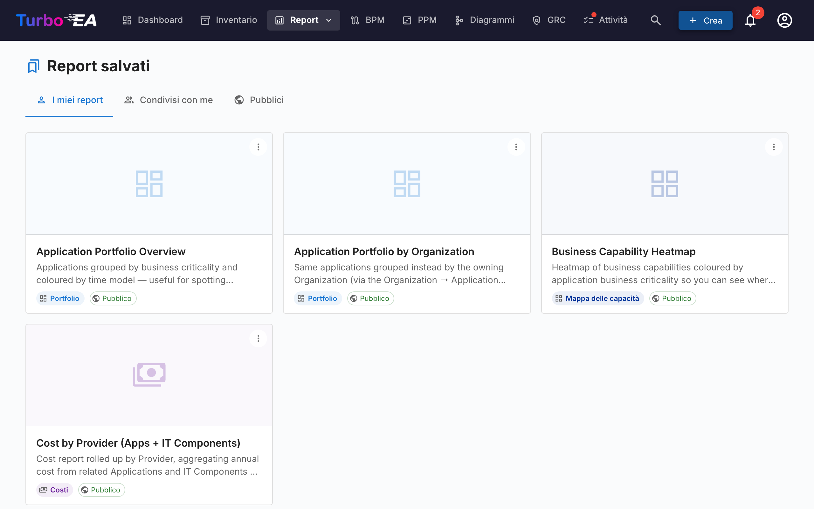

# Report

Turbo EA include un potente modulo di **reportistica visiva** che consente di analizzare l'enterprise architecture da diverse prospettive. Tutti i report possono essere [salvati per il riutilizzo](saved-reports.md) con la configurazione attuale di filtri e assi.

## Report Portfolio

Il **Report Portfolio** mostra un **grafico a bolle** (o scatter plot) configurabile delle vostre card. Scegliete cosa rappresenta ogni asse:

- **Asse X** — Selezionate qualsiasi campo numerico o di selezione (es. Idoneità Tecnica)
- **Asse Y** — Selezionate qualsiasi campo numerico o di selezione (es. Criticità Aziendale)
- **Dimensione bolla** — Mappate su un campo numerico (es. Costo Annuale)
- **Colore bolla** — Mappate su un campo di selezione o stato del ciclo di vita

Questo è ideale per l'analisi del portfolio — ad esempio, posizionare le applicazioni per valore aziendale vs. idoneità tecnica per identificare candidati per investimento, sostituzione o ritiro.

### Analisi IA del portafoglio

Quando l'IA è configurata e le analisi del portafoglio sono abilitate da un amministratore, il report del portafoglio mostra un pulsante **Analisi IA**. Cliccandolo viene inviato un riepilogo della vista corrente al provider IA, che restituisce analisi strategiche su rischi di concentrazione, opportunità di modernizzazione, problematiche del ciclo di vita e bilanciamento del portafoglio. Il pannello delle analisi è comprimibile e può essere rigenerato dopo aver modificato filtri o raggruppamenti.

## Mappa delle Capability

La **Mappa delle Capability** mostra una **mappa di calore** gerarchica delle business capability dell'organizzazione. Ogni blocco rappresenta una capability, con:

- **Gerarchia** — Le capability principali contengono le loro sotto-capability
- **Colorazione a mappa di calore** — I blocchi sono colorati in base a una metrica selezionata (es. numero di applicazioni di supporto, qualità media dei dati o livello di rischio)
- **Cliccate per esplorare** — Cliccate su qualsiasi capability per approfondire i dettagli e le applicazioni di supporto

## Report Ciclo di vita

Il **Report Ciclo di vita** mostra una **visualizzazione temporale** di quando i componenti tecnologici sono stati introdotti e quando è previsto il loro ritiro. Fondamentale per:

- **Pianificazione del ritiro** — Vedete quali componenti si avvicinano alla fine del ciclo di vita
- **Pianificazione degli investimenti** — Identificate le lacune dove serve nuova tecnologia
- **Coordinamento delle migrazioni** — Visualizzate i periodi sovrapposti di phase-in e phase-out

I componenti sono visualizzati come barre orizzontali che attraversano le fasi del ciclo di vita: Plan, Phase In, Active, Phase Out e End of Life.

## Report Dipendenze

Il **Report Dipendenze** visualizza le **connessioni tra componenti** come un grafo a rete. I nodi rappresentano le card e gli archi rappresentano le relazioni. Funzionalità:

- **Controllo della profondità** — Limitate quanti salti dal nodo centrale visualizzare (limitazione della profondità BFS)
- **Filtro per tipo** — Mostrate solo specifici tipi di card e tipi di relazione
- **Esplorazione interattiva** — Cliccate su qualsiasi nodo per ricentrare il grafo su quella card
- **Analisi dell'impatto** — Comprendete il raggio d'azione delle modifiche a un componente specifico

### Vista Diagramma C4

Passate alla vista **Diagramma C4** usando i pulsanti di modalità di visualizzazione nella barra degli strumenti. Questa mostra gli stessi dati di dipendenza utilizzando la notazione C4:

- **Riquadri di confine** — Le card sono raggruppate per livello architetturale (Strategia, Business, Applicazione, Tecnico) all'interno di rettangoli di confine tratteggiati
- **Canvas interattivo** — Spostate, zoomate e usate la minimappa per navigare diagrammi di grandi dimensioni
- **Cliccate per ispezionare** — Cliccate su qualsiasi nodo per aprire il pannello laterale di dettaglio della card
- **Nessuna card centrale richiesta** — La vista C4 mostra tutte le card che corrispondono al filtro di tipo corrente

## Report Costi

Il **Report Costi** fornisce un'analisi finanziaria del vostro panorama tecnologico:

- **Vista treemap** — Rettangoli annidati dimensionati per costo, con raggruppamento opzionale (es. per organizzazione o capability)
- **Vista grafico a barre** — Confronto dei costi tra componenti
- **Aggregazione** — I costi possono essere sommati dalle card correlate utilizzando campi calcolati

## Report Matrice

Il **Report Matrice** crea una **griglia di riferimento incrociato** tra due tipi di card. Ad esempio:

- **Righe** — Application
- **Colonne** — Business Capability
- **Celle** — Indicano se esiste una relazione (e quante)

Questo è utile per identificare lacune di copertura (capability senza applicazioni di supporto) o ridondanze (capability supportate da troppe applicazioni).

## Report Qualità dei Dati

Il **Report Qualità dei Dati** è una **dashboard di completezza** che mostra quanto bene i vostri dati architetturali sono compilati. Basato sui pesi dei campi configurati nel metamodello:

- **Punteggio complessivo** — Qualità media dei dati su tutte le card
- **Per tipo** — Dettaglio che mostra quali tipi di card hanno la migliore/peggiore completezza
- **Card individuali** — Elenco delle card con la qualità dei dati più bassa, prioritizzate per il miglioramento

## Report End of Life (EOL)

Il **Report EOL** mostra lo stato di supporto dei prodotti tecnologici collegati tramite la funzionalità [Amministrazione EOL](../admin/eol.md):

- **Distribuzione degli stati** — Quanti prodotti sono Supportati, In avvicinamento a EOL o End of Life
- **Timeline** — Quando i prodotti perderanno il supporto
- **Prioritizzazione del rischio** — Concentratevi sui componenti mission-critical in avvicinamento a EOL

## Report salvati

Salvate qualsiasi configurazione di report per un accesso rapido successivo. I report salvati includono un'anteprima in miniatura e possono essere condivisi nell'organizzazione.

## Mappa dei processi

La **Mappa dei processi** visualizza il panorama dei processi aziendali dell'organizzazione come una mappa strutturata, mostrando le categorie di processo (Gestione, Core, Supporto) e le loro relazioni gerarchiche.
