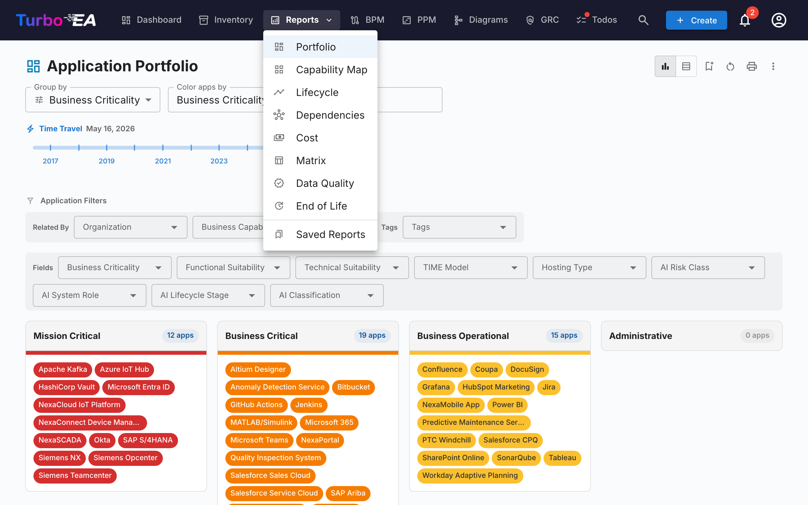
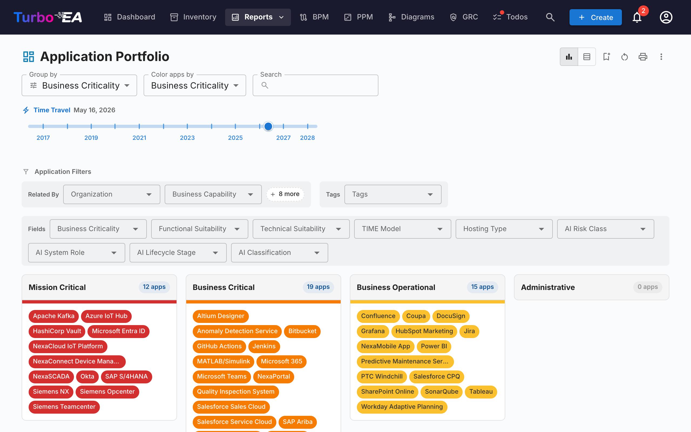
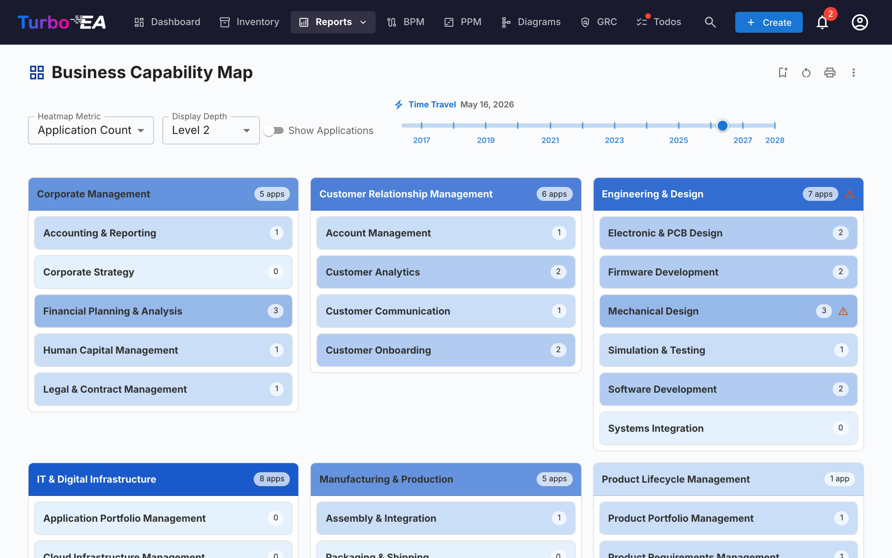
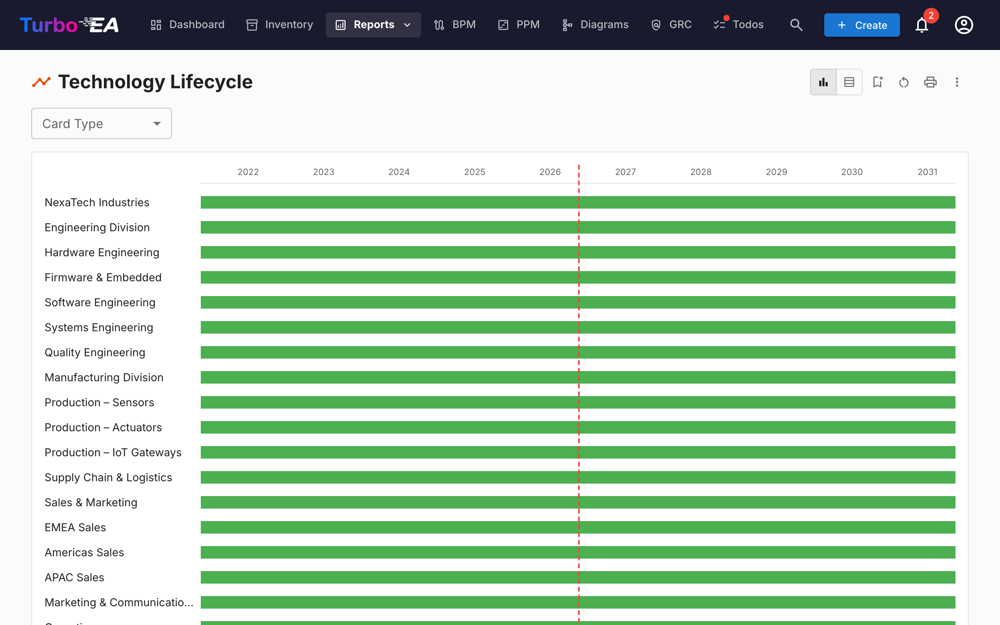
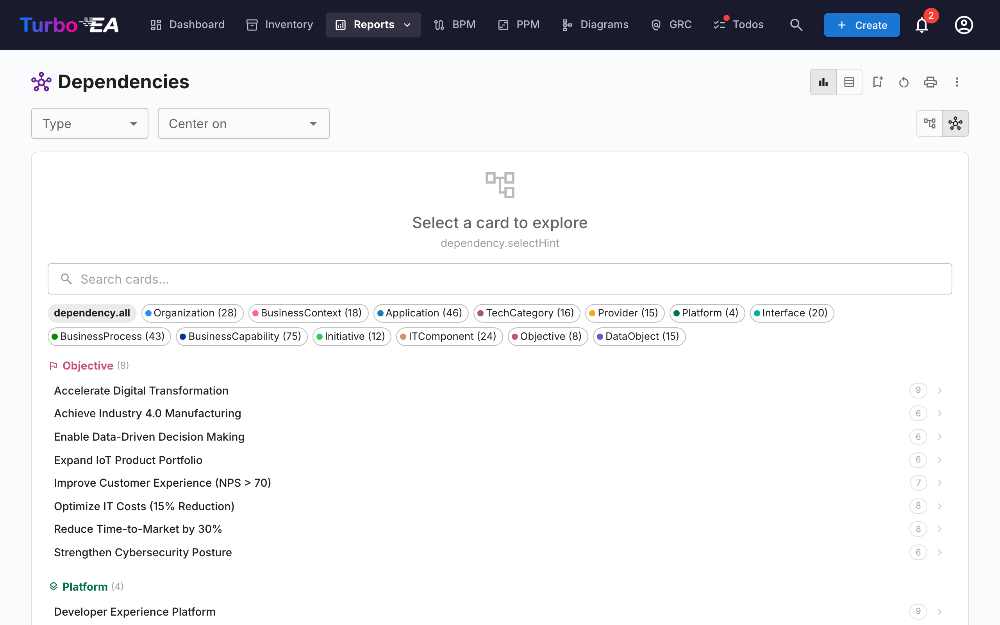
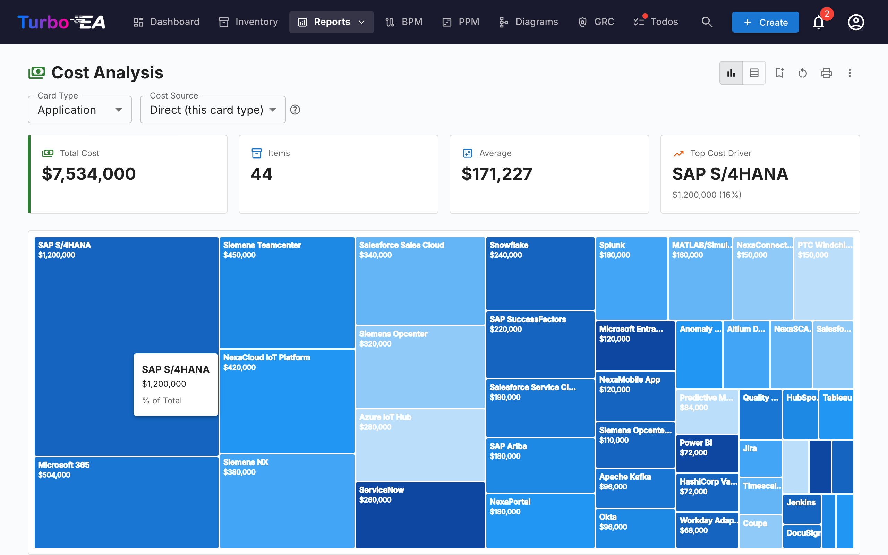
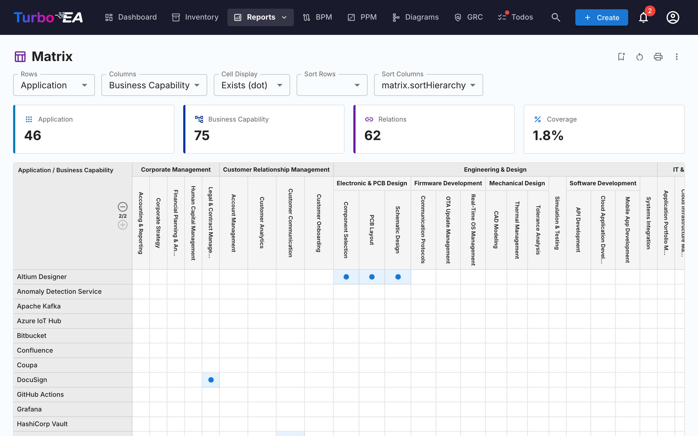
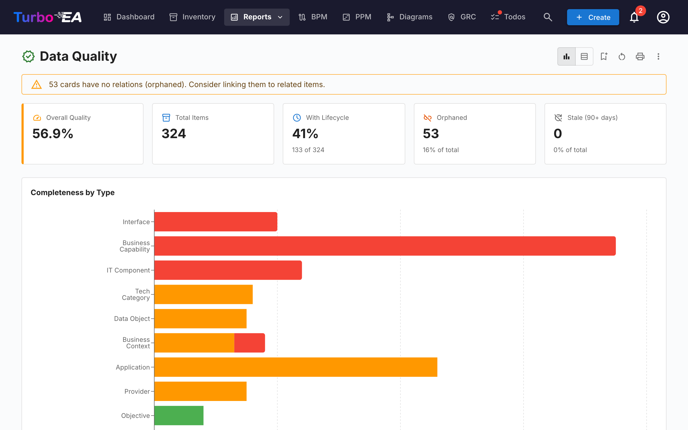
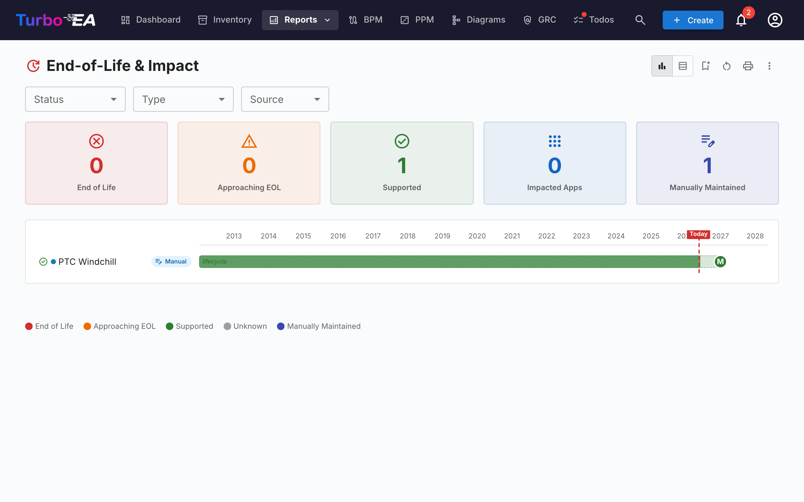
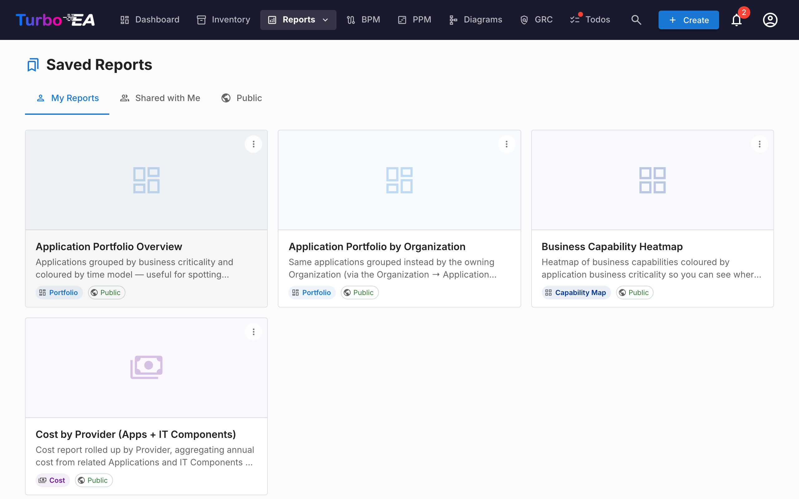

# Reports

Turbo EA includes a powerful **visual reporting** module that allows analyzing the enterprise architecture from different perspectives. Reports are designed to facilitate **decision-making** by executives.

## Portfolio Report

The **Portfolio Report** provides an **overview of all architecture components** grouped by type. It is ideal for evaluating the size of the technology portfolio, identifying areas of concentration, comparing categories, and filtering by different criteria.

## Capability Map

The **Capability Map** shows a hierarchical view of the organization's **business capabilities**. Each block represents a business capability, colors may indicate the maturity level or status, and the hierarchy shows main capabilities and their sub-capabilities.

## Lifecycle

The **Lifecycle Report** shows the temporal state of technology components. It is critical for retirement planning, obsolescence management, and budget planning. States: **Active**, **In Development**, **Phasing Out**, **Retired**.

## Dependencies

The **Dependencies Report** visualizes **connections between components**. Fundamental for impact analysis, identifying critical points, planning migrations, and reducing risks.

## Cost Report

The **Cost Report** analyzes **licensing, maintenance, and operation costs** across the architecture. View cost distribution by type, category, or organizational unit with treemap and bar chart visualizations.

## Matrix Report

The **Matrix Report** provides a **cross-reference grid** comparing two dimensions of the architecture. Useful for identifying coverage gaps, redundancies, and relationships between different architecture layers.

## Data Quality

The **Data Quality Report** shows which cards have **incomplete information**, helping identify gaps in documentation and prioritize data entry efforts.

## End of Life (EOL)

The **End of Life (EOL) Report** tracks **end-of-support dates** for technology products, helping plan migrations and avoid unsupported components.

## Saved Reports

Save any report configuration for quick access later. Saved reports include a thumbnail preview and can be shared across the organization.

## Other Reports

- **Process Map**: Visualization of the business process chain
