# Reports

Turbo EA includes a powerful **visual reporting** module that allows analyzing the enterprise architecture from different perspectives. All reports can be [saved for reuse](saved-reports.md) with their current filter and axis configuration.

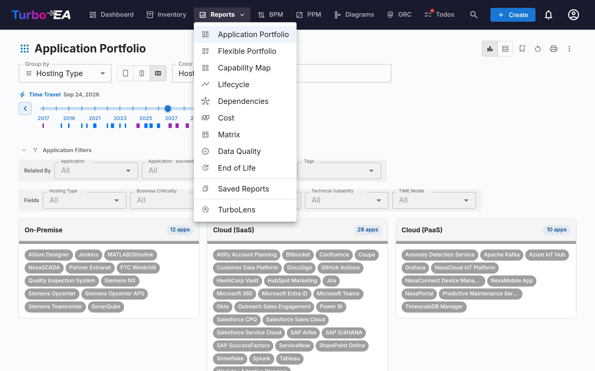

## Portfolio Report

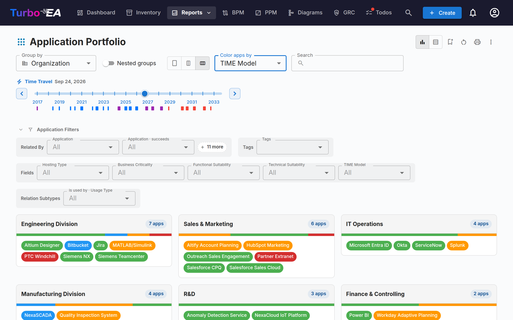

The **Portfolio Report** displays a configurable **bubble chart** (or scatter plot) of your cards. You choose what each axis represents:

- **X axis** — Select any numeric or select field (e.g., Technical Suitability)
- **Y axis** — Select any numeric or select field (e.g., Business Criticality)
- **Bubble size** — Map to a numeric field (e.g., Annual Cost)
- **Bubble color** — Map to a select field or lifecycle state

This is ideal for portfolio analysis — plotting applications by business value vs. technical fitness, for example, to identify candidates for investment, replacement, or retirement.

### AI Portfolio Insights

When AI is configured and portfolio insights are enabled by an admin, the portfolio report shows an **AI Insights** button. Clicking it sends a summary of your current view to the AI provider, which returns strategic insights about concentration risks, modernisation opportunities, lifecycle concerns, and portfolio balance. The insights panel is collapsible and can be regenerated after changing filters or grouping.

### From report to inventory

Clicking a group opens a drawer listing that group's cards. Its **View in inventory** button opens the Inventory on that exact slice. When the report is grouped by one of the card type's own fields, the inventory arrives grouped by the same field with the clicked group expanded and every other group collapsed (counts stay visible), and the report's search, attribute, relation and tag filters are carried over — ready for a select-all and [mass edit](inventory.md#mass-edit). When grouping by a related card type (such as Organization), the inventory instead arrives filtered to that related card. The button is hidden while *Nested groups* is active: a rolled-up subtree has no single inventory filter.

### Collapsing the filters

The **Filters** row folds away: click its header to hide the filter controls and give the chart the vertical space back. The setting is remembered with the rest of the report's configuration, so a report reopens the way you left it. While collapsed the header still shows how many filters are active, and **Clear all** stays reachable — a folded section never hides the fact that the data is filtered.

### Time travel

The timeline slider carries the same transition instruments as the [Dependencies Report](#dependencies-report): marks on every date an application goes live (blue) or retires (red), pills naming the changing applications while the slider stands on a mark, arrow buttons that step from change to change, and chips summarising the transformation while you look forward ("+4 arriving · −7 retiring" — also included in print and export headers). Clicking a mark or a pill spotlights the applications that change there — the rest of the view dims while they pulse, and an application already gone at the selected date is revealed just for the pulse, then hidden again.

## Flexible Portfolio

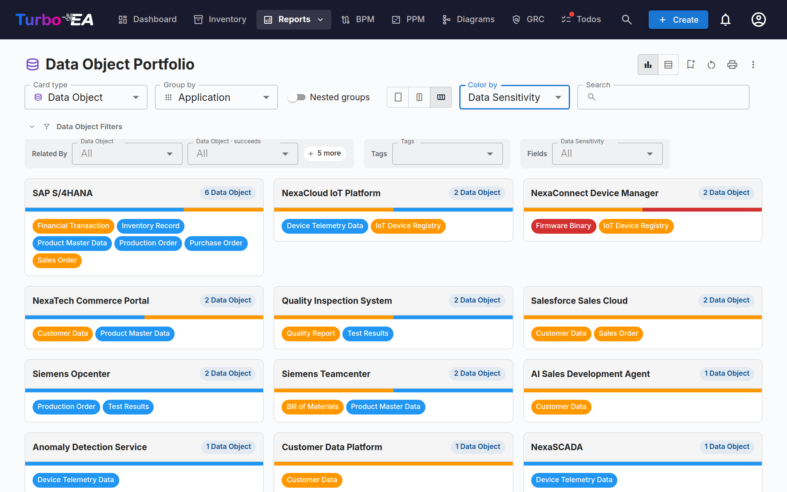

The **Flexible Portfolio** uses the same controls as the Application Portfolio but adds a **Card type** picker at the top of the toolbar. Use it to analyse a portfolio of Business Capabilities, Initiatives, IT Components, or any other visible card type with the same grouping, colouring, and filter experience.

The screenshot above shows a typical use case: pick **Data Object** as the card type, **Group by → Application** to see which apps own which data, and **Color by → Data Sensitivity** to surface where confidential data lives at a glance.

Switching the card type clears the group-by, colour-by, and filter selections (they reference field keys that don't exist on the new type) and the report re-loads with the fields, relations, and tags applicable to the chosen type. The report shares the same permission as the Application Portfolio (`reports.portfolio`) and saves independently of it.

### Relation subtypes

When a card's relations carry a "type" value — for example the **Usage Type** (Owner / User / Stakeholder) on Organization→Application relations, or the **Support Type** on Application→Business Capability relations — you can colour the cards by that value and filter on it. **Group the report by the related card type** to use them (e.g. *Group by → Organization* to unlock *Usage Type*): the subtype then appears under a **Relation Subtypes** group in the *Color by* dropdown and as its own filter row. Because each card is shown under one related card, it is coloured by *that* relation — an application that is a *User* of one organisation shows as User there, even if it is owned by another.

### Nested groups

When grouping by a related card type that supports hierarchy (such as Business Capability or Organization), a **Nested groups** toggle appears next to the *Group by* selector. Enable it to render the groups as boxes within boxes following the related type's parent/child hierarchy — like the Capability Map. A **Display Depth** selector controls how many levels are expanded: each card appears under its deepest visible group, and groups below the depth limit roll their cards up into the closest visible ancestor. Branches that contain no cards are hidden.

### Choosing the column count

The card grid in the **Portfolio**, **Flexible Portfolio**, **Capability Map** and **Process Map** reports has a **column picker** in the toolbar — three buttons for one, two or three columns. Pick fewer columns when the cards are dense and you want them wide enough to read; pick three to see more of the landscape at once. The choice is remembered per report, travels with a [saved report](saved-reports.md), and is used when you print or export. Narrow screens still fall back to one or two columns on their own. The choice cascades downward: each level below the first gets one column fewer, so picking one column puts level 2 three across and level 3 two across, while picking three keeps everything below it stacked full width. A level still folds down to fewer columns when a card is genuinely too narrow for them.

## Capability Map

Clicking a capability opens a side panel listing every application in its subtree. On a bottom-level capability the panel offers **View in inventory**, which lands on the applications linked to it.

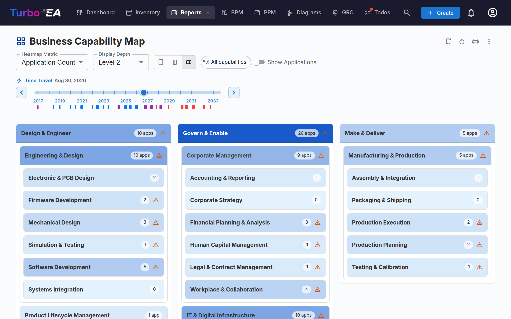

The **Capability Map** shows a hierarchical **heatmap** of the organization's business capabilities. Each block represents a capability, with:

- **Hierarchy** — Main capabilities contain their sub-capabilities
- **Heatmap coloring** — Blocks are colored based on a selected metric (e.g., number of supporting applications, average data quality, or risk level)
- **Click to explore** — Click any capability to drill down into its details and supporting applications

**Scoping to specific capabilities** — By default the map draws every capability. Use the capability chip in the toolbar to open a picker and select one or more capabilities; the map then shows only those and everything beneath them. Sub-capabilities are included automatically, so picking a top-level capability gives you its whole branch. **Display Depth** counts from the capabilities you selected, so *Level 2* always means two tiers below what you are looking at. The scope is stored with the report, so a saved report reopens on the same branch.

**Time travel** — The timeline slider carries the same transition instruments as the [Dependencies Report](#dependencies-report): marks on every date an application goes live (blue) or retires (red), pills naming the changing applications while the slider stands on a mark, arrow buttons that step from change to change, and chips summarising the transformation while you look forward (also included in print and export headers). Clicking a mark or a pill spotlights the change: with **Show Applications** on, the changing application chips pulse while the rest dim, and an application already gone at the selected date is revealed just for the pulse; with it off, the spotlight falls on the capability boxes containing the changing applications — blue where they only arrive, red where they only retire, purple where both happen.

**Collapsing the filters** — The **Application Filters** row folds away; click its header to reclaim the space. The state is saved with the report, the active-filter count stays visible on the collapsed header, and **Clear all** remains reachable without expanding first.

## Lifecycle Report

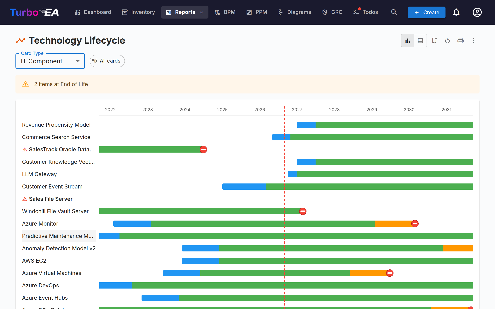

The **Lifecycle Report** shows a **timeline visualization** of when technology components were introduced and when they are planned to be retired. Critical for:

- **Retirement planning** — See which components are approaching end-of-life
- **Investment planning** — Identify gaps where new technology is needed
- **Migration coordination** — Visualize overlapping phase-in and phase-out periods

Components are displayed as horizontal bars spanning their lifecycle phases: Plan, Phase In, Active, Phase Out, and End of Life.

**Scoping to specific cards** — Once you have picked a card type, the chip beside it opens a picker: select one or more cards and the timeline shows only those and everything beneath them in the hierarchy. Sub-cards are included automatically. The chip stays disabled while the type selector is on *All types*, because a scope needs one hierarchy to work from.

## Dependencies Report

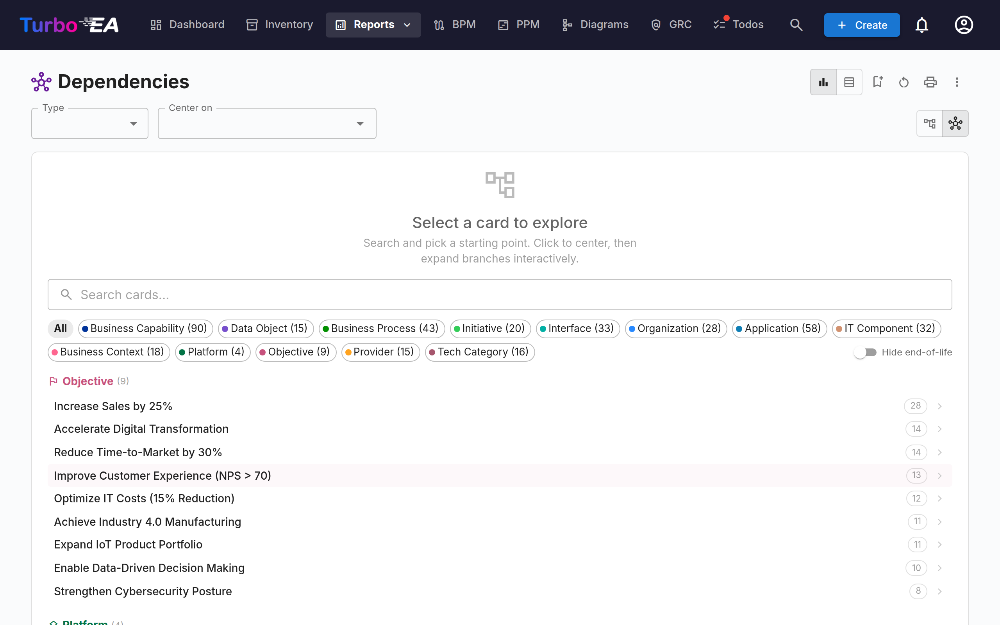

The **Dependencies Report** visualizes **connections between components** as a network graph. Nodes represent cards and edges represent relations. Features:

- **Depth control** — Limit how many hops from the center node to display (BFS depth limiting)
- **Type filtering** — Show only specific card types and relation types
- **Interactive exploration** — Click any node to recenter the graph on that card
- **Impact analysis** — Understand the blast radius of changes to a specific component
- **Time travel** — Once you have centred on a card (or switched to the table view), drag the timeline slider to see the landscape as it stands on any date. Cards that have not gone live yet are hidden — a card enters the landscape on its **Active** date, so one whose Active date is still ahead, or that has none at all, stays out of the default view. Cards that **arrive** between today and a future date are simply part of the landscape there — they carry a purple outline and no badge, because time travel shows the state as it will be. **Retired** cards stay on the diagram — faded and badged *RETIRED* — at any date after their retirement, so a transformation shows what it removes as well as what it leaves. The **Persist retired cards** switch in the toolbar hides them to show only the cards alive on the selected date. Its mirror, **Preview planned cards**, shows cards that have not started yet — ghosted and badged *UPCOMING* — at any date before their start, so even a past or present view can preview what is coming. The timeline is marked with every date on which cards on the displayed diagram go live (blue) or retire (red); click a mark to jump the slider to that change and spotlight the cards involved — the canvas dims for a moment while they pulse in the mark's colour, and a retiring card hidden by **Persist retired cards** is revealed just for the pulse, then hidden again. You can also step from change to change with the arrows beside the slider — each step spotlights the cards at that change exactly as clicking its mark does. While the slider stands on a mark, the cards it counts are named as pills below the marks, grouped behind a **+** for the ones going live and a **−** for the ones retiring — each pill carries its card type's colour, and clicking one spotlights just that card. Each mark is blue where cards only go live, red where they only retire and purple where it does both. Where changes fall close together the timeline merges them into one mark, drawn wider and labelled with the range it covers; a card that goes live and retires inside that range is named on both sides. The arrows treat a merged mark as a single stop, so one press moves clear of everything it covers rather than stepping through the dates behind it. Standing on a merged mark shows the landscape as of the **end** of its range — everything it covers has happened — and the date beside the slider names that range rather than a single day. While looking forward, chips above the slider summarise the transformation (+4 arriving · −7 retiring). Relations into retired cards render as dashed red — the dependencies the transformation severs — and while you stand on a mark, the cards retiring there stay on the diagram — ghosted and badged *RETIRED* — even with **Persist retired cards** off. The cards that stay put are marked where their connections change: a red broken-link icon where a neighbour retires here, a blue one where a neighbour goes live here, and both when both happen. The mark carries them: step away and they clear, so a single retirement no longer marks its neighbours at every later date. The slider applies to every view, and the date is saved with the report.

The card you centre on decides how much you see, so the picker lists each type's best-connected cards first. A capability is usually the most revealing choice: it is the only card type that reaches the objectives above it and the applications below it in a single hop. The picker lists **every card in the inventory** — archived cards aside — whatever date the timeline is standing on: it is where you choose what to look at, and the slider is hidden at this stage, so a card that has already retired, or that has not gone live yet, is still yours to centre on. Cards that have reached **End of Life as of today** (not as of the timeline date) carry a *RETIRED* badge with their end-of-life date; the **Hide end-of-life** switch beside the type chips filters them out.

### Layered Dependency View

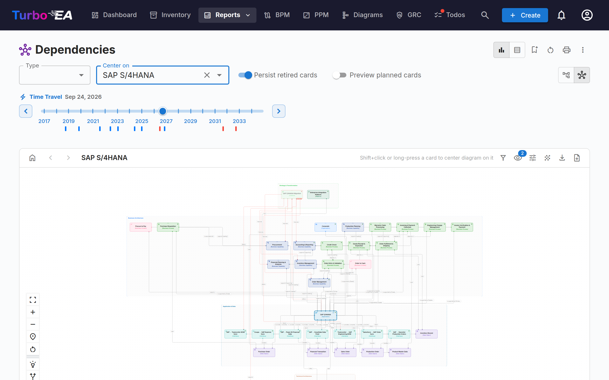

Toggle to the **Layered Dependency View** using the view-mode buttons in the toolbar. This is Turbo EA's house notation for showing dependencies between cards across the four EA layers — inspired by ArchiMate's layering and the C4 Model's "good defaults" philosophy, but distinct from both. The same view is reused on the Card Detail page (showing the card's immediate dependency neighbourhood) and in the [TurboLens Architect](turbolens.md#architecture-ai) wizard, so dependencies look the same everywhere.

**Reading the diagram**

- **Layered swim lanes** — Cards are grouped by architectural layer (Strategy & Transformation, Business Architecture, Application & Data, Technical Architecture) inside dashed boundary rectangles, in fixed order.
- **Type-coloured nodes with icons** — Each node is coloured by its card type and shows the card-type icon in its top-left corner, so types are recognisable at a glance even without colour.
- **Directional labelled edges** — Edges follow the metamodel relation direction (source → target) and carry the relation's forward label (e.g. *uses*, *supports*, *runs on*). When a relation is qualified with a value (such as a Support Type of *Leading*), it appears in brackets after the label — for example *supports [Leading]*.
- **Proposed cards** — In the TurboLens Architect wizard, not-yet-committed cards have a dashed border and a green **NEW** badge.

**Exploring and navigating**

- **Pan, zoom, minimap** — Drag the canvas to pan, scroll to zoom, and use the minimap to navigate large diagrams.
- **Click to inspect** — Click any node to open the card detail side panel.
- **Recenter** — Shift+click or long-press a card to center the diagram on it; the toolbar's **Back to card picker**, **Previous card**, and **Next card** buttons step through your navigation history.
- **Highlight mode** — Hover a card to highlight its connections; on touch devices, turn on **Highlight mode** in the controls panel to tap-highlight instead.
- **Expand mode** — Turn on **Expand mode** in the controls panel, then click a card to reveal all of its relations on demand. The card the diagram is centred on carries a double border in its card type's colour, and each card you expand carries a thinner one, so your bearings stay visible as the diagram grows.
- **Reveal parent / Reveal children** — Two targeted alternatives to Expand mode. Turn on **Reveal parent** (up-arrow) or **Reveal children** (down-arrow) in the controls panel, then click a card to add just its hierarchy parent or its direct children to the diagram. Revealed cards stay on the diagram — so you can layer parents and children together — and clear when you re-center or reset the view.
- **No center card required** — On the Dependencies report the Layered Dependency View shows all cards matching the current type filter, so you don't have to pick a starting card first.

**Customising the view** (from the toolbar)

- **Show on card** — A dedicated toolbar button (the eye glyph) lists everything a card can say as **tickboxes**: the **type** label, the **subtype**, a **lifecycle-status dot**, and every **attribute field** in play, each filed under the card type it belongs to. The first two lines render on the card itself and the full set appears in the hover tooltip. A badge on the button counts what is currently shown. Choices are remembered between visits and travel with **Create diagram**: a DrawIO diagram generated from this report opens showing the same rows, picked from the same menu — all of them there, since a diagram shape grows to fit while a report node cannot. On a phone the list opens as a full-screen sheet. **Clear all** empties every tick at once.
- **Show card logos** — A card that carries its own logo shows it in the top-left corner, with the card-type icon as a small badge over it, so both what the product is and what kind of card it is stay readable. On by default; turn it off in the **View options** menu for an unadorned diagram. Cards with no logo — and every card of a type where an administrator has switched logos off — look exactly as they did before either way. Logos are included in image exports.
- **Show end-of-life cards** — Related cards that have reached End of Life **by the date shown on the timeline** are hidden by default to keep the graph focused; turn this toggle on (in the **View options** menu) to bring them back. The card you are centered on is always shown, even if it is itself end-of-life.
- **Show relationship labels** — Each relation's verb (*supports*, *uses*, …) is drawn on its line. On by default; turn it off in the **View options** menu for a cleaner canvas on a dense landscape. The lines and their arrowheads still show what connects to what, and in which direction.
- **Show relationship values** — Many relations can be qualified with a value (e.g. an application *supports* a capability as *Leading*, *Supporting* or *No Support*). When on (the default), these values appear in brackets next to the relation label (*supports [Leading]*) and are included in image exports. Turn it off in the **View options** menu for a cleaner view; relations without a value are unchanged either way.
- **Line style** — Choose how connection lines are drawn when idle: **solid**, **dotted**, **dashed** (the default) or **long dash**, from the **View options** menu. Hovering a line always draws it solid, and a dependency that is being severed keeps its own dashes, so the choice never hides what a line is telling you.
- **Rearrange** — Drag a card to move it within its layer, or drag a whole **layer box** to move it with all its cards. **Reset view** (in the left toolbar) restores the automatic arrangement and clears any exploration.
- **Background** — Cycle the canvas background between grid, dots, and none.
- **Export and fullscreen** — Export the diagram to **PNG** or **SVG**, or open it in **fullscreen**.
- **Create diagram** — Turn the current view into a new, editable diagram in the [Diagram module](diagrams.md). It recreates the cards, relationships, and the four architecture layer lanes, and every shape stays linked to its inventory card. The connection routing travels too: lines keep the bends and the attachment points the report worked out, so the diagram opens looking like the report instead of being re-routed from scratch. You're asked for a name, then taken straight to the new diagram. Available to users who can create diagrams.

## Cost Report

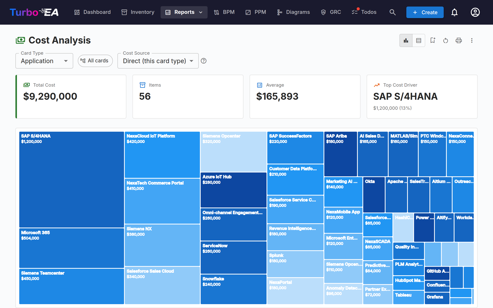

The **Cost Report** provides financial analysis of your technology landscape:

- **Treemap view** — Nested rectangles sized by cost, with optional grouping (e.g., by organization or capability)
- **Bar chart view** — Cost comparison across components
- **Card Type** — Pick which card type the report is built around (Application, IT Component, Provider, …).

### Cost Source

When the selected card type has at least one relation type pointing to a type that owns a cost field, a **Cost Source** picker appears next to **Card Type**. It lets you choose where the numbers come from:

- **Direct (this card type)** — default; sums the cost field on the displayed cards themselves. Use this when looking at *Applications* or *IT Components* directly.
- **Aggregate from related cards** — tick one or more `Type · Field` entries (for example `Application · Total Annual Cost`, `IT Component · Total Annual Cost`). Each primary card's number then becomes the sum of that field across its related cards.

The picker is **multi-select**, so a single roll-up can combine several related types in one go. For example, when viewing **Provider** for *Microsoft*, ticking both `Application · Total Annual Cost` and `IT Component · Total Annual Cost` shows the vendor's full footprint — Teams, M365, Azure, and any other Microsoft-supplied components — as one number.

#### Why nothing gets counted twice

The picker is built so that double-counting is impossible by construction:

- Each entry is a unique `(target type, cost field)` pair — the dropdown offers each pair exactly once, even when several relation types reach the same target type.
- Within a single pair, two cards linked through multiple relation types still contribute their cost only once.
- Across different entries, no card can contribute twice: a card has exactly one type, and different cost fields on the same card are independent values.

A small **help icon (?)** next to the picker repeats this guarantee on hover.

The option list is generated from your metamodel — relation types and cost fields are discovered at render time, so any custom card type or relation you add becomes a valid Cost Source automatically.

### Drill into a rectangle

Whenever at least one Cost Source is active, the treemap rectangles are **clickable**. Clicking one replaces the chart with the breakdown of that rectangle's cost — the related cards that contributed to its roll-up, sized by their direct cost. A breadcrumb appears above the chart, e.g. **All Applications › NexaCore ERP**; click any segment to walk back up.

- **Single Cost Source active** — drill renders one treemap of the related cards (e.g. clicking *NexaCore ERP* with `IT Component · Total Annual Cost` ticked shows the IT Components linked to NexaCore ERP, sized by their annual cost).
- **Multiple Cost Sources active** — drill renders **one treemap per source side-by-side** (1 column on narrow viewports, 2 on wide ones). Each panel has its own header, its own total, and its own per-panel `% of total` in the tooltip — so different card types stay on their own scale instead of being squashed into a single chart.

The timeline slider, Cost Source selection, and other filters are preserved as you drill, and the drilled level is part of the saved-report config — saving a report while drilled in re-opens directly at that level. With **no** Cost Source active, clicking a rectangle opens the card side panel instead (there's nothing to break down).

**Scoping to specific cards** — The chip beside the card-type selector opens a picker: select one or more cards and the treemap, the totals and the table all narrow to those and everything beneath them. The chip is hidden while you are drilled into a rectangle, since a drill has already moved you to a different card type; leave the drill and the scope is still there.

## Matrix Report

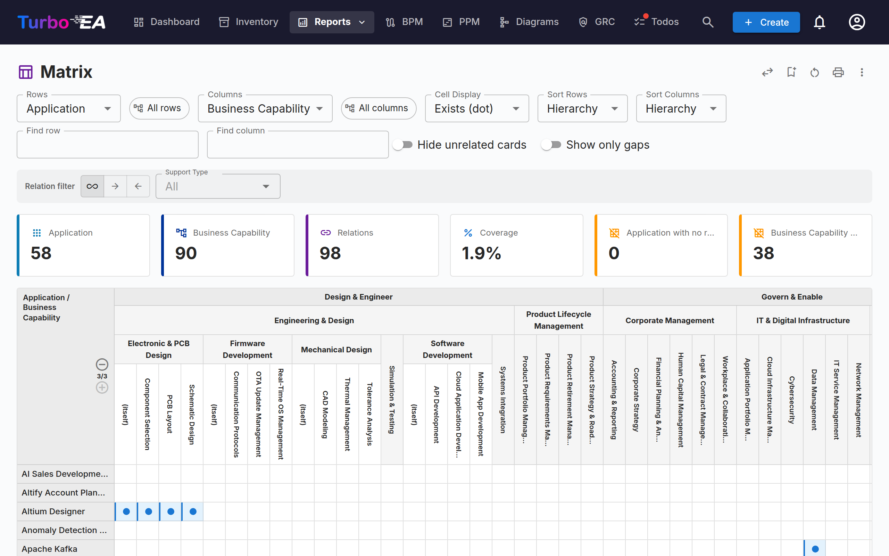

The **Matrix Report** creates a **cross-reference grid** between two card types. For example:

- **Rows** — Applications
- **Columns** — Business Capabilities
- **Cells** — Indicate whether a relation exists (and how many)

This is useful for identifying coverage gaps (capabilities with no supporting applications) or redundancies (capabilities supported by too many applications).

Use the **Hide unrelated cards** toggle to hide rows and columns for cards that have no relationships, keeping only the cards that participate in at least one relationship. The full view showing every card remains the default.

### What each cell shows

The **Cell Display** control offers four options:

- **Exists (dot)** — a dot wherever a relation exists.
- **Count (heatmap)** — how many relations there are, shaded by density.
- **Values (codes)** — one colour-coded letter per relation value, with a legend above the grid. Best for a large matrix.
- **Values (labels)** — the value names in full. The columns widen, so this suits a smaller matrix.

The letters and names come from the attributes your relation types declare, in your own language. A CRUD relation reads `C R U D`; an ownership relation reads its own values. Add a value to a relation type in the [metamodel](../admin/metamodel.md) and it shows up here with no further setup. A collapsed group cell always shows a count, because it can span many different values — expand a level to see them.

A card that has children below it in the hierarchy can also carry relations of its own. When it does, it gets a row (or column) of its own labelled **(itself)** directly under its group heading, so those relations have somewhere to appear rather than being lost between the parent and its children. Collapse the level and they are counted in the group's cell along with its children's.

### Filtering by relation

The filter bar above the grid narrows the matrix to the relations you care about:

- **Relation type** — when the two card types are connected in both directions.
- **Direction** — whether the row card is the source or the target of the relation.
- **Values** — one filter per attribute the relation types declare, including «(empty)» for relations where the value was never set.

Filtering empties the cells of the cards that no longer match, so switching on **Hide non-matching cards** leaves only the cards that do. Some examples:

- Application × Data Object, filtered to *Create* — which applications are the system of record for each data object.
- Application × Interface, filtered by direction — who publishes an interface and who consumes it.
- Organization × Application, filtered to *Owner* — the ownership map, without the users cluttering it.

### Finding coverage gaps

Two tiles count the cards on each axis that have no relation at all. **Show only gaps** reduces the grid to exactly those — the capabilities nobody supports, the data objects nobody maintains.

### Finding your way around a large matrix

**Find row** and **Find column** filter the axes by name; a parent stays visible when one of its children matches. The swap button in the title bar exchanges the two axes.

### Exporting

Excel export produces two sheets: the grid as it appears on screen, and one row per relation with its values spread across columns — the sheet to pivot on. PowerPoint export captures the picture.

**Scoping each axis** — Each axis carries its own chip beside its type selector, so you can ask for *these capabilities × these applications*. Select one or more cards and that axis shows only those and everything beneath them. The KPI cards above the grid follow the scope, so the counts always describe what you are looking at. Changing an axis's card type clears that axis's scope; transposing the grid swaps the two scopes along with the axes.

## Data Quality Report

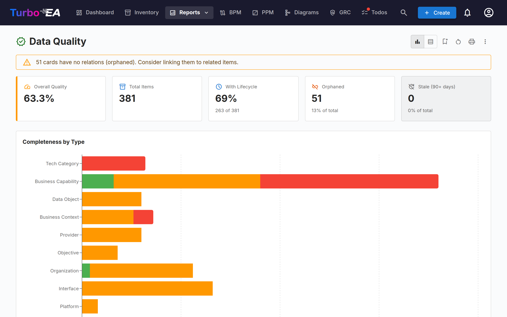

The **Data Quality Report** is a **completeness dashboard** that shows how well your architecture data is filled in. Based on the importance weights configured in each card type's **Data quality** tab (each field plus the built-in Description, Lifecycle, mandatory Relations and mandatory Tags factors):

- **Overall score** — Average data quality across all cards
- **By type** — Breakdown showing which card types have the best/worst completeness
- **Individual cards** — List of cards with the lowest data quality, prioritized for improvement

Cards with an empty **mandatory field** always score **0%** — the weighted calculation only resumes once every required field is filled — so the lowest-scoring list surfaces exactly the cards whose required data is still missing.

### Drilling into a number

Every figure on the report is a way in, not just a readout:

- **Click a bar segment** in *Completeness by Type* — a panel opens on the right listing the cards of that type in that band (Complete, Partial or Minimal).
- **Click a bar** in *Average Completion by Type*, or a row in the table view, to list every card of that type.
- **Click the Orphaned or Stale tile** to list the cards behind that count.

From the panel, click any card to open its detail side panel, or press **View in inventory** to continue in the [Inventory](inventory.md) — which arrives grouped by data quality with the band you clicked expanded and the others collapsed beside it, so you can start fixing records straight away. The Orphaned and Stale panels link into the inventory's matching filter, across every card type.

## End of Life (EOL) Report

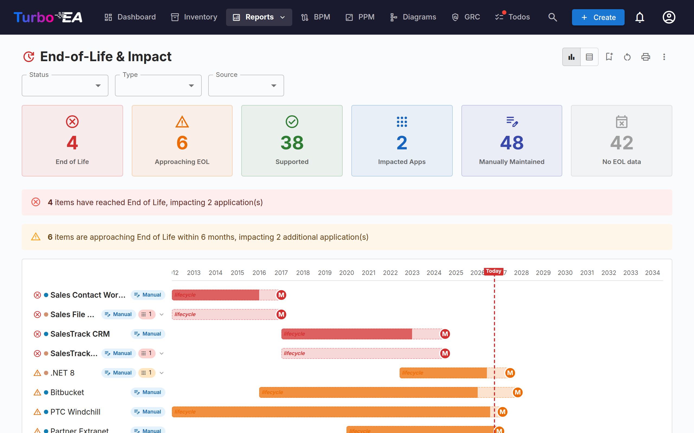

The **EOL Report** shows the support status of technology products linked via the [EOL Administration](../admin/eol.md) feature:

- **Status distribution** — How many products are Supported, Approaching EOL, or End of Life
- **Timeline** — When products will lose support
- **Risk prioritization** — Focus on mission-critical components approaching EOL

## Saved Reports

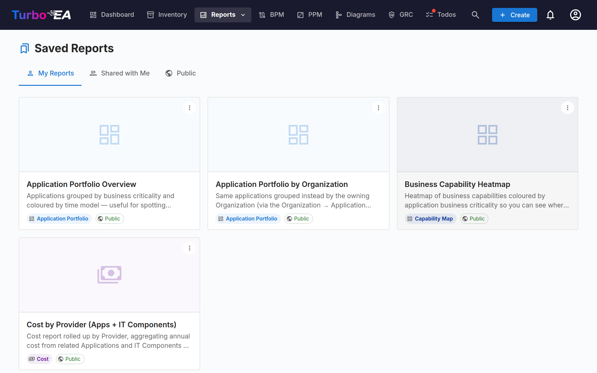

Save any report configuration for quick access later. Saved reports include a thumbnail preview and can be shared across the organization.

## Exporting Reports

Every report supports **Export to Excel (.xlsx)** and **Export to PowerPoint (.pptx)** from the **⋮** menu in the title bar (alongside Print and Copy link).

- **Excel** — Produces one sheet per data table currently rendered, with auto-sized columns and currency / number formatting preserved. Switch to the **Table view** before exporting to capture the underlying rows.
- **PowerPoint** — Generates a deck whose first slide combines the report title, generation timestamp, active filter summary, and the live chart at presentation quality. Subsequent slides paginate the data tables for share-ready handouts.

Active filters and grouping options applied at the moment of export are recorded on the title slide / header row, so exports stay self-explanatory.

## Process Map

The **Process Map** visualizes the organization's business process landscape as a structured map, showing process categories (Management, Core, Support) and their hierarchical relationships.

**Scoping to specific processes** — The chip beside *Display Depth* opens a picker: select one or more processes and the map shows only those and everything beneath them. Sub-processes are included automatically, and **Display Depth** counts from what you selected. Clicking into a process to zoom still works, and now works within the scope. Note this is a different control from the **Scope** row below, which filters by related Organization or Business Context.
