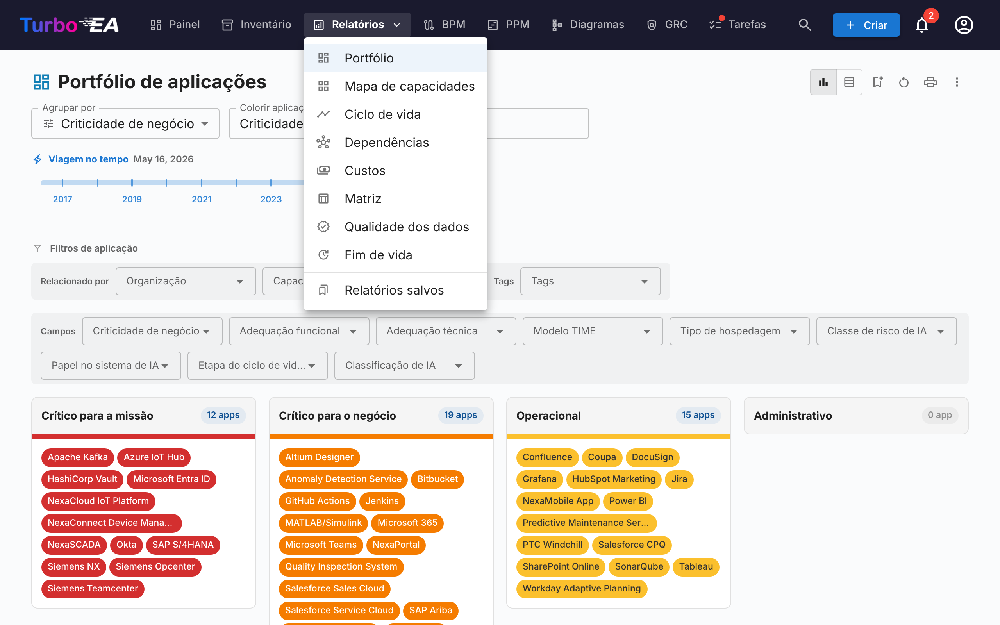
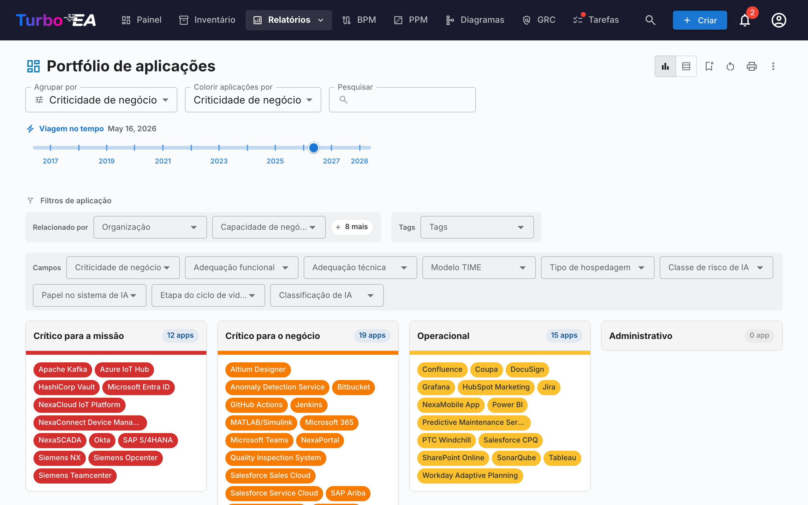
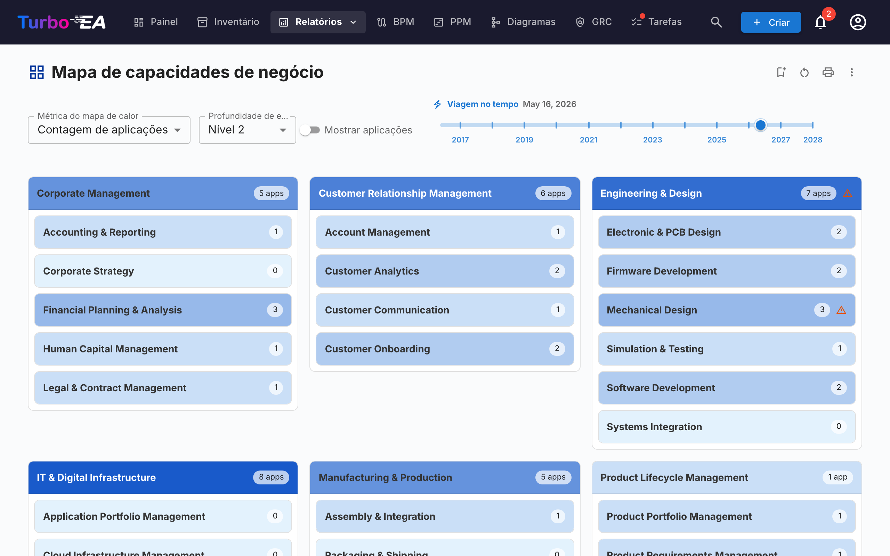
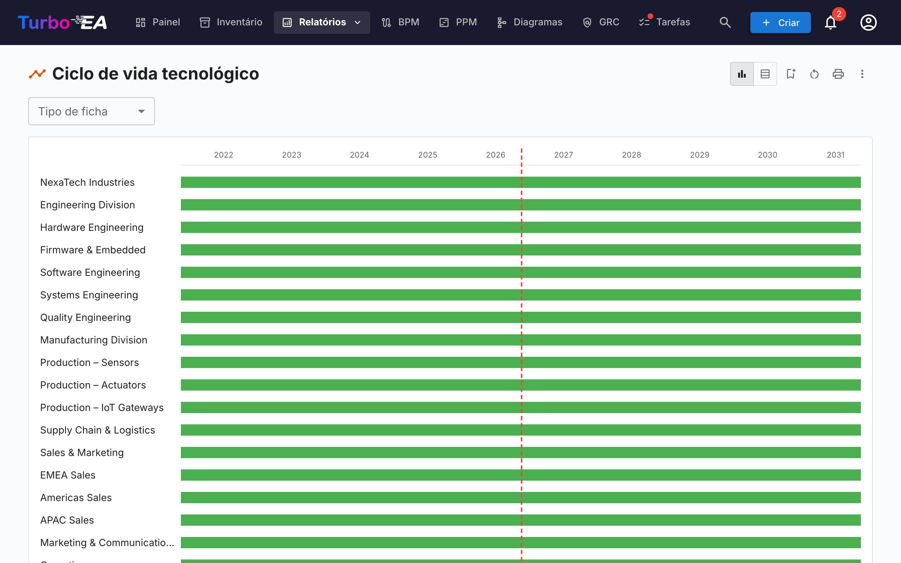
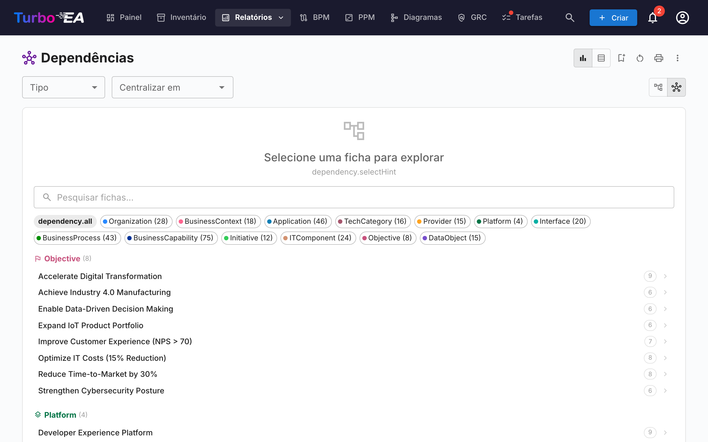
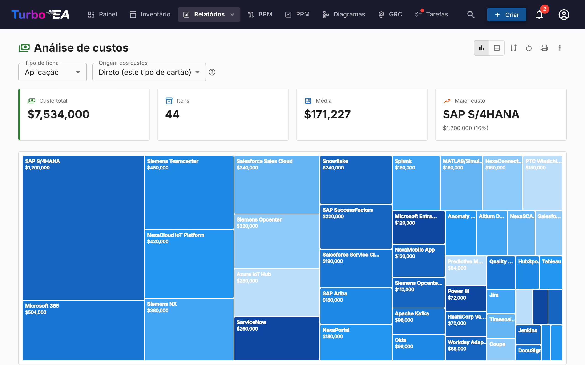
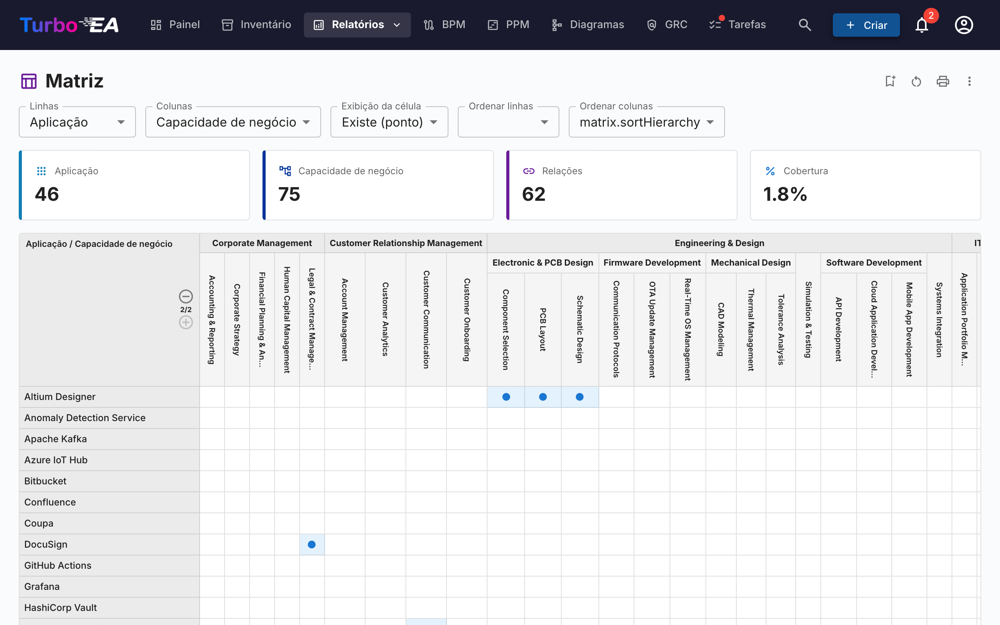
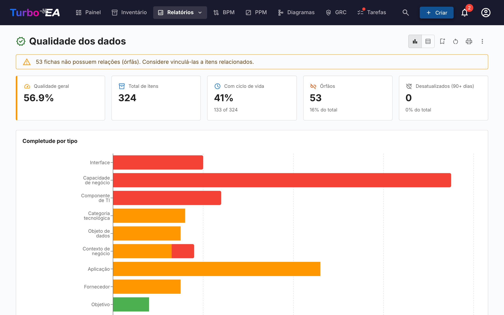
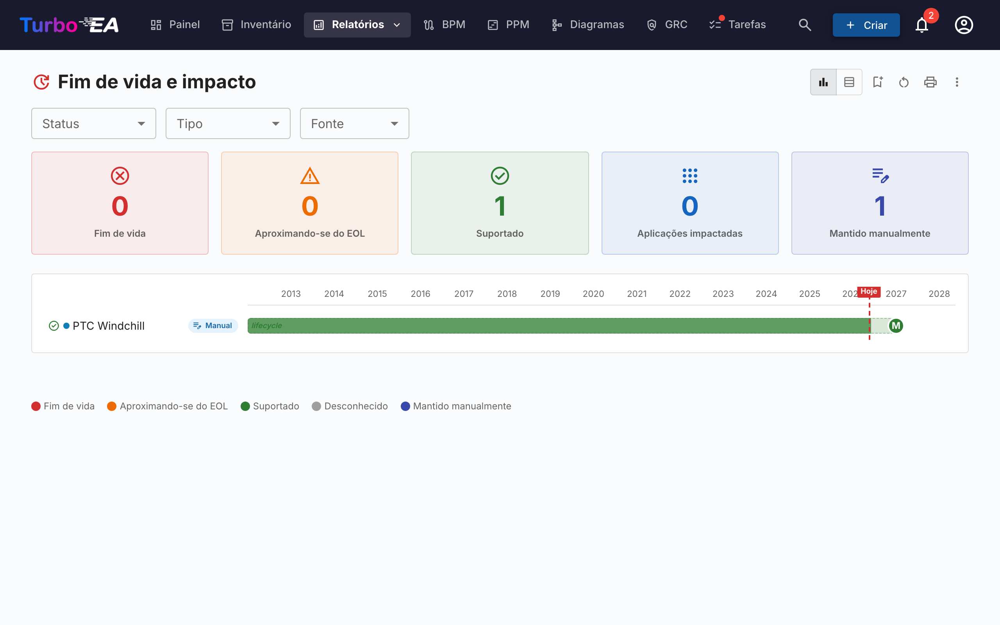
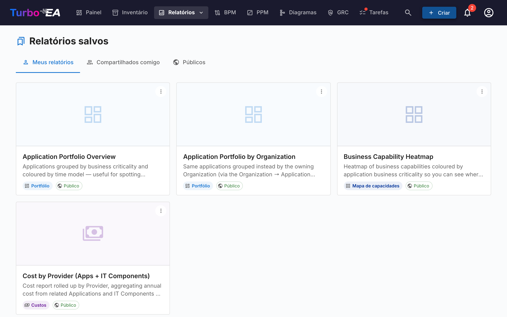

# Relatórios

O Turbo EA inclui um poderoso módulo de **relatórios visuais** que permite analisar a arquitetura empresarial a partir de diferentes perspectivas. Todos os relatórios podem ser [salvos para reutilização](saved-reports.md) com sua configuração atual de filtros e eixos.

## Relatório de Portfólio

O **Relatório de Portfólio** exibe um **gráfico de bolhas** (ou gráfico de dispersão) configurável dos seus cards. Você escolhe o que cada eixo representa:

- **Eixo X** — Selecione qualquer campo numérico ou de seleção (ex.: Adequação Técnica)
- **Eixo Y** — Selecione qualquer campo numérico ou de seleção (ex.: Criticidade de Negócio)
- **Tamanho da bolha** — Mapeie para um campo numérico (ex.: Custo Anual)
- **Cor da bolha** — Mapeie para um campo de seleção ou estado do ciclo de vida

Isso é ideal para análise de portfólio — plotando aplicações por valor de negócio versus adequação técnica, por exemplo, para identificar candidatos a investimento, substituição ou aposentadoria.

### Análises IA do portfólio

Quando a IA está configurada e as análises de portfólio estão habilitadas por um administrador, o relatório de portfólio exibe um botão **Análises IA**. Ao clicar, um resumo da visualização atual é enviado ao provedor de IA, que retorna análises estratégicas sobre riscos de concentração, oportunidades de modernização, preocupações com ciclo de vida e equilíbrio do portfólio. O painel de análises é recolhível e pode ser regenerado após alterar filtros ou agrupamentos.

## Mapa de Capacidades

O **Mapa de Capacidades** mostra um **mapa de calor** hierárquico das capacidades de negócio da organização. Cada bloco representa uma capacidade, com:

- **Hierarquia** — Capacidades principais contêm suas sub-capacidades
- **Coloração por mapa de calor** — Os blocos são coloridos com base em uma métrica selecionada (ex.: número de aplicações de suporte, qualidade média dos dados ou nível de risco)
- **Clique para explorar** — Clique em qualquer capacidade para aprofundar nos detalhes e aplicações de suporte

## Relatório de Ciclo de Vida

O **Relatório de Ciclo de Vida** mostra uma **visualização de linha do tempo** de quando os componentes tecnológicos foram introduzidos e quando está planejada sua aposentadoria. Essencial para:

- **Planejamento de aposentadoria** — Veja quais componentes estão se aproximando do fim de vida
- **Planejamento de investimento** — Identifique lacunas onde nova tecnologia é necessária
- **Coordenação de migração** — Visualize períodos sobrepostos de implantação e desativação

Os componentes são exibidos como barras horizontais abrangendo suas fases do ciclo de vida: Planejamento, Implantação, Ativo, Desativação e Fim de Vida.

## Relatório de Dependências

O **Relatório de Dependências** visualiza **conexões entre componentes** como um grafo de rede. Nós representam cards e arestas representam relacionamentos. Recursos:

- **Controle de profundidade** — Limite quantos saltos a partir do nó central são exibidos (limitação de profundidade BFS)
- **Filtragem por tipo** — Mostre apenas tipos específicos de card e tipos de relacionamento
- **Exploração interativa** — Clique em qualquer nó para recentrar o grafo naquele card
- **Análise de impacto** — Entenda o raio de impacto de alterações em um componente específico

### Vista de Diagrama C4

Alterne para a vista de **Diagrama C4** usando os botões de modo de visualização na barra de ferramentas. Esta vista renderiza os mesmos dados de dependências usando notação C4:

- **Caixas de contorno** — Os cards são agrupados por camada arquitetural (Estratégia, Negócio, Aplicação, Técnica) dentro de retângulos de contorno tracejados
- **Canvas interativo** — Mova, amplie e use o minimapa para navegar em diagramas grandes
- **Clique para inspecionar** — Clique em qualquer nó para abrir o painel lateral de detalhes do card
- **Sem card central necessário** — A vista C4 mostra todos os cards que correspondem ao filtro de tipo atual

## Relatório de Custos

O **Relatório de Custos** fornece análise financeira do seu cenário tecnológico:

- **Visualização treemap** — Retângulos aninhados dimensionados por custo, com agrupamento opcional (ex.: por organização ou capacidade)
- **Visualização em gráfico de barras** — Comparação de custos entre componentes
- **Agregação** — Custos podem ser somados a partir de cards relacionados usando campos calculados

## Relatório de Matriz

O **Relatório de Matriz** cria uma **grade de referência cruzada** entre dois tipos de card. Por exemplo:

- **Linhas** — Aplicações
- **Colunas** — Capacidades de Negócio
- **Células** — Indicam se um relacionamento existe (e quantos)

Isso é útil para identificar lacunas de cobertura (capacidades sem aplicações de suporte) ou redundâncias (capacidades suportadas por muitas aplicações).

## Relatório de Qualidade dos Dados

O **Relatório de Qualidade dos Dados** é um **painel de completude** que mostra quão bem seus dados de arquitetura estão preenchidos. Baseado nos pesos dos campos configurados no metamodelo:

- **Pontuação geral** — Qualidade média dos dados em todos os cards
- **Por tipo** — Detalhamento mostrando quais tipos de card têm melhor/pior completude
- **Cards individuais** — Lista de cards com menor qualidade de dados, priorizados para melhoria

## Relatório de Fim de Vida (EOL)

O **Relatório de EOL** mostra o status de suporte de produtos tecnológicos vinculados através do recurso de [Administração de EOL](../admin/eol.md):

- **Distribuição de status** — Quantos produtos estão Suportados, Aproximando-se do EOL ou em Fim de Vida
- **Linha do tempo** — Quando os produtos perderão suporte
- **Priorização de risco** — Foque em componentes de missão crítica que se aproximam do EOL

## Relatórios Salvos

Salve qualquer configuração de relatório para acesso rápido posterior. Relatórios salvos incluem uma miniatura de pré-visualização e podem ser compartilhados em toda a organização.

## Mapa de Processos

O **Mapa de Processos** visualiza o cenário de processos de negócio da organização como um mapa estruturado, mostrando categorias de processos (Gestão, Core, Suporte) e seus relacionamentos hierárquicos.
