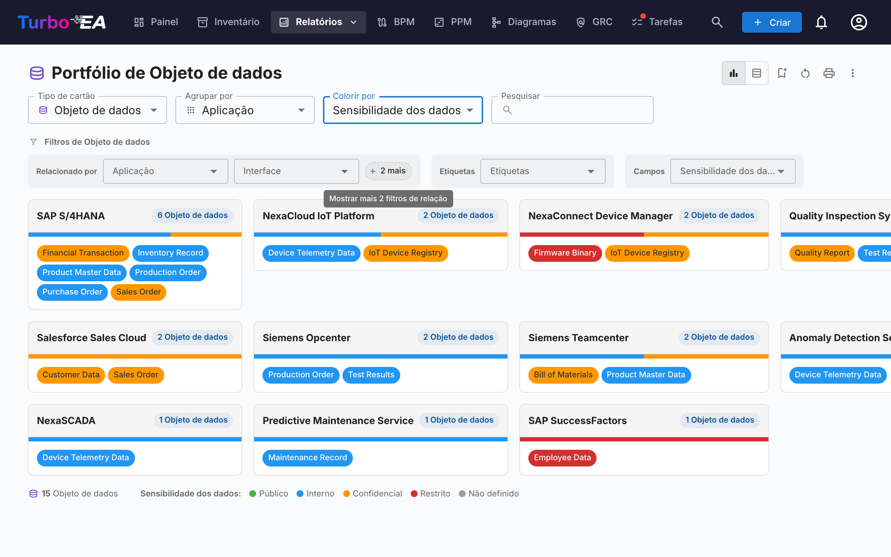

# Relatórios

O Turbo EA inclui um poderoso módulo de **relatórios visuais** que permite analisar a arquitetura empresarial a partir de diferentes perspectivas. Todos os relatórios podem ser [salvos para reutilização](saved-reports.md) com sua configuração atual de filtros e eixos.

## Relatório de Portfólio

O **Relatório de Portfólio** exibe um **gráfico de bolhas** (ou gráfico de dispersão) configurável dos seus cards. Você escolhe o que cada eixo representa:

- **Eixo X** — Selecione qualquer campo numérico ou de seleção (ex.: Adequação Técnica)
- **Eixo Y** — Selecione qualquer campo numérico ou de seleção (ex.: Criticidade de Negócio)
- **Tamanho da bolha** — Mapeie para um campo numérico (ex.: Custo Anual)
- **Cor da bolha** — Mapeie para um campo de seleção ou estado do ciclo de vida

Isso é ideal para análise de portfólio — plotando aplicações por valor de negócio versus adequação técnica, por exemplo, para identificar candidatos a investimento, substituição ou aposentadoria.

### Análises IA do portfólio

Quando a IA está configurada e as análises de portfólio estão habilitadas por um administrador, o relatório de portfólio exibe um botão **Análises IA**. Ao clicar, um resumo da visualização atual é enviado ao provedor de IA, que retorna análises estratégicas sobre riscos de concentração, oportunidades de modernização, preocupações com ciclo de vida e equilíbrio do portfólio. O painel de análises é recolhível e pode ser regenerado após alterar filtros ou agrupamentos.

## Portfólio flexível

O **Portfólio flexível** usa os mesmos controles do Portfólio de Aplicações mas adiciona um seletor de **Tipo de cartão** no topo da barra de ferramentas. Use-o para analisar portfólios de Capacidades de Negócio, Iniciativas, Componentes de TI ou qualquer outro tipo de cartão visível com a mesma experiência de agrupamento, coloração e filtros.

A captura mostra um caso de uso típico: escolha **Objeto de Dados** como tipo de cartão, **Agrupar por → Aplicação** para ver qual aplicação detém quais dados e **Colorir por → Sensibilidade dos Dados** para identificar de relance onde residem os dados confidenciais.

Alterar o tipo de cartão reinicia as seleções de agrupamento, cor e filtros (referenciam chaves de campo que não existem no novo tipo) e o relatório é recarregado com os campos, relações e etiquetas aplicáveis ao tipo escolhido. O relatório compartilha a mesma permissão do Portfólio de Aplicações (`reports.portfolio`) e é salvo de forma independente.

### Subtipos de relação

Quando as relações de um cartão têm um valor de «tipo» — por exemplo o **tipo de utilização** (Proprietário / Utilizador / Parte interessada) nas relações Organização→Aplicação, ou o **tipo de suporte** nas relações Aplicação→Capacidade de negócio — pode colorir os cartões por esse valor e filtrar por ele. **Agrupe o relatório pelo tipo de cartão relacionado** para os usar (por ex. *Agrupar por → Organização* para ativar o *tipo de utilização*): o subtipo aparece então sob o grupo **Subtipos de relação** na lista *Colorir por* e como a sua própria linha de filtros. Como cada cartão é apresentado sob um cartão relacionado, é colorido segundo *essa* relação — uma aplicação que é *Utilizador* de uma organização aparece como Utilizador aí, mesmo que pertença a outra.

## Mapa de Capacidades

O **Mapa de Capacidades** mostra um **mapa de calor** hierárquico das capacidades de negócio da organização. Cada bloco representa uma capacidade, com:

- **Hierarquia** — Capacidades principais contêm suas sub-capacidades
- **Coloração por mapa de calor** — Os blocos são coloridos com base em uma métrica selecionada (ex.: número de aplicações de suporte, qualidade média dos dados ou nível de risco)
- **Clique para explorar** — Clique em qualquer capacidade para aprofundar nos detalhes e aplicações de suporte

## Relatório de Ciclo de Vida

O **Relatório de Ciclo de Vida** mostra uma **visualização de linha do tempo** de quando os componentes tecnológicos foram introduzidos e quando está planejada sua aposentadoria. Essencial para:

- **Planejamento de aposentadoria** — Veja quais componentes estão se aproximando do fim de vida
- **Planejamento de investimento** — Identifique lacunas onde nova tecnologia é necessária
- **Coordenação de migração** — Visualize períodos sobrepostos de implantação e desativação

Os componentes são exibidos como barras horizontais abrangendo suas fases do ciclo de vida: Planejamento, Implantação, Ativo, Desativação e Fim de Vida.

## Relatório de Dependências

O **Relatório de Dependências** visualiza **conexões entre componentes** como um grafo de rede. Nós representam cards e arestas representam relacionamentos. Recursos:

- **Controle de profundidade** — Limite quantos saltos a partir do nó central são exibidos (limitação de profundidade BFS)
- **Filtragem por tipo** — Mostre apenas tipos específicos de card e tipos de relacionamento
- **Exploração interativa** — Clique em qualquer nó para recentrar o grafo naquele card
- **Análise de impacto** — Entenda o raio de impacto de alterações em um componente específico

### Layered Dependency View (vista de dependências em camadas)

Alterne para a **Layered Dependency View** usando os botões de modo de visualização na barra de ferramentas. É a notação própria do Turbo EA para mostrar dependências entre cartões nas quatro camadas EA — inspirada no princípio de estratificação do ArchiMate e na filosofia de «bons padrões» do modelo C4, mas distinta de ambos. A mesma vista é reutilizada na página de detalhes do cartão (mostrando a vizinhança imediata de dependências do cartão) e no assistente [TurboLens Architect](turbolens.md#architecture-ai), de modo que as dependências aparecem da mesma forma em toda parte.

**Lendo o diagrama**

- **Faixas por camada** — Os cartões são agrupados por camada arquitetural (Estratégia e Transformação, Arquitetura de Negócio, Aplicação e Dados, Arquitetura Técnica) dentro de retângulos de contorno tracejados, em ordem fixa.
- **Nós coloridos por tipo com ícones** — Cada nó é colorido segundo o seu tipo de cartão e mostra o ícone do tipo de cartão no canto superior esquerdo, de modo que os tipos são reconhecíveis de relance mesmo sem cor.
- **Arestas dirigidas e rotuladas** — As arestas seguem a direção da relação do metamodelo (origem → destino) e carregam o rótulo direto da relação (por ex. *usa*, *suporta*, *executa em*). Quando uma relação é qualificada com um valor (como um Tipo de suporte *Principal*), ele aparece entre colchetes após o rótulo — por exemplo *suporta [Principal]*.
- **Cartões propostos** — No assistente TurboLens Architect, os cartões ainda não confirmados têm uma borda tracejada e um selo verde **NOVO**.

**Explorando e navegando**

- **Mover, ampliar, minimapa** — Arraste o canvas para mover, role para ampliar e use o minimapa para navegar em diagramas grandes.
- **Clique para inspecionar** — Clique em qualquer nó para abrir o painel lateral de detalhes do cartão.
- **Recentralizar** — Shift+clique ou pressão longa num cartão para centrar o diagrama nele; os botões **Voltar ao seletor de cartões**, **Cartão anterior** e **Próximo cartão** da barra de ferramentas percorrem o seu histórico de navegação.
- **Modo destaque** — Passe o mouse sobre um cartão para destacar suas conexões; em dispositivos touch, ative o **Modo destaque** no painel de controles para destacar ao tocar.
- **Modo expansão** — Ative o **Modo expansão** no painel de controles e, em seguida, clique num cartão para revelar todas as suas relações sob demanda.
- **Mostrar elemento-pai / Mostrar filhos** — Duas alternativas específicas ao modo expansão. Ative **Mostrar elemento-pai** (seta para cima) ou **Mostrar filhos** (seta para baixo) no painel de controles e, em seguida, clique num cartão para adicionar ao diagrama apenas o seu elemento-pai da hierarquia ou os seus filhos diretos. Os cartões mostrados permanecem no diagrama — para que possa combinar elementos-pai e filhos — e são removidos ao recentrar ou repor a vista.
- **Sem cartão central necessário** — No relatório de Dependências, a Layered Dependency View mostra todos os cartões que correspondem ao filtro de tipo atual, de modo que você não precisa escolher um cartão de partida primeiro.

**Personalizando a vista** (a partir da barra de ferramentas)

- **Menu de exibição de cartão** — Ative a etiqueta de **tipo** e um **ponto de estado do ciclo de vida**, ative os **marcadores de hierarquia** (um pequeno chevron em cada cartão que tem um elemento-pai acima ou filhos abaixo não presentes no diagrama — uma dica para usar as ferramentas Mostrar) e escolha **campos de atributo adicionais** para mostrar em cada cartão — os dois primeiros aparecem no cartão e o conjunto completo aparece na dica ao passar o cursor. As escolhas são lembradas entre visitas.
- **Mostrar cartões em fim de vida** — Os cartões relacionados cujo ciclo de vida atingiu o fim de vida são ocultados por padrão para manter o gráfico focado; ative esta opção (no menu **Exibição de cartões**) para trazê-los de volta. O cartão no qual você está centrado é sempre mostrado, mesmo que ele próprio esteja em fim de vida.
- **Mostrar valores de relação** — Muitas relações podem ser qualificadas com um valor (por ex. uma aplicação *suporta* uma capacidade como *Principal*, *Secundário* ou *Sem suporte*). Quando ativado (padrão), esses valores aparecem entre colchetes ao lado do rótulo da relação (*suporta [Principal]*) e são incluídos nas exportações de imagem. Desative-o no menu **Exibição de cartões** para uma vista mais limpa; relações sem valor permanecem inalteradas de qualquer forma.
- **Reorganizar** — Arraste um cartão para movê-lo dentro da sua camada, ou arraste uma **caixa de camada** inteira para movê-la com todos os seus cartões. **Repor vista** (na barra de ferramentas à esquerda) restaura a disposição automática e limpa qualquer exploração.
- **Plano de fundo** — Alterne o plano de fundo do canvas entre grade, pontos e nenhum.
- **Exportação e tela cheia** — Exporte o diagrama para **PNG** ou **SVG**, ou abra-o em **tela cheia**.
- **Criar diagrama** — Transforme a visualização atual em um novo diagrama editável no [módulo de Diagramas](diagrams.md). Recria os cartões, os relacionamentos e as quatro faixas de camadas de arquitetura, e cada forma permanece vinculada ao seu cartão de inventário. É solicitado um nome e, em seguida, você é levado diretamente ao novo diagrama. Disponível para usuários que podem criar diagramas.

## Relatório de Custos

O **Relatório de Custos** fornece análise financeira do seu cenário tecnológico:

- **Visualização treemap** — Retângulos aninhados dimensionados por custo, com agrupamento opcional (ex.: por organização ou capacidade)
- **Visualização em gráfico de barras** — Comparação de custos entre componentes
- **Tipo de cartão** — Escolha o tipo de cartão em torno do qual o relatório é construído (Aplicação, Componente de TI, Fornecedor, …).

### Origem dos custos

Quando o tipo de cartão selecionado tem pelo menos um tipo de relação que aponta para um tipo com um campo de custo, surge um seletor **Origem dos custos** junto a **Tipo de cartão**. Permite escolher de onde vêm os valores:

- **Direto (este tipo de cartão)** — opção padrão; soma o campo de custo nos próprios cartões exibidos. Use ao analisar diretamente *Aplicações* ou *Componentes de TI*.
- **Agregar a partir de cartões relacionados** — marque uma ou mais entradas `Tipo · Campo` (por exemplo `Aplicação · Custo anual total`, `Componente de TI · Custo anual total`). O valor de cada cartão primário passa a ser a soma desse campo nos seus cartões relacionados.

O seletor é de **seleção múltipla**, portanto uma única consolidação pode combinar vários tipos relacionados. Por exemplo, ao visualizar o **Fornecedor** *Microsoft*, marcar simultaneamente `Aplicação · Custo anual total` e `Componente de TI · Custo anual total` mostra a presença completa do fornecedor — Teams, M365, Azure e quaisquer outros componentes fornecidos pela Microsoft — como um único número.

#### Porque nada é contabilizado duas vezes

O seletor foi desenhado para tornar a dupla contagem impossível por construção:

- Cada entrada é um par único `(tipo destino, campo de custo)` — a lista oferece cada par exactamente uma vez, mesmo quando vários tipos de relação alcançam o mesmo tipo destino.
- Dentro do mesmo par, dois cartões ligados por vários tipos de relação contribuem com o seu custo apenas uma vez.
- Entre entradas diferentes, nenhum cartão pode contribuir duas vezes: um cartão tem exactamente um tipo e campos de custo distintos no mesmo cartão são valores independentes.

Um pequeno **ícone de ajuda (?)** ao lado do seletor reforça esta garantia ao passar o rato.

A lista de opções é gerada a partir do seu metamodelo — os tipos de relação e os campos de custo são descobertos no momento de renderização, pelo que qualquer tipo de cartão ou relação personalizada que adicione passa a ser automaticamente uma Origem dos custos válida.

### Detalhar um retângulo

Sempre que pelo menos uma Origem de custos estiver ativa, os retângulos do mapa de árvore tornam-se **clicáveis**. Ao clicar num deles, o gráfico é substituído pelo detalhamento do custo desse retângulo — os cartões relacionados que contribuíram para a sua consolidação, dimensionados pelo seu custo direto. Acima do gráfico aparece uma trilha de navegação, p. ex. **Todas as Aplicações › NexaCore ERP**; clique em qualquer segmento para voltar.

- **Uma única Origem de custos ativa** — o detalhamento mostra um mapa de árvore dos cartões relacionados (por exemplo, ao clicar em *NexaCore ERP* com `Componente de TI · Custo anual total` marcado são mostrados os Componentes de TI ligados ao NexaCore ERP, dimensionados pelo seu custo anual).
- **Várias Origens de custos ativas** — o detalhamento mostra **um mapa de árvore por origem lado a lado** (1 coluna em ecrãs estreitos, 2 em ecrãs largos). Cada painel tem o seu próprio cabeçalho, o seu próprio total e a sua própria `% do total` na dica de ferramenta — assim os diferentes tipos de cartão mantêm a sua escala em vez de serem comprimidos num único gráfico.

O cursor de cronologia, a seleção de Origem de custos e os restantes filtros são preservados durante o detalhamento, e o nível de detalhamento faz parte da configuração do relatório guardado — guardar um relatório enquanto se está a detalhar reabre-o diretamente nesse nível. Sem uma Origem de custos ativa, um clique num retângulo abre antes o painel lateral do cartão (não há nada a decompor).

## Relatório de Matriz

O **Relatório de Matriz** cria uma **grade de referência cruzada** entre dois tipos de card. Por exemplo:

- **Linhas** — Aplicações
- **Colunas** — Capacidades de Negócio
- **Células** — Indicam se um relacionamento existe (e quantos)

Isso é útil para identificar lacunas de cobertura (capacidades sem aplicações de suporte) ou redundâncias (capacidades suportadas por muitas aplicações).

## Relatório de Qualidade dos Dados

O **Relatório de Qualidade dos Dados** é um **painel de completude** que mostra quão bem seus dados de arquitetura estão preenchidos. Baseado nos níveis de importância configurados na aba **Qualidade dos dados** de cada tipo de card (cada campo mais os fatores integrados Descrição, Ciclo de vida, Relações obrigatórias e Etiquetas obrigatórias):

- **Pontuação geral** — Qualidade média dos dados em todos os cards
- **Por tipo** — Detalhamento mostrando quais tipos de card têm melhor/pior completude
- **Cards individuais** — Lista de cards com menor qualidade de dados, priorizados para melhoria

## Relatório de Fim de Vida (EOL)

O **Relatório de EOL** mostra o status de suporte de produtos tecnológicos vinculados através do recurso de [Administração de EOL](../admin/eol.md):

- **Distribuição de status** — Quantos produtos estão Suportados, Aproximando-se do EOL ou em Fim de Vida
- **Linha do tempo** — Quando os produtos perderão suporte
- **Priorização de risco** — Foque em componentes de missão crítica que se aproximam do EOL

## Relatórios Salvos

Salve qualquer configuração de relatório para acesso rápido posterior. Relatórios salvos incluem uma miniatura de pré-visualização e podem ser compartilhados em toda a organização.

## Exportando relatórios

Todos os relatórios suportam **Exportar para Excel (.xlsx)** e **Exportar para PowerPoint (.pptx)** a partir do menu **⋮** na barra de título (ao lado de Imprimir e Copiar link).

- **Excel** — Gera uma planilha por tabela de dados atualmente exibida, com colunas dimensionadas automaticamente e formatação de moeda / número preservada. Alterne para a **visualização de tabela** antes de exportar para capturar as linhas subjacentes.
- **PowerPoint** — Gera uma apresentação cujo primeiro slide combina o título do relatório, o carimbo de data/hora de geração, o resumo dos filtros ativos e o gráfico ao vivo em qualidade de apresentação. Os slides seguintes paginam as tabelas de dados em entregas compartilháveis.

Os filtros e agrupamentos ativos no momento da exportação são registrados no slide de título ou no cabeçalho, mantendo as exportações autoexplicativas.

## Mapa de Processos

O **Mapa de Processos** visualiza o cenário de processos de negócio da organização como um mapa estruturado, mostrando categorias de processos (Gestão, Core, Suporte) e seus relacionamentos hierárquicos.
