# Relatórios

O Turbo EA inclui um poderoso módulo de **relatórios visuais** que permite analisar a arquitetura empresarial a partir de diferentes perspectivas. Todos os relatórios podem ser [salvos para reutilização](saved-reports.md) com sua configuração atual de filtros e eixos.

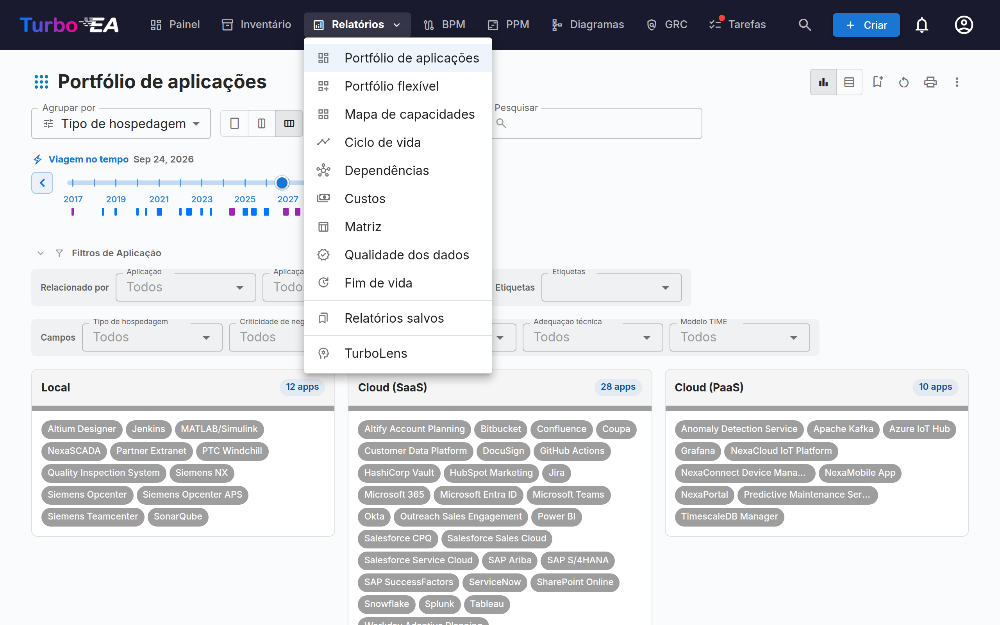

## Relatório de Portfólio

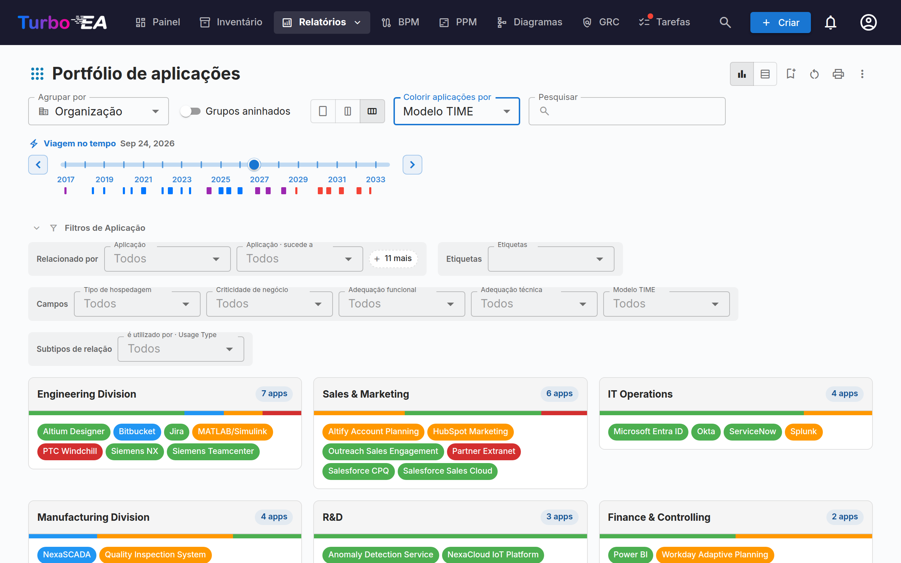

O **Relatório de Portfólio** exibe um **gráfico de bolhas** (ou gráfico de dispersão) configurável dos seus cards. Você escolhe o que cada eixo representa:

- **Eixo X** — Selecione qualquer campo numérico ou de seleção (ex.: Adequação Técnica)
- **Eixo Y** — Selecione qualquer campo numérico ou de seleção (ex.: Criticidade de Negócio)
- **Tamanho da bolha** — Mapeie para um campo numérico (ex.: Custo Anual)
- **Cor da bolha** — Mapeie para um campo de seleção ou estado do ciclo de vida

Isso é ideal para análise de portfólio — plotando aplicações por valor de negócio versus adequação técnica, por exemplo, para identificar candidatos a investimento, substituição ou aposentadoria.

### Análises IA do portfólio

Quando a IA está configurada e as análises de portfólio estão habilitadas por um administrador, o relatório de portfólio exibe um botão **Análises IA**. Ao clicar, um resumo da visualização atual é enviado ao provedor de IA, que retorna análises estratégicas sobre riscos de concentração, oportunidades de modernização, preocupações com ciclo de vida e equilíbrio do portfólio. O painel de análises é recolhível e pode ser regenerado após alterar filtros ou agrupamentos.

### Do relatório para o inventário

Clicar num grupo abre um painel com os cartões desse grupo. O seu botão **Ver no inventário** abre o inventário exatamente nessa fatia. Quando o relatório está agrupado por um campo próprio do tipo de cartão, o inventário chega agrupado pelo mesmo campo: o grupo clicado aparece expandido e todos os outros recolhidos (as contagens continuam visíveis), e a pesquisa e os filtros de atributos, relações e etiquetas do relatório são transportados — pronto para «selecionar tudo» e a [edição em massa](inventory.md#mass-edit). Ao agrupar por um tipo de cartão relacionado (por exemplo, Organização), o inventário chega filtrado para esse cartão relacionado. O botão fica oculto quando os *grupos aninhados* estão ativos: uma subárvore agregada não corresponde a um único filtro do inventário.

### Recolher os filtros

A linha **Filtros** pode ser fechada: clique no seu cabeçalho para ocultar os controlos de filtro e devolver ao gráfico o espaço vertical. A definição é memorizada com o resto da configuração do relatório, pelo que um relatório reabre tal como o deixou. Mesmo recolhido, o cabeçalho continua a indicar quantos filtros estão ativos e **Limpar tudo** permanece acessível — uma secção fechada nunca esconde o facto de os dados estarem filtrados.

### Viagem no tempo

O controle deslizante da linha do tempo traz os mesmos instrumentos de transição do [Relatório de Dependências](#relatorio-de-dependencias): marcas em cada data em que uma aplicação entra em produção (azul) ou é desativada (vermelho), pílulas que nomeiam as aplicações que mudam enquanto o controle está sobre uma marca, botões de seta que saltam de mudança em mudança e chips que resumem a transformação quando se olha para o futuro («+4 entram · −7 saem» — também incluídos nos cabeçalhos de impressão e exportação). Clicar numa marca ou numa pílula destaca as aplicações que mudam ali — o resto da vista escurece enquanto elas pulsam, e uma aplicação já desaparecida na data selecionada é revelada apenas durante a pulsação, voltando depois a ficar oculta.

## Portfólio flexível

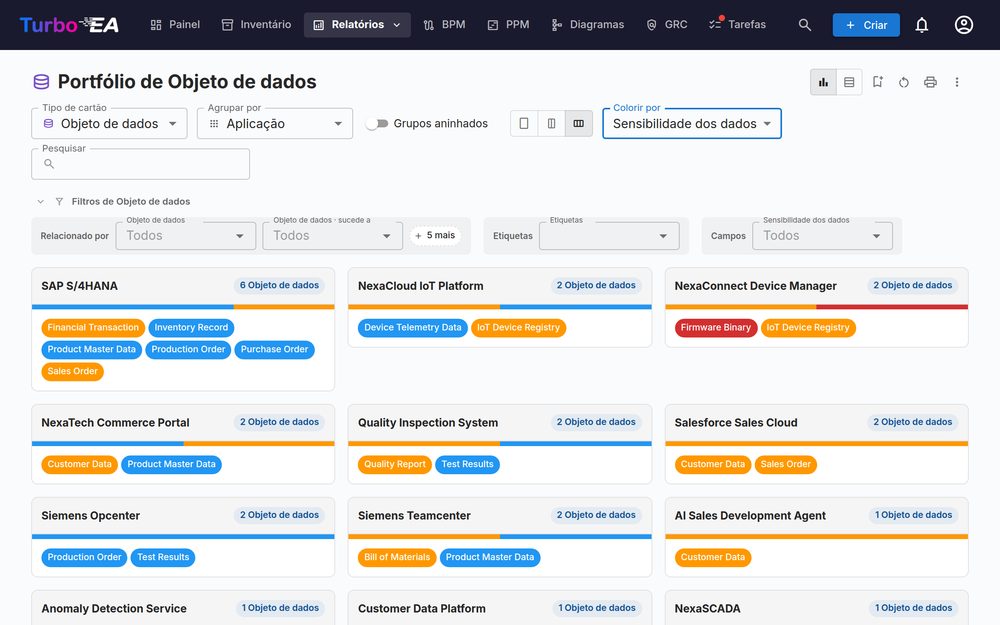

O **Portfólio flexível** usa os mesmos controles do Portfólio de Aplicações mas adiciona um seletor de **Tipo de cartão** no topo da barra de ferramentas. Use-o para analisar portfólios de Capacidades de Negócio, Iniciativas, Componentes de TI ou qualquer outro tipo de cartão visível com a mesma experiência de agrupamento, coloração e filtros.

A captura mostra um caso de uso típico: escolha **Objeto de Dados** como tipo de cartão, **Agrupar por → Aplicação** para ver qual aplicação detém quais dados e **Colorir por → Sensibilidade dos Dados** para identificar de relance onde residem os dados confidenciais.

Alterar o tipo de cartão reinicia as seleções de agrupamento, cor e filtros (referenciam chaves de campo que não existem no novo tipo) e o relatório é recarregado com os campos, relações e etiquetas aplicáveis ao tipo escolhido. O relatório compartilha a mesma permissão do Portfólio de Aplicações (`reports.portfolio`) e é salvo de forma independente.

### Subtipos de relação

Quando as relações de um cartão têm um valor de «tipo» — por exemplo o **tipo de utilização** (Proprietário / Utilizador / Parte interessada) nas relações Organização→Aplicação, ou o **tipo de suporte** nas relações Aplicação→Capacidade de negócio — pode colorir os cartões por esse valor e filtrar por ele. **Agrupe o relatório pelo tipo de cartão relacionado** para os usar (por ex. *Agrupar por → Organização* para ativar o *tipo de utilização*): o subtipo aparece então sob o grupo **Subtipos de relação** na lista *Colorir por* e como a sua própria linha de filtros. Como cada cartão é apresentado sob um cartão relacionado, é colorido segundo *essa* relação — uma aplicação que é *Utilizador* de uma organização aparece como Utilizador aí, mesmo que pertença a outra.

### Grupos aninhados

Ao agrupar por um tipo de cartão relacionado que suporta hierarquia (como Capacidade de negócio ou Organização), um interruptor **Grupos aninhados** aparece ao lado do seletor *Agrupar por*. Ative-o para exibir os grupos como caixas aninhadas seguindo a hierarquia pai/filho do tipo relacionado — como no Mapa de Capacidades. O seletor **Profundidade de exibição** controla quantos níveis são expandidos: cada cartão aparece sob o seu grupo visível mais profundo, e os grupos abaixo do limite de profundidade elevam os seus cartões ao ancestral visível mais próximo. Ramos sem cartões são ocultados.

### Escolher o número de colunas

A grelha de cartões dos relatórios **Portefólio**, **Portefólio flexível**, **Mapa de capacidades** e **Mapa de processos** tem um **seletor de colunas** na barra de ferramentas — três botões para uma, duas ou três colunas. Escolha menos colunas quando os cartões forem densos e precisarem de largura suficiente para se lerem; escolha três para ver mais do panorama de uma só vez. A escolha é memorizada por relatório, acompanha um [relatório guardado](saved-reports.md) e é usada ao imprimir ou exportar. Os ecrãs estreitos continuam a reduzir sozinhos para uma ou duas colunas. A escolha propaga-se para baixo: cada nível abaixo do primeiro recebe menos uma coluna. Com uma coluna, o nível 2 fica com três e o nível 3 com duas; com três colunas, tudo o que está abaixo permanece empilhado a toda a largura. Um nível continua a reduzir-se sozinho quando um cartão é realmente demasiado estreito.

## Mapa de Capacidades

Clicar numa capacidade abre um painel lateral com todas as aplicações da sua subárvore. No nível mais baixo, o painel oferece **Ver no inventário**, que leva às aplicações ligadas a ela.

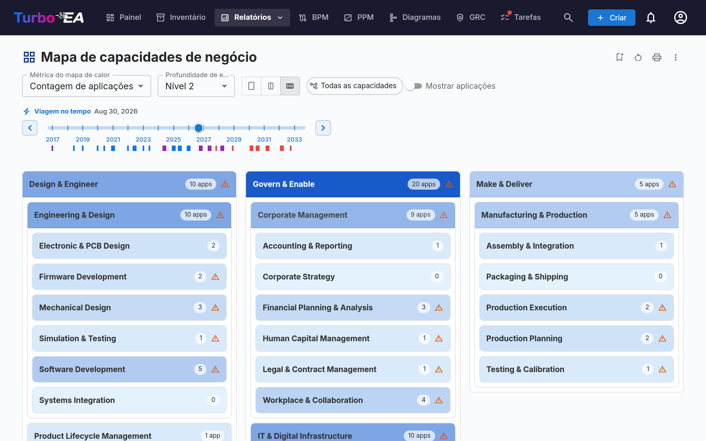

O **Mapa de Capacidades** mostra um **mapa de calor** hierárquico das capacidades de negócio da organização. Cada bloco representa uma capacidade, com:

- **Hierarquia** — Capacidades principais contêm suas sub-capacidades
- **Coloração por mapa de calor** — Os blocos são coloridos com base em uma métrica selecionada (ex.: número de aplicações de suporte, qualidade média dos dados ou nível de risco)
- **Clique para explorar** — Clique em qualquer capacidade para aprofundar nos detalhes e aplicações de suporte

**Limitar a capacidades específicas** — Por predefinição, o mapa desenha todas as capacidades. Use o chip de capacidade na barra de ferramentas para abrir um seletor e escolher uma ou mais capacidades; o mapa mostra então apenas essas e tudo o que está abaixo delas. As subcapacidades são incluídas automaticamente, pelo que escolher uma capacidade de primeiro nível lhe dá todo o seu ramo. A **Profundidade de visualização** conta a partir das capacidades selecionadas, por isso *Nível 2* significa sempre dois níveis abaixo daquilo que está a ver. O âmbito é guardado com o relatório, para que um relatório guardado reabra no mesmo ramo.

**Viagem no tempo** — O controle deslizante da linha do tempo traz os mesmos instrumentos de transição do [Relatório de Dependências](#relatorio-de-dependencias): marcas em cada data em que uma aplicação entra em produção (azul) ou é desativada (vermelho), pílulas que nomeiam as aplicações que mudam enquanto o controle está sobre uma marca, botões de seta que saltam de mudança em mudança e chips que resumem a transformação quando se olha para o futuro (também incluídos nos cabeçalhos de impressão e exportação). Clicar numa marca ou numa pílula destaca a mudança: com **Mostrar aplicações** ativo, os chips das aplicações que mudam pulsam enquanto o resto escurece, e uma aplicação já desaparecida na data selecionada é revelada apenas durante a pulsação; com ele desativado, o destaque recai sobre os blocos de capacidade que contêm as aplicações que mudam — azul onde elas apenas entram, vermelho onde apenas são desativadas, roxo onde acontecem as duas coisas.

**Recolher os filtros** — A linha **Filtros de aplicação** pode ser fechada; clique no seu cabeçalho para recuperar o espaço. O estado é guardado com o relatório, a contagem de filtros ativos continua visível no cabeçalho recolhido e **Limpar tudo** permanece acessível sem ter de a expandir primeiro.

## Relatório de Ciclo de Vida

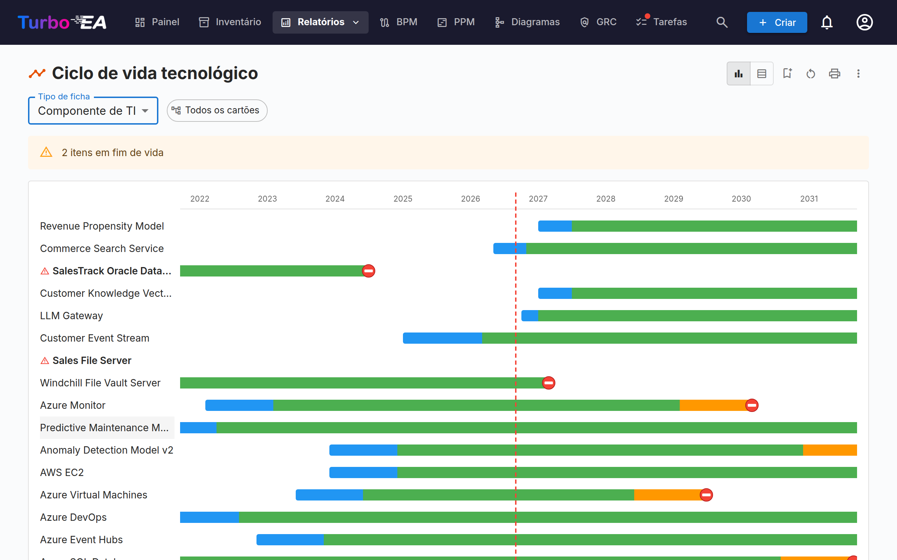

O **Relatório de Ciclo de Vida** mostra uma **visualização de linha do tempo** de quando os componentes tecnológicos foram introduzidos e quando está planejada sua aposentadoria. Essencial para:

- **Planejamento de aposentadoria** — Veja quais componentes estão se aproximando do fim de vida
- **Planejamento de investimento** — Identifique lacunas onde nova tecnologia é necessária
- **Coordenação de migração** — Visualize períodos sobrepostos de implantação e desativação

Os componentes são exibidos como barras horizontais abrangendo suas fases do ciclo de vida: Planejamento, Implantação, Ativo, Desativação e Fim de Vida.

**Limitar a cartões específicos** — Depois de escolher um tipo de cartão, o chip ao lado abre um seletor: escolha um ou mais cartões e a linha temporal mostra apenas esses e tudo o que está abaixo deles. Os cartões filhos são incluídos automaticamente. O chip fica desativado enquanto o seletor estiver em *Todos os tipos*, porque um âmbito precisa de uma única hierarquia.

## Relatório de Dependências

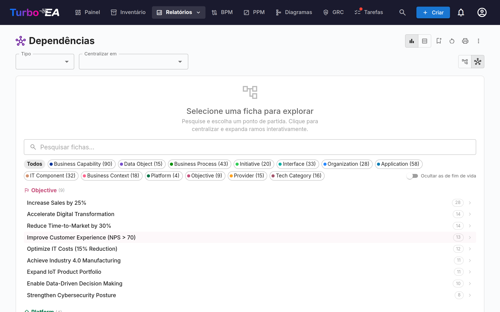

O **Relatório de Dependências** visualiza **conexões entre componentes** como um grafo de rede. Nós representam cards e arestas representam relacionamentos. Recursos:

- **Controle de profundidade** — Limite quantos saltos a partir do nó central são exibidos (limitação de profundidade BFS)
- **Filtragem por tipo** — Mostre apenas tipos específicos de card e tipos de relacionamento
- **Exploração interativa** — Clique em qualquer nó para recentrar o grafo naquele card
- **Análise de impacto** — Entenda o raio de impacto de alterações em um componente específico
- **Viagem no tempo** — Depois de centrar em um card (ou mudar para a vista de tabela), arraste o controle deslizante da linha do tempo para ver o panorama tal como está em qualquer data. Os cards que ainda não entraram em produção ficam ocultos: um card entra no panorama na sua data **Ativo**, portanto se essa data ainda está por vir, ou não existe, o card fica fora da vista padrão. Os cards que **entram** entre hoje e uma data futura são simplesmente parte do panorama nessa data: têm um contorno roxo e nenhum rótulo, porque a viagem no tempo mostra o estado tal como será. Os cards **desativados** permanecem no diagrama — esmaecidos e com o rótulo *DESATIVADO* — em qualquer data após a desativação, de modo que uma transformação mostra tanto o que remove quanto o que deixa. A chave **Manter cards desativados**, na barra de ferramentas, oculta-os para mostrar apenas os cards ativos na data selecionada. Seu espelho, **Pré-visualizar cards planejados**, mostra os cards que ainda não começaram — esmaecidos e com o rótulo *EM BREVE* — em qualquer data anterior ao seu início, de modo que até uma vista presente ou passada mostra o que está por vir. A linha do tempo é marcada com cada data em que os cards do diagrama exibido entram em produção (azul) ou são desativados (vermelho); clique em uma marca para levar o controle deslizante direto para essa mudança, ou avance de mudança em mudança com as setas ao lado do controle. Enquanto o controle deslizante estiver sobre uma marca, os cards que ela conta são listados como pílulas abaixo das marcas, agrupados atrás de um **+** os que entram em produção e de um **−** os que são desativados — cada pílula carrega a cor do seu tipo de card e, ao clicar, apenas esse card é destacado. Cada marca é azul quando ali apenas entram cards em produção, vermelha quando apenas são desativados e roxa quando ocorrem as duas coisas. Quando as mudanças ficam próximas, a linha do tempo funde-as em uma única marca, desenhada mais larga e rotulada com o intervalo que abrange; um card que entra em produção e é desativado dentro desse intervalo é nomeado dos dois lados. As setas tratam uma marca fundida como uma única parada: um toque a ultrapassa por completo em vez de percorrer uma a uma as datas que ela abrange. Quando o controle está sobre uma marca fundida, o panorama é o do **fim** do seu intervalo — tudo o que ela abrange já aconteceu — e a data ao lado do controle nomeia esse intervalo em vez de um único dia. O clique — assim como o salto com as setas — também destaca os cards envolvidos: a tela escurece por um instante enquanto eles pulsam na cor da marca, e um card desativado oculto por **Manter cards desativados** aparece apenas durante a pulsação. Olhando para o futuro, chips acima do controle resumem a transformação (+4 entram · −7 saem). Os relacionamentos com cards desativados aparecem tracejados em vermelho — as dependências que a transformação rompe — e enquanto o controle está sobre uma marca, os cards ali desativados permanecem no diagrama — esmaecidos e com o rótulo *DESATIVADO* — mesmo com **Manter cards desativados** desligado. Os cards que permanecem são marcados onde as suas conexões mudam: um ícone vermelho de vínculo rompido onde um vizinho é desativado, um azul onde um vizinho entra em produção, e ambos quando as duas coisas acontecem. É a marca que os sustenta: ao sair dela desaparecem, de modo que uma desativação já não marca os seus vizinhos em todas as datas posteriores. O controle se aplica a todas as vistas e a data é salva com o relatório.

O card que você coloca no centro determina o quanto vê: por isso o seletor lista primeiro, em cada tipo, os cards mais conectados. Uma capacidade costuma ser a escolha mais reveladora, por ser o único tipo de card que alcança em um único salto os objetivos acima e as aplicações abaixo. O seletor lista **todos os cards do inventário** — exceto os arquivados — seja qual for a data em que a linha do tempo esteja: é aqui que você escolhe o que olhar, e o controle deslizante fica oculto nesta etapa, de modo que um card já desativado, ou que ainda não entrou em produção, continua disponível para ser centralizado. Os cards que atingiram o **fim de vida na data de hoje** (e não na data da linha do tempo) exibem a etiqueta *DESATIVADO* com a respetiva data de fim de vida; o interruptor **Ocultar as de fim de vida**, ao lado dos chips de tipo, filtra-os.

### Layered Dependency View (vista de dependências em camadas)

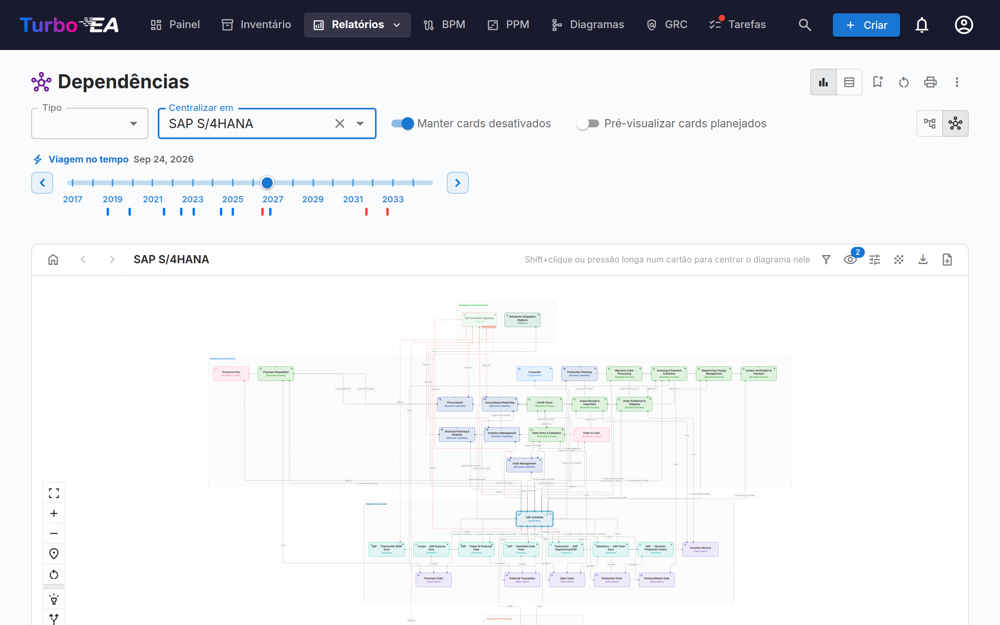

Alterne para a **Layered Dependency View** usando os botões de modo de visualização na barra de ferramentas. É a notação própria do Turbo EA para mostrar dependências entre cartões nas quatro camadas EA — inspirada no princípio de estratificação do ArchiMate e na filosofia de «bons padrões» do modelo C4, mas distinta de ambos. A mesma vista é reutilizada na página de detalhes do cartão (mostrando a vizinhança imediata de dependências do cartão) e no assistente [TurboLens Architect](turbolens.md#architecture-ai), de modo que as dependências aparecem da mesma forma em toda parte.

**Lendo o diagrama**

- **Faixas por camada** — Os cartões são agrupados por camada arquitetural (Estratégia e Transformação, Arquitetura de Negócio, Aplicação e Dados, Arquitetura Técnica) dentro de retângulos de contorno tracejados, em ordem fixa.
- **Nós coloridos por tipo com ícones** — Cada nó é colorido segundo o seu tipo de cartão e mostra o ícone do tipo de cartão no canto superior esquerdo, de modo que os tipos são reconhecíveis de relance mesmo sem cor.
- **Arestas dirigidas e rotuladas** — As arestas seguem a direção da relação do metamodelo (origem → destino) e carregam o rótulo direto da relação (por ex. *usa*, *suporta*, *executa em*). Quando uma relação é qualificada com um valor (como um Tipo de suporte *Principal*), ele aparece entre colchetes após o rótulo — por exemplo *suporta [Principal]*.
- **Cartões propostos** — No assistente TurboLens Architect, os cartões ainda não confirmados têm uma borda tracejada e um selo verde **NOVO**.

**Explorando e navegando**

- **Mover, ampliar, minimapa** — Arraste o canvas para mover, role para ampliar e use o minimapa para navegar em diagramas grandes.
- **Clique para inspecionar** — Clique em qualquer nó para abrir o painel lateral de detalhes do cartão.
- **Recentralizar** — Shift+clique ou pressão longa num cartão para centrar o diagrama nele; os botões **Voltar ao seletor de cartões**, **Cartão anterior** e **Próximo cartão** da barra de ferramentas percorrem o seu histórico de navegação.
- **Modo destaque** — Passe o mouse sobre um cartão para destacar suas conexões; em dispositivos touch, ative o **Modo destaque** no painel de controles para destacar ao tocar.
- **Modo expansão** — Ative o **Modo expansão** no painel de controles e, em seguida, clique num cartão para revelar todas as suas relações sob demanda. O card em que o diagrama está centrado tem uma borda dupla na cor do seu tipo, e cada card que você expande tem uma mais fina, de modo que as suas referências continuam visíveis à medida que o diagrama cresce.
- **Mostrar elemento-pai / Mostrar filhos** — Duas alternativas específicas ao modo expansão. Ative **Mostrar elemento-pai** (seta para cima) ou **Mostrar filhos** (seta para baixo) no painel de controles e, em seguida, clique num cartão para adicionar ao diagrama apenas o seu elemento-pai da hierarquia ou os seus filhos diretos. Os cartões mostrados permanecem no diagrama — para que possa combinar elementos-pai e filhos — e são removidos ao recentrar ou repor a vista.
- **Sem cartão central necessário** — No relatório de Dependências, a Layered Dependency View mostra todos os cartões que correspondem ao filtro de tipo atual, de modo que você não precisa escolher um cartão de partida primeiro.

**Personalizando a vista** (a partir da barra de ferramentas)

- **Mostrar no cartão** — Um botão dedicado da barra de ferramentas (o ícone de olho) lista como **caixas de seleção** tudo o que um cartão pode mostrar: a etiqueta de **tipo**, o **subtipo**, um **ponto de estado do ciclo de vida** e cada **campo de atributo** disponível, agrupado sob o tipo de cartão a que pertence. As duas primeiras linhas aparecem no próprio cartão e o conjunto completo na dica de contexto. Um distintivo no botão conta o que está a ser mostrado. As escolhas são memorizadas entre visitas e acompanham **Criar diagrama**: um diagrama DrawIO gerado a partir deste relatório abre com as mesmas linhas, escolhidas no mesmo menu — aí todas, porque uma forma de diagrama cresce para as acolher e um nó de relatório não. Num telemóvel, a lista abre em ecrã inteiro. **Limpar tudo** desmarca todas as caixas de uma só vez.
- **Mostrar logótipos dos cartões** — Um cartão que tem o seu próprio logótipo mostra-o no canto superior esquerdo, com o ícone do tipo de cartão como um pequeno emblema por cima, de modo que se percebe tanto o produto como o tipo de cartão. Ativado por predefinição; desative-o no menu **Opções de vista** para um diagrama sem adornos. Os cartões sem logótipo — e todos os cartões de um tipo em que um administrador desativou os logótipos — mantêm-se inalterados em qualquer dos casos. Os logótipos são incluídos nas exportações de imagem.
- **Mostrar cartões em fim de vida** — Os cartões relacionados que atingiram o fim de vida **na data escolhida na linha do tempo** são ocultados por padrão para manter o gráfico focado; ative esta opção (no menu **Opções de visualização**) para trazê-los de volta. O cartão no qual você está centrado é sempre mostrado, mesmo que ele próprio esteja em fim de vida.
- **Mostrar rótulos de relação** — O verbo de cada relação (*apoia*, *usa*, …) é desenhado na sua linha. Ativado por padrão; desative no menu **Opções de visualização** para uma tela mais limpa em um panorama denso. As linhas e suas pontas de seta continuam mostrando o que se conecta a quê, e em que direção.
- **Mostrar valores de relação** — Muitas relações podem ser qualificadas com um valor (por ex. uma aplicação *suporta* uma capacidade como *Principal*, *Secundário* ou *Sem suporte*). Quando ativado (padrão), esses valores aparecem entre colchetes ao lado do rótulo da relação (*suporta [Principal]*) e são incluídos nas exportações de imagem. Desative-o no menu **Opções de visualização** para uma vista mais limpa; relações sem valor permanecem inalteradas de qualquer forma.
- **Estilo de linha** — Escolha como as linhas de ligação são desenhadas em repouso: **contínua**, **pontilhada**, **tracejada** (predefinição) ou **traço longo**, no menu **Opções de vista**. Ao passar o cursor, a linha é sempre contínua, e uma dependência interrompida mantém os seus próprios traços.
- **Reorganizar** — Arraste um cartão para movê-lo dentro da sua camada, ou arraste uma **caixa de camada** inteira para movê-la com todos os seus cartões. **Repor vista** (na barra de ferramentas à esquerda) restaura a disposição automática e limpa qualquer exploração.
- **Plano de fundo** — Alterne o plano de fundo do canvas entre grade, pontos e nenhum.
- **Exportação e tela cheia** — Exporte o diagrama para **PNG** ou **SVG**, ou abra-o em **tela cheia**.
- **Criar diagrama** — Transforme a visualização atual em um novo diagrama editável no [módulo de Diagramas](diagrams.md). Recria os cartões, os relacionamentos e as quatro faixas de camadas de arquitetura, e cada forma permanece vinculada ao seu cartão de inventário. É solicitado um nome e, em seguida, você é levado diretamente ao novo diagrama. Disponível para usuários que podem criar diagramas.

## Relatório de Custos

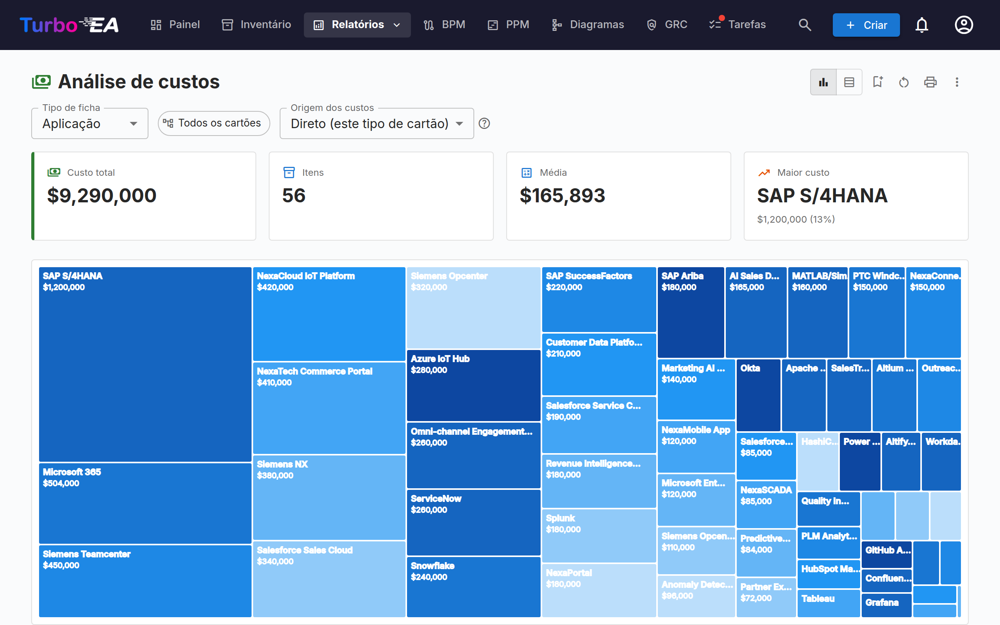

O **Relatório de Custos** fornece análise financeira do seu cenário tecnológico:

- **Visualização treemap** — Retângulos aninhados dimensionados por custo, com agrupamento opcional (ex.: por organização ou capacidade)
- **Visualização em gráfico de barras** — Comparação de custos entre componentes
- **Tipo de cartão** — Escolha o tipo de cartão em torno do qual o relatório é construído (Aplicação, Componente de TI, Fornecedor, …).

### Origem dos custos

Quando o tipo de cartão selecionado tem pelo menos um tipo de relação que aponta para um tipo com um campo de custo, surge um seletor **Origem dos custos** junto a **Tipo de cartão**. Permite escolher de onde vêm os valores:

- **Direto (este tipo de cartão)** — opção padrão; soma o campo de custo nos próprios cartões exibidos. Use ao analisar diretamente *Aplicações* ou *Componentes de TI*.
- **Agregar a partir de cartões relacionados** — marque uma ou mais entradas `Tipo · Campo` (por exemplo `Aplicação · Custo anual total`, `Componente de TI · Custo anual total`). O valor de cada cartão primário passa a ser a soma desse campo nos seus cartões relacionados.

O seletor é de **seleção múltipla**, portanto uma única consolidação pode combinar vários tipos relacionados. Por exemplo, ao visualizar o **Fornecedor** *Microsoft*, marcar simultaneamente `Aplicação · Custo anual total` e `Componente de TI · Custo anual total` mostra a presença completa do fornecedor — Teams, M365, Azure e quaisquer outros componentes fornecidos pela Microsoft — como um único número.

#### Porque nada é contabilizado duas vezes

O seletor foi desenhado para tornar a dupla contagem impossível por construção:

- Cada entrada é um par único `(tipo destino, campo de custo)` — a lista oferece cada par exactamente uma vez, mesmo quando vários tipos de relação alcançam o mesmo tipo destino.
- Dentro do mesmo par, dois cartões ligados por vários tipos de relação contribuem com o seu custo apenas uma vez.
- Entre entradas diferentes, nenhum cartão pode contribuir duas vezes: um cartão tem exactamente um tipo e campos de custo distintos no mesmo cartão são valores independentes.

Um pequeno **ícone de ajuda (?)** ao lado do seletor reforça esta garantia ao passar o rato.

A lista de opções é gerada a partir do seu metamodelo — os tipos de relação e os campos de custo são descobertos no momento de renderização, pelo que qualquer tipo de cartão ou relação personalizada que adicione passa a ser automaticamente uma Origem dos custos válida.

### Detalhar um retângulo

Sempre que pelo menos uma Origem de custos estiver ativa, os retângulos do mapa de árvore tornam-se **clicáveis**. Ao clicar num deles, o gráfico é substituído pelo detalhamento do custo desse retângulo — os cartões relacionados que contribuíram para a sua consolidação, dimensionados pelo seu custo direto. Acima do gráfico aparece uma trilha de navegação, p. ex. **Todas as Aplicações › NexaCore ERP**; clique em qualquer segmento para voltar.

- **Uma única Origem de custos ativa** — o detalhamento mostra um mapa de árvore dos cartões relacionados (por exemplo, ao clicar em *NexaCore ERP* com `Componente de TI · Custo anual total` marcado são mostrados os Componentes de TI ligados ao NexaCore ERP, dimensionados pelo seu custo anual).
- **Várias Origens de custos ativas** — o detalhamento mostra **um mapa de árvore por origem lado a lado** (1 coluna em ecrãs estreitos, 2 em ecrãs largos). Cada painel tem o seu próprio cabeçalho, o seu próprio total e a sua própria `% do total` na dica de ferramenta — assim os diferentes tipos de cartão mantêm a sua escala em vez de serem comprimidos num único gráfico.

O cursor de cronologia, a seleção de Origem de custos e os restantes filtros são preservados durante o detalhamento, e o nível de detalhamento faz parte da configuração do relatório guardado — guardar um relatório enquanto se está a detalhar reabre-o diretamente nesse nível. Sem uma Origem de custos ativa, um clique num retângulo abre antes o painel lateral do cartão (não há nada a decompor).

**Limitar a cartões específicos** — O chip ao lado do seletor de tipo abre um seletor: escolha um ou mais cartões e o treemap, os totais e a tabela limitam-se a esses e a tudo o que está abaixo deles. O chip fica oculto enquanto estiver dentro de um retângulo, pois esse detalhe já o levou a outro tipo de cartão; saia dele e o âmbito continua lá.

## Relatório de Matriz

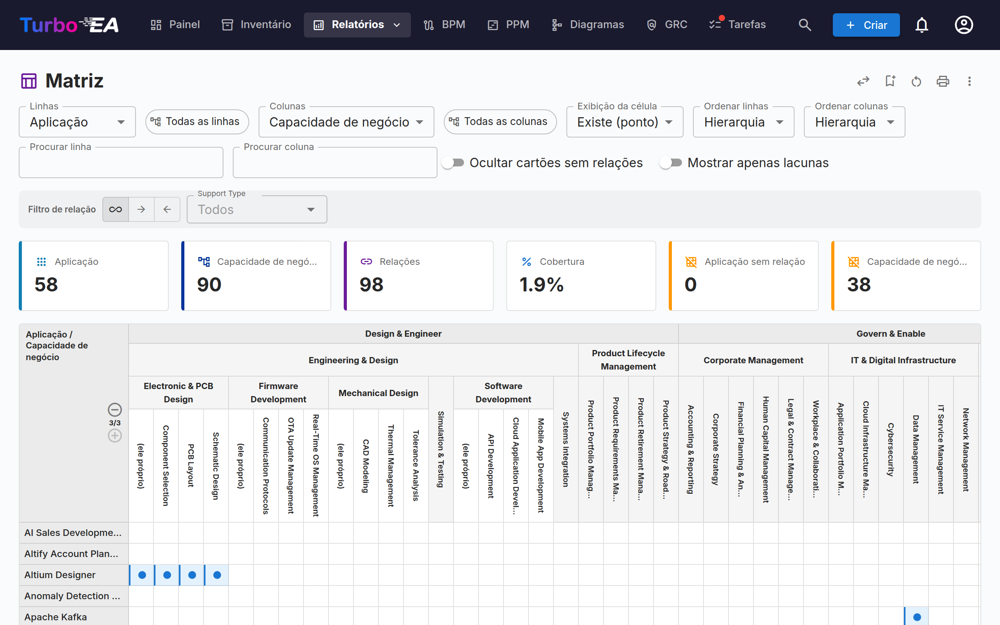

O **Relatório de Matriz** cria uma **grade de referência cruzada** entre dois tipos de card. Por exemplo:

- **Linhas** — Aplicações
- **Colunas** — Capacidades de Negócio
- **Células** — Indicam se um relacionamento existe (e quantos)

Isso é útil para identificar lacunas de cobertura (capacidades sem aplicações de suporte) ou redundâncias (capacidades suportadas por muitas aplicações).

Utilize o botão **Ocultar cartões sem relações** para ocultar linhas e colunas de cards que não têm relações, mantendo apenas os cards que participam em pelo menos uma relação. A visualização completa que mostra todos os cards continua a ser o comportamento predefinido.

### O que cada célula mostra

O controlo **Exibição da célula** oferece quatro opções:

- **Existe (ponto)** — um ponto onde exista uma relação.
- **Contagem (mapa de calor)** — quantas relações existem, sombreadas conforme a densidade.
- **Valores (códigos)** — uma letra colorida por cada valor da relação, com uma legenda acima da grelha. Ideal para uma matriz grande.
- **Valores (rótulos)** — os nomes dos valores por extenso. As colunas alargam-se, pelo que se adequa a uma matriz mais pequena.

As letras e os nomes vêm dos atributos que os seus tipos de relação declaram, no seu próprio idioma. Uma relação CRUD lê-se `C R U D`; uma relação de propriedade mostra os seus próprios valores. Adicione um valor a um tipo de relação no [metamodelo](../admin/metamodel.md) e ele aparece aqui sem mais configuração. Uma célula de grupo recolhido mostra sempre uma contagem, porque pode abranger muitos valores diferentes — expanda um nível para os ver.

Um card com filhos na hierarquia pode também ter relações próprias. Quando tem, recebe uma linha (ou coluna) só sua, com o rótulo **(ele próprio)**, logo abaixo do seu cabeçalho de grupo, para que essas relações tenham onde aparecer em vez de se perderem entre o pai e os filhos. Ao recolher o nível, passam a ser contadas na célula do grupo juntamente com as dos filhos.

### Filtrar por relação

A barra de filtros acima da grelha restringe a matriz às relações que lhe interessam:

- **Tipo de relação** — quando os dois tipos de card estão ligados em ambos os sentidos.
- **Direção** — se o card da linha é a origem ou o destino da relação.
- **Valores** — um filtro por cada atributo declarado pelos tipos de relação, incluindo «(vazio)» para relações cujo valor nunca foi definido.

Ao filtrar, as células dos cards que já não correspondem ficam vazias, pelo que ativar **Ocultar cartões não correspondentes** deixa apenas os que correspondem. Alguns exemplos:

- Aplicação × Objeto de dados, filtrado por *Criar* — que aplicações são o sistema de referência de cada objeto de dados.
- Aplicação × Interface, filtrado por direção — quem publica uma interface e quem a consome.
- Organização × Aplicação, filtrado por *Proprietário* — o mapa de propriedade, sem os utilizadores a sobrecarregá-lo.

### Encontrar lacunas de cobertura

Dois mosaicos contam os cards de cada eixo que não têm qualquer relação. **Mostrar apenas lacunas** reduz a grelha exatamente a esses — as capacidades que ninguém suporta, os objetos de dados que ninguém mantém.

### Orientar-se numa matriz grande

**Procurar linha** e **Procurar coluna** filtram os eixos por nome; um elemento pai permanece visível quando um dos seus filhos corresponde. O botão de troca na barra de título inverte os dois eixos.

### Exportar

A exportação para Excel produz duas folhas: a grelha tal como aparece no ecrã e uma linha por relação com os seus valores distribuídos por colunas — a folha sobre a qual construir uma tabela dinâmica. A exportação para PowerPoint capta a imagem.

**Limitar cada eixo** — Cada eixo tem o seu próprio chip junto ao seletor de tipo, para que possa pedir *estas capacidades × estas aplicações*. Os indicadores acima da grelha seguem o âmbito, pelo que os números descrevem sempre o que está a ver. Mudar o tipo de um eixo limpa o âmbito desse eixo; ao transpor, os dois âmbitos trocam juntamente com os eixos.

## Relatório de Qualidade dos Dados

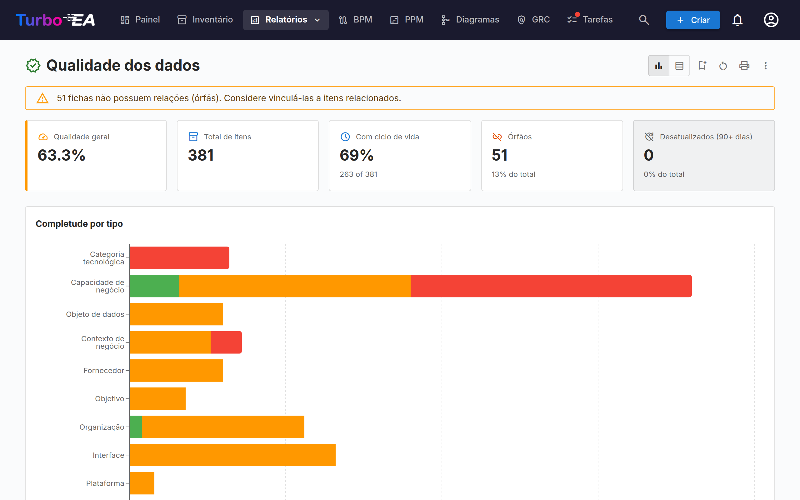

O **Relatório de Qualidade dos Dados** é um **painel de completude** que mostra quão bem seus dados de arquitetura estão preenchidos. Baseado nos níveis de importância configurados na aba **Qualidade dos dados** de cada tipo de card (cada campo mais os fatores integrados Descrição, Ciclo de vida, Relações obrigatórias e Etiquetas obrigatórias):

- **Pontuação geral** — Qualidade média dos dados em todos os cards
- **Por tipo** — Detalhamento mostrando quais tipos de card têm melhor/pior completude
- **Cards individuais** — Lista de cards com menor qualidade de dados, priorizados para melhoria

Cards com um **campo obrigatório** vazio sempre pontuam **0%** — o cálculo ponderado só é retomado quando todos os campos obrigatórios estiverem preenchidos — assim, a lista de pontuações mais baixas mostra exatamente os cards cujos dados obrigatórios ainda faltam.

### Aprofundar num número

Cada valor do relatório é uma porta de entrada, não apenas uma leitura:

- **Clique num segmento de barra** em *Completude por tipo* — abre-se um painel à direita com os cards desse tipo naquela faixa (Completo, Parcial ou Mínimo).
- **Clique numa barra** em *Completude média por tipo*, ou numa linha da vista de tabela, para listar todos os cards desse tipo.
- **Clique no bloco Órfãos ou Desatualizados** para listar os cards por trás daquela contagem.
- **Clique no bloco Fim de vida em falta** para listar as aplicações e componentes de TI cujo fim de vida ninguém registou.

No painel, clique num card para abrir o seu painel de detalhe, ou carregue em **Ver no inventário** para continuar no [Inventário](inventory.md) — que chega agrupado por qualidade dos dados, com a faixa clicada expandida e as restantes recolhidas ao lado, para começar a corrigir registos de imediato. Os painéis Órfãos e Desatualizados ligam ao filtro correspondente do inventário, em todos os tipos de ficha.

## Relatório de Fim de Vida (EOL)

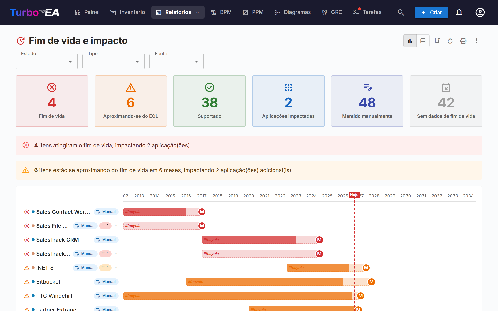

O **Relatório de EOL** mostra o status de suporte de produtos tecnológicos vinculados através do recurso de [Administração de EOL](../admin/eol.md):

- **Distribuição de status** — Quantos produtos estão Suportados, Aproximando-se do EOL ou em Fim de Vida
- **Linha do tempo** — Quando os produtos perderão suporte
- **Priorização de risco** — Foque em componentes de missão crítica que se aproximam do EOL
- **Sem dados de fim de vida** — Aplicações e componentes de TI sem ligação ao endoflife.date nem data de fim de vida própria. São listados com o estado **Sem dados de fim de vida**; carregue no bloco com o mesmo nome para mostrar apenas esses e carregue novamente para trazer os restantes de volta. Uma data mantida à mão no ciclo de vida conta como registada, pelo que um componente já avaliado não reaparece aqui.

## Relatórios Salvos

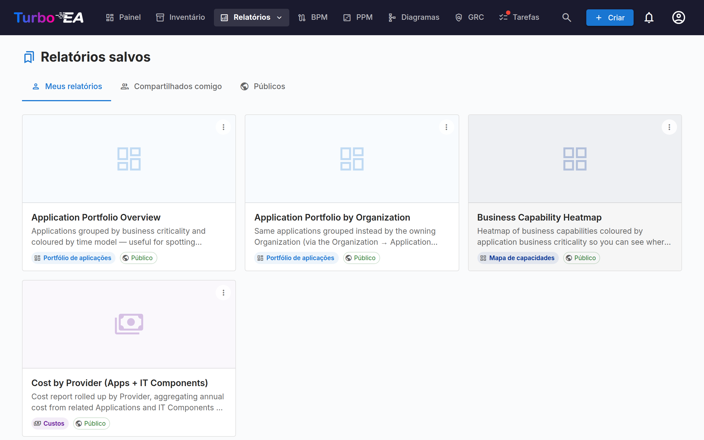

Salve qualquer configuração de relatório para acesso rápido posterior. Relatórios salvos incluem uma miniatura de pré-visualização e podem ser compartilhados em toda a organização.

## Exportando relatórios

Todos os relatórios suportam **Exportar para Excel (.xlsx)** e **Exportar para PowerPoint (.pptx)** a partir do menu **⋮** na barra de título (ao lado de Imprimir e Copiar link).

- **Excel** — Gera uma planilha por tabela de dados atualmente exibida, com colunas dimensionadas automaticamente e formatação de moeda / número preservada. Alterne para a **visualização de tabela** antes de exportar para capturar as linhas subjacentes.
- **PowerPoint** — Gera uma apresentação cujo primeiro slide combina o título do relatório, o carimbo de data/hora de geração, o resumo dos filtros ativos e o gráfico ao vivo em qualidade de apresentação. Os slides seguintes paginam as tabelas de dados em entregas compartilháveis.

Os filtros e agrupamentos ativos no momento da exportação são registrados no slide de título ou no cabeçalho, mantendo as exportações autoexplicativas.

## Mapa de Processos

O **Mapa de Processos** visualiza o cenário de processos de negócio da organização como um mapa estruturado, mostrando categorias de processos (Gestão, Core, Suporte) e seus relacionamentos hierárquicos.

**Limitar a processos específicos** — O chip ao lado de *Profundidade de visualização* abre um seletor: escolha um ou mais processos e o mapa mostra apenas esses e tudo o que está abaixo deles. Os subprocessos são incluídos automaticamente e a **Profundidade de visualização** conta a partir da sua seleção. O zoom por clique continua a funcionar, agora dentro do âmbito. É um controlo diferente da linha **Âmbito** abaixo, que filtra por Organização ou Contexto de Negócio relacionado.
