# Отчёты

Turbo EA включает мощный модуль **визуальной отчётности**, позволяющий анализировать корпоративную архитектуру с разных перспектив. Все отчёты можно [сохранить для повторного использования](saved-reports.md) с текущей конфигурацией фильтров и осей.

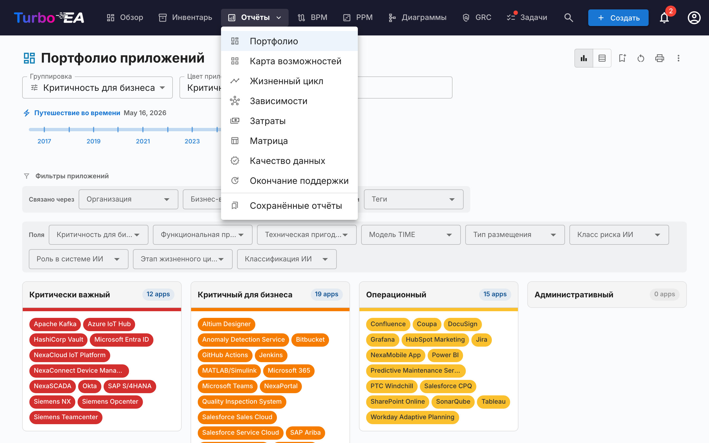

## Портфельный отчёт

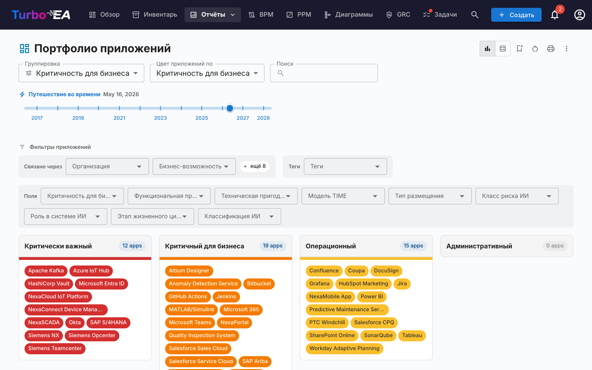

**Портфельный отчёт** отображает настраиваемую **пузырьковую диаграмму** (или диаграмму рассеяния) ваших карточек. Вы выбираете, что представляет каждая ось:

- **Ось X** — выберите любое числовое поле или поле выбора (например, Техническая пригодность)
- **Ось Y** — выберите любое числовое поле или поле выбора (например, Критичность для бизнеса)
- **Размер пузырька** — привяжите к числовому полю (например, Ежегодные затраты)
- **Цвет пузырька** — привяжите к полю выбора или фазе жизненного цикла

Это идеально подходит для портфельного анализа — например, размещение приложений по бизнес-ценности и технической пригодности для выявления кандидатов на инвестирование, замену или вывод из эксплуатации.

### ИИ-аналитика портфеля

Когда ИИ настроен и аналитика портфеля включена администратором, в портфельном отчёте отображается кнопка **ИИ-аналитика**. При нажатии сводка текущего представления отправляется провайдеру ИИ, который возвращает стратегические выводы о рисках концентрации, возможностях модернизации, проблемах жизненного цикла и сбалансированности портфеля. Панель аналитики можно свернуть и пересоздать после изменения фильтров или группировки.

## Гибкое портфолио

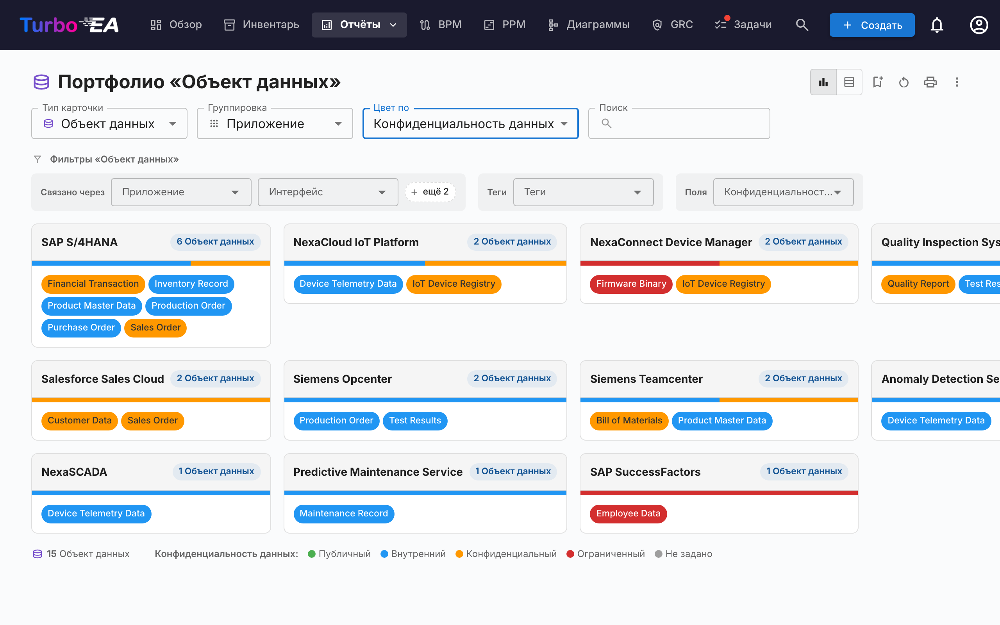

**Гибкое портфолио** использует те же элементы управления, что и Портфолио приложений, но добавляет селектор **Тип карточки** в верхней части панели инструментов. Используйте его для анализа портфолио Бизнес-возможностей, Инициатив, ИТ-компонентов или любого другого видимого типа карточек с той же логикой группировки, окрашивания и фильтрации.

На скриншоте показан типичный сценарий: выберите **Объект данных** в качестве типа карточки, **Группировка → Приложение**, чтобы увидеть, какое приложение владеет какими данными, и **Цвет по → Конфиденциальность данных**, чтобы сразу заметить, где находятся конфиденциальные данные.

При смене типа карточки сбрасываются настройки группировки, окрашивания и фильтров (они ссылаются на ключи полей, которых нет в новом типе), и отчёт перезагружается с полями, связями и тегами, применимыми к выбранному типу. Отчёт использует то же разрешение, что и Портфолио приложений (`reports.portfolio`), и сохраняется независимо от него.

### Подтипы связей

Когда связи карточки несут значение «типа» — например **тип использования** (Владелец / Пользователь / Заинтересованная сторона) у связей Организация→Приложение или **тип поддержки** у связей Приложение→Бизнес-способность — вы можете окрашивать карточки по этому значению и фильтровать по нему. **Сгруппируйте отчёт по связанному типу карточек**, чтобы использовать их (например, *Группировать по → Организация*, чтобы открыть *тип использования*): подтип появится в группе **Подтипы связей** в списке *Окрасить по* и в виде отдельной строки фильтров. Поскольку каждая карточка показана под одной связанной карточкой, она окрашивается по *этой* связи — приложение, являющееся *Пользователем* организации, отображается здесь как Пользователь, даже если оно принадлежит другой.

## Карта способностей

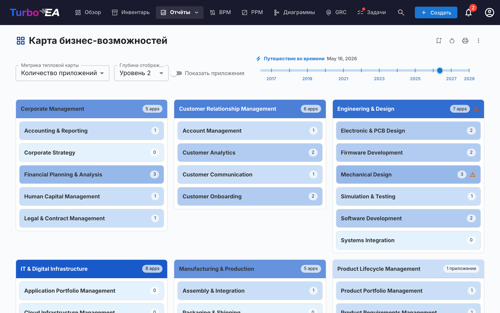

**Карта способностей** показывает иерархическую **тепловую карту** бизнес-способностей организации. Каждый блок представляет способность, с:

- **Иерархией** — основные способности содержат свои подспособности
- **Цветовой кодировкой** — блоки окрашены на основе выбранной метрики (например, количество поддерживающих приложений, среднее качество данных или уровень риска)
- **Детализацией по клику** — нажмите на любую способность для перехода к её деталям и поддерживающим приложениям

## Отчёт по жизненному циклу

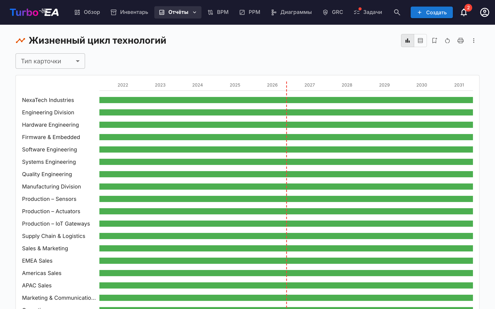

**Отчёт по жизненному циклу** показывает **временную визуализацию** того, когда технологические компоненты были введены и когда планируется их вывод из эксплуатации. Критически важен для:

- **Планирования вывода** — какие компоненты приближаются к концу жизни
- **Планирования инвестиций** — выявление пробелов, где нужна новая технология
- **Координации миграции** — визуализация перекрывающихся периодов внедрения и вывода

Компоненты отображаются в виде горизонтальных полос, охватывающих фазы жизненного цикла: Планирование, Внедрение, Активный, Вывод и Конец жизни.

## Отчёт по зависимостям

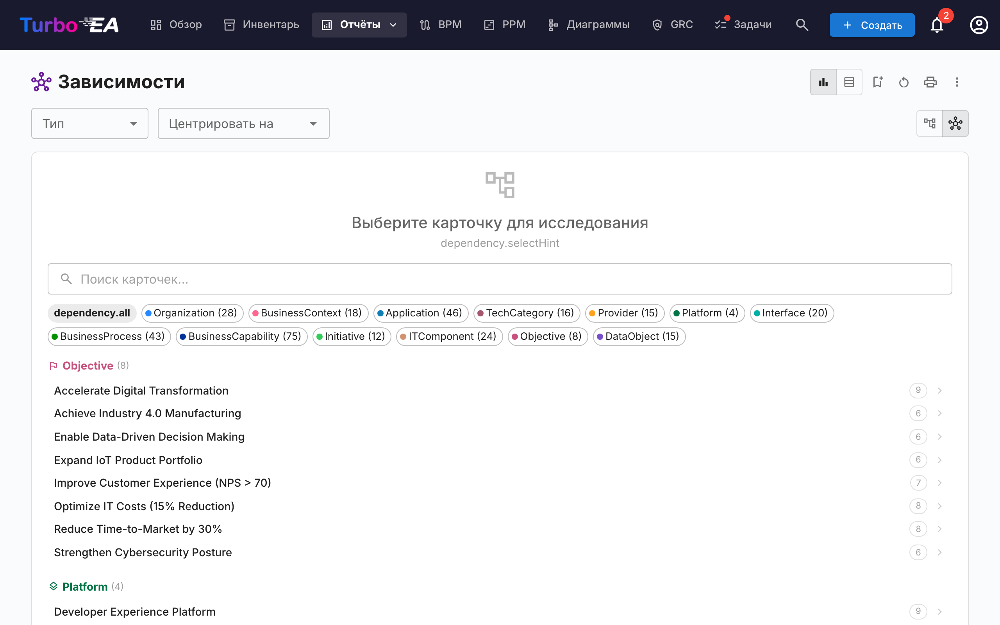

**Отчёт по зависимостям** визуализирует **связи между компонентами** в виде сетевого графа. Узлы представляют карточки, а рёбра — связи. Возможности:

- **Управление глубиной** — ограничение количества переходов от центрального узла (ограничение глубины BFS)
- **Фильтрация по типам** — отображение только определённых типов карточек и типов связей
- **Интерактивное исследование** — нажмите на любой узел, чтобы центрировать граф на этой карточке
- **Анализ влияния** — понимание радиуса воздействия изменений на конкретный компонент

### Layered Dependency View (многослойное представление зависимостей)

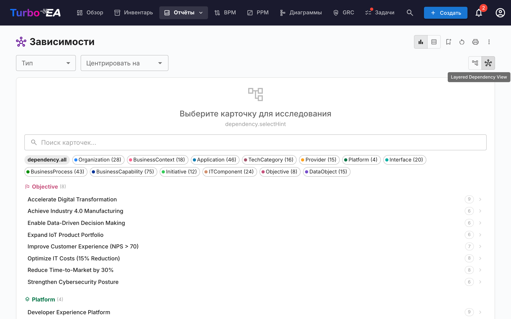

Переключитесь на **Layered Dependency View** с помощью кнопок режима просмотра на панели инструментов. Это собственная нотация Turbo EA для отображения зависимостей между карточками по четырём уровням EA — вдохновлённая принципом слоистости ArchiMate и философией «хороших значений по умолчанию» модели C4, но отличающаяся от обеих. Это же представление используется на странице сведений о карточке (показывая ближайшее окружение зависимостей карточки) и в мастере [TurboLens Architect](turbolens.md#architecture-ai), благодаря чему зависимости выглядят одинаково везде.

**Чтение диаграммы**

- **Слоистые дорожки** — Карточки группируются по архитектурному уровню (Стратегия и трансформация, Бизнес-архитектура, Приложения и данные, Техническая архитектура) внутри пунктирных ограничительных прямоугольников в фиксированном порядке.
- **Узлы, окрашенные по типу, со значками** — Каждый узел окрашен в соответствии со своим типом карточки и показывает значок типа карточки в верхнем левом углу, поэтому типы узнаются с первого взгляда даже без цвета.
- **Направленные подписанные рёбра** — Рёбра следуют направлению связи метамодели (источник → цель) и несут прямую метку связи (например, *использует*, *поддерживает*, *выполняется на*). Если связь уточнена значением (например, Тип поддержки *Ведущая*), оно отображается в квадратных скобках после метки — например *поддерживает [Ведущая]*.
- **Предложенные карточки** — В мастере TurboLens Architect ещё не зафиксированные карточки имеют пунктирную границу и зелёный значок **НОВ.**

**Исследование и навигация**

- **Перемещение, масштаб, миникарта** — Перетаскивайте холст для перемещения, прокручивайте для масштабирования и используйте миникарту для навигации по большим диаграммам.
- **Клик для просмотра** — Нажмите на любой узел, чтобы открыть боковую панель с деталями карточки.
- **Перецентрирование** — Shift+клик или долгое нажатие на карточку, чтобы центрировать диаграмму на ней; кнопки **Вернуться к выбору карточек**, **Предыдущая карточка** и **Следующая карточка** на панели инструментов перемещают вас по истории навигации.
- **Режим подсветки** — Наведите курсор на карточку, чтобы подсветить её связи; на сенсорных устройствах включите **Режим подсветки** на панели управления, чтобы подсвечивать касанием.
- **Режим расширения** — Включите **Режим расширения** на панели управления, затем нажмите на карточку, чтобы показать все её связи по требованию.
- **Показать родителя / Показать потомков** — Две точечные альтернативы режиму расширения. Включите **Показать родителя** (стрелка вверх) или **Показать потомков** (стрелка вниз) на панели управления, затем нажмите на карточку, чтобы добавить на диаграмму только её родителя в иерархии или её прямых потомков. Показанные карточки остаются на диаграмме — так можно совмещать родителей и потомков — и убираются при повторном центрировании или сбросе вида.
- **Центральная карточка не требуется** — В отчёте по зависимостям Layered Dependency View показывает все карточки, соответствующие текущему фильтру по типу, поэтому вам не нужно сначала выбирать начальную карточку.

**Настройка представления** (с панели инструментов)

- **Меню отображения карточки** — Включите подпись **типа** и **точку статуса жизненного цикла**, включите **метки иерархии** (небольшой шеврон на каждой карточке, у которой есть не показанный родитель сверху или потомки снизу — подсказка использовать инструменты показа) и выберите **дополнительные поля атрибутов** для каждой карточки — первые два отображаются на карточке, а полный набор появляется во всплывающей подсказке. Выбор запоминается между посещениями.
- **Показывать карточки с истёкшим сроком эксплуатации** — Связанные карточки, жизненный цикл которых достиг конца эксплуатации, по умолчанию скрываются, чтобы граф оставался сфокусированным; включите эту опцию (в меню **Отображение карточек**), чтобы вернуть их. Карточка, на которой выполнено центрирование, отображается всегда, даже если её собственный срок эксплуатации истёк.
- **Показывать значения связей** — Многие связи можно уточнить значением (например, приложение *поддерживает* способность как *Ведущая*, *Вспомогательная* или *Без поддержки*). Когда опция включена (по умолчанию), эти значения отображаются в квадратных скобках рядом с меткой связи (*поддерживает [Ведущая]*) и включаются в экспорт изображений. Отключите её в меню **Отображение карточек** для более чистого вида; связи без значения в любом случае остаются без изменений.
- **Перестановка** — Перетащите карточку, чтобы переместить её внутри своего уровня, или перетащите целый **блок уровня**, чтобы переместить его со всеми карточками. **Сбросить вид** (на левой панели инструментов) восстанавливает автоматическую компоновку и очищает всё исследование.
- **Фон** — Переключайте фон холста между сеткой, точками и отсутствием фона.
- **Экспорт и полный экран** — Экспортируйте диаграмму в **PNG** или **SVG** либо откройте её в **полноэкранном** режиме.
- **Создать диаграмму** — Превратите текущее представление в новую редактируемую диаграмму в [модуле «Диаграммы»](diagrams.md). Карточки, связи и четыре дорожки слоёв архитектуры воссоздаются, и каждая фигура остаётся связанной со своей карточкой инвентаря. Вам будет предложено ввести название, после чего вы сразу перейдёте к новой диаграмме. Доступно пользователям, которым разрешено создавать диаграммы.

## Отчёт по затратам

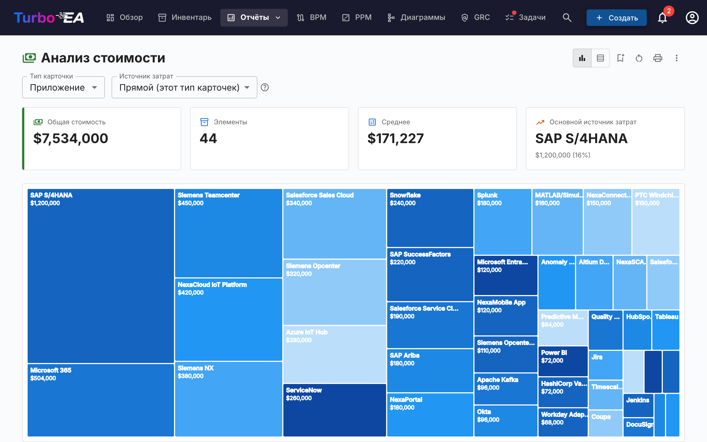

**Отчёт по затратам** предоставляет финансовый анализ вашего технологического ландшафта:

- **Древовидная карта** — вложенные прямоугольники, размер которых соответствует затратам, с возможностью группировки (например, по организации или способности)
- **Столбчатая диаграмма** — сравнение затрат по компонентам
- **Тип карточки** — выберите тип карточки, вокруг которого строится отчёт (Приложение, ИТ-компонент, Поставщик, …).

### Источник затрат

Когда у выбранного типа карточек есть хотя бы один тип отношения, ведущий к типу с полем затрат, рядом с **Типом карточки** появляется селектор **Источник затрат**. Он определяет, откуда берутся числа:

- **Прямой (этот тип карточек)** — значение по умолчанию; суммирует поле затрат на самих отображаемых карточках. Используется при прямом просмотре *Приложений* или *ИТ-компонентов*.
- **Агрегировать из связанных карточек** — отметьте одну или несколько записей «Тип · Поле» (например, «Приложение · Общая годовая стоимость», «ИТ-компонент · Общая годовая стоимость»). Значение каждой основной карточки становится суммой этого поля по её связанным карточкам.

Селектор поддерживает **множественный выбор**, поэтому одно сведение может объединять несколько связанных типов. Например, при просмотре **Поставщика** *Microsoft* одновременная отметка «Приложение · Общая годовая стоимость» и «ИТ-компонент · Общая годовая стоимость» показывает полное присутствие вендора — Teams, M365, Azure и любые другие компоненты от Microsoft — одной цифрой.

#### Почему ничего не учитывается дважды

Селектор устроен так, что двойной учёт исключён по построению:

- Каждая запись — это уникальная пара «целевой тип, поле затрат»; в списке каждая пара предлагается ровно один раз, даже если к этому целевому типу ведут несколько типов отношений.
- В пределах одной пары две карточки, связанные несколькими типами отношений, всё равно вносят свою стоимость только один раз.
- Между разными записями ни одна карточка не может вносить вклад дважды: у карточки ровно один тип, а различные поля затрат на одной и той же карточке — независимые значения.

Маленькая **иконка справки (?)** рядом с селектором повторяет эту гарантию при наведении мыши.

Список вариантов формируется из вашей метамодели — типы отношений и поля затрат определяются во время отрисовки, поэтому любой пользовательский тип карточек или отношение, которые вы добавите, автоматически становятся допустимым Источником затрат.

### Детализация прямоугольника

Если активен хотя бы один Источник затрат, прямоугольники тримап-карты становятся **кликабельными**. Клик заменяет диаграмму разбиением затрат этого прямоугольника — связанные карточки, которые внесли вклад в его агрегат, с размером по их прямой стоимости. Над диаграммой появляются хлебные крошки, например **Все Приложения › NexaCore ERP** — кликните по любому сегменту, чтобы вернуться на уровень выше.

- **Активен один Источник затрат** — детализация показывает одну тримап-карту связанных карточек (например, клик по *NexaCore ERP* при отмеченном «ИТ-компонент · Годовая стоимость» покажет ИТ-компоненты, связанные с NexaCore ERP, с размером по их годовой стоимости).
- **Активны несколько Источников затрат** — детализация показывает **по одной тримап-карте на источник рядом** (1 колонка на узких экранах, 2 на широких). У каждой панели свой заголовок, свой итог и свой «% от итога» в подсказке — так разные типы карточек остаются в своих масштабах, а не сжимаются в одну диаграмму.

Слайдер временной шкалы, выбор Источника затрат и другие фильтры сохраняются при детализации, а уровень детализации входит в конфигурацию сохранённого отчёта — если сохранить отчёт в детализированном виде, при следующем открытии он откроется именно на этом уровне. Если ни один Источник затрат не активен, клик по прямоугольнику открывает боковую панель карточки (раскладывать нечего).

## Матричный отчёт

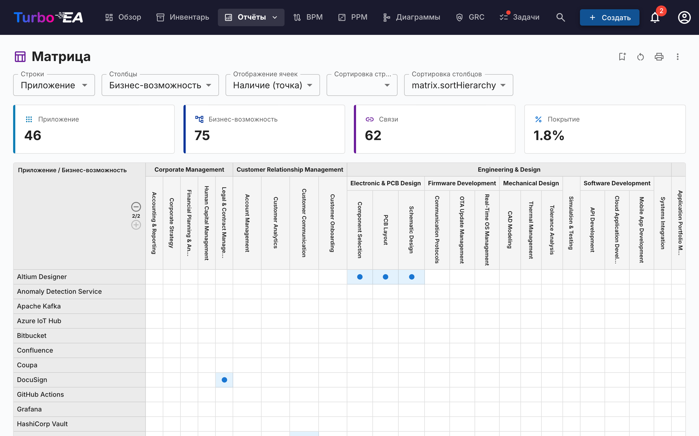

**Матричный отчёт** создаёт **перекрёстную таблицу** между двумя типами карточек. Например:

- **Строки** — Приложения
- **Столбцы** — Бизнес-способности
- **Ячейки** — указывают, существует ли связь (и сколько)

Это полезно для выявления пробелов в покрытии (способности без поддерживающих приложений) или избыточности (способности, поддерживаемые слишком многими приложениями).

## Отчёт по качеству данных

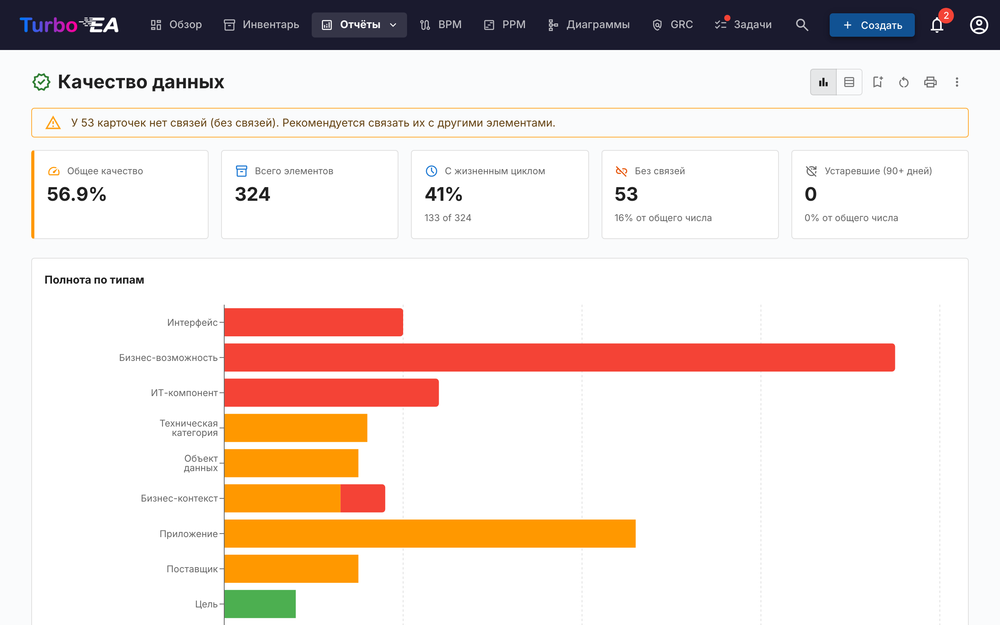

**Отчёт по качеству данных** — это **панель полноты**, показывающая, насколько хорошо заполнены ваши архитектурные данные. На основе уровней важности, настроенных на вкладке **Качество данных** каждого типа карточки (каждое поле, а также встроенные факторы «Описание», «Жизненный цикл», «Обязательные связи» и «Обязательные теги»):

- **Общая оценка** — среднее качество данных по всем карточкам
- **По типам** — разбивка, показывающая, какие типы карточек имеют лучшую/худшую полноту
- **Отдельные карточки** — список карточек с наименьшим качеством данных, приоритизированных для улучшения

## Отчёт по окончанию жизненного цикла (EOL)

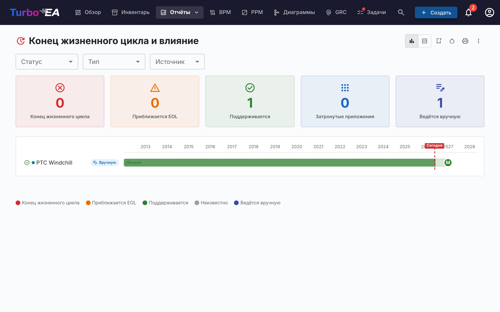

**Отчёт по EOL** показывает статус поддержки технологических продуктов, привязанных через функцию [Администрирование EOL](../admin/eol.md):

- **Распределение статусов** — сколько продуктов поддерживается, приближается к EOL или достигло конца жизни
- **Временная шкала** — когда продукты потеряют поддержку
- **Приоритизация рисков** — фокус на критически важных компонентах, приближающихся к EOL

## Сохранённые отчёты

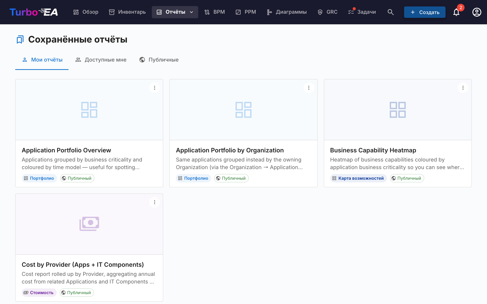

Сохраняйте любую конфигурацию отчёта для быстрого доступа позже. Сохранённые отчёты включают предварительный просмотр в виде миниатюры и могут быть доступны всей организации.

## Экспорт отчётов

Каждый отчёт поддерживает **Экспорт в Excel (.xlsx)** и **Экспорт в PowerPoint (.pptx)** через меню **⋮** в заголовке (рядом с «Печать» и «Копировать ссылку»).

- **Excel** — формирует отдельный лист для каждой отображаемой таблицы данных с автоматическим подбором ширины столбцов и сохранением форматирования валют и чисел. Перед экспортом переключитесь в **табличный вид**, чтобы выгрузить базовые строки.
- **PowerPoint** — создаёт презентацию, на первом слайде которой объединены заголовок отчёта, время формирования, сводка активных фильтров и живая диаграмма в презентационном качестве. Последующие слайды автоматически разбивают таблицы данных для удобной раздачи.

Активные на момент экспорта фильтры и группировки фиксируются на титульном слайде или в заголовке, благодаря чему экспортированный файл понятен без дополнительного контекста.

## Карта процессов

**Карта процессов** визуализирует ландшафт бизнес-процессов организации в виде структурированной карты, показывающей категории процессов (Управление, Основные, Поддержка) и их иерархические взаимосвязи.
