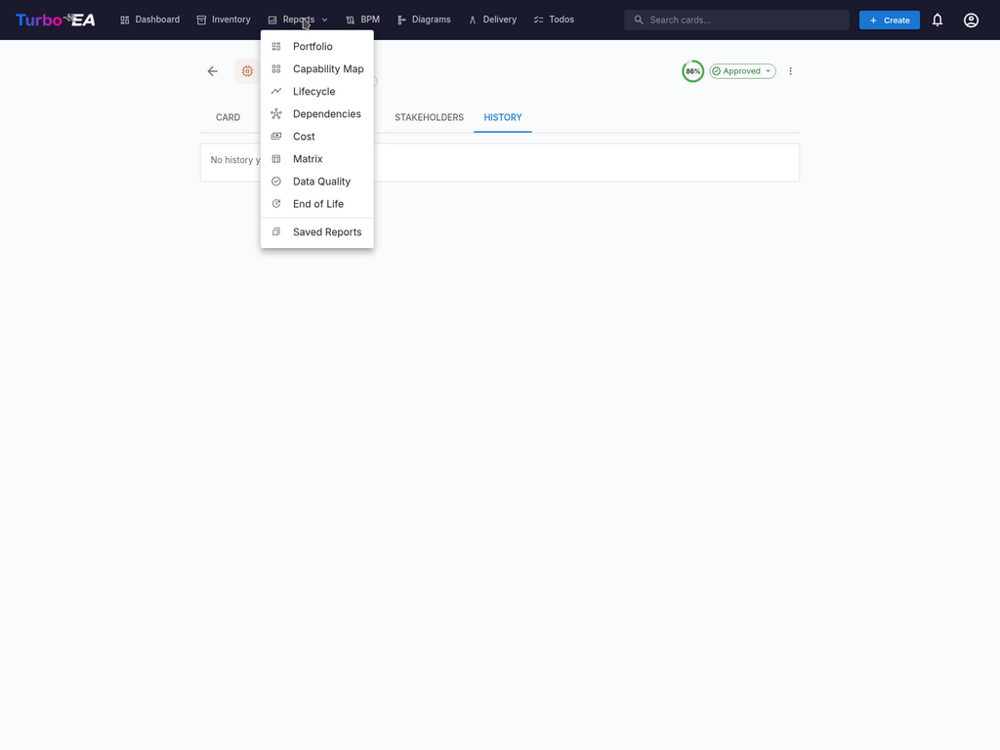
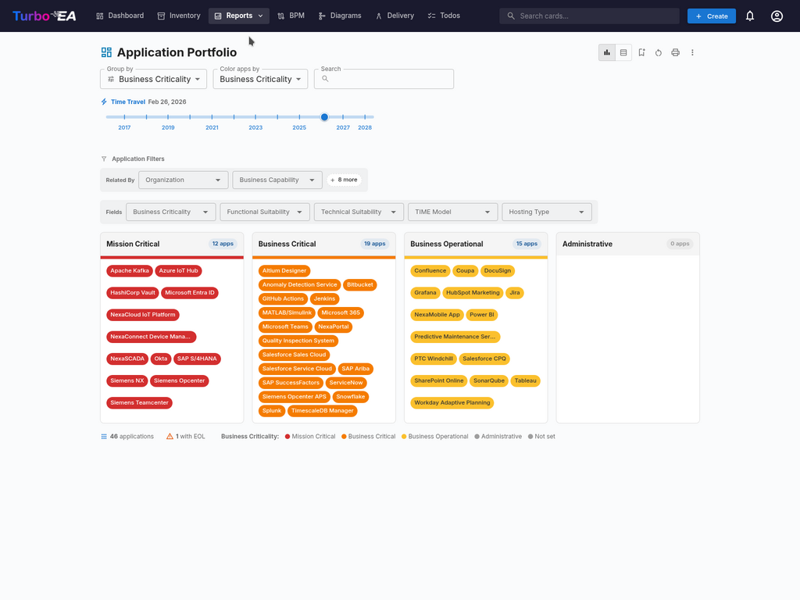
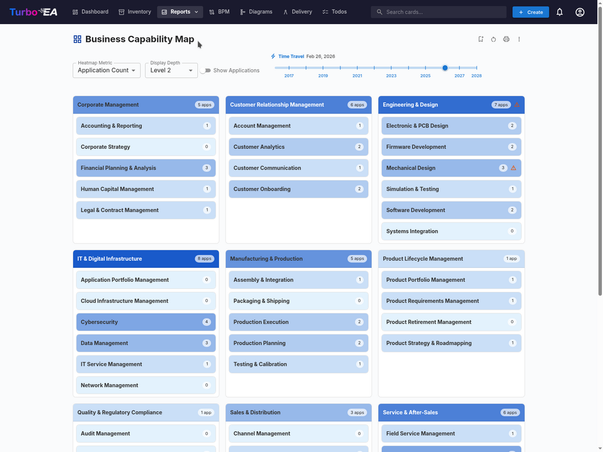
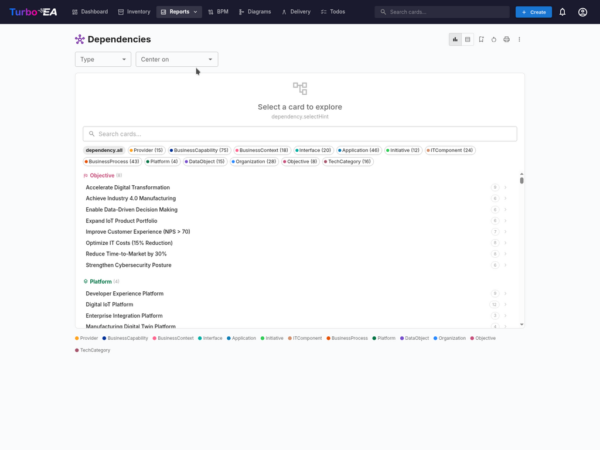

# Отчёты

Turbo EA включает мощный модуль **визуальной отчётности**, позволяющий анализировать корпоративную архитектуру с разных перспектив. Все отчёты можно [сохранить для повторного использования](saved-reports.md) с текущей конфигурацией фильтров и осей.

## Портфельный отчёт

**Портфельный отчёт** отображает настраиваемую **пузырьковую диаграмму** (или диаграмму рассеяния) ваших карточек. Вы выбираете, что представляет каждая ось:

- **Ось X** — выберите любое числовое поле или поле выбора (например, Техническая пригодность)
- **Ось Y** — выберите любое числовое поле или поле выбора (например, Критичность для бизнеса)
- **Размер пузырька** — привяжите к числовому полю (например, Ежегодные затраты)
- **Цвет пузырька** — привяжите к полю выбора или фазе жизненного цикла

Это идеально подходит для портфельного анализа — например, размещение приложений по бизнес-ценности и технической пригодности для выявления кандидатов на инвестирование, замену или вывод из эксплуатации.

### ИИ-аналитика портфеля

Когда ИИ настроен и аналитика портфеля включена администратором, в портфельном отчёте отображается кнопка **ИИ-аналитика**. При нажатии сводка текущего представления отправляется провайдеру ИИ, который возвращает стратегические выводы о рисках концентрации, возможностях модернизации, проблемах жизненного цикла и сбалансированности портфеля. Панель аналитики можно свернуть и пересоздать после изменения фильтров или группировки.

## Карта способностей

**Карта способностей** показывает иерархическую **тепловую карту** бизнес-способностей организации. Каждый блок представляет способность, с:

- **Иерархией** — основные способности содержат свои подспособности
- **Цветовой кодировкой** — блоки окрашены на основе выбранной метрики (например, количество поддерживающих приложений, среднее качество данных или уровень риска)
- **Детализацией по клику** — нажмите на любую способность для перехода к её деталям и поддерживающим приложениям

## Отчёт по жизненному циклу

**Отчёт по жизненному циклу** показывает **временную визуализацию** того, когда технологические компоненты были введены и когда планируется их вывод из эксплуатации. Критически важен для:

- **Планирования вывода** — какие компоненты приближаются к концу жизни
- **Планирования инвестиций** — выявление пробелов, где нужна новая технология
- **Координации миграции** — визуализация перекрывающихся периодов внедрения и вывода

Компоненты отображаются в виде горизонтальных полос, охватывающих фазы жизненного цикла: Планирование, Внедрение, Активный, Вывод и Конец жизни.

## Отчёт по зависимостям

**Отчёт по зависимостям** визуализирует **связи между компонентами** в виде сетевого графа. Узлы представляют карточки, а рёбра — связи. Возможности:

- **Управление глубиной** — ограничение количества переходов от центрального узла (ограничение глубины BFS)
- **Фильтрация по типам** — отображение только определённых типов карточек и типов связей
- **Интерактивное исследование** — нажмите на любой узел, чтобы центрировать граф на этой карточке
- **Анализ влияния** — понимание радиуса воздействия изменений на конкретный компонент

### Представление диаграммы C4

Переключитесь на представление **Диаграмма C4** с помощью кнопок режима просмотра на панели инструментов. Оно отображает те же данные о зависимостях в нотации C4:

- **Ограничительные рамки** — Карточки группируются по архитектурному уровню (Стратегия, Бизнес, Приложения, Технологии) внутри пунктирных ограничительных прямоугольников
- **Интерактивный холст** — Перемещайте, масштабируйте и используйте миникарту для навигации по большим диаграммам
- **Клик для просмотра** — Нажмите на любой узел, чтобы открыть боковую панель с деталями карточки
- **Центральная карточка не требуется** — Представление C4 показывает все карточки, соответствующие текущему фильтру по типу

## Отчёт по затратам

**Отчёт по затратам** предоставляет финансовый анализ вашего технологического ландшафта:

- **Древовидная карта** — вложенные прямоугольники, размер которых соответствует затратам, с возможностью группировки (например, по организации или способности)
- **Столбчатая диаграмма** — сравнение затрат по компонентам
- **Агрегация** — затраты могут суммироваться из связанных карточек с помощью вычисляемых полей

## Матричный отчёт

**Матричный отчёт** создаёт **перекрёстную таблицу** между двумя типами карточек. Например:

- **Строки** — Приложения
- **Столбцы** — Бизнес-способности
- **Ячейки** — указывают, существует ли связь (и сколько)

Это полезно для выявления пробелов в покрытии (способности без поддерживающих приложений) или избыточности (способности, поддерживаемые слишком многими приложениями).

## Отчёт по качеству данных

**Отчёт по качеству данных** — это **панель полноты**, показывающая, насколько хорошо заполнены ваши архитектурные данные. На основе весов полей, настроенных в метамодели:

- **Общая оценка** — среднее качество данных по всем карточкам
- **По типам** — разбивка, показывающая, какие типы карточек имеют лучшую/худшую полноту
- **Отдельные карточки** — список карточек с наименьшим качеством данных, приоритизированных для улучшения

## Отчёт по окончанию жизненного цикла (EOL)

**Отчёт по EOL** показывает статус поддержки технологических продуктов, привязанных через функцию [Администрирование EOL](../admin/eol.md):

- **Распределение статусов** — сколько продуктов поддерживается, приближается к EOL или достигло конца жизни
- **Временная шкала** — когда продукты потеряют поддержку
- **Приоритизация рисков** — фокус на критически важных компонентах, приближающихся к EOL

## Сохранённые отчёты

Сохраняйте любую конфигурацию отчёта для быстрого доступа позже. Сохранённые отчёты включают предварительный просмотр в виде миниатюры и могут быть доступны всей организации.

## Карта процессов

**Карта процессов** визуализирует ландшафт бизнес-процессов организации в виде структурированной карты, показывающей категории процессов (Управление, Основные, Поддержка) и их иерархические взаимосвязи.
